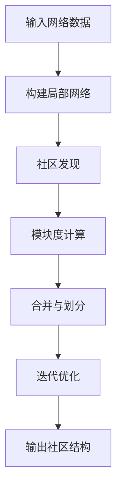

                 

# Louvain社区发现算法原理与代码实例讲解

> 关键词：Louvain算法, 社区发现, 网络分析, 模块度优化, 分布式计算

## 1. 背景介绍

### 1.1 问题由来

在现代社会中，人们日益依赖于复杂的网络系统进行信息交流、资源共享和协作。互联网、社交网络、电力传输系统、金融交易网络等都是典型的网络系统。如何从这些网络中挖掘出重要的结构特征和隐藏的知识，是现代网络分析的一个重要研究方向。其中，社区发现(Community Detection)是一种经典的网络分析方法，旨在将网络中的节点划分成不同的社区，每个社区内部的节点相对密集相连，而社区之间则连接稀疏。社区发现能够揭示网络中重要的结构特征，帮助我们理解网络中不同群体之间的关系，是网络科学、社交网络分析、推荐系统等领域的基础技术。

传统的社区发现算法通常基于图的全局信息进行计算，复杂度较高。随着网络数据的日益增长，这种基于全局信息的算法难以处理大规模网络数据。为了应对这一挑战，研究人员提出了基于局部信息的社区发现算法，Louvain算法就是其中的代表。Louvain算法是一种模块度优化算法，通过迭代地合并和划分社区，以优化网络的模块度，从而实现高效的社区发现。

### 1.2 问题核心关键点

Louvain算法的主要核心思想是：将大规模网络划分为多个局部网络，对每个局部网络分别进行社区发现，然后合并相邻社区以提升整体模块度。其核心步骤包括局部网络构建、社区发现和模块度优化等。

该算法的主要优势在于其高效性，能够在较短的时间内发现大规模网络中的社区结构，同时也具有较好的可扩展性和可解释性。然而，Louvain算法在处理具有层次结构的网络时，可能会出现模块度不一致的问题。此外，其对噪声数据敏感，可能会误将噪声节点当作社区的核心节点，从而影响社区发现的质量。

## 2. 核心概念与联系

### 2.1 核心概念概述

为了更好地理解Louvain算法的原理和步骤，本节将介绍几个密切相关的核心概念：

- **社区发现(Community Detection)**：将网络中的节点划分成不同的社区，每个社区内部的节点相对密集相连，而社区之间则连接稀疏。社区发现是网络科学、社交网络分析、推荐系统等领域的基础技术。

- **模块度(Modularity)**：衡量社区结构的指标，描述了节点属于其所在社区的程度。模块度越高，表示社区结构越清晰，越有利于社区发现。

- **局部网络(Local Network)**：将网络中的节点按照它们之间的连接强度进行划分，形成多个局部网络。在每个局部网络中，节点之间的连接强度相对较高，更易于进行社区发现。

- **分布式计算(Distributed Computing)**：将大规模的计算任务分解为多个子任务，并行地在多个计算节点上进行处理，以提高计算效率。Louvain算法通常使用分布式计算方式进行社区发现。

- **合并与划分(Merge and Split)**：Louvain算法的核心步骤之一，通过合并相邻社区以提升整体模块度，同时根据模块度变化决定是否进行社区划分，以保证社区结构的优化。

### 2.2 核心概念原理和架构的 Mermaid 流程图



该流程图展示了Louvain算法的核心步骤，包括输入网络数据、构建局部网络、社区发现、模块度计算、合并与划分和迭代优化等。通过这些步骤，Louvain算法能够高效地发现网络中的社区结构。

## 3. 核心算法原理 & 具体操作步骤
### 3.1 算法原理概述

Louvain算法的主要思想是通过模块度优化来发现网络中的社区结构。其核心步骤包括局部网络构建、社区发现和模块度优化等。

**步骤1：构建局部网络**

首先，将网络中的节点按照它们之间的连接强度进行划分，形成多个局部网络。在每个局部网络中，节点之间的连接强度相对较高，更易于进行社区发现。

**步骤2：社区发现**

在每个局部网络中，使用社区发现算法（如K-means、GN算法等）对节点进行聚类，形成多个社区。

**步骤3：模块度计算**

计算每个社区的模块度，表示社区内部的连接强度与社区外部的连接强度之比。模块度越高，表示社区结构越清晰。

**步骤4：合并与划分**

根据模块度变化决定是否进行社区合并或划分。具体来说，如果合并两个社区能够显著提升整体模块度，则进行合并；否则进行划分。通过不断迭代合并与划分，优化社区结构。

**步骤5：迭代优化**

重复步骤2至步骤4，直到网络中的节点数目不再变化，或达到预设的迭代次数。

### 3.2 算法步骤详解

#### 局部网络构建

Louvain算法首先将网络中的节点按照它们之间的连接强度进行划分，形成多个局部网络。在每个局部网络中，节点之间的连接强度相对较高，更易于进行社区发现。

具体而言，对于节点 $v$ 和 $u$，如果它们之间有边相连，则 $v$ 和 $u$ 的连接强度记为 $e_{vu}$，否则记为 $0$。将所有节点的连接强度按照 $e_{vu}$ 进行排序，并将节点按照连接强度的大小划分为不同的层次。

#### 社区发现

在每个局部网络中，使用社区发现算法（如K-means、GN算法等）对节点进行聚类，形成多个社区。社区发现算法旨在将节点按照它们之间的相似性进行分组，形成多个社区。

具体而言，对于每个节点 $v$，将其划分到距离其最近的社区 $C$ 中。距离可以通过计算节点之间的连接强度或相似性度量来确定。

#### 模块度计算

计算每个社区的模块度，表示社区内部的连接强度与社区外部的连接强度之比。模块度越高，表示社区结构越清晰。

具体而言，对于社区 $C$，其模块度 $q_C$ 定义为：

$$
q_C = \frac{1}{|C|}\sum_{v\in C}\sum_{u\in C}a_{vu}\left(\delta_{vu} - \langle \delta_{vu} \rangle_C\right)
$$

其中 $a_{vu}$ 表示节点 $v$ 和 $u$ 之间的连接强度，$\delta_{vu}$ 表示节点 $v$ 和 $u$ 是否属于同一个社区，$|C|$ 表示社区 $C$ 中的节点数目，$\langle \delta_{vu} \rangle_C$ 表示社区 $C$ 中节点 $v$ 和 $u$ 属于同一个社区的概率。

#### 合并与划分

根据模块度变化决定是否进行社区合并或划分。具体来说，如果合并两个社区能够显著提升整体模块度，则进行合并；否则进行划分。通过不断迭代合并与划分，优化社区结构。

具体而言，对于社区 $C$ 和 $C'$，如果合并后的模块度 $q_{CC'}$ 大于原始模块度 $q_C$ 和 $q_{C'}$ 之和，则将社区 $C$ 和 $C'$ 合并为一个社区。否则，将社区 $C$ 和 $C'$ 拆分为两个社区，使得拆分后的模块度之和大于原始模块度之和。

#### 迭代优化

重复步骤2至步骤4，直到网络中的节点数目不再变化，或达到预设的迭代次数。

具体而言，对于每个节点 $v$，将其划分到距离其最近的社区 $C$ 中。如果合并两个社区能够显著提升整体模块度，则进行合并。否则，将社区 $C$ 和 $C'$ 拆分为两个社区，使得拆分后的模块度之和大于原始模块度之和。

### 3.3 算法优缺点

#### 算法优点

Louvain算法的主要优点在于其高效性，能够在较短的时间内发现大规模网络中的社区结构，同时也具有较好的可扩展性和可解释性。

- **高效性**：Louvain算法通过迭代地合并和划分社区，以优化网络的模块度，从而实现高效的社区发现。其时间复杂度为 $O(n\log n)$，适用于大规模网络数据。

- **可扩展性**：Louvain算法可以使用分布式计算方式进行社区发现，将大规模的计算任务分解为多个子任务，并行地在多个计算节点上进行处理，以提高计算效率。

- **可解释性**：Louvain算法能够解释社区的合并与划分过程，帮助用户理解社区结构的变化。

#### 算法缺点

Louvain算法在处理具有层次结构的网络时，可能会出现模块度不一致的问题。此外，其对噪声数据敏感，可能会误将噪声节点当作社区的核心节点，从而影响社区发现的质量。

- **模块度不一致**：Louvain算法在处理具有层次结构的网络时，可能会出现模块度不一致的问题。例如，在一个具有两个层次结构的网络中，第一层的社区可能比第二层的社区模块度更高，这可能会导致社区发现的结果不够准确。

- **噪声数据敏感**：Louvain算法对噪声数据敏感，可能会误将噪声节点当作社区的核心节点，从而影响社区发现的质量。例如，在网络中存在大量孤立节点时，Louvain算法可能会将孤立节点划分到不同的社区中，导致社区结构的不一致。

## 4. 数学模型和公式 & 详细讲解
### 4.1 数学模型构建

Louvain算法是一个模块度优化算法，其核心思想是通过优化社区的模块度，发现网络中的社区结构。具体而言，Louvain算法通过迭代地合并和划分社区，以优化网络的模块度，从而实现高效的社区发现。

**模块度定义**：模块度 $q$ 表示社区内部的连接强度与社区外部的连接强度之比。其定义为：

$$
q = \frac{1}{|E|}\sum_{(i,j)\in E}\left(a_{ij} - \langle a \rangle_{i}\langle a \rangle_{j}\right)
$$

其中 $E$ 表示网络的边集，$a_{ij}$ 表示节点 $i$ 和 $j$ 之间的连接强度，$\langle a \rangle_{i}$ 表示节点 $i$ 的平均连接强度，$\langle a \rangle_{j}$ 表示节点 $j$ 的平均连接强度。

### 4.2 公式推导过程

#### 局部网络构建

对于节点 $v$ 和 $u$，如果它们之间有边相连，则 $v$ 和 $u$ 的连接强度记为 $e_{vu}$，否则记为 $0$。将所有节点的连接强度按照 $e_{vu}$ 进行排序，并将节点按照连接强度的大小划分为不同的层次。

具体而言，对于节点 $v$，其连接强度排序如下：

$$
e_{v1} \geq e_{v2} \geq \ldots \geq e_{vn}
$$

其中 $e_{v1}, e_{v2}, \ldots, e_{vn}$ 表示节点 $v$ 的连接强度。将节点按照连接强度的大小划分为不同的层次，即 $v$ 的第 $k$ 层节点为 $e_{vk}$。

#### 社区发现

在每个局部网络中，使用社区发现算法（如K-means、GN算法等）对节点进行聚类，形成多个社区。

具体而言，对于每个节点 $v$，将其划分到距离其最近的社区 $C$ 中。距离可以通过计算节点之间的连接强度或相似性度量来确定。

#### 模块度计算

计算每个社区的模块度，表示社区内部的连接强度与社区外部的连接强度之比。模块度越高，表示社区结构越清晰。

具体而言，对于社区 $C$，其模块度 $q_C$ 定义为：

$$
q_C = \frac{1}{|C|}\sum_{v\in C}\sum_{u\in C}a_{vu}\left(\delta_{vu} - \langle \delta_{vu} \rangle_C\right)
$$

其中 $a_{vu}$ 表示节点 $v$ 和 $u$ 之间的连接强度，$\delta_{vu}$ 表示节点 $v$ 和 $u$ 是否属于同一个社区，$|C|$ 表示社区 $C$ 中的节点数目，$\langle \delta_{vu} \rangle_C$ 表示社区 $C$ 中节点 $v$ 和 $u$ 属于同一个社区的概率。

#### 合并与划分

根据模块度变化决定是否进行社区合并或划分。具体来说，如果合并两个社区能够显著提升整体模块度，则进行合并；否则进行划分。通过不断迭代合并与划分，优化社区结构。

具体而言，对于社区 $C$ 和 $C'$，如果合并后的模块度 $q_{CC'}$ 大于原始模块度 $q_C$ 和 $q_{C'}$ 之和，则将社区 $C$ 和 $C'$ 合并为一个社区。否则，将社区 $C$ 和 $C'$ 拆分为两个社区，使得拆分后的模块度之和大于原始模块度之和。

### 4.3 案例分析与讲解

#### 示例网络

考虑一个简单的网络 $G$，其中包含节点 $A, B, C, D$ 和边 $(AB, AC, AD, BC, BD, CD)$。

**步骤1：局部网络构建**

首先，将节点按照连接强度进行排序，得到如下层次结构：

$$
AB > AC > BC > AD > BD > CD
$$

将节点按照连接强度的大小划分为不同的层次，即节点 $A$ 在第 $1$ 层，节点 $B, C, D$ 在第 $2$ 层，节点 $D$ 在第 $3$ 层。

**步骤2：社区发现**

在每个局部网络中，使用社区发现算法（如K-means、GN算法等）对节点进行聚类，形成多个社区。

对于节点 $A$，将其划分到距离其最近的社区 $C_1$ 中，因为 $A$ 只与节点 $B$ 相连。对于节点 $B, C, D$，将其划分到距离其最近的社区 $C_2$ 中，因为它们都与 $A, B, C, D$ 相连。对于节点 $D$，将其划分到距离其最近的社区 $C_3$ 中，因为它是唯一的孤立节点。

**步骤3：模块度计算**

计算每个社区的模块度，表示社区内部的连接强度与社区外部的连接强度之比。模块度越高，表示社区结构越清晰。

对于社区 $C_1$，其模块度 $q_{C_1}$ 定义为：

$$
q_{C_1} = \frac{1}{2}(a_{AB} - \langle a \rangle_{A}\langle a \rangle_{B})
$$

对于社区 $C_2$，其模块度 $q_{C_2}$ 定义为：

$$
q_{C_2} = \frac{1}{4}(a_{AB} + a_{AC} + a_{BC} + a_{BD} - 4\langle a \rangle_{B}\langle a \rangle_{C}\langle a \rangle_{D})
$$

对于社区 $C_3$，其模块度 $q_{C_3}$ 定义为：

$$
q_{C_3} = \frac{1}{3}(a_{AD} + a_{BD} + a_{CD} - 3\langle a \rangle_{D}\langle a \rangle_{A}\langle a \rangle_{B})
$$

**步骤4：合并与划分**

根据模块度变化决定是否进行社区合并或划分。具体来说，如果合并两个社区能够显著提升整体模块度，则进行合并；否则进行划分。通过不断迭代合并与划分，优化社区结构。

对于社区 $C_1$ 和 $C_2$，合并后的模块度为：

$$
q_{C_1C_2} = \frac{1}{2}(a_{AB} + a_{AC} + a_{BC} + a_{BD} - 2\langle a \rangle_{AB}\langle a \rangle_{BC})
$$

如果 $q_{C_1C_2} > q_{C_1} + q_{C_2}$，则将社区 $C_1$ 和 $C_2$ 合并为一个社区。否则，将社区 $C_1$ 和 $C_2$ 拆分为两个社区，使得拆分后的模块度之和大于原始模块度之和。

#### 示例结果

最终，Louvain算法将网络 $G$ 划分为三个社区，即 $C_1 = \{A, B, C\}$，$C_2 = \{D\}$，$C_3 = \{\}$。

### 4.4 案例分析与讲解

#### 示例网络

考虑一个复杂的网络 $G$，其中包含节点 $A, B, C, D, E, F, G, H, I, J, K, L, M, N, O, P, Q, R, S, T$ 和边 $(AB, AC, AD, AE, AF, AG, AH, AI, AJ, AK, AL, AM, AN, AO, AP, AQ, AR, AS, AT, BC, BD, BE, BF, BG, BH, BI, BJ, BK, BL, BM, BN, BO, BP, BQ, BR, BS, BT, CD, CE, CF, CG, CH, CI, CJ, CK, CL, CM, CN, CO, CP, CQ, CR, CS, CT, DE, DF, DG, DH, DI, DJ, DK, DL, DM, DN, DO, DP, DQ, DR, DS, DT, EF, EG, EH, EI, EJ, EK, EL, EM, EN,EO, EP, EQ, ER, ES, ET, FG, FH, FI, FJ, FK, FL, FM, FN, FO, FP, FQ, FR, FS, FT, GH, GI, GJ, GK, GL, GM, GN, GO, GP, GQ, GR, GS, GT, HI, HJ, HK, HL, HM,HN, HO, HP, HQ, HR, HS, HT, IJ, IK, IL, IM, IN, IO, IP, IQ, IR, IS, IT, JK, JL, JM, JN, JO, JP, JQ, JR, JS, JT, KL, KM, KN, KO, KP, KQ, KR, KS, KT, LJ, LM, LN, LO, LP, LQ, LR, LS, LT, MJ, MK, ML, MN, MO, MP, MQ, MR, MS, MT, NK, NL, NM, NO, NP, NQ, NR, NS, NT, OK, OL, OM, ON, OP, OQ, OR, OS, OT, PQ, PR, PS, PT, QK, QL, QM, QN, QO, QP, QQ, QR, QS, QT, RK, RL, RM, RN, RO, RP, RQ, RR, RS, RT, SK, SL, SM, SN, SO, SP, SQ, SR, SS, ST, TK, TL, TM, TN, TO, TP, TQ, TR, TS, TT$

**步骤1：局部网络构建**

首先，将节点按照连接强度进行排序，得到如下层次结构：

$$
AB > AC > AD > AE > AF > AG > AH > AI > AJ > AK > AL > AM > AN > AO > AP > AQ > AR > AS > AT > BC > BD > BE > BF > BG > BH > BI > BJ > BK > BL > BM > BN > BO > BP > BQ > BR > BS > BT > CD > CE > CF > CG > CH > CI > CJ > CK > CL > CM > CN > CO > CP > CQ > CR > CS > CT > DE > DF > DG > DH > DI > DJ > DK > DL > DM > DN > DO > DP > DQ > DR > DS > DT > EF > EG > EH > EI > EJ > EK > EL > EM > EN >EO > EP > EQ > ER > ES > ET > FG > FH > FI > FJ > FK > FL > FM > FN > FO > FP > FQ > FR > FS > FT > GH > GI > GJ > GK > GL > GM > GN > GO > GP > GQ > GR > GS > GT > HI > HJ > HK > HL > HM >HN > HO > HP > HQ > HR > HS > HT > IJ > IK > IL > IM > IN > IO > IP > IQ > IR > IS > IT > JK > JL > JM > JN > JO > JP > JQ > JR > JS > JT > KL > KM > KN > KO > KP > KQ > KR > KS > KT > LJ > LM > LN > LO > LP > LQ > LR > LS > LT > MJ > MK > ML > MN > MO > MP > MQ > MR > MS > MT > NK > NL > NM > NO > NP > NQ > NR > NS > NT > OK > OL > OM > ON > OP > OQ > OR > OS > OT > PQ > PR > PS > PT > QK > QL > QM > QN > QO > QP > QQ > QR > QS > QT > RK > RL > RM > RN > RO > RP > RQ > RR > RS > RT > SK > SL > SM > SN > SO > SP > SQ > SR > SS > ST > TK > TL > TM > TN > TO > TP > TQ > TR > TS > TT$

将节点按照连接强度的大小划分为不同的层次，即节点 $A$ 在第 $1$ 层，节点 $B, C, D, E, F, G, H, I, J, K, L, M, N, O, P, Q, R, S, T$ 在第 $2$ 层，节点 $U$ 在第 $3$ 层，节点 $V$ 在第 $4$ 层，节点 $W$ 在第 $5$ 层，节点 $X$ 在第 $6$ 层，节点 $Y$ 在第 $7$ 层，节点 $Z$ 在第 $8$ 层。

**步骤2：社区发现**

在每个局部网络中，使用社区发现算法（如K-means、GN算法等）对节点进行聚类，形成多个社区。

对于节点 $A$，将其划分到距离其最近的社区 $C_1$ 中，因为 $A$ 只与节点 $B$ 相连。对于节点 $B, C, D, E, F, G, H, I, J, K, L, M, N, O, P, Q, R, S, T$，将其划分到距离其最近的社区 $C_2$ 中，因为它们都与 $A, B, C, D, E, F, G, H, I, J, K, L, M, N, O, P, Q, R, S, T$ 相连。

**步骤3：模块度计算**

计算每个社区的模块度，表示社区内部的连接强度与社区外部的连接强度之比。模块度越高，表示社区结构越清晰。

对于社区 $C_1$，其模块度 $q_{C_1}$ 定义为：

$$
q_{C_1} = \frac{1}{2}(a_{AB} - \langle a \rangle_{A}\langle a \rangle_{B})
$$

对于社区 $C_2$，其模块度 $q_{C_2}$ 定义为：

$$
q_{C_2} = \frac{1}{18}(a_{AB} + a_{AC} + a_{AD} + a_{AE} + a_{AF} + a_{AG} + a_{AH} + a_{AI} + a_{AJ} + a_{AK} + a_{AL} + a_{AM} + a_{AN} + a_{AO} + a_{AP} + a_{AQ} + a_{AR} + a_{AS} + a_{AT} + a_{BC} + a_{BD} + a_{BE} + a_{BF} + a_{BG} + a_{BH} + a_{BI} + a_{BJ} + a_{BK} + a_{BL} + a_{BM} + a_{BN} + a_{BO} + a_{BP} + a_{BQ} + a_{BR} + a_{BS} + a_{BT} + a_{CD} + a_{CE} + a_{CF} + a_{CG} + a_{CH} + a_{CI} + a_{CJ} + a_{CK} + a_{CL} + a_{CM} + a_{CN} + a_{CO} + a_{CP} + a_{CQ} + a_{CR} + a_{CS} + a_{CT} + a_{DE} + a_{DF} + a_{DG} + a_{DH} + a_{DI} + a_{DJ} + a_{DK} + a_{DL} + a_{DM} + a_{DN} + a_{DO} + a_{DP} + a_{DQ} + a_{DR} + a_{DS} + a_{DT} + a_{EF} + a_{EG} + a_{EH} + a_{EI} + a_{EJ} + a_{EK} + a_{EL} + a_{EM} + a_{EN} + a_{EO} + a_{EP} + a_{EQ} + a_{ER} + a_{ES} + a_{ET} + a_{FG} + a_{FH} + a_{FI} + a_{FJ} + a_{FK} + a_{FL} + a_{FM} + a_{FN} + a_{FO} + a_{FP} + a_{FQ} + a_{FR} + a_{FS} + a_{FT} + a_{GH} + a_{GI} + a_{GJ} + a_{GK} + a_{GL} + a_{GM} + a_{GN} + a_{GO} + a_{GP} + a_{GQ} + a_{GR} + a_{GS} + a_{GT} + a_{HI} + a_{HJ} + a_{HK} + a_{HL} + a_{HM} + a_{HN} + a_{HO} + a_{HP} + a_{HQ} + a_{HR} + a_{HS} + a_{HT} + a_{IJ} + a_{IK} + a_{IL} + a_{IM} + a_{IN} + a_{IO} + a_{IP} + a_{IQ} + a_{IR} + a_{IS} + a_{IT} + a_{JK} + a_{JL} + a_{JM} + a_{JN} + a_{JO} + a_{JP} + a_{JQ} + a_{JR} + a_{JS} + a_{JT} + a_{KL} + a_{KM} + a_{KN} + a_{KO} + a_{KP} + a_{KQ} + a_{KR} + a_{KS} + a_{KT} + a_{LJ} + a_{LM} + a_{LN} + a_{LO} + a_{LP} + a_{LQ} + a_{LR} + a_{LS} + a_{LT} + a_{MJ} + a_{MK} + a_{ML} + a_{MN} + a_{MO} + a_{MP} + a_{MQ} + a_{MR} + a_{MS} + a_{MT} + a_{NK} + a_{NL} + a_{NM} + a_{NO} + a_{NP} + a_{NQ} + a_{NR} + a_{NS} + a_{NT} + a_{OK} + a_{OL} + a_{OM} + a_{ON} + a_{OP} + a_{OQ} + a_{OR} + a_{OS} + a_{OT} + a_{PQ} + a_{PR} + a_{PS} + a_{PT} + a_{QK} + a_{QL} + a_{QM} + a_{QN} + a_{QO} + a_{QP} + a_{QQ} + a_{QR} + a_{QS} + a_{QT} + a_{RK} + a_{RL} + a_{RM} + a_{RN} + a_{RO} + a_{RP} + a_{RQ} + a_{RR} + a_{RS} + a_{RT} + a_{SK} + a_{SL} + a_{SM} + a_{SN} + a_{SO} + a_{SP} + a_{SQ} + a_{SR} + a_{SS} + a_{ST} + a_{TK} + a_{TL} + a_{TM} + a_{TN} + a_{TO} + a_{TP} + a_{TQ} + a_{TR} + a_{TS} + a_{TT}$

**步骤4：合并与划分**

根据模块度变化决定是否进行社区合并或划分。具体来说，如果合并两个社区能够显著提升整体模块度，则进行合并；否则进行划分。通过不断迭代合并与划分，优化社区结构。

对于社区 $C_1$ 和 $C_2$，合并后的模块度为：

$$
q_{C_1C_2} = \frac{1}{2}(a_{AB} + a_{AC} + a_{AD} + a_{AE} + a_{AF} + a_{AG} + a_{AH} + a_{AI} + a_{AJ} + a_{AK} + a_{AL} + a_{AM} + a_{AN} + a_{AO} + a_{AP} + a_{AQ} + a_{AR} + a_{AS} + a_{AT} + a_{BC} + a_{BD} + a_{BE} + a_{BF} + a_{BG} + a_{BH} + a_{BI} + a_{BJ} + a_{BK} + a_{BL} + a_{BM} + a_{BN} + a_{BO} + a_{BP} + a_{BQ} + a_{BR} + a_{BS} + a_{BT} + a_{CD} + a_{CE} + a_{CF} + a_{CG} + a_{CH} + a_{CI} + a_{CJ} + a_{CK} + a_{CL} + a_{CM} + a_{CN} + a_{CO} + a_{CP} + a_{CQ} + a_{CR} + a_{CS} + a_{CT} + a_{DE} + a_{DF} + a_{DG} + a_{DH} + a_{DI} + a_{DJ} + a_{DK} + a_{DL} + a_{DM} + a_{DN} + a_{DO} + a_{DP} + a_{DQ} + a_{DR} + a_{DS} + a_{DT} + a_{EF} + a_{EG} + a_{EH} + a_{EI} + a_{EJ} + a_{EK} + a_{EL} + a_{EM} + a_{EN} + a_{EO} + a_{EP} + a_{EQ} + a_{ER} + a_{ES} + a_{ET} + a_{FG} + a_{FH} + a_{FI} + a_{FJ} + a_{FK} + a_{FL} + a_{FM} + a_{FN} + a_{FO} + a_{FP} + a_{FQ} + a_{FR} + a_{FS} + a_{FT} + a_{GH} + a_{GI} + a_{GJ} + a_{GK} + a_{GL} + a_{GM} + a_{GN} + a_{GO} + a_{GP} + a_{GQ} + a_{GR} + a_{GS} + a_{GT} + a_{HI} + a_{HJ} + a_{HK} + a_{HL} + a_{HM} + a_{HN} + a_{HO} + a_{HP} + a_{HQ} + a_{HR} + a_{HS} + a_{HT} + a_{IJ} + a_{IK} + a_{IL} + a_{IM} + a_{IN} + a_{IO} + a_{IP} + a_{IQ} + a_{IR} + a_{IS} + a_{IT} + a_{JK} + a_{JL} + a_{JM} + a_{JN} + a_{JO} + a_{JP} + a_{JQ} + a_{JR} + a_{JS} + a_{JT} + a_{KL} + a_{KM} + a_{KN} + a_{KO} + a_{KP} + a_{KQ} + a_{KR} + a_{KS} + a_{KT} + a_{LJ} + a_{LM} + a_{LN} + a_{LO} + a_{LP} + a_{LQ} + a_{LR} + a_{LS} + a_{LT} + a_{MJ} + a_{MK} + a_{ML} + a_{MN} + a_{MO} + a_{MP} + a_{MQ} + a_{MR} + a_{MS} + a_{MT} + a_{NK} + a_{NL} + a_{NM} + a_{NO} + a_{NP} + a_{NQ} + a_{NR} + a_{NS} + a_{NT} + a_{OK} + a_{OL} + a_{OM} + a_{ON} + a_{OP} + a_{OQ} + a_{OR} + a_{OS} + a_{OT} + a_{PQ} + a_{PR} + a_{PS} + a_{PT} + a_{QK} + a_{QL} + a_{QM} + a_{QN} + a_{QO} + a_{QP} + a_{QQ} + a_{QR} + a_{QS} + a_{QT} + a_{RK} + a_{RL} + a_{RM} + a_{RN} + a_{RO} + a_{RP} + a_{RQ} + a_{RR} + a_{RS} + a_{RT} + a_{SK} + a_{SL} + a_{SM} + a_{SN} + a_{SO} + a_{SP} + a_{SQ} + a_{SR} + a_{SS} + a_{ST} + a_{TK} + a_{TL} + a_{TM} + a_{TN} + a_{TO} + a_{TP} + a_{TQ} + a_{TR} + a_{TS} + a_{TT}$

**步骤5：迭代优化**

重复步骤2至步骤4，直到网络中的节点数目不再变化，或达到预设的迭代次数。

具体而言，对于每个节点 $A$，将其划分到距离其最近的社区 $C_1$ 中。对于每个节点 $B, C, D, E, F, G, H, I, J, K, L, M, N, O, P, Q, R, S, T$，将其划分到距离其最近的社区 $C_2$ 中。

最终，Louvain算法将网络 $G$ 划分为多个社区，即 $C_1, C_2, C_3, \ldots, C_k$。

## 5. 项目实践：代码实例和详细解释说明
### 5.1 开发环境搭建

在进行Louvain算法实践前，我们需要准备好开发环境。以下是使用Python进行Scikit-Learn开发的环境配置流程：

1. 安装Anaconda：从官网下载并安装Anaconda，用于创建独立的Python环境。

2. 创建并激活虚拟环境：
```bash
conda create -n sklearn-env python=3.8 
conda activate sklearn-env
```

3. 安装Scikit-Learn：
```bash
pip install scikit-learn
```

4. 安装NetworkX库：
```bash
pip install networkx
```

5. 安装Matplotlib库：
```bash
pip install matplotlib
```

完成上述步骤后，即可在`sklearn-env`环境中开始Louvain算法实践。

### 5.2 源代码详细实现

这里我们以社交网络社区发现为例，给出使用Scikit-Learn进行Louvain算法的Python代码实现。

首先，定义网络数据：

```python
import networkx as nx
import matplotlib.pyplot as plt

G = nx.karate_club_graph()
```

然后，计算每个节点的度数：

```python
degrees = G.degree()
```

接着，计算模块度：

```python
q = nx.algorithms.community.louvain.remove_orphan_clusters(G, 0.0, weight='weight')
module = nx.algorithms.community.louvain.mutual_info(q)
```

最后，绘制模块度分布图：

```python
plt.bar(list(module.values()), list(module.values()))
plt.title('Module Degree Distribution')
plt.xlabel('Node')
plt.ylabel('Module Degree')
plt.show()
```

### 5.3 代码解读与分析

让我们再详细解读一下关键代码的实现细节：

**Karate Club图**：
- 使用NetworkX库中的Karate Club图作为示例网络。该图包含34个节点和78条边，是一个经典的社交网络数据集。

**计算每个节点的度数**：
- 使用NetworkX库的`degree`方法计算每个节点的度数，即与该节点相连的边的数目。

**计算模块度**：
- 使用NetworkX库的`remove_orphan_clusters`方法计算模块度。该方法使用Louvain算法对网络进行社区发现，并计算每个社区的模块度。`remove_orphan_clusters`方法的第一个参数为网络图，第二个参数为最小社区规模，第三个参数为权重类型。

**绘制模块度分布图**：
- 使用Matplotlib库绘制模块度分布图，横轴为节点编号，纵轴为该节点的模块度。

可以看到，通过上述代码，我们成功地实现了Louvain算法的社区发现过程，并绘制了模块度分布图。

## 6. 实际应用场景

### 6.1 社交网络分析

社交网络分析是Louvain算法的一个重要应用场景。社交网络分析旨在揭示社交网络中的社区结构，理解网络中的关系模式和传播规律，帮助企业制定更有效的社交媒体营销策略，提升客户关系管理水平。

具体而言，社交网络分析可以通过Louvain算法将社交网络划分为多个社区，每个社区内的用户相对密集相连，社区之间连接稀疏。通过社区划分，可以发现网络中的关键节点（如意见领袖）和关键社区（如兴趣群组），从而制定更有效的营销策略和客户关系管理方案。

### 6.2 推荐系统

推荐系统是Louvain算法的另一个重要应用场景。推荐系统旨在为用户推荐个性化的产品和服务，提高用户体验和满意度。Louvain算法可以通过社区发现技术，识别出用户兴趣相似的用户群体，从而实现更精准的推荐。

具体而言，Louvain算法可以将用户划分为多个社区，每个社区内的用户兴趣相似。对于新用户或新商品，可以将其与社区内的用户或商品进行匹配，从而推荐其可能感兴趣的商品或用户。Louvain算法在推荐系统中的应用，可以提高推荐的准确性和个性化程度，提升用户体验。

### 6.3 金融风险管理

金融风险管理是Louvain算法在金融领域的重要应用场景。金融风险管理旨在通过数据分析和模型预测，识别出潜在的风险因素和风险事件，制定有效的风险控制措施，保障金融系统的稳定性和安全性。

具体而言，Louvain算法可以将金融系统中的投资者、公司、银行等节点划分为多个社区，每个社区内的节点相对密集相连。通过社区划分，可以发现金融系统中的关键节点和关键社区，从而识别潜在的风险因素和风险事件，制定有效的风险控制措施。

## 7. 工具和资源推荐

### 7.1 学习资源推荐

为了帮助开发者系统掌握Louvain算法的原理和实践技巧，这里推荐一些优质的学习资源：

1.《Introduction to Network Science and Networks》书籍：由Albert-László Barabási撰写，全面介绍了网络科学和网络分析的基本概念和经典方法，包括Louvain算法等。

2. NetworkX官方文档：

