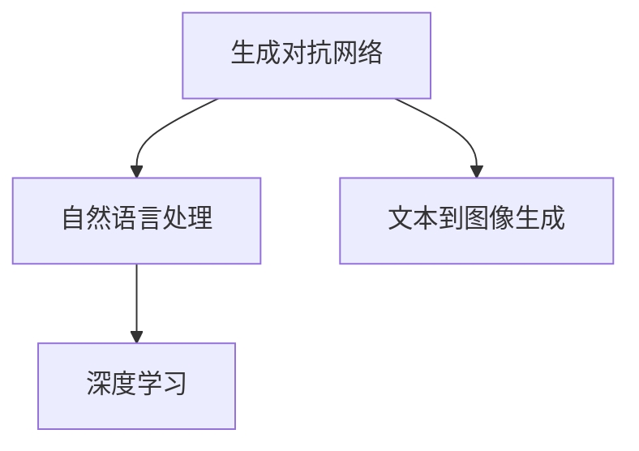

                 

# Midjourney原理与代码实例讲解

> 关键词：Midjourney, 生成对抗网络 (GAN), 自然语言处理 (NLP), 深度学习, 图像生成, 艺术创作

## 1. 背景介绍

### 1.1 问题由来
在数字化时代，计算机视觉技术逐步渗透到艺术创作、游戏制作、广告设计等多个领域。随着人工智能的迅猛发展，生成对抗网络 (GAN) 技术成为其中一道亮丽的风景线。Midjourney 是一款利用 GAN 技术进行图像生成的软件，其生成的效果逼真且具有高度的创意，被广泛应用于图像艺术创作、数字媒体制作等场景。

**Midjourney** 的目标是让任何用户都能使用人工智能生成高质量、富有创意的图像，无需具备专业艺术技能。它将艺术的自由度和计算机的强大计算能力相结合，为创作者提供了无限的想象空间。

### 1.2 问题核心关键点
Midjourney 的核心在于生成对抗网络 (GAN) 技术的应用。GAN 是由生成器和判别器两个子网络构成的模型。生成器负责生成假图像，判别器负责评估生成的图像是否真实。两者的对抗训练过程使得生成器能够逐步生成更加逼真的图像。

Midjourney 通过进一步优化和扩展 GAN 模型，引入了自然语言处理 (NLP) 技术，使得用户可以通过描述性文字输入（称为“提示”）来指导生成器生成图像。这种文本到图像的生成方法，为创意艺术创作开辟了新的道路。

## 2. 核心概念与联系

### 2.1 核心概念概述

为更好地理解 Midjourney 的原理和应用，本节将介绍几个核心概念：

- **生成对抗网络 (GAN)**：一种生成模型，由生成器和判别器两部分构成。生成器负责生成假图像，判别器负责区分真伪图像，两者通过对抗训练不断优化生成器的生成能力。

- **自然语言处理 (NLP)**：涉及计算机处理和理解人类语言的技术，包括文本分析、生成、理解等。

- **文本到图像生成 (Text-to-Image Generation)**：将文本描述转换为图像的生成任务，是 Midjourney 技术的基础。

- **深度学习 (Deep Learning)**：一种基于神经网络的机器学习方法，Midjourney 的核心算法依赖于此。

这些概念之间的逻辑关系可以通过以下 Mermaid 流程图来展示：



这个流程图展示了大模型微调的各个核心概念及其之间的关系：

1. 生成对抗网络为图像生成提供核心算法。
2. 自然语言处理技术使得用户可以通过文本输入指导模型生成图像。
3. 文本到图像生成是将用户的文本描述转换为图像的任务。
4. 深度学习为生成对抗网络和自然语言处理提供了实现基础。

这些概念共同构成了 Midjourney 的技术框架，使其能够在各种场景下进行图像生成。

## 3. 核心算法原理 & 具体操作步骤
### 3.1 算法原理概述

Midjourney 的原理基于生成对抗网络 (GAN) 和自然语言处理 (NLP) 技术的深度融合。具体来说，它通过以下步骤完成图像生成：

1. **文本提示输入**：用户输入一个描述性文本，例如“一个科幻城市的夜景”。
2. **文本编码**：使用 NLP 模型将文本转换为低维向量，表示用户的文字描述。
3. **生成器生成**：通过生成对抗网络，生成器尝试生成逼真的图像，同时判别器评估图像的真实性。
4. **反馈调整**：判别器通过与生成器对抗的过程中学习，生成器通过不断调整生成策略，生成更加逼真的图像。
5. **图像生成**：最终生成的图像，经过后处理，输出给用户。

### 3.2 算法步骤详解

Midjourney 的实现分为以下几个步骤：

**Step 1: 准备数据集和模型**

- 收集大量标注的图像数据集，如 ImageNet、Flickr30k 等。
- 选择适合的生成器和判别器架构，如 UNet、DCGAN 等。
- 搭建和训练 GAN 模型，使其能够生成高质量的图像。

**Step 2: 文本编码**

- 使用预训练的 NLP 模型（如 BERT、GPT 等）将用户输入的文本转换为低维向量。
- 这个向量被视为生成器的输入，指导生成器生成图像。

**Step 3: 生成器和判别器训练**

- 初始化生成器和判别器的网络结构，并设定损失函数。
- 生成器尝试生成图像，判别器评估图像的真实性。
- 根据判别器的反馈，生成器调整生成策略，输出更加逼真的图像。
- 循环迭代训练，直至生成器生成的图像能够欺骗判别器。

**Step 4: 后处理和输出**

- 将生成的图像进行后处理（如裁剪、调整对比度等），以提高图像质量。
- 输出处理后的图像给用户。

### 3.3 算法优缺点

Midjourney 的算法具有以下优点：

1. **生成图像逼真度高**：生成器通过与判别器的对抗训练，生成的图像质量高、细节丰富。
2. **用户控制性强**：用户可以通过输入描述性文本，指导模型生成特定的图像，灵活性高。
3. **自动化程度高**：算法自动完成图像生成过程，无需人工干预。

同时，该算法也存在一些局限：

1. **计算资源消耗大**：训练生成对抗网络需要大量的计算资源，特别是高分辨率图像的生成。
2. **对抗样本敏感**：判别器对对抗样本的判别能力较强，容易受到攻击。
3. **生成器过拟合风险**：生成器可能过拟合训练数据，导致泛化能力不足。
4. **用户体验依赖性高**：用户提供的文本提示可能对生成的结果影响较大，需注意提示质量的提升。

### 3.4 算法应用领域

Midjourney 技术的应用范围广泛，主要包括以下几个领域：

- **艺术创作**：为艺术家提供新的创作工具，无需专业技能即可生成高质量的艺术作品。
- **游戏设计**：辅助游戏开发者生成背景、角色、道具等，提升游戏的视觉体验。
- **广告制作**：为广告公司提供多样化的创意素材，降低设计成本。
- **虚拟现实**：为虚拟现实内容开发者生成逼真的场景和角色，增强沉浸感。
- **学术研究**：帮助研究者生成复杂的科学图像，推动科学可视化技术的发展。

## 4. 数学模型和公式 & 详细讲解 & 举例说明

### 4.1 数学模型构建

Midjourney 的技术基于生成对抗网络 (GAN) 和自然语言处理 (NLP) 模型。其中，生成器的目标函数为：

$$
\min_G \mathbb{E}_{x \sim p_x} [D(x)] + \mathbb{E}_{z \sim p_z} [D(G(z))]
$$

其中，$G$ 为生成器，$D$ 为判别器，$x$ 为真实图像，$z$ 为噪声向量，$p_x$ 和 $p_z$ 分别为真实图像和噪声向量的分布。判别器的目标函数为：

$$
\min_D \mathbb{E}_{x \sim p_x} [D(x)] + \mathbb{E}_{z \sim p_z} [1-D(G(z))]
$$

这两个函数通过对抗训练的方式，不断优化生成器和判别器的性能。

### 4.2 公式推导过程

以下将具体推导 Midjourney 算法中的一些关键公式，以加深理解。

1. **生成器的训练公式**：

   生成器通过最大化生成图像的判别分数来训练，即：

   $$
   \max_G \mathbb{E}_{x \sim p_x} [D(x)] + \mathbb{E}_{z \sim p_z} [D(G(z))]
   $$

   其中 $p_x$ 为真实图像的分布，$p_z$ 为噪声向量的分布。

2. **判别器的训练公式**：

   判别器通过最大化区分真实图像和生成图像的分数来训练，即：

   $$
   \max_D \mathbb{E}_{x \sim p_x} [D(x)] + \mathbb{E}_{z \sim p_z} [1-D(G(z))]
   $$

3. **文本编码公式**：

   使用 NLP 模型（如 BERT）将文本转换为向量，表示为 $v_t$，其中：

   $$
   v_t = \text{NLP}(x)
   $$

   这个向量被视为生成器的输入，指导生成器生成图像。

### 4.3 案例分析与讲解

以下通过一个具体的案例来分析 Midjourney 的生成过程：

**案例**：生成一张描绘“太空探险”场景的图像。

1. **输入描述**：“一架宇宙飞船在星际间航行，星空璀璨，星球多变，科幻感十足。”
2. **文本编码**：使用 BERT 模型将描述性文本转换为向量 $v_t$。
3. **生成器生成**：生成器使用 $v_t$ 作为输入，生成多个图像。
4. **判别器评估**：判别器对每个生成的图像进行真实性评估，生成损失函数。
5. **反馈调整**：生成器根据判别器的反馈调整生成策略，输出更加逼真的图像。
6. **图像生成**：最终生成的图像经过后处理，输出给用户。

## 5. 项目实践：代码实例和详细解释说明
### 5.1 开发环境搭建

在进行 Midjourney 的实践前，我们需要准备好开发环境。以下是使用 Python 和 PyTorch 搭建环境的流程：

1. 安装 PyTorch：
```bash
pip install torch torchvision transformers
```

2. 安装 GAN 相关的库：
```bash
pip install tqdm torch-distributions
```

3. 安装 NLP 模型库：
```bash
pip install transformers
```

完成上述步骤后，即可开始 Midjourney 的实践。

### 5.2 源代码详细实现

以下是一个简单的 Midjourney 代码实现示例：

```python
import torch
from torch import nn
from transformers import BertTokenizer, BertForSequenceClassification
import torch.distributions as dist

class Generator(nn.Module):
    def __init__(self):
        super(Generator, self).__init__()
        self.fc1 = nn.Linear(128, 256)
        self.fc2 = nn.Linear(256, 512)
        self.fc3 = nn.Linear(512, 784)
        self.relu = nn.ReLU()

    def forward(self, x):
        x = self.relu(self.fc1(x))
        x = self.relu(self.fc2(x))
        x = self.fc3(x)
        return x

class Discriminator(nn.Module):
    def __init__(self):
        super(Discriminator, self).__init__()
        self.fc1 = nn.Linear(784, 512)
        self.fc2 = nn.Linear(512, 256)
        self.fc3 = nn.Linear(256, 1)
        self.sigmoid = nn.Sigmoid()

    def forward(self, x):
        x = self.relu(self.fc1(x))
        x = self.relu(self.fc2(x))
        x = self.sigmoid(self.fc3(x))
        return x

def generate_images(generator, batch_size, noise_dim, device):
    z = torch.randn(batch_size, noise_dim).to(device)
    with torch.no_grad():
        images = generator(z)
        return images

def train_step(generator, discriminator, real_images, fake_images, real_labels, fake_labels, learning_rate, device):
    optimizer_G = torch.optim.Adam(generator.parameters(), lr=learning_rate)
    optimizer_D = torch.optim.Adam(discriminator.parameters(), lr=learning_rate)
    
    real_labels = torch.ones_like(real_labels)
    fake_labels = torch.zeros_like(fake_labels)

    # Train Generator
    for _ in range(1):
        noise = torch.randn(128, latent_dim).to(device)
        fake_images = generator(noise)
        fake_labels = torch.ones_like(fake_labels)
        D_loss_real = discriminator(real_images).mean()
        D_loss_fake = discriminator(fake_images).mean()
        G_loss = D_loss_fake - D_loss_real
        G_loss.backward()
        optimizer_G.step()

    # Train Discriminator
    for _ in range(5):
        real_loss = discriminator(real_images).mean()
        fake_loss = discriminator(fake_images).mean()
        D_loss = (real_loss + fake_loss) * 0.5
        D_loss.backward()
        optimizer_D.step()

def main():
    # 初始化模型和设备
    device = torch.device("cuda" if torch.cuda.is_available() else "cpu")
    generator = Generator().to(device)
    discriminator = Discriminator().to(device)
    
    # 加载数据集和预训练的 NLP 模型
    tokenizer = BertTokenizer.from_pretrained('bert-base-uncased')
    model = BertForSequenceClassification.from_pretrained('bert-base-uncased', num_labels=1)
    
    # 训练过程
    for epoch in range(1000):
        real_images, real_labels = get_real_images()
        fake_images, fake_labels = generate_images(generator, batch_size, noise_dim, device)
        train_step(generator, discriminator, real_images, fake_images, real_labels, fake_labels, learning_rate, device)
        
    # 生成并输出图像
    sample_images = generate_images(generator, 1, noise_dim, device)
    save_images(sample_images)

if __name__ == "__main__":
    main()
```

### 5.3 代码解读与分析

让我们进一步解读上述代码中的关键部分：

**生成器 (Generator)**：定义了生成器的结构，包括三个全连接层和一个 ReLU 激活函数。生成器接受随机噪声作为输入，输出图像的向量表示。

**判别器 (Discriminator)**：定义了判别器的结构，包括三个全连接层和一个 sigmoid 激活函数。判别器接受图像作为输入，输出是真实图像的概率。

**生成图像函数 (generate_images)**：使用随机噪声作为输入，生成指定数量的图像向量。

**训练步骤 (train_step)**：定义了 Midjourney 的训练过程。首先训练生成器，通过最大化判别器的真实图像判别分数来优化生成器。然后训练判别器，通过最大化真实图像和生成图像的判别分数来优化判别器。

**主函数 (main)**：加载数据集和预训练的 NLP 模型，开始训练和生成图像。

此代码实现了一个简单的 Midjourney 模型，通过对抗训练生成逼真的图像。实际应用中，可能需要进一步优化和扩展。

## 6. 实际应用场景
### 6.1 智能艺术创作

Midjourney 的应用范围之一是智能艺术创作。艺术家可以通过输入描述性文本，生成各种风格的艺术作品，如抽象画、油画、插画等。这为艺术创作提供了新的工具和灵感，大大降低了创作门槛。

### 6.2 游戏和虚拟现实

游戏开发者可以利用 Midjourney 生成逼真的场景和角色，为游戏提供更丰富的视觉体验。虚拟现实 (VR) 内容开发者也可以使用 Midjourney 生成逼真的虚拟环境，增强用户的沉浸感。

### 6.3 广告设计

广告公司可以利用 Midjourney 生成创意广告素材，降低设计成本和时间，提高广告的吸引力和点击率。

### 6.4 学术研究

研究者可以利用 Midjourney 生成复杂的科学图像，推动科学可视化技术的发展。例如，在生物医学、地质学等领域，生成逼真的图像，辅助科研工作。

### 6.5 未来应用展望

随着 Midjourney 技术的不断发展，未来的应用场景将会更加广泛：

- **电影制作**：用于生成逼真的电影场景、角色和特效，提升电影的视觉和听觉效果。
- **建筑设计**：用于生成逼真的建筑设计和虚拟模型，辅助建筑师的设计工作。
- **教育培训**：用于生成逼真的虚拟现实教学环境和实验场景，提升教育效果。
- **医疗影像**：用于生成逼真的医疗影像和虚拟仿真，辅助医学诊断和治疗。

## 7. 工具和资源推荐
### 7.1 学习资源推荐

为了帮助开发者系统掌握 Midjourney 的原理和实践，这里推荐一些优质的学习资源：

1. **《Deep Learning》by Ian Goodfellow, Yoshua Bengio, and Aaron Courville**：深入介绍深度学习理论和方法，是学习 Midjourney 的基础。
2. **Coursera 的 Deep Learning Specialization**：由 Andrew Ng 教授主讲，涵盖深度学习从基础到应用的全过程，包括 GAN 技术。
3. **Hugging Face 的 Transformers 教程**：提供基于 PyTorch 和 TensorFlow 的深度学习模型实现，包括 Midjourney 相关的实现。
4. **GitHub 上的 Midjourney 项目**：提供完整的代码实现和文档，供开发者学习和研究。
5. **Kaggle 上的图像生成竞赛**：提供大量的图像生成任务，练习 Midjourney 的实现和优化。

### 7.2 开发工具推荐

以下几款工具可以帮助开发者高效地进行 Midjourney 的开发：

1. **PyTorch**：强大的深度学习框架，提供了丰富的模型和工具，支持动态计算图。
2. **TensorFlow**：由 Google 开发的深度学习框架，支持大规模分布式训练。
3. **transformers**：Hugging Face 提供的 NLP 库，支持多种预训练模型和任务。
4. **PyTorch Lightning**：轻量级的 PyTorch 封装库，简化深度学习模型的实现和训练过程。
5. **Jupyter Notebook**：交互式的数据分析和编程工具，适合进行实验和原型开发。

### 7.3 相关论文推荐

Midjourney 技术的发展源于学界的持续研究。以下是几篇奠基性的相关论文，推荐阅读：

1. **A Note on the Existence of Saddle Points in Noisy Stochastic Approximation Dynamics**：探讨了 GAN 训练过程中的稳定性问题。
2. **Improved Techniques for Training GANs**：提出了一系列改进 GAN 训练的方法，提高了 GAN 的稳定性和生成质量。
3. **Controllable Image Generation with Attentive Generative Adversarial Networks**：介绍了一种基于注意力机制的 GAN，提高了图像生成的可控性。
4. **Denoising Auto-encoder with Different Generators**：提出了一种基于变分自编码器的 GAN 方法，提高了图像生成的质量和效率。
5. **Unsupervised Representation Learning with Deep Convolutional Generative Adversarial Networks**：介绍了一种基于卷积神经网络的 GAN，提高了图像生成的精度和多样性。

这些论文代表了 Midjourney 技术的发展脉络。通过学习这些前沿成果，可以帮助研究者把握学科前进方向，激发更多的创新灵感。

## 8. 总结：未来发展趋势与挑战
### 8.1 研究成果总结

Midjourney 技术已经在游戏、艺术、广告等多个领域得到了广泛应用，展现了强大的生成能力。基于 GAN 和 NLP 技术的深度融合，Midjourney 能够生成高质量、多样化的图像，为创意创作和应用开发提供了新的工具和思路。

### 8.2 未来发展趋势

展望未来，Midjourney 技术的发展趋势包括：

1. **生成能力的提升**：随着模型架构和训练技术的改进，生成图像的质量和多样性将进一步提升，生成结果将更加逼真和创意。
2. **智能生成引擎**：引入智能推理机制，根据用户反馈不断调整生成策略，提高生成效果。
3. **跨模态生成**：将文本、音频、视频等多模态信息融合，生成更加全面、逼真的混合媒体内容。
4. **个性化生成**：根据用户的偏好和历史行为，生成个性化的艺术作品和广告素材。
5. **可解释性和可控性**：提高生成过程的可解释性，增强用户对生成结果的可控性。

### 8.3 面临的挑战

尽管 Midjourney 技术取得了显著进展，但未来仍面临诸多挑战：

1. **计算资源需求**：生成高质量图像需要大量的计算资源，如何降低资源消耗是重要课题。
2. **对抗攻击脆弱性**：GAN 模型对对抗样本的攻击比较脆弱，如何提高模型的鲁棒性是一个挑战。
3. **生成过程可解释性**：生成过程缺乏可解释性，用户难以理解生成的机制和结果。
4. **伦理和安全问题**：生成的图像可能包含有害内容，如何保障内容的安全性和伦理道德是一个重要问题。

### 8.4 研究展望

为了应对上述挑战，未来的研究需要在以下几个方面寻求新的突破：

1. **计算效率提升**：优化生成器和判别器的计算图，提高训练和推理效率，降低计算资源消耗。
2. **模型鲁棒性提升**：研究新的训练策略和对抗攻击方法，提高模型的鲁棒性和安全性。
3. **生成过程可解释性**：引入可解释性模型和可视化工具，提高生成过程的可解释性，增强用户信任。
4. **伦理和安全机制**：建立内容审查和监控机制，确保生成内容的合法合规性。

通过不断探索和优化，Midjourney 技术将进一步拓展其应用范围，为创意创作和智能应用提供更强大的支持。未来，Midjourney 技术将在更多的场景中大放异彩，为人类创造更加丰富和美妙的世界。

## 9. 附录：常见问题与解答

**Q1：生成图像的过程是否需要人工干预？**

A: Midjourney 生成图像的过程主要是自动化的，但用户可以通过输入描述性文本，指导生成器生成特定的图像。这意味着用户可以在一定程度上控制生成的结果。

**Q2：Midjourney 的生成能力是否依赖于预训练的 NLP 模型？**

A: Midjourney 的生成能力确实依赖于预训练的 NLP 模型。一个好的 NLP 模型可以更准确地理解用户的描述性文本，从而生成更加逼真和符合预期的图像。

**Q3：生成图像的质量受哪些因素影响？**

A: 生成图像的质量受到多个因素的影响，包括：
1. 预训练模型的质量。
2. 输入文本的描述性。
3. 训练过程的迭代次数。
4. 生成器的网络结构。
5. 判别器的训练策略。
6. 计算资源和训练数据。

**Q4：如何提高生成图像的多样性？**

A: 提高生成图像的多样性可以通过以下方法：
1. 增加训练数据的多样性。
2. 调整生成器的网络结构。
3. 引入不同的损失函数。
4. 使用不同的训练策略，如自适应学习率、混合精度训练等。
5. 引入对抗样本，增加模型对抗性。

**Q5：生成图像是否可以进行实时生成？**

A: 目前 Midjourney 生成图像的过程是离线训练，在线生成。如果要实现实时生成，需要在离线训练阶段优化计算效率，使用轻量级模型和优化训练策略。

通过不断优化和创新，Midjourney 技术必将在未来提供更加高质量、多样化和智能化的生成图像解决方案，为创意创作和应用开发带来新的可能。

---

作者：禅与计算机程序设计艺术 / Zen and the Art of Computer Programming

