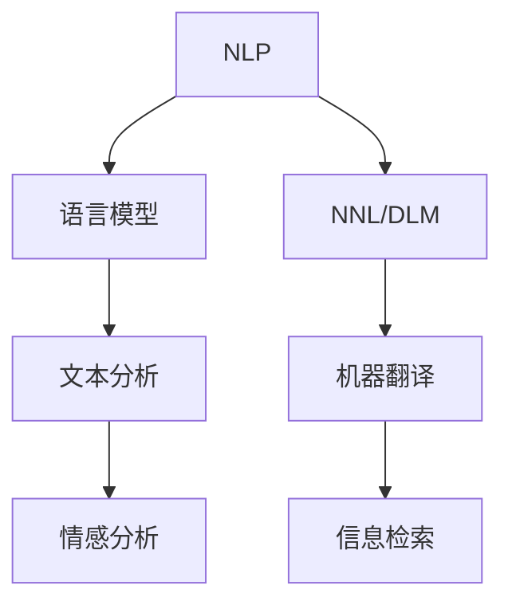

                 

# NLP是人类和计算机沟通的桥梁

> 关键词：自然语言处理(NLP), 人工智能, 深度学习, 语言模型, 神经网络, 计算语言学, 文本分析

## 1. 背景介绍

### 1.1 问题由来

随着人工智能技术的快速发展，人类与计算机之间的沟通方式也在发生根本性的变化。从最初的基于命令的交互式系统，到如今的自然语言理解与生成，计算机已经能够处理和理解人类语言，并通过语言与人类进行更为自然、智能的互动。自然语言处理(Natural Language Processing, NLP)作为人工智能领域的核心分支，正发挥着桥梁作用，连接了人类与机器的认知与情感。

在现代社会中，自然语言处理技术已经广泛应用于各行各业，包括但不限于智能客服、机器翻译、语音识别、信息检索等。通过这些技术，人类能够更加便捷地与计算机进行交互，促进了知识的获取、信息的处理、决策的支持等多方面的智能化升级。

### 1.2 问题核心关键点

NLP技术的核心在于理解和生成自然语言，使其能够高效、准确地执行各种任务。其主要挑战包括：

- **语言多样性**：不同语言具有不同的语法、语义和用法，如何让计算机理解和处理这些差异是个关键问题。
- **语义理解**：语言不仅仅是文字的堆砌，还蕴含着丰富的语义信息，如何从文本中提取出有用的语义信息，是一个重要挑战。
- **上下文理解**：自然语言往往需要上下文信息来确定其真实含义，如何构建有效的上下文模型，也是一个核心难题。
- **多模态融合**：人类获取信息的方式不仅仅是文本，还包括视觉、听觉等多模态信息，如何让NLP技术融合多模态数据，提供更全面的信息处理能力，是未来的研究方向。

这些核心关键点不仅决定了NLP技术的深度和广度，也决定了其应用的前景和挑战。

## 2. 核心概念与联系

### 2.1 核心概念概述

为了更好地理解NLP技术的原理和应用，本节将介绍几个关键概念：

- **自然语言处理(NLP)**：使用计算机科学和人工智能技术，实现对自然语言的理解和生成。NLP的目标是使计算机能够像人类一样理解和处理语言，从而实现与人的自然交互。

- **语言模型**：是NLP的核心工具之一，用于建模语言的概率分布。常见的语言模型包括n-gram模型、神经网络语言模型(如RNN、LSTM、GRU等)、Transformer模型等。

- **神经网络语言模型(Neural Network Language Model, NNL) / 深度学习语言模型(Deep Learning Language Model, DLM)**：利用深度学习技术，通过神经网络结构来学习语言的概率分布，并用于自然语言处理任务，如机器翻译、文本分类、情感分析等。

- **计算语言学(Computational Linguistics)**：是研究如何通过计算机技术处理和理解自然语言的学科，包括语音识别、文本分析、机器翻译、信息检索等多个方向。

- **文本分析(Text Analysis)**：是NLP中的一个重要应用，涉及文本的分类、聚类、摘要、情感分析、主题建模等任务，是理解文本含义和内容的重要手段。

- **信息检索**：通过自然语言处理技术，实现对海量文本数据的快速检索，帮助用户找到需要的信息。

这些概念之间的关系可以通过以下Mermaid流程图来展示：



这个流程图展示了大语言模型与NLP技术的主要核心概念及其相互关系：

1. NLP利用语言模型等工具，实现了对自然语言的理解和生成。
2. 语言模型是NLP的核心工具，用于建模语言的概率分布。
3. 神经网络语言模型进一步通过深度学习技术，提升了模型的性能。
4. 文本分析是NLP的重要应用，用于文本的分类、聚类、摘要等任务。
5. 机器翻译和信息检索是NLP在实际应用中的重要方向。

## 3. 核心算法原理 & 具体操作步骤

### 3.1 算法原理概述

NLP的算法原理可以简单概括为：通过构建语言模型，对自然语言进行编码和解码，实现对文本信息的提取、理解和生成。常见的NLP任务包括：

- **文本分类**：将文本分为不同的类别，如情感分类、主题分类等。
- **命名实体识别**：从文本中识别出人名、地名、机构名等实体。
- **机器翻译**：将一种语言的文本翻译成另一种语言的文本。
- **文本摘要**：从长篇文本中提取出关键信息，生成简洁的摘要。
- **信息检索**：从大量文本中检索出与用户查询相关的文档。

NLP算法的核心思想是通过机器学习，利用大规模标注数据训练语言模型，使其能够理解自然语言的内涵和结构，从而实现对文本的处理和分析。其中，语言模型是最重要的基础组件，它描述了语言的概率分布，并用于指导其他NLP任务的实现。

### 3.2 算法步骤详解

NLP的算法实现通常包括以下几个关键步骤：

**Step 1: 数据预处理**

- **文本清洗**：去除文本中的噪声、特殊字符等。
- **分词**：将文本切分成单词或词语，便于后续处理。
- **标注**：对文本进行标注，如命名实体识别、词性标注等。
- **向量化**：将文本转换为计算机可处理的向量形式，如Word2Vec、GloVe、BERT等。

**Step 2: 构建语言模型**

- **模型选择**：选择合适的语言模型，如n-gram模型、神经网络语言模型、Transformer模型等。
- **参数初始化**：初始化模型的参数，通常是随机初始化。
- **训练**：利用标注数据训练模型，优化参数，使其能够更好地描述语言的概率分布。

**Step 3: 模型评估与调整**

- **验证集评估**：在验证集上评估模型的性能，如准确率、召回率、F1分数等。
- **调整参数**：根据评估结果调整模型参数，如学习率、正则化参数等。
- **模型融合**：对多个模型进行融合，提升性能。

**Step 4: 应用与部署**

- **任务适配**：根据具体的NLP任务，设计合适的任务适配层，如分类器、解码器等。
- **测试集评估**：在测试集上评估微调后模型的性能，对比原始模型和微调模型的性能。
- **部署应用**：将微调后的模型集成到实际应用中，如智能客服、翻译系统、情感分析系统等。

### 3.3 算法优缺点

NLP的算法具有以下优点：

- **广泛应用**：NLP技术可以应用于多个领域，如医疗、金融、教育等，具有广泛的适用性。
- **智能化水平高**：利用深度学习技术，NLP模型能够自动学习和理解语言的内涵和结构，具有较高的智能化水平。
- **数据利用率高**：NLP技术可以处理大规模文本数据，数据利用率高。

同时，NLP算法也存在一些缺点：

- **数据质量依赖**：NLP模型的性能很大程度上依赖于标注数据的质量，数据质量不好将导致模型性能下降。
- **计算资源消耗大**：大规模NLP模型需要大量的计算资源，训练和推理成本较高。
- **上下文理解复杂**：自然语言具有复杂的语境和语义，NLP模型在理解复杂上下文时可能出现误差。

### 3.4 算法应用领域

NLP技术在众多领域得到了广泛的应用，以下是几个典型的应用场景：

- **智能客服**：利用NLP技术，智能客服系统可以自动理解和回答用户的问题，提升客户满意度。
- **机器翻译**：利用NLP技术，将一种语言的文本翻译成另一种语言的文本，促进跨语言交流。
- **情感分析**：利用NLP技术，对文本进行情感分析，用于舆情监控、市场预测等。
- **文本分类**：利用NLP技术，对文本进行分类，用于垃圾邮件过滤、新闻分类等。
- **信息检索**：利用NLP技术，实现对文本的快速检索，提升信息获取效率。

## 4. 数学模型和公式 & 详细讲解 & 举例说明

### 4.1 数学模型构建

NLP的数学模型通常包括语言模型和文本分类模型。下面以文本分类为例，介绍文本分类的数学模型构建过程。

文本分类的目标是给定一段文本，将其分类为预定义的若干类别之一。常见的文本分类模型包括朴素贝叶斯(Naive Bayes)、逻辑回归(Logistic Regression)、支持向量机(SVM)、神经网络(Neural Network)等。

**朴素贝叶斯模型**：
- **假设**：文本中的每个单词相互独立，即假设文本是单词的独立随机序列。
- **模型**：
  $$
  P(c|w) = \frac{P(c)}{P(w|c)}
  $$
  其中，$P(c|w)$ 表示给定文本 $w$ 属于类别 $c$ 的概率，$P(c)$ 表示类别 $c$ 的概率，$P(w|c)$ 表示在类别 $c$ 下文本 $w$ 的概率。

**逻辑回归模型**：
- **假设**：文本的分类可以看作二分类问题，即文本属于类别 $c=1$ 或 $c=0$。
- **模型**：
  $$
  P(c|w) = \sigma(\theta_0 + \sum_{i=1}^n \theta_i x_i)
  $$
  其中，$\theta_0$ 和 $\theta_i$ 为模型的参数，$x_i$ 为文本的第 $i$ 个特征（如单词的出现次数），$\sigma$ 为sigmoid函数。

**神经网络模型**：
- **假设**：文本的分类可以看作多分类问题，即文本属于 $K$ 个类别之一。
- **模型**：
  $$
  P(c|w) = \frac{e^{z_c}}{\sum_{k=1}^K e^{z_k}}
  $$
  其中，$z_c = \sum_{i=1}^n \theta_i x_i$，$\theta_i$ 为模型的参数，$x_i$ 为文本的第 $i$ 个特征。

### 4.2 公式推导过程

以神经网络模型为例，推导其训练过程。

假设我们有 $N$ 个样本，每个样本 $x_i$ 对应一个标签 $y_i \in [0,1,...,K-1]$，我们的目标是训练一个神经网络模型 $f(x)$，使得模型在给定文本 $x$ 时，能够准确预测其属于哪个类别。

**损失函数**：
- **均方误差损失**：
  $$
  L(y,f(x)) = \frac{1}{2N} \sum_{i=1}^N (y_i - f(x_i))^2
  $$
- **交叉熵损失**：
  $$
  L(y,f(x)) = -\frac{1}{N} \sum_{i=1}^N y_i \log f(x_i)
  $$

**梯度下降优化**：
- **梯度计算**：
  $$
  \frac{\partial L}{\partial \theta_j} = \frac{1}{N} \sum_{i=1}^N \frac{\partial L}{\partial f(x_i)} \frac{\partial f(x_i)}{\partial \theta_j}
  $$
  其中，$\frac{\partial L}{\partial f(x_i)}$ 为交叉熵损失对模型输出的导数，$\frac{\partial f(x_i)}{\partial \theta_j}$ 为模型对参数 $\theta_j$ 的导数。

**模型更新**：
- **随机梯度下降(SGD)**：
  $$
  \theta_j \leftarrow \theta_j - \eta \frac{\partial L}{\partial \theta_j}
  $$
  其中，$\eta$ 为学习率。

### 4.3 案例分析与讲解

**文本分类案例**：
假设我们要对电影评论进行情感分类，即判断评论是正面的还是负面的。我们可以使用朴素贝叶斯模型，对每个单词的出现概率进行建模，然后利用贝叶斯公式计算文本属于正面或负面的概率。具体步骤如下：

1. **数据预处理**：收集电影评论数据，并进行文本清洗、分词、向量化等预处理操作。
2. **模型训练**：对每个类别（正面、负面）分别统计单词出现的概率，构建朴素贝叶斯模型。
3. **模型评估**：在验证集上评估模型的性能，选择最优模型。
4. **模型部署**：将训练好的模型集成到实际应用中，对新的评论进行情感分类。

**信息检索案例**：
假设我们要实现一个搜索引擎，能够根据用户查询快速检索出相关文档。我们可以使用向量空间模型(Vector Space Model, VSM)，将查询和文档转换为向量，然后计算它们之间的相似度。具体步骤如下：

1. **数据预处理**：收集文本数据，并进行分词、向量化等预处理操作。
2. **构建索引**：将文本向量化后，构建倒排索引，将每个单词与对应的文档位置进行映射。
3. **相似度计算**：对于用户查询，将其转换为向量，计算其与每个文档的相似度，选择相似度最高的文档进行展示。

## 5. 项目实践：代码实例和详细解释说明

### 5.1 开发环境搭建

在进行NLP项目实践前，我们需要准备好开发环境。以下是使用Python进行Scikit-learn开发的NLP环境配置流程：

1. 安装Anaconda：从官网下载并安装Anaconda，用于创建独立的Python环境。

2. 创建并激活虚拟环境：
```bash
conda create -n nltk-env python=3.8 
conda activate nltk-env
```

3. 安装Scikit-learn：
```bash
pip install scikit-learn
```

4. 安装其他工具包：
```bash
pip install pandas numpy matplotlib nltk
```

完成上述步骤后，即可在`nltk-env`环境中开始NLP实践。

### 5.2 源代码详细实现

下面我们以情感分析任务为例，给出使用Scikit-learn对朴素贝叶斯模型进行情感分类的Python代码实现。

首先，定义情感分析任务的数据处理函数：

```python
from sklearn.feature_extraction.text import CountVectorizer
from sklearn.model_selection import train_test_split
from sklearn.naive_bayes import MultinomialNB
from sklearn.metrics import classification_report

# 数据集加载
data = pd.read_csv('movie_reviews.csv')
texts = data['text'].values
labels = data['label'].values

# 数据预处理
vectorizer = CountVectorizer(stop_words='english')
features = vectorizer.fit_transform(texts)

# 划分训练集和验证集
features_train, features_valid, labels_train, labels_valid = train_test_split(features, labels, test_size=0.2)

# 训练模型
model = MultinomialNB()
model.fit(features_train, labels_train)

# 验证集评估
print(classification_report(labels_valid, model.predict(features_valid)))
```

然后，训练模型并在验证集上评估：

```python
# 测试集评估
features_test = vectorizer.transform(tests)
print(classification_report(labels_test, model.predict(features_test)))
```

以上就是使用Scikit-learn对朴素贝叶斯模型进行情感分类的完整代码实现。可以看到，利用Scikit-learn，我们可以用相对简洁的代码完成情感分类的NLP任务。

### 5.3 代码解读与分析

让我们再详细解读一下关键代码的实现细节：

**数据预处理**：
- `CountVectorizer`：用于将文本转换为词频向量，去除停用词。
- `train_test_split`：用于将数据集划分为训练集和验证集。

**模型训练**：
- `MultinomialNB`：朴素贝叶斯模型，用于文本分类。
- `fit`：训练模型。

**模型评估**：
- `classification_report`：评估模型的分类性能，包括精确率、召回率、F1分数等。

**测试集评估**：
- `transform`：将测试文本转换为词频向量。
- `predict`：对测试集进行分类预测。
- `classification_report`：评估测试集的分类性能。

可以看到，Scikit-learn为NLP开发者提供了一整套完整的工具库，使得模型训练、数据预处理、模型评估等各个环节的操作变得简便高效。

## 6. 实际应用场景

### 6.1 智能客服系统

智能客服系统是NLP技术的重要应用场景之一。通过NLP技术，客服系统能够自动理解客户问题，并提供准确的答案。智能客服系统的实现流程如下：

1. **数据收集**：收集历史客服对话数据，标注问题-回答对。
2. **数据预处理**：对对话进行清洗、分词、向量化等预处理操作。
3. **模型训练**：训练基于深度学习模型的对话生成模型，如Seq2Seq模型、Transformer模型等。
4. **模型部署**：将训练好的模型部署到生产环境，与客户进行实时交互。
5. **效果评估**：定期对系统进行评估，优化模型性能。

**实现案例**：
- **OpenAI的GPT-3**：OpenAI开发的GPT-3模型，利用深度学习技术，能够在实时对话中生成自然流畅的回答，广泛应用于智能客服系统。
- **HuggingFace的chatbot模型**：基于Transformer结构，可以处理多种自然语言输入，提供多语言支持。

### 6.2 机器翻译

机器翻译是NLP技术的重要应用之一。通过NLP技术，将一种语言的文本翻译成另一种语言的文本，能够促进跨语言交流和信息共享。机器翻译的实现流程如下：

1. **数据收集**：收集平行语料库，如英文-中文、英文-德文等。
2. **数据预处理**：对文本进行分词、向量化等预处理操作。
3. **模型训练**：训练基于深度学习模型的机器翻译模型，如Seq2Seq模型、Transformer模型等。
4. **模型部署**：将训练好的模型部署到生产环境，提供翻译服务。
5. **效果评估**：定期对系统进行评估，优化模型性能。

**实现案例**：
- **Google的BERT模型**：Google开发的BERT模型，利用深度学习技术，在机器翻译任务上取得了SOTA性能。
- **OpenAI的GPT系列模型**：OpenAI开发的GPT系列模型，能够处理复杂的语言结构和语义，提供高质量的翻译服务。

### 6.3 情感分析

情感分析是NLP技术的重要应用之一。通过NLP技术，对文本进行情感分类，能够用于舆情监控、市场预测等。情感分析的实现流程如下：

1. **数据收集**：收集社交媒体、新闻评论、用户评论等情感数据。
2. **数据预处理**：对文本进行清洗、分词、向量化等预处理操作。
3. **模型训练**：训练基于深度学习模型的情感分类模型，如卷积神经网络(CNN)、循环神经网络(RNN)等。
4. **模型部署**：将训练好的模型部署到生产环境，进行情感分类。
5. **效果评估**：定期对系统进行评估，优化模型性能。

**实现案例**：
- **VADER模型**：一种基于规则的情感分析模型，能够快速对文本进行情感分类。
- **BERT模型**：利用深度学习技术，在情感分析任务上取得了SOTA性能。

## 7. 工具和资源推荐

### 7.1 学习资源推荐

为了帮助开发者系统掌握NLP技术的理论基础和实践技巧，这里推荐一些优质的学习资源：

1. **《自然语言处理综论》**：斯坦福大学的两门自然语言处理课程，由NLP领域的大牛主讲，涵盖了NLP的各个方面。
2. **《Python自然语言处理》**：Python领域的经典NLP教程，介绍了NLP的各个技术和算法。
3. **NLP101系列课程**：Coursera平台上的NLP系列课程，涵盖了文本预处理、情感分析、机器翻译等主题。
4. **NLP实战案例**：GitHub上的NLP实战项目，提供了大量的代码实例和实战经验。
5. **NLP社区**：如Kaggle、Stack Overflow等社区，可以学习他人的经验和解决方案。

通过对这些资源的学习实践，相信你一定能够快速掌握NLP技术的精髓，并用于解决实际的NLP问题。

### 7.2 开发工具推荐

高效的开发离不开优秀的工具支持。以下是几款用于NLP开发的常用工具：

1. **Scikit-learn**：Python中的机器学习库，提供了各种NLP相关的模型和工具。
2. **NLTK**：Python中的自然语言处理库，提供了各种NLP相关的工具和数据集。
3. **TensorFlow**：Google开发的深度学习框架，支持各种NLP模型的实现。
4. **PyTorch**：Facebook开发的深度学习框架，支持各种NLP模型的实现。
5. **NLTK与SpaCy**：Python中的自然语言处理库，提供了各种NLP相关的工具和数据集。
6. **HuggingFace Transformers库**：提供了各种预训练语言模型和微调方法，是NLP开发的利器。

合理利用这些工具，可以显著提升NLP任务的开发效率，加快创新迭代的步伐。

### 7.3 相关论文推荐

NLP技术的发展源于学界的持续研究。以下是几篇奠基性的相关论文，推荐阅读：

1. **《Attention is All You Need》**：提出了Transformer模型，开启了NLP领域的预训练大模型时代。
2. **《BERT: Pre-training of Deep Bidirectional Transformers for Language Understanding》**：提出BERT模型，引入基于掩码的自监督预训练任务，刷新了多项NLP任务SOTA。
3. **《Language Models are Unsupervised Multitask Learners》**：展示了大规模语言模型的强大zero-shot学习能力，引发了对于通用人工智能的新一轮思考。
4. **《Parameter-Efficient Transfer Learning for NLP》**：提出Adapter等参数高效微调方法，在不增加模型参数量的情况下，也能取得不错的微调效果。
5. **《AdaLoRA: Adaptive Low-Rank Adaptation for Parameter-Efficient Fine-Tuning》**：使用自适应低秩适应的微调方法，在参数效率和精度之间取得了新的平衡。
6. **《Adversarial Robustness and Adversarial Generalization in NLP》**：研究了NLP模型的鲁棒性和泛化能力，提出了多项鲁棒性增强方法。

这些论文代表了大语言模型微调技术的发展脉络。通过学习这些前沿成果，可以帮助研究者把握学科前进方向，激发更多的创新灵感。

## 8. 总结：未来发展趋势与挑战

### 8.1 总结

本文对自然语言处理(NLP)技术的原理和应用进行了全面系统的介绍。首先阐述了NLP技术的背景和意义，明确了其作为人类和计算机沟通桥梁的重要性。其次，从原理到实践，详细讲解了NLP的数学模型和算法实现，给出了NLP任务开发的完整代码实例。同时，本文还探讨了NLP技术在智能客服、机器翻译、情感分析等多个领域的应用前景，展示了NLP技术的广阔前景。最后，本文精选了NLP技术的各类学习资源，力求为读者提供全方位的技术指引。

通过本文的系统梳理，可以看到，NLP技术正在成为人类和计算机沟通的重要桥梁，极大地拓展了人类与机器的互动能力。未来，随着技术的不断演进，NLP技术必将在更多领域得到应用，为人类认知智能的进化带来深远影响。

### 8.2 未来发展趋势

展望未来，NLP技术的发展将呈现以下几个趋势：

1. **深度学习模型的应用**：深度学习模型将成为NLP技术的主要工具，其性能和智能化水平将进一步提升。
2. **预训练模型的普及**：预训练模型将广泛应用于各种NLP任务中，提升模型的性能和泛化能力。
3. **多模态融合**：NLP技术将与视觉、听觉等多模态数据融合，提升信息处理能力。
4. **无监督和半监督学习**：无监督和半监督学习将成为NLP研究的重要方向，降低对标注数据的依赖。
5. **计算资源优化**：随着模型的复杂度增加，计算资源优化将变得更加重要。
6. **跨领域知识整合**：NLP技术将与知识图谱、逻辑规则等跨领域知识进行整合，提升模型的准确性和解释性。

### 8.3 面临的挑战

尽管NLP技术取得了显著进展，但在迈向智能化、普适化应用的过程中，仍面临诸多挑战：

1. **数据质量问题**：标注数据的质量和数量直接影响NLP模型的性能，如何获取高质量的标注数据是一个重要问题。
2. **计算资源消耗**：大规模NLP模型需要大量的计算资源，训练和推理成本较高。
3. **模型鲁棒性**：NLP模型在面对噪声数据和复杂语境时，鲁棒性不足，容易产生误判。
4. **模型可解释性**：NLP模型往往是一个"黑盒"系统，难以解释其内部工作机制和决策逻辑。
5. **安全性问题**：NLP模型可能学习到有害信息，造成误导性、歧视性的输出，带来安全隐患。
6. **上下文理解能力**：自然语言具有复杂的语境和语义，NLP模型在理解复杂上下文时，可能出现误差。

### 8.4 研究展望

未来的NLP研究需要在以下几个方向寻求新的突破：

1. **多模态融合**：研究如何将视觉、听觉等多模态数据与文本数据结合，提升信息处理能力。
2. **无监督和半监督学习**：研究如何利用无标注数据进行NLP任务，降低对标注数据的依赖。
3. **模型鲁棒性增强**：研究如何提升NLP模型的鲁棒性和泛化能力，应对噪声和复杂语境。
4. **模型可解释性增强**：研究如何提升NLP模型的可解释性和可审计性，增强系统安全性。
5. **跨领域知识整合**：研究如何整合跨领域知识，提升NLP模型的准确性和解释性。

这些研究方向的探索，必将引领NLP技术迈向更高的台阶，为构建安全、可靠、可解释、可控的智能系统铺平道路。面向未来，NLP技术还需要与其他人工智能技术进行更深入的融合，如知识表示、因果推理、强化学习等，多路径协同发力，共同推动自然语言理解和智能交互系统的进步。只有勇于创新、敢于突破，才能不断拓展NLP技术的边界，让智能技术更好地造福人类社会。

## 9. 附录：常见问题与解答

**Q1：NLP技术的主要应用场景有哪些？**

A: NLP技术的主要应用场景包括智能客服、机器翻译、情感分析、文本分类、信息检索等。这些应用场景覆盖了文本数据的各个处理环节，能够实现自动化、智能化的信息处理和交互。

**Q2：如何选择适合的NLP模型？**

A: 选择适合的NLP模型需要考虑多个因素，如任务类型、数据规模、计算资源等。一般来说，常用的NLP模型包括朴素贝叶斯、逻辑回归、支持向量机、卷积神经网络、循环神经网络、Transformer模型等。在实际应用中，需要根据具体任务的需求和数据特点，选择合适的模型进行训练和优化。

**Q3：如何评估NLP模型的性能？**

A: 评估NLP模型的性能通常使用以下指标：
- **准确率(Accuracy)**：正确分类的样本数占总样本数的比例。
- **召回率(Recall)**：正确分类的正样本数占实际正样本数的比例。
- **精确率(Precision)**：正确分类的正样本数占所有分类为正的样本数的比例。
- **F1分数(F1-score)**：精确率和召回率的调和平均数。
- **混淆矩阵(Confusion Matrix)**：展示分类器对不同类别的分类结果。

通过评估这些指标，可以全面了解NLP模型的性能和局限性，进而进行优化和改进。

**Q4：如何在实际应用中优化NLP模型的性能？**

A: 优化NLP模型的性能需要从多个方面入手，如数据预处理、模型选择、超参数调优、正则化等。
- **数据预处理**：对文本进行清洗、分词、向量化等预处理操作，去除噪声和无关信息。
- **模型选择**：根据任务类型选择合适的模型，如朴素贝叶斯、逻辑回归、卷积神经网络、循环神经网络、Transformer模型等。
- **超参数调优**：调整模型的超参数，如学习率、正则化参数等，以优化模型性能。
- **正则化**：使用L2正则、Dropout、Early Stopping等方法，防止模型过拟合。
- **模型融合**：对多个模型进行融合，提升模型性能。

通过这些优化方法，可以提升NLP模型的准确性和泛化能力，适应不同领域的NLP任务。

**Q5：如何处理NLP中的多语言问题？**

A: 处理NLP中的多语言问题需要考虑以下几个方面：
- **多语言数据集**：收集多语言文本数据，构建多语言标注集。
- **多语言模型**：使用多语言预训练模型，如mBART、Marian等，能够在多种语言之间进行迁移学习。
- **多语言词典**：构建多语言词典，支持多语言文本的向量化和翻译。
- **多语言分类器**：使用多语言分类器，对多语言文本进行分类。

通过这些方法，可以实现对多语言文本的自动化处理和分析。

---

作者：禅与计算机程序设计艺术 / Zen and the Art of Computer Programming

