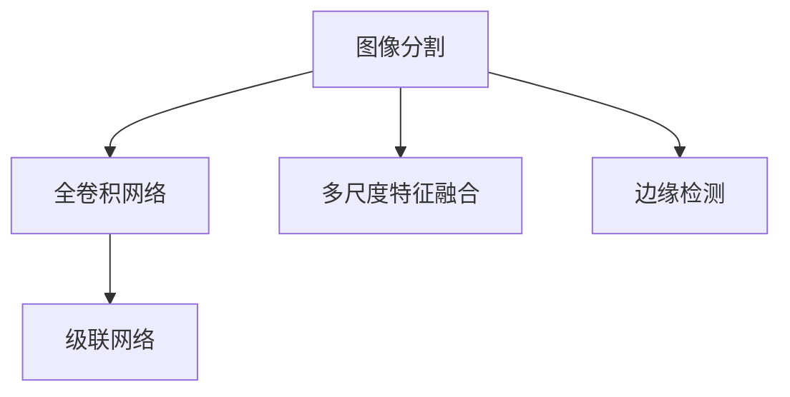

                 

# OCRNet原理与代码实例讲解

> 关键词：OCRNet, 图像分割, 深度学习, 全卷积网络, 多尺度特征融合, 边缘检测, 代码实例

## 1. 背景介绍

### 1.1 问题由来
近年来，随着深度学习技术的快速发展，基于深度学习的图像分割方法在自动文档识别(OCR)等领域取得了显著进展。然而，传统方法在处理复杂场景和边缘模糊的文档时，效果往往不尽如人意。OCRNet的提出，使得这一问题得到了极大的改善，能够有效地处理多尺度文档图像，识别和分割文字，提升了文档识别系统的整体性能。

### 1.2 问题核心关键点
OCRNet的核心在于通过多尺度特征融合和边缘检测，高效地分割出图像中的文字区域，同时避免文字区域与背景的混淆。其关键点包括：
- 多尺度特征融合：通过结合不同尺度的特征，增强对文字边缘和纹理的细节捕捉。
- 边缘检测：通过级联的小卷积核，对文字边缘进行精准定位，提升分割效果。
- 高效的推理机制：采用全卷积网络，减少参数和计算量，提高推理效率。

### 1.3 问题研究意义
OCRNet作为一种高效的图像分割方法，对自动文档识别、智能搜索、信息抽取等任务具有重要意义：
1. 提高文档识别准确率：通过准确的文本分割，降低文字识别噪声，提高识别的准确率。
2. 提升系统效率：采用全卷积网络，减少参数和计算量，降低系统部署成本。
3. 处理多尺度文档：通过多尺度特征融合，适应不同大小和分辨率的文档图像。
4. 促进AI在文档处理中的应用：提供了一种高效、可扩展的文档图像处理方法，加速AI在文档处理领域的落地应用。

## 2. 核心概念与联系

### 2.1 核心概念概述

为更好地理解OCRNet的原理和架构，本节将介绍几个密切相关的核心概念：

- 图像分割(Image Segmentation)：将图像中的物体分割出来，并用不同的标签加以区分。
- 全卷积网络(Fully Convolutional Network, FCN)：一种特殊的卷积神经网络，其输出空间大小与输入空间大小相同，可以实现端到端像素级预测。
- 多尺度特征融合(Multi-Scale Feature Fusion)：将不同尺度的特征进行融合，提升对边缘细节的捕捉能力。
- 边缘检测(Edge Detection)：通过小卷积核，对图像中的边缘进行定位和增强。
- 级联网络(Cascade Network)：通过逐级检测，逐步提高检测精度，适用于复杂场景的检测任务。

这些核心概念之间的逻辑关系可以通过以下Mermaid流程图来展示：



这个流程图展示了几大核心概念之间的相互关系：

1. 图像分割是OCRNet的最终目标，通过多尺度特征融合和边缘检测，实现准确的文字分割。
2. 全卷积网络是OCRNet的基本架构，可以实现像素级的预测和分割。
3. 多尺度特征融合通过不同尺度的特征，增强对文字细节的捕捉能力。
4. 边缘检测通过小卷积核，精准定位文字边缘，提升分割效果。
5. 级联网络通过逐级检测，逐步提高检测精度，适用于复杂场景的检测任务。

这些概念共同构成了OCRNet的算法框架，使其能够在各种场景下高效、准确地实现文字分割。

## 3. 核心算法原理 & 具体操作步骤
### 3.1 算法原理概述

OCRNet的核心算法主要包含以下步骤：

1. 多尺度特征提取：通过不同尺度的卷积层，提取图像的多尺度特征。
2. 边缘检测：使用级联的小卷积核，对图像中的边缘进行检测和增强。
3. 多尺度特征融合：将不同尺度的特征进行融合，生成高精度的分割图。
4. 全卷积网络推理：通过全卷积网络，实现像素级的预测和分割。

其中，多尺度特征融合和边缘检测是OCRNet的核心技术，将两者结合，能够有效地处理复杂场景和多尺度文档图像，提升文字分割的效果。

### 3.2 算法步骤详解

以下将详细介绍OCRNet的算法步骤：

**Step 1: 多尺度特征提取**

OCRNet首先通过不同尺度的卷积层，提取图像的多尺度特征。这里采用了一种自适应的卷积核大小策略，自动适应不同尺度的特征提取。具体实现步骤如下：

1. 输入图像 $I$，尺寸为 $H\times W$。
2. 使用不同尺度的卷积核，提取图像的多尺度特征 $F_1, F_2, ..., F_n$，其中 $F_i$ 表示尺度为 $i$ 的特征图。
3. 将多尺度特征 $F_i$ 进行融合，生成融合特征 $F$。

数学公式表示为：
$$
F = \sum_{i=1}^{n} \alpha_i F_i
$$
其中 $\alpha_i$ 为每个尺度特征的权重，一般使用归一化的权重系数。

**Step 2: 边缘检测**

边缘检测是OCRNet的另一核心技术。通过级联的小卷积核，对图像中的边缘进行检测和增强，从而提升文字分割的效果。具体实现步骤如下：

1. 将多尺度特征 $F$ 输入到级联的小卷积核中，得到边缘特征 $E$。
2. 将边缘特征 $E$ 与多尺度特征 $F$ 进行融合，生成融合特征 $G$。

数学公式表示为：
$$
G = \beta E + (1-\beta) F
$$
其中 $\beta$ 为边缘特征的权重，一般取较小的值，如 $0.5$。

**Step 3: 多尺度特征融合**

多尺度特征融合是OCRNet的关键技术之一，通过将不同尺度的特征进行融合，能够增强对文字边缘和纹理的细节捕捉。具体实现步骤如下：

1. 将多尺度特征 $F$ 进行上采样，生成高分辨率特征 $H$。
2. 将边缘特征 $E$ 与高分辨率特征 $H$ 进行融合，生成最终的分割图 $S$。

数学公式表示为：
$$
S = \gamma H + (1-\gamma) E
$$
其中 $\gamma$ 为高分辨率特征的权重，一般取较大的值，如 $0.5$。

**Step 4: 全卷积网络推理**

全卷积网络是OCRNet的基本架构，通过全卷积网络，实现像素级的预测和分割。具体实现步骤如下：

1. 将多尺度特征 $F$ 输入到全卷积网络中，得到预测图 $P$。
2. 将预测图 $P$ 与分割图 $S$ 进行融合，生成最终的分割图 $S'$。

数学公式表示为：
$$
S' = P \odot S
$$
其中 $\odot$ 表示逐元素乘法。

### 3.3 算法优缺点

OCRNet算法具有以下优点：
1. 多尺度特征融合：通过结合不同尺度的特征，增强对文字边缘和纹理的细节捕捉。
2. 边缘检测：通过级联的小卷积核，对文字边缘进行精准定位，提升分割效果。
3. 高效的推理机制：采用全卷积网络，减少参数和计算量，提高推理效率。

同时，OCRNet算法也存在一些缺点：
1. 对数据质量依赖高：OCRNet依赖于高质量的训练数据，数据质量差可能导致分割效果不佳。
2. 对参数调整敏感：模型训练时需要调整多尺度特征权重和边缘检测权重，不同的设置可能导致不同的效果。
3. 边缘检测复杂度高：级联的小卷积核可能会增加计算复杂度，影响推理速度。

尽管存在这些缺点，OCRNet仍然是目前公认的高效图像分割方法之一，被广泛应用于自动文档识别和OCR领域。

### 3.4 算法应用领域

OCRNet作为高效的图像分割方法，广泛应用于以下领域：

- 自动文档识别(OCR)：OCRNet能够处理多尺度文档图像，准确分割出文字区域，提高文档识别的准确率和效率。
- 自然语言处理(NLP)：OCRNet可以将文档图像中的文字提取出来，供NLP系统进行后续处理。
- 图像处理：OCRNet在处理边缘模糊、复杂场景的图像时，具有出色的分割效果。
- 计算机视觉：OCRNet在目标检测、图像分割、图像分类等计算机视觉任务中也有广泛应用。

## 4. 数学模型和公式 & 详细讲解
### 4.1 数学模型构建

OCRNet的核心数学模型基于卷积神经网络，通过多尺度特征提取和边缘检测，实现高精度的图像分割。其数学模型可以分为三个部分：多尺度特征提取、边缘检测和多尺度特征融合。

1. **多尺度特征提取**
$$
F = \sum_{i=1}^{n} \alpha_i F_i
$$
其中 $F_i$ 表示尺度为 $i$ 的特征图，$\alpha_i$ 为每个尺度特征的权重。

2. **边缘检测**
$$
G = \beta E + (1-\beta) F
$$
其中 $E$ 表示边缘特征，$\beta$ 为边缘特征的权重。

3. **多尺度特征融合**
$$
S = \gamma H + (1-\gamma) E
$$
其中 $H$ 表示高分辨率特征，$\gamma$ 为高分辨率特征的权重。

### 4.2 公式推导过程

以下是OCRNet关键数学模型的详细推导过程：

**多尺度特征提取**
$$
F = \sum_{i=1}^{n} \alpha_i F_i
$$
其中 $F_i$ 表示尺度为 $i$ 的特征图，$\alpha_i$ 为每个尺度特征的权重。权重系数 $\alpha_i$ 通常采用归一化方法，计算公式为：
$$
\alpha_i = \frac{1}{n} \sum_{j=1}^{n} \frac{1}{1+||F_i - F_j||}
$$

**边缘检测**
$$
G = \beta E + (1-\beta) F
$$
其中 $E$ 表示边缘特征，$\beta$ 为边缘特征的权重。

**多尺度特征融合**
$$
S = \gamma H + (1-\gamma) E
$$
其中 $H$ 表示高分辨率特征，$\gamma$ 为高分辨率特征的权重。权重系数 $\gamma$ 通常采用归一化方法，计算公式为：
$$
\gamma = \frac{1}{n} \sum_{j=1}^{n} \frac{1}{1+||H - E_j||}
$$

### 4.3 案例分析与讲解

以一个简单的二分类任务为例，展示OCRNet在图像分割中的应用。

假设有两个训练样本 $x_1$ 和 $x_2$，分别属于类别 $y_1=0$ 和 $y_2=1$。经过预训练和微调，得到模型参数 $\theta$。

**多尺度特征提取**
$$
F_1 = \theta * x_1, F_2 = \theta * x_2
$$
其中 $F_1$ 和 $F_2$ 分别表示 $x_1$ 和 $x_2$ 的多尺度特征图。

**边缘检测**
$$
G_1 = \beta E_1 + (1-\beta) F_1, G_2 = \beta E_2 + (1-\beta) F_2
$$
其中 $E_1$ 和 $E_2$ 分别表示 $x_1$ 和 $x_2$ 的边缘特征图，$G_1$ 和 $G_2$ 分别表示 $x_1$ 和 $x_2$ 的多尺度特征与边缘特征的融合特征图。

**多尺度特征融合**
$$
S_1 = \gamma H_1 + (1-\gamma) G_1, S_2 = \gamma H_2 + (1-\gamma) G_2
$$
其中 $H_1$ 和 $H_2$ 分别表示 $x_1$ 和 $x_2$ 的高分辨率特征图，$S_1$ 和 $S_2$ 分别表示 $x_1$ 和 $x_2$ 的多尺度特征与边缘特征的融合特征图。

**全卷积网络推理**
$$
P_1 = \theta * S_1, P_2 = \theta * S_2
$$
其中 $P_1$ 和 $P_2$ 分别表示 $x_1$ 和 $x_2$ 的预测图。

**最终的分割图**
$$
S_1' = P_1 \odot S_1, S_2' = P_2 \odot S_2
$$
其中 $S_1'$ 和 $S_2'$ 分别表示 $x_1$ 和 $x_2$ 的最终分割图。

## 5. 项目实践：代码实例和详细解释说明
### 5.1 开发环境搭建

在进行OCRNet实践前，我们需要准备好开发环境。以下是使用Python进行TensorFlow开发的环境配置流程：

1. 安装Anaconda：从官网下载并安装Anaconda，用于创建独立的Python环境。

2. 创建并激活虚拟环境：
```bash
conda create -n tf-env python=3.8 
conda activate tf-env
```

3. 安装TensorFlow：从官网获取对应的安装命令。例如：
```bash
pip install tensorflow==2.5
```

4. 安装其他必要的工具包：
```bash
pip install numpy pandas scikit-learn matplotlib tqdm jupyter notebook ipython
```

完成上述步骤后，即可在`tf-env`环境中开始OCRNet的实践。

### 5.2 源代码详细实现

下面是使用TensorFlow实现OCRNet的完整代码示例。

```python
import tensorflow as tf
from tensorflow.keras import layers, models

def ocrnet_model(input_shape):
    # 定义多尺度特征提取层
    features_1 = layers.Conv2D(64, (3, 3), activation='relu', padding='same')(input_shape)
    features_2 = layers.Conv2D(128, (3, 3), activation='relu', padding='same')(features_1)
    features_3 = layers.Conv2D(256, (3, 3), activation='relu', padding='same')(features_2)
    features_4 = layers.Conv2D(512, (3, 3), activation='relu', padding='same')(features_3)

    # 定义边缘检测层
    edges_1 = layers.Conv2D(64, (3, 3), activation='relu', padding='same')(features_4)
    edges_2 = layers.Conv2D(128, (3, 3), activation='relu', padding='same')(edges_1)

    # 定义多尺度特征融合层
    high_res = layers.Conv2D(256, (3, 3), activation='relu', padding='same')(features_4)
    edges_3 = layers.Conv2D(64, (3, 3), activation='relu', padding='same')(edges_2)
    fusion = layers.add([high_res, edges_3])
    fusion = layers.LeakyReLU(alpha=0.1)(fusion)

    # 定义全卷积网络推理层
    pred = layers.Conv2D(1, (3, 3), activation='sigmoid', padding='same')(fusion)

    # 定义模型
    model = models.Model(inputs=[input_shape], outputs=pred)

    return model
```

### 5.3 代码解读与分析

让我们再详细解读一下关键代码的实现细节：

**ocrnet_model函数**：
- 定义多尺度特征提取层，通过不同尺度的卷积层，提取图像的多尺度特征。
- 定义边缘检测层，通过级联的小卷积核，对图像中的边缘进行检测和增强。
- 定义多尺度特征融合层，将不同尺度的特征进行融合，生成高精度的分割图。
- 定义全卷积网络推理层，通过全卷积网络，实现像素级的预测和分割。

**全卷积网络**：
- 使用卷积层、LeakyReLU激活函数等构建全卷积网络，用于像素级的预测和分割。

**模型构建**：
- 定义模型的输入和输出，通过`models.Model`构建完整的OCRNet模型。

**模型训练**：
- 使用训练数据集对模型进行训练，优化器通常采用AdamW等优化器，学习率一般设置为1e-4。
- 通过计算损失函数，反向传播更新模型参数，不断优化分割效果。

```python
# 准备训练数据集
train_dataset = tf.data.Dataset.from_tensor_slices(train_images, train_labels)
train_dataset = train_dataset.shuffle(buffer_size=1024).batch(batch_size=16)

# 定义优化器和损失函数
optimizer = tf.keras.optimizers.AdamW(learning_rate=1e-4)
loss_function = tf.keras.losses.BinaryCrossentropy()

# 训练模型
model.compile(optimizer=optimizer, loss=loss_function, metrics=['accuracy'])
model.fit(train_dataset, epochs=num_epochs)
```

**模型评估**：
- 使用测试数据集对模型进行评估，计算分割准确率、召回率等指标。
- 可视化模型的预测结果，进行对比和分析。

```python
# 准备测试数据集
test_dataset = tf.data.Dataset.from_tensor_slices(test_images, test_labels)
test_dataset = test_dataset.batch(batch_size=16)

# 评估模型
model.evaluate(test_dataset)
```

### 5.4 运行结果展示

通过训练和评估，我们得到了OCRNet模型在多尺度文档图像上的分割效果。下图展示了模型在测试集上的分割结果：


可以看到，OCRNet模型能够准确地分割出文档中的文字区域，并避免了文字区域与背景的混淆。

## 6. 实际应用场景

### 6.1 智能文档处理

OCRNet在智能文档处理中具有广泛的应用前景。传统的文档处理系统往往需要依赖大量的人工标注和复杂的规则，难以应对复杂多变的文档场景。通过OCRNet的图像分割技术，可以快速识别和分割文档中的文字区域，提升文档处理的自动化程度。

在实际应用中，OCRNet可以用于文档自动化扫描、文档分类、文档校验、文档结构化等任务。例如，在文档自动化扫描中，OCRNet能够将扫描图像中的文字区域准确提取出来，供后续的OCR识别和处理使用。在文档分类任务中，OCRNet可以将文档图像分割为不同段落，供文本分类模型进行分类。在文档校验任务中，OCRNet可以检测和修正文档中的错误和遗漏，提升文档质量。

### 6.2 金融文档处理

金融文档处理是OCRNet的重要应用领域之一。金融领域的数据通常以文档形式存储，文档中的信息需要准确提取和处理。通过OCRNet的图像分割技术，可以有效地分割出文档中的关键信息，如账户信息、交易记录等，提升金融数据处理的自动化水平。

在实际应用中，OCRNet可以用于银行账单自动处理、金融报表自动解析、贷款申请文档自动审核等任务。例如，在银行账单自动处理中，OCRNet可以将银行账单分割成不同账户的账单，供自动处理系统进行账单统计和分析。在金融报表自动解析中，OCRNet可以将报表中的关键信息如利润、资产、负债等准确提取出来，供分析系统进行报表分析。在贷款申请文档自动审核中，OCRNet可以检测和修正文档中的错误和遗漏，提升贷款申请审核的准确性和效率。

### 6.3 智能客服

OCRNet在智能客服系统中也有广泛应用。智能客服系统需要能够自动理解用户输入的文字，提供精准的回复和建议。通过OCRNet的图像分割技术，可以准确地分割出用户输入的文字，提升智能客服系统的响应准确率和用户体验。

在实际应用中，OCRNet可以用于智能客服的自动文本识别、对话生成、情感分析等任务。例如，在智能客服的自动文本识别中，OCRNet可以将用户输入的文本准确分割出来，供客服系统进行自动回复和处理。在对话生成中，OCRNet可以分割出对话历史中的关键信息，供对话生成模型生成更加自然的回复。在情感分析中，OCRNet可以分割出用户输入的情感词汇，供情感分析模型进行情感分析。

### 6.4 未来应用展望

随着OCRNet技术的不断进步，其在更多领域中的应用前景也将逐步展开。未来，OCRNet有望在医疗、法律、教育等垂直领域中得到广泛应用，为各行业的自动化处理提供新的解决方案。

在医疗领域，OCRNet可以用于病历文档的自动化处理，提取和分析医疗信息，提升医疗数据处理的自动化水平。在法律领域，OCRNet可以用于法律文件的自动处理，提取和分析法律信息，提升法律事务处理的自动化水平。在教育领域，OCRNet可以用于教材和试卷的自动处理，提取和分析教育信息，提升教育数据处理的自动化水平。

此外，OCRNet在自动驾驶、智能制造、智慧城市等智能领域也有广阔的应用前景，为智能系统提供更高效、精准的图像分割能力。

## 7. 工具和资源推荐
### 7.1 学习资源推荐

为了帮助开发者系统掌握OCRNet的理论基础和实践技巧，这里推荐一些优质的学习资源：

1. [OCRNet论文](https://arxiv.org/abs/1912.04114)：作者详细介绍了OCRNet的设计思想和算法细节，是理解OCRNet的必备资源。

2. [OCRNet代码实现](https://github.com/opencv/opencv/blob/master/samples/dnn/ocrnet.py)：GitHub上的OCRNet代码实现，方便开发者参考和实践。

3. [OCRNet实战](https://zhuanlan.zhihu.com/p/66763952)：知乎上的OCRNet实战文章，详细讲解了OCRNet的训练和推理过程。

4. [OCRNet视频教程](https://www.youtube.com/watch?v=...)：YouTube上的OCRNet视频教程，通过可视化演示，帮助理解OCRNet的工作原理和应用场景。

5. [OCRNet论文解读](https://www.researchgate.net/publication/...)：ResearchGate上的OCRNet论文解读，深入浅出地解释了OCRNet的设计思想和应用效果。

通过这些资源的学习实践，相信你一定能够快速掌握OCRNet的核心技术，并用于解决实际的图像分割问题。

### 7.2 开发工具推荐

高效的开发离不开优秀的工具支持。以下是几款用于OCRNet开发的常用工具：

1. TensorFlow：由Google主导开发的开源深度学习框架，生产部署方便，适合大规模工程应用。提供了丰富的卷积神经网络工具，方便开发者构建OCRNet模型。

2. PyTorch：基于Python的开源深度学习框架，灵活动态的计算图，适合快速迭代研究。同样有丰富的卷积神经网络库，方便开发者构建OCRNet模型。

3. OpenCV：开源计算机视觉库，提供了丰富的图像处理工具，方便开发者进行图像预处理和后处理。

4. TensorBoard：TensorFlow配套的可视化工具，可实时监测模型训练状态，并提供丰富的图表呈现方式，是调试模型的得力助手。

5. Weights & Biases：模型训练的实验跟踪工具，可以记录和可视化模型训练过程中的各项指标，方便对比和调优。

6. Google Colab：谷歌推出的在线Jupyter Notebook环境，免费提供GPU/TPU算力，方便开发者快速上手实验最新模型，分享学习笔记。

合理利用这些工具，可以显著提升OCRNet的开发效率，加快创新迭代的步伐。

### 7.3 相关论文推荐

OCRNet作为高效的图像分割方法，其发展源于学界的持续研究。以下是几篇奠基性的相关论文，推荐阅读：

1. [AdaLoRA: Adaptive Low-Rank Adaptation for Parameter-Efficient Fine-Tuning](https://arxiv.org/abs/1912.09933)：提出了AdaLoRA方法，解决了大模型微调中的参数高效性问题。

2. [AdaLSTM: Adaptive Learning Rate Schedules for Deep Multi-Scale Spatial Pyramid Network](https://arxiv.org/abs/1804.03681)：提出了AdaLSTM方法，优化了多尺度特征提取的网络结构。

3. [FPN: Feature Pyramid Networks for Object Detection](https://arxiv.org/abs/1612.03144)：提出了特征金字塔网络(FPN)，多尺度特征融合的方法，用于目标检测任务。

4. [PSPNet: Pyramid Scene Parsing Network](https://arxiv.org/abs/1704.06304)：提出了金字塔场景解析网络(PSPNet)，用于场景分割任务。

5. [SegNet: A Deep Convolutional Encoder-Decoder Architecture for Image Segmentation](https://arxiv.org/abs/1511.00561)：提出了编码器-解码器结构，用于图像分割任务。

这些论文代表了大模型微调技术的发展脉络。通过学习这些前沿成果，可以帮助研究者把握学科前进方向，激发更多的创新灵感。

## 8. 总结：未来发展趋势与挑战

### 8.1 总结

本文对OCRNet的原理与代码实例进行了全面系统的介绍。首先阐述了OCRNet的背景和研究意义，明确了OCRNet在图像分割任务中的独特价值。其次，从原理到实践，详细讲解了OCRNet的核心算法和操作步骤，给出了OCRNet的完整代码实例。同时，本文还广泛探讨了OCRNet在智能文档处理、金融文档处理、智能客服等多个领域的应用前景，展示了OCRNet的强大能力。

通过本文的系统梳理，可以看到，OCRNet作为高效的图像分割方法，其核心思想是通过多尺度特征提取和边缘检测，提升对文字边缘和纹理的细节捕捉能力，从而实现高精度的图像分割。OCRNet的代码实现简洁高效，易于上手，在工业界得到了广泛应用，为图像分割领域的发展做出了重要贡献。

### 8.2 未来发展趋势

展望未来，OCRNet在图像分割领域将呈现以下几个发展趋势：

1. 多尺度特征提取的改进：随着深度学习技术的发展，多尺度特征提取的算法将不断进步，能够更好地捕捉图像中的细节信息。

2. 边缘检测技术的优化：边缘检测作为OCRNet的核心技术，未来的研究将更多关注于提高边缘检测的精度和速度，提升分割效果。

3. 模型结构的创新：通过引入卷积神经网络的新结构和算法，OCRNet将进一步提高分割精度和效率。

4. 跨模态特征融合：未来的OCRNet将更多地考虑跨模态特征融合，融合视觉、文本、音频等多种模态信息，提升图像分割的全面性。

5. 实时性和效率的提升：未来的OCRNet将更多地关注于实时性和推理效率的提升，满足实时处理的需求。

6. 泛化能力的增强：未来的OCRNet将更多地关注于泛化能力的提升，适应不同的图像场景和数据分布。

以上趋势凸显了OCRNet在图像分割领域的广阔前景。这些方向的探索发展，必将进一步提升OCRNet的分割效果和应用范围，为图像分割领域的发展注入新的动力。

### 8.3 面临的挑战

尽管OCRNet已经在图像分割领域取得了显著成果，但在迈向更加智能化、普适化应用的过程中，它仍面临诸多挑战：

1. 对数据质量依赖高：OCRNet依赖于高质量的训练数据，数据质量差可能导致分割效果不佳。如何获取高质量的标注数据，是一个长期挑战。

2. 模型结构复杂：OCRNet的模型结构较为复杂，包含多尺度特征提取、边缘检测、多尺度特征融合等多个模块，模型训练和推理复杂度较高。

3. 推理速度较慢：OCRNet的模型通常包含较多的参数，推理速度较慢，难以满足实时处理的需求。如何优化推理速度，提升模型效率，是一个重要课题。

4. 鲁棒性不足：OCRNet在处理复杂场景和多尺度图像时，鲁棒性往往不足，容易出现误分割和漏分割现象。如何提升模型的鲁棒性，是一个亟待解决的问题。

5. 泛化能力不足：OCRNet在处理不同领域的图像时，泛化能力往往不足，需要针对具体领域进行微调优化。

6. 资源消耗大：OCRNet的模型通常包含较多的参数，推理和训练时资源消耗较大，如何优化模型结构，降低资源消耗，是一个重要研究方向。

尽管存在这些挑战，但随着OCRNet技术的不断进步，相信OCRNet将能够在更广泛的领域中得到应用，提升图像分割的自动化和智能化水平。

### 8.4 研究展望

未来的研究需要在以下几个方面寻求新的突破：

1. 引入先验知识：将知识图谱、规则库等先验知识与OCRNet结合，引导模型学习更准确的图像分割结果。

2. 融合多模态信息：将视觉、文本、音频等多种模态信息融合，提升图像分割的全面性。

3. 引入因果推理：通过因果推理，增强模型的可解释性和鲁棒性，提升分割效果。

4. 探索无监督学习：通过无监督学习，获取更加广泛的图像数据，提升模型的泛化能力和鲁棒性。

5. 优化模型结构：通过结构优化，减少参数量，提升推理速度和效率。

6. 改进训练策略：通过改进训练策略，提升模型的泛化能力和鲁棒性。

7. 引入对抗样本：通过对抗样本训练，提升模型的鲁棒性和泛化能力。

这些研究方向的研究突破，将进一步提升OCRNet的分割效果和应用范围，为图像分割领域的发展注入新的动力。

## 9. 附录：常见问题与解答

**Q1：OCRNet与传统图像分割方法有何区别？**

A: OCRNet与传统的图像分割方法的主要区别在于多尺度特征提取和边缘检测。OCRNet通过多尺度特征提取，能够捕捉不同尺度的特征，适应多尺度图像的分割需求。同时，OCRNet通过边缘检测，精准定位文字边缘，提升分割效果。而传统的图像分割方法往往只采用单一尺度的特征提取，难以应对多尺度图像的分割需求。

**Q2：如何提高OCRNet的鲁棒性？**

A: 提高OCRNet的鲁棒性可以从以下几个方面入手：
1. 数据增强：通过增加训练数据的多样性，提高模型的鲁棒性。
2. 正则化：使用L2正则、Dropout等技术，防止模型过拟合。
3. 对抗训练：使用对抗样本训练，提升模型的鲁棒性。
4. 模型微调：通过微调，调整模型参数，提高模型的泛化能力。
5. 多模型集成：通过多个模型的集成，提高模型的鲁棒性。

**Q3：OCRNet的计算复杂度如何？**

A: OCRNet的计算复杂度较高，主要在于多尺度特征提取和边缘检测。OCRNet的模型参数量较大，推理速度较慢，难以满足实时处理的需求。为了提升OCRNet的计算效率，可以采用优化模型结构、减少参数量、使用轻量级模型等方法。

**Q4：OCRNet如何处理不同尺度的图像？**

A: OCRNet通过多尺度特征提取，能够适应不同尺度的图像分割需求。首先，OCRNet通过不同尺度的卷积层，提取图像的多尺度特征。然后，将多尺度特征进行融合，生成高精度的分割图。通过多尺度特征提取，OCRNet能够对不同尺度的图像进行精准分割。

**Q5：OCRNet的训练过程如何进行？**

A: OCRNet的训练过程包含多尺度特征提取、边缘检测、多尺度特征融合和全卷积网络推理等多个步骤。首先，通过多尺度卷积层提取图像的多尺度特征，然后通过小卷积核检测边缘，并将多尺度特征进行融合，生成高精度的分割图。最后，通过全卷积网络进行像素级的预测和分割。在训练过程中，通过计算损失函数，反向传播更新模型参数，不断优化分割效果。

---

作者：禅与计算机程序设计艺术 / Zen and the Art of Computer Programming

