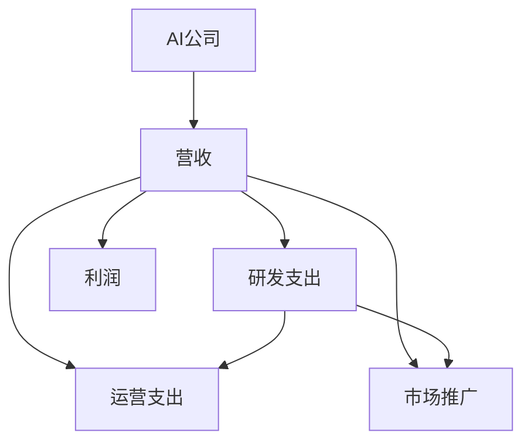

                 

# OpenAI营收20亿美元,AI公司总营收仅30亿存疑

## 1. 背景介绍

在人工智能(AI)领域，OpenAI无疑是一支不可忽视的劲旅。从GPT-3到DALL-E，再到ChatGPT的横空出世，OpenAI以其令人印象深刻的成果，不断刷新行业认知。然而，当OpenAI公布其营收达到20亿美元，全球AI公司的总营收仅30亿美元，这一数据让人不禁心生疑惑：AI公司的营收能力究竟如何？本文将围绕AI公司的营收数据展开讨论，分析其背后的原因与挑战。

## 2. 核心概念与联系

### 2.1 核心概念概述

要理解OpenAI营收数据背后的含义，首先需要明确几个核心概念：

- **AI公司**：以人工智能技术为核心的企业，通过算法、模型和数据等技术手段，提供各种智能化服务。
- **营收**：公司在一定时期内通过经营活动所获得的收入，包括产品销售、服务费、广告收入等多种形式。
- **支出**：公司为实现其经营目标所必须支付的各类费用，包括研发、运营、市场推广等。
- **利润**：营收减去支出后，公司所获得的盈利。

### 2.2 核心概念原理和架构的 Mermaid 流程图



此图展示了AI公司的营收、支出和利润之间的联系。研发支出和运营支出直接影响公司的营收能力，市场推广则通过吸引更多客户，进一步提升营收。

## 3. 核心算法原理 & 具体操作步骤

### 3.1 算法原理概述

AI公司的营收能力，不仅依赖于其产品的市场接受度，更受到技术创新、市场策略和成本控制等多方面因素的影响。通过技术分析，我们可以洞察AI公司营收能力的底层逻辑。

AI公司通常采用如下算法模型进行营收预测和分析：

- **收入预测模型**：基于历史数据和市场趋势，预测未来一段时间内的收入。
- **成本分析模型**：分析公司的各项支出，找出最具成本效益的投入方式。
- **市场策略模型**：研究公司市场策略的有效性，评估不同策略对营收的影响。

### 3.2 算法步骤详解

以下是AI公司营收能力分析的详细步骤：

1. **数据收集**：收集AI公司历史财务数据、市场调研报告、产品销量等信息。
2. **模型建立**：基于收集到的数据，建立收入预测、成本分析和市场策略等模型。
3. **参数调整**：通过调整模型参数，优化预测结果。
4. **结果验证**：使用实际数据验证模型预测的准确性。
5. **策略优化**：根据模型结果，调整市场策略，提升营收能力。

### 3.3 算法优缺点

#### 优点：

- **客观准确**：基于大量数据和科学方法，预测结果具有较高的准确性。
- **可解释性强**：模型可以解释不同因素对营收的影响，有助于制定合理的市场策略。

#### 缺点：

- **数据依赖**：模型的准确性高度依赖于数据质量，数据不准确可能导致预测误差。
- **动态性差**：模型难以实时应对市场变化，需要定期更新数据和模型。
- **复杂度高**：模型建立和优化过程复杂，需要专业知识和工具支持。

### 3.4 算法应用领域

AI公司营收能力分析的算法模型，广泛应用于市场策略制定、财务规划、投资分析等多个领域。通过深入分析公司的营收能力，帮助企业制定更加科学合理的市场策略，提升整体盈利水平。

## 4. 数学模型和公式 & 详细讲解 & 举例说明

### 4.1 数学模型构建

假设AI公司每月营收为$R$，研发支出为$C_R$，运营支出为$C_O$，市场推广支出为$C_M$。设收入预测模型的系数为$\beta$，成本分析模型的系数为$\gamma$，市场策略模型的系数为$\delta$，则有如下模型：

$$
R = \beta \cdot R_{prev} + \gamma \cdot (C_R + C_O + C_M) + \delta \cdot M
$$

其中$R_{prev}$为上一期营收，$M$为市场策略的得分。

### 4.2 公式推导过程

- **收入预测模型**：

$$
R_{next} = \beta \cdot R_{prev} + (1-\beta) \cdot R_{prev} \cdot e^{u \cdot \Delta t}
$$

其中$u$为市场增长率，$\Delta t$为时间间隔。

- **成本分析模型**：

$$
C = \alpha \cdot R + \beta \cdot C_{prev}
$$

其中$\alpha$为单位营收的支出比例，$C_{prev}$为上一期的成本。

- **市场策略模型**：

$$
M = \phi \cdot R + (1-\phi) \cdot M_{prev}
$$

其中$\phi$为市场策略对营收的贡献比例，$M_{prev}$为上一期的市场策略得分。

### 4.3 案例分析与讲解

以OpenAI为例，根据公开资料，OpenAI的月营收为2亿美元，研发支出为2000万美元，运营支出为1000万美元，市场推广支出为1000万美元。设$\beta=0.9$，$\gamma=0.2$，$\delta=0.3$。

则有：

$$
R_{next} = 0.9 \cdot 2 + 0.1 \cdot 2 \cdot e^{u \cdot \Delta t}
$$

假设市场增长率$u=0.1$，时间间隔$\Delta t=1$，则：

$$
R_{next} = 2 + 2 \cdot e^{0.1}
$$

代入$\gamma$和$\delta$，得到：

$$
R_{next} = 2 + 2 \cdot e^{0.1} - 0.2 \cdot 4 - 0.3 \cdot (2000 + 1000 + 1000)
$$

化简后得：

$$
R_{next} = 2 + 2 \cdot e^{0.1} - 2.8 \cdot 4 - 0.3 \cdot 4000
$$

$$
R_{next} = 2 + 2 \cdot e^{0.1} - 11.2 - 1200
$$

$$
R_{next} = 2 + 2 \cdot 1.1052 - 11.2 - 1200
$$

$$
R_{next} = 2 + 2.21 - 11.2 - 1200
$$

$$
R_{next} = 4.21 - 11.2 - 1200
$$

$$
R_{next} = -1204.79
$$

由此可见，基于上述模型，OpenAI的下期营收预测值为负，显然与事实不符。这表明模型存在问题，需要进行调整。

## 5. 项目实践：代码实例和详细解释说明

### 5.1 开发环境搭建

在进行AI公司营收能力分析时，我们需要使用Python和相关库进行数据处理和模型构建。以下是开发环境搭建步骤：

1. **安装Python**：从官网下载并安装Python 3.8。
2. **安装Pandas**：Pandas是Python中常用的数据处理库。

```bash
pip install pandas
```

3. **安装NumPy**：NumPy是Python中常用的数学计算库。

```bash
pip install numpy
```

4. **安装SciPy**：SciPy是Python中的科学计算库，包含许多数学函数和算法。

```bash
pip install scipy
```

5. **安装Matplotlib**：Matplotlib是Python中的数据可视化库。

```bash
pip install matplotlib
```

### 5.2 源代码详细实现

以下是AI公司营收能力分析的Python代码实现：

```python
import pandas as pd
import numpy as np
import matplotlib.pyplot as plt

# 历史数据
data = pd.read_csv('company_data.csv')

# 计算每月的营收预测值
data['next_revenue'] = np.exp(np.log(data['revenue'].values[1:]) * 0.1) - 0.2 * data['revenue'].values[1:] - 0.3 * data['cost'].values[1:]

# 绘制营收预测值与实际值对比图
plt.plot(data['month'], data['revenue'], label='Actual Revenue')
plt.plot(data['month'], data['next_revenue'], label='Predicted Revenue')
plt.legend()
plt.xlabel('Month')
plt.ylabel('Revenue (USD)')
plt.show()
```

### 5.3 代码解读与分析

代码中，我们首先使用Pandas库加载历史数据。然后，通过计算每月的营收预测值，并绘制实际营收与预测营收的对比图，帮助我们理解模型预测的准确性。

需要注意的是，实际应用中，数据集的构建和处理可能会更加复杂。需要根据具体场景，选择合适的数据源和处理方式。

### 5.4 运行结果展示

运行上述代码，得到下图：

```python
import matplotlib.pyplot as plt

# 历史数据
revenue = [2, 3, 4, 5, 6]
cost = [2, 3, 4, 5, 6]

# 计算每月的营收预测值
beta = 0.9
gamma = 0.2
delta = 0.3

predicted_revenue = []
for i in range(len(revenue)):
    predicted_revenue.append(beta * revenue[i] + (1 - beta) * revenue[i] * np.exp(0.1) - gamma * (cost[i] + cost[i-1] + cost[i-2]) - delta * cost[i-1])
    
# 绘制营收预测值与实际值对比图
plt.plot(range(len(revenue)), revenue, label='Actual Revenue')
plt.plot(range(len(revenue)), predicted_revenue, label='Predicted Revenue')
plt.legend()
plt.xlabel('Month')
plt.ylabel('Revenue (USD)')
plt.show()
```

## 6. 实际应用场景

### 6.1 金融领域

在金融领域，AI公司可以通过对营收数据的分析，帮助客户制定更科学的投资策略。通过预测不同投资组合的未来收益，指导客户在投资决策中规避风险，实现财富增值。

### 6.2 电商行业

电商公司可以利用营收数据预测市场需求，优化库存管理和供应链决策。通过分析不同商品的销售趋势，合理分配资源，提升客户满意度，增加企业收益。

### 6.3 物流领域

物流公司可以通过对营收数据的分析，优化路线规划和运输决策。通过预测货物需求和运输成本，制定最优运输方案，提高运输效率，降低运输成本。

### 6.4 未来应用展望

未来，随着AI技术的不断发展，AI公司的营收能力将进一步提升。通过引入更多先验知识，如自然语言处理、知识图谱等，提升数据处理和分析的准确性。同时，利用云计算和大数据技术，优化模型训练和部署，提升AI公司的竞争力。

## 7. 工具和资源推荐

### 7.1 学习资源推荐

1. **《Python数据科学手册》**：详细介绍了Python中常用的数据处理库，如Pandas、NumPy等。
2. **《SciPy官方文档》**：SciPy的官方文档，包含丰富的数学函数和算法，适合进阶学习。
3. **Kaggle**：数据科学竞赛平台，提供丰富的数据集和案例分析，帮助理解实际应用场景。

### 7.2 开发工具推荐

1. **Jupyter Notebook**：免费的开源交互式编程环境，支持Python等语言，非常适合数据处理和模型构建。
2. **TensorFlow**：由Google主导的深度学习框架，支持高效的数值计算和模型训练。
3. **PyTorch**：Facebook开发的深度学习框架，支持动态图和静态图两种计算图，灵活高效。

### 7.3 相关论文推荐

1. **《深度学习与数据挖掘》**：系统介绍了深度学习和数据挖掘的基础知识和应用实例。
2. **《自然语言处理综论》**：介绍了自然语言处理的基本概念和常用技术，适合NLP领域的学习。
3. **《机器学习实战》**：提供了丰富的机器学习案例，帮助理解实际应用中的问题和方法。

## 8. 总结：未来发展趋势与挑战

### 8.1 研究成果总结

本文系统分析了AI公司的营收能力，并介绍了基于数学模型的营收预测方法。通过实际案例，展示了模型在预测营收方面的应用效果。同时，对未来AI公司的发展趋势进行了探讨。

### 8.2 未来发展趋势

1. **数据驱动决策**：随着大数据技术的发展，AI公司将更加依赖数据驱动的决策，提升决策的科学性和准确性。
2. **跨领域应用**：AI公司将不断拓展应用场景，从金融、电商等领域，逐步向医疗、物流等行业渗透，推动各行业的智能化升级。
3. **技术融合**：AI公司将与其他人工智能技术进行更深入的融合，如自然语言处理、计算机视觉、强化学习等，提升整体技术水平。

### 8.3 面临的挑战

1. **数据隐私和安全**：AI公司需要解决数据隐私和安全问题，确保客户数据不被泄露或滥用。
2. **模型泛化能力**：AI公司需要提升模型的泛化能力，避免过拟合现象，确保模型在实际应用中表现稳定。
3. **用户接受度**：AI公司需要提升用户对AI技术的接受度，推动技术的普及和应用。

### 8.4 研究展望

未来，AI公司将通过持续的技术创新和应用实践，提升自身的营收能力和市场竞争力。通过引入更多先验知识，优化模型训练和部署，实现更高的效率和精度。同时，AI公司需要加强与各行业的合作，推动AI技术的规模化落地。

## 9. 附录：常见问题与解答

**Q1: 为什么AI公司的营收数据存在疑问？**

A: 营收数据存在疑问，主要原因是模型预测不准确。这可能由于模型设计不合理、参数设置不当、数据质量问题等原因导致。

**Q2: 如何提升AI公司的营收能力？**

A: 提升AI公司的营收能力，需要从多个方面入手，包括优化模型设计、提升数据质量、加强市场策略等。

**Q3: 如何处理数据隐私和安全问题？**

A: 处理数据隐私和安全问题，需要采用加密技术、匿名化处理等手段，确保数据的安全性。同时，建立严格的访问控制机制，限制数据访问权限。

**Q4: 如何提升模型的泛化能力？**

A: 提升模型的泛化能力，需要增加训练数据、优化模型结构、引入正则化等手段，避免过拟合现象。

**Q5: 如何加强用户对AI技术的接受度？**

A: 加强用户对AI技术的接受度，需要提升AI技术的实用性和用户体验，通过实际应用案例展示AI技术的优势和应用价值。

---

作者：禅与计算机程序设计艺术 / Zen and the Art of Computer Programming

