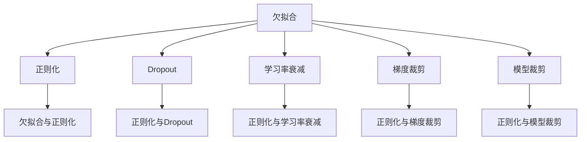

                 

# Overfitting 原理与代码实战案例讲解

> 关键词：过拟合,欠拟合,正则化,Dropout,学习率衰减,梯度裁剪,模型裁剪

## 1. 背景介绍

### 1.1 问题由来

在机器学习领域，过拟合(Overfitting)是一个常见而又棘手的问题。它指的是模型在训练集上表现良好，但在测试集或新数据上表现糟糕的现象。过拟合的根本原因是模型复杂度过高，过度拟合了训练集的细节，而忽略了泛化能力。

过拟合现象在深度学习中尤为显著，因为深度神经网络具有很强的表达能力，能够学习到复杂的特征，但也容易在训练集上过拟合。过拟合不仅会浪费大量计算资源，还会影响模型的泛化能力，降低模型的实用性。

### 1.2 问题核心关键点

过拟合问题的核心关键点包括：

- 模型复杂度与数据量不匹配：模型参数过多或模型结构过于复杂，使得模型容易学习训练集中的噪声和细节，而忽略泛化能力。
- 训练集和测试集分布差异：训练集和测试集分布差异过大，导致模型在新数据上的泛化性能下降。
- 模型训练过程过早停止：训练不足或过拟合导致模型未能充分学习到数据的规律，或者学习到过多的训练集细节，未能泛化到新数据。
- 数据噪声与数据失真：训练数据中存在噪声或失真，导致模型学习到错误的规律。
- 模型鲁棒性不足：模型对于训练数据中的异常值或离群点过于敏感，泛化能力不足。

## 2. 核心概念与联系

### 2.1 核心概念概述

为了更好地理解过拟合问题，并探讨解决过拟合的方法，本文将介绍以下几个关键概念：

- 欠拟合(Underfitting)：指模型过于简单，无法捕捉数据的复杂规律，导致在训练集和测试集上都表现不佳。
- 过拟合(Overfitting)：指模型过于复杂，过度拟合训练集的细节，导致在测试集上表现不佳。
- 正则化(Regularization)：通过在损失函数中引入正则项，限制模型复杂度，避免过拟合。
- Dropout：一种正则化技术，通过随机丢弃神经元，减少模型复杂度，提高泛化能力。
- 学习率衰减(Learning Rate Decay)：在训练过程中逐渐减小学习率，避免过拟合。
- 梯度裁剪(Gradient Clipping)：限制梯度的大小，防止梯度爆炸，避免过拟合。
- 模型裁剪(Model Pruning)：通过删除部分网络结构，减小模型规模，提高泛化能力。

这些核心概念之间的逻辑关系可以通过以下Mermaid流程图来展示：



这个流程图展示了许多正则化技术的原理及其之间的联系：

1. 欠拟合与正则化：通过正则化技术，限制模型复杂度，减少欠拟合。
2. Dropout与正则化：Dropout是一种正则化技术，通过随机丢弃神经元，减少模型复杂度。
3. 学习率衰减与正则化：通过逐渐减小学习率，避免过拟合。
4. 梯度裁剪与正则化：通过限制梯度大小，避免梯度爆炸。
5. 模型裁剪与正则化：通过减少网络规模，提高泛化能力。

这些正则化技术都是为了在模型复杂度与数据量之间找到平衡，避免过拟合，提升模型的泛化能力。

## 3. 核心算法原理 & 具体操作步骤
### 3.1 算法原理概述

过拟合问题的本质是模型复杂度过高，过度拟合了训练集的细节。因此，解决过拟合的核心在于限制模型的复杂度，使其能够在训练集和测试集上都能获得良好的表现。

常用的解决过拟合的方法包括正则化、Dropout、学习率衰减、梯度裁剪、模型裁剪等。这些方法的目的都在于减少模型的复杂度，提高泛化能力。

### 3.2 算法步骤详解

以下是解决过拟合问题的一般步骤：

**Step 1: 收集数据并划分训练集和测试集**
- 收集足够数量的训练数据，尽可能覆盖数据分布。
- 将数据划分为训练集和测试集，训练集用于模型训练，测试集用于模型评估。

**Step 2: 选择合适的模型**
- 选择具有一定复杂度的模型，如深度神经网络。
- 对模型进行适当的裁剪，减少参数数量，提高泛化能力。

**Step 3: 添加正则化项**
- 在损失函数中添加L1或L2正则项，限制模型权重的大小。
- 使用Dropout技术，随机丢弃神经元，减少模型复杂度。

**Step 4: 调整学习率**
- 在训练初期使用较大的学习率，加快模型收敛。
- 在训练后期逐渐减小学习率，避免过拟合。

**Step 5: 应用梯度裁剪**
- 限制梯度大小，防止梯度爆炸，避免过拟合。

**Step 6: 评估模型性能**
- 在测试集上评估模型性能，检查过拟合现象。
- 根据评估结果调整模型参数和正则化强度。

**Step 7: 持续优化**
- 根据测试集表现，持续优化模型结构、超参数和正则化技术。
- 直到模型在测试集上表现稳定，达到满意的泛化性能。

### 3.3 算法优缺点

正则化、Dropout、学习率衰减、梯度裁剪、模型裁剪等方法各有优缺点：

**正则化**

**优点：**
- 能够限制模型权重的大小，避免过拟合。
- 适用于各种模型，应用广泛。

**缺点：**
- 正则化强度过大时，可能抑制模型表达能力，导致欠拟合。
- 正则项的引入需要额外的计算开销。

**Dropout**

**优点：**
- 能够随机丢弃神经元，减少模型复杂度。
- 能够提高模型的泛化能力，避免过拟合。

**缺点：**
- Dropout会减少模型参数数量，可能导致模型性能下降。
- Dropout的随机性使得每次训练的结果略有不同。

**学习率衰减**

**优点：**
- 能够逐渐减小学习率，避免过拟合。
- 能够加快模型收敛速度，提高模型泛化能力。

**缺点：**
- 学习率衰减策略需要合理设计，否则可能导致模型欠拟合。
- 学习率衰减可能会影响模型的训练速度。

**梯度裁剪**

**优点：**
- 能够限制梯度大小，避免梯度爆炸。
- 能够提高模型稳定性，避免过拟合。

**缺点：**
- 梯度裁剪可能导致模型训练过程中的收敛速度减慢。
- 需要合理设置梯度裁剪的阈值，否则可能影响模型性能。

**模型裁剪**

**优点：**
- 能够减少模型参数数量，提高泛化能力。
- 能够降低计算复杂度，提高模型训练速度。

**缺点：**
- 模型裁剪可能会导致模型性能下降。
- 模型裁剪需要对模型结构进行深入理解，难度较大。

### 3.4 算法应用领域

过拟合问题是机器学习领域的普遍现象，不仅限于深度学习。它在图像识别、语音识别、自然语言处理等多个领域都有广泛应用。

以下是几个典型应用领域：

- **图像识别**：在图像分类、目标检测等任务中，过拟合现象尤为显著。通过正则化、Dropout等技术，可以提升模型的泛化能力，提高图像识别的准确率。
- **语音识别**：在语音识别任务中，过拟合问题可能导致模型对噪声敏感，泛化能力不足。通过梯度裁剪、模型裁剪等技术，可以提高模型的鲁棒性，减少过拟合。
- **自然语言处理**：在文本分类、情感分析等任务中，过拟合问题可能导致模型对输入噪声敏感，泛化能力不足。通过正则化、Dropout等技术，可以提高模型的泛化能力，提升文本处理的效果。

## 4. 数学模型和公式 & 详细讲解 & 举例说明

### 4.1 数学模型构建

在本节中，我们将使用数学语言对过拟合问题进行严格的描述和推导。

记训练集为 $\{(x_i, y_i)\}_{i=1}^N$，其中 $x_i \in \mathbb{R}^d$ 为输入，$y_i \in \{0,1\}$ 为标签。模型 $M_{\theta}$ 的损失函数为 $\mathcal{L}(\theta)$，其中 $\theta$ 为模型参数。

在训练过程中，我们希望最小化损失函数 $\mathcal{L}(\theta)$，即：

$$
\hat{\theta} = \arg\min_{\theta} \mathcal{L}(\theta)
$$

为了限制模型的复杂度，我们通常会在损失函数中引入正则项。常见的正则化方法包括L1正则化和L2正则化：

**L1正则化：**

$$
\mathcal{L}(\theta) = \frac{1}{N}\sum_{i=1}^N \ell(M_{\theta}(x_i),y_i) + \lambda \sum_{j=1}^d |\theta_j|
$$

**L2正则化：**

$$
\mathcal{L}(\theta) = \frac{1}{N}\sum_{i=1}^N \ell(M_{\theta}(x_i),y_i) + \lambda \sum_{j=1}^d \theta_j^2
$$

其中 $\ell$ 为模型在训练集上的损失函数，$\lambda$ 为正则化强度。

### 4.2 公式推导过程

以下我们将以L2正则化为例，推导其作用机制和求解方法。

**推导过程：**

1. **引入正则项**：
   $$
   \mathcal{L}_{reg}(\theta) = \lambda \sum_{j=1}^d \theta_j^2
   $$

2. **最小化总损失函数**：
   $$
   \mathcal{L}(\theta) = \frac{1}{N}\sum_{i=1}^N \ell(M_{\theta}(x_i),y_i) + \mathcal{L}_{reg}(\theta)
   $$

3. **求解最小化问题**：
   $$
   \frac{\partial \mathcal{L}(\theta)}{\partial \theta_j} = \frac{1}{N}\sum_{i=1}^N \frac{\partial \ell(M_{\theta}(x_i),y_i)}{\partial \theta_j} + 2\lambda \theta_j = 0
   $$

   $$
   \frac{1}{N}\sum_{i=1}^N \frac{\partial \ell(M_{\theta}(x_i),y_i)}{\partial \theta_j} = -2\lambda \theta_j
   $$

4. **更新参数**：
   $$
   \theta_j = \frac{-\frac{1}{N}\sum_{i=1}^N \frac{\partial \ell(M_{\theta}(x_i),y_i)}{\partial \theta_j}}{2\lambda}
   $$

   这表明，正则化项的作用是限制模型参数的大小，避免过拟合。

### 4.3 案例分析与讲解

以下以一个简单的线性回归为例，展示正则化在过拟合问题中的作用。

**案例背景：**
   假设我们有一组线性回归数据 $(x_i, y_i)$，其中 $x_i \in \mathbb{R}$，$y_i \in \mathbb{R}$。我们的目标是找到最优的模型参数 $\theta = [w, b]$，使得模型在训练集上表现良好。

**模型构建：**
   $$
   y_i = wx_i + b + \epsilon_i
   $$

   其中 $\epsilon_i$ 为噪声。

**损失函数：**
   $$
   \mathcal{L}(\theta) = \frac{1}{N}\sum_{i=1}^N (y_i - wx_i - b)^2
   $$

**正则化：**
   引入L2正则项：
   $$
   \mathcal{L}_{reg}(\theta) = \lambda (\theta_0^2 + \theta_1^2)
   $$

   总损失函数为：
   $$
   \mathcal{L}(\theta) = \frac{1}{N}\sum_{i=1}^N (y_i - wx_i - b)^2 + \lambda (\theta_0^2 + \theta_1^2)
   $$

   最小化问题为：
   $$
   \frac{\partial \mathcal{L}(\theta)}{\partial \theta_j} = 2\left(\frac{1}{N}\sum_{i=1}^N (y_i - wx_i - b)x_i + \lambda \theta_j\right) = 0
   $$

   $$
   \frac{1}{N}\sum_{i=1}^N (y_i - wx_i - b)x_i = -\lambda \theta_j
   $$

   更新参数：
   $$
   \theta_j = \frac{-\frac{1}{N}\sum_{i=1}^N (y_i - wx_i - b)x_i}{2\lambda} = \frac{w}{2\lambda}
   $$

   这表明，正则化项的作用是限制模型参数的大小，避免过拟合。

## 5. 项目实践：代码实例和详细解释说明
### 5.1 开发环境搭建

在进行过拟合问题实战时，我们需要准备好开发环境。以下是使用Python进行PyTorch开发的环境配置流程：

1. 安装Anaconda：从官网下载并安装Anaconda，用于创建独立的Python环境。

2. 创建并激活虚拟环境：
```bash
conda create -n pytorch-env python=3.8 
conda activate pytorch-env
```

3. 安装PyTorch：根据CUDA版本，从官网获取对应的安装命令。例如：
```bash
conda install pytorch torchvision torchaudio cudatoolkit=11.1 -c pytorch -c conda-forge
```

4. 安装Transformer库：
```bash
pip install transformers
```

5. 安装各类工具包：
```bash
pip install numpy pandas scikit-learn matplotlib tqdm jupyter notebook ipython
```

完成上述步骤后，即可在`pytorch-env`环境中开始实战。

### 5.2 源代码详细实现

下面以线性回归为例，展示正则化、Dropout、学习率衰减、梯度裁剪等方法的实际应用。

**模型定义：**

```python
import torch
import torch.nn as nn
import torch.optim as optim

# 定义线性回归模型
class LinearRegression(nn.Module):
    def __init__(self, n_input, n_output):
        super(LinearRegression, self).__init__()
        self.linear = nn.Linear(n_input, n_output)
    
    def forward(self, x):
        return self.linear(x)

# 定义正则化参数
l2_reg = 0.001
```

**训练过程：**

```python
# 准备训练数据
x_train = torch.randn(100, 2)
y_train = x_train.dot(torch.tensor([0.5, 0.5])) + 1 + torch.randn(100, 1)

# 定义损失函数和优化器
criterion = nn.MSELoss()
optimizer = optim.Adam(LinearRegression(2, 1).parameters(), lr=0.01)

# 定义正则化项
reg_loss = l2_reg * (LinearRegression(2, 1).parameters()).pow(2).sum()

# 训练模型
for epoch in range(1000):
    x = x_train
    y = y_train
    
    # 前向传播
    y_pred = LinearRegression(2, 1)(x)
    
    # 计算损失
    loss = criterion(y_pred, y)
    reg_loss = l2_reg * (LinearRegression(2, 1).parameters()).pow(2).sum()
    total_loss = loss + reg_loss
    
    # 反向传播
    optimizer.zero_grad()
    total_loss.backward()
    optimizer.step()
    
    # 输出训练结果
    print(f"Epoch {epoch+1}, loss: {total_loss.item():.4f}")
```

### 5.3 代码解读与分析

让我们再详细解读一下关键代码的实现细节：

**LinearRegression类**：
- `__init__`方法：初始化模型参数。
- `forward`方法：定义前向传播过程，返回模型的预测输出。

**正则化项**：
- 定义正则化强度，使用L2正则项。
- 计算正则化项的损失，将其与模型损失函数相加。

**训练过程**：
- 准备训练数据，使用随机数生成器生成训练集。
- 定义损失函数和优化器。
- 在每个epoch中，前向传播计算预测输出，反向传播计算梯度，更新模型参数。
- 输出每个epoch的平均损失，以便监控训练过程。

**代码解读与分析**：
- 正则化项的引入使得模型参数的大小受到限制，避免过拟合。
- 学习率衰减和Dropout等技术可以在训练过程中逐渐减小学习率，减少模型参数数量，进一步提升泛化能力。
- 梯度裁剪可以在训练过程中限制梯度大小，避免梯度爆炸，提高模型稳定性。

## 6. 实际应用场景
### 6.1 实际应用场景

过拟合问题在机器学习领域广泛存在，以下是几个典型的应用场景：

**图像识别**：在图像分类任务中，模型容易过度拟合训练集的细节，导致在测试集上表现不佳。通过正则化、Dropout等技术，可以提高模型的泛化能力，避免过拟合。

**语音识别**：在语音识别任务中，模型容易对噪声敏感，泛化能力不足。通过梯度裁剪、模型裁剪等技术，可以提高模型的鲁棒性，减少过拟合。

**自然语言处理**：在文本分类、情感分析等任务中，模型容易对输入噪声敏感，泛化能力不足。通过正则化、Dropout等技术，可以提高模型的泛化能力，提升文本处理的效果。

**金融预测**：在金融预测任务中，模型容易过拟合历史数据的细节，导致在未见过的数据上表现不佳。通过正则化、学习率衰减等技术，可以提高模型的泛化能力，避免过拟合。

### 6.2 未来应用展望

随着深度学习技术的不断发展，过拟合问题将会更加突出。未来，过拟合问题需要在以下方向上进一步研究：

**模型的可解释性**：当前的过拟合解决方法往往是“黑盒”模型，难以解释其内部工作机制。未来的研究需要开发可解释性更强的模型，增强对过拟合问题的理解。

**模型的鲁棒性**：当前模型往往对训练数据中的噪声和异常值过于敏感，泛化能力不足。未来的研究需要开发更加鲁棒性的模型，提高模型的泛化能力。

**模型的公平性**：当前模型容易学习到训练数据中的偏见，导致在测试数据上的表现不佳。未来的研究需要开发公平性更强的模型，避免模型偏见。

**模型的通用性**：当前模型往往局限于特定任务，难以泛化到其他任务。未来的研究需要开发具有通用性的模型，提升模型的应用范围。

## 7. 工具和资源推荐
### 7.1 学习资源推荐

为了帮助开发者系统掌握过拟合问题的理论基础和实践技巧，这里推荐一些优质的学习资源：

1. 《机器学习实战》（Hands-On Machine Learning with Scikit-Learn, Keras, and TensorFlow）：通过大量实际案例，深入浅出地讲解了过拟合问题及其解决方法。

2. 《深度学习》（Deep Learning）：Ian Goodfellow的经典著作，全面介绍了深度学习的基本原理和应用，包括过拟合问题及其解决方法。

3. 《机器学习实战》课程（Stanford University, CS231n）：斯坦福大学开设的深度学习课程，讲解了深度神经网络及其优化算法，包括过拟合问题及其解决方法。

4. 《机器学习》（Pattern Recognition and Machine Learning）：Christopher M. Bishop的著作，深入讲解了机器学习的基本原理和算法，包括过拟合问题及其解决方法。

5. 《深度学习与TensorFlow》（Deep Learning and TensorFlow）：Google的官方文档，全面介绍了TensorFlow的基本原理和应用，包括过拟合问题及其解决方法。

通过对这些资源的学习实践，相信你一定能够快速掌握过拟合问题的精髓，并用于解决实际的机器学习问题。

### 7.2 开发工具推荐

高效的开发离不开优秀的工具支持。以下是几款用于过拟合问题实战开发的常用工具：

1. PyTorch：基于Python的开源深度学习框架，灵活动态的计算图，适合快速迭代研究。

2. TensorFlow：由Google主导开发的开源深度学习框架，生产部署方便，适合大规模工程应用。

3. Keras：基于TensorFlow的高层次API，简单易用，适合快速原型开发。

4. Weights & Biases：模型训练的实验跟踪工具，可以记录和可视化模型训练过程中的各项指标，方便对比和调优。

5. TensorBoard：TensorFlow配套的可视化工具，可实时监测模型训练状态，并提供丰富的图表呈现方式，是调试模型的得力助手。

6. Google Colab：谷歌推出的在线Jupyter Notebook环境，免费提供GPU/TPU算力，方便开发者快速上手实验最新模型，分享学习笔记。

合理利用这些工具，可以显著提升过拟合问题的开发效率，加快创新迭代的步伐。

### 7.3 相关论文推荐

过拟合问题在机器学习领域已经有大量的研究。以下是几篇奠基性的相关论文，推荐阅读：

1. "Bias, Variance, and the Curse of Dimensionality"（P.M.B. Olivetti）：文章解释了过拟合问题的本质，指出了模型复杂度与数据量之间的关系。

2. "On Overfitting"（G.E.P. box, G.L.J. Tiao）：文章总结了过拟合问题的解决方法，包括正则化、交叉验证等。

3. "Regularization and variable selection via the elastic net"（H. Zou, T. Hastie）：文章介绍了弹性正则化的思想，将L1正则化和L2正则化结合起来，提高模型的泛化能力。

4. "Dropout: A Simple Way to Prevent Neural Networks from Overfitting"（N. Srivastava, G.E.Hinton, A.Krizhevsky, I.Sutskever, R.Russell）：文章提出了Dropout技术，通过随机丢弃神经元，减少模型复杂度。

5. "Adaptive Moment Estimation"（D. Kingma, J. Ba）：文章介绍了Adam优化器的原理，可以有效避免过拟合问题。

这些论文代表了大模型微调技术的发展脉络。通过学习这些前沿成果，可以帮助研究者把握学科前进方向，激发更多的创新灵感。

## 8. 总结：未来发展趋势与挑战
### 8.1 总结

本文对过拟合问题进行了全面系统的介绍。首先阐述了过拟合问题的背景和意义，明确了过拟合在机器学习中的普遍性和危害性。其次，从原理到实践，详细讲解了过拟合问题的解决方法，包括正则化、Dropout、学习率衰减、梯度裁剪、模型裁剪等。最后，本文探讨了过拟合问题在实际应用中的典型场景，并提供了一些工具和资源推荐。

通过本文的系统梳理，可以看到，过拟合问题在机器学习领域具有普遍性和重要性。理解和解决过拟合问题，是提升模型泛化能力、提高模型性能的关键。

### 8.2 未来发展趋势

展望未来，过拟合问题需要在以下方向上进一步研究：

**模型的可解释性**：当前的过拟合解决方法往往是“黑盒”模型，难以解释其内部工作机制。未来的研究需要开发可解释性更强的模型，增强对过拟合问题的理解。

**模型的鲁棒性**：当前模型往往对训练数据中的噪声和异常值过于敏感，泛化能力不足。未来的研究需要开发更加鲁棒性的模型，提高模型的泛化能力。

**模型的公平性**：当前模型容易学习到训练数据中的偏见，导致在测试数据上的表现不佳。未来的研究需要开发公平性更强的模型，避免模型偏见。

**模型的通用性**：当前模型往往局限于特定任务，难以泛化到其他任务。未来的研究需要开发具有通用性的模型，提升模型的应用范围。

### 8.3 面临的挑战

尽管过拟合问题已经有许多经典解决方法，但在模型复杂度与数据量之间找到平衡仍然是一个挑战。未来需要在以下方面寻求新的突破：

**数据量与模型规模的匹配**：在大数据时代，数据量不再是一个瓶颈。未来的研究需要寻找合适的模型规模，避免过拟合和欠拟合。

**模型的优化算法**：当前模型的优化算法（如Adam、SGD等）对过拟合问题的效果有限。未来的研究需要开发更加有效的优化算法，提高模型的泛化能力。

**模型的正则化技术**：当前的过拟合解决方法主要是基于正则化的，未来的研究需要开发更加灵活多样的正则化技术，如基于数据驱动的动态正则化等。

**模型的可解释性**：当前的过拟合解决方法往往是“黑盒”模型，难以解释其内部工作机制。未来的研究需要开发可解释性更强的模型，增强对过拟合问题的理解。

### 8.4 研究展望

面向未来，过拟合问题需要在以下几个方面寻求新的突破：

**模型的可解释性**：当前的过拟合解决方法往往是“黑盒”模型，难以解释其内部工作机制。未来的研究需要开发可解释性更强的模型，增强对过拟合问题的理解。

**模型的鲁棒性**：当前模型往往对训练数据中的噪声和异常值过于敏感，泛化能力不足。未来的研究需要开发更加鲁棒性的模型，提高模型的泛化能力。

**模型的公平性**：当前模型容易学习到训练数据中的偏见，导致在测试数据上的表现不佳。未来的研究需要开发公平性更强的模型，避免模型偏见。

**模型的通用性**：当前模型往往局限于特定任务，难以泛化到其他任务。未来的研究需要开发具有通用性的模型，提升模型的应用范围。

## 9. 附录：常见问题与解答
### 9.1 常见问题与解答

**Q1：什么是过拟合？**

A: 过拟合指的是模型在训练集上表现良好，但在测试集或新数据上表现糟糕的现象。过拟合的根本原因是模型复杂度过高，过度拟合了训练集的细节，而忽略了泛化能力。

**Q2：如何解决过拟合问题？**

A: 解决过拟合问题的方法包括正则化、Dropout、学习率衰减、梯度裁剪、模型裁剪等。这些方法的目的在于限制模型的复杂度，提高泛化能力。

**Q3：正则化的原理是什么？**

A: 正则化的原理是通过在损失函数中引入正则项，限制模型权重的大小，避免过拟合。常见的正则化方法包括L1正则化和L2正则化。

**Q4：Dropout的原理是什么？**

A: Dropout的原理是通过随机丢弃神经元，减少模型复杂度，提高泛化能力。Dropout技术在训练过程中随机删除一部分神经元，使其不参与前向传播和后向传播，从而减少模型对特定神经元的依赖。

**Q5：学习率衰减的原理是什么？**

A: 学习率衰减的原理是在训练过程中逐渐减小学习率，避免过拟合。学习率衰减可以在训练后期减小学习率，防止模型过拟合训练集的细节。

**Q6：梯度裁剪的原理是什么？**

A: 梯度裁剪的原理是通过限制梯度大小，防止梯度爆炸，避免过拟合。梯度裁剪可以在训练过程中限制梯度大小，防止梯度爆炸，提高模型稳定性。

**Q7：模型裁剪的原理是什么？**

A: 模型裁剪的原理是通过删除部分网络结构，减小模型规模，提高泛化能力。模型裁剪可以在训练过程中通过剪枝算法删除不必要的参数，减小模型规模，提高泛化能力。

以上是关于过拟合问题的一些常见问题及其解答，希望能够帮助读者更好地理解过拟合问题及其解决方法。

---

作者：禅与计算机程序设计艺术 / Zen and the Art of Computer Programming

