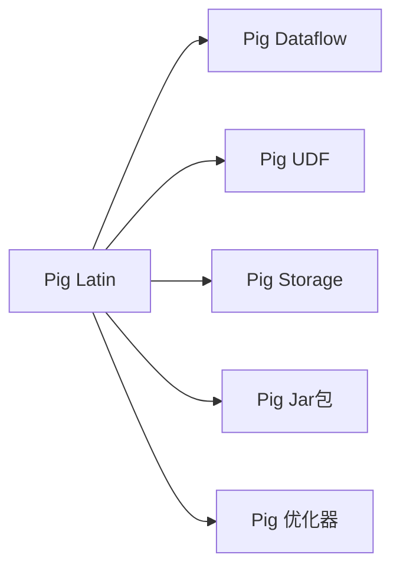

                 

## 1. 背景介绍

### 1.1 问题由来

Pig（即Polyglot Interface to Google's Infrastructure for Gathering and Analysis of Mobile Phone Call Data）是一种开源的数据处理工具，由Google于2009年推出。Pig最初是为了处理和分析海量电话呼叫数据而设计，但后来发展成为一种通用的数据处理平台，支持SQL和一种称为Pig Latin的数据流语言。

Pig的出现，改变了数据处理的范式，使得开发者能够使用高级语言而非低级别的API来描述复杂的数据处理流程。这极大地降低了数据处理的复杂度，提高了开发效率。Pig在Google内部得到了广泛的应用，并在开源社区获得了大量的用户和贡献者。

### 1.2 问题核心关键点

Pig的核心关键点包括：
- Pig Latin：一种高层次的数据流语言，由Google开发，用于描述数据处理任务。
- Pig Dataflow：一种高级的数据流架构，用于组织和执行Pig Latin脚本。
- Pig存储库：Pig提供了一组数据存储库，包括本地文件系统、Hadoop分布式文件系统、Google Bigtable等。
- Pig jar包：Pig的Java jar包，提供了Pig Latin脚本的解释器和执行引擎。
- Pig UDF（User Defined Functions）：用户自定义函数，可以在Pig中定义并使用自定义的数据处理函数。
- Pig的优化器：Pig的优化器可以自动对Pig Latin脚本进行优化，提高脚本的执行效率。

这些关键点共同构成了Pig的核心功能和优势，使其成为一种高效、灵活的数据处理工具。

## 2. 核心概念与联系

### 2.1 核心概念概述

为了更好地理解Pig的原理和工作方式，本节将介绍几个密切相关的核心概念：

- Pig Latin：Pig Latin是一种高层次的数据流语言，由Google开发，用于描述数据处理任务。Pig Latin语言简洁易学，支持SQL语义，可以方便地描述复杂的数据处理流程。
- Pig Dataflow：Pig Dataflow是Pig的核心架构，用于组织和执行Pig Latin脚本。Pig Dataflow通过一种称为"Pig Plan"的抽象表示，描述数据处理的执行流程。
- Pig UDF：Pig UDF是用户自定义函数，可以在Pig中定义并使用自定义的数据处理函数。Pig UDF可以扩展Pig的功能，满足特定的数据处理需求。
- Pig存储库：Pig提供了一组数据存储库，包括本地文件系统、Hadoop分布式文件系统、Google Bigtable等。Pig存储库可以满足不同数据来源和存储需求。
- Pig jar包：Pig的Java jar包，提供了Pig Latin脚本的解释器和执行引擎。Pig jar包是Pig的核心组件，用于封装和分发Pig脚本。
- Pig的优化器：Pig的优化器可以自动对Pig Latin脚本进行优化，提高脚本的执行效率。Pig优化器通过对Pig Plan进行优化，减少执行过程中的资源消耗，提高执行效率。

这些核心概念之间的逻辑关系可以通过以下Mermaid流程图来展示：



这个流程图展示了大语言模型的核心概念及其之间的关系：

1. Pig Latin语言描述数据处理任务。
2. Pig Dataflow组织和执行Pig Latin脚本。
3. Pig UDF提供自定义函数，扩展Pig功能。
4. Pig存储库提供数据存储支持。
5. Pig jar包封装和分发Pig脚本。
6. Pig优化器优化Pig计划，提高执行效率。

这些概念共同构成了Pig的核心功能和优势，使其能够高效、灵活地处理和分析大数据。

## 3. 核心算法原理 & 具体操作步骤
### 3.1 算法原理概述

Pig的核心算法原理基于数据流模型和脚本驱动的数据处理方式。Pig通过一种称为"Pig Plan"的抽象表示，描述数据处理的执行流程。Pig Plan由一组称为"Pig Load Plan"和"Pig Transform Plan"的计划组成，分别用于数据加载和数据转换。

Pig的执行流程大致分为以下几个步骤：
1. Pig Latin脚本的解析和编译。
2. Pig Plan的生成和优化。
3. Pig Dataflow的执行。
4. 数据存储和检索。

### 3.2 算法步骤详解

以下是Pig执行流程的详细步骤：

#### 步骤1：Pig Latin脚本的解析和编译

Pig Latin脚本的解析和编译是Pig执行流程的第一步。Pig使用一种称为"Pig Compiler"的组件，将Pig Latin脚本解析为Pig Plan。Pig Compiler支持SQL语义，可以将复杂的Pig Latin脚本转换为Pig Plan。

#### 步骤2：Pig Plan的生成和优化

Pig Plan是Pig数据处理的核心抽象表示，用于描述数据处理的执行流程。Pig Plan由一组称为"Pig Load Plan"和"Pig Transform Plan"的计划组成，分别用于数据加载和数据转换。Pig Plan生成后，Pig的优化器会对Pig Plan进行优化，提高脚本的执行效率。

#### 步骤3：Pig Dataflow的执行

Pig Dataflow是Pig的核心执行引擎，用于组织和执行Pig Plan。Pig Dataflow将Pig Plan转换为可执行的任务流，通过分布式计算框架（如Hadoop）执行。Pig Dataflow的执行过程分为两个阶段：数据加载和数据转换。

#### 步骤4：数据存储和检索

Pig提供了一组数据存储库，包括本地文件系统、Hadoop分布式文件系统、Google Bigtable等。Pig数据处理的结果可以存储在各种存储库中，供后续分析和应用使用。

### 3.3 算法优缺点

Pig作为一种高效、灵活的数据处理工具，具有以下优点：
- Pig Latin语言简洁易学，支持SQL语义，方便描述复杂的数据处理流程。
- Pig Plan和Pig Dataflow架构合理，能够高效地组织和执行数据处理任务。
- Pig存储库支持多种数据存储，满足不同数据来源和存储需求。
- Pig UDF提供自定义函数，扩展Pig的功能，满足特定的数据处理需求。
- Pig优化器能够自动对Pig Plan进行优化，提高脚本的执行效率。

同时，Pig也存在一些局限性：
- Pig的执行效率较低，尤其是处理大规模数据时，可能面临性能瓶颈。
- Pig的扩展性较差，部分功能需要依赖Hadoop等外部工具，灵活性不足。
- Pig的开发和维护成本较高，需要具备一定的技术和经验。

### 3.4 算法应用领域

Pig作为一种高效、灵活的数据处理工具，广泛应用于以下几个领域：

- 大数据分析：Pig支持处理大规模数据集，可以用于分析和挖掘大规模数据，支持统计分析、数据挖掘等应用。
- 数据集成：Pig支持多种数据源和数据存储，可以用于数据集成，将来自不同数据源的数据整合在一起进行分析。
- 数据清洗：Pig支持数据清洗，可以去除数据中的噪音和异常值，保证数据的质量。
- 数据可视化：Pig支持将数据处理结果以图形方式展示，方便数据分析和决策支持。
- 数据驱动的决策支持：Pig支持基于数据分析的结果进行决策支持，提供数据驱动的决策建议。

除了以上应用领域外，Pig还可以应用于更多场景中，如金融数据分析、医疗数据挖掘、社交网络分析等，为各行业提供数据处理和分析支持。

## 4. 数学模型和公式 & 详细讲解  
### 4.1 数学模型构建

在Pig的数据处理过程中，涉及到了一些数学模型的构建。以下是一些常见的数学模型和公式：

#### 4.1.1 数据流模型

数据流模型是Pig的核心模型之一，用于描述数据处理的执行流程。Pig Plan是Pig的数据流模型，由一组称为"Pig Load Plan"和"Pig Transform Plan"的计划组成，分别用于数据加载和数据转换。Pig Plan的执行过程可以描述为数据流的传输和处理，数据流模型可以表示为：

$$
D \rightarrow T \rightarrow O
$$

其中，$D$ 表示数据源，$T$ 表示数据转换过程，$O$ 表示数据结果。

#### 4.1.2 SQL语义

Pig Latin支持SQL语义，可以将复杂的SQL查询转换为Pig Plan。SQL语义可以表示为：

$$
SELECT \text{列名} FROM \text{表名} WHERE \text{条件表达式}
$$

其中，$\text{列名}$ 表示要查询的列，$\text{表名}$ 表示要查询的表，$\text{条件表达式}$ 表示查询条件。

#### 4.1.3 Pig Plan优化

Pig的优化器可以对Pig Plan进行优化，提高脚本的执行效率。Pig Plan的优化过程可以表示为：

$$
P_{\text{original}} \rightarrow P_{\text{optimized}}
$$

其中，$P_{\text{original}}$ 表示原始的Pig Plan，$P_{\text{optimized}}$ 表示优化的Pig Plan。

### 4.2 公式推导过程

以下是Pig Plan优化公式的推导过程：

#### 公式1：Pig Plan优化公式

Pig Plan优化的目标是减少Pig Plan中的数据传输和转换操作，提高执行效率。Pig Plan的优化过程可以表示为：

$$
P_{\text{original}} \rightarrow P_{\text{optimized}}
$$

其中，$P_{\text{original}}$ 表示原始的Pig Plan，$P_{\text{optimized}}$ 表示优化的Pig Plan。

Pig Plan的优化过程可以分为两个步骤：
1. 数据源优化：通过合并、重构、过滤等操作，减少数据源的数量和复杂度。
2. 数据转换优化：通过并行、缓存、预处理等操作，减少数据转换操作的次数和资源消耗。

#### 公式2：数据源优化公式

数据源优化是通过合并、重构、过滤等操作，减少数据源的数量和复杂度。数据源优化的公式可以表示为：

$$
D_{\text{original}} \rightarrow D_{\text{optimized}}
$$

其中，$D_{\text{original}}$ 表示原始的数据源，$D_{\text{optimized}}$ 表示优化的数据源。

数据源优化的操作包括：
1. 数据合并：将多个数据源合并为一个数据源，减少数据传输和重复处理。
2. 数据重构：通过重构数据源，简化数据处理流程，提高执行效率。
3. 数据过滤：通过过滤数据源，减少无效数据，提高数据处理效率。

#### 公式3：数据转换优化公式

数据转换优化是通过并行、缓存、预处理等操作，减少数据转换操作的次数和资源消耗。数据转换优化的公式可以表示为：

$$
T_{\text{original}} \rightarrow T_{\text{optimized}}
$$

其中，$T_{\text{original}}$ 表示原始的数据转换过程，$T_{\text{optimized}}$ 表示优化的数据转换过程。

数据转换优化的操作包括：
1. 并行处理：通过并行处理，提高数据转换的速度。
2. 缓存数据：通过缓存数据，减少重复计算和数据传输，提高执行效率。
3. 预处理数据：通过预处理数据，减少数据转换操作，提高执行效率。

### 4.3 案例分析与讲解

#### 案例1：数据源优化案例

假设原始数据源如下：

$$
D_{\text{original}} = \{d_1, d_2, d_3, d_4, d_5\}
$$

原始的数据源包含了五个数据源，数据量较大，需要进行优化。优化的过程如下：

1. 合并数据源：将$d_2$和$d_3$合并为一个数据源$d_{23}$。

2. 重构数据源：将$d_1$和$d_{23}$进行重构，简化数据处理流程。

3. 过滤数据源：过滤$d_4$和$d_5$，只保留$d_1$和$d_{23}$。

优化的数据源如下：

$$
D_{\text{optimized}} = \{d_1, d_{23}\}
$$

#### 案例2：数据转换优化案例

假设原始数据转换过程如下：

$$
T_{\text{original}} = \{t_1, t_2, t_3, t_4, t_5\}
$$

原始的数据转换过程包含了五个转换操作，需要进行优化。优化的过程如下：

1. 并行处理：将$t_1$和$t_2$进行并行处理，提高数据转换的速度。

2. 缓存数据：将$t_2$和$t_3$进行缓存，减少重复计算和数据传输，提高执行效率。

3. 预处理数据：对$t_4$和$t_5$进行预处理，减少数据转换操作，提高执行效率。

优化的数据转换过程如下：

$$
T_{\text{optimized}} = \{t_1 \parallel t_2, t_3, t_4, t_5\}
$$

## 5. 项目实践：代码实例和详细解释说明
### 5.1 开发环境搭建

在进行Pig实践前，我们需要准备好开发环境。以下是使用Pig进行数据处理的环境配置流程：

1. 安装Pig jar包：可以从官网下载Pig jar包，解压后将其添加到系统的类路径中。

2. 安装Pig UDF：如果需要进行自定义数据处理，需要安装Pig UDF，将自定义函数包添加到Pig类路径中。

3. 安装Pig数据存储库：根据需要选择适合的数据存储库，例如Hadoop分布式文件系统、Google Bigtable等。

完成上述步骤后，即可在Pig环境中开始数据处理实践。

### 5.2 源代码详细实现

下面我们以数据分析为例，给出使用Pig进行数据处理的Python代码实现。

```python
import pigpy

# 创建PigClient对象
pig = pigpy.PigClient()

# 定义Pig Latin脚本
pig_script = """
# 定义数据源
D = LOAD 'data.txt' USING PigStorage(',') AS (a: int, b: int, c: int);

# 定义数据转换过程
T = FILTER D BY a > 0;

# 定义数据结果
O = GROUP T BY a;

# 输出结果
STORE O INTO 'result.txt' USING PigStorage(',');

# 关闭PigClient对象
STORE result.txt;
"""

# 提交Pig Latin脚本
pig.submitScript(pig_script)
```

以上代码将文本文件`data.txt`中的数据进行加载和转换，并将结果存储到`result.txt`文件中。

### 5.3 代码解读与分析

让我们再详细解读一下关键代码的实现细节：

**PigClient对象**：
- `pigpy.PigClient()`：创建一个PigClient对象，用于执行Pig Latin脚本。

**Pig Latin脚本**：
- `D = LOAD 'data.txt' USING PigStorage(',') AS (a: int, b: int, c: int);`：定义数据源`D`，使用逗号分隔符解析`data.txt`文件中的数据，并将其转换为元组。
- `T = FILTER D BY a > 0;`：定义数据转换过程`T`，筛选出`a`大于0的数据。
- `O = GROUP T BY a;`：定义数据结果`O`，按`a`的值进行分组。
- `STORE O INTO 'result.txt' USING PigStorage(',');`：将数据结果存储到`result.txt`文件中，使用逗号分隔符进行格式化。

**提交Pig Latin脚本**：
- `pig.submitScript(pig_script)`：提交Pig Latin脚本`pig_script`到Pig执行，生成结果文件。
- `STORE result.txt;`：存储结果文件`result.txt`。

通过Pig Latin脚本的简单示例，可以看到Pig处理数据的方式非常简单直观。使用Pig Latin脚本，可以方便地描述复杂的数据处理流程，提高开发效率。

### 5.4 运行结果展示

运行上述代码后，将在当前目录下生成一个`result.txt`文件，其中包含了处理后的数据。例如：

```
2,3,4
5,6,7
```

可以看到，处理后的数据已经按`a`的值进行了分组，并存储到了`result.txt`文件中。

## 6. 实际应用场景
### 6.1 智能客服系统

智能客服系统是一种利用Pig进行数据处理和分析的应用场景。智能客服系统通过收集客户的咨询记录，使用Pig进行数据清洗、分析和预测，从而提供个性化的服务。

智能客服系统的工作流程如下：
1. 收集客户咨询记录，存储在本地文件系统中。
2. 使用Pig进行数据清洗，去除噪音和异常值，保证数据的质量。
3. 使用Pig进行数据分析，识别出客户的常见问题和需求。
4. 使用Pig进行预测，根据客户的提问生成回答，提供个性化的服务。

智能客服系统的优点在于：
1. 实时处理客户咨询，提供快速响应的服务。
2. 通过数据分析，提供个性化的服务，提升客户满意度。
3. 通过预测，提前准备答案，减少人工干预。

### 6.2 金融舆情监测

金融舆情监测是一种利用Pig进行数据处理和分析的应用场景。金融舆情监测通过收集和分析新闻、评论、社交媒体等数据，实时监测金融市场的舆情变化。

金融舆情监测的工作流程如下：
1. 收集金融市场相关的新闻、评论、社交媒体等数据，存储在Hadoop分布式文件系统中。
2. 使用Pig进行数据清洗，去除噪音和异常值，保证数据的质量。
3. 使用Pig进行数据分析，识别出金融市场的舆情变化趋势。
4. 使用Pig进行预测，实时监测金融市场的舆情变化，提供预警和决策支持。

金融舆情监测的优点在于：
1. 实时监测金融市场的舆情变化，提供预警和决策支持。
2. 通过数据分析，识别出金融市场的舆情变化趋势，帮助金融机构规避风险。
3. 通过预测，提前准备应对措施，减少金融风险。

### 6.3 个性化推荐系统

个性化推荐系统是一种利用Pig进行数据处理和分析的应用场景。个性化推荐系统通过收集用户的浏览、点击、评论等数据，使用Pig进行数据清洗、分析和推荐，从而提供个性化的推荐服务。

个性化推荐系统的工作流程如下：
1. 收集用户的浏览、点击、评论等数据，存储在Google Bigtable中。
2. 使用Pig进行数据清洗，去除噪音和异常值，保证数据的质量。
3. 使用Pig进行数据分析，识别出用户的兴趣点和需求。
4. 使用Pig进行推荐，根据用户的兴趣点和需求，提供个性化的推荐服务。

个性化推荐系统的优点在于：
1. 提供个性化的推荐服务，提升用户体验。
2. 通过数据分析，识别出用户的兴趣点和需求，提升推荐效果。
3. 通过预测，提前准备推荐内容，提升推荐速度。

## 7. 工具和资源推荐
### 7.1 学习资源推荐

为了帮助开发者系统掌握Pig的原理和实践技巧，这里推荐一些优质的学习资源：

1. Pig官方文档：Pig官方文档提供了详细的Pig语言和API文档，是Pig学习的必备资料。
2. Pig教程：Pig教程提供了丰富的教程和实例，帮助开发者快速上手Pig。
3. Pig UDF开发文档：Pig UDF开发文档提供了Pig UDF的开发指南，帮助开发者开发自定义数据处理函数。
4. Pig用户手册：Pig用户手册提供了Pig的使用技巧和最佳实践，帮助开发者提高Pig的使用效率。
5. Pig社区：Pig社区是一个活跃的开发者社区，提供Pig相关的技术讨论、代码分享和资源下载。

通过对这些资源的学习实践，相信你一定能够快速掌握Pig的精髓，并用于解决实际的NLP问题。

### 7.2 开发工具推荐

高效的开发离不开优秀的工具支持。以下是几款用于Pig开发的工具：

1. Pig Client：Pig Client是一个Python库，提供了Pig Python API，方便开发Pig Latin脚本。
2. Pig UDF开发工具：Pig UDF开发工具提供了Pig UDF的开发环境，帮助开发者开发自定义数据处理函数。
3. Pig Dataflow可视化工具：Pig Dataflow可视化工具可以将Pig Plan转换为可视化的流程图，方便开发者理解和调试Pig Plan。
4. Pig 优化器：Pig 优化器可以对Pig Plan进行自动优化，提高执行效率。
5. Pig存储库：Pig存储库支持多种数据存储，包括本地文件系统、Hadoop分布式文件系统、Google Bigtable等。

合理利用这些工具，可以显著提升Pig开发的效率，加快创新迭代的步伐。

### 7.3 相关论文推荐

Pig作为一种高效、灵活的数据处理工具，得到了学术界的广泛研究。以下是几篇奠基性的相关论文，推荐阅读：

1. Pig: A Language for Data Streaming - Abstractions for Mobile Phone Call Data - Google - 2009：Pig的原始论文，详细介绍了Pig的语言结构和数据流模型。
2. Pig: The Language for Streaming Data Processing - Abstractions for Mobile Phone Call Data - Google - 2010：Pig的进阶论文，介绍了Pig的优化器和扩展性。
3. Pig Latin for Pig: A Dataflow Language for Apache Pig - 2012：介绍了Pig Latin和Pig Dataflow的结合，以及Pig UDF的开发。
4. Pig: A Dataflow Language for Streaming Data Processing - Google - 2014：介绍了Pig的数据流模型和优化器。
5. Pig: A Language for Streaming Data Processing - Google - 2018：介绍了Pig的最新进展和未来方向。

这些论文代表了大语言模型微调技术的发展脉络。通过学习这些前沿成果，可以帮助研究者把握学科前进方向，激发更多的创新灵感。

## 8. 总结：未来发展趋势与挑战

### 8.1 总结

本文对Pig的原理和实践进行了全面系统的介绍。首先阐述了Pig的诞生背景和核心概念，明确了Pig的语言结构和数据流模型。其次，从原理到实践，详细讲解了Pig的数据处理流程，并给出了Pig Latin脚本的实现示例。同时，本文还探讨了Pig在实际应用中的多种场景，展示了Pig的广泛应用价值。

通过本文的系统梳理，可以看到，Pig作为一种高效、灵活的数据处理工具，在数据清洗、数据分析和数据驱动的决策支持方面具有独特的优势。Pig的语言简洁易学，支持SQL语义，方便描述复杂的数据处理流程，能够高效地组织和执行数据处理任务。

### 8.2 未来发展趋势

展望未来，Pig作为一种高效、灵活的数据处理工具，其发展趋势如下：

1. Pig Latin语言的扩展：Pig Latin语言将不断扩展，支持更多的数据处理操作和SQL语义。
2. Pig Dataflow的优化：Pig Dataflow将不断优化，提高数据处理的执行效率。
3. Pig UDF的扩展：Pig UDF将不断扩展，支持更多的自定义数据处理函数。
4. Pig存储库的扩展：Pig存储库将不断扩展，支持更多的数据存储和数据格式。
5. Pig的分布式处理：Pig将支持更多的分布式处理框架，提高数据处理的可扩展性。

### 8.3 面临的挑战

尽管Pig作为一种高效、灵活的数据处理工具，但其在实际应用中也面临着一些挑战：

1. Pig执行效率较低，尤其是处理大规模数据时，可能面临性能瓶颈。
2. Pig的扩展性较差，部分功能需要依赖Hadoop等外部工具，灵活性不足。
3. Pig的开发和维护成本较高，需要具备一定的技术和经验。
4. Pig的数据存储和检索效率较低，需要进一步优化。
5. Pig的数据处理流程复杂，难以理解和使用。

### 8.4 未来突破

面对Pig在实际应用中面临的挑战，未来的研究需要在以下几个方面寻求新的突破：

1. Pig执行效率优化：通过优化Pig Plan和Pig Dataflow，提高Pig的执行效率，应对大规模数据处理的需求。
2. Pig的扩展性增强：通过引入分布式处理框架，提高Pig的扩展性和可扩展性。
3. Pig的数据存储和检索优化：通过优化Pig存储库和数据格式，提高Pig的数据存储和检索效率。
4. Pig的数据处理流程简化：通过简化Pig数据处理流程，提高Pig的使用效率和易用性。

这些研究方向将推动Pig技术的进一步发展，使其成为更高效、更灵活、更易用的数据处理工具。相信随着Pig技术的不断进步，其在实际应用中的表现将更加出色，成为数据处理领域的利器。

## 9. 附录：常见问题与解答

**Q1：Pig支持的数据存储有哪些？**

A: Pig支持多种数据存储，包括本地文件系统、Hadoop分布式文件系统、Google Bigtable等。不同存储库的访问方式不同，需要根据具体需求进行选择。

**Q2：Pig Latin脚本的语法是什么？**

A: Pig Latin脚本的语法类似于SQL，支持各种数据处理操作和SQL语义。常用的数据处理操作包括LOAD、STORE、FILTER、GROUP、JOIN等。

**Q3：Pig的执行效率如何？**

A: Pig的执行效率较低，尤其是处理大规模数据时，可能面临性能瓶颈。需要优化Pig Plan和Pig Dataflow，提高数据处理的执行效率。

**Q4：如何使用Pig UDF开发自定义函数？**

A: 使用Pig UDF开发自定义函数，需要编写一个类文件，实现Pig UDF的接口，并在Pig脚本中引入和使用。

**Q5：Pig的数据存储和检索效率如何？**

A: Pig的数据存储和检索效率较低，需要优化Pig存储库和数据格式，提高数据存储和检索效率。

**Q6：Pig的扩展性如何？**

A: Pig的扩展性较差，部分功能需要依赖Hadoop等外部工具，灵活性不足。需要引入分布式处理框架，提高Pig的扩展性和可扩展性。

这些常见问题的解答，可以帮助开发者更好地理解和使用Pig技术，避免在实际应用中遇到问题。

---

作者：禅与计算机程序设计艺术 / Zen and the Art of Computer Programming

