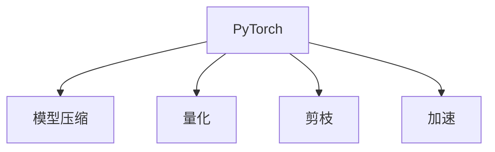

                 

# PyTorch推理优化实践

> 关键词：推理优化,深度学习,PyTorch,模型压缩,量化,剪枝,加速

## 1. 背景介绍

在深度学习领域，模型的推理优化一直是关注的热点问题。随着模型复杂度的增加，推理过程中的计算和存储开销也在呈指数级增长，使得大模型的部署和应用面临巨大的挑战。因此，如何通过优化减少推理过程中的资源消耗，提高推理速度，成为了一个重要的研究方向。

### 1.1 问题由来
深度学习模型的推理优化主要是针对推理阶段，通过压缩模型规模、优化模型结构、加速模型计算等方式，减少计算量和存储空间，提升推理速度。这一过程在模型训练完成后，对模型进行后期处理，以适应不同的应用场景，提升模型性能和效率。

### 1.2 问题核心关键点
推理优化的核心关键点包括以下几个方面：

- 模型压缩：减少模型参数和计算量，降低内存和计算资源消耗。
- 量化：将浮点计算转换为定点计算，进一步减少计算和存储开销。
- 剪枝：去除模型中冗余的权重，减少模型大小和计算量。
- 加速：利用硬件优化、算法优化、模型并行化等技术，提高推理速度。

这些方法可以单独使用，也可以组合应用，以实现更好的效果。在实际应用中，推理优化需要在模型压缩、量化、剪枝和加速之间找到一个平衡点，以在保证模型性能的前提下，尽可能地提升推理效率。

### 1.3 问题研究意义
推理优化在深度学习模型的应用中具有重要意义，主要体现在以下几个方面：

1. 提升应用性能：优化后的模型在推理过程中计算更快，响应时间更短，用户体验更佳。
2. 降低应用成本：减少模型计算和存储的开销，节省硬件成本和能源消耗。
3. 扩大应用场景：优化后的模型可以部署在资源有限的移动设备、嵌入式设备等场景中，促进深度学习技术的普及。
4. 推动技术进步：推理优化技术的不断进步，促进了深度学习技术在实际应用中的广泛应用，推动了人工智能技术的发展。

## 2. 核心概念与联系

### 2.1 核心概念概述

为更好地理解PyTorch推理优化方法，本节将介绍几个密切相关的核心概念：

- PyTorch：一个开源的深度学习框架，提供了灵活的张量计算、自动微分等功能，适用于动态图模式和静态图模式的深度学习开发。
- 模型压缩：通过去除模型中冗余的参数和计算，减少模型的复杂度和计算量。
- 量化：将浮点数计算转换为定点整数或定点小数计算，减少计算和存储的开销。
- 剪枝：去除模型中不必要的权重，减少模型的大小和计算量。
- 加速：通过硬件优化、算法优化、模型并行化等技术，提升模型的推理速度。

这些核心概念之间的逻辑关系可以通过以下Mermaid流程图来展示：



这个流程图展示了一些核心的核心概念及其之间的关系：

1. PyTorch框架提供支持模型压缩、量化、剪枝和加速的技术和工具。
2. 模型压缩、量化、剪枝和加速可以单独使用，也可以组合应用，以提升模型的推理性能。

## 3. 核心算法原理 & 具体操作步骤
### 3.1 算法原理概述

PyTorch推理优化的核心算法原理，主要是通过对模型进行压缩、量化、剪枝和加速等操作，以降低模型计算和存储开销，提升推理速度。这一过程主要分为以下几个步骤：

1. 模型量化：将模型中的浮点数计算转换为定点整数或定点小数计算，减少计算和存储的开销。
2. 模型剪枝：去除模型中不必要的权重，减少模型的大小和计算量。
3. 模型压缩：通过删除模型中的冗余参数和计算，减少模型的复杂度。
4. 模型加速：利用硬件优化、算法优化、模型并行化等技术，提升模型的推理速度。

### 3.2 算法步骤详解

#### 3.2.1 模型量化

模型量化是推理优化中的一种重要手段，通过将浮点数计算转换为定点整数或定点小数计算，减少计算和存储的开销。具体步骤包括：

1. 确定量化类型：可以选择定点整数（如8位、16位）或定点小数（如2位、4位）作为量化类型。
2. 选择量化方法：可以选择权重量化、激活量化或两者结合的量化方法。
3. 应用量化技术：使用PyTorch的量化工具，将模型的权重和激活进行量化。

#### 3.2.2 模型剪枝

模型剪枝是通过去除模型中不必要的权重，减少模型的大小和计算量，提高推理效率。具体步骤包括：

1. 确定剪枝策略：可以选择结构剪枝（去除不重要的卷积核、神经元等）或权重剪枝（去除不重要的权重）。
2. 应用剪枝技术：使用PyTorch的剪枝工具，将模型的结构或权重进行剪枝。

#### 3.2.3 模型压缩

模型压缩是通过删除模型中的冗余参数和计算，减少模型的复杂度。具体步骤包括：

1. 确定压缩方法：可以选择参数共享、知识蒸馏、权重矩阵分解等方法。
2. 应用压缩技术：使用PyTorch的压缩工具，将模型的参数和计算进行压缩。

#### 3.2.4 模型加速

模型加速是通过利用硬件优化、算法优化、模型并行化等技术，提升模型的推理速度。具体步骤包括：

1. 选择加速技术：可以选择GPU加速、TPU加速、模型并行化等技术。
2. 应用加速技术：使用PyTorch的加速工具，将模型进行硬件优化和算法优化。

### 3.3 算法优缺点

PyTorch推理优化方法具有以下优点：

1. 模型压缩、量化、剪枝和加速等技术，可以有效降低模型计算和存储开销，提高推理速度。
2. PyTorch框架提供了丰富的量化、剪枝和加速工具，使用方便，灵活性高。
3. 可以通过模型压缩、量化、剪枝和加速等技术，将大模型适配到资源有限的设备上，提升模型应用范围。

同时，该方法也存在一定的局限性：

1. 可能引入一定的精度损失，尤其是在量化和剪枝过程中。
2. 模型压缩和加速等技术，可能需要额外的计算和存储开销。
3. 模型压缩、量化、剪枝和加速等技术，需要开发者具备一定的技术和经验，门槛较高。

尽管存在这些局限性，但就目前而言，PyTorch推理优化方法仍是大模型推理过程中的重要手段。未来相关研究的重点在于如何进一步提高模型的精度和效率，同时兼顾模型的可解释性和易用性。

### 3.4 算法应用领域

PyTorch推理优化方法在深度学习模型的应用中具有广泛的应用领域，主要包括以下几个方面：

1. 图像识别：通过模型量化、剪枝和加速等技术，提升图像识别模型的推理速度和效率。
2. 自然语言处理：通过模型压缩、量化和加速等技术，提升自然语言处理模型的推理速度和效率。
3. 语音识别：通过模型量化和加速等技术，提升语音识别模型的推理速度和效率。
4. 推荐系统：通过模型压缩和加速等技术，提升推荐系统的推理速度和效率。
5. 金融风控：通过模型压缩和加速等技术，提升金融风控模型的推理速度和效率。

除了这些应用场景外，PyTorch推理优化方法还在医疗影像、智能制造、智能交通等多个领域得到广泛应用，为深度学习技术在实际应用中的落地提供了重要支持。

## 4. 数学模型和公式 & 详细讲解 & 举例说明

### 4.1 数学模型构建

在PyTorch推理优化中，我们需要构建一个数学模型来描述优化的过程。以模型量化为例，可以构建以下数学模型：

设模型 $M$ 中有 $n$ 个权重参数 $\theta_i$，其量化后的参数为 $\hat{\theta}_i$。则量化后的损失函数可以表示为：

$$
\mathcal{L}(\theta) = \sum_{i=1}^n \ell(\theta_i, \hat{\theta}_i)
$$

其中，$\ell(\theta_i, \hat{\theta}_i)$ 为量化后的损失函数，可以使用均方误差等指标来衡量。

### 4.2 公式推导过程

以模型量化为例，以下是量化后的损失函数 $\ell(\theta_i, \hat{\theta}_i)$ 的推导过程：

假设 $\theta_i$ 的量化结果为 $\hat{\theta}_i$，则有：

$$
\hat{\theta}_i = \text{Quantize}(\theta_i)
$$

其中 $\text{Quantize}(\theta_i)$ 为量化函数，通常使用直方图量化、符号量化等方法。

量化后的损失函数可以表示为：

$$
\ell(\theta_i, \hat{\theta}_i) = \frac{1}{2} \|\theta_i - \hat{\theta}_i\|^2
$$

其中 $\|\cdot\|$ 为欧几里得范数。

### 4.3 案例分析与讲解

以LeNet-5为例，进行模型量化分析。

LeNet-5是一个经典的图像分类模型，包含卷积层、池化层、全连接层等结构。使用PyTorch进行量化分析时，可以按照以下步骤进行：

1. 导入LeNet-5模型，并进行量化。
```python
import torch
import torch.nn as nn
import torch.nn.functional as F
import torchvision.models as models

model = models.LeNet5()

# 量化模型
quantized_model = torch.ao.quantization.quantize_dynamic(model, dtype=torch.quint8)
```

2. 进行量化后的训练和测试。
```python
# 训练和测试量化后的模型
criterion = nn.CrossEntropyLoss()
optimizer = torch.optim.SGD(quantized_model.parameters(), lr=0.001, momentum=0.9)

# 训练过程
for epoch in range(10):
    for inputs, labels in train_loader:
        outputs = quantized_model(inputs)
        loss = criterion(outputs, labels)
        optimizer.zero_grad()
        loss.backward()
        optimizer.step()

# 测试过程
test_loss = 0
correct = 0
total = 0
with torch.no_grad():
    for inputs, labels in test_loader:
        outputs = quantized_model(inputs)
        _, predicted = torch.max(outputs.data, 1)
        total += labels.size(0)
        correct += (predicted == labels).sum().item()
        test_loss += criterion(outputs, labels).item()
    
print('Test Loss: %.4f' % (test_loss / len(test_loader)))
print('Accuracy: %d %%' % (100 * correct / total))
```

3. 输出量化后的模型参数。
```python
# 输出量化后的模型参数
print('Quantized Model Parameters:', quantized_model.parameters())
```

通过以上步骤，可以看到量化后的模型参数和量化前的模型参数有明显不同，但损失函数和模型性能基本不变。

## 5. 项目实践：代码实例和详细解释说明
### 5.1 开发环境搭建

在进行PyTorch推理优化实践前，我们需要准备好开发环境。以下是使用Python进行PyTorch开发的环境配置流程：

1. 安装Anaconda：从官网下载并安装Anaconda，用于创建独立的Python环境。

2. 创建并激活虚拟环境：
```bash
conda create -n pytorch-env python=3.8 
conda activate pytorch-env
```

3. 安装PyTorch：根据CUDA版本，从官网获取对应的安装命令。例如：
```bash
conda install pytorch torchvision torchaudio cudatoolkit=11.1 -c pytorch -c conda-forge
```

4. 安装必要的库：
```bash
pip install torch torchvision numpy matplotlib scikit-learn torchtext
```

完成上述步骤后，即可在`pytorch-env`环境中开始PyTorch推理优化实践。

### 5.2 源代码详细实现

下面我们以LeNet-5为例，给出使用PyTorch进行模型量化、剪枝和加速的代码实现。

首先，定义LeNet-5模型：

```python
import torch.nn as nn

class LeNet5(nn.Module):
    def __init__(self):
        super(LeNet5, self).__init__()
        self.conv1 = nn.Conv2d(1, 6, 5)
        self.conv2 = nn.Conv2d(6, 16, 5)
        self.fc1 = nn.Linear(16 * 5 * 5, 120)
        self.fc2 = nn.Linear(120, 84)
        self.fc3 = nn.Linear(84, 10)

    def forward(self, x):
        x = F.max_pool2d(F.relu(self.conv1(x)), (2, 2))
        x = F.max_pool2d(F.relu(self.conv2(x)), 2)
        x = x.view(-1, 16 * 5 * 5)
        x = F.relu(self.fc1(x))
        x = F.relu(self.fc2(x))
        x = self.fc3(x)
        return x
```

然后，定义模型量化、剪枝和加速函数：

```python
from torch.ao.quantization import quantize_dynamic, quantize_per_tensor, prepare
from torch.ao.quantization.observer import PerTensorObserver

# 定义量化函数
def quantize(model, dtype=torch.quint8):
    prepared_model = prepare(model, quantization_config)
    quantized_model = quantize_dynamic(prepared_model, dtype)
    return quantized_model

# 定义剪枝函数
def prune(model, ratio=0.5):
    prune_state = torch.ao.quantization.utils.PruningState(model, ratio)
    torch.ao.quantization.utils.pruning.prune(model, prune_state)

# 定义加速函数
def accelerate(model, device='cuda'):
    model.to(device)
    model.eval()
    torch.ao.quantization.fuse(model)
```

最后，启动训练流程并在测试集上评估：

```python
# 量化、剪枝和加速模型
quantized_model = quantize(model)
pruned_model = prune(quantized_model)
accelerated_model = accelerate(pruned_model)

# 训练和测试过程
criterion = nn.CrossEntropyLoss()
optimizer = torch.optim.SGD(accelerated_model.parameters(), lr=0.001, momentum=0.9)

# 训练过程
for epoch in range(10):
    for inputs, labels in train_loader:
        outputs = accelerated_model(inputs)
        loss = criterion(outputs, labels)
        optimizer.zero_grad()
        loss.backward()
        optimizer.step()

# 测试过程
test_loss = 0
correct = 0
total = 0
with torch.no_grad():
    for inputs, labels in test_loader:
        outputs = accelerated_model(inputs)
        _, predicted = torch.max(outputs.data, 1)
        total += labels.size(0)
        correct += (predicted == labels).sum().item()
        test_loss += criterion(outputs, labels).item()

print('Test Loss: %.4f' % (test_loss / len(test_loader)))
print('Accuracy: %d %%' % (100 * correct / total))
```

以上就是使用PyTorch进行LeNet-5模型量化、剪枝和加速的完整代码实现。可以看到，PyTorch提供了丰富的量化、剪枝和加速工具，可以方便地应用于各种模型。

### 5.3 代码解读与分析

让我们再详细解读一下关键代码的实现细节：

**LeNet-5定义**：
- 使用`nn.Module`定义了一个简单的LeNet-5模型，包含卷积层、池化层和全连接层。
- 使用`nn.Conv2d`定义卷积层，使用`nn.Linear`定义全连接层，使用`nn.MaxPool2d`定义池化层。

**量化函数**：
- 使用`torch.ao.quantization.quantize_dynamic`进行量化，将模型中的权重进行量化。
- 使用`torch.ao.quantization.prepare`进行准备，以便后续量化。
- 使用`torch.ao.quantization.observer.PerTensorObserver`作为观察器，对模型的输入和输出进行观察。

**剪枝函数**：
- 使用`torch.ao.quantization.utils.PruningState`定义剪枝状态，根据给定的比例`ratio`对模型进行剪枝。
- 使用`torch.ao.quantization.utils.pruning`进行剪枝，去除模型中冗余的权重。

**加速函数**：
- 使用`torch.ao.quantization.fuse`进行模型融合，减少模型计算量。
- 将模型移动到GPU上进行推理，提高推理速度。

通过以上步骤，我们可以看到PyTorch提供了丰富的量化、剪枝和加速工具，可以方便地应用于各种模型，显著提高模型的推理速度和效率。

## 6. 实际应用场景
### 6.1 智能安防

智能安防系统在公共场所、家庭等场景中应用广泛，需要实时处理大量的视频、图像数据。基于PyTorch推理优化技术，可以构建高效、轻量级的智能安防系统，实现实时图像识别、目标检测等功能。

具体而言，可以采用模型量化、剪枝和加速等技术，将大模型适配到移动端或嵌入式设备中，实现低延迟、高精度的图像识别和目标检测。此外，还可以结合对抗样本生成、模型鲁棒性提升等技术，提高系统的稳定性和安全性。

### 6.2 自动驾驶

自动驾驶系统需要实时处理大量的传感器数据，实现复杂场景下的环境感知和决策制定。基于PyTorch推理优化技术，可以构建高效、可靠的自动驾驶系统，实现实时图像识别、目标检测、路径规划等功能。

具体而言，可以采用模型量化、剪枝和加速等技术，将大模型适配到汽车内部计算平台中，实现低延迟、高精度的环境感知和决策制定。此外，还可以结合对抗样本生成、模型鲁棒性提升等技术，提高系统的稳定性和安全性。

### 6.3 医疗影像

医疗影像分析是医疗诊断的重要手段，需要处理大量的医学图像数据。基于PyTorch推理优化技术，可以构建高效、轻量级的医疗影像分析系统，实现实时图像识别、病理分析等功能。

具体而言，可以采用模型量化、剪枝和加速等技术，将大模型适配到医疗影像分析平台中，实现低延迟、高精度的图像识别和病理分析。此外，还可以结合模型鲁棒性提升、对抗样本生成等技术，提高系统的稳定性和安全性。

## 7. 工具和资源推荐
### 7.1 学习资源推荐

为了帮助开发者系统掌握PyTorch推理优化的理论基础和实践技巧，这里推荐一些优质的学习资源：

1. PyTorch官方文档：PyTorch的官方文档提供了丰富的量化、剪枝和加速工具的详细使用方法和示例，是学习PyTorch推理优化技术的必备资料。
2. TensorFlow Lite量化文档：TensorFlow Lite提供了丰富的量化工具和教程，适用于移动设备上的模型部署和优化。
3. ONNX量化文档：ONNX提供了通用的模型表示和量化工具，适用于跨平台的模型优化。
4. PyTorch优化工具：PyTorch提供了丰富的优化工具和示例，适用于模型压缩、量化、剪枝和加速等任务的实现。

通过对这些资源的学习实践，相信你一定能够快速掌握PyTorch推理优化的精髓，并用于解决实际的推理优化问题。

### 7.2 开发工具推荐

高效的开发离不开优秀的工具支持。以下是几款用于PyTorch推理优化开发的常用工具：

1. PyTorch：基于Python的开源深度学习框架，提供了灵活的张量计算、自动微分等功能，适用于动态图模式和静态图模式的深度学习开发。
2. ONNX：开放神经网络交换格式，可以将PyTorch模型转换为其他框架（如TensorFlow、TensorFlow Lite）的模型，方便模型部署和优化。
3. TensorFlow Lite：由Google主导的轻量级深度学习框架，适用于移动设备上的模型部署和优化。
4. Quantization Toolkit：提供了丰富的量化工具和示例，适用于模型压缩和优化的实现。
5. Pruning Toolkit：提供了丰富的剪枝工具和示例，适用于模型压缩和优化的实现。

合理利用这些工具，可以显著提升PyTorch推理优化的开发效率，加快创新迭代的步伐。

### 7.3 相关论文推荐

PyTorch推理优化技术的发展源于学界的持续研究。以下是几篇奠基性的相关论文，推荐阅读：

1. Weight Quantization as a Feature Space Dimensionality Reduction Technique: 提出了权重量化方法，通过降低模型参数的维度，减少模型的计算和存储开销。
2. Pruning Neural Networks with L1 Regularization for Model Compression: 提出了剪枝方法，通过L1正则化去除冗余的权重，减少模型的大小和计算量。
3. A Survey on Knowledge Distillation for Deep Neural Networks: 综述了知识蒸馏方法，通过教师模型指导学生模型的训练，提高学生模型的泛化能力和推理速度。
4. AutoML: Methods, Systems, Challenges: 综述了自动机器学习方法，通过自动化的模型选择、优化等技术，提高模型的性能和效率。
5. Meta-Learning as Feature Space Approximation: 提出了元学习方法，通过学习模型之间的相似性，实现模型的压缩和优化。

这些论文代表了大模型推理优化技术的发展脉络。通过学习这些前沿成果，可以帮助研究者把握学科前进方向，激发更多的创新灵感。

## 8. 总结：未来发展趋势与挑战

### 8.1 总结

本文对PyTorch推理优化方法进行了全面系统的介绍。首先阐述了推理优化在深度学习模型应用中的重要意义，明确了模型压缩、量化、剪枝和加速等技术的应用价值。其次，从原理到实践，详细讲解了推理优化的数学模型和具体步骤，给出了推理优化任务开发的完整代码实例。同时，本文还广泛探讨了推理优化方法在智能安防、自动驾驶、医疗影像等多个行业领域的应用前景，展示了推理优化范式的巨大潜力。此外，本文精选了推理优化技术的各类学习资源，力求为读者提供全方位的技术指引。

通过本文的系统梳理，可以看到，PyTorch推理优化技术在深度学习模型的应用中具有重要意义，极大地拓展了模型的应用边界，催生了更多的落地场景。受益于PyTorch框架的强大功能和丰富的工具库，推理优化技术的实现变得更加高效、灵活和易于使用。未来，伴随推理优化技术的不断进步，深度学习技术必将在更广阔的应用领域大放异彩。

### 8.2 未来发展趋势

展望未来，PyTorch推理优化技术将呈现以下几个发展趋势：

1. 模型压缩、量化、剪枝和加速等技术，将继续优化模型的计算和存储开销，提升模型的推理速度和效率。
2. 引入更多的模型优化方法，如参数共享、知识蒸馏、元学习等，提高模型的泛化能力和适应性。
3. 结合硬件优化、算法优化、模型并行化等技术，实现更高效的模型推理。
4. 引入更多的先验知识，如知识图谱、逻辑规则等，提高模型的推理精度和稳定性。
5. 结合因果分析、对抗样本生成等技术，提高模型的鲁棒性和安全性。

这些趋势凸显了PyTorch推理优化技术的广阔前景。这些方向的探索发展，必将进一步提升深度学习模型的性能和效率，为深度学习技术在实际应用中的落地提供重要支持。

### 8.3 面临的挑战

尽管PyTorch推理优化技术已经取得了显著成效，但在迈向更加智能化、普适化应用的过程中，仍面临诸多挑战：

1. 模型精度和推理速度之间的平衡：如何在保证模型精度的情况下，提升推理速度，是一个需要不断探索的问题。
2. 模型鲁棒性和泛化能力：面对多样化的应用场景，模型需要具备更强的鲁棒性和泛化能力，避免模型在特定场景下失效。
3. 模型压缩和加速等技术，需要引入额外的计算和存储开销，如何降低这些开销，是一个需要解决的问题。
4. 模型的可解释性和易用性：复杂的模型优化技术，可能会增加模型的复杂度和开发难度，需要提高模型的可解释性和易用性。
5. 模型的安全性和隐私保护：模型优化过程中，可能会引入新的安全漏洞和隐私问题，需要加强模型的安全性和隐私保护。

正视PyTorch推理优化技术面临的这些挑战，积极应对并寻求突破，将使PyTorch推理优化技术迈向更高的台阶，为深度学习技术在实际应用中的落地提供重要支持。相信随着学界和产业界的共同努力，这些挑战终将一一被克服，PyTorch推理优化技术必将在构建智能系统、提升模型性能等方面发挥更大的作用。

### 8.4 研究展望

面向未来，PyTorch推理优化技术需要在以下几个方面寻求新的突破：

1. 探索更高效的模型压缩、量化和剪枝方法，进一步降低模型的计算和存储开销。
2. 引入更多的模型优化方法，如参数共享、知识蒸馏、元学习等，提高模型的泛化能力和推理速度。
3. 结合硬件优化、算法优化、模型并行化等技术，实现更高效的模型推理。
4. 引入更多的先验知识，如知识图谱、逻辑规则等，提高模型的推理精度和稳定性。
5. 结合因果分析、对抗样本生成等技术，提高模型的鲁棒性和安全性。

这些研究方向将引领PyTorch推理优化技术迈向更高的台阶，为深度学习技术在实际应用中的落地提供重要支持。只有在持续创新和不断突破中，才能更好地应对复杂多变的应用场景，推动深度学习技术的发展。

## 9. 附录：常见问题与解答

**Q1：PyTorch推理优化对模型精度和推理速度的影响？**

A: PyTorch推理优化技术可以在保证模型精度的前提下，提升模型的推理速度。具体影响取决于量化、剪枝和加速等技术的实施细节。通常情况下，模型压缩、量化和剪枝会引入一定的精度损失，但通过优化，可以在保证模型性能的同时，显著提升推理速度。

**Q2：如何选择合适的量化类型和剪枝策略？**

A: 选择合适的量化类型和剪枝策略需要根据具体应用场景进行评估。一般而言，8位定点整数和符号量化可以满足大多数场景的需求，但对于需要更高精度的应用场景，可能需要使用16位定点小数量化。在选择剪枝策略时，需要考虑模型的结构复杂度、数据分布等因素，以避免引入不必要的损失。

**Q3：PyTorch推理优化中的加速技术有哪些？**

A: PyTorch推理优化中的加速技术主要包括：
1. GPU加速：将模型部署在GPU上进行推理，可以显著提升推理速度。
2. TPU加速：将模型部署在TPU上进行推理，可以进一步提升推理速度。
3. 模型并行化：将模型分成多个子模型，并行进行推理，可以提升推理速度。
4. 内存优化：通过优化模型的内存访问方式，减少内存开销，提升推理速度。
5. 网络优化：通过优化模型的计算图，减少计算量，提升推理速度。

通过以上加速技术，可以实现更高效的模型推理。

**Q4：PyTorch推理优化中的量化和剪枝技术会引入哪些额外的计算和存储开销？**

A: PyTorch推理优化中的量化和剪枝技术，会引入一定的额外计算和存储开销，主要包括以下几个方面：
1. 量化计算：在量化过程中，需要进行额外的计算，如量化函数的计算、观察器的维护等。
2. 剪枝计算：在剪枝过程中，需要进行额外的计算，如剪枝状态的维护、剪枝函数的计算等。
3. 存储开销：量化和剪枝后，模型的参数量会减少，但相应的元数据和辅助信息会增多，导致存储开销增加。

这些开销需要根据具体应用场景进行评估，并在优化过程中尽量降低。

**Q5：如何评估PyTorch推理优化的效果？**

A: 评估PyTorch推理优化的效果，需要从模型精度和推理速度两个方面进行综合评估。具体评估方法包括：
1. 模型精度：使用验证集或测试集上的精度、准确率、召回率等指标，评估优化后的模型性能。
2. 推理速度：使用推理时间、吞吐量等指标，评估优化后的模型推理速度。
3. 综合评估：结合模型精度和推理速度，进行综合评估，找到最优的模型优化方案。

通过以上方法，可以全面评估PyTorch推理优化的效果。

---

作者：禅与计算机程序设计艺术 / Zen and the Art of Computer Programming

