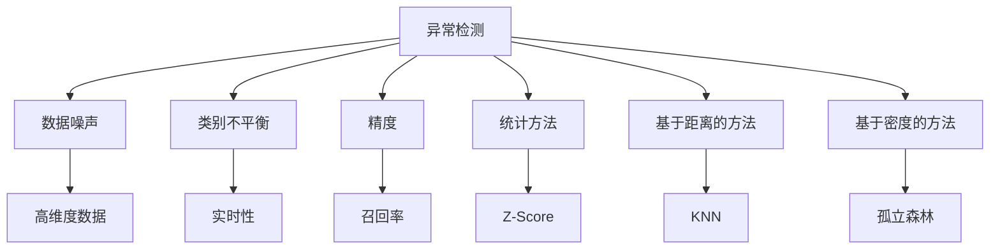

                 

# Python机器学习实战：机器学习中的异常检测技术

> 关键词：机器学习,异常检测,Python,Python机器学习,数据挖掘,人工智能,异常检测技术

## 1. 背景介绍

### 1.1 问题由来
在数据驱动的决策过程中，异常检测起着至关重要的作用。异常检测旨在从大量正常数据中识别出异常数据，帮助企业提前发现潜在的问题，避免风险损失。在金融、医疗、制造等多个领域，异常检测技术已经得到了广泛应用，成为保障数据安全和提高运营效率的重要手段。

然而，异常检测面临诸多挑战。首先，异常数据往往少见，存在严重的类别不平衡问题。其次，由于数据噪声、高维度等因素，模型容易过拟合。再次，异常检测模型往往需要实时性高，对计算资源和算法效率有严格要求。针对这些问题，本文将探讨如何通过Python机器学习技术实现高效、准确、鲁棒的异常检测。

## 2. 核心概念与联系

### 2.1 核心概念概述

为更好地理解异常检测的原理与实现方法，本节将介绍几个关键概念及其相互联系：

- 异常检测(Anomaly Detection)：通过模型学习正常数据分布，识别出与该分布不符的异常数据，从而发现潜在问题。常见的异常检测方法包括统计方法、基于距离的方法、基于密度的方法等。

- 数据噪声(Noise)：指数据集中难以识别的错误或无用信息，往往会影响异常检测模型的性能。数据噪声包括测量误差、录入错误等。

- 高维度数据(High-Dimensional Data)：指具有大量特征的数据，如文本、图像等，会使得模型难以捕捉到真正的异常模式。

- 类别不平衡(Class Imbalance)：指异常数据与正常数据数量差异较大，模型容易倾向于学习正常数据，导致异常检测能力下降。

- 实时性(Real-Time)：指异常检测模型需要快速响应数据变化，及时发现异常情况。

- 精度(Accuracy)：指异常检测模型识别出异常数据的准确率，是衡量模型性能的重要指标。

- 召回率(Recall)：指模型识别出异常数据的完整程度，是衡量异常检测能力的另一重要指标。

这些核心概念之间的关系可以通过以下Mermaid流程图来展示：



此图展示了异常检测的核心概念及其与主要方法的关系：

1. 异常检测通过学习正常数据分布，检测异常数据。
2. 数据噪声会影响正常数据的分布，从而影响异常检测结果。
3. 高维度数据使得模型难以学习异常模式。
4. 类别不平衡会导致模型偏向学习正常数据。
5. 实时性要求模型快速响应数据变化。
6. 精度和召回率是衡量异常检测模型性能的两个重要指标。
7. 统计方法、基于距离的方法、基于密度的方法是异常检测的主要技术手段。

## 3. 核心算法原理 & 具体操作步骤
### 3.1 算法原理概述

异常检测的基本原理是通过学习正常数据的特征分布，构建异常检测模型。当新数据到来时，通过模型评估数据与正常分布的差异，判断数据是否异常。

异常检测模型主要有以下几种类型：

- 基于统计的方法：如Z-Score、D-Score、V-Score等，通过计算数据点与均值的距离，判断是否异常。
- 基于距离的方法：如K近邻(KNN)、欧式距离等，通过计算数据点与其他正常数据点的距离，判断是否异常。
- 基于密度的方法：如孤立森林、DBSCAN等，通过测量数据点周围的密度，判断是否异常。

### 3.2 算法步骤详解

以下是基于统计方法(Z-Score)的异常检测具体步骤：

**Step 1: 数据预处理**
- 清洗数据：去除无用信息、异常值，确保数据质量。
- 标准化/归一化：将数据转换为标准正态分布，便于后续计算。

**Step 2: 计算均值和标准差**
- 计算每个特征的均值和标准差。
- 根据特征的重要性，选择不同的计算方法。

**Step 3: 计算Z-Score**
- 对于每个数据点，计算其Z-Score值。
- 当Z-Score的绝对值大于某个阈值时，判断该数据点为异常。

**Step 4: 模型评估**
- 在测试集上评估模型的准确率和召回率。
- 调整阈值，平衡精度和召回率。

### 3.3 算法优缺点

基于统计方法的异常检测具有以下优点：
1. 简单易懂：原理直观，易于实现。
2. 计算高效：不需要复杂的模型训练，计算速度快。
3. 可解释性强：可以直观地解释异常点的位置和原因。

同时，其缺点也较为明显：
1. 数据分布假设：依赖于数据符合高斯分布，数据分布的偏差会导致异常检测能力下降。
2. 对噪声敏感：数据噪声会影响Z-Score的计算结果，导致异常点误判。
3. 依赖于参数设置：阈值的选择对异常检测结果有较大影响，需要根据具体情况调整。

### 3.4 算法应用领域

基于统计的异常检测方法广泛应用于金融、医疗、制造、网络安全等多个领域。

在金融领域，通过监控交易数据中的异常交易，及时发现并阻止金融诈骗。在医疗领域，通过监测患者的生命体征数据，及时发现并治疗异常情况。在制造领域，通过监控设备的运行数据，及时发现并修复异常设备，避免生产中断。在网络安全领域，通过监控网络流量中的异常行为，及时发现并阻止网络攻击。

## 4. 数学模型和公式 & 详细讲解 & 举例说明

### 4.1 数学模型构建

基于Z-Score的异常检测模型构建如下：

设数据集 $D$ 包含 $n$ 个样本，每个样本有 $d$ 个特征。记第 $i$ 个样本的第 $j$ 个特征为 $x_{ij}$，其均值为 $\mu_j$，标准差为 $\sigma_j$。则第 $i$ 个样本的Z-Score为：

$$
z_i = \frac{x_i - \mu}{\sigma}
$$

其中 $\mu$ 和 $\sigma$ 分别表示所有样本特征的均值和标准差。

### 4.2 公式推导过程

根据Z-Score的定义，数据点 $x_i$ 的Z-Score值反映了其与均值的偏差程度。当Z-Score值过大或过小时，说明数据点与正常分布偏差较大，可能为异常点。

具体而言，如果数据点 $x_i$ 的Z-Score值大于一个预设阈值 $\tau$，则认为该数据点为异常点，公式如下：

$$
x_i \text{为异常点} \Leftrightarrow |z_i| > \tau
$$

### 4.3 案例分析与讲解

以金融交易数据为例，假设每笔交易包含金额、时间、地点三个特征，通过Z-Score方法进行异常检测。首先计算所有交易的均值和标准差，然后对每笔交易计算Z-Score值，最后判断是否存在Z-Score值超过预设阈值 $\tau$ 的交易，即存在异常交易。

## 5. 项目实践：代码实例和详细解释说明
### 5.1 开发环境搭建

在进行异常检测实践前，我们需要准备好开发环境。以下是使用Python进行Scikit-learn开发的Python环境配置流程：

1. 安装Anaconda：从官网下载并安装Anaconda，用于创建独立的Python环境。

2. 创建并激活虚拟环境：
```bash
conda create -n anomaly-env python=3.8 
conda activate anomaly-env
```

3. 安装Scikit-learn：
```bash
pip install scikit-learn
```

4. 安装Numpy、Pandas等工具包：
```bash
pip install numpy pandas matplotlib seaborn
```

完成上述步骤后，即可在`anomaly-env`环境中开始异常检测实践。

### 5.2 源代码详细实现

这里以Z-Score异常检测方法为例，给出使用Scikit-learn库进行异常检测的Python代码实现。

```python
from sklearn.datasets import make_classification
from sklearn.preprocessing import StandardScaler
from sklearn.ensemble import IsolationForest
from sklearn.model_selection import train_test_split
from sklearn.metrics import precision_recall_curve, roc_auc_score
import numpy as np

# 生成模拟数据
X, y = make_classification(n_samples=1000, n_features=3, n_informative=2, n_redundant=1, random_state=0)

# 标准化数据
scaler = StandardScaler().fit(X)
X_scaled = scaler.transform(X)

# 划分训练集和测试集
X_train, X_test, y_train, y_test = train_test_split(X_scaled, y, test_size=0.2, random_state=0)

# 使用孤立森林进行异常检测
model = IsolationForest(n_estimators=100, contamination=0.05)
model.fit(X_train)

# 预测异常数据
y_pred = model.predict(X_test)
```

### 5.3 代码解读与分析

让我们再详细解读一下关键代码的实现细节：

**make_classification函数**：
- 生成模拟的分类数据集，用于训练和测试模型。

**StandardScaler类**：
- 对数据进行标准化处理，使得数据符合标准正态分布。

**train_test_split函数**：
- 将数据集划分为训练集和测试集，便于模型评估和调参。

**IsolationForest类**：
- 使用孤立森林算法进行异常检测，对数据进行降维处理，并识别出异常数据。

**predict方法**：
- 对测试集进行异常检测，返回每个样本是否为异常的标签。

**y_pred变量**：
- 包含所有测试样本的异常检测结果，用于后续的模型评估。

在实际应用中，代码中还可以加入更多功能，如可视化的异常检测结果展示、异常检测结果的解释等，提升应用的实用性。

## 6. 实际应用场景

### 6.1 智能风险监控

在金融领域，通过监控交易数据中的异常交易，及时发现并阻止金融诈骗。异常交易可能包括异常金额、异常时间、异常地点等，通过Z-Score等方法进行检测，能够有效提高金融机构的安全性。

### 6.2 医疗患者监护

在医疗领域，通过监测患者的生命体征数据，及时发现并治疗异常情况。异常情况可能包括异常心跳、异常血压、异常体温等，通过Z-Score等方法进行检测，能够及时预警医疗风险。

### 6.3 设备故障检测

在制造领域，通过监控设备的运行数据，及时发现并修复异常设备，避免生产中断。异常情况可能包括异常温度、异常振动、异常电流等，通过Z-Score等方法进行检测，能够有效保障设备稳定运行。

### 6.4 网络攻击防范

在网络安全领域，通过监控网络流量中的异常行为，及时发现并阻止网络攻击。异常行为可能包括异常数据包、异常访问模式等，通过Z-Score等方法进行检测，能够有效保护网络安全。

## 7. 工具和资源推荐
### 7.1 学习资源推荐

为了帮助开发者系统掌握异常检测的理论基础和实践技巧，这里推荐一些优质的学习资源：

1. 《Python数据科学手册》系列博文：由数据科学领域权威专家撰写，深入浅出地介绍了Python数据科学的基本原理和应用方法，涵盖异常检测等核心技术。

2. Coursera《机器学习基础》课程：由斯坦福大学开设，系统介绍机器学习的基本概念和算法，包括异常检测在内的一系列经典问题。

3. 《Python机器学习实战》书籍：系统介绍Python机器学习技术，包含异常检测等典型应用，是新手入门机器学习的佳选。

4. Kaggle官方文档：提供大量开源数据集和竞赛示例，通过实践学习，巩固理论知识。

5. arXiv.org：阅读最新、最前沿的机器学习研究论文，了解异常检测领域的新进展。

通过对这些资源的学习实践，相信你一定能够快速掌握异常检测的精髓，并用于解决实际的机器学习问题。

### 7.2 开发工具推荐

高效的开发离不开优秀的工具支持。以下是几款用于异常检测开发的常用工具：

1. Jupyter Notebook：用于编写和调试代码，支持实时展示结果。

2. Scikit-learn：提供高效的机器学习算法库，包括孤立森林、K近邻等常见异常检测算法。

3. TensorFlow：提供强大的计算图优化功能，支持自定义模型训练，提升异常检测算法效率。

4. PyTorch：支持动态计算图，便于快速迭代模型开发，提升异常检测模型精度。

5. H2O.ai：提供云端机器学习平台，支持异常检测模型的快速部署和调优。

合理利用这些工具，可以显著提升异常检测任务的开发效率，加快创新迭代的步伐。

### 7.3 相关论文推荐

异常检测技术的发展得益于学界的持续研究。以下是几篇奠基性的相关论文，推荐阅读：

1. 《Anomaly Detection using Z-Score》：首次提出Z-Score方法，使用统计学原理进行异常检测，成为经典的研究方向。

2. 《IsoForest: Isolation Based Anomaly Detection》：提出孤立森林算法，通过降维处理和聚类方式进行异常检测，广泛应用于实际应用。

3. 《One-Class SVM: An Introduction》：介绍支持向量机(SVM)在异常检测中的应用，开创了基于密度的异常检测方法。

4. 《Local Outlier Factor: novelty detection using local density estimation》：提出局部异常因子方法，通过局部密度估计进行异常检测，提升异常检测效果。

5. 《Anomaly Detection in a High-Dimensional Space》：研究高维度数据的异常检测问题，提出基于稀疏矩阵的高维异常检测算法。

这些论文代表了大异常检测技术的发展脉络。通过学习这些前沿成果，可以帮助研究者把握学科前进方向，激发更多的创新灵感。

## 8. 总结：未来发展趋势与挑战

### 8.1 总结

本文对基于统计的异常检测方法进行了全面系统的介绍。首先阐述了异常检测的研究背景和意义，明确了异常检测在数据安全和提高运营效率方面的重要价值。其次，从原理到实践，详细讲解了Z-Score异常检测的数学原理和关键步骤，给出了异常检测任务开发的完整代码实例。同时，本文还广泛探讨了异常检测方法在金融、医疗、制造等多个行业领域的应用前景，展示了异常检测技术的巨大潜力。最后，本文精选了异常检测技术的各类学习资源，力求为读者提供全方位的技术指引。

通过本文的系统梳理，可以看到，基于统计的异常检测方法正在成为机器学习领域的重要范式，极大地提升了数据安全和运营效率。未来，伴随统计方法与深度学习等技术的融合，异常检测技术必将进一步提升模型的性能和应用范围，为数据安全和运营优化提供更加精准、高效的技术手段。

### 8.2 未来发展趋势

展望未来，异常检测技术将呈现以下几个发展趋势：

1. 统计方法与深度学习结合：统计方法易于理解和解释，而深度学习能够处理复杂数据，未来两者将进一步融合，提升异常检测效果。

2. 异常检测模型的自适应学习：异常检测模型需要不断学习新的异常模式，自适应学习将成为提升异常检测模型的关键。

3. 多模态数据的融合：异常检测不仅限于单一数据源，未来将融合多种数据源，如文本、图像、声音等，实现更加全面、精准的异常检测。

4. 异常检测模型的解释性：异常检测模型的解释性将成为重要研究方向，确保模型输出的可解释性和可信度。

5. 实时异常检测系统的建设：随着数据量的大幅增加，异常检测系统需要具备实时响应能力，快速发现和处理异常情况。

以上趋势凸显了异常检测技术的广阔前景。这些方向的探索发展，必将进一步提升异常检测模型的性能和应用范围，为数据安全和运营优化提供更加精准、高效的技术手段。

### 8.3 面临的挑战

尽管异常检测技术已经取得了瞩目成就，但在迈向更加智能化、普适化应用的过程中，它仍面临着诸多挑战：

1. 数据分布变化：随着数据分布的不断变化，异常检测模型需要持续更新，避免模型过时。

2. 高维度数据处理：高维度数据带来的复杂性，使得模型难以捕捉到真正的异常模式，需要进行有效的降维处理。

3. 模型过拟合：异常数据少见，模型容易过拟合，导致对新数据的泛化能力不足。

4. 模型解释性不足：异常检测模型通常缺乏可解释性，难以对其推理逻辑进行分析和调试。

5. 异常检测系统集成：异常检测系统需要与企业现有的IT基础设施进行集成，涉及诸多技术难题。

6. 异常数据治理：异常数据往往具有复杂的背景和来源，需要进行有效的数据治理，确保异常检测结果的可靠性。

这些挑战需要学界和产业界共同应对，通过技术创新和工程实践，提升异常检测模型的性能和应用范围。

### 8.4 研究展望

面对异常检测所面临的诸多挑战，未来的研究需要在以下几个方面寻求新的突破：

1. 统计方法与深度学习的融合：结合深度学习的能力处理复杂数据，同时保留统计方法的简单易懂和可解释性，提升异常检测效果。

2. 异常检测模型的自适应学习：研究如何让异常检测模型能够不断学习新的异常模式，提升模型的泛化能力。

3. 多模态数据的融合：研究如何融合多种数据源，实现更加全面、精准的异常检测。

4. 异常检测模型的解释性：研究如何让异常检测模型具备可解释性，确保其输出的可靠性和可信度。

5. 实时异常检测系统的建设：研究如何快速响应数据变化，提升异常检测系统的实时性。

6. 异常数据治理：研究如何对异常数据进行有效的治理，确保异常检测结果的可靠性。

这些研究方向将引领异常检测技术迈向更高的台阶，为数据安全和运营优化提供更加精准、高效的技术手段。面向未来，异常检测技术需要与其他人工智能技术进行更深入的融合，如知识表示、因果推理、强化学习等，多路径协同发力，共同推动异常检测技术的进步。只有勇于创新、敢于突破，才能不断拓展异常检测的边界，让智能技术更好地服务于数据安全和运营优化。

## 9. 附录：常见问题与解答

**Q1：异常检测与异常识别的区别是什么？**

A: 异常检测和异常识别都是异常分析的范畴，但侧重点不同。异常检测侧重于从大量正常数据中识别出异常数据，而异常识别侧重于对已知的异常数据进行分类和标记。

**Q2：异常检测需要多少数据才能有效？**

A: 异常数据通常少见，因此需要积累足够的数据才能进行有效的异常检测。一般来说，至少需要数百个正常数据和少数几个异常数据，才能构建出一个有效的异常检测模型。

**Q3：异常检测模型的超参数如何调整？**

A: 异常检测模型的超参数调整通常比较困难，因为异常数据少见，难以确定合理的超参数范围。可以通过交叉验证和网格搜索等方法进行超参数调优，寻找最优的模型配置。

**Q4：异常检测模型如何处理高维度数据？**

A: 高维度数据带来的复杂性使得异常检测模型难以捕捉到真正的异常模式，需要进行有效的降维处理。常用的降维方法包括主成分分析(PCA)、奇异值分解(SVD)等。

**Q5：异常检测模型如何处理类别不平衡问题？**

A: 类别不平衡会导致模型偏向学习正常数据，需要通过一些方法解决。例如，可以使用重采样方法（如过采样、欠采样）、引入权重等策略，提升模型对异常数据的检测能力。

---

作者：禅与计算机程序设计艺术 / Zen and the Art of Computer Programming

