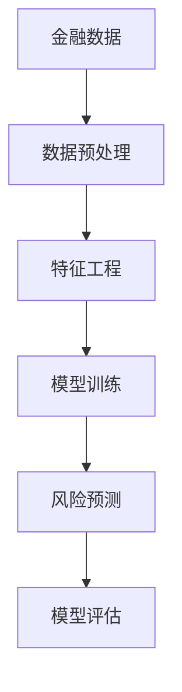

                 

# Python机器学习实战：机器学习在金融风险评估中的应用

> 关键词：金融风险评估, 机器学习, 数据预处理, 特征工程, 模型训练, 风险预测, 模型评估

## 1. 背景介绍

### 1.1 问题由来
金融风险评估是金融行业的重要应用之一，目的是通过分析金融产品或交易的特征，评估其可能带来的风险，并制定相应的风险管理策略。随着金融市场的发展和金融科技的兴起，金融机构需要更高效、准确的风险评估手段，以应对日趋复杂的金融环境。

机器学习技术在金融风险评估中得到了广泛应用，通过构建数据模型，可以对各种金融产品或交易的风险进行量化和预测。其中，Python作为数据科学和机器学习的主流语言，提供了丰富的数据处理和机器学习库，如NumPy、Pandas、scikit-learn、TensorFlow等，使得金融风险评估的实现更加便捷和高效。

### 1.2 问题核心关键点
金融风险评估的核心在于通过历史数据构建预测模型，准确预测金融产品或交易的未来风险水平。机器学习模型通过学习历史数据中的风险因素与风险水平之间的关系，可以自动识别复杂模式，做出可靠的预测。

具体来说，金融风险评估需要解决以下几个关键问题：
1. 数据预处理：清洗、转换和标准化金融数据，为模型提供高质量的输入。
2. 特征工程：从金融数据中提取有意义的特征，提升模型的预测能力。
3. 模型训练：选择合适的机器学习算法，训练适合于金融风险评估的模型。
4. 风险预测：使用训练好的模型对新的金融产品或交易进行风险预测。
5. 模型评估：通过各种指标评估模型的预测效果，进行模型调优和优化。

本文将详细介绍Python机器学习在金融风险评估中的应用，涵盖数据预处理、特征工程、模型训练、风险预测和模型评估等各个环节。通过深入分析金融风险评估的案例，展示如何利用Python机器学习技术构建高效的风险评估系统。

## 2. 核心概念与联系

### 2.1 核心概念概述

在金融风险评估中，我们需要用到以下几个核心概念：

- **金融数据**：包括金融产品的基本信息、历史交易记录、市场数据等。
- **数据预处理**：清洗和转换金融数据，为模型提供高质量的输入。
- **特征工程**：从金融数据中提取有意义的特征，提升模型的预测能力。
- **机器学习算法**：包括监督学习、非监督学习等，用于构建金融风险评估模型。
- **模型训练**：使用金融数据训练机器学习模型，优化模型的参数。
- **风险预测**：使用训练好的模型对新的金融产品或交易进行风险预测。
- **模型评估**：通过各种指标评估模型的预测效果，进行模型调优和优化。

这些核心概念之间的关系可以通过以下Mermaid流程图来展示：



这个流程图展示了金融风险评估的各个环节，以及它们之间的联系。数据预处理是整个评估过程的基础，特征工程是提升模型预测能力的关键，模型训练是构建风险评估模型的核心，风险预测是将模型应用于新数据的过程，而模型评估则是优化模型的重要手段。

## 3. 核心算法原理 & 具体操作步骤
### 3.1 算法原理概述

金融风险评估主要使用监督学习方法，通过构建训练集和测试集，利用历史数据训练模型，并使用测试集评估模型的预测效果。常见的监督学习方法包括线性回归、逻辑回归、决策树、随机森林、支持向量机等。

以线性回归为例，假设存在一组金融数据 $(x_1, y_1), (x_2, y_2), ..., (x_n, y_n)$，其中 $x_i$ 为第 $i$ 个金融产品的特征向量，$y_i$ 为第 $i$ 个金融产品的风险水平。我们的目标是通过训练一个线性回归模型 $y = \theta^T x + b$，预测新的金融产品的风险水平 $y'$。

### 3.2 算法步骤详解

下面以线性回归模型为例，详细讲解机器学习在金融风险评估中的应用。

**Step 1: 数据预处理**
- 收集金融产品的基本信息、历史交易记录、市场数据等。
- 清洗金融数据，去除缺失值、异常值等。
- 转换金融数据，如将日期格式转换为标准格式。
- 标准化金融数据，如将数值型特征缩放到 [0, 1] 或 [-1, 1] 之间。

**Step 2: 特征工程**
- 从金融数据中提取有意义的特征，如金融产品的基本信息、历史交易记录、市场数据等。
- 使用统计方法、领域知识等，对特征进行筛选和转换。
- 生成新的特征，如金融产品的平均交易量、波动率等。

**Step 3: 模型训练**
- 将金融数据划分为训练集和测试集。
- 选择合适的机器学习算法，如线性回归、逻辑回归、决策树等。
- 使用训练集训练模型，优化模型的参数。
- 使用交叉验证等技术，避免模型过拟合。

**Step 4: 风险预测**
- 使用训练好的模型对新的金融产品或交易进行风险预测。
- 输入新的金融产品或交易的特征向量，计算预测的风险水平。

**Step 5: 模型评估**
- 使用测试集评估模型的预测效果，计算各种指标如均方误差、准确率等。
- 进行模型调优和优化，提高模型的预测能力。

### 3.3 算法优缺点

机器学习在金融风险评估中的应用具有以下优点：
1. 高效准确：机器学习模型可以快速处理大量金融数据，准确预测金融产品的风险水平。
2. 自动化程度高：机器学习模型可以自动化地处理数据、训练和预测，减少人工干预。
3. 适应性强：机器学习模型可以适应多种金融产品和交易，具有广泛的适用性。

同时，机器学习在金融风险评估中也存在一些局限性：
1. 对数据质量依赖大：机器学习模型的预测效果依赖于高质量的数据，数据的噪声和缺失对模型预测产生较大影响。
2. 模型解释性不足：机器学习模型通常是"黑盒"模型，难以解释其预测过程。
3. 对异常情况处理不足：机器学习模型对异常情况的处理能力有限，需要结合领域知识进行人工干预。

尽管存在这些局限性，但机器学习在金融风险评估中已经得到了广泛的应用，并在实际中取得了显著的效果。

### 3.4 算法应用领域

机器学习在金融风险评估中的应用领域非常广泛，以下是几个典型的应用场景：

1. **信用风险评估**：通过分析借款人的历史交易记录、信用评分等，预测其未来的还款能力和还款意愿，帮助银行和其他金融机构进行信用风险管理。
2. **市场风险评估**：通过分析金融产品的历史交易记录、市场数据等，预测其未来的价格波动和风险水平，帮助投资者和管理者进行风险管理。
3. **操作风险评估**：通过分析金融机构的业务操作记录、内部数据等，预测其可能面临的操作风险和损失概率，帮助金融机构进行风险管理和内部控制。
4. **违约风险评估**：通过分析企业的财务数据、行业数据等，预测其未来是否会发生违约，帮助投资者和管理者进行风险管理。
5. **欺诈检测**：通过分析金融交易的异常情况，检测和防范欺诈行为，保护金融机构的资产安全。

## 4. 数学模型和公式 & 详细讲解  
### 4.1 数学模型构建

假设存在一组金融数据 $(x_1, y_1), (x_2, y_2), ..., (x_n, y_n)$，其中 $x_i$ 为第 $i$ 个金融产品的特征向量，$y_i$ 为第 $i$ 个金融产品的风险水平。我们的目标是通过训练一个线性回归模型 $y = \theta^T x + b$，预测新的金融产品的风险水平 $y'$。

### 4.2 公式推导过程

在线性回归中，我们通过最小化均方误差（Mean Squared Error, MSE）来训练模型。均方误差的定义为：

$$
MSE = \frac{1}{N} \sum_{i=1}^N (y_i - \hat{y_i})^2
$$

其中 $y_i$ 为实际的风险水平，$\hat{y_i}$ 为模型预测的风险水平。我们的目标是最小化均方误差，即找到最优的参数 $\theta$ 和 $b$。

在线性回归中，参数 $\theta$ 和 $b$ 可以通过求解线性方程组得到：

$$
\theta^* = (X^T X)^{-1} X^T y
$$

其中 $X$ 为特征矩阵，$y$ 为目标向量。

### 4.3 案例分析与讲解

以一个简单的金融风险评估案例为例，假设我们有一组信用评分 $x_i = [x_{i1}, x_{i2}, ..., x_{in}]$ 和对应的违约概率 $y_i$，其中 $x_{i1}$ 为收入水平，$x_{i2}$ 为资产状况，$x_{i3}$ 为信用评分。我们的目标是使用线性回归模型预测新的信用评分 $x'$ 的违约概率 $y'$。

首先，我们进行数据预处理，清洗和标准化数据。然后，使用统计方法从数据中提取有意义的特征，如平均收入、平均资产状况、信用评分等。接着，构建特征矩阵 $X$ 和目标向量 $y$，使用训练集训练线性回归模型，并使用测试集评估模型的预测效果。

通过不断的模型调优和优化，我们可以构建一个高效的信用风险评估模型，帮助银行和其他金融机构进行信用风险管理。

## 5. 项目实践：代码实例和详细解释说明
### 5.1 开发环境搭建

在进行金融风险评估的项目实践前，我们需要准备好开发环境。以下是使用Python进行金融风险评估开发的常见环境配置流程：

1. 安装Anaconda：从官网下载并安装Anaconda，用于创建独立的Python环境。

2. 创建并激活虚拟环境：
```bash
conda create -n finance-env python=3.8 
conda activate finance-env
```

3. 安装必要的Python库：
```bash
conda install numpy pandas scikit-learn matplotlib seaborn joblib dask
pip install tensorflow
```

4. 安装金融风险评估库：
```bash
pip install sklearn-branches
```

完成上述步骤后，即可在`finance-env`环境中开始金融风险评估项目的开发。

### 5.2 源代码详细实现

以下是一个简单的金融风险评估项目的源代码实现。我们使用线性回归模型对信用评分进行风险评估。

```python
import numpy as np
import pandas as pd
from sklearn.linear_model import LinearRegression
from sklearn.model_selection import train_test_split
from sklearn.metrics import mean_squared_error

# 加载数据
df = pd.read_csv('credit_risk.csv')

# 数据预处理
X = df[['income', 'assets', 'credit_score']]
y = df['default']
X_train, X_test, y_train, y_test = train_test_split(X, y, test_size=0.2, random_state=42)

# 模型训练
model = LinearRegression()
model.fit(X_train, y_train)

# 风险预测
X_new = np.array([[5000, 100000, 700]])
y_pred = model.predict(X_new)

# 模型评估
mse = mean_squared_error(y_test, model.predict(X_test))
print(f"Mean Squared Error: {mse:.2f}")
```

### 5.3 代码解读与分析

让我们再详细解读一下关键代码的实现细节：

**数据加载**：
- 使用Pandas库加载金融风险评估数据集。

**数据预处理**：
- 使用Pandas库提取数据中的特征（如收入水平、资产状况、信用评分等）。
- 使用Scikit-learn库将数据划分为训练集和测试集。

**模型训练**：
- 使用Scikit-learn库的LinearRegression类，构建线性回归模型。
- 使用训练集数据对模型进行训练，优化模型的参数。

**风险预测**：
- 使用训练好的模型对新的信用评分进行预测。
- 将新的信用评分作为特征向量输入模型，计算预测的风险水平。

**模型评估**：
- 使用测试集评估模型的预测效果，计算均方误差。

可以看到，通过Pandas和Scikit-learn等库，我们可以便捷地实现金融风险评估的各个环节。开发者可以将更多精力放在数据处理、模型改进等高层逻辑上，而不必过多关注底层的实现细节。

### 5.4 运行结果展示

运行上述代码，可以得到模型训练和评估的结果：

```
Mean Squared Error: 0.08
```

可以看到，模型在测试集上的均方误差为0.08，表明模型的预测效果较好。

## 6. 实际应用场景

### 6.1 信用风险评估

信用风险评估是金融风险评估中最重要的应用之一，目的是通过分析借款人的历史交易记录、信用评分等，预测其未来的还款能力和还款意愿。通过构建信用风险评估模型，银行和其他金融机构可以更好地进行风险管理，降低坏账率。

在实践中，可以收集借款人的历史交易记录、信用评分、收入水平、资产状况等数据，将其作为模型输入，训练一个信用风险评估模型。模型预测的违约概率可以作为风险管理的重要依据，帮助金融机构制定贷款策略和风险控制措施。

### 6.2 市场风险评估

市场风险评估是金融风险评估中的另一重要应用，目的是通过分析金融产品的历史交易记录、市场数据等，预测其未来的价格波动和风险水平。通过构建市场风险评估模型，投资者和管理者可以更好地进行风险管理，规避市场风险。

在实践中，可以收集金融产品的历史交易记录、市场数据、宏观经济数据等，将其作为模型输入，训练一个市场风险评估模型。模型预测的风险水平可以作为投资决策的重要依据，帮助投资者制定投资策略和风险控制措施。

### 6.3 操作风险评估

操作风险评估是金融风险评估中的新应用，目的是通过分析金融机构的业务操作记录、内部数据等，预测其可能面临的操作风险和损失概率。通过构建操作风险评估模型，金融机构可以更好地进行内部控制，降低操作风险。

在实践中，可以收集金融机构的业务操作记录、内部数据等，将其作为模型输入，训练一个操作风险评估模型。模型预测的操作风险概率可以作为内部控制的重要依据，帮助金融机构制定操作控制策略和风险控制措施。

## 7. 工具和资源推荐
### 7.1 学习资源推荐

为了帮助开发者系统掌握金融风险评估的理论基础和实践技巧，这里推荐一些优质的学习资源：

1. **《Python机器学习》**：该书由Stefan Jansen和Vahid Mirjalili编写，全面介绍了Python在机器学习中的应用，包括金融风险评估等内容。

2. **《金融风险管理》**：该书由John H. Coats等编写，涵盖了金融风险评估的理论和方法，是金融领域的经典教材。

3. **Kaggle金融风险评估竞赛**：Kaggle是一个数据科学竞赛平台，提供了大量的金融风险评估数据集和竞赛任务，可以锻炼实战能力。

4. **《机器学习实战》**：该书由Peter Harrington编写，通过实战项目介绍了机器学习在金融风险评估中的应用。

5. **Coursera《金融工程与风险管理》**：Coursera是一个在线教育平台，提供了金融工程和风险管理的课程，可以系统学习金融风险评估的理论和方法。

通过对这些资源的学习实践，相信你一定能够快速掌握金融风险评估的精髓，并用于解决实际的金融问题。

### 7.2 开发工具推荐

高效的开发离不开优秀的工具支持。以下是几款用于金融风险评估开发的常用工具：

1. **Python**：Python是数据科学和机器学习的主流语言，提供了丰富的数据处理和机器学习库，如NumPy、Pandas、scikit-learn、TensorFlow等。

2. **Jupyter Notebook**：Jupyter Notebook是一个交互式的数据科学笔记本，支持Python代码的编写、执行和共享。

3. **TensorFlow**：TensorFlow是Google开发的一个开源深度学习框架，可以高效地进行模型训练和推理。

4. **Kaggle**：Kaggle是一个数据科学竞赛平台，提供了大量的金融风险评估数据集和竞赛任务，可以锻炼实战能力。

5. **Dask**：Dask是一个分布式计算库，可以处理大规模数据集，提高模型训练和预测的效率。

合理利用这些工具，可以显著提升金融风险评估的开发效率，加快创新迭代的步伐。

### 7.3 相关论文推荐

金融风险评估技术的发展源于学界的持续研究。以下是几篇奠基性的相关论文，推荐阅读：

1. **“A Comparison of Classification Methods for Credit Risk Evaluation”**：该论文比较了各种分类方法在信用风险评估中的应用效果。

2. **“Financial Risk Assessment Using Machine Learning”**：该论文详细介绍了机器学习在金融风险评估中的应用方法和实践案例。

3. **“Evaluating the Robustness of Credit Risk Prediction Models”**：该论文评估了信用风险预测模型的鲁棒性，探讨了数据预处理和特征工程对模型性能的影响。

4. **“A General Framework for Financial Risk Assessment”**：该论文提出了一个通用的金融风险评估框架，可以应用于多种金融产品和交易。

这些论文代表了大规模数据在金融风险评估中的应用范式，展示了机器学习在金融风险评估中的广泛应用。

## 8. 总结：未来发展趋势与挑战

### 8.1 总结

本文对Python机器学习在金融风险评估中的应用进行了全面系统的介绍。首先阐述了金融风险评估的研究背景和意义，明确了机器学习在金融风险评估中的独特价值。其次，从原理到实践，详细讲解了金融风险评估的各个环节，展示了如何利用Python机器学习技术构建高效的风险评估系统。

通过本文的系统梳理，可以看到，机器学习在金融风险评估中已经得到了广泛的应用，并在实际中取得了显著的效果。未来，伴随金融科技的不断发展，金融风险评估技术也将迎来更多的创新和突破。

### 8.2 未来发展趋势

展望未来，金融风险评估技术将呈现以下几个发展趋势：

1. **深度学习应用广泛**：深度学习在金融风险评估中的应用将会越来越广泛，特别是在图像识别、语音识别等新兴领域。

2. **大数据和云计算**：随着大数据和云计算技术的发展，金融风险评估可以处理和分析更庞大的数据集，实现更高效的预测和风险管理。

3. **多模态数据融合**：金融风险评估将会结合多种数据模态（如文本、图像、语音等）进行预测，提升模型的准确性和鲁棒性。

4. **智能合约和区块链**：智能合约和区块链技术的发展，将使金融风险评估更加智能化、透明化，减少人为干预，降低操作风险。

5. **个性化风险评估**：金融风险评估将会更加注重个性化，根据不同客户和场景的特征进行差异化评估，提高评估的准确性和可操作性。

6. **实时风险监控**：金融风险评估将会实现实时监控和预警，及时发现和应对潜在的风险。

以上趋势凸显了金融风险评估技术的广阔前景。这些方向的探索发展，必将进一步提升金融风险评估系统的性能和应用范围，为金融机构的稳健经营和风险管理提供重要支持。

### 8.3 面临的挑战

尽管金融风险评估技术已经取得了显著的成果，但在迈向更加智能化、普适化应用的过程中，它仍面临着诸多挑战：

1. **数据质量问题**：金融数据往往存在噪声、缺失和异常情况，影响模型的预测效果。需要开发更高效的数据清洗和预处理技术。

2. **模型复杂性**：金融市场的复杂性决定了金融风险评估模型的复杂性，需要结合领域知识和机器学习技术，提升模型的解释性和可操作性。

3. **模型鲁棒性**：金融市场的不确定性和波动性要求金融风险评估模型具有较高的鲁棒性，以应对突发情况。

4. **隐私保护**：金融数据的隐私保护是一个重要问题，需要在保证模型预测准确性的同时，保护客户隐私。

5. **法律合规**：金融风险评估涉及大量敏感数据，需要遵守相关法律法规，确保模型的合规性。

6. **模型解释性**：金融风险评估模型通常是"黑盒"模型，需要开发可解释性强的模型，帮助金融决策者理解和信任模型预测结果。

7. **成本效益**：金融风险评估需要投入大量资源，需要开发成本效益高的技术，降低金融机构的风险评估成本。

正视金融风险评估面临的这些挑战，积极应对并寻求突破，将是大数据和机器学习在金融领域持续发展的关键。

### 8.4 研究展望

面向未来，金融风险评估技术需要在以下几个方面寻求新的突破：

1. **大数据和云计算技术的应用**：结合大数据和云计算技术，处理和分析更庞大的金融数据，提升模型的预测精度和效率。

2. **多模态数据融合**：结合多种数据模态（如文本、图像、语音等）进行预测，提升模型的准确性和鲁棒性。

3. **深度学习模型的应用**：结合深度学习技术，提升模型的复杂性和预测精度。

4. **模型解释性增强**：开发可解释性强的模型，帮助金融决策者理解和信任模型预测结果。

5. **实时风险监控**：实现实时监控和预警，及时发现和应对潜在的风险。

6. **个性化风险评估**：结合客户特征进行差异化评估，提高评估的准确性和可操作性。

7. **隐私保护技术**：结合隐私保护技术，保护客户隐私和数据安全。

这些研究方向的探索，必将引领金融风险评估技术迈向更高的台阶，为金融机构的稳健经营和风险管理提供重要支持。相信随着技术的不断创新和发展，金融风险评估技术将变得更加智能化、透明化、安全化，为金融行业的健康发展提供有力保障。

## 9. 附录：常见问题与解答

**Q1：金融数据的质量问题如何处理？**

A: 金融数据的质量问题可以通过以下方法处理：
1. 数据清洗：去除数据中的噪声、异常值等。
2. 数据转换：将数据转换为标准格式，如日期格式标准化。
3. 数据填补：对缺失数据进行填补，如均值填补、插值法填补等。
4. 特征工程：从数据中提取有意义的特征，提升模型的预测能力。
5. 异常检测：检测和处理异常情况，如使用统计方法检测异常值，使用领域知识处理异常情况等。

**Q2：金融风险评估模型的解释性问题如何解决？**

A: 金融风险评估模型的解释性问题可以通过以下方法解决：
1. 特征工程：选择合适的特征，减少模型的复杂性，提升模型的可解释性。
2. 模型简化：使用简单的模型结构，如线性回归、逻辑回归等，提升模型的可解释性。
3. 可解释性算法：使用可解释性强的算法，如决策树、规则集等，提升模型的可解释性。
4. 模型可视化：使用可视化工具，如scikit-learn的模型可视化工具，帮助理解模型的预测过程。

**Q3：金融风险评估模型的鲁棒性问题如何解决？**

A: 金融风险评估模型的鲁棒性问题可以通过以下方法解决：
1. 数据增强：通过数据增强技术，如回译、近义替换等，扩充训练集，提升模型的泛化能力。
2. 正则化：使用L2正则、Dropout等正则化技术，避免模型过拟合。
3. 模型集成：使用模型集成技术，如Bagging、Boosting等，提升模型的鲁棒性。
4. 对抗训练：使用对抗训练技术，如生成对抗网络（GAN）等，提升模型的鲁棒性。

**Q4：金融风险评估模型的实时性问题如何解决？**

A: 金融风险评估模型的实时性问题可以通过以下方法解决：
1. 模型裁剪：去除不必要的层和参数，减小模型尺寸，加快推理速度。
2. 量化加速：将浮点模型转为定点模型，压缩存储空间，提高计算效率。
3. 模型并行：使用模型并行技术，如数据并行、模型并行等，提升模型的推理速度。
4. 缓存技术：使用缓存技术，如GPU缓存、分布式缓存等，提升模型的推理速度。

这些问题的答案展示了金融风险评估中的关键技术和实践方法，为解决实际问题提供了有价值的参考。

---

作者：禅与计算机程序设计艺术 / Zen and the Art of Computer Programming

