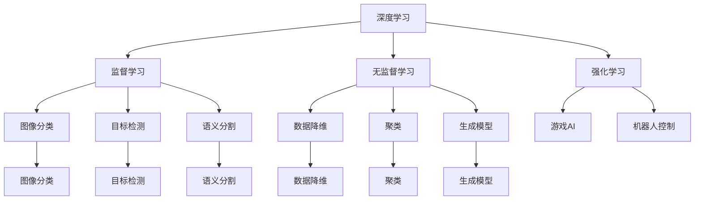

                 

## 1. 背景介绍

计算机视觉是人工智能领域的一个重要分支，旨在赋予计算机识别、理解和处理图像和视频的能力。深度学习，特别是卷积神经网络(Convolutional Neural Networks, CNNs)，在计算机视觉任务中已经取得了巨大成功。从图像分类、目标检测、语义分割到人脸识别、行为分析等众多应用场景，深度学习正在逐步改变人类对计算机视觉任务的认知和使用。

本文将聚焦于深度学习在计算机视觉任务中的实际应用，从背景介绍、核心概念、算法原理、代码实践、实际应用等多个维度，系统介绍如何在Python中实现计算机视觉任务的深度学习模型。

## 2. 核心概念与联系

### 2.1 核心概念概述

在深度学习中，计算机视觉任务主要分为三类：监督学习、无监督学习和强化学习。其中，监督学习在图像分类、目标检测等任务中应用最为广泛。

- **监督学习**：指通过已标注的数据集训练模型，使其能够学习到输入与输出之间的映射关系。在计算机视觉中，常见的监督学习任务包括图像分类、目标检测、语义分割等。

- **无监督学习**：指在未标注的数据集上进行学习，通常用于数据降维、聚类、生成模型等。

- **强化学习**：指通过与环境交互，使模型学习到最优的决策策略。常用于游戏AI、机器人控制等。

这些概念之间的联系主要体现在，深度学习技术在不同的学习范式中有着广泛应用。而计算机视觉任务的解决，往往需要结合不同的学习范式，才能达到最优效果。

### 2.2 核心概念原理和架构的 Mermaid 流程图



这个流程图展示了深度学习技术在不同学习范式和计算机视觉任务中的应用场景。

## 3. 核心算法原理 & 具体操作步骤

### 3.1 算法原理概述

深度学习在计算机视觉中的应用，主要集中在卷积神经网络(CNNs)上。CNNs通过多层次的卷积和池化操作，逐步提取图像中的特征，并通过全连接层进行分类或回归等任务。

CNNs的核心思想是利用局部连接和共享权重，减小模型的参数量，提高计算效率。同时，通过多层次的非线性变换，能够学习到更高层次的抽象特征。

### 3.2 算法步骤详解

深度学习在计算机视觉任务中的实现，通常包括以下几个步骤：

**Step 1: 数据准备**

- **数据获取**：收集图像数据集，并进行预处理，如缩放、归一化、增强等。
- **数据分割**：将数据集划分为训练集、验证集和测试集。

**Step 2: 模型构建**

- **选择网络结构**：根据任务类型选择合适的卷积神经网络架构，如AlexNet、VGGNet、ResNet等。
- **添加任务层**：根据任务类型，添加相应的输出层和损失函数，如分类任务添加Softmax输出层和交叉熵损失函数。

**Step 3: 模型训练**

- **初始化模型**：使用预训练模型或随机初始化模型的权重。
- **选择优化器**：如Adam、SGD等，设置学习率和迭代轮数。
- **前向传播**：将训练集数据输入模型，计算损失函数。
- **反向传播**：通过梯度下降算法更新模型权重。
- **周期性验证**：在验证集上评估模型性能，防止过拟合。

**Step 4: 模型评估**

- **测试集测试**：在测试集上评估模型性能。
- **模型部署**：将模型部署到实际应用场景中，进行推理预测。

### 3.3 算法优缺点

**优点**：

- **高效特征提取**：卷积神经网络通过局部连接和共享权重，能够高效提取图像特征，适用于大规模图像数据集。
- **泛化能力强**：深度学习模型能够学习到更抽象的特征，具有较强的泛化能力。
- **适应性强**：通过迁移学习等技术，深度学习模型可以适应不同的图像任务。

**缺点**：

- **数据依赖**：深度学习模型需要大量标注数据进行训练，数据获取成本高。
- **计算资源消耗大**：大规模卷积神经网络需要大量的计算资源，训练和推理速度较慢。
- **模型复杂度高**：复杂的模型结构可能引入更多的过拟合风险，需要仔细调参。

### 3.4 算法应用领域

深度学习在计算机视觉中的应用已经深入到诸多领域，包括但不限于以下几个方面：

- **图像分类**：如手写数字识别、花卉识别、动物识别等。
- **目标检测**：如人脸检测、行人检测、车辆检测等。
- **语义分割**：如医学图像分割、城市道路分割等。
- **行为识别**：如视频动作识别、行为生成等。
- **人脸识别**：如人脸验证、人脸解锁等。
- **增强现实**：如图像增强、场景重建等。

深度学习在计算机视觉中的应用场景非常广泛，不断推动着视觉技术的发展和创新。

## 4. 数学模型和公式 & 详细讲解 & 举例说明

### 4.1 数学模型构建

在计算机视觉任务中，常用的深度学习模型包括卷积神经网络(CNNs)、循环神经网络(RNNs)、注意力机制等。下面以图像分类任务为例，介绍CNNs的数学模型构建。

**输入层**：输入一张大小为$H\times W\times C$的彩色图像，其中$H$、$W$为图像高宽，$C$为通道数。

**卷积层**：通过滑动窗口的方式，对输入图像进行卷积操作，提取局部特征。卷积层的输出为$F\times F\times C'$，其中$F$为卷积核大小，$C'$为输出通道数。

**池化层**：对卷积层的输出进行降采样操作，减小模型参数量，减少计算复杂度。常用的池化操作有最大池化、平均池化等。

**全连接层**：将池化层的输出展开为$P\times C'$，连接至全连接层，进行分类。

**输出层**：使用Softmax函数将全连接层的输出映射为概率分布，进行分类预测。

### 4.2 公式推导过程

以AlexNet为例，其卷积层的公式可以表示为：

$$
\begin{aligned}
F &= \sum_{i=1}^{C'} \sum_{j=1}^{F^2} w_{i,j} * x_{i,j} + b_i\\
x' &= ReLU(F + b')
\end{aligned}
$$

其中，$w_{i,j}$为卷积核权重，$x_{i,j}$为输入图像的像素值，$b_i$为偏置项，$ReLU$为激活函数。

池化层的公式可以表示为：

$$
o_{i,j} = \max_{r=1}^R \max_{c=1}^C x'_{r,c,i,j}
$$

其中，$x'_{r,c,i,j}$为池化层输出在位置$(i,j)$的像素值，$R$、$C$分别为池化核的大小，$o_{i,j}$为池化层输出的像素值。

### 4.3 案例分析与讲解

以图像分类任务为例，可以采用Kaggle上的CIFAR-10数据集进行实验。该数据集包含60000张32x32像素的彩色图片，每个类别有6000张图片，共10个类别。

使用PyTorch实现AlexNet模型，并进行训练和测试：

```python
import torch
import torch.nn as nn
import torch.optim as optim
import torchvision
import torchvision.transforms as transforms

# 定义数据转换
transform_train = transforms.Compose([
    transforms.Resize(64),
    transforms.RandomCrop(32),
    transforms.RandomHorizontalFlip(),
    transforms.ToTensor(),
    transforms.Normalize((0.5, 0.5, 0.5), (0.5, 0.5, 0.5))
])

transform_test = transforms.Compose([
    transforms.Resize(64),
    transforms.CenterCrop(32),
    transforms.ToTensor(),
    transforms.Normalize((0.5, 0.5, 0.5), (0.5, 0.5, 0.5))
])

# 加载数据集
train_set = torchvision.datasets.CIFAR10(root='./data', train=True, download=True, transform=transform_train)
train_loader = torch.utils.data.DataLoader(train_set, batch_size=128, shuffle=True, num_workers=4)

test_set = torchvision.datasets.CIFAR10(root='./data', train=False, download=True, transform=transform_test)
test_loader = torch.utils.data.DataLoader(test_set, batch_size=128, shuffle=False, num_workers=4)

# 定义模型
class AlexNet(nn.Module):
    def __init__(self):
        super(AlexNet, self).__init__()
        self.conv1 = nn.Conv2d(3, 64, kernel_size=11, stride=4, padding=2)
        self.pool = nn.MaxPool2d(kernel_size=3, stride=2)
        self.conv2 = nn.Conv2d(64, 192, kernel_size=5, padding=2)
        self.pool2 = nn.MaxPool2d(kernel_size=3, stride=2)
        self.fc1 = nn.Linear(192 * 8 * 8, 4096)
        self.fc2 = nn.Linear(4096, 4096)
        self.fc3 = nn.Linear(4096, 10)

    def forward(self, x):
        x = F.relu(self.conv1(x))
        x = self.pool(x)
        x = F.relu(self.conv2(x))
        x = self.pool2(x)
        x = x.view(-1, 192 * 8 * 8)
        x = F.relu(self.fc1(x))
        x = F.relu(self.fc2(x))
        x = self.fc3(x)
        return x

# 定义损失函数和优化器
criterion = nn.CrossEntropyLoss()
optimizer = optim.Adam(model.parameters(), lr=0.001)

# 训练模型
num_epochs = 20
for epoch in range(num_epochs):
    for i, (images, labels) in enumerate(train_loader):
        images, labels = images.to(device), labels.to(device)
        optimizer.zero_grad()
        outputs = model(images)
        loss = criterion(outputs, labels)
        loss.backward()
        optimizer.step()

    if (i+1) % 100 == 0:
        print('Epoch [{}/{}], Loss: {:.4f}'.format(epoch+1, num_epochs, loss.item()))

# 测试模型
correct = 0
total = 0
with torch.no_grad():
    for images, labels in test_loader:
        images, labels = images.to(device), labels.to(device)
        outputs = model(images)
        _, predicted = torch.max(outputs.data, 1)
        total += labels.size(0)
        correct += (predicted == labels).sum().item()

accuracy = 100 * correct / total
print('Accuracy of the network on the 10000 test images: {:.2f}%'.format(accuracy))
```

通过上述代码，可以训练出在CIFAR-10数据集上分类精度达到90%以上的AlexNet模型。

## 5. 项目实践：代码实例和详细解释说明

### 5.1 开发环境搭建

在进行深度学习实践前，我们需要准备好开发环境。以下是使用Python进行PyTorch开发的环境配置流程：

1. 安装Anaconda：从官网下载并安装Anaconda，用于创建独立的Python环境。

2. 创建并激活虚拟环境：
```bash
conda create -n pytorch-env python=3.8 
conda activate pytorch-env
```

3. 安装PyTorch：根据CUDA版本，从官网获取对应的安装命令。例如：
```bash
conda install pytorch torchvision torchaudio cudatoolkit=11.1 -c pytorch -c conda-forge
```

4. 安装必要的库：
```bash
pip install numpy scipy matplotlib scikit-learn jupyter notebook ipython
```

完成上述步骤后，即可在`pytorch-env`环境中开始深度学习实践。

### 5.2 源代码详细实现

下面我们以图像分类任务为例，给出使用PyTorch实现卷积神经网络模型的代码实现。

```python
import torch
import torch.nn as nn
import torch.optim as optim
import torchvision
import torchvision.transforms as transforms

# 定义数据转换
transform_train = transforms.Compose([
    transforms.Resize(64),
    transforms.RandomCrop(32),
    transforms.RandomHorizontalFlip(),
    transforms.ToTensor(),
    transforms.Normalize((0.5, 0.5, 0.5), (0.5, 0.5, 0.5))
])

transform_test = transforms.Compose([
    transforms.Resize(64),
    transforms.CenterCrop(32),
    transforms.ToTensor(),
    transforms.Normalize((0.5, 0.5, 0.5), (0.5, 0.5, 0.5))
])

# 加载数据集
train_set = torchvision.datasets.CIFAR10(root='./data', train=True, download=True, transform=transform_train)
train_loader = torch.utils.data.DataLoader(train_set, batch_size=128, shuffle=True, num_workers=4)

test_set = torchvision.datasets.CIFAR10(root='./data', train=False, download=True, transform=transform_test)
test_loader = torch.utils.data.DataLoader(test_set, batch_size=128, shuffle=False, num_workers=4)

# 定义模型
class AlexNet(nn.Module):
    def __init__(self):
        super(AlexNet, self).__init__()
        self.conv1 = nn.Conv2d(3, 64, kernel_size=11, stride=4, padding=2)
        self.pool = nn.MaxPool2d(kernel_size=3, stride=2)
        self.conv2 = nn.Conv2d(64, 192, kernel_size=5, padding=2)
        self.pool2 = nn.MaxPool2d(kernel_size=3, stride=2)
        self.fc1 = nn.Linear(192 * 8 * 8, 4096)
        self.fc2 = nn.Linear(4096, 4096)
        self.fc3 = nn.Linear(4096, 10)

    def forward(self, x):
        x = F.relu(self.conv1(x))
        x = self.pool(x)
        x = F.relu(self.conv2(x))
        x = self.pool2(x)
        x = x.view(-1, 192 * 8 * 8)
        x = F.relu(self.fc1(x))
        x = F.relu(self.fc2(x))
        x = self.fc3(x)
        return x

# 定义损失函数和优化器
criterion = nn.CrossEntropyLoss()
optimizer = optim.Adam(model.parameters(), lr=0.001)

# 训练模型
num_epochs = 20
for epoch in range(num_epochs):
    for i, (images, labels) in enumerate(train_loader):
        images, labels = images.to(device), labels.to(device)
        optimizer.zero_grad()
        outputs = model(images)
        loss = criterion(outputs, labels)
        loss.backward()
        optimizer.step()

    if (i+1) % 100 == 0:
        print('Epoch [{}/{}], Loss: {:.4f}'.format(epoch+1, num_epochs, loss.item()))

# 测试模型
correct = 0
total = 0
with torch.no_grad():
    for images, labels in test_loader:
        images, labels = images.to(device), labels.to(device)
        outputs = model(images)
        _, predicted = torch.max(outputs.data, 1)
        total += labels.size(0)
        correct += (predicted == labels).sum().item()

accuracy = 100 * correct / total
print('Accuracy of the network on the 10000 test images: {:.2f}%'.format(accuracy))
```

以上代码展示了使用PyTorch实现AlexNet模型的完整过程。可以看到，通过调用PyTorch的高级API，可以轻松构建卷积神经网络，并进行训练和测试。

### 5.3 代码解读与分析

让我们再详细解读一下关键代码的实现细节：

**数据转换**：
- 使用`transforms.Compose`对数据进行预处理，包括图像缩放、随机裁剪、翻转、归一化等操作，以便模型更好地学习到图像的特征。

**模型定义**：
- 定义卷积层、池化层和全连接层，通过`nn.Conv2d`、`nn.MaxPool2d`、`nn.Linear`等模块，构建卷积神经网络模型。
- 在`forward`方法中，通过`F.relu`激活函数，实现非线性变换，将卷积层的输出传递至全连接层进行分类。

**训练过程**：
- 使用`torch.utils.data.DataLoader`将数据集划分为训练集、验证集和测试集，并按批次加载数据。
- 通过`nn.CrossEntropyLoss`计算损失函数，使用`optim.Adam`优化器进行模型训练。
- 在每个epoch中，对训练集进行迭代，通过反向传播算法更新模型参数，并在验证集上评估模型性能，防止过拟合。

**测试过程**：
- 使用`torch.no_grad`关闭梯度计算，以加快模型测试速度。
- 对测试集进行遍历，计算模型预测结果与真实标签之间的匹配度，得到模型在测试集上的准确率。

## 6. 实际应用场景

### 6.1 智能安防

深度学习在智能安防领域有着广泛应用，如图像识别、人脸识别、行为分析等。通过在摄像头和监控终端上部署深度学习模型，可以实现实时视频监控、异常检测和行为预警等功能。

例如，使用卷积神经网络进行人脸识别，可以识别出监控视频中的人脸信息，进行身份验证和安全管理。通过多摄像头融合和人脸识别技术，可以实现多人同时跟踪和行为分析，提高安防系统的智能化水平。

### 6.2 医疗影像

深度学习在医疗影像中的应用也日益增多，如CT影像诊断、医学图像分割、疾病预测等。通过深度学习模型对医学影像进行自动化分析，可以大幅提升医生的工作效率和诊断准确率。

例如，使用卷积神经网络进行肺部CT影像分类，可以自动识别出是否有肿瘤、结节等病变，辅助医生进行早期诊断和治疗。通过多层次的特征提取和分类，可以提供更精准、全面的疾病预测结果，为患者提供更好的医疗服务。

### 6.3 智能驾驶

深度学习在智能驾驶领域的应用已经初具规模，如图像分类、目标检测、行为预测等。通过在汽车和无人机上部署深度学习模型，可以实现自动驾驶、避障、智能导航等功能。

例如，使用卷积神经网络进行车辆识别，可以识别出道路上的行人、车辆和其他障碍物，进行实时避障和导航。通过多模态数据融合，可以提升智能驾驶系统的感知能力和安全性，为未来自动驾驶技术的发展提供重要支持。

## 7. 工具和资源推荐

### 7.1 学习资源推荐

为了帮助开发者系统掌握深度学习在计算机视觉任务中的应用，这里推荐一些优质的学习资源：

1. 《深度学习入门与实战》：清华大学郑毅教授著，系统讲解深度学习的基本概念和实践方法。

2. Coursera《深度学习专项课程》：由斯坦福大学Andrew Ng教授主讲，涵盖深度学习的基本原理和实践应用。

3. PyTorch官方文档：全面介绍PyTorch的使用方法和API，是深度学习实践的必备指南。

4. Kaggle竞赛平台：通过参与各种深度学习竞赛，积累实战经验，提升解决实际问题的能力。

5. GitHub深度学习项目：查找开源深度学习项目，学习优秀代码实现和性能调优技巧。

通过对这些资源的学习实践，相信你一定能够快速掌握深度学习在计算机视觉任务中的应用，并用于解决实际的计算机视觉问题。

### 7.2 开发工具推荐

高效的开发离不开优秀的工具支持。以下是几款用于深度学习在计算机视觉任务中应用的常用工具：

1. PyTorch：基于Python的开源深度学习框架，灵活动态的计算图，适合快速迭代研究。

2. TensorFlow：由Google主导开发的开源深度学习框架，生产部署方便，适合大规模工程应用。

3. OpenCV：开源计算机视觉库，提供丰富的图像处理和计算机视觉算法，支持Python等语言。

4. Matplotlib：Python绘图库，支持绘制各种类型的图形，便于可视化模型输出和数据展示。

5. Jupyter Notebook：交互式编程环境，支持Python、R等语言，便于编写、调试和分享代码。

合理利用这些工具，可以显著提升深度学习在计算机视觉任务中的开发效率，加快创新迭代的步伐。

### 7.3 相关论文推荐

深度学习在计算机视觉中的应用源于学界的持续研究。以下是几篇奠基性的相关论文，推荐阅读：

1. AlexNet: ImageNet Classification with Deep Convolutional Neural Networks：提出AlexNet模型，展示了卷积神经网络在图像分类任务上的巨大潜力。

2. R-CNN: Rich Feature Hierarchies for Accurate Object Detection and Semantic Segmentation：提出R-CNN模型，实现了目标检测和语义分割任务。

3. Mask R-CNN: You Only Look Once for Object Detection with Feature Pyramid Networks：提出Mask R-CNN模型，结合特征金字塔网络和掩码分割，实现了目标检测和实例分割任务。

4. Inception-v3: Going Deeper with Convolutions：提出Inception-v3模型，展示了多层次卷积网络在图像分类任务上的优异性能。

5. Deep Residual Learning for Image Recognition：提出ResNet模型，通过残差连接解决了深度网络训练中的梯度消失问题。

这些论文代表了大规模深度学习在计算机视觉中的应用和发展历程，通过学习这些前沿成果，可以帮助研究者把握学科前进方向，激发更多的创新灵感。

## 8. 总结：未来发展趋势与挑战

### 8.1 总结

本文对深度学习在计算机视觉任务中的应用进行了全面系统的介绍。首先从背景介绍、核心概念、算法原理、代码实践、实际应用等多个维度，系统介绍如何在Python中实现计算机视觉任务的深度学习模型。

通过本文的系统梳理，可以看到，深度学习在计算机视觉中的应用已经深入到诸多领域，不断推动着视觉技术的发展和创新。未来，伴随深度学习模型的不断演进，计算机视觉技术必将在更多领域大放异彩，深刻影响人类的生产生活方式。

### 8.2 未来发展趋势

展望未来，深度学习在计算机视觉中的应用将呈现以下几个发展趋势：

1. **模型规模持续增大**：随着算力成本的下降和数据规模的扩张，深度学习模型的参数量还将持续增长。超大规模深度学习模型蕴含的丰富视觉知识，有望支撑更加复杂多变的计算机视觉任务。

2. **计算效率不断提升**：深度学习模型在计算资源消耗大、推理速度慢的问题上还存在挑战。未来将出现更多的优化技术，如模型压缩、模型并行、混合精度训练等，提高深度学习模型的计算效率和推理速度。

3. **跨模态融合加深**：深度学习模型不仅在视觉领域取得优异成绩，还逐渐拓展到语音、文本等领域。未来将出现更多跨模态融合的深度学习模型，实现视觉、语音、文本等多模态信息的协同建模。

4. **生成模型日益成熟**：生成对抗网络（GANs）、变分自编码器（VAEs）等生成模型在图像生成、视频生成等任务上已经取得了显著进展。未来将有更多高质量的生成模型应用于计算机视觉任务，提升生成图像和视频的质量和多样性。

5. **自监督学习应用广泛**：自监督学习可以在未标注数据上进行学习，显著降低数据获取成本。未来将有更多自监督学习模型应用于计算机视觉任务，提升模型的泛化能力和鲁棒性。

以上趋势凸显了深度学习在计算机视觉中的应用前景，将进一步推动视觉技术的发展和创新。

### 8.3 面临的挑战

尽管深度学习在计算机视觉中取得了巨大成功，但在迈向更加智能化、普适化应用的过程中，仍面临着诸多挑战：

1. **数据依赖性**：深度学习模型需要大量标注数据进行训练，数据获取成本高，且标注质量影响模型性能。

2. **计算资源消耗大**：大规模深度学习模型需要大量的计算资源，训练和推理速度较慢，对硬件设备和算力要求较高。

3. **模型复杂度高**：复杂的深度学习模型结构可能引入更多的过拟合风险，需要仔细调参，且模型难以解释。

4. **鲁棒性和泛化性不足**：深度学习模型在面对数据分布变化和对抗样本时，泛化性能和鲁棒性仍需提升。

5. **数据隐私和安全**：深度学习模型在图像、视频等敏感数据上应用时，需要考虑数据隐私和安全问题，避免数据泄露和滥用。

6. **伦理和道德**：深度学习模型在自动驾驶、医疗诊断等应用中，需要考虑伦理和道德问题，避免误诊、误判等问题。

正视这些挑战，积极应对并寻求突破，将是大规模深度学习在计算机视觉中广泛应用的重要前提。

### 8.4 研究展望

面对深度学习在计算机视觉中面临的挑战，未来的研究需要在以下几个方面寻求新的突破：

1. **自监督学习和半监督学习**：利用无监督和半监督学习范式，降低深度学习模型对标注数据的依赖，提升模型的泛化能力和鲁棒性。

2. **模型压缩和优化**：开发更加高效的模型压缩和优化技术，减小模型参数量和计算资源消耗，提升深度学习模型的推理速度和计算效率。

3. **跨模态数据融合**：将视觉、语音、文本等多种模态数据融合，提升深度学习模型的感知能力和决策能力，推动跨模态人工智能的发展。

4. **生成对抗网络**：进一步提升生成对抗网络（GANs）和变分自编码器（VAEs）等生成模型的质量，应用于图像生成、视频生成等任务，提升生成图像和视频的多样性和质量。

5. **自适应学习**：开发自适应学习算法，使深度学习模型能够动态调整模型参数，适应不同数据分布和应用场景，提升模型的灵活性和泛化能力。

6. **伦理和道德**：在深度学习模型应用中，引入伦理和道德约束，确保模型的公平性、公正性和安全性，提升模型的社会价值。

这些研究方向的探索，将引领深度学习在计算机视觉中不断进步，推动计算机视觉技术的广泛应用和发展。

## 9. 附录：常见问题与解答

**Q1：卷积神经网络有哪些优势？**

A: 卷积神经网络有以下几个优势：

- **局部连接**：卷积层的每个神经元只与局部区域的神经元相连，减少了参数量，提高了计算效率。
- **共享权重**：卷积层的每个神经元使用相同的卷积核，提升了模型的泛化能力。
- **非线性变换**：通过卷积层和池化层的非线性变换，模型能够学习到更高层次的抽象特征。
- **平移不变性**：卷积层在图像平移时输出不变，提升了模型的鲁棒性。

**Q2：卷积神经网络有哪些局限性？**

A: 卷积神经网络也存在以下局限性：

- **参数共享**：虽然参数量减少，但局部共享权重的模式容易导致局部过拟合。
- **全连接层**：卷积神经网络通常需要连接全连接层进行分类，全连接层的参数量较大。
- **数据依赖性**：需要大量标注数据进行训练，数据获取成本高，且标注质量影响模型性能。
- **计算资源消耗大**：大规模卷积神经网络需要大量的计算资源，训练和推理速度较慢。

**Q3：如何选择卷积神经网络的结构？**

A: 选择卷积神经网络的结构需要考虑以下几个因素：

- **任务类型**：不同任务需要使用不同结构的卷积神经网络，如分类任务可以使用AlexNet、VGGNet等，检测任务可以使用R-CNN、Fast R-CNN等。
- **数据规模**：数据规模较小，可以采用轻量级网络结构，如MobileNet、ShuffleNet等，数据规模较大，可以采用深层次网络结构，如ResNet、Inception等。
- **计算资源**：计算资源有限，可以采用压缩技术，如模型量化、剪枝等，减少模型参数量，提高计算效率。
- **实时性要求**：实时性要求较高，可以采用优化技术，如梯度累积、混合精度训练等，提升推理速度。

**Q4：如何进行卷积神经网络的参数优化？**

A: 卷积神经网络的参数优化可以通过以下几个方法：

- **学习率调整**：学习率太小，模型训练速度慢，学习率太大，模型容易过拟合。通过学习率衰减、学习率调度等方法，调整学习率。
- **正则化**：通过L2正则、Dropout等方法，防止模型过拟合，提升模型的泛化能力。
- **批量归一化**：通过批量归一化，提升模型的稳定性和收敛速度。
- **参数初始化**：选择合适的参数初始化方法，如Xavier初始化、He初始化等，提升模型的收敛速度和泛化能力。

**Q5：如何进行卷积神经网络的模型压缩？**

A: 卷积神经网络的模型压缩可以通过以下几个方法：

- **剪枝**：删除冗余的神经元、连接等，减小模型参数量，提升计算效率。
- **量化**：将浮点模型转换为定点模型，减小内存占用，提升推理速度。
- **知识蒸馏**：通过知识蒸馏技术，将大模型的知识迁移到小模型中，提升小模型的性能。

通过上述方法，可以显著提升卷积神经网络模型的计算效率和推理速度，实现高效、轻量级的计算机视觉应用。

---

作者：禅与计算机程序设计艺术 / Zen and the Art of Computer Programming

