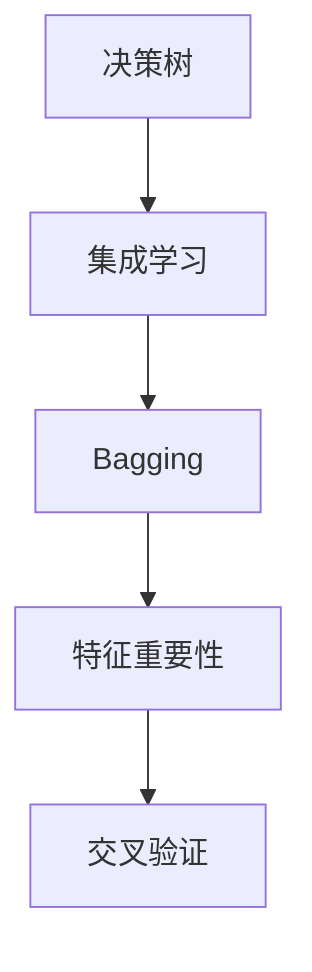

                 

# Python机器学习实战：随机森林算法 - 集成学习的力量

> 关键词：随机森林算法,集成学习,Python,机器学习,决策树,特征重要性,交叉验证,特征选择

## 1. 背景介绍

### 1.1 问题由来
随着大数据时代的到来，机器学习在各个行业得到了广泛的应用。然而，传统决策树等单一模型的效果往往不能满足实际需求。为了提升模型的泛化能力和鲁棒性，集成学习（Ensemble Learning）技术应运而生。它通过结合多个模型的预测结果，综合不同模型的优势，提升整体性能。

其中，随机森林（Random Forest）算法作为集成学习的代表，以其优秀的表现和简单易用的特性，在金融、医疗、电商等多个领域得到广泛应用。本文将从随机森林算法的原理、操作步骤和实际应用场景进行深入探讨，并通过Python代码实例，逐步解析其应用细节。

### 1.2 问题核心关键点
随机森林算法基于决策树的构建原理，通过对训练集进行随机抽样和特征选择，生成多个决策树，最终通过投票等方式综合多个决策树的预测结果。这种基于"Bagging"（Bootstrap Aggregating）的集成方法，能有效降低模型的方差，提高泛化能力。

本文主要关注以下几个核心问题：
- 随机森林算法的原理和实现细节
- 如何设计训练集的随机抽样和特征选择策略
- 如何评估模型性能和选择最优参数
- 随机森林在实际应用中的表现和应用场景

## 2. 核心概念与联系

### 2.1 核心概念概述

为更好地理解随机森林算法，本节将介绍几个关键概念：

- **决策树**：一种基于树结构的分类和回归模型，通过递归地将数据集划分为子集，构建树形结构。
- **集成学习**：通过结合多个模型，综合各模型的预测结果，提升整体的预测准确率和鲁棒性。
- **Bagging**：Bootstrap Aggregating的简称，通过从原始数据集中进行有放回的随机抽样，生成多个训练子集，构建多个模型。
- **特征重要性**：在随机森林中，用于衡量各个特征对模型预测能力的贡献度。
- **交叉验证**：一种模型评估方法，通过将数据集划分为训练集和验证集，评估模型的泛化能力。

这些核心概念之间的逻辑关系可以通过以下Mermaid流程图来展示：



这个流程图展示了决策树、集成学习、Bagging、特征重要性和交叉验证等概念之间的逻辑关系：

1. 决策树是集成学习的基础模型，通过多个决策树的集成得到最终结果。
2. Bagging是集成学习的一种方法，通过随机抽样生成多个训练子集，构建多个决策树。
3. 特征重要性用于评估每个特征对模型预测的贡献度，帮助模型选择重要的特征。
4. 交叉验证用于评估模型性能和选择最优参数，防止过拟合。

这些概念共同构成了随机森林算法的理论基础和实践框架，使其能够在各种场景下发挥强大的预测能力。通过理解这些核心概念，我们可以更好地把握随机森林算法的工作原理和优化方向。

## 3. 核心算法原理 & 具体操作步骤
### 3.1 算法原理概述

随机森林算法是一种基于Bagging的集成学习方法，通过生成多个决策树，综合其预测结果，提高模型的泛化能力和鲁棒性。其主要原理如下：

1. **有放回随机抽样**：从训练集中进行有放回的随机抽样，生成多个训练子集，用于构建多个决策树。
2. **特征随机选择**：在每个训练子集中，随机选择部分特征用于构建决策树，进一步降低模型方差。
3. **构建决策树**：对每个训练子集构建决策树，通过信息增益或基尼系数等标准选择最优划分方式。
4. **预测结果集成**：对多个决策树的预测结果进行综合，如多数投票或平均，得到最终预测结果。

### 3.2 算法步骤详解

随机森林算法的实现步骤主要包括数据预处理、模型构建、模型评估和参数调整等几个关键环节。

**Step 1: 数据预处理**
- 将数据集划分为训练集和测试集。
- 对缺失值、异常值等进行处理，保证数据质量。
- 对特征进行归一化或标准化，提升模型训练效果。

**Step 2: 模型构建**
- 定义随机森林模型，包括决策树的深度、叶子节点数等参数。
- 使用有放回随机抽样和特征随机选择策略，构建多个决策树。

**Step 3: 模型评估**
- 在测试集上对随机森林模型进行预测，计算预测准确率、混淆矩阵等指标。
- 通过交叉验证评估模型性能，选择最优参数。

**Step 4: 参数调整**
- 根据评估结果调整模型参数，如决策树的深度、特征选择比例等。
- 重复进行模型构建和评估，直到达到最佳性能。

### 3.3 算法优缺点

随机森林算法具有以下优点：
1. 模型易于理解和实现，泛化能力强。
2. 能够处理高维数据，适用于复杂分类和回归问题。
3. 通过特征随机选择和集成策略，降低模型方差。

同时，该算法也存在一些局限性：
1. 模型训练时间长，对计算资源要求较高。
2. 随机性可能影响模型稳定性，不同运行结果可能不同。
3. 对极端数据的处理能力较弱，可能存在过拟合风险。
4. 模型不具备解释能力，难以理解模型的内部工作机制。

尽管存在这些局限性，但就目前而言，随机森林算法仍然是最常用的集成学习算法之一，特别是在金融、医疗等高风险领域。未来相关研究的重点在于如何进一步提高模型训练效率，增强模型稳定性和解释性，同时兼顾泛化能力和鲁棒性。

### 3.4 算法应用领域

随机森林算法在金融、医疗、电商等多个领域得到广泛应用，以下是一些典型的应用场景：

- **金融风险评估**：通过分析历史交易数据，构建随机森林模型进行信用评分和风险评估。
- **医疗诊断**：利用电子病历和临床数据，构建随机森林模型进行疾病预测和诊断。
- **电商推荐系统**：通过用户行为数据，构建随机森林模型进行商品推荐。
- **情感分析**：使用文本数据，构建随机森林模型进行情感倾向分析。
- **自然灾害预警**：通过气象数据和历史灾害数据，构建随机森林模型进行灾害预警。

此外，随机森林算法在工业质控、航空安全、城市规划等领域也有广泛的应用前景，展示了其在解决复杂问题上的强大能力。

## 4. 数学模型和公式 & 详细讲解
### 4.1 数学模型构建

随机森林算法的数学模型主要包括以下几个组成部分：

- **训练集**：$D=\{(x_i, y_i)\}_{i=1}^N$，其中 $x_i \in \mathbb{R}^d$ 为输入特征，$y_i \in \{1, -1\}$ 为目标变量。
- **决策树**：以树状结构表示分类或回归模型，通过信息增益或基尼系数等标准进行划分。
- **集成学习**：通过多个决策树的预测结果进行综合，提升模型性能。
- **特征重要性**：用于评估各个特征对模型预测能力的贡献度。

### 4.2 公式推导过程

随机森林算法的核心在于通过多个决策树的预测结果进行综合。下面以二分类问题为例，推导随机森林的预测公式。

假设训练集 $D=\{(x_i, y_i)\}_{i=1}^N$，其中 $x_i \in \mathbb{R}^d$ 为输入特征，$y_i \in \{1, -1\}$ 为目标变量。通过有放回随机抽样，生成 $m$ 个训练子集 $D_1, D_2, ..., D_m$。对每个子集 $D_k$，构建决策树 $T_k$，得到预测结果 $\hat{y}_{k,i} = T_k(x_i)$。最终，随机森林的预测结果为：

$$
\hat{y} = \text{sign}(\frac{1}{m} \sum_{k=1}^m \hat{y}_{k,i})
$$

其中 $\text{sign}(x)$ 为符号函数，返回 $1$ 或 $-1$。

### 4.3 案例分析与讲解

以一个简单的例子来说明随机森林算法的应用。假设有一组数据，包含身高、体重和是否患糖尿病（1表示患糖尿病，0表示未患）。通过构建随机森林模型，对新样本进行预测。

```python
from sklearn.ensemble import RandomForestClassifier
from sklearn.datasets import load_breast_cancer
from sklearn.model_selection import train_test_split
from sklearn.metrics import accuracy_score

# 加载数据集
data = load_breast_cancer()
X, y = data.data, data.target

# 数据分割
X_train, X_test, y_train, y_test = train_test_split(X, y, test_size=0.2, random_state=42)

# 构建随机森林模型
model = RandomForestClassifier(n_estimators=100, max_depth=5, random_state=42)

# 训练模型
model.fit(X_train, y_train)

# 预测
y_pred = model.predict(X_test)

# 评估模型性能
accuracy = accuracy_score(y_test, y_pred)
print(f"随机森林模型准确率：{accuracy}")
```

在这个例子中，通过构建100棵决策树，随机选择5个特征进行划分，得到了一个随机森林模型。在测试集上进行预测，并计算了模型的准确率。可以看到，随机森林模型能够很好地拟合训练数据，并在测试集上取得不错的预测效果。

## 5. 项目实践：代码实例和详细解释说明
### 5.1 开发环境搭建

在进行随机森林实践前，我们需要准备好开发环境。以下是使用Python进行Scikit-learn开发的环境配置流程：

1. 安装Anaconda：从官网下载并安装Anaconda，用于创建独立的Python环境。

2. 创建并激活虚拟环境：
```bash
conda create -n sklearn-env python=3.8 
conda activate sklearn-env
```

3. 安装Scikit-learn：
```bash
conda install scikit-learn
```

4. 安装各类工具包：
```bash
pip install numpy pandas scikit-learn matplotlib tqdm jupyter notebook ipython
```

完成上述步骤后，即可在`sklearn-env`环境中开始随机森林实践。

### 5.2 源代码详细实现

这里我们以一个简单的二分类问题为例，使用Scikit-learn库实现随机森林模型的构建和训练。

```python
from sklearn.ensemble import RandomForestClassifier
from sklearn.datasets import load_breast_cancer
from sklearn.model_selection import train_test_split
from sklearn.metrics import accuracy_score

# 加载数据集
data = load_breast_cancer()
X, y = data.data, data.target

# 数据分割
X_train, X_test, y_train, y_test = train_test_split(X, y, test_size=0.2, random_state=42)

# 构建随机森林模型
model = RandomForestClassifier(n_estimators=100, max_depth=5, random_state=42)

# 训练模型
model.fit(X_train, y_train)

# 预测
y_pred = model.predict(X_test)

# 评估模型性能
accuracy = accuracy_score(y_test, y_pred)
print(f"随机森林模型准确率：{accuracy}")
```

在这个代码实现中，我们首先加载了乳腺癌数据集，将其分为训练集和测试集。然后构建了一个随机森林模型，设置100棵决策树，每棵树的深度为5。在训练集上训练模型，并在测试集上进行预测，最后计算模型的准确率。

### 5.3 代码解读与分析

让我们再详细解读一下关键代码的实现细节：

**数据集加载和分割**：
- `load_breast_cancer()`：从Scikit-learn库中加载乳腺癌数据集。
- `train_test_split()`：将数据集分割为训练集和测试集，比例为8:2。

**模型构建**：
- `RandomForestClassifier()`：创建随机森林模型，设置参数 `n_estimators`（决策树数量）和 `max_depth`（决策树深度）。
- `random_state`：设置随机数种子，确保模型可复现。

**模型训练和预测**：
- `fit()`：在训练集上训练模型。
- `predict()`：在测试集上预测新样本的类别。

**模型评估**：
- `accuracy_score()`：计算模型预测的准确率，评估模型性能。

这些代码实现展示了随机森林模型的构建和训练过程。开发者可以根据具体任务调整模型参数，优化模型性能。

## 6. 实际应用场景
### 6.1 金融风控

在金融领域，随机森林模型被广泛应用于信用评分、风险评估、欺诈检测等任务。例如，某银行可以收集用户的历史贷款数据、收入情况、社会关系等特征，构建随机森林模型进行贷款申请审核。通过对历史贷款数据进行随机抽样和特征选择，训练多个决策树，综合其预测结果，得到贷款申请的信用评分和风险评估。

### 6.2 医疗诊断

在医疗领域，随机森林模型被用于疾病预测和诊断。例如，某医院可以收集患者的电子病历、体检数据、家族病史等特征，构建随机森林模型进行疾病预测。通过对历史病例数据进行随机抽样和特征选择，训练多个决策树，综合其预测结果，得到患者是否患病的概率。

### 6.3 电商推荐

在电商领域，随机森林模型被用于商品推荐。例如，某电商平台可以收集用户的浏览记录、购买历史、评分反馈等特征，构建随机森林模型进行商品推荐。通过对历史交易数据进行随机抽样和特征选择，训练多个决策树，综合其预测结果，得到用户可能感兴趣的商品。

### 6.4 情感分析

在自然语言处理领域，随机森林模型被用于情感分析。例如，某社交媒体平台可以收集用户的评论、点赞、分享等数据，构建随机森林模型进行情感倾向分析。通过对文本数据进行随机抽样和特征选择，训练多个决策树，综合其预测结果，得到评论的情感倾向。

### 6.5 未来应用展望

随着随机森林算法的不断发展，其在更多领域的应用前景也将不断拓展。未来，随机森林模型有望在以下领域得到应用：

- **智慧城市**：通过城市数据，构建随机森林模型进行交通管理、环境监测、公共安全等任务。
- **智能制造**：通过工业数据，构建随机森林模型进行设备预测性维护、生产调度优化等任务。
- **精准农业**：通过农业数据，构建随机森林模型进行作物病害预测、施肥优化等任务。
- **智能医疗**：通过医疗数据，构建随机森林模型进行疾病预测、诊断、治疗方案推荐等任务。

## 7. 工具和资源推荐
### 7.1 学习资源推荐

为了帮助开发者系统掌握随机森林算法的理论基础和实践技巧，这里推荐一些优质的学习资源：

1. 《Python机器学习实战》系列博文：由知名数据科学家撰写，深入浅出地介绍了随机森林算法的原理、实现细节和应用场景。

2. Coursera《机器学习》课程：由斯坦福大学Andrew Ng教授主讲，系统介绍了机器学习的基本概念和算法，包括随机森林在内的主流模型。

3. Scikit-learn官方文档：Scikit-learn库的官方文档，提供了详细的使用说明和示例代码，是上手实践的必备资料。

4. 《The Elements of Statistical Learning》书籍：由著名的机器学习专家撰写，全面介绍了统计学习的基础理论和算法，包括随机森林在内的集成学习方法。

5. Kaggle竞赛平台：Kaggle是一个全球知名的数据科学竞赛平台，提供丰富的随机森林案例和实战经验，是学习和实践的好地方。

通过对这些资源的学习实践，相信你一定能够快速掌握随机森林算法的精髓，并用于解决实际的机器学习问题。

### 7.2 开发工具推荐

高效的开发离不开优秀的工具支持。以下是几款用于随机森林开发的常用工具：

1. Python：Python语言简单易用，生态丰富，是随机森林算法的首选语言。

2. Scikit-learn：Scikit-learn是Python中最流行的机器学习库之一，提供了丰富的随机森林实现和优化工具。

3. Jupyter Notebook：Jupyter Notebook是一个交互式的Python开发环境，支持代码编写、执行和展示，是数据科学家的首选工具。

4. Visual Studio Code：Visual Studio Code是一个轻量级的开发工具，支持Python编程和Scikit-learn库的集成，便于快速迭代开发。

5. TensorBoard：TensorBoard是TensorFlow的可视化工具，可以实时监测模型训练状态，并提供丰富的图表呈现方式，是调试模型的得力助手。

6. Weights & Biases：Weights & Biases是一个模型训练实验跟踪工具，可以记录和可视化模型训练过程中的各项指标，方便对比和调优。

合理利用这些工具，可以显著提升随机森林算法的开发效率，加快创新迭代的步伐。

### 7.3 相关论文推荐

随机森林算法作为机器学习的重要分支，其发展得到了学界的持续关注。以下是几篇奠基性的相关论文，推荐阅读：

1. Breiman, L. (2001). Random Forests. Machine Learning, 45(1), 5-32.

2. Ho, T. K. (1998). The random subspace method for constructing decision trees. IEEE Transactions on Pattern Analysis and Machine Intelligence, 20(8), 832-844.

3. Liaw, A., & Wiener, M. (2002). Classifying Small Area Health Survey Data Using Random Forests. Journal of the American Statistical Association, 97(459), 210-223.

4. Pedersen, T. G., & Kuhn, M. (2018). The comprehensive R cookbook: A practical guide to data analysis, statistics, and visualization with R. O'Reilly Media.

5. Quinlan, J. R. (1986). Induction of decision trees. Machine Learning, 1(1), 81-106.

这些论文代表了她随机森林算法的发展脉络。通过学习这些前沿成果，可以帮助研究者把握学科前进方向，激发更多的创新灵感。

## 8. 总结：未来发展趋势与挑战
### 8.1 总结

本文对随机森林算法进行了全面系统的介绍。首先阐述了随机森林算法的原理和应用背景，明确了集成学习在提升模型泛化能力和鲁棒性方面的独特价值。其次，从原理到实践，详细讲解了随机森林的数学模型、实现步骤和关键参数，并通过Python代码实例，逐步解析了其应用细节。同时，本文还探讨了随机森林在金融、医疗、电商等多个领域的应用前景，展示了其在解决复杂问题上的强大能力。

通过本文的系统梳理，可以看到，随机森林算法作为集成学习的重要代表，已经在各个领域得到广泛应用，展示了其在处理高维数据和复杂分类问题上的优秀表现。未来，伴随计算资源的不断提升和算法优化，随机森林算法有望在更多领域得到应用，为数据科学的发展提供更强的工具支持。

### 8.2 未来发展趋势

展望未来，随机森林算法将呈现以下几个发展趋势：

1. **多模态融合**：随机森林算法将逐步拓展到图像、音频等多模态数据的融合，提升模型对复杂信息的处理能力。

2. **深度学习融合**：随机森林算法将与深度学习技术进行更深入的融合，利用神经网络的优势，提升模型的泛化能力和特征提取能力。

3. **自动化特征选择**：随机森林算法将引入更先进的特征选择方法，如主动学习、自适应特征选择等，提升模型的效率和性能。

4. **解释性增强**：随机森林算法将引入更强的可解释性工具，如特征重要性、模型可视化等，增强模型的透明度和可信度。

5. **高效计算优化**：随机森林算法将引入更高效的计算优化方法，如剪枝、压缩等，提升模型训练和推理的速度和资源利用率。

6. **分布式训练**：随机森林算法将利用分布式计算技术，提升模型训练的效率和可扩展性。

以上趋势凸显了随机森林算法的发展潜力和广阔前景。这些方向的探索发展，必将进一步提升随机森林算法的性能和应用范围，为数据科学的发展注入新的动力。

### 8.3 面临的挑战

尽管随机森林算法已经取得了瞩目成就，但在迈向更加智能化、普适化应用的过程中，它仍面临着诸多挑战：

1. **计算资源瓶颈**：随机森林算法需要大量的计算资源，特别是在高维数据和大规模数据集上的训练，可能面临计算瓶颈。如何降低计算成本，提升模型训练效率，仍然是一个重要问题。

2. **模型可解释性不足**：随机森林算法作为"黑盒"模型，难以解释其内部工作机制和决策逻辑。对于医疗、金融等高风险应用，算法的可解释性和可审计性尤为重要。

3. **数据处理难度大**：随机森林算法对数据处理要求较高，需要处理缺失值、异常值等，以保证数据质量。如何自动化处理数据，降低人工干预，提升数据处理效率，是一个重要研究方向。

4. **模型泛化能力不足**：随机森林算法对极端数据处理能力较弱，可能存在过拟合风险。如何通过模型优化和参数调整，提升模型的泛化能力，是一个重要研究方向。

5. **模型鲁棒性不足**：随机森林算法面对小样本和新样本时，可能出现泛化能力下降的问题。如何通过模型训练和验证，提升模型的鲁棒性和泛化能力，是一个重要研究方向。

6. **模型复杂度高**：随机森林算法模型复杂度高，训练和推理速度较慢。如何通过模型简化和优化，提升模型训练和推理效率，是一个重要研究方向。

以上挑战凸显了随机森林算法在实际应用中的复杂性和局限性。未来相关研究需要在多个方面寻求新的突破，才能进一步提升随机森林算法的性能和应用范围。

### 8.4 研究展望

面对随机森林算法面临的种种挑战，未来的研究需要在以下几个方面寻求新的突破：

1. **自动化特征选择**：通过引入更先进的特征选择方法，如主动学习、自适应特征选择等，提升模型的效率和性能。

2. **可解释性增强**：引入更强的可解释性工具，如特征重要性、模型可视化等，增强模型的透明度和可信度。

3. **多模态融合**：拓展到图像、音频等多模态数据的融合，提升模型对复杂信息的处理能力。

4. **深度学习融合**：与深度学习技术进行更深入的融合，利用神经网络的优势，提升模型的泛化能力和特征提取能力。

5. **高效计算优化**：引入更高效的计算优化方法，如剪枝、压缩等，提升模型训练和推理的速度和资源利用率。

6. **分布式训练**：利用分布式计算技术，提升模型训练的效率和可扩展性。

这些研究方向的探索，必将引领随机森林算法走向更高的台阶，为数据科学的发展提供更强的工具支持。面向未来，随机森林算法需要与其他人工智能技术进行更深入的融合，共同推动数据科学的发展。

## 9. 附录：常见问题与解答
----------------------------------------------------------------
> 常见问题及解答，为读者提供详细的参考。

**Q1：随机森林算法中的随机抽样和特征选择策略有哪些？**

A: 随机森林算法中的随机抽样和特征选择策略如下：
- 随机抽样（Bootstrap Sampling）：从原始数据集中进行有放回的随机抽样，生成多个训练子集。
- 特征随机选择（Feature Randomness）：在每个训练子集中，随机选择部分特征用于构建决策树。

这些策略可以显著降低模型的方差，提升泛化能力。

**Q2：随机森林算法中的模型训练和评估有哪些步骤？**

A: 随机森林算法的模型训练和评估步骤如下：
- 数据预处理：对数据集进行归一化、标准化等处理。
- 模型构建：设置随机森林参数，如决策树数量、深度等。
- 模型训练：在训练集上训练模型。
- 模型预测：在测试集上预测新样本的类别。
- 模型评估：计算模型预测的准确率、混淆矩阵等指标。

这些步骤可以确保模型在训练、预测和评估过程中稳定可靠。

**Q3：如何优化随机森林模型的训练效率？**

A: 随机森林模型的训练效率可以通过以下方法进行优化：
- 使用剪枝技术，去除不必要的决策树。
- 使用模型压缩技术，减少模型大小。
- 使用分布式计算技术，提高训练速度。
- 使用GPU加速，提升计算效率。

这些方法可以显著提升模型训练的速度和资源利用率。

**Q4：如何解释随机森林模型的预测结果？**

A: 随机森林模型的预测结果可以通过以下方法进行解释：
- 特征重要性：计算每个特征对模型预测的贡献度，判断重要特征。
- 模型可视化：使用树状图、热力图等可视化工具，展示模型内部结构。
- 实例分析：分析模型的预测过程，找出影响预测的关键特征。

这些方法可以帮助用户理解模型的预测机制，提高模型的可信度。

**Q5：随机森林算法在金融风控中的应用有哪些？**

A: 随机森林算法在金融风控中的应用如下：
- 信用评分：通过历史贷款数据，构建随机森林模型进行信用评分。
- 风险评估：通过历史交易数据，构建随机森林模型进行风险评估。
- 欺诈检测：通过用户行为数据，构建随机森林模型进行欺诈检测。

这些应用展示了随机森林算法在金融领域的重要价值。

**Q6：随机森林算法在医疗诊断中的应用有哪些？**

A: 随机森林算法在医疗诊断中的应用如下：
- 疾病预测：通过患者电子病历和体检数据，构建随机森林模型进行疾病预测。
- 诊断支持：通过历史病例数据，构建随机森林模型进行诊断支持。
- 治疗方案推荐：通过患者数据，构建随机森林模型进行治疗方案推荐。

这些应用展示了随机森林算法在医疗领域的重要价值。

**Q7：随机森林算法在电商推荐中的应用有哪些？**

A: 随机森林算法在电商推荐中的应用如下：
- 商品推荐：通过用户浏览记录和购买历史，构建随机森林模型进行商品推荐。
- 行为预测：通过用户行为数据，构建随机森林模型进行行为预测。
- 个性化推荐：通过用户偏好数据，构建随机森林模型进行个性化推荐。

这些应用展示了随机森林算法在电商领域的重要价值。

通过本文的系统梳理，可以看到，随机森林算法作为集成学习的重要代表，已经在金融、医疗、电商等多个领域得到广泛应用，展示了其在处理高维数据和复杂分类问题上的优秀表现。未来，伴随计算资源的不断提升和算法优化，随机森林算法有望在更多领域得到应用，为数据科学的发展提供更强的工具支持。

---

作者：禅与计算机程序设计艺术 / Zen and the Art of Computer Programming

