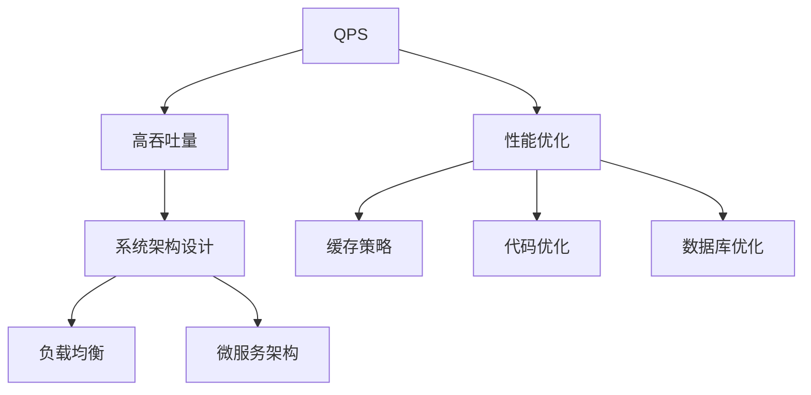

                 

## 1. 背景介绍

在数字化转型浪潮中，系统的高吞吐量（High Throughput）性能成为衡量应用服务能力的重要指标。高吞吐量不仅意味着系统处理能力更强，还能确保在面对大规模并发请求时保持稳定，提升用户体验。在实际业务场景中，QPS（每秒查询量）和TPS（每秒事务数）是衡量系统高吞吐量的关键指标。本文将深入探讨QPS与TPS在高吞吐量中的应用，并分析其关键技术与优化策略。

## 2. 核心概念与联系

### 2.1 核心概念概述

为了更好地理解QPS与TPS在实际应用中的作用和优化策略，我们首先需要明确几个核心概念及其相互关系：

- **QPS（每秒查询量）**：指每秒处理的查询次数。查询可以理解为对数据库、缓存或任何数据存储的访问请求。
- **TPS（每秒事务数）**：指每秒处理的事务数量。事务通常涉及到对数据的创建、更新、删除等操作，是系统中最常见的性能瓶颈之一。
- **高吞吐量（High Throughput）**：指系统每秒能够处理的事务数或查询数达到较高水平。
- **系统架构设计**：包括微服务架构、负载均衡、分布式系统等。
- **性能优化**：包括代码优化、缓存策略、数据库优化、负载均衡等。

这些概念之间的逻辑关系可以通过以下Mermaid流程图来展示：



## 3. 核心算法原理 & 具体操作步骤

### 3.1 算法原理概述

高吞吐量系统通常面临高并发、大数据量等挑战。在处理高吞吐量场景时，我们需要设计高效、可扩展的系统架构，并采取相应的优化策略。以下是对QPS与TPS在高吞吐量中的优化策略进行详细探讨。

### 3.2 算法步骤详解

高吞吐量系统的设计和优化通常包含以下几个步骤：

1. **系统架构设计**：选择合适的架构模式，如微服务、无状态服务、分布式系统等。
2. **缓存策略**：合理利用缓存，减少数据库访问频率。
3. **负载均衡**：使用负载均衡器均衡请求分发，避免单点故障。
4. **数据库优化**：优化SQL语句，使用索引，合理分区等。
5. **性能监控与调优**：实时监控系统性能指标，动态调整资源配置。

### 3.3 算法优缺点

高吞吐量系统的高效性、可扩展性是其核心优势，但也存在以下缺点：

- **复杂性高**：高吞吐量系统设计复杂，需要考虑多方面因素，如服务划分、数据一致性等。
- **成本高**：高吞吐量系统通常需要更高级别的硬件和软件资源。
- **故障容忍度低**：高并发场景下，单点故障可能导致系统崩溃。

### 3.4 算法应用领域

高吞吐量系统在电商、金融、互联网等多个领域得到广泛应用，以下是几个典型应用场景：

- **电商系统**：处理高并发订单、库存更新、用户行为分析等。
- **金融系统**：处理高频交易、账户管理、风险控制等。
- **互联网服务**：提供高并发的API接口、数据查询、用户登录等。

## 4. 数学模型和公式 & 详细讲解 & 举例说明

### 4.1 数学模型构建

在高吞吐量场景中，QPS和TPS的计算模型可以表示为：

$$
QPS = \frac{处理请求数量}{时间间隔}
$$

$$
TPS = \frac{完成事务数量}{时间间隔}
$$

其中，时间间隔通常为1秒。

### 4.2 公式推导过程

假设系统每秒处理n个请求，其中m个请求是成功的（成功事务数），其余n-m个请求是失败的（失败查询数或事务）。则QPS和TPS可以表示为：

$$
QPS = \frac{n}{时间间隔} = n
$$

$$
TPS = \frac{m}{时间间隔} = m
$$

因此，优化QPS和TPS的目标是最大化m，即成功处理的事务数量。

### 4.3 案例分析与讲解

以电商系统为例，假设系统每秒处理1000个订单请求，其中500个订单请求成功（支付成功），500个订单请求失败（支付失败或超时）。则QPS为1000，TPS为500。

## 5. 项目实践：代码实例和详细解释说明

### 5.1 开发环境搭建

为了实现QPS与TPS的高吞吐量应用，我们需要搭建一个高性能的系统环境。以下是Python开发环境的搭建步骤：

1. **安装Python**：从官网下载并安装Python。
2. **安装依赖库**：安装必要的依赖库，如Flask、SQLAlchemy等。
3. **配置缓存**：安装Redis或Memcached，配置缓存策略。
4. **负载均衡**：使用Nginx或HAProxy配置负载均衡。
5. **数据库优化**：选择合适的数据库引擎，并优化SQL语句。

### 5.2 源代码详细实现

以下是一个简单的电商订单系统示例代码：

```python
from flask import Flask, request
from sqlalchemy import create_engine, Column, Integer, String
from sqlalchemy.orm import sessionmaker
from sqlalchemy.ext.declarative import declarative_base

app = Flask(__name__)

# 创建数据库连接
engine = create_engine('sqlite:///sqlite.db', echo=True)
Base = declarative_base()

# 订单模型
class Order(Base):
    __tablename__ = 'orders'
    id = Column(Integer, primary_key=True)
    user_id = Column(Integer)
    product_id = Column(Integer)
    amount = Column(Integer)
    status = Column(String)

# 创建订单表
Base.metadata.create_all(engine)

# 初始化Session
Session = sessionmaker(bind=engine)
session = Session()

@app.route('/place_order', methods=['POST'])
def place_order():
    data = request.get_json()
    user_id = data['user_id']
    product_id = data['product_id']
    amount = data['amount']
    order = Order(user_id=user_id, product_id=product_id, amount=amount, status='pending')
    session.add(order)
    session.commit()
    return 'Order placed successfully', 200

@app.route('/get_order_status', methods=['GET'])
def get_order_status():
    user_id = request.args.get('user_id')
    product_id = request.args.get('product_id')
    order = session.query(Order).filter_by(user_id=user_id, product_id=product_id).first()
    if order:
        return {'status': order.status}, 200
    else:
        return {'status': 'order_not_found'}, 404

if __name__ == '__main__':
    app.run(host='0.0.0.0', port=5000)
```

### 5.3 代码解读与分析

在上述代码中，我们通过Flask框架搭建了一个简单的电商订单系统。系统包含两个API接口：`place_order`用于处理订单支付请求，`get_order_status`用于查询订单状态。

- **数据库设计**：使用SQLAlchemy进行数据库操作，创建了一个`orders`表，包含订单的用户ID、产品ID、金额和状态。
- **路由配置**：使用Flask的路由功能，实现对订单的处理和查询。
- **事务处理**：在`place_order`接口中，通过`session.add`将订单保存到数据库，并通过`session.commit`提交事务。

### 5.4 运行结果展示

运行上述代码，可以在浏览器中访问`http://localhost:5000/`，查看订单处理和查询的结果。

## 6. 实际应用场景

### 6.1 电商系统

在高并发的电商系统中，QPS与TPS的优化至关重要。以下是在电商系统中实现高吞吐量的一些策略：

1. **缓存策略**：使用Redis缓存订单信息和用户信息，减少数据库访问频率。
2. **负载均衡**：使用Nginx负载均衡器，分发请求到多个订单处理服务。
3. **数据库优化**：使用SQLAlchemy优化SQL语句，添加索引，减少查询时间。

### 6.2 金融系统

金融系统的TPS优化通常涉及高频交易和账户管理。以下是在金融系统中实现高吞吐量的一些策略：

1. **分布式架构**：使用微服务架构，将交易处理、账户管理等功能模块化。
2. **缓存策略**：使用Redis缓存交易信息和账户余额，减少数据库访问频率。
3. **负载均衡**：使用HAProxy负载均衡器，均衡交易处理请求。
4. **数据库优化**：使用分库分表、读写分离等技术，提升数据库吞吐量。

### 6.3 互联网服务

互联网服务的高吞吐量需求主要体现在API接口和用户登录等场景。以下是在互联网服务中实现高吞吐量的一些策略：

1. **缓存策略**：使用Redis缓存用户登录信息和API接口返回结果，减少数据库访问频率。
2. **负载均衡**：使用Nginx负载均衡器，均衡API请求和用户登录请求。
3. **数据库优化**：使用SQLAlchemy优化SQL语句，添加索引，减少查询时间。

## 7. 工具和资源推荐

### 7.1 学习资源推荐

为了深入学习QPS与TPS在高吞吐量中的应用，我们推荐以下学习资源：

1. **《高性能Python网络编程》**：这本书详细介绍了高性能网络编程的技术和策略，涵盖高并发场景的优化方法。
2. **《Redis权威指南》**：这本书介绍了Redis的缓存策略和应用场景，帮助开发者更好地利用缓存技术优化系统性能。
3. **《Flask Web开发实战》**：这本书介绍了Flask框架的高级应用，包括高并发场景下的路由配置和性能优化。
4. **《MySQL高性能优化实战》**：这本书介绍了MySQL数据库的高性能优化技巧，涵盖索引、查询优化等内容。
5. **《微服务架构设计》**：这本书介绍了微服务架构的设计原则和实现方法，帮助开发者构建高效、可扩展的系统架构。

### 7.2 开发工具推荐

为了实现QPS与TPS的高吞吐量应用，我们推荐以下开发工具：

1. **Flask**：轻量级Web框架，适合搭建高并发API接口。
2. **SQLAlchemy**：Python ORM框架，帮助开发者更高效地操作数据库。
3. **Redis**：高性能缓存系统，适合存储高频访问的数据。
4. **Nginx**：高性能负载均衡器，适合分发高并发请求。
5. **HAProxy**：高性能负载均衡器，适合均衡高并发请求。

### 7.3 相关论文推荐

为了深入理解QPS与TPS在高吞吐量中的应用，我们推荐以下相关论文：

1. **《High Performance Python Web Applications》**：这篇论文介绍了高性能Python Web应用的设计和实现方法，涵盖缓存、负载均衡、数据库优化等内容。
2. **《Optimizing Database Performance for High Throughput Systems》**：这篇论文介绍了数据库在高吞吐量系统中的优化策略，涵盖索引、分区、查询优化等内容。
3. **《Designing Microservices for High Throughput》**：这篇论文介绍了微服务架构在高吞吐量系统中的设计原则和实现方法。

## 8. 总结：未来发展趋势与挑战

### 8.1 研究成果总结

本文对QPS与TPS在高吞吐量中的应用进行了详细探讨。通过分析系统架构设计、缓存策略、负载均衡和数据库优化等关键技术，提出了高吞吐量系统的高效实现方案。

### 8.2 未来发展趋势

未来，QPS与TPS在高吞吐量中的应用将继续发展，呈现出以下趋势：

1. **云计算与容器化**：随着云计算和容器化技术的普及，高吞吐量系统将更加灵活、可扩展。
2. **分布式架构**：微服务架构、Serverless架构等分布式架构将成为高吞吐量系统的首选。
3. **自动优化**：通过机器学习和自动调优技术，高吞吐量系统将实现自适应优化。
4. **边缘计算**：边缘计算技术将帮助高吞吐量系统更好地处理本地数据，提升响应速度。
5. **区块链**：区块链技术在高并发场景下的应用将推动金融、电商等领域的发展。

### 8.3 面临的挑战

尽管QPS与TPS在高吞吐量中的应用取得了一定进展，但仍然面临以下挑战：

1. **复杂性高**：高吞吐量系统设计复杂，需要考虑多方面因素，如服务划分、数据一致性等。
2. **成本高**：高吞吐量系统通常需要更高级别的硬件和软件资源。
3. **故障容忍度低**：高并发场景下，单点故障可能导致系统崩溃。
4. **安全性**：高并发场景下，系统安全性面临更多挑战，如DDoS攻击等。

### 8.4 研究展望

未来，需要在以下方面进行深入研究：

1. **自动优化算法**：开发自动优化算法，实现自适应性能调整。
2. **分布式架构**：探索更高效、可扩展的分布式架构。
3. **边缘计算**：研究边缘计算在高吞吐量系统中的应用。
4. **区块链**：研究区块链技术在高并发场景下的应用。
5. **安全保障**：加强高吞吐量系统的安全性研究，防范潜在风险。

总之，QPS与TPS在高吞吐量中的应用仍然面临诸多挑战，需要从系统设计、缓存策略、负载均衡、数据库优化等多个方面进行全面优化。只有不断创新和突破，才能实现高吞吐量系统的稳定、高效、可靠运行。

## 9. 附录：常见问题与解答

**Q1: QPS与TPS有什么区别？**

A: QPS（每秒查询量）指每秒处理的查询次数，通常指对数据库或缓存的访问请求。而TPS（每秒事务数）指每秒处理的事务数量，通常涉及对数据的创建、更新、删除等操作。

**Q2: 高吞吐量系统如何设计？**

A: 高吞吐量系统通常包含以下设计步骤：
1. 选择合适的架构模式，如微服务、无状态服务、分布式系统等。
2. 缓存策略，合理利用缓存，减少数据库访问频率。
3. 负载均衡，使用负载均衡器均衡请求分发。
4. 数据库优化，优化SQL语句，使用索引，合理分区等。

**Q3: 如何优化数据库性能？**

A: 数据库性能优化主要包括以下几个方面：
1. 索引优化，添加合适的索引。
2. 查询优化，避免全表扫描，使用高效查询语句。
3. 分区策略，合理分区，提高查询效率。
4. 读写分离，将读操作和写操作分离，提升性能。

**Q4: 如何应对高并发场景？**

A: 高并发场景通常采用以下应对策略：
1. 缓存策略，减少数据库访问频率。
2. 负载均衡，均衡请求分发。
3. 数据库优化，优化SQL语句，使用索引。
4. 分布式架构，将服务模块化，提高可扩展性。

**Q5: 高吞吐量系统面临哪些挑战？**

A: 高吞吐量系统面临以下挑战：
1. 复杂性高，设计复杂，需要考虑多方面因素。
2. 成本高，需要更高级别的硬件和软件资源。
3. 故障容忍度低，单点故障可能导致系统崩溃。
4. 安全性，系统安全性面临更多挑战，如DDoS攻击等。

**Q6: 如何实现高吞吐量系统的自动优化？**

A: 高吞吐量系统的自动优化主要包括以下几个方面：
1. 自动优化算法，实现自适应性能调整。
2. 监控系统性能指标，动态调整资源配置。
3. 实时优化，根据实时数据进行动态调整。

**Q7: 如何提升高吞吐量系统的安全性？**

A: 高吞吐量系统的安全性提升主要包括以下几个方面：
1. 访问控制，限制非法访问。
2. 数据加密，保障数据安全。
3. 异常检测，实时监控系统异常。
4. 安全策略，制定安全策略，防范潜在风险。

总之，高吞吐量系统的设计和优化是一个复杂的过程，需要从系统设计、缓存策略、负载均衡、数据库优化等多个方面进行全面优化。只有不断创新和突破，才能实现高吞吐量系统的稳定、高效、可靠运行。

---

作者：禅与计算机程序设计艺术 / Zen and the Art of Computer Programming

