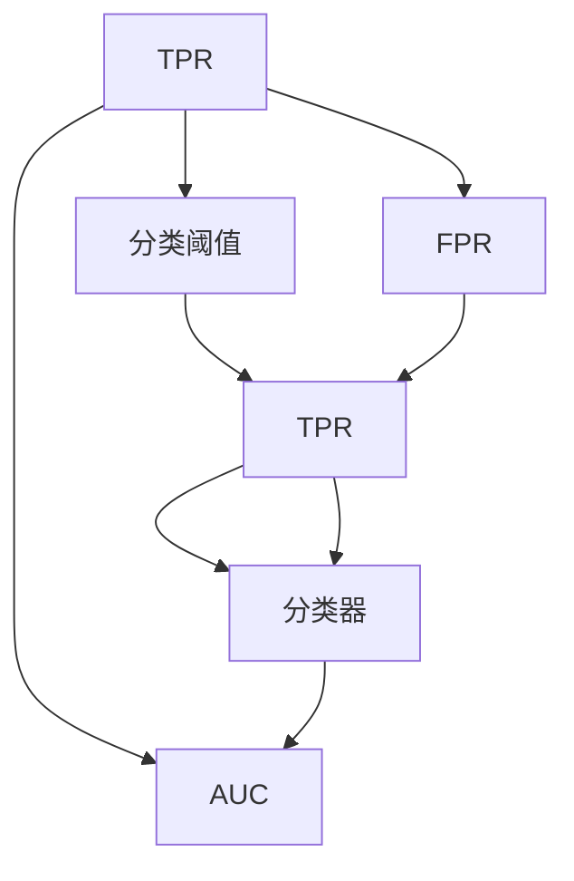

                 

# ROC曲线原理与代码实例讲解

> 关键词：ROC曲线,准确率,召回率,精确度,二分类模型,分类器评估,机器学习

## 1. 背景介绍

### 1.1 问题由来
在机器学习和统计学中，分类器性能评估是一个非常重要的任务。分类器能否准确地将样本分为不同类别，是一个衡量其性能的关键指标。ROC曲线（Receiver Operating Characteristic Curve）是一种常用来评估分类器性能的图形工具，特别适用于二分类问题。ROC曲线通过展示分类器在不同阈值下的真正率（True Positive Rate, TPR）和假正率（False Positive Rate, FPR）之间的关系，直观地展示了分类器的性能。

### 1.2 问题核心关键点
ROC曲线的关键点在于理解真正率和假正率的概念，并基于此构建ROC曲线图。其中，真正率指分类器正确识别为正类别的样本数占实际正类别样本数的比例；假正率则指分类器错误识别为正类别的样本数占实际负类别样本数的比例。ROC曲线的横轴代表假正率（FPR），纵轴代表真正率（TPR），在计算不同阈值下的TPR和FPR后，将数据点绘制在二维坐标系中，得到ROC曲线。

ROC曲线的位置越靠近左上角，分类器的性能越好。当ROC曲线完全覆盖左上角时，分类器的性能达到完美。ROC曲线下方的面积（AUC，Area Under Curve）则是衡量分类器性能的重要指标，AUC值越大，分类器的性能越好。

### 1.3 问题研究意义
ROC曲线及其相关指标（TPR、FPR、AUC）提供了全面而直观的方式来评估分类器的性能，特别是对于阈值的选择和不同性能度量的理解提供了很大的帮助。在实际应用中，选择合适的阈值（如0.5）将直接影响模型的决策边界，从而影响模型的精确度和召回率。因此，ROC曲线及其相关指标的深入理解对机器学习模型的优化至关重要。

## 2. 核心概念与联系

### 2.1 核心概念概述

为了更好地理解ROC曲线的原理和计算方法，本节将介绍几个密切相关的核心概念：

- 真正率（True Positive Rate, TPR）：分类器正确识别为正类别的样本数与实际正类别样本数之比，即TPR = TP / (TP + FN)。
- 假正率（False Positive Rate, FPR）：分类器错误识别为正类别的样本数与实际负类别样本数之比，即FPR = FP / (FP + TN)。
- 分类阈值（Threshold）：分类器用于判断样本是否为正类别的数值参数，通常是连续型的实数。
- ROC曲线：展示分类器在不同阈值下的真正率和假正率之间的关系，用于评估分类器的性能。
- AUC值（Area Under Curve）：ROC曲线下方的面积，用于衡量分类器的性能，AUC值越大，分类器的性能越好。

这些概念之间的逻辑关系可以通过以下Mermaid流程图来展示：



这个流程图展示了一些核心概念及其之间的关系：

1. 分类器在给定阈值下计算真正率和假正率。
2. 不同阈值对应的TPR和FPR可以构成ROC曲线。
3. AUC值则是ROC曲线下方的面积。
4. 分类阈值决定着分类器如何区分正负类别。

## 3. 核心算法原理 & 具体操作步骤
### 3.1 算法原理概述

ROC曲线的构建基于两个基本的概率度量：TPR和FPR。分类器在阈值 $t$ 下，真正率和假正率的计算公式分别为：

- 真正率（TPR）：$TPR = \frac{TP}{TP + FN}$
- 假正率（FPR）：$FPR = \frac{FP}{FP + TN}$

其中，$TP$ 表示真正例（True Positive），即分类器正确识别为正类别的样本数；$FN$ 表示假反例（False Negative），即实际为正类别但分类器错误识别为负类别的样本数；$FP$ 表示假正例（False Positive），即分类器错误识别为正类别的样本数；$TN$ 表示真反例（True Negative），即实际为负类别且分类器正确识别为负类别的样本数。

### 3.2 算法步骤详解

构建ROC曲线的具体步骤如下：

1. **收集数据**：
   - 计算模型在不同阈值下的真正率和假正率。

2. **绘制ROC曲线**：
   - 将不同阈值下的TPR和FPR数据点绘制在二维坐标系中，连接所有点构成ROC曲线。

3. **计算AUC值**：
   - 利用梯形法、辛普森法等数值积分方法计算ROC曲线下方的面积，得到AUC值。

### 3.3 算法优缺点

ROC曲线作为一种评估分类器性能的工具，具有以下优点：

- 独立于阈值：ROC曲线不依赖于具体的分类阈值，可以全面展示分类器的性能。
- 直观展示：ROC曲线提供了一种图形化的方式来直观展示分类器的性能，易于理解。
- 独立于样本分布：ROC曲线与数据集的分布无关，可用于比较不同分类器或同一分类器在不同数据集上的性能。

同时，ROC曲线也存在一些局限性：

- 计算复杂：计算ROC曲线需要多次计算真正率和假正率，计算量较大。
- 解释性差：ROC曲线提供的是分类器的性能度量，而不是具体的参数调整建议。
- 不适用于不平衡数据：当数据集类别不平衡时，ROC曲线可能给出误导性的结果。

### 3.4 算法应用领域

ROC曲线在机器学习和统计学中有广泛的应用，特别是在二分类问题的评估和模型选择中。以下是ROC曲线的一些典型应用领域：

- 医疗诊断：通过计算不同诊断阈值下的TPR和FPR，评估不同阈值下的诊断性能。
- 信用评分：用于评估不同信用评分阈值下的违约率，优化贷款审批流程。
- 医学图像分析：用于评估不同阈值下的影像分类性能。
- 网络安全：用于评估不同阈值下的入侵检测性能。
- 自然语言处理：用于评估文本分类器的性能。

## 4. 数学模型和公式 & 详细讲解  
### 4.1 数学模型构建

为了更加严格地描述ROC曲线的构建和评估，我们通过数学语言来进一步阐释。

假设分类器模型为 $h(x)$，输入样本 $x$ 属于类别 $y \in \{0, 1\}$，分类阈值 $t$，则分类器的输出为：

$$
h(x; t) = \begin{cases}
1 & \text{如果} \, h(x) \geq t \\
0 & \text{如果} \, h(x) < t
\end{cases}
$$

根据上述输出，可以计算真正率和假正率：

- 真正率（TPR）：$\text{TPR}(t) = \frac{TP}{TP + FN}$
- 假正率（FPR）：$\text{FPR}(t) = \frac{FP}{FP + TN}$

### 4.2 公式推导过程

以二分类问题为例，推导ROC曲线的构建公式。

对于分类器 $h(x; t)$，在不同阈值 $t$ 下计算TP和FP：

- 真正例（TP）：$\text{TP} = \sum_{i=1}^{N^+} I(h(x_i) = 1)$
- 假正例（FP）：$\text{FP} = \sum_{i=1}^{N^-} I(h(x_i) = 1)$

其中，$I$ 为示性函数，$I(1) = 1$，$I(0) = 0$。

将上述计算结果代入真正率和假正率的定义中，得到：

$$
\text{TPR}(t) = \frac{\text{TP}}{\text{TP} + \text{FN}}
$$

$$
\text{FPR}(t) = \frac{\text{FP}}{\text{FP} + \text{TN}}
$$

通过遍历不同的阈值 $t$，可以得到一系列的TPR和FPR值，进而构建ROC曲线。

### 4.3 案例分析与讲解

以一个简单的二分类数据集为例，展示如何计算ROC曲线和AUC值。

假设数据集包含 $N$ 个样本，其中正类样本 $N^+$ 个，负类样本 $N^-$ 个。分类器在不同阈值 $t$ 下计算TP和FP，进而计算TPR和FPR，得到一系列点 $(\text{FPR}(t), \text{TPR}(t))$，连接这些点构成ROC曲线。

```python
import numpy as np
import matplotlib.pyplot as plt
from sklearn.metrics import roc_curve, auc

# 示例数据
y_true = np.array([1, 1, 2, 2])
y_pred = np.array([0.1, 0.4, 0.35, 0.8])

# 计算ROC曲线
fpr, tpr, _ = roc_curve(y_true, y_pred, pos_label=1)

# 计算AUC值
roc_auc = auc(fpr, tpr)

# 绘制ROC曲线
plt.plot(fpr, tpr, 'b', label='ROC curve (area = %0.2f)' % roc_auc)
plt.plot([0, 1], [0, 1], 'r--')
plt.xlim([0.0, 1.0])
plt.ylim([0.0, 1.05])
plt.xlabel('False Positive Rate')
plt.ylabel('True Positive Rate')
plt.title('Receiver Operating Characteristic')
plt.legend(loc="lower right")
plt.show()
```

这段代码使用了scikit-learn库中的roc_curve函数和auc函数，绘制了ROC曲线并计算了AUC值。

## 5. 项目实践：代码实例和详细解释说明
### 5.1 开发环境搭建

在进行ROC曲线实践前，我们需要准备好开发环境。以下是使用Python进行项目实践的环境配置流程：

1. 安装Anaconda：从官网下载并安装Anaconda，用于创建独立的Python环境。

2. 创建并激活虚拟环境：
```bash
conda create -n roc-env python=3.8 
conda activate roc-env
```

3. 安装必要的Python包：
```bash
pip install numpy matplotlib scikit-learn
```

4. 安装TensorFlow和PyTorch（可选，如果需要进行更高级的模型训练）：
```bash
pip install tensorflow==2.7.0 torch==1.10.0
```

完成上述步骤后，即可在`roc-env`环境中开始项目实践。

### 5.2 源代码详细实现

下面我们以一个简单的二分类数据集为例，展示如何计算ROC曲线和AUC值。

```python
import numpy as np
import matplotlib.pyplot as plt
from sklearn.metrics import roc_curve, auc

# 示例数据
y_true = np.array([1, 1, 2, 2])
y_pred = np.array([0.1, 0.4, 0.35, 0.8])

# 计算ROC曲线
fpr, tpr, _ = roc_curve(y_true, y_pred, pos_label=1)

# 计算AUC值
roc_auc = auc(fpr, tpr)

# 绘制ROC曲线
plt.plot(fpr, tpr, 'b', label='ROC curve (area = %0.2f)' % roc_auc)
plt.plot([0, 1], [0, 1], 'r--')
plt.xlim([0.0, 1.0])
plt.ylim([0.0, 1.05])
plt.xlabel('False Positive Rate')
plt.ylabel('True Positive Rate')
plt.title('Receiver Operating Characteristic')
plt.legend(loc="lower right")
plt.show()
```

这段代码使用了scikit-learn库中的roc_curve函数和auc函数，绘制了ROC曲线并计算了AUC值。

### 5.3 代码解读与分析

让我们再详细解读一下关键代码的实现细节：

- `roc_curve`函数：用于计算ROC曲线上的点，输入真实标签 `y_true` 和预测标签 `y_pred`，以及正类别标签 `pos_label`，返回真正率 `tpr`、假正率 `fpr` 和阈值 `thresh`。
- `auc`函数：用于计算AUC值，输入 `fpr` 和 `tpr`，返回AUC值 `roc_auc`。
- `plt.plot`函数：用于绘制ROC曲线，连接 `fpr` 和 `tpr` 点，并添加对角线 `[0, 1]` 作为基准。
- `plt.xlim`和`plt.ylim`：用于设置坐标轴范围。
- `plt.xlabel`和`plt.ylabel`：用于设置坐标轴标签。
- `plt.title`：用于设置图表标题。
- `plt.legend`：用于添加图例。

这些函数和命令配合使用，可以方便地绘制出ROC曲线并计算AUC值。

## 6. 实际应用场景
### 6.1 医疗诊断

在医疗诊断中，ROC曲线可用于评估不同阈值下的诊断性能。医生需要根据实际情况选择合适的阈值，平衡诊断的准确率和召回率。例如，对于乳腺癌的筛查，可以通过计算不同阈值下的假阳性率和假阴性率，选择最优的筛查标准。

### 6.2 信用评分

信用评分机构需要评估不同阈值下的违约率，以优化贷款审批流程。通过ROC曲线，可以直观地比较不同阈值下的性能，选择最优的评分标准。

### 6.3 医学图像分析

医学影像分类是医疗领域的重要应用之一。通过计算不同阈值下的ROC曲线，可以评估不同模型在图像分类上的性能，选择最优的分类模型。

### 6.4 网络安全

网络安全领域常使用ROC曲线评估入侵检测系统的性能。通过计算不同阈值下的TPR和FPR，可以评估系统的误报率和漏报率，选择最优的入侵检测策略。

### 6.5 自然语言处理

在自然语言处理领域，ROC曲线可用于评估文本分类器的性能。通过计算不同阈值下的TPR和FPR，可以评估分类器的分类效果，选择最优的分类阈值。

## 7. 工具和资源推荐
### 7.1 学习资源推荐

为了帮助开发者系统掌握ROC曲线的理论基础和实践技巧，这里推荐一些优质的学习资源：

1. 《Pattern Recognition and Machine Learning》书籍：由Christopher M. Bishop所著，系统介绍了机器学习的基础知识和应用，包括ROC曲线和分类器评估等内容。

2. 《Hands-On Machine Learning with Scikit-Learn and TensorFlow》书籍：由Aurélien Géron所著，介绍了机器学习的基本算法和工具，包括ROC曲线和模型评估等内容。

3. Coursera《Machine Learning》课程：由Andrew Ng主讲的入门级机器学习课程，详细介绍了ROC曲线和分类器评估等重要概念。

4. Kaggle：机器学习竞赛平台，提供丰富的ROC曲线计算和评估资源，可参与实际项目练习。

5. YouTube：搜索“ROC curve”，可以找到大量ROC曲线计算和评估的教程视频。

通过对这些资源的学习实践，相信你一定能够快速掌握ROC曲线的精髓，并用于解决实际的机器学习问题。

### 7.2 开发工具推荐

高效的开发离不开优秀的工具支持。以下是几款用于ROC曲线开发的常用工具：

1. Jupyter Notebook：开源的Python交互式笔记本，方便快速迭代和验证模型。

2. MATLAB：强大的科学计算和可视化工具，可用于绘制ROC曲线和计算AUC值。

3. Python：主流的数据分析和机器学习编程语言，配合丰富的科学计算库和绘图库。

4. R：统计分析和机器学习的R语言，提供了多种ROC曲线计算和可视化工具。

5. TensorBoard：TensorFlow配套的可视化工具，可以实时监测模型训练状态，提供丰富的图表呈现方式。

6. Weights & Biases：模型训练的实验跟踪工具，可以记录和可视化模型训练过程中的各项指标，方便对比和调优。

合理利用这些工具，可以显著提升ROC曲线的计算和评估效率，加快创新迭代的步伐。

### 7.3 相关论文推荐

ROC曲线在机器学习和统计学中有广泛的应用，以下是几篇奠基性的相关论文，推荐阅读：

1. "Receiver Operating Characteristic Curve for Binary Discriminant Analysis"（Robinson, 1971）：最早提出ROC曲线的概念，并用于分类器评估。

2. "Integrated Circuits and Microsystems: A Reference Book"（Singh et al., 2011）：介绍了ROC曲线的基本概念和计算方法，适用于工程应用。

3. "Receiver Operating Characteristic Curves for Classifying Multidimensional Interventions and Diagnoses"（Svidler, 1995）：探讨了ROC曲线在多维数据分类中的应用，提供了实用的计算和评估方法。

4. "AUC: A Simple Leave-One-Out Estimate of the Area Under the ROC Curve"（Hand et al., 2001）：提出了一种简单易行的AUC值估计方法，适用于实际应用。

5. "ROC Curve Estimation and Marking by Bootstrap Sampling"（Hanley et al., 1982）：探讨了ROC曲线的估计方法，包括Bootstrap抽样和置信区间的计算。

这些论文代表了ROC曲线发展的主要方向和重要成果，通过学习这些前沿研究成果，可以帮助研究者更好地掌握ROC曲线的理论和应用。

## 8. 总结：未来发展趋势与挑战
### 8.1 总结

本文对ROC曲线及其相关概念进行了全面系统的介绍。首先阐述了ROC曲线的背景和研究意义，明确了ROC曲线在分类器性能评估中的关键作用。其次，从原理到实践，详细讲解了ROC曲线的数学构建和计算方法，给出了ROC曲线计算的完整代码实例。同时，本文还广泛探讨了ROC曲线在医疗诊断、信用评分、医学图像分析、网络安全、自然语言处理等多个领域的应用前景，展示了ROC曲线的巨大潜力。

通过本文的系统梳理，可以看到，ROC曲线作为一种评估分类器性能的重要工具，具有广泛的适用性和直观性。在实际应用中，选择合适的ROC曲线阈值，可以有效提升分类器的性能，尤其是在类别不平衡的情况下。未来，随着机器学习技术的不断发展，ROC曲线将继续发挥其评估和优化分类器性能的重要作用。

### 8.2 未来发展趋势

展望未来，ROC曲线及其相关技术将呈现以下几个发展趋势：

1. 自动化阈值选择：自动选择合适的ROC曲线阈值，以最大化模型性能。

2. 多类别ROC曲线：拓展ROC曲线到多类别问题，解决分类数目较多的问题。

3. ROC曲线与置信区间：将置信区间引入ROC曲线，提供更可靠的风险评估。

4. 非参数ROC曲线：使用非参数方法，如核密度估计，计算ROC曲线，适用于更复杂的模型。

5. 对比ROC曲线：用于比较多个分类器的性能，选择最优的模型。

6. 动态ROC曲线：用于实时监控模型性能，及时调整模型参数。

这些趋势展示了ROC曲线及其相关技术的未来发展方向，将为机器学习模型的评估和优化提供更全面、更可靠的工具。

### 8.3 面临的挑战

尽管ROC曲线及其相关技术已经取得了重要进展，但在实际应用中仍面临一些挑战：

1. 计算复杂度：计算ROC曲线需要多次计算真正率和假正率，计算量较大，特别是在大规模数据集上。

2. 阈值选择：选择合适的ROC曲线阈值是一个经验性过程，需要丰富的领域知识。

3. 类别不平衡：当数据集类别不平衡时，ROC曲线可能给出误导性的结果，需要特别处理。

4. 模型可解释性：ROC曲线虽然提供了分类器的性能度量，但难以解释具体的决策逻辑。

5. 数据隐私：ROC曲线计算和可视化涉及数据的处理和展示，需要考虑数据隐私和安全问题。

6. 算法鲁棒性：ROC曲线和AUC值的计算方法需要应对噪声数据、异常值等鲁棒性问题。

这些挑战需要我们在未来的研究中不断探索和优化，以确保ROC曲线在实际应用中能够发挥最大的作用。

### 8.4 研究展望

面向未来，ROC曲线及其相关技术的研究方向将集中在以下几个方面：

1. 自动化阈值选择方法的研究：开发更加智能化的阈值选择算法，减少人工干预。

2. 鲁棒性和可解释性的增强：提高ROC曲线计算的鲁棒性，同时增强模型可解释性。

3. 多类别ROC曲线的研究：拓展ROC曲线到多类别问题，提高模型在多分类任务中的性能。

4. 动态ROC曲线的研究：研究实时监控模型性能的动态ROC曲线方法。

5. 机器学习与统计学结合的研究：将机器学习算法与统计学方法相结合，提高ROC曲线的计算效率和可解释性。

6. 大数据下的ROC曲线研究：研究在大数据环境下，ROC曲线计算和评估的优化方法。

这些研究方向将进一步提升ROC曲线的应用范围和效果，使其在实际应用中发挥更大的作用。

## 9. 附录：常见问题与解答
### 9.1 常见问题与解答

**Q1: ROC曲线的横轴和纵轴代表什么？**

A: ROC曲线的横轴代表假正率（False Positive Rate, FPR），纵轴代表真正率（True Positive Rate, TPR）。横轴的取值范围是[0, 1]，纵轴的取值范围是[0, 1]。

**Q2: 如何选择ROC曲线的阈值？**

A: ROC曲线上的点可以通过计算不同阈值下的TPR和FPR得到。选择阈值时，通常选择在横轴上的某个点，使得纵轴（TPR）与横轴（FPR）之间的距离尽可能大，即找到ROC曲线上的“最佳点”。

**Q3: 什么是AUC值？**

A: AUC值是ROC曲线下方的面积，用于衡量分类器的性能。AUC值越大，分类器的性能越好。当AUC值等于1时，分类器具有完美的性能。

**Q4: ROC曲线适用于多分类问题吗？**

A: ROC曲线原本用于二分类问题，但可以通过One-vs-One或One-vs-All等方法将其拓展到多分类问题。

**Q5: ROC曲线是否适用于不平衡数据？**

A: ROC曲线适用于平衡数据和非平衡数据，但当数据集类别不平衡时，需要特别处理，如引入类权重等方法。

---

作者：禅与计算机程序设计艺术 / Zen and the Art of Computer Programming

