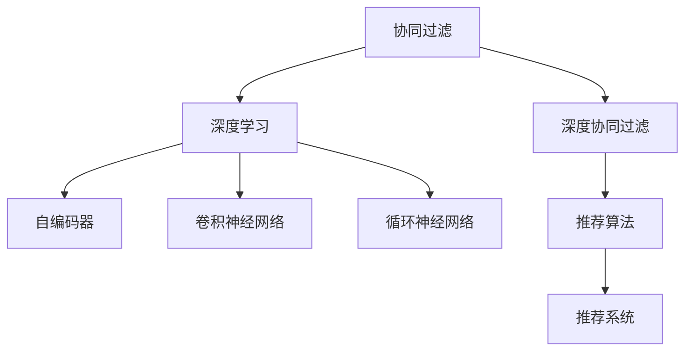

                 

## 1. 背景介绍

### 1.1 问题由来

随着互联网和电子商务的发展，推荐系统在提升用户体验、促进交易转化等方面发挥了重要作用。无论是电商网站的商品推荐、新闻APP的内容推荐，还是社交媒体的兴趣推荐，推荐系统无处不在。其核心目标在于利用用户历史行为数据，预测用户未来的兴趣和需求，并推荐最相关、最有吸引力的产品或内容。

推荐系统的发展经历了从基于规则、基于内容的简单算法，到基于协同过滤、深度学习等复杂模型的演变。然而，传统的推荐算法在面对用户冷启动、稀疏数据、长尾物品等问题时，往往难以提供满意的推荐效果。因此，近年来基于深度学习的推荐系统，特别是深度协同过滤算法，成为了研究的热点。

### 1.2 问题核心关键点

基于深度学习的推荐系统通常包括两个关键步骤：

1. **用户编码(Embedding)**：将用户行为转化为高维稠密向量表示，以便模型进行预测和相似性计算。
2. **物品编码(Embedding)**：同样将物品特征转化为高维稠密向量，以便与用户编码进行匹配。

用户和物品的编码过程通常采用深度神经网络模型，如自编码器、卷积神经网络、循环神经网络等。训练过程中，模型通过最大化预测准确率，学习到用户和物品的高维向量表示。

### 1.3 问题研究意义

推荐系统通过个性化推荐，改善了用户的购物体验，提高了商品转化率，是电商平台的生命线。对于媒体平台，通过推荐内容，增加用户黏性，提升活跃度和留存率。对于社交网络，推荐好友或群组，增加用户互动和参与度。

因此，研究高效、精准、可扩展的推荐算法，对于电商、新闻、社交等多个垂直领域具有重要意义。推荐系统的研究不仅能够带来商业价值，还能够在更广泛的领域推动技术创新，如智能城市、智能交通、健康医疗等。

## 2. 核心概念与联系

### 2.1 核心概念概述

为更好地理解基于深度学习的推荐系统，本节将介绍几个密切相关的核心概念：

- **协同过滤(Collaborative Filtering, CF)**：基于用户行为数据进行推荐的一种方法。通过计算用户与用户、物品与物品之间的相似性，进行协同过滤。
- **深度协同过滤(Deep Collaborative Filtering)**：采用深度神经网络对用户和物品进行编码，克服传统协同过滤方法的用户冷启动、稀疏数据等问题。
- **深度学习(Deep Learning)**：一种强大的机器学习方法，能够自动提取数据的深层次特征，广泛应用于图像、语音、文本等任务。
- **自编码器(Autencoder)**：一种无监督学习模型，通过将数据压缩成低维向量表示，再解码还原数据，能够学习到数据的高级特征。
- **卷积神经网络(Convolutional Neural Network, CNN)**：一种深度神经网络结构，适用于处理具有网格结构的数据，如图像、文本等。
- **循环神经网络(Recurrent Neural Network, RNN)**：一种处理序列数据的神经网络结构，适用于时间序列预测、文本生成等任务。

这些核心概念之间的逻辑关系可以通过以下Mermaid流程图来展示：



这个流程图展示了大语言模型的核心概念及其之间的关系：

1. 协同过滤作为基于用户行为数据的推荐方法，是推荐系统的重要组成部分。
2. 深度协同过滤利用深度神经网络对用户和物品进行编码，提高了推荐的精度和效果。
3. 深度学习是协同过滤和推荐算法的底层技术，为模型提供了强大的特征提取能力。
4. 自编码器、卷积神经网络、循环神经网络是深度学习中的常见模型，分别适用于不同类型的数据。

这些概念共同构成了深度推荐系统的学习和应用框架，使其能够在各种场景下发挥强大的推荐能力。通过理解这些核心概念，我们可以更好地把握深度推荐系统的原理和优化方向。

## 3. 核心算法原理 & 具体操作步骤
### 3.1 算法原理概述

基于深度学习的推荐系统，核心在于将用户行为和物品特征转化为高维向量表示，并基于这些向量进行相似性计算，从而生成推荐结果。

形式化地，假设用户集为 $U=\{u_1,u_2,\dots,u_n\}$，物品集为 $I=\{i_1,i_2,\dots,i_m\}$，用户-物品交互矩阵为 $R\in \mathbb{R}^{n\times m}$，其中 $R_{ij}=1$ 表示用户 $u_i$ 对物品 $i_j$ 进行了交互，否则为 $0$。推荐系统的目标是通过训练深度神经网络模型，学习用户编码 $e_u \in \mathbb{R}^d$ 和物品编码 $e_i \in \mathbb{R}^d$，使得模型能够预测用户对物品的评分 $r_{ui}=\hat{r}_{ui}$，即用户 $u_i$ 对物品 $i_j$ 的评分，从而生成推荐结果。

### 3.2 算法步骤详解

基于深度学习的推荐系统一般包括以下几个关键步骤：

**Step 1: 准备数据集和标签**

- 准备用户行为数据和物品特征数据，构建用户-物品交互矩阵 $R$。
- 设定评分预测任务，将评分矩阵 $R$ 转化为适合深度学习模型训练的样本-标签对。

**Step 2: 构建深度神经网络**

- 设计用户编码层和物品编码层，通常采用自编码器、CNN、RNN等深度模型。
- 定义损失函数，如均方误差、交叉熵等，用于衡量模型预测评分与真实评分之间的差异。
- 选择合适的优化算法，如Adam、SGD等，设置学习率、批大小等超参数。

**Step 3: 训练深度模型**

- 对用户和物品的编码层进行联合训练，最小化损失函数。
- 使用用户编码和物品编码计算相似性得分，生成推荐结果。

**Step 4: 评估和调优**

- 在验证集上评估模型性能，通过交叉验证、参数调优等手段优化模型。
- 测试模型在测试集上的表现，并生成推荐结果。

### 3.3 算法优缺点

基于深度学习的推荐系统具有以下优点：

1. 能够处理大量稀疏数据和非结构化数据，如用户评分、评论等文本信息。
2. 利用深度模型学习用户和物品的高级特征，提高推荐的精度和泛化能力。
3. 通过联合训练用户和物品的编码，解决了用户冷启动和长尾物品问题。
4. 支持在线预测，能够实时生成推荐结果，提升用户体验。

同时，该方法也存在一些局限性：

1. 对标注数据依赖较大，需要用户对物品评分。
2. 计算成本高，深度模型需要大量的计算资源和存储资源。
3. 容易过拟合，尤其是在小规模数据集上，需要精心设计模型结构和超参数。
4. 模型可解释性差，难以理解内部决策机制。
5. 需要动态更新模型参数，否则难以应对用户行为的变化。

尽管存在这些局限性，但基于深度学习的推荐系统已经在电商、新闻、视频等多个领域得到了广泛应用，成为推荐系统的主流技术。未来相关研究的重点在于如何进一步降低计算成本，提高模型的泛化能力和可解释性，同时兼顾实时性和用户行为动态性。

### 3.4 算法应用领域

基于深度学习的推荐系统在电子商务、在线广告、新闻媒体、社交网络等众多领域得到了广泛应用，具体包括：

1. 电商平台：如亚马逊、京东等，利用推荐系统为每个用户生成个性化商品推荐，提升购物体验和转化率。
2. 新闻APP：如今日头条、腾讯新闻等，通过推荐用户感兴趣的新闻内容，增加用户黏性和活跃度。
3. 视频平台：如优酷、爱奇艺等，推荐用户喜爱的视频内容，提高平台的用户满意度和留存率。
4. 社交网络：如微信、微博等，推荐用户感兴趣的朋友和群组，增加用户互动和参与度。
5. 智能家居：如Google Home、Amazon Echo等，根据用户的语音指令，推荐最相关的智能设备，提升生活便利性。
6. 在线教育：如Coursera、Udemy等，推荐用户感兴趣的学习资源，提升学习效率和满意度。

除了上述这些经典应用外，深度推荐系统还在智能城市、智能交通、健康医疗等新兴领域发挥重要作用，如智能交通系统根据用户偏好推荐最优出行路线，智能家居系统根据用户习惯推荐最优设备调节方案，智能医疗系统根据用户历史数据推荐最优诊疗方案等。

## 4. 数学模型和公式 & 详细讲解 & 举例说明
### 4.1 数学模型构建

本节将使用数学语言对基于深度学习的推荐系统进行更加严格的刻画。

假设用户编码为 $e_u \in \mathbb{R}^d$，物品编码为 $e_i \in \mathbb{R}^d$，用户对物品的评分预测为 $r_{ui}=\hat{r}_{ui}$。设用户行为矩阵 $R\in \mathbb{R}^{n\times m}$，其中 $R_{ij}=1$ 表示用户 $u_i$ 对物品 $i_j$ 进行了评分，否则为 $0$。

定义损失函数为：

$$
\mathcal{L}(e_u,e_i) = \frac{1}{N}\sum_{i=1}^N\sum_{j=1}^M \ell(r_{ui},\hat{r}_{ui})
$$

其中 $\ell$ 为评分预测模型的损失函数，如均方误差损失：

$$
\ell(r_{ui},\hat{r}_{ui}) = (r_{ui}-\hat{r}_{ui})^2
$$

### 4.2 公式推导过程

以下我们以基于用户编码和物品编码的协同过滤方法为例，推导深度推荐系统的公式。

首先，假设用户行为矩阵 $R\in \mathbb{R}^{n\times m}$，用户编码为 $e_u \in \mathbb{R}^d$，物品编码为 $e_i \in \mathbb{R}^d$。用户 $u_i$ 对物品 $i_j$ 的评分预测为：

$$
\hat{r}_{ui} = \langle e_u, e_i \rangle
$$

其中 $\langle \cdot, \cdot \rangle$ 表示向量点积。

通过上述公式，推荐系统能够根据用户编码和物品编码，计算相似性得分，生成推荐结果。然而，实际应用中，用户和物品的编码通常采用深度神经网络模型，需要在大量标注数据上进行训练。

### 4.3 案例分析与讲解

以基于用户编码和物品编码的协同过滤为例，使用PyTorch库实现推荐系统。

首先，定义推荐系统类 `Recommender`：

```python
import torch
import torch.nn as nn
import torch.nn.functional as F
from torch.autograd import Variable

class Recommender(nn.Module):
    def __init__(self, user_dim, item_dim, hidden_dim, latent_factors):
        super(Recommender, self).__init__()
        self.user_dim = user_dim
        self.item_dim = item_dim
        self.hidden_dim = hidden_dim
        self.latent_factors = latent_factors
        
        self.user_encoder = nn.Embedding(user_dim, hidden_dim)
        self.item_encoder = nn.Embedding(item_dim, hidden_dim)
        self.score_predictor = nn.Linear(hidden_dim * 2, latent_factors)
        
    def forward(self, user_ids, item_ids):
        user_vector = self.user_encoder(user_ids)
        item_vector = self.item_encoder(item_ids)
        score_vector = self.score_predictor(torch.cat((user_vector, item_vector), dim=1))
        return F.relu(score_vector)
```

然后，实现评分预测函数：

```python
def predict_ratings(model, user_ids, item_ids, latent_factors):
    user_vector = user_ids.long()
    item_vector = item_ids.long()
    score = model(user_vector, item_vector)
    rating = score.view(-1, latent_factors) * user_vector.unsqueeze(1)
    rating = rating.sum(dim=1) / latent_factors
    return rating
```

最后，在训练时，使用交叉熵损失进行优化：

```python
def train_model(model, user_ids, item_ids, ratings, batch_size=256, num_epochs=10):
    optimizer = torch.optim.Adam(model.parameters(), lr=0.001)
    criterion = nn.CrossEntropyLoss()
    
    for epoch in range(num_epochs):
        for batch_id in range(0, len(user_ids), batch_size):
            user_batch = user_ids[batch_id:batch_id+batch_size]
            item_batch = item_ids[batch_id:batch_id+batch_size]
            rating_batch = ratings[batch_id:batch_id+batch_size]
            user_vector = model.user_encoder(user_batch)
            item_vector = model.item_encoder(item_batch)
            score = model.score_predictor(torch.cat((user_vector, item_vector), dim=1))
            score = score.view(-1, latent_factors)
            rating = score.view(-1, latent_factors) * user_vector.unsqueeze(1)
            rating = rating.sum(dim=1) / latent_factors
            optimizer.zero_grad()
            loss = criterion(rating, rating_batch)
            loss.backward()
            optimizer.step()
```

通过上述代码，即可使用PyTorch实现一个基于用户编码和物品编码的协同过滤推荐系统。训练时，模型通过最大化交叉熵损失，学习用户编码和物品编码，从而生成评分预测。测试时，使用评分预测函数计算相似性得分，生成推荐结果。

## 5. 项目实践：代码实例和详细解释说明
### 5.1 开发环境搭建

在进行推荐系统开发前，我们需要准备好开发环境。以下是使用Python进行PyTorch开发的环境配置流程：

1. 安装Anaconda：从官网下载并安装Anaconda，用于创建独立的Python环境。

2. 创建并激活虚拟环境：
```bash
conda create -n pytorch-env python=3.8 
conda activate pytorch-env
```

3. 安装PyTorch：根据CUDA版本，从官网获取对应的安装命令。例如：
```bash
conda install pytorch torchvision torchaudio cudatoolkit=11.1 -c pytorch -c conda-forge
```

4. 安装TensorFlow：从官网下载并安装TensorFlow，用于深度学习模型的测试和验证。

5. 安装各类工具包：
```bash
pip install numpy pandas scikit-learn matplotlib tqdm jupyter notebook ipython
```

完成上述步骤后，即可在`pytorch-env`环境中开始推荐系统开发。

### 5.2 源代码详细实现

下面以电商商品推荐为例，给出使用PyTorch库实现推荐系统的代码实现。

首先，定义商品评分数据集：

```python
from torch.utils.data import Dataset
import numpy as np

class MovieLensDataset(Dataset):
    def __init__(self, ratings, user_dim, item_dim, latent_factors):
        self.ratings = ratings
        self.user_dim = user_dim
        self.item_dim = item_dim
        self.latent_factors = latent_factors
        
    def __len__(self):
        return len(self.ratings)
    
    def __getitem__(self, idx):
        user_id, item_id, rating = self.ratings[idx]
        user_vector = torch.tensor(user_id, dtype=torch.long)
        item_vector = torch.tensor(item_id, dtype=torch.long)
        return user_vector, item_vector, rating
```

然后，实现推荐系统类 `Recommender`：

```python
import torch
import torch.nn as nn
import torch.nn.functional as F
from torch.autograd import Variable

class Recommender(nn.Module):
    def __init__(self, user_dim, item_dim, hidden_dim, latent_factors):
        super(Recommender, self).__init__()
        self.user_dim = user_dim
        self.item_dim = item_dim
        self.hidden_dim = hidden_dim
        self.latent_factors = latent_factors
        
        self.user_encoder = nn.Embedding(user_dim, hidden_dim)
        self.item_encoder = nn.Embedding(item_dim, hidden_dim)
        self.score_predictor = nn.Linear(hidden_dim * 2, latent_factors)
        
    def forward(self, user_ids, item_ids):
        user_vector = self.user_encoder(user_ids)
        item_vector = self.item_encoder(item_ids)
        score_vector = self.score_predictor(torch.cat((user_vector, item_vector), dim=1))
        return F.relu(score_vector)
```

接着，实现评分预测函数：

```python
def predict_ratings(model, user_ids, item_ids, latent_factors):
    user_vector = user_ids.long()
    item_vector = item_ids.long()
    score = model(user_vector, item_vector)
    rating = score.view(-1, latent_factors) * user_vector.unsqueeze(1)
    rating = rating.sum(dim=1) / latent_factors
    return rating
```

最后，实现训练函数：

```python
def train_model(model, dataset, batch_size=256, num_epochs=10):
    optimizer = torch.optim.Adam(model.parameters(), lr=0.001)
    criterion = nn.CrossEntropyLoss()
    
    for epoch in range(num_epochs):
        for batch_id in range(0, len(dataset), batch_size):
            user_batch = dataset[batch_id:batch_id+batch_size][0]
            item_batch = dataset[batch_id:batch_id+batch_size][1]
            rating_batch = dataset[batch_id:batch_id+batch_size][2]
            user_vector = model.user_encoder(user_batch)
            item_vector = model.item_encoder(item_batch)
            score = model.score_predictor(torch.cat((user_vector, item_vector), dim=1))
            score = score.view(-1, latent_factors)
            rating = score.view(-1, latent_factors) * user_vector.unsqueeze(1)
            rating = rating.sum(dim=1) / latent_factors
            optimizer.zero_grad()
            loss = criterion(rating, rating_batch)
            loss.backward()
            optimizer.step()
```

通过上述代码，即可使用PyTorch实现一个基于用户编码和物品编码的协同过滤推荐系统。训练时，模型通过最大化交叉熵损失，学习用户编码和物品编码，从而生成评分预测。测试时，使用评分预测函数计算相似性得分，生成推荐结果。

### 5.3 代码解读与分析

让我们再详细解读一下关键代码的实现细节：

**MovieLensDataset类**：
- `__init__`方法：初始化评分数据集，设定用户维度、物品维度和隐层因子数。
- `__len__`方法：返回数据集的样本数量。
- `__getitem__`方法：对单个样本进行处理，将用户ID、物品ID和评分转化为Tensor格式，供模型训练。

**Recommender类**：
- `__init__`方法：初始化推荐系统，设定用户维度、物品维度、隐层维度和隐层因子数。
- `forward`方法：定义模型的前向传播过程，通过用户编码和物品编码计算相似性得分，输出评分预测。

**train_model函数**：
- 实现模型的训练过程，使用交叉熵损失优化模型参数。
- 在训练时，使用小批量数据进行迭代更新，逐步优化模型。

可以看到，PyTorch的实现非常简洁高效，开发者可以专注于模型设计和优化，而不必过多关注底层的实现细节。

当然，工业级的系统实现还需考虑更多因素，如模型的保存和部署、超参数的自动搜索、更灵活的任务适配层等。但核心的推荐系统开发流程基本与此类似。

## 6. 实际应用场景
### 6.1 智能推荐引擎

智能推荐引擎在电商、新闻、视频等多个领域得到了广泛应用。智能推荐系统通过分析用户历史行为数据，生成个性化推荐，提升用户体验和满意度。

例如，在电商平台上，智能推荐系统能够根据用户浏览、点击、购买等行为数据，推荐最相关的商品，提高商品转化率和销售业绩。在新闻APP上，通过推荐用户感兴趣的新闻内容，增加用户黏性和活跃度。在视频平台上，推荐用户喜爱的视频内容，提升平台的用户满意度和留存率。

### 6.2 个性化推荐系统

个性化推荐系统能够根据用户兴趣和行为，推荐最适合的产品或内容。基于深度学习的推荐系统，通过学习用户和物品的高维向量表示，计算相似性得分，生成推荐结果。

例如，在视频推荐系统中，通过分析用户观看历史和评分数据，推荐用户感兴趣的视频内容。在音乐推荐系统中，根据用户听歌历史和评分，推荐最受欢迎的音乐作品。在新闻推荐系统中，根据用户阅读历史和兴趣标签，推荐最新、最相关的新闻资讯。

### 6.3 金融风险管理

推荐系统不仅应用于消费领域，还可以应用于金融风险管理。通过分析用户交易行为和风险偏好，推荐最合适的金融产品，降低用户财务风险。

例如，在银行理财系统中，根据用户的收入、支出和资产状况，推荐最适合的理财产品。在保险公司，根据用户的健康状况和风险偏好，推荐最合适的保险产品。在证券公司，根据用户的交易历史和风险承受能力，推荐最合适的股票和基金。

### 6.4 未来应用展望

随着深度学习技术的不断进步，推荐系统将呈现以下发展趋势：

1. **跨领域推荐**：推荐系统将不仅仅关注单一领域的用户需求，而是融合多种数据源，进行跨领域的推荐。例如，结合电商和新闻推荐，为用户提供全面的个性化服务。
2. **实时推荐**：推荐系统将支持实时预测和推荐，能够根据用户行为实时调整推荐结果，提升用户体验。
3. **多模态推荐**：推荐系统将结合多种模态数据，如文本、图像、视频等，提供更加全面、准确的推荐结果。例如，结合商品图片和描述，推荐最适合的图片产品。
4. **个性化推荐**：推荐系统将利用用户的多样化需求，提供个性化、定制化的推荐服务。例如，根据用户的偏好和行为，推荐个性化的内容和服务。
5. **社交推荐**：推荐系统将融合社交网络信息，推荐最相关的社交好友、群组和话题。例如，根据用户的朋友和群组，推荐相关的社交内容。

以上趋势凸显了深度推荐系统的广阔前景。这些方向的探索发展，必将进一步提升推荐系统的性能和应用范围，为电商、新闻、金融等多个垂直领域带来更大的价值。

## 7. 工具和资源推荐
### 7.1 学习资源推荐

为了帮助开发者系统掌握推荐系统的理论基础和实践技巧，这里推荐一些优质的学习资源：

1. 《推荐系统实战》书籍：由李航、李翔等人撰写，系统介绍了推荐系统的原理、算法和应用，适合实战开发。
2. CS 473《信息检索》课程：斯坦福大学开设的推荐系统课程，提供了理论框架和实践案例，帮助理解推荐系统的核心思想。
3. Kaggle推荐系统竞赛：Kaggle平台上的推荐系统竞赛，提供了丰富的数据集和模型评估工具，是实战学习的极佳选择。
4. Yelp推荐系统论文：Yelp平台上的推荐系统论文，详细介绍了推荐算法的实现和优化，具有较高的参考价值。
5. Microsoft推荐系统论文：Microsoft推荐系统论文，提供了多种推荐算法和模型评估指标，适合深入研究。

通过对这些资源的学习实践，相信你一定能够快速掌握推荐系统的精髓，并用于解决实际的推荐问题。

### 7.2 开发工具推荐

高效的开发离不开优秀的工具支持。以下是几款用于推荐系统开发的常用工具：

1. PyTorch：基于Python的开源深度学习框架，灵活动态的计算图，适合快速迭代研究。推荐系统中的深度学习模型通常使用PyTorch实现。
2. TensorFlow：由Google主导开发的开源深度学习框架，生产部署方便，适合大规模工程应用。推荐系统中的深度学习模型也可以使用TensorFlow实现。
3. Scikit-learn：Python中的机器学习库，提供了多种常用的推荐算法和模型评估指标，适合快速原型开发。
4. Spark：Apache Spark的机器学习库，支持分布式计算，适合大数据推荐系统的开发。
5. Elasticsearch：基于Lucene的开源搜索引擎，支持高效的文本查询和推荐，适合推荐系统的推荐引擎部署。
6. Redis：基于内存的NoSQL数据库，支持高速推荐系统的数据缓存和计算。

合理利用这些工具，可以显著提升推荐系统的开发效率，加快创新迭代的步伐。

### 7.3 相关论文推荐

推荐系统的发展源于学界的持续研究。以下是几篇奠基性的相关论文，推荐阅读：

1. Factorization Machines for Recommender Systems：提出了基于矩阵分解的推荐算法，用于处理稀疏矩阵。
2. Deep Matrix Factorization：利用深度神经网络对用户和物品进行编码，提高了推荐的精度和泛化能力。
3. Neural Collaborative Filtering：使用神经网络进行协同过滤，解决了传统方法的用户冷启动问题。
4. Deep Factorized Matrix Approximation：通过深度学习实现矩阵分解，提高了模型的表达能力和泛化能力。
5. Learning Deep Architectures for Latent Variable Models：提出了一种深度隐变量模型，用于生成推荐系统的隐层表示。

这些论文代表了大推荐系统的发展脉络。通过学习这些前沿成果，可以帮助研究者把握学科前进方向，激发更多的创新灵感。

## 8. 总结：未来发展趋势与挑战

### 8.1 总结

本文对基于深度学习的推荐系统进行了全面系统的介绍。首先阐述了推荐系统的发展背景和意义，明确了推荐系统在电商、新闻、金融等多个领域的应用价值。其次，从原理到实践，详细讲解了推荐系统的核心算法和模型设计，给出了推荐系统开发的完整代码实例。同时，本文还广泛探讨了推荐系统在实际应用中的多种场景和未来发展方向，展示了推荐系统技术的广阔前景。

通过本文的系统梳理，可以看到，基于深度学习的推荐系统已经成为推荐领域的重要范式，极大地拓展了推荐系统的应用边界，带来了显著的商业价值。未来，伴随深度学习技术的不断演进，推荐系统必将在更多领域得到应用，进一步推动技术创新和商业进步。

### 8.2 未来发展趋势

推荐系统的发展将呈现以下几个趋势：

1. **跨领域推荐**：推荐系统将不仅仅关注单一领域的用户需求，而是融合多种数据源，进行跨领域的推荐。例如，结合电商和新闻推荐，为用户提供全面的个性化服务。
2. **实时推荐**：推荐系统将支持实时预测和推荐，能够根据用户行为实时调整推荐结果，提升用户体验。
3. **多模态推荐**：推荐系统将结合多种模态数据，如文本、图像、视频等，提供更加全面、准确的推荐结果。例如，结合商品图片和描述，推荐最适合的图片产品。
4. **个性化推荐**：推荐系统将利用用户的多样化需求，提供个性化、定制化的推荐服务。例如，根据用户的偏好和行为，推荐个性化的内容和服务。
5. **社交推荐**：推荐系统将融合社交网络信息，推荐最相关的社交好友、群组和话题。例如，根据用户的朋友和群组，推荐相关的社交内容。
6. **动态推荐**：推荐系统将支持动态更新和优化，能够根据用户行为实时调整推荐结果，提升推荐精度。

以上趋势凸显了深度推荐系统的广阔前景。这些方向的探索发展，必将进一步提升推荐系统的性能和应用范围，为电商、新闻、金融等多个垂直领域带来更大的价值。

### 8.3 面临的挑战

尽管深度推荐系统已经在电商、新闻、金融等多个领域得到了广泛应用，但在迈向更加智能化、普适化应用的过程中，它仍面临着诸多挑战：

1. **数据隐私问题**：推荐系统需要大量的用户行为数据，如何保护用户隐私、避免数据泄露，成为重要问题。需要采用差分隐私、联邦学习等技术，保护用户数据安全。
2. **模型可解释性**：推荐系统中的深度模型往往缺乏可解释性，难以理解内部决策机制。如何增强模型的可解释性，提升用户信任，是重要的研究方向。
3. **计算成本高**：深度推荐系统需要大量的计算资源和存储资源，如何降低计算成本，提高模型的实时性和可扩展性，是重要的研究课题。
4. **用户行为变化**：用户行为和兴趣可能随时间变化，如何动态更新模型参数，保持推荐系统的适应性，是重要的优化方向。
5. **推荐公平性**：推荐系统可能存在性别偏见、种族偏见等，如何消除模型偏见，保障推荐公平性，是重要的伦理问题。
6. **数据分布不均**：推荐系统需要处理大量稀疏数据和非结构化数据，如何应对数据分布不均，提高推荐系统的泛化能力，是重要的研究课题。

尽管存在这些挑战，但深度推荐系统已经在电商、新闻、金融等多个领域得到了广泛应用，成为推荐系统的主流技术。未来相关研究的重点在于如何进一步降低计算成本，提高模型的泛化能力和可解释性，同时兼顾实时性和用户行为动态性。

### 8.4 研究展望

面对深度推荐系统所面临的诸多挑战，未来的研究需要在以下几个方面寻求新的突破：

1. **跨领域推荐**：结合多种数据源，进行跨领域的推荐，提升推荐系统的多样性和准确性。
2. **实时推荐**：支持实时预测和推荐，能够根据用户行为实时调整推荐结果，提升用户体验。
3. **多模态推荐**：结合多种模态数据，如文本、图像、视频等，提供更加全面、准确的推荐结果。
4. **个性化推荐**：利用用户的多样化需求，提供个性化、定制化的推荐服务。
5. **社交推荐**：融合社交网络信息，推荐最相关的社交好友、群组和话题。
6. **动态推荐**：支持动态更新和优化，能够根据用户行为实时调整推荐结果，提升推荐精度。

这些研究方向的探索，必将引领深度推荐系统技术迈向更高的台阶，为电商、新闻、金融等多个垂直领域带来更大的价值。

## 9. 附录：常见问题与解答

**Q1：推荐系统是否适用于所有电商场景？**

A: 推荐系统在电商场景中具有重要应用价值，能够提高用户转化率和购物体验。但对于一些特定电商场景，如二手商品交易、艺术品收藏等，推荐系统可能难以发挥其优势。此时需要在特定领域进行定制化开发，才能获得理想的效果。

**Q2：推荐系统如何应对用户行为变化？**

A: 推荐系统需要根据用户行为实时调整推荐结果，以应对用户行为变化。常见的策略包括：
1. 实时更新推荐模型，定期重新训练模型，获取最新的用户行为数据。
2. 引入在线学习算法，如AdaGrad、Adam等，动态更新模型参数，提升模型的实时适应性。
3. 结合时间序列预测技术，根据用户行为的变化趋势，调整推荐策略。

**Q3：推荐系统如何保护用户隐私？**

A: 推荐系统需要保护用户隐私，避免数据泄露。常见的策略包括：
1. 采用差分隐私技术，对用户数据进行噪声添加，保护用户隐私。
2. 采用联邦学习技术，在本地设备上训练推荐模型，避免数据上传至云端。
3. 采用隐私保护算法，如基于同态加密的推荐算法，在数据加密情况下进行推荐。

**Q4：推荐系统如何提高模型可解释性？**

A: 推荐系统中的深度模型往往缺乏可解释性，难以理解内部决策机制。常见的策略包括：
1. 引入可解释性算法，如LIME、SHAP等，分析模型的局部解释，解释模型的预测结果。
2. 采用特征重要性分析，分析模型中各个特征的贡献度，提升模型的可解释性。
3. 引入领域专家知识，结合专家经验和数据，进行推荐系统的优化。

**Q5：推荐系统如何应对数据分布不均？**

A: 推荐系统需要应对大量稀疏数据和非结构化数据，如何应对数据分布不均，提高推荐系统的泛化能力，是重要的研究课题。常见的策略包括：
1. 引入多任务学习，结合多个推荐任务，提高模型的泛化能力。
2. 引入对抗学习，通过对抗训练提高模型的鲁棒性和泛化能力。
3. 引入迁移学习，在多个领域进行推荐系统的迁移学习，提升模型的泛化能力。

这些研究方向的探索，必将引领深度推荐系统技术迈向更高的台阶，为电商、新闻、金融等多个垂直领域带来更大的价值。

---

作者：禅与计算机程序设计艺术 / Zen and the Art of Computer Programming

