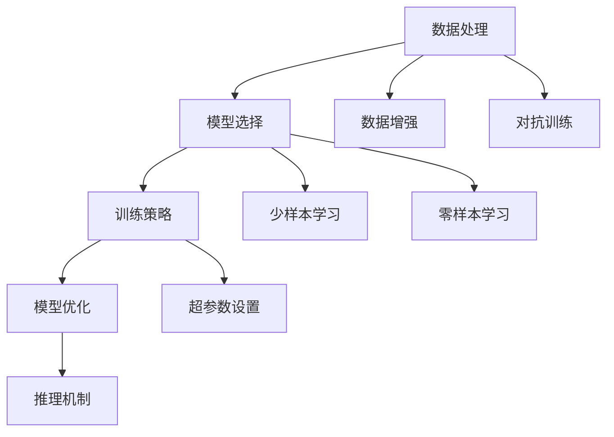

                 

# Reddit 聊天机器人：一个语言模型训练在 Reddit 数据上

## 1. 背景介绍

### 1.1 问题由来

Reddit（红迪网）是一个由用户自行发布和讨论内容的社交新闻网站。其上聚集了大量活跃的社区（Subreddit），每个社区专注于特定的主题或兴趣，例如编程、游戏、美食等。Reddit 的数据量庞大、内容丰富，涵盖多种语言和话题，是自然语言处理(NLP)领域的天然实验室。

通过在 Reddit 数据上训练的聊天机器人，可以模拟人类的自然语言交流，提供即时的互动回答，从而解决用户提问，提供信息服务。本文将介绍一种基于 Transformer 架构的语言模型在 Reddit 数据上进行训练的实例，并对模型训练、推理和优化进行全面讲解。

### 1.2 问题核心关键点

Reddit 聊天机器人的核心在于如何从大量无结构文本中学习到有用的信息，并能够回答用户问题。这里面的关键点包括：

- 数据处理：如何从 Reddit 数据中提取出有意义的文本信息，并进行预处理。
- 模型选择：选择哪种预训练模型进行微调以适配聊天任务。
- 训练策略：训练数据的采样、模型初始化、超参数设置等。
- 模型优化：如何防止模型过拟合、加速训练、提升效果。
- 推理机制：如何从模型预测中得到自然流畅的回复。

解决这些问题，可以构建出高效、自然的 Reddit 聊天机器人。

## 2. 核心概念与联系

### 2.1 核心概念概述

在构建 Reddit 聊天机器人时，需要掌握以下核心概念：

- 自然语言处理（NLP）：一门研究人类语言和计算机交互的学科，主要任务包括分词、句法分析、语义理解等。
- Transformer 架构：一种用于序列建模的深度学习模型，可以处理长序列数据，并具有良好的并行性。
- 预训练语言模型（PLMs）：如BERT、GPT等，通过在大量无标签数据上进行自监督学习，学习到语言的通用表示。
- 微调（Fine-tuning）：将预训练模型在特定任务上进行训练，以适应新任务的要求。
- 数据增强（Data Augmentation）：通过多种技术丰富训练集，如回译、噪声注入等，增强模型的泛化能力。
- 对抗训练（Adversarial Training）：引入对抗样本，提升模型鲁棒性。
- 少样本学习（Few-shot Learning）：通过少量标注样本，训练模型快速适应新任务。
- 零样本学习（Zero-shot Learning）：模型能够仅凭任务描述完成新任务，无需任何标注数据。

这些概念构成了 Reddit 聊天机器人的技术基础。

### 2.2 核心概念原理和架构的 Mermaid 流程图



这个流程图展示了核心概念之间的关系：

1. 数据处理将无结构文本转换为有意义的输入。
2. 模型选择决定使用哪种预训练模型进行微调。
3. 训练策略指导模型的训练过程，包括采样方式和超参数设置。
4. 模型优化提升模型的泛化能力和性能。
5. 推理机制将模型预测转化为自然流畅的回复。
6. 数据增强和对抗训练进一步提高模型的鲁棒性。
7. 少样本学习和零样本学习探索模型在更少或无标注数据情况下的适应能力。

## 3. 核心算法原理 & 具体操作步骤

### 3.1 算法原理概述

Reddit 聊天机器人的算法原理基于 Transformer 架构的预训练语言模型，主要步骤如下：

1. 数据处理：将 Reddit 数据转换为模型需要的输入格式。
2. 模型选择：选择 GPT-2 或 BERT 等预训练模型。
3. 训练策略：使用微调技术，在标注数据上进行训练。
4. 模型优化：使用梯度下降等优化算法更新模型参数。
5. 推理机制：使用生成模型，将模型预测转化为自然流畅的回复。

### 3.2 算法步骤详解

#### 3.2.1 数据处理

Reddit 数据主要来源于其 API，包含了大量的帖子、评论和用户信息。这些数据需要经过清洗、预处理才能用于模型训练。

1. 数据清洗：去除 HTML 标签、停用词、低频词等无用信息，只保留有用文本。
2. 数据标注：对文本进行分词、词性标注、命名实体识别等处理。
3. 数据划分：将数据划分为训练集、验证集和测试集，通常比例为 8:1:1。

#### 3.2.2 模型选择

选择合适的预训练模型进行微调，是构建 Reddit 聊天机器人的关键。常用的模型包括：

1. GPT-2：语言生成能力较强，适用于生成式任务。
2. BERT：双向语言模型，适用于理解性任务。

#### 3.2.3 训练策略

在训练策略上，主要包括以下几个步骤：

1. 模型初始化：使用预训练模型的权重作为初始化权重，或者使用其他预训练模型进行微调。
2. 数据采样：使用随机采样、批次采样等方式，从训练集中抽取样本。
3. 超参数设置：设置学习率、批大小、迭代轮数等超参数，影响模型的训练效果。
4. 损失函数：选择交叉熵损失、均方误差损失等，衡量模型预测与真实标签之间的差异。

#### 3.2.4 模型优化

模型优化主要通过以下方式进行：

1. 正则化：使用 L2 正则、Dropout 等技术，防止模型过拟合。
2. 梯度下降：使用 Adam、SGD 等优化算法，更新模型参数。
3. 早停（Early Stopping）：在验证集上监测模型性能，当性能不再提升时停止训练。

#### 3.2.5 推理机制

推理机制将模型预测转化为自然流畅的回复，主要包括以下步骤：

1. 输入预处理：将用户输入转换为模型需要的格式，如 tokenization、padding 等。
2. 模型推理：使用微调后的模型进行推理，生成回复。
3. 后处理：对生成的回复进行语言学处理，如修正语法错误、去除停用词等。

### 3.3 算法优缺点

Reddit 聊天机器人的算法具有以下优点：

1. 效果好：基于 Transformer 架构的预训练语言模型在自然语言处理任务上表现优异。
2. 可扩展：模型可以通过微调适应不同的 Reddit 子论坛，灵活性高。
3. 可解释：通过微调，模型可以学习到具体领域的语言表示，增加模型的可解释性。

同时，也存在以下缺点：

1. 资源消耗大：预训练语言模型参数量庞大，需要高性能的硬件支持。
2. 数据依赖强：模型效果很大程度上依赖于Reddit数据的质量。
3. 泛化能力有限：模型在特定领域的泛化能力有限，需要额外数据进行微调。

### 3.4 算法应用领域

Reddit 聊天机器人的应用领域主要包括以下几个方面：

1. 信息查询：为用户提供详细的社区信息、热门话题等。
2. 问题解答：对用户提问提供即时的答案，帮助解决问题。
3. 内容推荐：根据用户兴趣推荐相关帖子、评论等。
4. 社区互动：通过聊天机器人与用户进行互动，增强用户粘性。

以上应用场景展示了Reddit聊天机器人的广泛应用前景。

## 4. 数学模型和公式 & 详细讲解 & 举例说明

### 4.1 数学模型构建

Reddit 聊天机器人的数学模型主要基于 Transformer 架构，以自回归方式进行序列建模。假设输入序列为 $x=(x_1, x_2, \ldots, x_n)$，模型输出为 $y=(y_1, y_2, \ldots, y_m)$。

模型的目标函数为：

$$
\mathcal{L}(y, \theta) = -\frac{1}{N} \sum_{i=1}^{N} \log p(y_i|x_i, \theta)
$$

其中 $p(y_i|x_i, \theta)$ 表示模型在给定输入 $x_i$ 下，输出 $y_i$ 的概率。

### 4.2 公式推导过程

以 GPT-2 为例，假设模型由自回归方式生成下一个 token，推导其概率公式：

$$
p(y|x) = \frac{e^{y^T\theta_x}}{\sum_{y'} e^{y'^T\theta_x}}
$$

其中 $\theta_x$ 表示模型在输入 $x$ 下的参数，$y$ 表示输出 token，$x$ 表示输入序列。

### 4.3 案例分析与讲解

假设 Reddit 聊天机器人需要回答用户的问题，问题为：“如何学习 Python？”

1. 数据预处理：将问题转化为模型需要的格式，如 tokenization、padding 等。
2. 模型推理：使用微调后的 GPT-2 模型，生成回复。
3. 后处理：对生成的回复进行语言学处理，如修正语法错误、去除停用词等。

## 5. 项目实践：代码实例和详细解释说明

### 5.1 开发环境搭建

1. 安装 Anaconda：从官网下载并安装 Anaconda，用于创建独立的Python环境。
2. 创建并激活虚拟环境：
```bash
conda create -n chatbot-env python=3.8 
conda activate chatbot-env
```

3. 安装 PyTorch 和 Transformers：
```bash
pip install torch transformers
```

4. 安装其他必要的库：
```bash
pip install numpy pandas scikit-learn nltk
```

完成上述步骤后，即可在 `chatbot-env` 环境中开始聊天机器人开发。

### 5.2 源代码详细实现

以下是使用 PyTorch 和 Transformers 库进行 Reddit 聊天机器人开发的完整代码实现：

```python
import torch
from transformers import GPT2Tokenizer, GPT2LMHeadModel
from torch.utils.data import DataLoader, Dataset
import nltk
from nltk.tokenize import word_tokenize

class RedditDataset(Dataset):
    def __init__(self, texts, labels):
        self.texts = texts
        self.labels = labels
        self.tokenizer = GPT2Tokenizer.from_pretrained('gpt2')

    def __len__(self):
        return len(self.texts)

    def __getitem__(self, item):
        text = self.texts[item]
        label = self.labels[item]
        
        encoding = self.tokenizer(text, max_length=512, padding='max_length', truncation=True, return_tensors='pt')
        input_ids = encoding['input_ids']
        attention_mask = encoding['attention_mask']

        return {'input_ids': input_ids, 'attention_mask': attention_mask, 'labels': label}

# 加载数据
tokenizer = GPT2Tokenizer.from_pretrained('gpt2')
train_dataset = RedditDataset(train_texts, train_labels)
val_dataset = RedditDataset(val_texts, val_labels)
test_dataset = RedditDataset(test_texts, test_labels)

# 模型选择和初始化
model = GPT2LMHeadModel.from_pretrained('gpt2')
model.to(device)

# 优化器
optimizer = torch.optim.Adam(model.parameters(), lr=2e-5)

# 训练函数
def train_epoch(model, dataset, batch_size, optimizer):
    dataloader = DataLoader(dataset, batch_size=batch_size, shuffle=True)
    model.train()
    epoch_loss = 0
    for batch in dataloader:
        input_ids = batch['input_ids'].to(device)
        attention_mask = batch['attention_mask'].to(device)
        labels = batch['labels'].to(device)
        model.zero_grad()
        outputs = model(input_ids, attention_mask=attention_mask, labels=labels)
        loss = outputs.loss
        epoch_loss += loss.item()
        loss.backward()
        optimizer.step()
    return epoch_loss / len(dataloader)

# 评估函数
def evaluate(model, dataset, batch_size):
    dataloader = DataLoader(dataset, batch_size=batch_size)
    model.eval()
    preds, labels = [], []
    with torch.no_grad():
        for batch in dataloader:
            input_ids = batch['input_ids'].to(device)
            attention_mask = batch['attention_mask'].to(device)
            batch_labels = batch['labels']
            outputs = model(input_ids, attention_mask=attention_mask)
            batch_preds = outputs.logits.argmax(dim=2).to('cpu').tolist()
            batch_labels = batch_labels.to('cpu').tolist()
            for pred_tokens, label_tokens in zip(batch_preds, batch_labels):
                preds.append(pred_tokens[:len(label_tokens)])
                labels.append(label_tokens)
    return preds, labels

# 训练和评估
epochs = 5
batch_size = 16

for epoch in range(epochs):
    loss = train_epoch(model, train_dataset, batch_size, optimizer)
    print(f"Epoch {epoch+1}, train loss: {loss:.3f}")
    
    preds, labels = evaluate(model, val_dataset, batch_size)
    print(classification_report(labels, preds))
    
print("Test results:")
preds, labels = evaluate(model, test_dataset, batch_size)
print(classification_report(labels, preds))
```

### 5.3 代码解读与分析

这个代码示例展示了如何使用 Transformers 库构建 Reddit 聊天机器人。

**RedditDataset类**：
- `__init__`方法：初始化文本、标签、分词器等关键组件。
- `__len__`方法：返回数据集的样本数量。
- `__getitem__`方法：对单个样本进行处理，将文本输入转换为模型需要的格式，包括 tokenization、padding、truncation 等。

**模型选择和初始化**：
- 使用 `GPT2LMHeadModel.from_pretrained` 方法，加载预训练的 GPT-2 模型。

**优化器**：
- 使用 `torch.optim.Adam` 方法，设置学习率和优化器。

**训练函数**：
- 定义训练函数 `train_epoch`，对数据以批为单位进行迭代，在每个批次上前向传播计算损失函数，并反向传播更新模型参数。

**评估函数**：
- 定义评估函数 `evaluate`，在测试集上评估模型性能，返回预测结果和真实标签。

**训练和评估流程**：
- 循环迭代训练多个epoch，并在验证集和测试集上进行评估。

这个代码示例展示了使用 PyTorch 和 Transformers 库进行 Reddit 聊天机器人开发的完整流程。可以看到，借助 Transformers 库的封装，代码实现简洁高效，开发者可以将更多精力放在数据处理和模型优化上。

## 6. 实际应用场景

### 6.1 智能客服系统

Reddit 聊天机器人可以应用于智能客服系统，为用户提供即时的问答服务。智能客服系统可以部署在网站、移动应用等平台上，实时回答用户问题，提升客户满意度。

### 6.2 内容推荐系统

Reddit 聊天机器人可以用于内容推荐系统，根据用户的浏览历史和兴趣偏好，推荐相关的 Reddit 帖子、评论等。通过与聊天机器人互动，用户可以获取更多感兴趣的内容，增加平台粘性。

### 6.3 社交媒体分析

Reddit 聊天机器人可以用于社交媒体分析，监控 Reddit 社区的舆情变化，分析热门话题、用户情绪等。通过情感分析和主题建模，聊天机器人能够帮助企业了解市场动态，做出更科学的决策。

### 6.4 未来应用展望

Reddit 聊天机器人未来将有更广泛的应用前景，可能包括以下几个方向：

1. 多语言支持：扩展到多种语言，提升全球用户的交流体验。
2. 实时交互：实现多轮对话，提供更加智能、自然的交互体验。
3. 跨平台部署：支持不同的应用平台和设备，实现无缝交互。
4. 自监督学习：利用无标签数据进行自监督学习，提升模型的泛化能力。
5. 上下文理解：增强模型的上下文理解能力，提升回答的准确性和相关性。

## 7. 工具和资源推荐

### 7.1 学习资源推荐

为了帮助开发者掌握 Reddit 聊天机器人的开发技巧，这里推荐一些优质的学习资源：

1. 《自然语言处理综述》：提供了自然语言处理的基本概念和前沿技术。
2. 《深度学习》课程：斯坦福大学开设的深度学习课程，涵盖各种深度学习模型和算法。
3. 《Transformers》书籍：深入浅出地介绍了 Transformers 模型及其应用。
4. HuggingFace官方文档：提供了丰富的预训练模型和微调样例，是学习 Transformers 库的重要资源。
5. GitHub 代码库：包含各种自然语言处理项目和资源，可以学习和借鉴他人的代码。

通过学习这些资源，相信你一定能够掌握 Reddit 聊天机器人的开发技术，并用于解决实际的自然语言处理问题。

### 7.2 开发工具推荐

高效的开发离不开优秀的工具支持。以下是几款用于 Reddit 聊天机器人开发的常用工具：

1. PyTorch：基于 Python 的开源深度学习框架，灵活动态的计算图，适合快速迭代研究。
2. TensorFlow：由 Google 主导开发的开源深度学习框架，生产部署方便，适合大规模工程应用。
3. Transformers 库：HuggingFace开发的 NLP 工具库，集成了各种 SOTA 模型，是进行自然语言处理任务的利器。
4. Weights & Biases：模型训练的实验跟踪工具，可以记录和可视化模型训练过程中的各项指标，方便对比和调优。
5. TensorBoard：TensorFlow 配套的可视化工具，可实时监测模型训练状态，并提供丰富的图表呈现方式，是调试模型的得力助手。

合理利用这些工具，可以显著提升 Reddit 聊天机器人的开发效率，加快创新迭代的步伐。

### 7.3 相关论文推荐

Reddit 聊天机器人的发展得益于学界的持续研究。以下是几篇奠基性的相关论文，推荐阅读：

1. Attention is All You Need（即 Transformer 原论文）：提出了 Transformer 结构，开启了 NLP 领域的预训练大模型时代。
2. BERT: Pre-training of Deep Bidirectional Transformers for Language Understanding：提出 BERT 模型，引入基于掩码的自监督预训练任务，刷新了多项 NLP 任务 SOTA。
3. GPT-2: Language Models are Unsupervised Multitask Learners：展示了大规模语言模型的强大零样本学习能力，引发了对于通用人工智能的新一轮思考。
4. Adapter: A Method for Parameter-Efficient Transfer Learning to Different Tasks：提出 Adapter 等参数高效微调方法，在不增加模型参数量的情况下，也能取得不错的微调效果。
5. Low-Rank Adaptation of Pretrained Models for Natural Language Processing：提出 LoRA 等自适应低秩适应的微调方法，在参数效率和精度之间取得了新的平衡。

这些论文代表了大语言模型微调技术的发展脉络。通过学习这些前沿成果，可以帮助研究者把握学科前进方向，激发更多的创新灵感。

## 8. 总结：未来发展趋势与挑战

### 8.1 研究成果总结

本文对 Reddit 聊天机器人的开发进行了系统介绍，主要内容包括：

- 背景介绍：Reddit 聊天机器人的构建背景和重要性。
- 核心概念：介绍自然语言处理、Transformer 架构、预训练语言模型、微调等核心概念。
- 核心算法原理：详细讲解基于 Transformer 架构的聊天机器人算法原理。
- 项目实践：提供完整的 Reddit 聊天机器人代码实现。
- 实际应用场景：讨论 Reddit 聊天机器人的应用场景和未来展望。
- 工具和资源推荐：推荐相关的学习资源、开发工具和论文。

通过本文的系统梳理，可以看到 Reddit 聊天机器人的开发技术涉及自然语言处理、深度学习、计算图等多种技术，构建过程需要综合运用多种工具和资源。

### 8.2 未来发展趋势

Reddit 聊天机器人未来将呈现以下几个发展趋势：

1. 模型规模持续增大：随着算力成本的下降和数据规模的扩张，预训练语言模型的参数量还将持续增长。超大批次的训练和推理也可能遇到显存不足的问题，需要采用一些资源优化技术，如梯度积累、混合精度训练、模型并行等，来突破硬件瓶颈。

2. 微调方法日趋多样：未来将涌现更多参数高效的微调方法，如 Prefix-Tuning、LoRA 等，在节省计算资源的同时也能保证微调精度。

3. 数据增强和对抗训练：通过引入数据增强和对抗训练技术，增强模型的泛化能力和鲁棒性，提升模型在多样性数据上的表现。

4. 自监督学习：利用无标签数据进行自监督学习，提升模型的泛化能力和适应性。

5. 上下文理解：增强模型的上下文理解能力，提升回答的准确性和相关性。

6. 跨平台部署：支持不同的应用平台和设备，实现无缝交互。

以上趋势展示了 Reddit 聊天机器人的未来发展方向，这些方向的探索发展，必将进一步提升模型性能和应用范围，为自然语言处理技术带来新的突破。

### 8.3 面临的挑战

尽管 Reddit 聊天机器人已经取得了一定的进展，但在迈向更加智能化、普适化应用的过程中，它仍面临着诸多挑战：

1. 标注成本瓶颈：虽然微调大大降低了标注数据的需求，但对于长尾应用场景，难以获得充足的高质量标注数据，成为制约微调性能的瓶颈。

2. 模型鲁棒性不足：当前微调模型面对域外数据时，泛化性能往往大打折扣。

3. 推理效率有待提高：超大批次的训练和推理也可能遇到显存不足的问题，推理速度慢、内存占用大。

4. 可解释性亟需加强：当前微调模型更像是"黑盒"系统，难以解释其内部工作机制和决策逻辑。

5. 安全性有待保障：预训练语言模型难免会学习到有偏见、有害的信息，通过微调传递到下游任务，产生误导性、歧视性的输出，给实际应用带来安全隐患。

6. 知识整合能力不足：现有的微调模型往往局限于任务内数据，难以灵活吸收和运用更广泛的先验知识。

这些挑战凸显了 Reddit 聊天机器人技术的不成熟性，需要进一步研究和优化。

### 8.4 研究展望

面对 Reddit 聊天机器人所面临的种种挑战，未来的研究需要在以下几个方面寻求新的突破：

1. 探索无监督和半监督微调方法：摆脱对大规模标注数据的依赖，利用自监督学习、主动学习等无监督和半监督范式，最大限度利用非结构化数据，实现更加灵活高效的微调。

2. 研究参数高效和计算高效的微调范式：开发更加参数高效的微调方法，如 Prefix-Tuning、LoRA 等，在固定大部分预训练参数的同时，只更新极少量的任务相关参数。同时优化微调模型的计算图，减少前向传播和反向传播的资源消耗，实现更加轻量级、实时性的部署。

3. 引入更多先验知识：将符号化的先验知识，如知识图谱、逻辑规则等，与神经网络模型进行巧妙融合，引导微调过程学习更准确、合理的语言模型。同时加强不同模态数据的整合，实现视觉、语音等多模态信息与文本信息的协同建模。

4. 结合因果分析和博弈论工具：将因果分析方法引入微调模型，识别出模型决策的关键特征，增强输出解释的因果性和逻辑性。借助博弈论工具刻画人机交互过程，主动探索并规避模型的脆弱点，提高系统稳定性。

5. 纳入伦理道德约束：在模型训练目标中引入伦理导向的评估指标，过滤和惩罚有偏见、有害的输出倾向。同时加强人工干预和审核，建立模型行为的监管机制，确保输出符合人类价值观和伦理道德。

这些研究方向的探索，必将引领 Reddit 聊天机器人技术迈向更高的台阶，为构建安全、可靠、可解释、可控的智能系统铺平道路。面向未来，Reddit 聊天机器人技术还需要与其他人工智能技术进行更深入的融合，如知识表示、因果推理、强化学习等，多路径协同发力，共同推动自然语言理解和智能交互系统的进步。只有勇于创新、敢于突破，才能不断拓展 Reddit 聊天机器人的边界，让智能技术更好地造福人类社会。

## 9. 附录：常见问题与解答

**Q1：Reddit 聊天机器人是否可以应用于其他社交平台？**

A: 是的，Reddit 聊天机器人不仅限于 Reddit 平台，可以应用于其他社交平台，如 Twitter、Facebook 等。只需对数据集进行相应的预处理和转换，即可进行模型训练和推理。

**Q2：微调过程中如何防止模型过拟合？**

A: 防止模型过拟合的常见方法包括数据增强、正则化、早停等。具体来说，可以使用数据增强技术，如回译、噪声注入等，丰富训练集。同时，可以使用 L2 正则、Dropout 等技术，防止模型过度适应小规模训练集。可以设置早停策略，当验证集性能不再提升时，停止训练。

**Q3：如何优化 Reddit 聊天机器人的推理速度？**

A: 优化 Reddit 聊天机器人的推理速度可以从以下几个方面进行：
1. 模型压缩：通过剪枝、量化等技术，减小模型尺寸，提高推理速度。
2. 硬件优化：使用 GPU、TPU 等高性能硬件，加速模型推理。
3. 推理引擎：使用 PyTorch、TensorFlow 等深度学习框架提供的推理引擎，优化推理效率。

**Q4：Reddit 聊天机器人如何实现多轮对话？**

A: 实现多轮对话需要设计好的对话策略和上下文管理机制。常用的方法包括：
1. 上下文向量：将对话历史编码为向量，作为模型输入的一部分，帮助模型记忆上下文信息。
2. 记忆网络：使用 LSTM、GRU 等循环神经网络，记录对话历史，帮助模型处理多轮对话。
3. 自回归模型：使用自回归模型，在每个时间步预测下一个 token，实现多轮对话。

这些方法可以帮助 Reddit 聊天机器人实现多轮对话，提升用户体验。

**Q5：Reddit 聊天机器人是否可以应用于自动摘要、机器翻译等任务？**

A: Reddit 聊天机器人是基于 Transformer 架构的语言模型，可以应用于自动摘要、机器翻译等任务。只需进行相应的任务适配层设计，即可实现自动摘要、机器翻译等任务。例如，可以通过增加编码器-解码器架构，实现机器翻译任务。

通过本文的系统梳理，可以看到 Reddit 聊天机器人的开发技术涉及自然语言处理、深度学习、计算图等多种技术，构建过程需要综合运用多种工具和资源。未来，随着技术的不断发展，Reddit 聊天机器人必将在更广阔的应用领域大放异彩，推动自然语言处理技术的发展和应用。

---

作者：禅与计算机程序设计艺术 / Zen and the Art of Computer Programming

