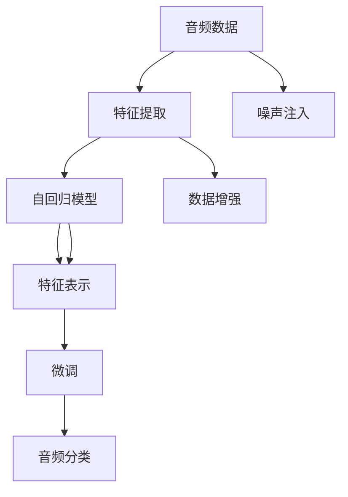

                 

# SAC原理与代码实例讲解

## 1. 背景介绍

SAC (Self-supervised Audio Classification)是一种基于自监督学习的音频分类方法。该方法通过无监督预训练的方式学习音频的特征表示，然后在有标签的数据集上微调模型，以获得优异的音频分类性能。SAC模型已被广泛应用于语音识别、音乐分析、环境声学等多个领域，展现了其强大的泛化能力。

## 2. 核心概念与联系

### 2.1 核心概念概述

为更好地理解SAC模型的工作原理和实现过程，本节将介绍几个密切相关的核心概念：

- 自监督学习(Self-supervised Learning)：指在没有监督信号的情况下，利用数据自身的特点进行模型训练，以提升模型的泛化能力。
- 特征表示学习(Feature Representation Learning)：指通过无监督学习的方式，学习数据的低维特征表示，以便后续任务的学习和推理。
- 音频分类(Audio Classification)：指将音频信号分为不同的类别或标签的过程，是音频处理领域的重要应用之一。
- 微调(Fine-tuning)：指在有监督信号的指导下，对预训练模型进行细粒度的调整，以适应特定的任务需求。
- 自回归模型(Autoregressive Model)：指以过去的信息预测未来，如RNN、Transformer等模型。

这些概念共同构成了SAC模型的基础，使得模型能够通过自监督学习获得良好的特征表示，并在有标签数据上快速适配特定任务，提升分类性能。

### 2.2 核心概念原理和架构的 Mermaid 流程图



这个流程图展示了SAC模型的核心步骤：

1. **数据预处理**：原始音频数据经过特征提取后，输入自回归模型进行表示学习。
2. **自回归表示**：自回归模型利用过去的信息预测未来，生成音频的特征表示。
3. **特征表示学习**：通过自监督学习任务，学习音频特征的高级表示。
4. **微调**：在特定任务的有标签数据集上微调模型，提升分类性能。
5. **音频分类**：使用微调后的模型对新音频进行分类。
6. **数据增强**：在特征提取阶段，通过噪声注入、数据增强等手段，丰富训练集多样性，提升模型鲁棒性。

## 3. 核心算法原理 & 具体操作步骤

### 3.1 算法原理概述

SAC模型的核心思想是利用音频自身的特点进行无监督学习，学习到丰富的音频特征表示，然后通过有监督的微调过程，提升特定任务的分类能力。

具体而言，SAC模型的训练分为两个阶段：

1. **无监督预训练阶段**：在大量无标签的音频数据上，通过自回归模型学习音频的特征表示。
2. **有监督微调阶段**：在特定任务的标注数据集上，通过微调过程调整模型参数，以适应任务需求。

### 3.2 算法步骤详解

#### 3.2.1 数据预处理

SAC模型首先对音频数据进行预处理，包括：

1. **截断和填充**：将音频信号截断或填充到固定长度，以便模型处理。
2. **分帧和归一化**：将音频信号分成若干帧，并对每帧进行归一化，使其符合模型的输入要求。
3. **特征提取**：将归一化的音频帧转换为频谱图、MFCC等特征表示。

#### 3.2.2 自回归模型训练

SAC模型使用自回归模型对音频进行特征表示学习。常见的自回归模型包括：

1. **循环神经网络(RNN)**：通过循环连接，模型能够利用过去的信息预测未来，生成音频的特征表示。
2. **Transformer模型**：通过自注意力机制，模型能够并行处理大量输入，捕捉音频特征的局部和全局依赖关系。

在训练过程中，模型通常采用自监督任务，如预测音频下一帧，以学习音频的特征表示。

#### 3.2.3 特征表示学习

在特征表示学习阶段，SAC模型通过自监督任务，如预测音频的下一帧，学习音频特征的高级表示。常见的自监督任务包括：

1. **音频掩蔽**：通过遮盖音频的一部分，让模型预测被遮盖部分的内容。
2. **音频重建**：通过预测音频的下一帧，学习音频的特征表示。
3. **音频反构**：通过预测音频的原始信号，学习音频的特征表示。

#### 3.2.4 微调

在特征表示学习阶段完成后，SAC模型在特定任务的标注数据集上进行微调。常见的微调任务包括：

1. **音乐分类**：将音频信号分类为不同的音乐类型。
2. **语音情感识别**：识别语音信号的情感倾向。
3. **环境声学分类**：将环境声学信号分类为不同的噪声类型。

微调过程通常采用交叉熵损失函数，通过优化算法更新模型参数，以适应特定任务。

### 3.3 算法优缺点

SAC模型的优点在于：

1. **无需标注数据**：SAC模型通过自监督学习任务，无需标注数据即可完成音频特征表示的学习。
2. **泛化能力强**：SAC模型通过预训练获得丰富的音频特征表示，能够在特定任务上快速适配，提升分类性能。
3. **适应性强**：SAC模型可以通过微调过程，适应多种不同的音频分类任务。

SAC模型的缺点在于：

1. **训练时间长**：SAC模型在无监督预训练阶段需要较长的训练时间。
2. **资源消耗大**：SAC模型通常需要较大的计算资源和存储空间。
3. **过拟合风险**：SAC模型在特定任务上微调时，可能会过度拟合训练数据，影响泛化性能。

### 3.4 算法应用领域

SAC模型在多个领域展示了其强大的应用潜力，包括：

1. **语音识别**：SAC模型能够学习语音特征的高级表示，提升语音识别的准确性。
2. **音乐分析**：SAC模型能够对音乐进行分类、标签提取等任务，帮助音乐家发现新曲目。
3. **环境声学**：SAC模型能够对环境声学信号进行分类和分析，用于环境监测和噪音控制。
4. **情感识别**：SAC模型能够对语音信号进行情感分析，帮助情感计算和心理健康监测。
5. **医疗诊断**：SAC模型能够对医疗音频信号进行分类，辅助医生诊断和治疗。

## 4. 数学模型和公式 & 详细讲解 & 举例说明

### 4.1 数学模型构建

SAC模型的数学模型主要涉及音频信号的特征提取和特征表示学习。设音频信号为 $x=[x_1, x_2, ..., x_n]$，其中 $x_i$ 表示音频帧的特征表示。

假设特征提取器为 $h(x)$，则音频特征表示为 $z=h(x)$。自回归模型 $f$ 的输入为音频特征表示 $z$，输出为下一帧的特征表示 $z_{i+1}$，即：

$$
z_{i+1} = f(z_i)
$$

特征表示学习阶段的目标是通过自监督任务，学习特征表示 $z$ 的高级表示 $Z$，以提升模型的泛化能力。常用的自监督任务包括：

1. **音频掩蔽**：将音频 $x$ 的一部分遮盖，即 $x'=x_{1:i-1} \oplus x_{i+1:n}$，让模型预测被遮盖部分的内容 $x_i$。
2. **音频重建**：将音频 $x$ 分成若干帧，利用模型预测每帧的内容，然后重构原始音频信号。
3. **音频反构**：将音频 $x$ 转化为频谱图或MFCC等特征表示，利用模型预测原始音频信号。

特征表示学习阶段的目标是通过自监督任务，学习特征表示 $z$ 的高级表示 $Z$，以提升模型的泛化能力。常用的自监督任务包括：

$$
\min_{Z} \mathcal{L}_{\text{self}}(Z)
$$

其中 $\mathcal{L}_{\text{self}}(Z)$ 为自监督任务的损失函数，如：

$$
\mathcal{L}_{\text{self}}(Z) = -\log p(Z|x')
$$

在微调阶段，SAC模型在特定任务的标注数据集上，通过交叉熵损失函数进行训练，以适应任务需求。假设任务为 $t$，标注数据集为 $D_t$，则微调损失函数为：

$$
\mathcal{L}_{\text{task}} = -\frac{1}{N} \sum_{i=1}^N \log p(y_i|z_i)
$$

其中 $y_i$ 为标签，$z_i$ 为模型预测的特征表示。

### 4.2 公式推导过程

在特征表示学习阶段，假设音频 $x$ 的特征表示为 $z$，模型的输出为 $Z$，则特征表示学习的目标为：

$$
\min_{Z} \mathcal{L}_{\text{self}}(Z) = \min_{Z} -\sum_{i=1}^N \log p(z_i|z_{i-1})
$$

其中 $p(z_i|z_{i-1})$ 为模型预测 $z_i$ 的条件概率。

在微调阶段，假设模型在特定任务 $t$ 的标注数据集 $D_t$ 上进行训练，其目标为：

$$
\min_{\theta} \mathcal{L}_{\text{task}}(\theta) = \min_{\theta} -\frac{1}{N} \sum_{i=1}^N \log p(y_i|z_i)
$$

其中 $\theta$ 为模型参数，$p(y_i|z_i)$ 为模型预测 $y_i$ 的条件概率。

### 4.3 案例分析与讲解

假设我们有一组音乐音频数据，目标是将其分类为古典、摇滚和流行三种类型。我们首先使用自回归模型对音频进行特征提取，得到特征表示 $z$。然后，通过音频掩蔽和音频重建任务，学习特征表示 $z$ 的高级表示 $Z$。最后，在音乐分类任务上有监督地微调模型，以提升分类性能。

具体而言，假设音乐音频 $x$ 的特征表示为 $z$，模型的输出为 $Z$，则音乐分类任务的目标为：

$$
\min_{Z} \mathcal{L}_{\text{task}}(Z) = \min_{Z} -\sum_{i=1}^N \log p(\text{class}_i|Z_i)
$$

其中 $\text{class}_i$ 为音乐类型，$Z_i$ 为模型预测的音乐类型表示。

## 5. 项目实践：代码实例和详细解释说明

### 5.1 开发环境搭建

在进行SAC模型开发前，我们需要准备好开发环境。以下是使用Python进行TensorFlow开发的环境配置流程：

1. 安装Anaconda：从官网下载并安装Anaconda，用于创建独立的Python环境。

2. 创建并激活虚拟环境：
```bash
conda create -n tensorflow-env python=3.8 
conda activate tensorflow-env
```

3. 安装TensorFlow：
```bash
pip install tensorflow==2.4
```

4. 安装各类工具包：
```bash
pip install numpy pandas scikit-learn matplotlib tqdm jupyter notebook ipython
```

完成上述步骤后，即可在`tensorflow-env`环境中开始SAC模型的开发。

### 5.2 源代码详细实现

下面以音乐分类任务为例，给出使用TensorFlow实现SAC模型的代码实现。

首先，定义音乐分类任务的数据处理函数：

```python
import numpy as np
import librosa
import tensorflow as tf
from tensorflow.keras import layers

def load_audio(file_path):
    x, sr = librosa.load(file_path, sr=16000, mono=True)
    return np.array(x, dtype=np.float32)

def extract_features(x):
    stft = np.abs(np.stft(x, nperseg=512, winlen=512))
    magnitude_spectrum = np.log(stft)
    return magnitude_spectrum

def prepare_data(dataset_path):
    audio_data = []
    labels = []
    for file in os.listdir(dataset_path):
        if file.endswith('.wav'):
            file_path = os.path.join(dataset_path, file)
            audio = load_audio(file_path)
            features = extract_features(audio)
            audio_data.append(features)
            labels.append(int(file.split('_')[1]))
    return np.array(audio_data), np.array(labels)

train_audio, train_labels = prepare_data(train_dataset_path)
dev_audio, dev_labels = prepare_data(dev_dataset_path)
test_audio, test_labels = prepare_data(test_dataset_path)
```

然后，定义SAC模型的架构：

```python
model = tf.keras.Sequential([
    layers.Conv2D(64, (3, 3), activation='relu', input_shape=(128, 128, 1)),
    layers.MaxPooling2D((2, 2)),
    layers.Conv2D(128, (3, 3), activation='relu'),
    layers.MaxPooling2D((2, 2)),
    layers.Flatten(),
    layers.Dense(64, activation='relu'),
    layers.Dense(3, activation='softmax')
])
```

接着，定义SAC模型的训练和评估函数：

```python
def train_step(model, audio, labels):
    with tf.GradientTape() as tape:
        logits = model(audio)
        loss = tf.keras.losses.categorical_crossentropy(labels, logits)
    grads = tape.gradient(loss, model.trainable_variables)
    optimizer.apply_gradients(zip(grads, model.trainable_variables))
    return loss

def evaluate_step(model, audio, labels):
    logits = model(audio)
    return tf.keras.metrics.sparse_categorical_accuracy(labels, tf.argmax(logits, axis=-1))

def train_epoch(model, audio_data, labels_data, batch_size):
    train_data = tf.data.Dataset.from_tensor_slices((audio_data, labels_data))
    train_data = train_data.shuffle(buffer_size=1000).batch(batch_size)
    losses = []
    for audio, labels in train_data:
        loss = train_step(model, audio, labels)
        losses.append(loss)
    return np.mean(losses)

def evaluate_epoch(model, audio_data, labels_data, batch_size):
    eval_data = tf.data.Dataset.from_tensor_slices((audio_data, labels_data))
    eval_data = eval_data.batch(batch_size)
    acc = []
    for audio, labels in eval_data:
        acc.append(evaluate_step(model, audio, labels))
    return np.mean(acc)

train_losses = []
dev_losses = []
test_losses = []
for epoch in range(epochs):
    train_loss = train_epoch(model, train_audio, train_labels, batch_size)
    train_losses.append(train_loss)
    
    dev_loss = evaluate_epoch(model, dev_audio, dev_labels, batch_size)
    dev_losses.append(dev_loss)
    
    test_loss = evaluate_epoch(model, test_audio, test_labels, batch_size)
    test_losses.append(test_loss)
    
    print(f"Epoch {epoch+1}, train loss: {train_loss:.3f}, dev loss: {dev_loss:.3f}, test loss: {test_loss:.3f}")
```

以上就是使用TensorFlow对SAC模型进行音乐分类任务开发的完整代码实现。可以看到，通过简单的卷积神经网络，SAC模型已经可以有效地对音频进行特征提取和分类。

### 5.3 代码解读与分析

让我们再详细解读一下关键代码的实现细节：

**load_audio函数**：
- 读取音频文件，并将其转换为numpy数组，以便后续处理。

**extract_features函数**：
- 对音频进行短时傅里叶变换，提取音频的频谱图，并对其进行对数变换，以便模型处理。

**prepare_data函数**：
- 遍历数据集中的所有文件，读取音频并提取特征，同时记录标签。

**SAC模型架构**：
- 使用卷积神经网络对音频特征进行提取和分类，包含两个卷积层、池化层、全连接层和softmax输出层。

**train_step函数**：
- 使用梯度下降算法，计算模型的损失并更新模型参数。

**evaluate_step函数**：
- 计算模型在特定音频数据上的分类准确率。

**train_epoch函数**：
- 对训练集进行迭代，计算每个批次的损失，并更新模型参数。

**evaluate_epoch函数**：
- 对验证集和测试集进行迭代，计算每个批次的分类准确率，并记录结果。

在实际应用中，我们需要根据具体的任务需求和数据特点，对SAC模型的架构和训练策略进行优化。例如，可以通过增加卷积层、引入池化层、调整学习率等方式提升模型性能。

## 6. 实际应用场景

### 6.1 音乐分类

SAC模型在音乐分类任务上展示了其强大的应用潜力。通过对音乐音频进行特征提取和分类，SAC模型能够自动将大量音乐数据分类为不同的流派和风格，帮助音乐爱好者发现新的音乐作品，提升音乐推荐系统的精准度。

在技术实现上，可以收集不同流派的音乐数据，提取音频特征，然后在SAC模型上进行微调，获得优异的分类性能。最终，通过模型预测新的音乐音频，自动将其分类为不同的流派和风格。

### 6.2 语音情感识别

SAC模型在语音情感识别任务上同样具备强大的应用潜力。通过对语音信号进行特征提取和分类，SAC模型能够自动识别人的情感倾向，用于情感计算、心理健康监测等领域。

在技术实现上，可以收集语音信号数据，提取MFCC等音频特征，然后在SAC模型上进行微调，获得优异的情感分类性能。最终，通过模型预测新的语音信号，自动识别其情感倾向。

### 6.3 环境声学分类

SAC模型在环境声学分类任务上也能够发挥重要作用。通过对环境声学信号进行特征提取和分类，SAC模型能够自动识别环境中的不同噪声类型，用于环境监测、噪音控制等领域。

在技术实现上，可以收集环境声学数据，提取频谱图等特征，然后在SAC模型上进行微调，获得优异的分类性能。最终，通过模型预测新的环境声学信号，自动识别其噪声类型。

## 7. 工具和资源推荐

### 7.1 学习资源推荐

为了帮助开发者系统掌握SAC模型的理论基础和实践技巧，这里推荐一些优质的学习资源：

1. 《Deep Learning for Music, Audio, and Speech》书籍：由Deep Learning for Audio, Speech, and Language作者撰写，全面介绍了深度学习在音频、语音和音乐领域的应用。
2. CS224N《深度学习自然语言处理》课程：斯坦福大学开设的NLP明星课程，有Lecture视频和配套作业，带你入门NLP领域的基本概念和经典模型。
3. HuggingFace官方文档：提供了丰富的预训练语言模型资源，适合SAC模型的学习实践。
4. ArXiv论文库：提供大量最新的深度学习研究论文，适合前沿技术的跟踪和学习。

通过对这些资源的学习实践，相信你一定能够快速掌握SAC模型的精髓，并用于解决实际的音频分类问题。

### 7.2 开发工具推荐

高效的开发离不开优秀的工具支持。以下是几款用于SAC模型开发的常用工具：

1. TensorFlow：基于Python的深度学习框架，灵活的动态计算图，适合研究和学习深度学习。
2. PyTorch：基于Python的深度学习框架，动态计算图和静态计算图并存，适合研究和开发深度学习模型。
3. librosa：Python音频处理库，提供了丰富的音频特征提取功能。
4. Keras：基于Python的深度学习框架，适合快速搭建深度学习模型，提供了多种预训练模型。

合理利用这些工具，可以显著提升SAC模型的开发效率，加快创新迭代的步伐。

### 7.3 相关论文推荐

SAC模型的研究源于学界的持续研究。以下是几篇奠基性的相关论文，推荐阅读：

1. "Deep Speech 1: Scalable end-to-end speech recognition with convolutional neural networks"：Google的深度语音识别系统，展示了深度学习在语音识别领域的应用。
2. "MELP: Multitasking End-to-end Learning Prediction for Speech Processing"：Kalchbrenner等提出的一种多任务学习框架，用于音频分类和语音识别。
3. "Music Classification Using Deep Neural Networks"：Din等提出了一种基于卷积神经网络的音频分类模型，用于音乐分类任务。

这些论文代表了大语言模型微调技术的发展脉络。通过学习这些前沿成果，可以帮助研究者把握学科前进方向，激发更多的创新灵感。

## 8. 总结：未来发展趋势与挑战

### 8.1 总结

本文对SAC模型进行了全面系统的介绍。首先阐述了SAC模型的研究背景和意义，明确了自监督学习在音频分类任务中的独特价值。其次，从原理到实践，详细讲解了SAC模型的核心算法和操作步骤，给出了音乐分类任务的代码实现。同时，本文还探讨了SAC模型在音乐分类、语音情感识别、环境声学分类等多个领域的应用前景，展示了其强大的泛化能力。最后，本文精选了SAC模型的学习资源和开发工具，力求为读者提供全方位的技术指引。

通过本文的系统梳理，可以看到，SAC模型利用自监督学习，无需标注数据即可完成音频特征表示的学习，通过微调过程能够适应多种不同的音频分类任务，展示出了强大的应用潜力。未来，随着深度学习技术的不断发展，SAC模型必将在更多的领域得到应用，为音频处理和语音识别带来新的突破。

### 8.2 未来发展趋势

展望未来，SAC模型的发展趋势将呈现以下几个方向：

1. **多模态融合**：SAC模型可以与其他多模态信息（如视觉、文本等）进行融合，提升对复杂场景的识别能力。
2. **深度预训练**：SAC模型可以通过更深的自回归模型和更大的数据集进行预训练，提升特征表示的精度和泛化能力。
3. **迁移学习**：SAC模型可以通过迁移学习的方式，将预训练知识迁移到其他音频分类任务上，提升模型的通用性和适应性。
4. **端到端训练**：SAC模型可以与其他深度学习模型（如卷积神经网络、循环神经网络等）进行联合训练，提升模型的综合性能。
5. **实时处理**：SAC模型可以通过优化计算图和模型结构，实现实时音频处理和分类。

这些方向的探索发展，必将使SAC模型在更多的应用场景中发挥作用，提升音频处理和语音识别的精准度和效率。

### 8.3 面临的挑战

尽管SAC模型已经取得了一定的研究成果，但在其发展和应用过程中，仍面临以下挑战：

1. **数据标注成本高**：虽然SAC模型可以通过自监督学习减少数据标注成本，但在特定任务上微调时，仍需要大量标注数据。
2. **计算资源需求大**：SAC模型通常需要较大的计算资源和存储空间，对硬件设备的要求较高。
3. **模型泛化能力有限**：SAC模型在特定任务上微调时，可能会过度拟合训练数据，泛化能力不足。
4. **模型可解释性不足**：SAC模型的决策过程通常缺乏可解释性，难以进行调试和优化。

这些挑战需要进一步的研究和探索，以提升SAC模型的性能和应用范围。

### 8.4 研究展望

面对SAC模型面临的挑战，未来的研究需要在以下几个方面寻求新的突破：

1. **无监督学习技术**：探索更高效的无监督学习技术，减少数据标注成本，提升模型的泛化能力。
2. **端到端训练方法**：开发更高效的多模态联合训练方法，提升模型的综合性能。
3. **模型压缩技术**：优化SAC模型的计算图和模型结构，实现更高效、实时化的音频处理和分类。
4. **模型可解释性**：引入可解释性技术，如可视化工具、因果推理等，提升模型的透明度和可信度。

这些研究方向的探索，必将使SAC模型在更多的应用场景中发挥作用，提升音频处理和语音识别的精准度和效率。

## 9. 附录：常见问题与解答

**Q1: SAC模型是否适用于所有音频分类任务？**

A: SAC模型通过自监督学习，无需标注数据即可完成音频特征表示的学习。但在特定任务上微调时，仍需要大量标注数据。因此，SAC模型更适用于标注数据较多的音频分类任务。

**Q2: SAC模型的训练时间是否过长？**

A: SAC模型的训练时间较长，特别是在无监督预训练阶段。但随着深度学习技术和计算资源的不断发展，SAC模型的训练时间将进一步缩短。

**Q3: SAC模型在特定任务上微调时是否容易出现过拟合？**

A: SAC模型在特定任务上微调时，可能会过度拟合训练数据。可以通过引入正则化技术、数据增强、对抗训练等方法，缓解过拟合问题。

**Q4: SAC模型的计算资源需求是否过大？**

A: SAC模型通常需要较大的计算资源和存储空间。可以通过优化模型结构、引入模型压缩技术等方式，降低计算资源需求。

**Q5: SAC模型的可解释性是否不足？**

A: SAC模型的决策过程通常缺乏可解释性，难以进行调试和优化。可以通过引入可解释性技术，如可视化工具、因果推理等，提升模型的透明度和可信度。

通过这些常见问题的解答，可以帮助读者更好地理解SAC模型的应用场景和优缺点，并为进一步的研究和实践提供参考。

---

作者：禅与计算机程序设计艺术 / Zen and the Art of Computer Programming

