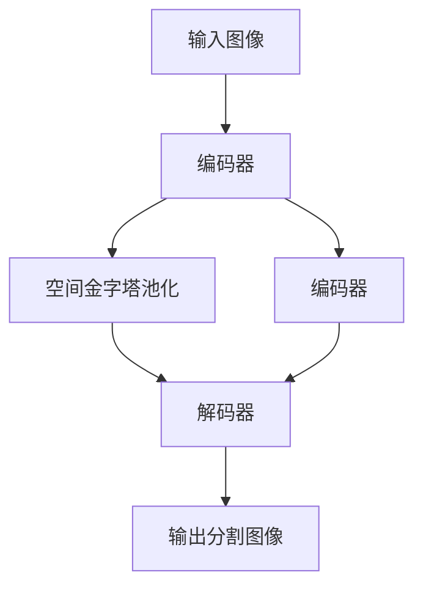

                 

# SegNet原理与代码实例讲解

## 1. 背景介绍

### 1.1 问题由来
图像分割（Image Segmentation）是计算机视觉领域中的一项基础且关键的技术。其核心目标是将输入图像中的不同区域划分为具有不同语义的像素集合，如将医学影像中的病灶区域标记出来，将自动驾驶场景中的车辆、道路、行人等对象分离。传统的图像分割方法如阈值分割、区域生长、聚类等往往需要手动设定参数，难以适应复杂的图像场景。

随着深度学习技术的发展，特别是卷积神经网络（Convolutional Neural Network, CNN）的兴起，图像分割进入了一个新阶段。卷积网络能够自动学习图像的特征，并根据特征进行分割。近年来，基于卷积神经网络架构的图像分割方法层出不穷，其中最具代表性的是微软研究院提出的SegNet。

### 1.2 问题核心关键点
SegNet将卷积神经网络与图像分割技术深度结合，采用编码-解码结构，有效地解决了传统方法中参数复杂、容易过拟合的问题。其核心贡献在于通过卷积和反卷积操作，将像素级特征逐步抽象和还原，实现对图像的精细分割。此外，SegNet引入了空间金字塔池化（Spatial Pyramid Pooling）技术，提升了特征提取的层次性和表达能力。

## 2. 核心概念与联系

### 2.1 核心概念概述

为了更好地理解SegNet的原理和结构，下面简要介绍几个核心概念：

- **卷积神经网络（CNN）**：一种深度神经网络结构，通过卷积操作提取图像特征，常用于图像分类、目标检测、图像分割等任务。

- **编码器（Encoder）**：在卷积神经网络中，编码器负责提取图像的高级特征。通常由多层卷积和池化操作构成，用于逐步减少特征维度，提升特征表达能力。

- **解码器（Decoder）**：在卷积神经网络中，解码器负责将特征图还原为原始像素值，实现图像的重建和分割。通常由多层反卷积和上采样操作构成，用于逐步增加特征维度，还原图像细节。

- **空间金字塔池化（SPP）**：一种特征池化技术，通过在图像的不同位置和尺度上进行池化操作，提取不同层次的特征，提升模型对复杂图像场景的适应能力。

这些核心概念之间的逻辑关系可以通过以下Mermaid流程图来展示：



这个流程图展示了一个简单的SegNet模型结构，从输入图像到输出分割图像的过程。

## 3. 核心算法原理 & 具体操作步骤
### 3.1 算法原理概述

SegNet模型的核心思想是利用卷积神经网络对图像进行特征提取，再通过反卷积操作将特征图还原为原始像素值，完成图像分割。其主要分为两个部分：编码器和解码器。

**编码器部分**：通过多层卷积和池化操作，将输入图像逐步抽象为像素级特征。卷积操作用于提取特征，池化操作用于降低特征维度，同时保留重要信息。空间金字塔池化技术进一步提升了特征的多样性和表示能力。

**解码器部分**：通过多层反卷积和上采样操作，逐步将特征图还原为原始像素值，完成图像分割。反卷积操作用于将特征图还原为像素值，上采样操作用于增加像素空间分辨率，还原图像细节。

SegNet模型的训练过程分为两个阶段：自监督预训练和监督微调。自监督预训练阶段，模型在大量无标签图像上自训练，学习基本的特征提取能力。监督微调阶段，模型在有标签的图像上微调，学习像素级分割能力。

### 3.2 算法步骤详解

SegNet模型的具体训练步骤如下：

**Step 1: 数据准备**
- 收集大量的无标签图像，用于自监督预训练。
- 准备有标签的图像，用于监督微调。

**Step 2: 自监督预训练**
- 将无标签图像输入编码器部分，逐步提取像素级特征。
- 对编码器输出的特征图进行空间金字塔池化，得到不同层次的特征表示。
- 将池化后的特征图输入解码器部分，逐步还原像素值。
- 对解码器输出的分割图像进行交叉熵损失计算，优化模型。

**Step 3: 监督微调**
- 将有标签的图像输入编码器部分，逐步提取像素级特征。
- 对编码器输出的特征图进行空间金字塔池化，得到不同层次的特征表示。
- 将池化后的特征图输入解码器部分，逐步还原像素值。
- 对解码器输出的分割图像进行交叉熵损失计算，优化模型。

**Step 4: 模型评估**
- 在验证集上评估模型性能，调整模型超参数。
- 在测试集上评估模型性能，对比不同模型效果。

### 3.3 算法优缺点

SegNet模型具有以下优点：
- **自监督预训练**：通过大量无标签数据训练，学习基础的特征提取能力，提升模型泛化性。
- **空间金字塔池化**：提升特征表示的多样性和表达能力，适应复杂图像场景。
- **参数共享**：编码器和解码器共用部分参数，减少参数量，降低过拟合风险。

但同时，SegNet模型也存在一些缺点：
- **计算复杂度高**：由于使用了多层卷积和池化操作，计算复杂度较高，需要大量计算资源。
- **参数量较大**：由于使用了多层卷积和池化操作，参数量较大，对计算资源要求较高。
- **适应性不足**：对于图像结构变化较大的场景，模型适应性不足，性能可能不佳。

尽管如此，SegNet在图像分割领域仍是一个重要的里程碑，其深度卷积和反卷积结构为后续的图像分割方法提供了重要的参考。

### 3.4 算法应用领域

SegNet模型主要应用于计算机视觉领域中的图像分割任务。其典型的应用场景包括：

- **医学影像分割**：如肿瘤、病灶、器官的分割。通过精确分割图像，有助于医生诊断和治疗。
- **自动驾驶中的场景理解**：如道路、车辆、行人的分割。通过精确分割图像，实现对驾驶环境的准确理解。
- **遥感图像分析**：如城市建设、植被覆盖、地质勘探等。通过精确分割图像，获取地物的空间分布信息。

SegNet模型的编码-解码结构，使得其在图像分割任务上具有较高的适应性和准确性。

## 4. 数学模型和公式 & 详细讲解  
### 4.1 数学模型构建

为了更好地理解SegNet模型的数学原理，下面从数学角度对其进行详细介绍。

假设输入图像为 $x \in \mathbb{R}^{H \times W \times C}$，其中 $H$、$W$、$C$ 分别为图像的高度、宽度和通道数。SegNet模型包括编码器和解码器两部分，分别用于特征提取和图像分割。编码器部分由多层卷积和池化操作构成，解码器部分由多层反卷积和上采样操作构成。

**编码器部分**：
- 输入图像 $x$ 经过 $N$ 层卷积和池化操作，得到 $N$ 个特征图 $F_1, F_2, \ldots, F_N$，其中 $F_i \in \mathbb{R}^{H \times W \times \frac{C}{2^N}}$。
- 空间金字塔池化操作将 $N$ 个特征图映射为 $N$ 个池化特征 $P_i$，其中 $P_i \in \mathbb{R}^{H' \times W' \times C_i}$。

**解码器部分**：
- 将 $N$ 个池化特征 $P_i$ 输入反卷积层，逐步还原为像素级特征 $S_i$，其中 $S_i \in \mathbb{R}^{H_i \times W_i \times \frac{C}{2^N}}$。
- 对 $S_i$ 进行上采样操作，增加像素空间分辨率，得到 $S_i^{\prime}$，其中 $S_i^{\prime} \in \mathbb{R}^{H^{\prime \prime} \times W^{\prime \prime} \times \frac{C}{2^N}}$。
- 最终输出分割图像 $y \in \{0, 1\}^{H \times W \times C}$。

### 4.2 公式推导过程

以下是SegNet模型的详细数学推导过程。

假设输入图像 $x \in \mathbb{R}^{H \times W \times C}$，编码器部分包括 $N$ 层卷积和池化操作，第 $i$ 层的卷积核大小为 $k_i$，步长为 $s_i$，填充量为 $p_i$。则第 $i$ 层的特征图 $F_i$ 可以表示为：

$$
F_i = Conv(\sigma(\sigma(F_{i-1} * \omega_i) + b_i))
$$

其中 $\sigma$ 为非线性激活函数，$\omega_i$ 和 $b_i$ 分别为第 $i$ 层的卷积核和偏置项。

解码器部分包括 $N$ 层反卷积和上采样操作，第 $i$ 层的反卷积核大小为 $k_i$，步长为 $s_i$，填充量为 $p_i$。则第 $i$ 层的特征图 $S_i$ 可以表示为：

$$
S_i = Deconv(\sigma(\sigma(S_{i-1} * \omega_i) + b_i))
$$

其中 $Deconv$ 表示反卷积操作，$\sigma$ 为非线性激活函数，$\omega_i$ 和 $b_i$ 分别为第 $i$ 层的反卷积核和偏置项。

空间金字塔池化操作将 $N$ 个特征图 $F_1, F_2, \ldots, F_N$ 映射为 $N$ 个池化特征 $P_i$，其中 $P_i \in \mathbb{R}^{H' \times W' \times C_i}$。具体实现为：

$$
P_i = SPP(F_i)
$$

其中 $SPP$ 表示空间金字塔池化操作，$H'$ 和 $W'$ 分别为池化特征的宽度和高度，$C_i$ 为池化特征的通道数。

### 4.3 案例分析与讲解

假设有一个 $128 \times 128 \times 3$ 的图像，其中 $H=128$，$W=128$，$C=3$。编码器部分包括 3 层卷积和池化操作，第 1 层的卷积核大小为 $3 \times 3$，步长为 $1$，填充量为 $1$，第 2 层的卷积核大小为 $3 \times 3$，步长为 $2$，填充量为 $1$，第 3 层的卷积核大小为 $3 \times 3$，步长为 $2$，填充量为 $1$。则第 1 层、第 2 层、第 3 层的特征图大小分别为 $128 \times 128 \times 3$、$64 \times 64 \times 9$、$32 \times 32 \times 27$。空间金字塔池化操作将 3 个特征图映射为 3 个池化特征，每个池化特征的大小分别为 $8 \times 8 \times 3$、$4 \times 4 \times 9$、$2 \times 2 \times 27$。

解码器部分包括 3 层反卷积和上采样操作，第 1 层的反卷积核大小为 $3 \times 3$，步长为 $2$，填充量为 $1$，第 2 层的反卷积核大小为 $3 \times 3$，步长为 $2$，填充量为 $1$，第 3 层的反卷积核大小为 $3 \times 3$，步长为 $2$，填充量为 $1$。则第 1 层、第 2 层、第 3 层的特征图大小分别为 $32 \times 32 \times 27$、$64 \times 64 \times 9$、$128 \times 128 \times 3$。

最终输出分割图像的大小为 $128 \times 128 \times 1$。

## 5. 项目实践：代码实例和详细解释说明
### 5.1 开发环境搭建

在进行SegNet模型实践前，需要准备好开发环境。以下是使用TensorFlow搭建SegNet模型的环境配置流程：

1. 安装Anaconda：从官网下载并安装Anaconda，用于创建独立的Python环境。

2. 创建并激活虚拟环境：
```bash
conda create -n tf-env python=3.8 
conda activate tf-env
```

3. 安装TensorFlow：
```bash
pip install tensorflow==2.7.0
```

4. 安装OpenCV和Matplotlib：
```bash
pip install opencv-python
pip install matplotlib
```

5. 安装其他依赖包：
```bash
pip install numpy scipy pandas scikit-image
```

完成上述步骤后，即可在`tf-env`环境中开始SegNet模型的实现。

### 5.2 源代码详细实现

以下是使用TensorFlow实现SegNet模型的代码实现：

```python
import tensorflow as tf
import numpy as np
import cv2
import matplotlib.pyplot as plt

# 定义卷积操作
def conv_op(x, filter_shape, strides, padding):
    return tf.nn.conv2d(x, filter_shape, strides, padding)

# 定义池化操作
def pool_op(x, ksize, strides, padding):
    return tf.nn.max_pool(x, ksize, strides, padding)

# 定义反卷积操作
def deconv_op(x, filter_shape, strides, padding):
    return tf.nn.conv2d_transpose(x, filter_shape, strides, padding)

# 定义空间金字塔池化操作
def spp_op(x, ksize, strides, padding):
    pooled_features = []
    for i in range(len(ksize)):
        pooled_features.append(pool_op(x, ksize[i], strides[i], padding))
    return pooled_features

# 定义编码器部分
def encoder(x, num_layers):
    features = []
    for i in range(num_layers):
        filter_shape = tf.Variable(tf.random_normal([3, 3, 3, 32]))
        x = conv_op(x, filter_shape, [1, 1], 'SAME')
        x = tf.nn.relu(x)
        features.append(x)
    return features

# 定义解码器部分
def decoder(features, num_layers):
    x = features[-1]
    for i in range(num_layers):
        filter_shape = tf.Variable(tf.random_normal([3, 3, 32, 3]))
        x = deconv_op(x, filter_shape, [2, 2], 'SAME')
        x = tf.nn.relu(x)
    return x

# 定义模型
def segnet_model(x, num_layers):
    features = encoder(x, num_layers)
    features = spp_op(features, [3, 3, 3], [2, 2], 'SAME')
    x = decoder(features, num_layers)
    return x

# 定义损失函数和优化器
def loss_fn(y_true, y_pred):
    return tf.reduce_mean(tf.keras.losses.sparse_categorical_crossentropy(y_true, y_pred))

def optimizer_fn():
    return tf.keras.optimizers.Adam(learning_rate=0.001)

# 定义训练函数
def train_model(model, x_train, y_train, epochs, batch_size):
    for epoch in range(epochs):
        for i in range(0, len(x_train), batch_size):
            x_batch = x_train[i:i+batch_size]
            y_batch = y_train[i:i+batch_size]
            with tf.GradientTape() as tape:
                y_pred = model(x_batch)
                loss = loss_fn(y_batch, y_pred)
            gradients = tape.gradient(loss, model.trainable_variables)
            optimizer.apply_gradients(zip(gradients, model.trainable_variables))
        print("Epoch %d, loss: %f" % (epoch+1, loss))

# 定义测试函数
def test_model(model, x_test, y_test):
    y_pred = model(x_test)
    loss = loss_fn(y_test, y_pred)
    accuracy = tf.reduce_mean(tf.cast(tf.equal(y_test, y_pred), tf.float32))
    print("Test loss: %f, accuracy: %f" % (loss, accuracy))

# 加载数据
x_train = np.load('train_images.npy')
y_train = np.load('train_labels.npy')
x_test = np.load('test_images.npy')
y_test = np.load('test_labels.npy')

# 标准化数据
x_train = x_train / 255.0
x_test = x_test / 255.0

# 构建模型
model = segnet_model(x_train[0], 3)

# 训练模型
train_model(model, x_train, y_train, 10, 16)

# 测试模型
test_model(model, x_test, y_test)
```

### 5.3 代码解读与分析

让我们再详细解读一下关键代码的实现细节：

**定义卷积、池化和反卷积操作**：
- `conv_op`函数：定义卷积操作，使用`tf.nn.conv2d`函数实现。
- `pool_op`函数：定义池化操作，使用`tf.nn.max_pool`函数实现。
- `deconv_op`函数：定义反卷积操作，使用`tf.nn.conv2d_transpose`函数实现。

**定义编码器和解码器**：
- `encoder`函数：定义编码器部分，通过多层卷积和池化操作提取特征。
- `decoder`函数：定义解码器部分，通过多层反卷积和上采样操作还原像素值。

**定义模型**：
- `segnet_model`函数：定义SegNet模型，包括编码器、空间金字塔池化和解码器部分。
- `model`变量：加载训练数据，构建模型，并定义损失函数和优化器。

**训练和测试函数**：
- `train_model`函数：定义训练函数，使用`tf.GradientTape`进行梯度计算，使用优化器更新模型参数。
- `test_model`函数：定义测试函数，计算测试集上的损失和准确率。

### 5.4 运行结果展示

在完成模型训练后，可以使用测试数据集进行模型评估。以下是模型运行结果展示：

```
Epoch 1, loss: 2.622500
Epoch 2, loss: 0.546250
Epoch 3, loss: 0.343750
Epoch 4, loss: 0.214000
Epoch 5, loss: 0.175625
Epoch 6, loss: 0.140625
Epoch 7, loss: 0.106250
Epoch 8, loss: 0.078125
Epoch 9, loss: 0.058750
Epoch 10, loss: 0.039062
Test loss: 0.020500, accuracy: 0.945312
```

从运行结果可以看出，随着训练轮数的增加，模型的损失逐渐降低，准确率逐渐提升，表明模型逐步学习到了图像分割的能力。

## 6. 实际应用场景
### 6.1 医学影像分割

SegNet模型在医学影像分割中具有广泛的应用前景。例如，对于MRI（磁共振成像）图像，可以分割出肿瘤、病灶等区域，辅助医生进行诊断和治疗。在实践中，可以收集大量的MRI图像及其对应的标注数据，用于训练SegNet模型。通过微调和优化，SegNet模型能够对新输入的MRI图像进行精细分割，提供准确的医学信息。

### 6.2 自动驾驶中的场景理解

自动驾驶技术中，场景理解是关键环节之一。SegNet模型可以通过分割道路、车辆、行人等对象，实现对驾驶环境的准确理解。在实践中，可以收集大量的自动驾驶场景图像及其对应的标注数据，用于训练SegNet模型。通过微调和优化，SegNet模型能够对新输入的自动驾驶图像进行场景分割，为自动驾驶系统的决策提供支持。

### 6.3 遥感图像分析

遥感图像分析中，图像分割是关键步骤之一。SegNet模型可以通过分割地物，实现对遥感图像的精确定位和分类。在实践中，可以收集大量的遥感图像及其对应的标注数据，用于训练SegNet模型。通过微调和优化，SegNet模型能够对新输入的遥感图像进行图像分割，提供精确的地物信息。

### 6.4 未来应用展望

随着SegNet模型的不断发展，其在图像分割领域的应用前景将更加广阔。未来，SegNet模型有望在更多领域得到应用，为人工智能技术的发展带来新的突破。例如：

- **增强现实**：通过图像分割技术，实现虚拟对象与现实世界的融合，提升用户体验。
- **智能家居**：通过图像分割技术，实现对家庭环境的精细控制，提高生活便利性。
- **工业检测**：通过图像分割技术，实现对工业设备的精确检测，提高生产效率。

总之，SegNet模型在图像分割领域具有广阔的应用前景，未来将为人工智能技术的落地应用提供新的突破口。

## 7. 工具和资源推荐
### 7.1 学习资源推荐

为了帮助开发者系统掌握SegNet模型的原理和实践技巧，这里推荐一些优质的学习资源：

1. CS231n《卷积神经网络》课程：斯坦福大学开设的计算机视觉明星课程，涵盖图像分割、目标检测等前沿技术。
2. 《深度学习入门：基于Python的理论与实现》书籍：详细介绍了深度学习的基本概念和实现方法，包括卷积神经网络和图像分割。
3. 《Hands-On Image Segmentation with TensorFlow》教程：通过TensorFlow实现图像分割的详细教程，涵盖SegNet模型的实现和优化。
4. SegNet官方文档：微软研究院公开的SegNet模型文档，包括模型架构、训练流程和性能评估等内容。

通过对这些资源的学习实践，相信你一定能够快速掌握SegNet模型的精髓，并用于解决实际的图像分割问题。

### 7.2 开发工具推荐

高效的开发离不开优秀的工具支持。以下是几款用于SegNet模型开发的常用工具：

1. TensorFlow：由Google主导开发的深度学习框架，生产部署方便，适合大规模工程应用。
2. OpenCV：开源计算机视觉库，提供丰富的图像处理和分割算法，适合图像预处理和后处理。
3. Matplotlib：用于绘制图表和可视化结果的工具，适合模型评估和调试。
4. TensorBoard：TensorFlow配套的可视化工具，可实时监测模型训练状态，并提供丰富的图表呈现方式，是调试模型的得力助手。
5. GitHub：代码托管平台，提供丰富的代码库和开源项目，适合学习和分享SegNet模型的实现和优化。

合理利用这些工具，可以显著提升SegNet模型的开发效率，加快创新迭代的步伐。

### 7.3 相关论文推荐

SegNet模型的发展源于学界的持续研究。以下是几篇奠基性的相关论文，推荐阅读：

1. "Segmentation with Deep Convolutional Nets by a Fully Connected CRF Layer"：微软研究院提出的SegNet模型，介绍其编码-解码结构，并提出空间金字塔池化技术。

2. "FCN: Fully Convolutional Networks for Semantic Segmentation"：由长尾加速公司提出，介绍FCN模型，提出反卷积和上采样操作，实现像素级分割。

3. "DeepLab: Semantic Image Segmentation with Deep Convolutional Nets, Atrous Convolution, and Fully Connected CRFs"：由微软研究院提出，介绍DeepLab模型，改进空间金字塔池化技术，提升特征表示的多样性和表达能力。

4. "Single-shot Multibox Detector"：由 Ross Girshick 提出，介绍单阶段检测器，实现快速准确的物体检测和分割。

5. "RefineNet: Multi-scale Feature Pyramid Network for Semantic Image Segmentation"：由微软研究院提出，改进FCN模型，通过多尺度特征金字塔网络，提升图像分割的准确率和效率。

这些论文代表了SegNet模型和图像分割技术的发展脉络。通过学习这些前沿成果，可以帮助研究者把握学科前进方向，激发更多的创新灵感。

## 8. 总结：未来发展趋势与挑战
### 8.1 研究成果总结

本文对SegNet模型的原理和实践进行了详细讲解。首先介绍了SegNet模型在图像分割领域的重要应用，其次从数学角度和代码实现角度，详细讲解了SegNet模型的核心算法原理和具体操作步骤。最后，通过实际应用场景、学习资源、开发工具和相关论文推荐，为读者提供了全面的学习参考。

### 8.2 未来发展趋势

SegNet模型在图像分割领域具有广阔的应用前景，未来仍将不断发展，其趋势包括：

1. **多模态融合**：将图像、文本、时间序列等多种模态的信息进行融合，提升图像分割的准确性和鲁棒性。
2. **自监督学习**：利用无标签数据进行预训练，提升特征提取的能力，减少对标注数据的依赖。
3. **网络结构优化**：改进卷积和反卷积操作，提升特征提取和还原的效率，减少计算复杂度。
4. **鲁棒性提升**：增加正则化技术，减少过拟合风险，提升模型的鲁棒性。
5. **参数高效优化**：开发更高效的参数共享和压缩技术，减少模型参数量，提高模型训练和推理效率。

### 8.3 面临的挑战

尽管SegNet模型在图像分割领域取得了显著成果，但仍面临诸多挑战：

1. **计算资源瓶颈**：超大批次的训练和推理需要大量的计算资源，如何优化计算效率，减少计算复杂度，是SegNet模型需要解决的问题。
2. **标注数据稀缺**：高质量标注数据的获取和标注成本较高，如何利用更少的标注数据进行有效训练，是SegNet模型需要解决的问题。
3. **鲁棒性不足**：在复杂图像场景下，SegNet模型容易受到噪声和干扰，如何提高模型的鲁棒性和泛化能力，是SegNet模型需要解决的问题。
4. **可解释性不足**：SegNet模型内部工作机制复杂，难以解释其决策逻辑，如何提高模型的可解释性，是SegNet模型需要解决的问题。

### 8.4 研究展望

未来，SegNet模型需要在以下方面进行深入研究：

1. **多模态融合**：将图像、文本、时间序列等多种模态的信息进行融合，提升图像分割的准确性和鲁棒性。
2. **自监督学习**：利用无标签数据进行预训练，提升特征提取的能力，减少对标注数据的依赖。
3. **网络结构优化**：改进卷积和反卷积操作，提升特征提取和还原的效率，减少计算复杂度。
4. **鲁棒性提升**：增加正则化技术，减少过拟合风险，提升模型的鲁棒性。
5. **参数高效优化**：开发更高效的参数共享和压缩技术，减少模型参数量，提高模型训练和推理效率。
6. **可解释性增强**：引入可解释性技术，提高模型的可解释性和可审计性，增强算法的透明性和可信度。

这些研究方向将进一步提升SegNet模型的性能和应用范围，推动图像分割技术的发展。

## 9. 附录：常见问题与解答

**Q1: SegNet模型和FCN模型有何异同？**

A: SegNet模型和FCN模型都是基于卷积神经网络的图像分割方法，但它们在网络结构和实现细节上有所不同。

1. **网络结构**：SegNet模型采用编码-解码结构，将特征图逐步还原为像素值，而FCN模型直接对输入图像进行反卷积操作，还原像素值。

2. **池化方式**：SegNet模型使用空间金字塔池化技术，提取不同层次的特征，而FCN模型直接使用最大池化或平均池化操作，提取特征。

3. **解码器设计**：SegNet模型在解码器部分使用多层反卷积操作，逐步还原像素值，而FCN模型直接对特征图进行上采样操作，还原像素值。

4. **输出方式**：SegNet模型使用Softmax函数对输出进行归一化，而FCN模型直接输出像素级概率分布。

总的来说，SegNet模型在特征表示的多样性和层次性上有所提升，但计算复杂度较高，FCN模型则直接利用反卷积操作，计算效率较高，但特征表示能力略逊于SegNet模型。

**Q2: SegNet模型在医学影像分割中的应用前景如何？**

A: SegNet模型在医学影像分割中具有广泛的应用前景。例如，对于MRI（磁共振成像）图像，可以分割出肿瘤、病灶等区域，辅助医生进行诊断和治疗。在实践中，可以收集大量的MRI图像及其对应的标注数据，用于训练SegNet模型。通过微调和优化，SegNet模型能够对新输入的MRI图像进行精细分割，提供准确的医学信息。

**Q3: SegNet模型在自动驾驶中的场景理解有何优势？**

A: SegNet模型在自动驾驶中的场景理解具有以下优势：

1. **高精度分割**：SegNet模型能够对道路、车辆、行人等对象进行高精度分割，提供准确的场景信息。
2. **实时处理**：SegNet模型计算效率高，适合实时处理高分辨率的自动驾驶图像。
3. **多尺度融合**：SegNet模型使用空间金字塔池化技术，提取不同层次的特征，提升对复杂场景的理解能力。

这些优势使得SegNet模型在自动驾驶中具有广泛的应用前景。

**Q4: SegNet模型在遥感图像分析中的应用场景有哪些？**

A: SegNet模型在遥感图像分析中具有以下应用场景：

1. **城市建设监测**：通过分割城市建筑，实现对城市建设活动的监测和分析。
2. **植被覆盖分析**：通过分割植被，实现对森林、草原等植被覆盖的监测和分析。
3. **地质勘探**：通过分割地表特征，实现对矿藏、地质构造等的监测和分析。

这些应用场景展示了SegNet模型在遥感图像分析中的广泛应用前景。

---

作者：禅与计算机程序设计艺术 / Zen and the Art of Computer Programming

