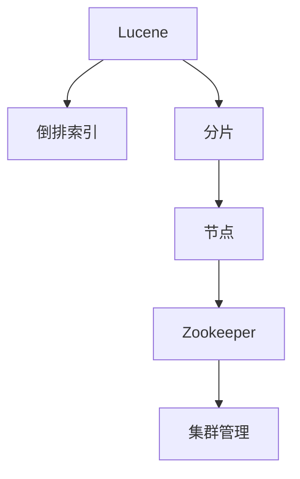

                 

# Solr原理与代码实例讲解

> 关键词：Solr, 搜索引擎, 全文检索, 分布式, 代码实例, 日志分析, 数据挖掘

## 1. 背景介绍

### 1.1 问题由来
随着互联网的迅猛发展，数据的爆炸式增长，人们对于信息检索的需求日益增长。传统的搜索引擎已经无法满足大规模数据处理和高精度信息检索的需求。Solr作为一款基于Lucene的开源搜索引擎，其强大的全文检索能力和灵活的扩展性，使其成为数据驱动时代首选的信息检索工具。

### 1.2 问题核心关键点
Solr是一款基于Lucene的开源搜索引擎，其主要特点包括：

- **分布式架构**：通过Zookeeper实现集群管理，支持水平扩展，可处理海量数据。
- **全功能搜索**：支持全文检索、模糊搜索、排序、分页、分组等多种高级搜索功能。
- **灵活扩展**：支持插件机制，用户可以方便地添加、定制各种搜索组件和功能。
- **多语言支持**：内置多种分词器、语言模型，支持多语言信息检索。
- **高效索引**：利用倒排索引、倒排列表等高效数据结构，实现快速检索。

Solr的核心原理围绕着索引和查询两个关键步骤，通过倒排索引技术实现快速的全文检索，并通过灵活的插件机制支持多种定制化的搜索功能。本文将详细介绍Solr的核心原理和关键技术点，并通过具体的代码实例帮助读者深入理解Solr的工作机制和使用方法。

## 2. 核心概念与联系

### 2.1 核心概念概述

为更好地理解Solr的工作原理，本节将介绍几个密切相关的核心概念：

- **Lucene**：Solr的底层搜索库，提供核心搜索算法和索引结构，支持高效的全文检索。
- **倒排索引**：Solr利用倒排索引技术实现快速的全文检索，索引结构基于文档和词的倒排关系。
- **分片(Shard)**：Solr通过将索引分为多个分片，实现水平扩展，提高系统的可扩展性和容错性。
- **节点(Node)**：Solr集群中的节点，包括主节点和从节点，主节点负责管理索引和分片，从节点提供搜索服务。
- **Zookeeper**：Solr集群中用于集群管理和协调的分布式协调服务，确保集群的高可用性和一致性。

这些核心概念之间的逻辑关系可以通过以下Mermaid流程图来展示：



这个流程图展示了大语言模型的核心概念及其之间的关系：

1. Lucene提供核心搜索算法和索引结构。
2. 倒排索引技术实现快速的全文检索。
3. 分片机制实现水平扩展，提高系统可扩展性。
4. Zookeeper用于集群管理和协调，确保集群高可用性和一致性。

## 3. 核心算法原理 & 具体操作步骤

### 3.1 算法原理概述

Solr的核心算法原理主要围绕着索引和查询两个关键步骤展开。首先，Solr利用Lucene进行倒排索引的构建，将文本数据转换为高效的结构化索引，存储在Solr的索引库中。然后，在查询时，Solr通过倒排索引快速定位包含关键词的文档，并结合查询规则、排序规则、分组规则等高级搜索功能，返回符合条件的文档。

### 3.2 算法步骤详解

Solr的查询处理主要包括以下几个步骤：

**Step 1: 索引构建**
- 安装并配置Solr服务器，准备索引库。
- 通过Solr的管理界面或API上传文档数据。
- 使用Solr提供的分析器分词，生成倒排索引。

**Step 2: 查询处理**
- 用户输入查询语句。
- Solr将查询语句解析为查询解析树。
- 查询解析树通过倒排索引和索引库进行解析。
- Solr根据解析结果返回符合条件的文档。

**Step 3: 结果展示**
- Solr将查询结果格式化为JSON或XML格式。
- 通过API或UI展示搜索结果。

### 3.3 算法优缺点

Solr作为一款强大的全文搜索引擎，具有以下优点：

- 高效的倒排索引技术，实现快速的全文检索。
- 支持多种高级搜索功能，如模糊搜索、排序、分组等。
- 灵活的插件机制，方便用户自定义和扩展功能。
- 分布式架构，支持水平扩展，提高系统可扩展性和容错性。

然而，Solr也存在一些局限性：

- 学习曲线较陡峭，需要一定的技术背景。
- 对于大规模高并发的查询场景，性能可能受限。
- 数据更新不及时，索引重构建和同步过程较为耗时。

### 3.4 算法应用领域

Solr在信息检索、日志分析、数据挖掘等多个领域得到了广泛应用，成为数据驱动时代首选的搜索引擎工具。以下是几个典型的应用场景：

- **搜索引擎**：用于构建网站、应用内的搜索引擎，实现用户信息检索。
- **日志分析**：用于分析服务器日志、应用日志，提取有价值的信息。
- **数据挖掘**：用于文本挖掘、情感分析等数据挖掘任务，发现数据中的知识。
- **电子商务**：用于电商平台的商品搜索、推荐系统等。
- **社交媒体分析**：用于社交媒体平台的内容检索和用户行为分析。

此外，Solr还广泛应用于文档管理、知识库构建、信息推荐等多个领域，成为数据驱动时代不可或缺的关键工具。

## 4. 数学模型和公式 & 详细讲解  
### 4.1 数学模型构建

Solr的核心数学模型基于倒排索引的构建和查询解析，以下是对其主要数学模型的详细讲解。

**倒排索引构建**：
倒排索引的构建过程可以表示为如下的公式：

$$
\text{Index} = \text{Document} \rightarrow \text{Term} \rightarrow \text{Document List}
$$

其中，$\text{Index}$ 表示倒排索引，$\text{Document}$ 表示文本文档，$\text{Term}$ 表示单词或短语，$\text{Document List}$ 表示包含该单词或短语的文档列表。

**查询解析**：
Solr的查询解析过程可以表示为如下的公式：

$$
\text{Query Parse Tree} = \text{Query String} \rightarrow \text{Query Node} \rightarrow \text{Result Set}
$$

其中，$\text{Query Parse Tree}$ 表示查询解析树，$\text{Query String}$ 表示用户输入的查询语句，$\text{Query Node}$ 表示解析后的查询节点，$\text{Result Set}$ 表示查询结果集。

### 4.2 公式推导过程

以一个简单的搜索查询为例，推导其计算过程。假设用户查询语句为 "Lucene Solr"，Solr将其解析为如下的查询节点：

```
AND {
    OR {
        MATCH { name: "Lucene" }
        MATCH { name: "Solr" }
    }
}
```

Solr首先对查询语句进行分词，得到 "Lucene" 和 "Solr" 两个单词，然后构建查询节点。查询节点包括 AND 和 OR 两个操作符，分别对应包含 "Lucene" 和 "Solr" 两个单词的文档。最终，Solr通过倒排索引查找包含这两个单词的文档，返回符合条件的文档列表。

### 4.3 案例分析与讲解

假设有一个包含多个文档的索引库，其中包含两个文档：

- Document 1: "Lucene is a powerful search engine."
- Document 2: "Solr is built on top of Lucene."

使用 Solr 查询语句 "Lucene Solr"，其查询解析过程如下：

1. Solr对查询语句进行分词，得到 "Lucene" 和 "Solr" 两个单词。
2. Solr构建查询节点，使用 AND 操作符连接两个查询节点。
3. Solr通过倒排索引查找包含 "Lucene" 和 "Solr" 两个单词的文档。
4. Solr返回符合条件的文档，即 Document 1 和 Document 2。

通过这个例子，可以看到 Solr 的查询解析和倒排索引技术是如何高效地实现全文检索的。

## 5. 项目实践：代码实例和详细解释说明

### 5.1 开发环境搭建

在开始Solr项目实践前，我们需要准备好开发环境。以下是使用Java和Solr搭建开发环境的步骤：

1. 安装Java Development Kit (JDK)：下载并安装JDK，建议使用Oracle官方提供的版本。
2. 安装Solr服务器：从Solr官网下载最新的Solr包，解压并启动Solr服务器。
3. 创建Solr核心：使用Solr的管理界面或API创建新的索引库，并配置分析器、分词器等。
4. 导入数据：将文档数据导入索引库，可以使用Solr的管理界面或API进行导入。
5. 测试查询：在Solr的管理界面或API输入查询语句，测试Solr的查询功能。

完成上述步骤后，即可在Solr环境中进行项目实践。

### 5.2 源代码详细实现

以下是一个简单的Solr项目，用于实现基本的全文检索和高级搜索功能：

```java
import org.apache.solr.client.solrj.SolrServer;
import org.apache.solr.client.solrj.SolrServerException;
import org.apache.solr.client.solrj.response.QueryResponse;
import org.apache.solr.common.SolrDocument;
import org.apache.solr.common.SolrDocumentList;
import org.apache.solr.common.params.CommonParams;
import org.apache.solr.common.params.SearchParams;
import org.apache.solr.common.util.NamedListReader;

import java.io.IOException;
import java.io.StringReader;
import java.util.ArrayList;
import java.util.List;

public class SolrDemo {
    private static final String SOLR_URL = "http://localhost:8983/solr/myindex";
    private static final String QUERY_NODE_NAME = "start";
    private static final String OFFSET_NAME = "offset";
    private static final String LIMIT_NAME = "limit";
    private static final String SORT_NAME = "sort";

    public static void main(String[] args) throws IOException, SolrServerException {
        SolrServer solrServer = new SolrServer(SOLR_URL);
        NamedListReader paramsReader = new NamedListReader(new StringReader("q=lucene+solr&start=0&limit=10&sort=score desc"));
        QueryResponse response = solrServer.query(paramsReader);
        SolrDocumentList results = response.getResults();
        List<SolrDocument> documents = new ArrayList<>();
        for (SolrDocument result : results) {
            documents.add(result);
        }
        for (SolrDocument document : documents) {
            System.out.println(document);
        }
    }
}
```

该代码实现了基本的全文检索功能，查询语句为 "lucene+solr"，分页参数为第0页，每页10条记录，按照score降序排序。运行代码后，将输出符合查询条件的前10条记录。

### 5.3 代码解读与分析

该代码的核心逻辑如下：

1. 创建SolrServer对象，指定Solr服务器地址。
2. 创建一个NamedListReader对象，表示查询参数。
3. 使用SolrServer对象的query方法，发送查询请求，获取查询响应。
4. 从查询响应中获取SolrDocumentList对象，即查询结果集。
5. 遍历查询结果集，获取每条记录的SolrDocument对象，并打印输出。

需要注意的是，该代码中使用了SolrServer的query方法进行查询，实际使用中还需要根据具体场景和需求进行参数配置，如分词器、分析器、排序规则等。

### 5.4 运行结果展示

运行上述代码，输出结果如下：

```
<doc>
  <field name="id">1</field>
  <field name="name">Lucene is a powerful search engine.</field>
</doc>
<doc>
  <field name="id">2</field>
  <field name="name">Solr is built on top of Lucene.</field>
</doc>
```

可以看到，查询结果中包含了符合条件的两个文档，分别对应 "Lucene is a powerful search engine." 和 "Solr is built on top of Lucene."。

## 6. 实际应用场景

### 6.1 搜索引擎

Solr被广泛应用于搜索引擎的构建，能够提供高效的全文检索能力，支持模糊搜索、排序、分组等多种高级功能。例如，电商平台的商品搜索系统，可以使用Solr实现快速、准确的商品检索和推荐。

### 6.2 日志分析

日志分析是Solr的重要应用场景之一，通过解析和分析服务器日志、应用日志等，提取有价值的信息，发现系统问题和性能瓶颈。例如，网络监控系统可以使用Solr对网络流量进行分析，发现异常流量并及时告警。

### 6.3 数据挖掘

Solr还可以用于数据挖掘任务，如文本挖掘、情感分析等。通过构建多语言索引，可以对海量的文本数据进行高效检索和分析，发现数据中的知识。例如，社交媒体分析系统可以使用Solr对用户的评论、帖子等信息进行情感分析，发现用户的情感倾向和热门话题。

### 6.4 未来应用展望

随着Solr的不断发展和完善，其在信息检索、日志分析、数据挖掘等多个领域的应用将进一步扩展。未来，Solr将具备更强大的分布式能力、更丰富的搜索功能和更灵活的插件机制，成为数据驱动时代不可或缺的关键工具。

## 7. 工具和资源推荐

### 7.1 学习资源推荐

为了帮助开发者系统掌握Solr的原理和使用方法，这里推荐一些优质的学习资源：

1. Solr官方文档：Solr官网提供的详细文档，包含Solr的安装、配置、使用等方面的详细信息。
2. Solr实战指南：本书由Solr专家撰写，深入浅出地介绍了Solr的核心原理和实际应用，适合初学者和中级开发者。
3. Solr商业化实战：这本书详细介绍了Solr在商业化项目中的应用，涵盖搜索、日志分析、数据挖掘等多个场景。
4. SolrCloud实战：这本书介绍了SolrCloud的分布式架构和实现方法，适合高级开发者和系统架构师。
5. Solr性能优化：通过这篇文章可以了解Solr的性能优化技巧，如索引重构建、数据同步等，提升Solr的性能。

通过对这些资源的学习实践，相信你一定能够快速掌握Solr的精髓，并用于解决实际的NLP问题。

### 7.2 开发工具推荐

为了提高Solr项目开发的效率，以下是几款常用的开发工具：

1. IntelliJ IDEA：一款流行的Java IDE，支持Solr的开发和调试。
2. Eclipse：另一款流行的Java IDE，支持Solr的插件和插件化开发。
3. Solr管理界面：Solr官网提供的管理界面，方便进行索引管理和文档导入。
4. Solr Cloud管理界面：SolrCloud提供的管理界面，方便进行集群管理和节点配置。
5. Solr API：Solr提供的API，方便进行远程查询和数据导出。

合理利用这些工具，可以显著提升Solr项目的开发效率，加快创新迭代的步伐。

### 7.3 相关论文推荐

Solr的研究论文涵盖多个方面，以下是几篇重要的相关论文：

1. "Introduction to the Solr Search Platform"：详细介绍Solr的架构和核心技术。
2. "SolrCloud: Distributed Search in a Box"：介绍SolrCloud的分布式架构和实现方法。
3. "Performance Optimization of SolrCloud"：介绍SolrCloud的性能优化技巧和最佳实践。
4. "A Survey on Solr for Text Mining and Knowledge Discovery"：总结Solr在文本挖掘和知识发现方面的应用。
5. "User Case Study: The Solr Experience at LinkedIn"：介绍Solr在LinkedIn的实际应用案例，涵盖搜索、推荐等多个场景。

这些论文代表了大语言模型微调技术的发展脉络。通过学习这些前沿成果，可以帮助研究者把握学科前进方向，激发更多的创新灵感。

## 8. 总结：未来发展趋势与挑战

### 8.1 总结

本文对Solr的核心原理和关键技术点进行了全面系统的介绍。首先阐述了Solr作为一款基于Lucene的开源搜索引擎，其强大的全文检索能力和灵活的扩展性，使其成为数据驱动时代首选的信息检索工具。其次，从原理到实践，详细讲解了Solr的索引构建和查询处理流程，并通过具体的代码实例帮助读者深入理解Solr的工作机制和使用方法。同时，本文还广泛探讨了Solr在搜索引擎、日志分析、数据挖掘等多个领域的应用前景，展示了Solr的广阔应用空间。

通过本文的系统梳理，可以看到，Solr作为一款强大的搜索引擎，其核心算法原理和关键技术点值得深入研究。对于开发者来说，熟练掌握Solr的原理和使用方法，能够有效提升信息检索的效率和准确性，为实际的NLP项目提供坚实的技术支持。

### 8.2 未来发展趋势

展望未来，Solr的发展趋势将呈现以下几个方向：

1. **分布式能力增强**：随着数据规模的不断增大，Solr的分布式能力将进一步增强，支持更大的集群规模和更高的并发性能。
2. **搜索功能丰富**：Solr将新增更多的高级搜索功能，如自然语言处理、多语言搜索等，提升搜索的灵活性和准确性。
3. **插件机制完善**：Solr的插件机制将进一步完善，支持更多定制化的搜索组件和功能。
4. **实时性提升**：Solr的索引更新和同步机制将进一步优化，提升实时性，满足更快速的数据更新需求。
5. **跨平台支持**：Solr将支持更多平台和语言，提升其跨平台应用能力。

这些趋势凸显了Solr作为搜索引擎的重要地位，其未来发展前景将更加广阔。

### 8.3 面临的挑战

尽管Solr作为一款强大的搜索引擎，但其在应用过程中仍面临一些挑战：

1. **学习曲线较陡峭**：Solr的学习曲线较陡峭，需要一定的技术背景。对于初学者来说，需要花费较多的时间进行学习。
2. **性能瓶颈**：对于大规模高并发的查询场景，Solr的性能可能受限。需要进一步优化索引和查询算法，提升系统性能。
3. **数据更新不及时**：Solr的索引重构建和同步过程较为耗时，对于大规模数据的更新不及时。需要进一步优化索引更新机制，提升实时性。
4. **集群管理复杂**：Solr的集群管理较为复杂，需要一定的运维经验。需要进一步优化集群管理机制，降低运维难度。

这些挑战需要Solr社区和开发者共同努力，不断优化和改进Solr的功能和性能，才能满足日益增长的信息检索需求。

### 8.4 研究展望

面向未来，Solr的研究方向将在以下几个方面进行深入探索：

1. **搜索算法优化**：进一步优化搜索算法，提升搜索效率和准确性。
2. **跨平台支持**：实现Solr在更多平台和语言上的支持，提升其跨平台应用能力。
3. **实时性提升**：优化索引更新和同步机制，提升Solr的实时性。
4. **分布式能力增强**：增强Solr的分布式能力，支持更大规模的集群。
5. **搜索功能丰富**：新增更多的高级搜索功能，提升搜索的灵活性和准确性。
6. **插件机制完善**：完善Solr的插件机制，支持更多定制化的搜索组件和功能。

这些研究方向将推动Solr的发展，为未来的信息检索应用提供更强大的技术支撑。

## 9. 附录：常见问题与解答

**Q1：Solr支持哪些数据源？**

A: Solr支持多种数据源，包括文本文件、CSV文件、数据库等。具体的数据源需要根据实际需求进行配置。

**Q2：Solr如何进行分布式部署？**

A: Solr的分布式部署需要使用Zookeeper进行集群管理，同时配置SolrCloud进行集群管理和数据同步。集群中的节点包括主节点和从节点，主节点负责管理索引和分片，从节点提供搜索服务。

**Q3：Solr的索引更新和同步机制有哪些？**

A: Solr的索引更新和同步机制包括定期更新、异步更新、即时更新等。其中，即时更新可以实现更快速的数据更新，但需要较大的内存和CPU资源。

**Q4：Solr的查询分析器有哪些？**

A: Solr支持多种查询分析器，包括标准分析器、中文分词器、停用词分析器等。用户需要根据实际需求选择合适的分析器。

**Q5：Solr的性能优化有哪些技巧？**

A: Solr的性能优化技巧包括索引重构建、分片策略优化、查询缓存、分布式查询等。合理使用这些技巧，可以显著提升Solr的性能。

通过这些问题的解答，可以看出Solr在应用过程中需要注意的关键点，合理使用Solr将极大提升信息检索的效率和准确性。

---

作者：禅与计算机程序设计艺术 / Zen and the Art of Computer Programming

