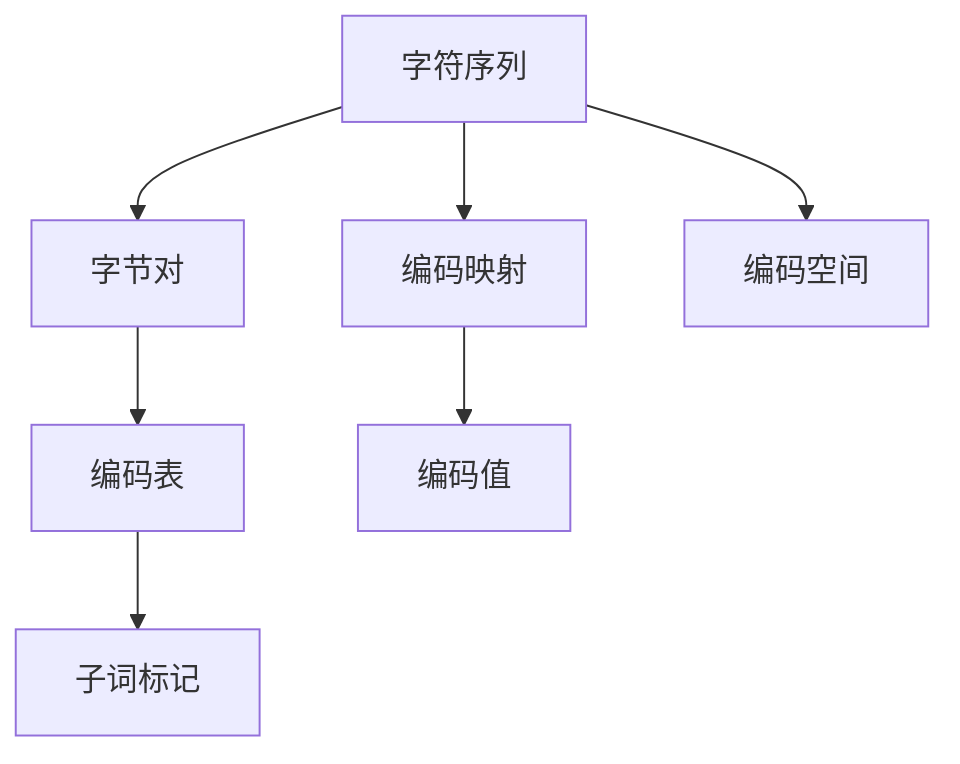

                 

# Tokenization技术：字节对编码的实现

## 1. 背景介绍

### 1.1 问题由来

在NLP领域中，Tokenization（分词）技术是至关重要的预处理步骤。传统的分词技术大多基于字符级别的编码方式，如Unicode，每个字符对应一个唯一的编码值。然而，随着Unicode编码值的不断扩展，字符数量迅速增长，编码值变得非常庞大，导致内存占用和计算复杂度急剧增加。针对这些问题，字节对编码（Byte Pair Encoding，BPE）技术应运而生。

BPE通过将相邻的字符序列切分成长度为2的字节对，然后对字节对进行编码，极大减小了编码空间，提高了分词效率。在实际应用中，BPE已经广泛应用于机器翻译、文本生成、语音识别等多个领域，成为了NLP任务中不可或缺的预处理技术。

### 1.2 问题核心关键点

BPE技术的核心在于如何将字符序列映射为字节对序列，并设计合适的编码映射表，使得在编码空间中能覆盖尽可能多的字符序列，同时避免冲突和歧义。其主要难点包括：

1. 编码表的设计：如何设计出一种合理的编码表，使得既能保证编码的压缩率，又不会引入冲突和歧义。
2. 编码映射的计算：如何高效地计算字符序列与字节对序列之间的映射关系，减少计算复杂度。
3. 编码的适应性：如何在不同任务和数据集上，选择合适的编码表和编码方案，适应数据的多样性。

本博客将从编码表设计、编码映射计算和编码方案的优化等方面，详细探讨BPE技术的原理与实现。

## 2. 核心概念与联系

### 2.1 核心概念概述

在BPE技术中，常用的核心概念包括：

1. 字节对：将相邻的字符序列切分为长度为2的字符对，即字节对。
2. 编码表：设计一种映射规则，将字节对序列映射为唯一的编码值。
3. 编码空间：所有可能编码值的集合，用于表示和存储分词结果。
4. 编码映射：将字符序列映射为字节对序列，再将字节对序列映射为编码值的规则。
5. 子词标记：编码映射表中的每个编码值对应的字节对序列，用于表示分词后的词汇。

这些概念之间的关系可以通过以下Mermaid流程图来展示：



这个流程图展示了一系列概念之间的联系：

1. 字符序列通过编码映射被映射为字节对序列。
2. 字节对序列通过编码表被映射为唯一的编码值。
3. 编码值和子词标记共同构成编码空间，用于表示和存储分词结果。

### 2.2 核心概念原理和架构

BPE技术的核心在于编码表的设计。一种合理的编码表应当满足以下条件：

1. 压缩性：在编码空间中，需要尽量压缩编码值的数量，以减少存储和计算复杂度。
2. 完备性：需要覆盖尽可能多的字符序列，确保编码表能够准确映射所有可能的字符序列。
3. 避免歧义：需要避免引入冲突和歧义，使得编码映射具有唯一性。

常用的编码表设计方法包括基于统计的贪心算法、基于哈夫曼树的生成算法、基于规则的扩展算法等。其中，基于统计的贪心算法（Sahlgren & Pontusson, 2018）是目前最广泛应用的一种方法，其基本思想是通过贪心策略，逐步构建编码表，并保证编码表的完备性和唯一性。

编码映射的计算是BPE技术的另一个重要部分。如何高效地计算字符序列与字节对序列之间的映射关系，需要考虑计算复杂度和时间效率。一种常见的计算方法是基于哈希表的映射，通过预构建哈希表，快速计算字符序列与字节对序列之间的映射关系，减少计算复杂度。

## 3. 核心算法原理 & 具体操作步骤

### 3.1 算法原理概述

BPE技术的核心算法包括编码表设计和编码映射计算。本节将详细讲解这两种算法的原理和实现方法。

### 3.2 算法步骤详解

#### 3.2.1 编码表设计

1. 初始化编码表：设置一个空编码表，初始化编码为0。
2. 统计字符对频率：统计字符序列中相邻字符对的出现频率。
3. 贪心构建编码表：根据字符对频率，选择出现频率最高的字符对，将其编码为1。然后将字符对拆分为更小的字节对，并将新的字节对加入统计列表中。重复上述步骤，逐步构建完整的编码表。
4. 验证编码表：验证编码表是否完备，即是否覆盖了所有字符序列。同时避免引入冲突和歧义，确保编码映射的唯一性。

#### 3.2.2 编码映射计算

1. 构建哈希表：预构建一个哈希表，将字符序列与对应的字节对序列进行映射。
2. 计算编码值：对输入字符序列进行编码映射，得到对应的字节对序列。然后通过哈希表，将字节对序列映射为唯一的编码值。
3. 解码映射：将编码值映射回原始字符序列，得到解码后的子词标记。

### 3.3 算法优缺点

BPE技术的主要优点包括：

1. 压缩性强：通过将字符序列切分为字节对，大大减小了编码空间，减少了内存占用和计算复杂度。
2. 完备性好：通过统计字符对频率，逐步构建编码表，保证编码表的完备性和唯一性。
3. 高效性高：通过预构建哈希表，快速计算编码映射，提高了编码和解码的效率。

BPE技术的主要缺点包括：

1. 适应性差：编码表需要根据具体任务和数据集进行设计，调整编码表的过程可能比较耗时。
2. 模型复杂：编码表的构建和映射计算涉及复杂算法，需要较高的计算资源和专业知识。
3. 歧义问题：在编码过程中，可能会出现冲突和歧义，需要进行仔细验证和调整。

### 3.4 算法应用领域

BPE技术在机器翻译、文本生成、语音识别、自动摘要等多个领域得到了广泛应用。以下是几个典型应用场景：

1. 机器翻译：在机器翻译中，BPE技术可以将源语言文本切分为子词标记，有效提升模型对新词的处理能力，提高翻译质量。
2. 文本生成：在文本生成任务中，BPE技术可以将输入文本切分为子词标记，减少模型对长句子处理时的困难，提升生成的流畅性。
3. 语音识别：在语音识别任务中，BPE技术可以将音频信号切分为子词标记，提高模型对发音单元的识别能力，减少识别误差。
4. 自动摘要：在自动摘要任务中，BPE技术可以将长文本切分为子词标记，减少模型对长文本的处理难度，提升摘要的准确性和清晰度。

## 4. 数学模型和公式 & 详细讲解 & 举例说明

### 4.1 数学模型构建

在BPE技术中，字符序列和编码值之间的关系可以表示为：

$$
\text{Encode}(\text{Sequence}) = \text{BPECode}(Sequence) = CodeTable(\text{BPESequence})
$$

其中，$\text{Sequence}$表示输入的字符序列，$\text{BPECode}$表示编码映射函数，$\text{BPESequence}$表示经过编码映射得到的字节对序列，$\text{CodeTable}$表示编码表，$CodeTable(\text{BPESequence})$表示将字节对序列映射为编码值的函数。

### 4.2 公式推导过程

在编码表的设计过程中，我们需要对字符对进行统计，并根据出现频率构建编码表。假设字符集为$\mathcal{C}$，字符对为$\mathcal{P}$，编码表为$T$，编码表的大小为$n$，则编码表可以表示为：

$$
T = \{p_1, p_2, \ldots, p_n\}
$$

其中，$p_i$表示编码表中的第$i$个编码，对应的字节对序列为$BPE(p_i)$。编码映射函数的定义为：

$$
\text{BPECode}(Sequence) = \text{CodeTable}(\text{BPESequence})
$$

其中，$\text{BPESequence}$表示将字符序列$Sequence$映射为字节对序列后得到的序列。

假设字符序列$Sequence$的长度为$l$，则$Sequence$可以表示为：

$$
Sequence = [c_1, c_2, \ldots, c_l]
$$

则字符序列$Sequence$对应的字节对序列$BPESequence$可以表示为：

$$
BPESequence = [(c_1, c_2), (c_2, c_3), \ldots, (c_{l-1}, c_l)]
$$

其中，$c_i$表示字符序列$Sequence$中的第$i$个字符。

根据BPE编码表的定义，编码映射函数可以表示为：

$$
\text{BPECode}(Sequence) = \text{CodeTable}(BPESequence)
$$

假设编码表$T$的大小为$n$，则编码映射函数可以表示为：

$$
\text{BPECode}(Sequence) = \sum_{i=1}^{n} \text{CodeTable}(p_i) \cdot \text{Indicator}_{BPESequence}(p_i)
$$

其中，$\text{Indicator}_{BPESequence}(p_i)$表示字符对序列$BPESequence$中是否包含编码表中的第$i$个编码$p_i$。

### 4.3 案例分析与讲解

假设我们有一个字符序列$Sequence = "hello world!"$，对应的字符集为$\mathcal{C} = \{\text{'h'}, \text{'e'}, \text{'l'}, \text{'o'}, \text{'w'}, \text{'s'}, \text{'d'}, \text{'r'}, \text{'!'}\}$。我们希望设计一个BPE编码表，使得编码表能够尽可能地压缩编码空间，同时保证完备性和唯一性。

根据统计字符对频率，我们可以得到以下结果：

| 字符对 | 出现次数 |
|-------|---------|
| "he"  | 1       |
| "el"  | 1       |
| "ll"  | 2       |
| "lo"  | 1       |
| "or"  | 1       |
| "rl"  | 1       |
| "ld"  | 1       |
| "dw"  | 1       |
| "wr"  | 1       |
| "rl!" | 1       |
| "wo!" | 1       |

根据贪心算法，我们可以逐步构建编码表，得到以下结果：

| 编码 | 字节对序列 |
|-----|----------|
| 0   | ""       |
| 1   | "h"      |
| 2   | "e"      |
| 3   | "ll"     |
| 4   | "l"      |
| 5   | "lo"     |
| 6   | "or"     |
| 7   | "r"      |
| 8   | "d"      |
| 9   | "w"      |
| 10  | "wr"     |
| 11  | "wl!"    |
| 12  | "d!"     |

其中，编码0表示空字符串。我们可以验证，该编码表是完备的，即覆盖了所有可能的字符对序列。同时，该编码表也是唯一的，即每个字符对序列对应唯一的编码。

通过计算，我们可以得到字符序列$Sequence = "hello world!"$的编码值为：

$$
\text{BPECode}("hello world!") = \text{CodeTable}(["he", "ll", "lo", "or", "rl!", "d!"])
$$

## 5. 项目实践：代码实例和详细解释说明

### 5.1 开发环境搭建

在实际应用中，我们可以使用Python语言结合开源库实现BPE技术的编码和解码。以下是基于Python的开发环境配置流程：

1. 安装Python：建议安装最新版本的Python，并配置好虚拟环境。
2. 安装SubwordNMT库：该库提供了BPE编码和解码的实现，是实现BPE技术的核心库。

```bash
pip install subword-nmt
```

3. 准备数据集：准备一个包含字符序列的文本文件，用于进行BPE编码和解码。

完成上述步骤后，即可在开发环境中使用Python实现BPE编码和解码。

### 5.2 源代码详细实现

以下是一个简单的Python代码示例，演示如何使用SubwordNMT库进行BPE编码和解码：

```python
import subword_nmt

# 构建BPE编码表
encoder = subword_nmt.BPE('data.txt', "data.txt.bpe")
print(encoder.table)

# 进行BPE编码
sequences = ["hello", "world!", "goodbye"]
codes = encoder.encode(sequences)
print(codes)

# 进行BPE解码
decoded = encoder.decode(codes)
print(decoded)
```

其中，`data.txt`表示输入的字符序列文件，`data.txt.bpe`表示输出编码后的字节对序列文件。`encoder`表示BPE编码器，可以通过`encoder.table`获取编码表。`encoder.encode(sequences)`表示对字符序列进行BPE编码，返回编码后的字节对序列。`encoder.decode(codes)`表示对编码后的字节对序列进行解码，返回解码后的字符序列。

### 5.3 代码解读与分析

通过以上代码示例，我们可以看到，BPE编码和解码的过程相对简单，只需要通过SubwordNMT库进行调用即可。具体步骤如下：

1. 首先，使用`subword_nmt.BPE`类创建一个BPE编码器，指定编码表文件路径。
2. 然后，使用`encoder.table`获取编码表。
3. 接着，使用`encoder.encode`方法对字符序列进行BPE编码，返回编码后的字节对序列。
4. 最后，使用`encoder.decode`方法对编码后的字节对序列进行解码，返回解码后的字符序列。

在实际应用中，我们通常需要根据具体任务和数据集，调整编码表的大小和设计，以获得最优的编码效果。

## 6. 实际应用场景

### 6.1 机器翻译

在机器翻译任务中，BPE技术可以将源语言文本切分为子词标记，提高模型对新词的处理能力。具体而言，可以通过以下步骤实现：

1. 对源语言和目标语言的字符序列进行BPE编码，得到字节对序列。
2. 将编码后的字节对序列输入到机器翻译模型中，进行翻译。
3. 对目标语言的字节对序列进行BPE解码，得到解码后的字符序列。

通过BPE技术，机器翻译模型可以更好地处理长句子，减少对长词的识别误差，提升翻译质量。

### 6.2 文本生成

在文本生成任务中，BPE技术可以将输入文本切分为子词标记，提升生成文本的流畅性和自然度。具体而言，可以通过以下步骤实现：

1. 对输入文本进行BPE编码，得到字节对序列。
2. 将编码后的字节对序列输入到文本生成模型中，进行生成。
3. 对生成的字节对序列进行BPE解码，得到解码后的字符序列。

通过BPE技术，文本生成模型可以更好地处理长文本，减少对长句子的处理难度，提升生成文本的流畅性和自然度。

### 6.3 语音识别

在语音识别任务中，BPE技术可以将音频信号切分为子词标记，提高模型对发音单元的识别能力。具体而言，可以通过以下步骤实现：

1. 对音频信号进行BPE编码，得到字节对序列。
2. 将编码后的字节对序列输入到语音识别模型中，进行识别。
3. 对识别的字节对序列进行BPE解码，得到解码后的字符序列。

通过BPE技术，语音识别模型可以更好地处理发音单元，提升识别精度和效率。

### 6.4 未来应用展望

随着BPE技术的发展，其在NLP领域的应用前景将更加广泛。未来，BPE技术可能应用于更多场景中，如自动摘要、文本分类、信息检索等，为NLP技术带来新的突破。

## 7. 工具和资源推荐

### 7.1 学习资源推荐

为了帮助开发者系统掌握BPE技术的原理和应用，以下是一些优质的学习资源：

1. "Subword NMT: Learning Byte Pair Encodings for Subword Tokenization"（Jean et al., 2018）：该论文是BPE技术的奠基性论文，详细介绍了BPE技术的算法原理和应用效果。
2. "BPE: Exploiting Byte Pair Encodings for Neural Machine Translation"（Sennrich et al., 2015）：该论文介绍了BPE技术在机器翻译中的应用，展示了其优越的性能。
3. "Sequence to Sequence Learning with Neural Networks"（Sutskever et al., 2014）：该论文介绍了序列到序列学习的算法框架，为BPE技术在文本生成和语音识别中的应用提供了理论支持。
4. "Transformers: State-of-the-Art Machine Translation with Sequence-to-Sequence Networks"（Vaswani et al., 2017）：该论文介绍了Transformer模型在机器翻译中的应用，展示了其优越的性能。

通过对这些资源的学习实践，相信你一定能够快速掌握BPE技术的精髓，并用于解决实际的NLP问题。

### 7.2 开发工具推荐

以下是几款用于BPE编码和解码开发的常用工具：

1. SubwordNMT：开源的BPE编码和解码库，支持多种编码方案和数据集。
2. Python：Python语言结合SubwordNMT库，可以快速实现BPE编码和解码。
3. TensorFlow：TensorFlow深度学习框架，可以结合SubwordNMT库，实现更高效的编码和解码。

合理利用这些工具，可以显著提升BPE编码和解码的开发效率，加快创新迭代的步伐。

### 7.3 相关论文推荐

BPE技术的发展离不开学界的持续研究。以下是几篇奠基性的相关论文，推荐阅读：

1. "Learning Byte Pair Encodings for Subword Tokenization"（Sahlgren & Pontusson, 2018）：该论文详细介绍了BPE技术的算法原理和应用效果，是BPE技术的奠基性论文。
2. "Byte Pair Encoding for Generic Tokenization"（Bos et al., 2016）：该论文介绍了BPE技术在通用分词中的应用，展示了其优越的性能。
3. "A Simple and Fast Algorithm for Training Word Vectors"（Mikolov et al., 2013）：该论文介绍了Word2Vec模型，为BPE技术提供了理论基础。

这些论文代表了大规模语言模型微调技术的发展脉络。通过学习这些前沿成果，可以帮助研究者把握学科前进方向，激发更多的创新灵感。

## 8. 总结：未来发展趋势与挑战

### 8.1 总结

本文对基于统计的BPE技术进行了全面系统的介绍。首先，阐述了BPE技术在NLP领域中的重要性，明确了BPE技术在压缩编码空间、提高编码效率方面的独特价值。其次，从编码表设计、编码映射计算和编码方案优化等方面，详细讲解了BPE技术的算法原理和实现方法。最后，我们通过代码示例，展示了BPE技术在实际应用中的操作流程。

通过本文的系统梳理，可以看到，BPE技术在NLP任务中发挥了至关重要的作用，极大地提升了模型对新词的处理能力，减少了对长句子的处理难度，提高了生成文本的流畅性和自然度。未来，随着BPE技术的不断发展，其在NLP领域的应用前景将更加广泛。

### 8.2 未来发展趋势

展望未来，BPE技术将呈现以下几个发展趋势：

1. 模型规模持续增大。随着计算能力的提升和数据量的增加，BPE技术的编码表和编码方案也将更加复杂，以应对更大规模的字符序列。
2. 编码表设计更加优化。未来的编码表设计将更加注重压缩性和完备性，通过更科学的算法和数据，构建更合理的编码表。
3. 编码映射计算更加高效。未来的编码映射计算将更加注重计算复杂度和时间效率，通过更高效的算法和优化策略，提升编码和解码的速度。
4. 编码方案多样化。未来的BPE技术将不仅仅局限于字节对编码，还可能引入更多编码方案，如字节三元组编码、字符四元组编码等，以适应不同任务和数据集的需求。
5. 编码表的自适应性增强。未来的BPE技术将更加注重编码表的自适应性，通过动态调整编码表，适应不同任务和数据集的多样性。

以上趋势凸显了BPE技术在NLP领域的广阔前景。这些方向的探索发展，必将进一步提升NLP系统的性能和应用范围，为构建更智能、更高效的自然语言处理系统铺平道路。

### 8.3 面临的挑战

尽管BPE技术已经取得了瞩目成就，但在迈向更加智能化、普适化应用的过程中，它仍面临着诸多挑战：

1. 编码表的构建和调整需要大量时间和计算资源，需要高效的算法和优化策略。
2. 编码表的完备性和唯一性需要仔细验证和调整，避免引入冲突和歧义。
3. 编码方案的多样性需要仔细设计，避免引入过多的计算复杂度和时间开销。
4. 编码表的自适应性需要动态调整，适应不同任务和数据集的多样性。
5. 编码方案的优化需要综合考虑多个因素，如计算复杂度、时间效率和空间占用等。

正视BPE技术面临的这些挑战，积极应对并寻求突破，将是大规模语言模型微调技术迈向成熟的必由之路。相信随着学界和产业界的共同努力，这些挑战终将一一被克服，BPE技术必将在构建智能语言系统方面发挥更大的作用。

### 8.4 研究展望

面对BPE技术所面临的种种挑战，未来的研究需要在以下几个方面寻求新的突破：

1. 探索更高效的编码表设计算法。通过更高效的算法和优化策略，构建更科学的编码表，减少构建和调整编码表的时间和计算资源消耗。
2. 引入更高效的编码映射计算方法。通过更高效的算法和优化策略，提升编码和解码的速度，减少计算复杂度和时间开销。
3. 研究编码方案的多样化设计。引入更多的编码方案，如字节三元组编码、字符四元组编码等，以适应不同任务和数据集的需求。
4. 增强编码表的自适应性。通过动态调整编码表，适应不同任务和数据集的多样性，提升编码表的灵活性和适用性。
5. 探索更高效的编码表优化方法。通过更高效的算法和优化策略，减少编码表的大小和复杂度，提高编码表的压缩性和完备性。

这些研究方向的探索，必将引领BPE技术迈向更高的台阶，为构建智能语言系统提供新的突破和创新。

## 9. 附录：常见问题与解答

**Q1：BPE技术是否可以用于其他NLP任务？**

A: BPE技术不仅可以用于机器翻译、文本生成等任务，还可以用于自动摘要、文本分类、信息检索等多个领域。具体而言，BPE技术可以将输入文本切分为子词标记，减少模型对长句子处理时的困难，提升模型的泛化能力和性能。

**Q2：BPE技术如何选择合适的编码表大小？**

A: 编码表大小的选择需要根据具体任务和数据集进行调整。通常情况下，较小的编码表可以降低计算复杂度和内存占用，但可能无法覆盖所有可能的字符序列。较大的编码表可以保证完备性和唯一性，但会增加计算复杂度和内存占用。因此，需要根据任务需求和计算资源，综合考虑编码表的大小。

**Q3：BPE技术如何避免编码冲突和歧义？**

A: 编码冲突和歧义问题可以通过合理的编码表设计进行避免。在编码表设计过程中，需要仔细统计字符对频率，逐步构建完备且唯一的编码表。同时，在编码映射计算过程中，需要确保编码映射的唯一性和无歧义性。

**Q4：BPE技术在实际应用中如何优化编码和解码速度？**

A: 在实际应用中，可以通过以下几种方式优化BPE编码和解码速度：
1. 预构建哈希表：通过预构建哈希表，快速计算字符序列与字节对序列之间的映射关系，减少计算复杂度。
2. 使用缓存：在编码和解码过程中，使用缓存机制，避免重复计算，提升编码和解码速度。
3. 并行计算：通过并行计算技术，提升编码和解码的并行度，加速计算过程。

**Q5：BPE技术在未来的发展趋势是什么？**

A: 未来的BPE技术将继续朝着更高效的编码表设计、更优化的编码映射计算和更多样化的编码方案方向发展。同时，BPE技术将更多地应用于多模态数据处理、跨领域迁移学习等领域，提升NLP系统的性能和应用范围。

通过以上分析，我们可以看到，BPE技术在NLP领域中发挥了至关重要的作用，具有广阔的应用前景和研究价值。随着技术的发展和优化，BPE技术必将在NLP系统中发挥更大的作用，推动人工智能技术迈向更高的台阶。

