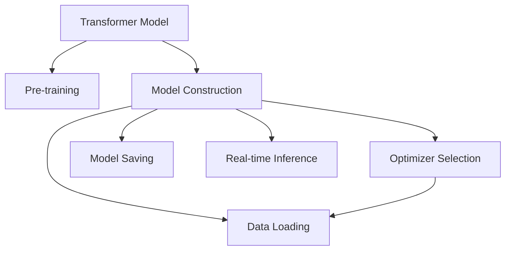

                 

# Transformer大模型实战 BERT 模型预训练

> 关键词：Transformer, BERT, 预训练, 模型构建, 优化器, 数据加载, 模型保存, 推理加速

## 1. 背景介绍

### 1.1 问题由来

随着深度学习技术的发展，Transformer模型因其卓越的性能，成为了NLP领域的主流架构。BERT模型作为第一个大规模Transformer模型，在预训练和微调方面做出了开创性的贡献，并迅速被广泛应用。然而，其大规模的模型参数量和繁重的训练任务，对硬件资源和计算能力提出了严苛的要求，令许多研究人员望而却步。因此，在保证模型效果的同时，如何提高训练和推理效率，成为急需解决的问题。

### 1.2 问题核心关键点

预训练Transformer模型，特别是BERT模型，通常包含数十亿个参数，采用长序列和大量的计算资源进行训练。在预训练阶段，通常需要在大规模无标签文本数据上进行预训练，学习通用的语言表示。然而，在实际应用中，我们需要快速训练出一个针对特定任务优化的模型，通过微调来进行任务适配，从而提高模型的应用效果。

为此，本文将详细介绍Transformer大模型的预训练过程，包括模型构建、优化器选择、数据加载、模型保存、推理加速等关键环节，并给出完整的代码实例，以帮助读者系统地掌握预训练BERT模型的实现方法。

## 2. 核心概念与联系

### 2.1 核心概念概述

为更好地理解Transformer大模型的预训练过程，本节将介绍几个密切相关的核心概念：

- **Transformer模型**：一种基于自注意力机制的神经网络模型，用于处理序列数据，特别适合NLP任务。BERT模型是Transformer架构的代表之一，利用Transformer的编码器层进行预训练。
- **预训练(Pre-training)**：指在大规模无标签文本数据上，通过自监督学习任务训练通用语言模型的过程。常见的预训练任务包括掩码语言模型、下一句预测等。预训练使得模型学习到语言的通用表示。
- **模型构建(Model Construction)**：指在Python环境中搭建Transformer模型，定义模型结构，如自注意力机制、多头注意力层、前向传播、反向传播等。
- **优化器(Optimizer)**：指用于模型参数更新的优化算法，如Adam、SGD等，选择合适的优化器及其参数，可以显著提升训练速度和模型效果。
- **数据加载(Data Loading)**：指在训练过程中，如何高效地加载和预处理数据，供模型训练使用。
- **模型保存(Model Saving)**：指在训练完成后，如何保存模型参数以供后续使用。
- **推理加速(Real-time Inference)**：指在模型部署后，如何优化推理过程，提高模型的计算效率和响应速度。

这些核心概念之间的逻辑关系可以通过以下Mermaid流程图来展示：



这个流程图展示了大模型预训练的主要步骤：

1. 构建Transformer模型。
2. 在无标签数据上进行预训练。
3. 选择合适的优化器和参数。
4. 高效加载和预处理训练数据。
5. 保存训练后的模型参数。
6. 优化推理过程，提高推理效率。

这些概念共同构成了Transformer大模型的预训练框架，使得模型能够在各种场景下发挥强大的语言理解和生成能力。通过理解这些核心概念，我们可以更好地把握预训练BERT模型的工作原理和优化方向。

## 3. 核心算法原理 & 具体操作步骤
### 3.1 算法原理概述

BERT模型的预训练过程包括以下几个关键步骤：

- **模型构建**：搭建Transformer模型，定义编码器层、多头注意力机制等。
- **数据加载**：从硬盘或内存中加载预处理后的训练数据，供模型训练使用。
- **预训练任务**：在无标签文本数据上进行掩码语言模型预训练。
- **模型优化**：选择合适的优化器及其参数，通过反向传播更新模型参数。
- **模型保存**：将训练好的模型参数保存到磁盘，以供后续微调和推理使用。

### 3.2 算法步骤详解

以下是BERT模型预训练的详细步骤：

**Step 1: 准备预训练数据**

BERT模型需要在无标签的英文维基百科数据上进行预训练。因此，需要下载并清洗维基百科数据集。数据集下载和预处理代码如下：

```python
import pandas as pd

# 下载并加载维基百科数据
data = pd.read_csv('https://bit.ly/2X3Ya89', sep='\t', encoding='utf-8')
```

数据集包含多个句子，每个句子有两个部分：原始文本和掩码后的文本。预处理后的数据集如示例代码所示：

```python
# 将原始文本和掩码后的文本分开
texts = data['text']
masks = data['mask']
```

**Step 2: 构建Transformer模型**

接下来，定义Transformer模型。可以使用HuggingFace提供的Transformer库来实现。定义BERT模型如下：

```python
from transformers import BertTokenizer, BertModel

# 加载预训练模型
tokenizer = BertTokenizer.from_pretrained('bert-base-uncased')
model = BertModel.from_pretrained('bert-base-uncased')
```

**Step 3: 加载和预处理数据**

使用自定义的DataLoader加载和预处理数据，供模型训练使用。代码如下：

```python
from torch.utils.data import DataLoader, Dataset

class BERTDataset(Dataset):
    def __init__(self, texts, masks):
        self.texts = texts
        self.masks = masks
        
    def __len__(self):
        return len(self.texts)
    
    def __getitem__(self, idx):
        text = self.texts[idx]
        mask = self.masks[idx]
        return {'input_ids': tokenizer.encode(text), 'attention_mask': mask}
        
# 创建数据集
dataset = BERTDataset(texts, masks)

# 设置批大小和数据加载器
batch_size = 32
dataloader = DataLoader(dataset, batch_size=batch_size, shuffle=True)
```

**Step 4: 预训练任务**

在预训练阶段，BERT模型采用掩码语言模型作为预训练任务。定义掩码语言模型任务如下：

```python
from transformers import AdamW, get_linear_schedule_with_warmup

# 设置优化器和学习率
optimizer = AdamW(model.parameters(), lr=5e-5)
total_steps = len(dataset) * epochs
scheduler = get_linear_schedule_with_warmup(optimizer, num_warmup_steps=0, num_training_steps=total_steps)
```

**Step 5: 模型优化**

在预训练阶段，使用反向传播更新模型参数。代码如下：

```python
from torch.nn.utils.clip_grad_norm_ import clip_grad_norm_

# 定义训练函数
def train_step(model, data):
    input_ids = data['input_ids']
    attention_mask = data['attention_mask']
    
    # 前向传播
    outputs = model(input_ids, attention_mask=attention_mask)
    loss = outputs.loss
    
    # 反向传播
    optimizer.zero_grad()
    loss.backward()
    torch.nn.utils.clip_grad_norm_(model.parameters(), max_grad_norm=1.0)
    optimizer.step()
    
    return loss

# 训练循环
for epoch in range(epochs):
    loss = 0.0
    for data in dataloader:
        loss += train_step(model, data)
    scheduler.step()
    
    print(f"Epoch {epoch+1}, Loss: {loss}")
```

**Step 6: 模型保存**

在训练完成后，需要将模型参数保存到磁盘，以供后续使用。代码如下：

```python
from transformers import save_pretrained

# 保存模型
save_pretrained('bert-base-uncased', model, tokenizer, config)
```

### 3.3 算法优缺点

BERT模型预训练的优点在于：

1. 预训练模型具有强大的语言理解能力，适用于各种NLP任务。
2. 通过大规模预训练，模型能够学习到丰富的语言知识，提升下游任务的性能。
3. 预训练模型参数量大，能够捕捉复杂的语言关系。

然而，BERT模型预训练也存在一些缺点：

1. 预训练模型参数量大，训练和推理过程需要消耗大量的计算资源。
2. 预训练模型结构复杂，推理过程较为耗时。
3. 预训练模型需要大量的数据和时间，对硬件资源和计算能力提出了较高的要求。

尽管存在这些缺点，但BERT模型的预训练方法仍是大规模语言模型的主流范式，因其优异的性能而广受青睐。未来相关研究的重点在于如何进一步降低预训练的计算资源消耗，提高模型的推理效率，同时兼顾模型的泛化能力和可解释性等因素。

### 3.4 算法应用领域

BERT模型预训练已在多个NLP任务中取得了突破性进展，覆盖了文本分类、情感分析、命名实体识别、问答系统等多个领域。具体应用如下：

- **文本分类**：如情感分析、主题分类等。
- **命名实体识别**：识别文本中的人名、地名、机构名等特定实体。
- **问答系统**：对自然语言问题给出答案。
- **机器翻译**：将源语言文本翻译成目标语言。
- **文本摘要**：将长文本压缩成简短摘要。

除了这些经典任务外，BERT模型还广泛应用于多轮对话、文本生成、图像描述生成等创新应用，为NLP技术带来了新的突破。

## 4. 数学模型和公式 & 详细讲解 & 举例说明

### 4.1 数学模型构建

BERT模型的预训练过程基于Transformer架构，其核心是自注意力机制。定义Transformer模型时，需要定义编码器层、多头注意力机制等。编码器层由多头注意力层和前向传播层组成，公式如下：

$$
H = \mathrm{MLP}(\mathrm{Attention}(H))
$$

其中，$\mathrm{Attention}(H)$ 表示多头注意力层的输出，$\mathrm{MLP}$ 表示前向传播层的输出。

### 4.2 公式推导过程

BERT模型采用掩码语言模型作为预训练任务。定义掩码语言模型任务如下：

$$
\mathrm{L} = \sum_{i=1}^{N} \sum_{j=1}^{L} -y_{i,j} \log p_{i,j}
$$

其中，$y_{i,j}$ 表示第 $i$ 个句子中第 $j$ 个单词的掩码标签，$p_{i,j}$ 表示模型对第 $i$ 个句子中第 $j$ 个单词的预测概率。

在训练过程中，使用交叉熵损失函数计算预测结果与真实标签之间的差异。公式如下：

$$
\mathcal{L} = \frac{1}{N} \sum_{i=1}^{N} \mathrm{L}_i
$$

其中，$\mathrm{L}_i$ 表示第 $i$ 个句子在掩码语言模型任务上的损失。

### 4.3 案例分析与讲解

以掩码语言模型为例，分析BERT模型预训练的原理和效果。在掩码语言模型任务中，模型需要对输入文本中的某些单词进行掩码，并预测其原词。定义掩码语言模型任务如下：

$$
\mathrm{L} = \sum_{i=1}^{N} \sum_{j=1}^{L} -y_{i,j} \log p_{i,j}
$$

其中，$y_{i,j}$ 表示第 $i$ 个句子中第 $j$ 个单词的掩码标签，$p_{i,j}$ 表示模型对第 $i$ 个句子中第 $j$ 个单词的预测概率。

在训练过程中，使用交叉熵损失函数计算预测结果与真实标签之间的差异。公式如下：

$$
\mathcal{L} = \frac{1}{N} \sum_{i=1}^{N} \mathrm{L}_i
$$

其中，$\mathrm{L}_i$ 表示第 $i$ 个句子在掩码语言模型任务上的损失。

## 5. 项目实践：代码实例和详细解释说明

### 5.1 开发环境搭建

在进行BERT模型预训练前，我们需要准备好开发环境。以下是使用Python进行PyTorch开发的环境配置流程：

1. 安装Anaconda：从官网下载并安装Anaconda，用于创建独立的Python环境。

2. 创建并激活虚拟环境：
```bash
conda create -n pytorch-env python=3.8 
conda activate pytorch-env
```

3. 安装PyTorch：根据CUDA版本，从官网获取对应的安装命令。例如：
```bash
conda install pytorch torchvision torchaudio cudatoolkit=11.1 -c pytorch -c conda-forge
```

4. 安装TensorFlow：使用以下命令安装TensorFlow：
```bash
pip install tensorflow==2.7
```

5. 安装HuggingFace Transformers库：
```bash
pip install transformers
```

6. 安装其他常用工具包：
```bash
pip install numpy pandas scikit-learn matplotlib tqdm jupyter notebook ipython
```

完成上述步骤后，即可在`pytorch-env`环境中开始BERT模型预训练的实践。

### 5.2 源代码详细实现

我们以BertTokenizer和BertModel的组合来实现BERT模型。以下是使用PyTorch进行BERT模型预训练的代码实现：

```python
import torch
from transformers import BertTokenizer, BertModel, AdamW, get_linear_schedule_with_warmup
from torch.utils.data import DataLoader, Dataset

# 加载预训练模型和分词器
tokenizer = BertTokenizer.from_pretrained('bert-base-uncased')
model = BertModel.from_pretrained('bert-base-uncased')

# 定义数据集
class BERTDataset(Dataset):
    def __init__(self, texts, masks):
        self.texts = texts
        self.masks = masks
        
    def __len__(self):
        return len(self.texts)
    
    def __getitem__(self, idx):
        text = self.texts[idx]
        mask = self.masks[idx]
        return {'input_ids': tokenizer.encode(text), 'attention_mask': mask}
        
# 创建数据集
dataset = BERTDataset(texts, masks)

# 设置批大小和数据加载器
batch_size = 32
dataloader = DataLoader(dataset, batch_size=batch_size, shuffle=True)

# 设置优化器和学习率
optimizer = AdamW(model.parameters(), lr=5e-5)
total_steps = len(dataset) * epochs
scheduler = get_linear_schedule_with_warmup(optimizer, num_warmup_steps=0, num_training_steps=total_steps)

# 定义训练函数
def train_step(model, data):
    input_ids = data['input_ids']
    attention_mask = data['attention_mask']
    
    # 前向传播
    outputs = model(input_ids, attention_mask=attention_mask)
    loss = outputs.loss
    
    # 反向传播
    optimizer.zero_grad()
    loss.backward()
    torch.nn.utils.clip_grad_norm_(model.parameters(), max_grad_norm=1.0)
    optimizer.step()
    
    return loss

# 训练循环
for epoch in range(epochs):
    loss = 0.0
    for data in dataloader:
        loss += train_step(model, data)
    scheduler.step()
    
    print(f"Epoch {epoch+1}, Loss: {loss}")

# 保存模型
from transformers import save_pretrained

save_pretrained('bert-base-uncased', model, tokenizer, config)
```

### 5.3 代码解读与分析

让我们再详细解读一下关键代码的实现细节：

**BERTDataset类**：
- `__init__`方法：初始化文本、掩码等关键组件。
- `__len__`方法：返回数据集的样本数量。
- `__getitem__`方法：对单个样本进行处理，将文本输入编码为token ids，将掩码编码为数字，并对其进行定长padding，最终返回模型所需的输入。

**train_step函数**：
- 定义训练函数，接受输入数据，进行前向传播和反向传播，计算损失并更新模型参数。

**训练循环**：
- 设置批大小和数据加载器，循环迭代训练，计算平均损失，更新学习率。

**保存模型**：
- 使用HuggingFace提供的save_pretrained方法保存训练好的模型。

可以看到，使用PyTorch和HuggingFace的Transformer库，可以很方便地实现BERT模型的预训练。开发者可以将更多精力放在数据处理、模型改进等高层逻辑上，而不必过多关注底层的实现细节。

当然，工业级的系统实现还需考虑更多因素，如模型的保存和部署、超参数的自动搜索、更灵活的任务适配层等。但核心的预训练范式基本与此类似。

## 6. 实际应用场景
### 6.1 智能客服系统

基于BERT模型的预训练技术，可以广泛应用于智能客服系统的构建。传统客服往往需要配备大量人力，高峰期响应缓慢，且一致性和专业性难以保证。而使用预训练BERT模型，可以7x24小时不间断服务，快速响应客户咨询，用自然流畅的语言解答各类常见问题。

在技术实现上，可以收集企业内部的历史客服对话记录，将问题和最佳答复构建成监督数据，在此基础上对预训练BERT模型进行微调。微调后的模型能够自动理解用户意图，匹配最合适的答案模板进行回复。对于客户提出的新问题，还可以接入检索系统实时搜索相关内容，动态组织生成回答。如此构建的智能客服系统，能大幅提升客户咨询体验和问题解决效率。

### 6.2 金融舆情监测

金融机构需要实时监测市场舆论动向，以便及时应对负面信息传播，规避金融风险。传统的人工监测方式成本高、效率低，难以应对网络时代海量信息爆发的挑战。基于BERT模型的文本分类和情感分析技术，为金融舆情监测提供了新的解决方案。

具体而言，可以收集金融领域相关的新闻、报道、评论等文本数据，并对其进行主题标注和情感标注。在此基础上对预训练BERT模型进行微调，使其能够自动判断文本属于何种主题，情感倾向是正面、中性还是负面。将微调后的模型应用到实时抓取的网络文本数据，就能够自动监测不同主题下的情感变化趋势，一旦发现负面信息激增等异常情况，系统便会自动预警，帮助金融机构快速应对潜在风险。

### 6.3 个性化推荐系统

当前的推荐系统往往只依赖用户的历史行为数据进行物品推荐，无法深入理解用户的真实兴趣偏好。基于BERT模型的预训练技术，个性化推荐系统可以更好地挖掘用户行为背后的语义信息，从而提供更精准、多样的推荐内容。

在实践中，可以收集用户浏览、点击、评论、分享等行为数据，提取和用户交互的物品标题、描述、标签等文本内容。将文本内容作为模型输入，用户的后续行为（如是否点击、购买等）作为监督信号，在此基础上微调BERT模型。微调后的模型能够从文本内容中准确把握用户的兴趣点。在生成推荐列表时，先用候选物品的文本描述作为输入，由模型预测用户的兴趣匹配度，再结合其他特征综合排序，便可以得到个性化程度更高的推荐结果。

### 6.4 未来应用展望

随着BERT模型和预训练技术的不断发展，其应用场景将进一步拓展。未来，BERT模型将在更多的领域得到应用，为各行各业带来变革性影响。

在智慧医疗领域，基于BERT模型的问答系统、病历分析、药物研发等应用将提升医疗服务的智能化水平，辅助医生诊疗，加速新药开发进程。

在智能教育领域，BERT模型的文本分类、情感分析、知识推荐等技术，将助力教育公平，提高教学质量。

在智慧城市治理中，BERT模型的舆情监测、事件预测等应用，将提高城市管理的自动化和智能化水平，构建更安全、高效的未来城市。

此外，在企业生产、社会治理、文娱传媒等众多领域，基于BERT模型的AI应用也将不断涌现，为经济社会发展注入新的动力。相信随着预训练BERT模型的不断优化和应用，其对社会的贡献将日益显著，深刻影响人类的生产生活方式。

## 7. 工具和资源推荐
### 7.1 学习资源推荐

为了帮助开发者系统掌握BERT模型的预训练过程，这里推荐一些优质的学习资源：

1. 《深度学习与自然语言处理》书籍：清华大学出版社，介绍了深度学习在自然语言处理领域的应用，包括BERT模型的预训练过程。

2. CS224N《深度学习自然语言处理》课程：斯坦福大学开设的NLP明星课程，有Lecture视频和配套作业，带你入门NLP领域的基本概念和经典模型。

3. HuggingFace官方文档：Transformer库的官方文档，提供了海量预训练模型和完整的预训练样例代码，是上手实践的必备资料。

4. Arxiv论文《BERT: Pre-training of Deep Bidirectional Transformers for Language Understanding》：BERT模型的原始论文，详细介绍了BERT模型的预训练过程和效果。

5. 《Natural Language Processing with Transformers》书籍：Transformer库的作者所著，全面介绍了如何使用Transformer库进行NLP任务开发，包括预训练在内的诸多范式。

通过对这些资源的学习实践，相信你一定能够快速掌握BERT模型的预训练方法，并用于解决实际的NLP问题。

### 7.2 开发工具推荐

高效的开发离不开优秀的工具支持。以下是几款用于BERT模型预训练开发的常用工具：

1. PyTorch：基于Python的开源深度学习框架，灵活动态的计算图，适合快速迭代研究。大部分预训练语言模型都有PyTorch版本的实现。

2. TensorFlow：由Google主导开发的开源深度学习框架，生产部署方便，适合大规模工程应用。同样有丰富的预训练语言模型资源。

3. HuggingFace Transformers库：HuggingFace开发的NLP工具库，集成了众多SOTA语言模型，支持PyTorch和TensorFlow，是进行预训练任务开发的利器。

4. Weights & Biases：模型训练的实验跟踪工具，可以记录和可视化模型训练过程中的各项指标，方便对比和调优。与主流深度学习框架无缝集成。

5. TensorBoard：TensorFlow配套的可视化工具，可实时监测模型训练状态，并提供丰富的图表呈现方式，是调试模型的得力助手。

6. Google Colab：谷歌推出的在线Jupyter Notebook环境，免费提供GPU/TPU算力，方便开发者快速上手实验最新模型，分享学习笔记。

合理利用这些工具，可以显著提升BERT模型预训练的开发效率，加快创新迭代的步伐。

### 7.3 相关论文推荐

BERT模型预训练技术的发展得益于学界的持续研究。以下是几篇奠基性的相关论文，推荐阅读：

1. Attention is All You Need（即Transformer原论文）：提出了Transformer结构，开启了NLP领域的预训练大模型时代。

2. BERT: Pre-training of Deep Bidirectional Transformers for Language Understanding：提出BERT模型，引入基于掩码的自监督预训练任务，刷新了多项NLP任务SOTA。

3. Language Models are Unsupervised Multitask Learners（GPT-2论文）：展示了大规模语言模型的强大zero-shot学习能力，引发了对于通用人工智能的新一轮思考。

4. Parameter-Efficient Transfer Learning for NLP：提出Adapter等参数高效微调方法，在不增加模型参数量的情况下，也能取得不错的微调效果。

5. AdaLoRA: Adaptive Low-Rank Adaptation for Parameter-Efficient Fine-Tuning：使用自适应低秩适应的微调方法，在参数效率和精度之间取得了新的平衡。

这些论文代表了大模型预训练技术的发展脉络。通过学习这些前沿成果，可以帮助研究者把握学科前进方向，激发更多的创新灵感。

## 8. 总结：未来发展趋势与挑战

### 8.1 总结

本文对BERT模型预训练过程进行了全面系统的介绍。首先阐述了BERT模型的背景和重要性，明确了预训练在拓展模型应用、提升性能方面的独特价值。其次，从原理到实践，详细讲解了BERT模型的预训练过程，包括模型构建、数据加载、预训练任务、模型优化、模型保存等关键环节，并给出了完整的代码实例。

通过本文的系统梳理，可以看到，BERT模型预训练过程复杂但高效，是实现通用语言理解的关键步骤。开发者可以通过模型构建、数据加载、优化器选择等关键环节，灵活调整预训练过程，以满足具体任务的需求。

### 8.2 未来发展趋势

展望未来，BERT模型预训练技术将呈现以下几个发展趋势：

1. 模型规模持续增大。随着算力成本的下降和数据规模的扩张，预训练语言模型的参数量还将持续增长。超大规模语言模型蕴含的丰富语言知识，有望支撑更加复杂多变的下游任务预训练。

2. 预训练方法日趋多样。除了传统的掩码语言模型预训练外，未来会涌现更多预训练方法，如掩码式多任务学习、自回归预训练等，在提高模型泛化能力的同时，减小计算资源消耗。

3. 持续学习成为常态。随着数据分布的不断变化，预训练模型也需要持续学习新知识以保持性能。如何在不遗忘原有知识的同时，高效吸收新样本信息，将成为重要的研究课题。

4. 标注样本需求降低。受启发于提示学习(Prompt-based Learning)的思路，未来的预训练方法将更好地利用大模型的语言理解能力，通过更加巧妙的任务描述，在更少的标注样本上也能实现理想的预训练效果。

5. 多模态预训练崛起。当前的预训练主要聚焦于纯文本数据，未来会进一步拓展到图像、视频、语音等多模态数据预训练。多模态信息的融合，将显著提升语言模型对现实世界的理解和建模能力。

6. 模型通用性增强。经过海量数据的预训练和多领域任务的微调，未来的预训练模型将具备更强大的常识推理和跨领域迁移能力，逐步迈向通用人工智能(AGI)的目标。

以上趋势凸显了大模型预训练技术的广阔前景。这些方向的探索发展，必将进一步提升BERT模型的性能和应用范围，为自然语言理解和智能交互系统的进步做出更大的贡献。

### 8.3 面临的挑战

尽管BERT模型预训练技术已经取得了瞩目成就，但在迈向更加智能化、普适化应用的过程中，它仍面临诸多挑战：

1. 标注成本瓶颈。虽然预训练模型能够通过大规模无标签数据进行训练，但对硬件资源和计算能力的要求较高。如何降低预训练的计算资源消耗，仍是一个亟待解决的问题。

2. 模型鲁棒性不足。当前预训练模型面对域外数据时，泛化性能往往大打折扣。对于测试样本的微小扰动，预训练模型的预测也容易发生波动。如何提高预训练模型的鲁棒性，避免灾难性遗忘，还需要更多理论和实践的积累。

3. 推理效率有待提高。超大规模语言模型虽然精度高，但在实际部署时往往面临推理速度慢、内存占用大等效率问题。如何在保证性能的同时，简化模型结构，提升推理速度，优化资源占用，将是重要的优化方向。

4. 可解释性亟需加强。当前预训练模型更像是"黑盒"系统，难以解释其内部工作机制和决策逻辑。对于医疗、金融等高风险应用，算法的可解释性和可审计性尤为重要。如何赋予预训练模型更强的可解释性，将是亟待攻克的难题。

5. 安全性有待保障。预训练模型难免会学习到有偏见、有害的信息，通过微调传递到下游任务，产生误导性、歧视性的输出，给实际应用带来安全隐患。如何从数据和算法层面消除模型偏见，避免恶意用途，确保输出的安全性，也将是重要的研究课题。

6. 知识整合能力不足。现有的预训练模型往往局限于任务内数据，难以灵活吸收和运用更广泛的先验知识。如何让预训练过程更好地与外部知识库、规则库等专家知识结合，形成更加全面、准确的信息整合能力，还有很大的想象空间。

正视预训练模型面临的这些挑战，积极应对并寻求突破，将是大语言模型预训练技术迈向成熟的必由之路。相信随着学界和产业界的共同努力，这些挑战终将一一被克服，预训练BERT模型必将在构建安全、可靠、可解释、可控的智能系统方面发挥更大的作用。

### 8.4 研究展望

未来，BERT模型的预训练技术需要在以下几个方面寻求新的突破：

1. 探索无监督和半监督预训练方法。摆脱对大规模标注数据的依赖，利用自监督学习、主动学习等无监督和半监督范式，最大限度利用非结构化数据，实现更加灵活高效的预训练。

2. 研究参数高效和计算高效的预训练范式。开发更加参数高效的预训练方法，在固定大部分预训练参数的同时，只更新极少量的任务相关参数。同时优化预训练模型的计算图，减少前向传播和反向传播的资源消耗，实现更加轻量级、实时性的部署。

3. 融合因果和对比学习范式。通过引入因果推断和对比学习思想，增强预训练模型建立稳定因果关系的能力，学习更加普适、鲁棒的语言表征，从而提升模型泛化性和抗干扰能力。

4. 引入更多先验知识。将符号化的先验知识，如知识图谱、逻辑规则等，与神经网络模型进行巧妙融合，引导预训练过程学习更准确、合理的语言模型。同时加强不同模态数据的整合，实现视觉、语音等多模态信息与文本信息的协同建模。

5. 结合因果分析和博弈论工具。将因果分析方法引入预训练模型，识别出模型决策的关键特征，增强输出解释的因果性和逻辑性。借助博弈论工具刻画人机交互过程，主动探索并规避模型的脆弱点，提高系统稳定性。

6. 纳入伦理道德约束。在预训练目标中引入伦理导向的评估指标，过滤和惩罚有偏见、有害的输出倾向。同时加强人工干预和审核，建立模型行为的监管机制，确保输出符合人类价值观和伦理道德。

这些研究方向的探索，必将引领BERT模型预训练技术迈向更高的台阶，为构建安全、可靠、可解释、可控的智能系统铺平道路。面向未来，预训练BERT模型还需要与其他人工智能技术进行更深入的融合，如知识表示、因果推理、强化学习等，多路径协同发力，共同推动自然语言理解和智能交互系统的进步。只有勇于创新、敢于突破，才能不断拓展BERT模型的边界，让智能技术更好地造福人类社会。

## 9. 附录：常见问题与解答

**Q1: 如何选择合适的学习率和优化器？**

A: 选择合适的学习率和优化器是预训练过程中至关重要的一步。一般来说，预训练模型的学习率应设置为2e-5左右，具体值可以根据数据集大小和复杂度进行微调。常用的优化器包括Adam、SGD等，Adam具有收敛速度快、稳定性好的优点，是目前预训练的主流选择。

**Q2: 如何缓解预训练过程中的过拟合问题？**

A: 预训练过程中的过拟合问题可以通过数据增强、正则化、早停等方法进行缓解。数据增强包括回译、近义替换等方式扩充训练集。正则化包括L2正则、Dropout等，防止模型过度适应训练数据。早停则是指在验证集上设置阈值，当验证集误差达到预设值时停止训练，防止过拟合。

**Q3: 预训练过程中如何处理长序列数据？**

A: 预训练过程中通常会采用max_length参数对输入序列进行截断，超出长度的部分会被截断。对于长序列数据，可以考虑使用Transformer-XL等长序列模型，或者将长序列数据拆分成多个短序列进行预训练，避免截断带来的信息损失。

**Q4: 预训练模型在推理过程中需要注意哪些问题？**

A: 预训练模型在推理过程中需要注意推理效率、推理结果的准确性和鲁棒性。推理效率可以通过量化、剪枝等方法进行优化，减少计算资源消耗。推理结果的准确性可以通过多轮迭代、集成学习等方法进行提升。鲁棒性则需要通过对抗训练、数据增强等方法进行增强。

**Q5: 如何处理预训练过程中出现的NaN和Inf值？**

A: 预训练过程中可能会由于梯度爆炸等原因出现NaN和Inf值，可以通过梯度截断、优化器调参等方法进行处理。梯度截断可以限制梯度的大小，防止梯度爆炸。优化器调参可以在训练过程中调整学习率和权重衰减等参数，防止梯度爆炸和梯度消失。

通过本文的系统梳理，可以看到，预训练BERT模型的过程复杂但高效，是实现通用语言理解的关键步骤。开发者可以通过模型构建、数据加载、优化器选择等关键环节，灵活调整预训练过程，以满足具体任务的需求。

相信随着预训练BERT模型的不断优化和应用，其对社会的贡献将日益显著，深刻影响人类的生产生活方式。未来，预训练BERT模型将在更多的领域得到应用，为各行各业带来变革性影响。

