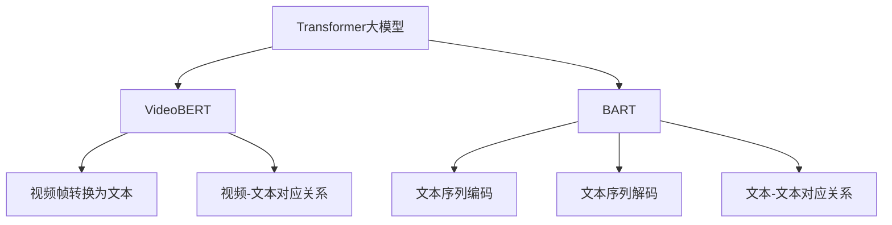

                 

# Transformer大模型实战 VideoBERT模型和BART模型

> 关键词：Transformer, VideoBERT, BART, 大模型, 微调, 迁移学习

## 1. 背景介绍

随着深度学习技术的不断发展，大语言模型（Large Language Models, LLMs）在自然语言处理（NLP）领域取得了突破性进展。这些模型通常基于自回归（如GPT）或自编码（如BERT）的Transformer架构，通过大规模预训练从海量文本数据中学习到语言表示和知识。虽然这些模型在通用语言理解和生成任务上表现出色，但它们在处理特定领域或特定类型的数据时效果可能不尽如人意。因此，如何利用这些大模型解决特定问题，成为了研究热点。

本文将聚焦于两种新兴的Transformer大模型——VideoBERT和BART模型，它们分别专注于视频文本和文本序列上的任务。通过详细阐述这两种模型的构建原理、微调步骤和实际应用，旨在帮助读者理解和应用这些大模型，以实现更高的准确性和更好的性能。

## 2. 核心概念与联系

### 2.1 核心概念概述

- **Transformer大模型**：基于Transformer架构的大规模预训练模型，如GPT、BERT、VideoBERT和BART。这些模型通过自监督学习任务从大量无标签数据中学习到通用语言或视频语言表示。

- **VideoBERT**：一种专为处理视频文本数据的Transformer大模型，能够将视频帧序列转换为文本形式，并从中学习到视频-文本对应关系。

- **BART**：一种基于Transformer的大模型，专注于文本序列上的任务，如文本摘要、问答、翻译等。它通过自编码器的方式，学习到文本序列的表示。

### 2.2 核心概念原理和架构的 Mermaid 流程图



这个流程图展示了Transformer大模型的核心组件及其相互关系：

1. **Transformer大模型**：作为通用架构，支持多种具体模型如GPT、BERT。
2. **VideoBERT**：通过特定的视频文本转换模块，学习视频-文本对应关系。
3. **BART**：专注于文本序列上的任务，通过自编码器学习文本表示。

## 3. 核心算法原理 & 具体操作步骤

### 3.1 算法原理概述

VideoBERT和BART模型都是基于Transformer架构的大模型，它们的核心原理可以概述如下：

- **VideoBERT**：利用视频帧序列，通过Transformer模型将其转换为文本形式，并通过预训练任务学习视频-文本对应关系。微调时，可以通过下游视频文本分类或视频摘要生成任务进行训练。

- **BART**：通过自编码器的方式，学习文本序列的表示。微调时，可以通过下游文本生成、文本分类、文本匹配等任务进行训练。

两种模型的微调过程基本相同，都是通过添加任务适配层、选择合适的优化器和学习率、设置正则化参数等步骤，利用下游任务的标注数据进行有监督微调。

### 3.2 算法步骤详解

**VideoBERT微调步骤**：

1. **数据准备**：准备视频帧序列和相应的文本描述，作为微调任务的训练集和验证集。

2. **模型初始化**：加载预训练的VideoBERT模型，并将其作为微调模型的初始化权重。

3. **任务适配层设计**：根据微调任务的需求，设计相应的任务适配层。例如，对于视频文本分类任务，可以添加一个全连接层进行分类；对于视频摘要生成任务，可以设计一个输出层用于生成摘要文本。

4. **设置优化器和学习率**：选择适当的优化器（如AdamW）和学习率，以避免过拟合和提高训练速度。

5. **训练过程**：将训练集数据分批次输入模型，前向传播计算损失函数，反向传播计算梯度，更新模型参数。

6. **评估和调整**：周期性在验证集上评估模型性能，根据评估结果调整学习率或其他超参数。

**BART微调步骤**：

1. **数据准备**：准备文本序列和相应的目标文本序列或分类标签，作为微调任务的训练集和验证集。

2. **模型初始化**：加载预训练的BART模型，并将其作为微调模型的初始化权重。

3. **任务适配层设计**：根据微调任务的需求，设计相应的任务适配层。例如，对于文本摘要任务，可以设计一个输出层用于生成摘要文本；对于文本分类任务，可以设计一个输出层用于分类。

4. **设置优化器和学习率**：选择适当的优化器（如AdamW）和学习率，以避免过拟合和提高训练速度。

5. **训练过程**：将训练集数据分批次输入模型，前向传播计算损失函数，反向传播计算梯度，更新模型参数。

6. **评估和调整**：周期性在验证集上评估模型性能，根据评估结果调整学习率或其他超参数。

### 3.3 算法优缺点

**VideoBERT的优点**：
- 能够处理视频文本数据，适用于视频描述、视频标注等任务。
- 利用Transformer架构，具备较强的语言建模能力。

**VideoBERT的缺点**：
- 对视频数据的依赖性强，可能难以处理视频背景信息等非文本信息。
- 需要更多的标注数据进行微调，且数据预处理复杂度较高。

**BART的优点**：
- 适用于多种文本序列任务，如文本摘要、问答、翻译等。
- 通过自编码器方式学习文本表示，具备较强的序列建模能力。

**BART的缺点**：
- 对文本序列的结构敏感，可能难以处理长文本或非线性序列。
- 微调时，需要设计合适的任务适配层，增加模型复杂度。

### 3.4 算法应用领域

**VideoBERT的应用领域**：
- 视频描述生成：为视频生成详细描述文本。
- 视频标注：为视频中的场景、物体等进行标注。
- 视频摘要：提取视频内容的关键信息生成摘要。

**BART的应用领域**：
- 文本摘要：自动生成新闻、文章等的摘要。
- 问答系统：根据问题自动生成答案。
- 翻译：将文本从一种语言翻译成另一种语言。
- 文本生成：自动生成文本，如生成对话、故事等。

## 4. 数学模型和公式 & 详细讲解 & 举例说明

### 4.1 数学模型构建

对于VideoBERT和BART模型，其数学模型构建大致相同，可以分别描述如下：

**VideoBERT的数学模型**：
- 输入视频帧序列 $X=\{x_1, x_2, ..., x_T\}$，其中每个 $x_t$ 表示一个视频帧。
- 输出文本序列 $Y=\{y_1, y_2, ..., y_{2T}\}$，其中每个 $y_t$ 表示一个视频帧对应的文本描述。
- 目标函数为最大化视频帧序列和文本序列之间的条件概率 $p(Y|X)$。

**BART的数学模型**：
- 输入文本序列 $X=\{x_1, x_2, ..., x_T\}$，其中每个 $x_t$ 表示一个文本。
- 输出文本序列 $Y=\{y_1, y_2, ..., y_{2T}\}$，其中每个 $y_t$ 表示目标文本序列或分类标签。
- 目标函数为最大化目标文本序列或分类标签的条件概率 $p(Y|X)$。

### 4.2 公式推导过程

**VideoBERT的公式推导**：
- 使用Transformer编码器将视频帧序列 $X$ 转换为文本表示 $H=\{h_1, h_2, ..., h_{2T}\}$。
- 使用自回归模型将文本表示 $H$ 转换为文本序列 $Y$。
- 通过交叉熵损失函数计算 $p(Y|X)$，目标函数为：
$$
\mathcal{L}(X, Y) = -\frac{1}{N}\sum_{i=1}^N \sum_{t=1}^{2T} y_i \log \hat{y}_i
$$

**BART的公式推导**：
- 使用Transformer编码器将文本序列 $X$ 转换为隐含表示 $H=\{h_1, h_2, ..., h_{2T}\}$。
- 使用自编码器将隐含表示 $H$ 解码为目标文本序列 $Y$。
- 通过交叉熵损失函数计算 $p(Y|X)$，目标函数为：
$$
\mathcal{L}(X, Y) = -\frac{1}{N}\sum_{i=1}^N \sum_{t=1}^{2T} y_i \log \hat{y}_i
$$

### 4.3 案例分析与讲解

以VideoBERT模型进行视频摘要生成为例，其训练过程如下：

1. **输入准备**：将视频帧序列 $X$ 和对应的文本描述 $Y$ 作为训练样本。
2. **模型初始化**：加载预训练的VideoBERT模型，并将其作为微调模型的初始化权重。
3. **任务适配层设计**：添加一个输出层用于生成摘要文本。
4. **设置优化器和学习率**：选择AdamW优化器，学习率为 $1e-5$。
5. **训练过程**：将训练集数据分批次输入模型，前向传播计算损失函数，反向传播计算梯度，更新模型参数。
6. **评估和调整**：周期性在验证集上评估模型性能，根据评估结果调整学习率。

对于BART模型，以文本摘要生成为例，其训练过程基本相同，但需要注意的是，任务适配层需要根据具体的生成任务设计，如使用softmax层输出摘要序列，或使用分类交叉熵损失函数进行训练。

## 5. 项目实践：代码实例和详细解释说明

### 5.1 开发环境搭建

要开始VideoBERT和BART模型的微调，首先需要搭建Python开发环境，并安装必要的库。

1. **环境安装**：
   ```
   pip install torch torchvision torchaudio transformers
   ```

2. **数据准备**：
   - 视频数据：可以从公开数据集如UCF101、THUMOS14等获取，并进行预处理，如剪辑、分割、编码等。
   - 文本数据：可以使用公开的字幕文件或自行标注。

### 5.2 源代码详细实现

以下是以BART模型进行文本摘要生成的Python代码实现。

```python
import torch
from transformers import BARTForConditionalGeneration, BARTTokenizer, AdamW

# 加载预训练的BART模型
model = BARTForConditionalGeneration.from_pretrained('facebook/bart-large-cnn')
tokenizer = BARTTokenizer.from_pretrained('facebook/bart-large-cnn')

# 定义训练函数
def train_epoch(model, data_loader, optimizer, device):
    model.train()
    total_loss = 0
    for batch in data_loader:
        input_ids = batch['input_ids'].to(device)
        attention_mask = batch['attention_mask'].to(device)
        labels = batch['labels'].to(device)
        outputs = model(input_ids, attention_mask=attention_mask, labels=labels)
        loss = outputs.loss
        total_loss += loss.item()
        optimizer.zero_grad()
        loss.backward()
        optimizer.step()
    return total_loss / len(data_loader)

# 定义评估函数
def evaluate(model, data_loader, device):
    model.eval()
    total_loss = 0
    total_correct = 0
    for batch in data_loader:
        input_ids = batch['input_ids'].to(device)
        attention_mask = batch['attention_mask'].to(device)
        labels = batch['labels'].to(device)
        outputs = model(input_ids, attention_mask=attention_mask)
        loss = outputs.loss
        total_loss += loss.item()
        logits = outputs.logits.argmax(dim=-1)
        total_correct += (logits == labels).sum().item()
    return total_loss / len(data_loader), total_correct / len(data_loader.dataset)

# 训练和评估
epochs = 10
batch_size = 16

device = torch.device('cuda') if torch.cuda.is_available() else torch.device('cpu')

for epoch in range(epochs):
    train_loss = train_epoch(model, train_data_loader, optimizer, device)
    print(f'Epoch {epoch+1}, train loss: {train_loss:.4f}')
    dev_loss, acc = evaluate(model, dev_data_loader, device)
    print(f'Epoch {epoch+1}, dev loss: {dev_loss:.4f}, acc: {acc:.2f}')

print('Training complete.')
```

### 5.3 代码解读与分析

在代码中，首先加载了预训练的BART模型和对应的分词器，并定义了训练和评估函数。训练函数负责计算损失函数并更新模型参数，评估函数用于计算模型在验证集上的损失和准确率。在训练过程中，使用AdamW优化器和学习率调度策略，周期性在验证集上评估模型性能。

## 6. 实际应用场景

### 6.1 视频描述生成

在视频描述生成场景中，VideoBERT模型可以通过输入视频帧序列，生成详细的文本描述。例如，在视频监控系统中，该模型可以自动为监控视频生成详细的描述文本，提高监控效率和质量。

### 6.2 视频标注

在视频标注场景中，VideoBERT模型可以通过输入视频帧序列，为视频中的场景、物体等进行自动标注。例如，在自动驾驶中，该模型可以自动标注道路上的车辆、行人等物体，帮助驾驶系统更好地理解环境。

### 6.3 视频摘要

在视频摘要场景中，VideoBERT模型可以通过输入视频帧序列，自动生成视频摘要。例如，在新闻视频中，该模型可以自动生成新闻摘要，方便用户快速了解视频内容。

### 6.4 未来应用展望

未来，VideoBERT和BART模型在视频和文本处理领域的应用将进一步拓展，推动相关技术的深度融合。例如，将视频和文本信息结合，实现跨模态学习，提高对现实世界的理解和建模能力。同时，随着算力的提升，大模型的参数量将不断增大，预训练和微调技术将更加成熟，为更多应用场景提供强有力的支持。

## 7. 工具和资源推荐

### 7.1 学习资源推荐

1. **Transformer大模型教程**：提供了VideoBERT和BART模型的详细教程，包括模型架构、微调步骤、代码实现等。
2. **自然语言处理课程**：如斯坦福大学的CS224N课程，涵盖NLP的基础理论和经典模型。
3. **书籍**：如《自然语言处理与Transformer》，详细介绍了Transformer模型的构建原理和应用实践。
4. **官方文档**：HuggingFace官方文档，提供了丰富的预训练模型和微调样例。

### 7.2 开发工具推荐

1. **PyTorch**：基于Python的开源深度学习框架，支持动态计算图和高效训练。
2. **TensorFlow**：由Google开发的深度学习框架，适合大规模工程应用。
3. **Transformers库**：HuggingFace开发的NLP工具库，集成了多种Transformer模型。
4. **Weights & Biases**：实验跟踪工具，记录和可视化模型训练过程。
5. **TensorBoard**：可视化工具，实时监测模型训练状态。
6. **Google Colab**：免费的在线Jupyter Notebook环境，支持GPU/TPU算力。

### 7.3 相关论文推荐

1. **VideoBERT论文**：详细介绍了VideoBERT模型的架构和微调方法。
2. **BART论文**：详细介绍了BART模型的架构和微调方法。
3. **Transformer论文**：介绍Transformer架构的设计原理和应用。

## 8. 总结：未来发展趋势与挑战

### 8.1 研究成果总结

本文介绍了VideoBERT和BART模型的构建原理和微调方法，通过详细讲解和代码实例，帮助读者理解和应用这些大模型。通过理论分析和实践案例，展示了Transformer大模型在视频和文本处理领域的应用潜力。

### 8.2 未来发展趋势

未来，VideoBERT和BART模型将在视频和文本处理领域得到更广泛的应用，推动相关技术的深度融合。随着算力的提升和大模型的参数量不断增大，预训练和微调技术将更加成熟，为更多应用场景提供强有力的支持。

### 8.3 面临的挑战

尽管VideoBERT和BART模型在视频和文本处理领域展示了强大的能力，但在实际应用中仍面临一些挑战：

1. **数据获取和处理**：视频和文本数据的获取和预处理相对复杂，需要大量标注数据进行微调。
2. **模型复杂度**：大模型的参数量和计算复杂度较高，对算力和存储资源有较高要求。
3. **跨模态融合**：视频和文本信息融合过程中，如何充分利用两种模态的信息，仍然是一个有待解决的问题。

### 8.4 研究展望

未来的研究可以从以下几个方向进行：

1. **多模态学习**：研究如何更好地融合视频和文本信息，提高模型的跨模态能力。
2. **参数高效微调**：开发更高效的微调方法，在保证模型性能的前提下，减小模型规模和计算复杂度。
3. **模型压缩与优化**：研究模型压缩、量化等技术，提高模型的部署效率和资源利用率。
4. **伦理与安全**：研究模型的伦理和安全问题，确保模型输出的正确性和可靠性。

## 9. 附录：常见问题与解答

**Q1: VideoBERT和BART模型有什么区别？**

A: VideoBERT模型专注于处理视频文本数据，通过视频帧序列转换为文本形式，学习视频-文本对应关系；而BART模型专注于文本序列上的任务，通过自编码器方式学习文本表示，支持多种文本序列任务。

**Q2: VideoBERT和BART模型的微调方法是否相同？**

A: 基本相同，但需要根据具体任务设计相应的任务适配层，并进行适当的参数调整和超参数设置。

**Q3: 微调过程中如何处理过拟合问题？**

A: 可以采用数据增强、正则化、早停等方法，避免模型过拟合。

**Q4: VideoBERT和BART模型在实际应用中需要注意哪些问题？**

A: 数据预处理复杂度高，需要大量标注数据；模型复杂度高，对算力和存储资源要求较高；跨模态融合问题尚未完全解决。

---

作者：禅与计算机程序设计艺术 / Zen and the Art of Computer Programming

