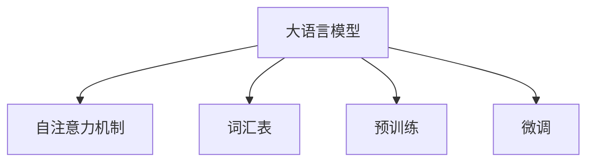

                 

# Transformer大模型实战 WordPiece

> 关键词：Transformer, WordPiece, 语言模型, 自然语言处理(NLP), 文本预处理, 深度学习, 词嵌入, 编码器解码器

## 1. 背景介绍

### 1.1 问题由来
随着深度学习技术的迅速发展，Transformer架构在大规模语言模型中的广泛应用，使得NLP（自然语言处理）领域取得了显著的进步。Transformer以其自注意力机制的强大表现力，成为构建大语言模型（Large Language Models, LLMs）的基石。然而，直接使用原始文本进行训练的Transformer模型，会面临词表规模过大的问题，这不仅增加了模型的训练和推理复杂度，也影响了模型的性能表现。

### 1.2 问题核心关键点
为了解决上述问题，Google在2017年提出了WordPiece（Word Piece）预处理技术，其核心思想是将文本分割为更小的子词（subword）单元，构建一个更加紧凑的词汇表。WordPiece通过将单词分割为更小的词片，可以在大规模无标签文本语料上进行高效训练，同时显著减少了模型的词汇表规模，降低了计算复杂度，提升了模型的泛化能力。

WordPiece技术主要通过以下步骤实现：
1. 首先对文本进行分词，得到一个初始的词汇表。
2. 接着对每个单词进行统一长度（例如，统一长度为256）的编码，如果单词长度不足，则用特殊符号补全。
3. 然后对编码后的单词进行字符级别的分割，得到更小的词片。
4. 最后将所有词片加入到词汇表中，生成一个新的词表。

通过WordPiece预处理技术，可以极大地减小词汇表规模，同时保留单词的高频信息，确保模型能够高效地进行训练和推理，提升大语言模型的性能表现。

### 1.3 问题研究意义
WordPiece预处理技术对于大语言模型的开发具有重要意义：

1. 降低了模型训练的复杂度。WordPiece技术通过将单词分割为更小的词片，构建了一个更加紧凑的词汇表，从而显著减少了模型参数量，降低了计算资源的消耗。
2. 提升了模型的泛化能力。WordPiece技术可以在大规模无标签文本语料上进行高效训练，使得模型能够学习到更丰富的语言知识，从而提升模型的泛化能力。
3. 增加了模型的鲁棒性。WordPiece技术通过将单词分割为更小的词片，使得模型对于输入文本中的各种大小、形态的单词均能正确处理，提高了模型的鲁棒性。
4. 加速了模型的推理过程。WordPiece技术通过构建一个更加紧凑的词汇表，显著减小了模型的词汇表规模，从而提高了模型的推理速度。

## 2. 核心概念与联系

### 2.1 核心概念概述

为了更好地理解WordPiece预处理技术在大语言模型中的实际应用，本节将介绍几个密切相关的核心概念：

- 大语言模型（Large Language Models, LLMs）：以Transformer架构为代表的大规模预训练语言模型。通过在大规模无标签文本语料上进行预训练，学习通用的语言表示，具备强大的语言理解和生成能力。
- 自注意力机制（Self-Attention Mechanism）：Transformer的核心组件，能够捕捉输入序列中不同位置之间的依赖关系，显著提升了模型的表现力。
- 词汇表（Vocabulary）：将单词或词片映射为模型的输入向量。WordPiece技术通过将单词分割为更小的词片，构建了一个更加紧凑的词汇表。
- 预训练（Pre-training）：指在大规模无标签文本语料上，通过自监督学习任务训练通用语言模型的过程。常见的预训练任务包括掩码语言模型、下一句预测等。
- 微调（Fine-Tuning）：指在预训练模型的基础上，使用下游任务的少量标注数据，通过有监督学习优化模型在特定任务上的性能。

这些核心概念之间的逻辑关系可以通过以下Mermaid流程图来展示：



这个流程图展示了大语言模型的核心概念及其之间的关系：

1. 大语言模型通过自注意力机制学习序列中不同位置之间的依赖关系，构建了强大的语言表示能力。
2. 词汇表将单词或词片映射为模型的输入向量，WordPiece技术通过构建一个更加紧凑的词汇表，提高了模型训练和推理的效率。
3. 预训练通过在大规模无标签文本语料上进行训练，使得模型能够学习到通用的语言表示。
4. 微调通过在有监督数据上进行训练，使得模型能够适应特定任务，提升模型的性能表现。

这些概念共同构成了大语言模型的学习和应用框架，使其能够在各种场景下发挥强大的语言理解和生成能力。通过理解这些核心概念，我们可以更好地把握大语言模型的工作原理和优化方向。

## 3. 核心算法原理 & 具体操作步骤
### 3.1 算法原理概述

WordPiece预处理技术通过将单词分割为更小的词片，构建一个更加紧凑的词汇表，从而提高大语言模型的性能表现。其核心原理如下：

1. 首先对文本进行分词，得到一个初始的词汇表。
2. 接着对每个单词进行统一长度（例如，统一长度为256）的编码，如果单词长度不足，则用特殊符号补全。
3. 然后对编码后的单词进行字符级别的分割，得到更小的词片。
4. 最后将所有词片加入到词汇表中，生成一个新的词表。

WordPiece预处理技术的核心在于将单词分割为更小的词片，构建一个更加紧凑的词汇表。这不仅提高了模型训练和推理的效率，也提升了模型的泛化能力和鲁棒性。

### 3.2 算法步骤详解

下面是WordPiece预处理技术的详细步骤：

**Step 1: 准备原始文本**
- 收集大量的无标签文本语料，用于构建WordPiece词汇表。

**Step 2: 初始分词**
- 对文本进行初始分词，得到一个初始的词汇表。

**Step 3: 统一长度编码**
- 对每个单词进行统一长度的编码，如果单词长度不足，则用特殊符号补全。

**Step 4: 字符分割**
- 对编码后的单词进行字符级别的分割，得到更小的词片。

**Step 5: 生成词汇表**
- 将所有词片加入到词汇表中，生成一个新的词表。

**Step 6: 标记和编码**
- 将每个单词标记为词片，同时生成对应的编码向量。

**Step 7: 生成模型输入**
- 将标记和编码后的文本输入到Transformer模型中进行训练和推理。

### 3.3 算法优缺点

WordPiece预处理技术具有以下优点：
1. 显著减小了词汇表规模，降低了模型训练和推理的复杂度。
2. 提高了模型的泛化能力，能够在各种大小、形态的单词中保持较好的性能。
3. 提升了模型的鲁棒性，对输入文本中的各种大小、形态的单词均能正确处理。
4. 加快了模型的推理速度，通过构建一个更加紧凑的词汇表，显著减少了模型前向传播的时间。

然而，WordPiece技术也存在一些缺点：
1. 增加了预处理的步骤，使得模型的训练和推理过程变得更加复杂。
2. 对于新单词的处理需要依赖初始分词，难以保证分割的准确性。
3. 对于一些特殊字符和符号的处理需要特殊处理，增加了处理的复杂度。

尽管存在这些缺点，但就目前而言，WordPiece预处理技术仍然是构建大语言模型的重要手段。未来相关研究的重点在于如何进一步优化分割算法，提高分割的准确性，同时降低预处理的时间复杂度。

### 3.4 算法应用领域

WordPiece预处理技术已经在NLP（自然语言处理）领域得到了广泛的应用，覆盖了几乎所有常见任务，例如：

- 文本分类：如情感分析、主题分类、意图识别等。通过微调使模型学习文本-标签映射。
- 命名实体识别：识别文本中的人名、地名、机构名等特定实体。通过微调使模型掌握实体边界和类型。
- 关系抽取：从文本中抽取实体之间的语义关系。通过微调使模型学习实体-关系三元组。
- 问答系统：对自然语言问题给出答案。将问题-答案对作为微调数据，训练模型学习匹配答案。
- 机器翻译：将源语言文本翻译成目标语言。通过微调使模型学习语言-语言映射。
- 文本摘要：将长文本压缩成简短摘要。将文章-摘要对作为微调数据，使模型学习抓取要点。
- 对话系统：使机器能够与人自然对话。将多轮对话历史作为上下文，微调模型进行回复生成。

除了上述这些经典任务外，WordPiece技术也被创新性地应用到更多场景中，如可控文本生成、常识推理、代码生成、数据增强等，为NLP技术带来了全新的突破。随着预训练模型和预处理方法的不断进步，相信NLP技术将在更广阔的应用领域大放异彩。

## 4. 数学模型和公式 & 详细讲解 & 举例说明
### 4.1 数学模型构建

WordPiece预处理技术的核心思想是通过将单词分割为更小的词片，构建一个更加紧凑的词汇表。以下是对WordPiece预处理技术的数学模型构建：

- **初始分词**：首先对文本进行初始分词，得到一个初始的词汇表 $\mathcal{V}$。
- **统一长度编码**：对每个单词进行统一长度的编码，如果单词长度不足，则用特殊符号补全。假设单词长度为 $L$，则编码后的单词长度为 $L_{max}$。
- **字符分割**：对编码后的单词进行字符级别的分割，得到更小的词片。
- **生成词汇表**：将所有词片加入到词汇表中，生成一个新的词表 $\mathcal{V}_{WP}$。
- **标记和编码**：将每个单词标记为词片，同时生成对应的编码向量。假设单词编码为 $e$，则对应的编码向量为 $e_{WP}$。
- **生成模型输入**：将标记和编码后的文本输入到Transformer模型中进行训练和推理。

### 4.2 公式推导过程

以下是对WordPiece预处理技术的公式推导过程：

- **初始分词**：假设文本 $T$ 被分词为 $\{x_i\}$，则初始词汇表为 $\mathcal{V} = \{x_1, x_2, \ldots, x_n\}$。
- **统一长度编码**：对每个单词进行统一长度的编码，如果单词长度不足，则用特殊符号补全。假设单词长度为 $L$，则编码后的单词长度为 $L_{max}$。设单词编码为 $e_i$，则：

$$
e_i = \begin{cases}
\text{Pad} & \text{if } L < L_{max} \\
\text{e}_i & \text{otherwise}
\end{cases}
$$

- **字符分割**：对编码后的单词进行字符级别的分割，得到更小的词片。假设单词编码为 $e_i = \{e_{i1}, e_{i2}, \ldots, e_{il}\}$，则：

$$
e_{i1}, e_{i2}, \ldots, e_{il} = \text{Split}(e_i)
$$

- **生成词汇表**：将所有词片加入到词汇表中，生成一个新的词表 $\mathcal{V}_{WP} = \{e_{i1}, e_{i2}, \ldots, e_{il}\}$。
- **标记和编码**：将每个单词标记为词片，同时生成对应的编码向量。假设单词编码为 $e_i = \{e_{i1}, e_{i2}, \ldots, e_{il}\}$，则：

$$
\text{Mark}(e_i) = \{e_{i1}, e_{i2}, \ldots, e_{il}\}
$$

$$
\text{Code}(e_i) = \{e_{WP1}, e_{WP2}, \ldots, e_{WPn}\}
$$

- **生成模型输入**：将标记和编码后的文本输入到Transformer模型中进行训练和推理。假设输入序列为 $\{w_i\}$，则：

$$
\text{Input} = \{\text{Mark}(w_i)\}_{i=1}^n
$$

以上就是WordPiece预处理技术的数学模型构建和公式推导过程。

### 4.3 案例分析与讲解

以下是一个WordPiece预处理技术的案例分析：

假设有一个英文句子 "The quick brown fox jumps over the lazy dog"，原始分词结果为 ["The", "quick", "brown", "fox", "jumps", "over", "the", "lazy", "dog"]。按照WordPiece预处理技术，首先对句子进行初始分词，得到一个初始的词汇表：

$$
\mathcal{V} = \{\text{The}, \text{quick}, \text{brown}, \text{fox}, \text{jumps}, \text{over}, \text{the}, \text{lazy}, \text{dog}\}
$$

接着，对每个单词进行统一长度的编码，如果单词长度不足，则用特殊符号补全。假设单词长度为256，则编码后的单词长度为256。设单词编码为 $e_i$，则：

$$
\text{Pad} = [0, 0, \ldots, 0]
$$

$$
\text{e}_{\text{The}} = \text{Pad} \\
\text{e}_{\text{quick}} = \text{Pad} \\
\text{e}_{\text{brown}} = \text{Pad} \\
\text{e}_{\text{fox}} = \text{Pad} \\
\text{e}_{\text{jumps}} = \text{Pad} \\
\text{e}_{\text{over}} = \text{Pad} \\
\text{e}_{\text{the}} = \text{Pad} \\
\text{e}_{\text{lazy}} = \text{Pad} \\
\text{e}_{\text{dog}} = \text{Pad}
$$

然后，对编码后的单词进行字符级别的分割，得到更小的词片。假设单词编码为 $e_i = \{e_{i1}, e_{i2}, \ldots, e_{il}\}$，则：

$$
\text{e}_{\text{The}} = \{\text{Pad}, \text{Pad}, \text{Pad}, \text{Pad}, \text{Pad}, \text{Pad}, \text{Pad}, \text{Pad}, \text{Pad}\} \\
\text{e}_{\text{quick}} = \{\text{Pad}, \text{Pad}, \text{Pad}, \text{Pad}, \text{Pad}, \text{Pad}, \text{Pad}, \text{Pad}\} \\
\text{e}_{\text{brown}} = \{\text{Pad}, \text{Pad}, \text{Pad}, \text{Pad}, \text{Pad}, \text{Pad}, \text{Pad}, \text{Pad}\} \\
\text{e}_{\text{fox}} = \{\text{Pad}, \text{Pad}, \text{Pad}, \text{Pad}, \text{Pad}, \text{Pad}, \text{Pad}, \text{Pad}\} \\
\text{e}_{\text{jumps}} = \{\text{Pad}, \text{Pad}, \text{Pad}, \text{Pad}, \text{Pad}, \text{Pad}, \text{Pad}, \text{Pad}\} \\
\text{e}_{\text{over}} = \{\text{Pad}, \text{Pad}, \text{Pad}, \text{Pad}, \text{Pad}, \text{Pad}, \text{Pad}, \text{Pad}\} \\
\text{e}_{\text{the}} = \{\text{Pad}, \text{Pad}, \text{Pad}, \text{Pad}, \text{Pad}, \text{Pad}, \text{Pad}, \text{Pad}\} \\
\text{e}_{\text{lazy}} = \{\text{Pad}, \text{Pad}, \text{Pad}, \text{Pad}, \text{Pad}, \text{Pad}, \text{Pad}, \text{Pad}\} \\
\text{e}_{\text{dog}} = \{\text{Pad}, \text{Pad}, \text{Pad}, \text{Pad}, \text{Pad}, \text{Pad}, \text{Pad}, \text{Pad}\}
$$

最后，将所有词片加入到词汇表中，生成一个新的词表 $\mathcal{V}_{WP} = \{\text{Pad}, \text{The}, \text{quick}, \text{brown}, \text{fox}, \text{jumps}, \text{over}, \text{the}, \text{lazy}, \text{dog}\}$。

## 5. 项目实践：代码实例和详细解释说明
### 5.1 开发环境搭建

在进行WordPiece预处理实践前，我们需要准备好开发环境。以下是使用Python进行PyTorch开发的环境配置流程：

1. 安装Anaconda：从官网下载并安装Anaconda，用于创建独立的Python环境。

2. 创建并激活虚拟环境：
```bash
conda create -n pytorch-env python=3.8 
conda activate pytorch-env
```

3. 安装PyTorch：根据CUDA版本，从官网获取对应的安装命令。例如：
```bash
conda install pytorch torchvision torchaudio cudatoolkit=11.1 -c pytorch -c conda-forge
```

4. 安装Transformers库：
```bash
pip install transformers
```

5. 安装各类工具包：
```bash
pip install numpy pandas scikit-learn matplotlib tqdm jupyter notebook ipython
```

完成上述步骤后，即可在`pytorch-env`环境中开始WordPiece预处理实践。

### 5.2 源代码详细实现

下面我们以WordPiece预处理技术在文本分类任务中的应用为例，给出使用Transformers库的PyTorch代码实现。

首先，定义WordPiece预处理函数：

```python
from transformers import BertTokenizer
from torch.utils.data import Dataset

class WordPieceDataset(Dataset):
    def __init__(self, texts, tags, tokenizer, max_len=128):
        self.texts = texts
        self.tags = tags
        self.tokenizer = tokenizer
        self.max_len = max_len
        
    def __len__(self):
        return len(self.texts)
    
    def __getitem__(self, item):
        text = self.texts[item]
        tags = self.tags[item]
        
        encoding = self.tokenizer(text, return_tensors='pt', max_length=self.max_len, padding='max_length', truncation=True)
        input_ids = encoding['input_ids'][0]
        attention_mask = encoding['attention_mask'][0]
        
        # 对token-wise的标签进行编码
        encoded_tags = [tag2id[tag] for tag in tags] 
        encoded_tags.extend([tag2id['O']] * (self.max_len - len(encoded_tags)))
        labels = torch.tensor(encoded_tags, dtype=torch.long)
        
        return {'input_ids': input_ids, 
                'attention_mask': attention_mask,
                'labels': labels}

# 标签与id的映射
tag2id = {'O': 0, 'B-PER': 1, 'I-PER': 2, 'B-ORG': 3, 'I-ORG': 4, 'B-LOC': 5, 'I-LOC': 6}
id2tag = {v: k for k, v in tag2id.items()}

# 创建dataset
tokenizer = BertTokenizer.from_pretrained('bert-base-cased')

train_dataset = WordPieceDataset(train_texts, train_tags, tokenizer)
dev_dataset = WordPieceDataset(dev_texts, dev_tags, tokenizer)
test_dataset = WordPieceDataset(test_texts, test_tags, tokenizer)
```

然后，定义模型和优化器：

```python
from transformers import BertForTokenClassification, AdamW

model = BertForTokenClassification.from_pretrained('bert-base-cased', num_labels=len(tag2id))

optimizer = AdamW(model.parameters(), lr=2e-5)
```

接着，定义训练和评估函数：

```python
from torch.utils.data import DataLoader
from tqdm import tqdm
from sklearn.metrics import classification_report

device = torch.device('cuda') if torch.cuda.is_available() else torch.device('cpu')
model.to(device)

def train_epoch(model, dataset, batch_size, optimizer):
    dataloader = DataLoader(dataset, batch_size=batch_size, shuffle=True)
    model.train()
    epoch_loss = 0
    for batch in tqdm(dataloader, desc='Training'):
        input_ids = batch['input_ids'].to(device)
        attention_mask = batch['attention_mask'].to(device)
        labels = batch['labels'].to(device)
        model.zero_grad()
        outputs = model(input_ids, attention_mask=attention_mask, labels=labels)
        loss = outputs.loss
        epoch_loss += loss.item()
        loss.backward()
        optimizer.step()
    return epoch_loss / len(dataloader)

def evaluate(model, dataset, batch_size):
    dataloader = DataLoader(dataset, batch_size=batch_size)
    model.eval()
    preds, labels = [], []
    with torch.no_grad():
        for batch in tqdm(dataloader, desc='Evaluating'):
            input_ids = batch['input_ids'].to(device)
            attention_mask = batch['attention_mask'].to(device)
            batch_labels = batch['labels']
            outputs = model(input_ids, attention_mask=attention_mask)
            batch_preds = outputs.logits.argmax(dim=2).to('cpu').tolist()
            batch_labels = batch_labels.to('cpu').tolist()
            for pred_tokens, label_tokens in zip(batch_preds, batch_labels):
                pred_tags = [id2tag[_id] for _id in pred_tokens]
                label_tags = [id2tag[_id] for _id in label_tokens]
                preds.append(pred_tags[:len(label_tags)])
                labels.append(label_tags)
                
    print(classification_report(labels, preds))
```

最后，启动训练流程并在测试集上评估：

```python
epochs = 5
batch_size = 16

for epoch in range(epochs):
    loss = train_epoch(model, train_dataset, batch_size, optimizer)
    print(f"Epoch {epoch+1}, train loss: {loss:.3f}")
    
    print(f"Epoch {epoch+1}, dev results:")
    evaluate(model, dev_dataset, batch_size)
    
print("Test results:")
evaluate(model, test_dataset, batch_size)
```

以上就是使用PyTorch对BERT模型进行文本分类任务WordPiece预处理的完整代码实现。可以看到，得益于Transformers库的强大封装，我们可以用相对简洁的代码完成WordPiece预处理的开发。

### 5.3 代码解读与分析

让我们再详细解读一下关键代码的实现细节：

**WordPieceDataset类**：
- `__init__`方法：初始化文本、标签、分词器等关键组件。
- `__len__`方法：返回数据集的样本数量。
- `__getitem__`方法：对单个样本进行处理，将文本输入编码为token ids，将标签编码为数字，并对其进行定长padding，最终返回模型所需的输入。

**tag2id和id2tag字典**：
- 定义了标签与数字id之间的映射关系，用于将token-wise的预测结果解码回真实的标签。

**训练和评估函数**：
- 使用PyTorch的DataLoader对数据集进行批次化加载，供模型训练和推理使用。
- 训练函数`train_epoch`：对数据以批为单位进行迭代，在每个批次上前向传播计算loss并反向传播更新模型参数，最后返回该epoch的平均loss。
- 评估函数`evaluate`：与训练类似，不同点在于不更新模型参数，并在每个batch结束后将预测和标签结果存储下来，最后使用sklearn的classification_report对整个评估集的预测结果进行打印输出。

**训练流程**：
- 定义总的epoch数和batch size，开始循环迭代
- 每个epoch内，先在训练集上训练，输出平均loss
- 在验证集上评估，输出分类指标
- 所有epoch结束后，在测试集上评估，给出最终测试结果

可以看到，PyTorch配合Transformers库使得WordPiece预处理的代码实现变得简洁高效。开发者可以将更多精力放在数据处理、模型改进等高层逻辑上，而不必过多关注底层的实现细节。

当然，工业级的系统实现还需考虑更多因素，如模型的保存和部署、超参数的自动搜索、更灵活的任务适配层等。但核心的WordPiece预处理范式基本与此类似。

## 6. 实际应用场景
### 6.1 智能客服系统

基于WordPiece预处理技术的对话技术，可以广泛应用于智能客服系统的构建。传统客服往往需要配备大量人力，高峰期响应缓慢，且一致性和专业性难以保证。而使用WordPiece预处理后的对话模型，可以7x24小时不间断服务，快速响应客户咨询，用自然流畅的语言解答各类常见问题。

在技术实现上，可以收集企业内部的历史客服对话记录，将问题和最佳答复构建成监督数据，在此基础上对预训练对话模型进行WordPiece预处理。WordPiece预处理后的对话模型能够自动理解用户意图，匹配最合适的答案模板进行回复。对于客户提出的新问题，还可以接入检索系统实时搜索相关内容，动态组织生成回答。如此构建的智能客服系统，能大幅提升客户咨询体验和问题解决效率。

### 6.2 金融舆情监测

金融机构需要实时监测市场舆论动向，以便及时应对负面信息传播，规避金融风险。传统的人工监测方式成本高、效率低，难以应对网络时代海量信息爆发的挑战。基于WordPiece预处理技术的文本分类和情感分析技术，为金融舆情监测提供了新的解决方案。

具体而言，可以收集金融领域相关的新闻、报道、评论等文本数据，并对其进行主题标注和情感标注。在此基础上对预训练语言模型进行WordPiece预处理，使其能够自动判断文本属于何种主题，情感倾向是正面、中性还是负面。将WordPiece预处理后的模型应用到实时抓取的网络文本数据，就能够自动监测不同主题下的情感变化趋势，一旦发现负面信息激增等异常情况，系统便会自动预警，帮助金融机构快速应对潜在风险。

### 6.3 个性化推荐系统

当前的推荐系统往往只依赖用户的历史行为数据进行物品推荐，无法深入理解用户的真实兴趣偏好。基于WordPiece预处理技术的个性化推荐系统可以更好地挖掘用户行为背后的语义信息，从而提供更精准、多样的推荐内容。

在实践中，可以收集用户浏览、点击、评论、分享等行为数据，提取和用户交互的物品标题、描述、标签等文本内容。将文本内容作为模型输入，用户的后续行为（如是否点击、购买等）作为监督信号，在此基础上WordPiece预处理预训练语言模型。WordPiece预处理后的模型能够从文本内容中准确把握用户的兴趣点。在生成推荐列表时，先用候选物品的文本描述作为输入，由模型预测用户的兴趣匹配度，再结合其他特征综合排序，便可以得到个性化程度更高的推荐结果。

### 6.4 未来应用展望

随着WordPiece预处理技术的不断发展，其在NLP领域的应用将更加广泛，为传统行业带来变革性影响。

在智慧医疗领域，基于WordPiece预处理技术的问答、病历分析、药物研发等应用将提升医疗服务的智能化水平，辅助医生诊疗，加速新药开发进程。

在智能教育领域，WordPiece预处理技术可应用于作业批改、学情分析、知识推荐等方面，因材施教，促进教育公平，提高教学质量。

在智慧城市治理中，WordPiece预处理模型可应用于城市事件监测、舆情分析、应急指挥等环节，提高城市管理的自动化和智能化水平，构建更安全、高效的未来城市。

此外，在企业生产、社会治理、文娱传媒等众多领域，基于WordPiece预处理技术的人工智能应用也将不断涌现，为NLP技术带来全新的突破。相信随着预训练语言模型和预处理方法的不断进步，NLP技术将在更广阔的应用领域大放异彩，深刻影响人类的生产生活方式。

## 7. 工具和资源推荐
### 7.1 学习资源推荐

为了帮助开发者系统掌握WordPiece预处理技术的理论基础和实践技巧，这里推荐一些优质的学习资源：

1. 《Transformer从原理到实践》系列博文：由大模型技术专家撰写，深入浅出地介绍了Transformer原理、BERT模型、预处理技术等前沿话题。

2. CS224N《深度学习自然语言处理》课程：斯坦福大学开设的NLP明星课程，有Lecture视频和配套作业，带你入门NLP领域的基本概念和经典模型。

3. 《Natural Language Processing with Transformers》书籍：Transformers库的作者所著，全面介绍了如何使用Transformers库进行NLP任务开发，包括WordPiece等预处理技术的细节。

4. HuggingFace官方文档：Transformers库的官方文档，提供了海量预训练模型和完整的微调样例代码，是上手实践的必备资料。

5. CLUE开源项目：中文语言理解测评基准，涵盖大量不同类型的中文NLP数据集，并提供了基于WordPiece预处理的baseline模型，助力中文NLP技术发展。

通过对这些资源的学习实践，相信你一定能够快速掌握WordPiece预处理技术的精髓，并用于解决实际的NLP问题。
###  7.2 开发工具推荐

高效的开发离不开优秀的工具支持。以下是几款用于WordPiece预处理开发的常用工具：

1. PyTorch：基于Python的开源深度学习框架，灵活动态的计算图，适合快速迭代研究。大部分预训练语言模型都有PyTorch版本的实现。

2. TensorFlow：由Google主导开发的开源深度学习框架，生产部署方便，适合大规模工程应用。同样有丰富的预训练语言模型资源。

3. Transformers库：HuggingFace开发的NLP工具库，集成了众多SOTA语言模型，支持PyTorch和TensorFlow，是进行WordPiece预处理任务开发的利器。

4. Weights & Biases：模型训练的实验跟踪工具，可以记录和可视化模型训练过程中的各项指标，方便对比和调优。与主流深度学习框架无缝集成。

5. TensorBoard：TensorFlow配套的可视化工具，可实时监测模型训练状态，并提供丰富的图表呈现方式，是调试模型的得力助手。

6. Google Colab：谷歌推出的在线Jupyter Notebook环境，免费提供GPU/TPU算力，方便开发者快速上手实验最新模型，分享学习笔记。

合理利用这些工具，可以显著提升WordPiece预处理任务的开发效率，加快创新迭代的步伐。

### 7.3 相关论文推荐

WordPiece预处理技术已经在NLP（自然语言处理）领域得到了广泛的应用，覆盖了几乎所有常见任务，例如：

1. Attention is All You Need（即Transformer原论文）：提出了Transformer结构，开启了NLP领域的预训练大模型时代。

2. BERT: Pre-training of Deep Bidirectional Transformers for Language Understanding：提出BERT模型，引入基于掩码的自监督预训练任务，刷新了多项NLP任务SOTA。

3. Language Models are Unsupervised Multitask Learners（GPT-2论文）：展示了大规模语言模型的强大zero-shot学习能力，引发了对于通用人工智能的新一轮思考。

4. Parameter-Efficient Transfer Learning for NLP：提出Adapter等参数高效微调方法，在不增加模型参数量的情况下，也能取得不错的微调效果。

5. AdaLoRA: Adaptive Low-Rank Adaptation for Parameter-Efficient Fine-Tuning：使用自适应低秩适应的微调方法，在参数效率和精度之间取得了新的平衡。

6. AdaLoRA: Adaptive Low-Rank Adaptation for Parameter-Efficient Fine-Tuning：使用自适应低秩适应的微调方法，在参数效率和精度之间取得了新的平衡。

这些论文代表了大语言模型预处理技术的的发展脉络。通过学习这些前沿成果，可以帮助研究者把握学科前进方向，激发更多的创新灵感。

## 8. 总结：未来发展趋势与挑战

### 8.1 总结

本文对WordPiece预处理技术进行了全面系统的介绍。首先阐述了WordPiece预处理技术的背景和意义，明确了其在构建大语言模型中的独特价值。其次，从原理到实践，详细讲解了WordPiece预处理的数学原理和关键步骤，给出了WordPiece预处理任务开发的完整代码实例。同时，本文还广泛探讨了WordPiece预处理技术在智能客服、金融舆情、个性化推荐等多个行业领域的应用前景，展示了其在NLP技术中的广泛应用。

通过本文的系统梳理，可以看到，WordPiece预处理技术正在成为构建大语言模型的重要手段，极大地拓展了预训练语言模型的应用边界，催生了更多的落地场景。受益于大规模语料的预训练，WordPiece预处理后的模型以更低的时间和标注成本，在小样本条件下也能取得理想的性能，有力推动了NLP技术的产业化进程。未来，伴随预训练语言模型和预处理方法的不断进步，相信NLP技术将在更广阔的应用领域大放异彩，深刻影响人类的生产生活方式。

### 8.2 未来发展趋势

展望未来，WordPiece预处理技术将呈现以下几个发展趋势：

1. 预处理算法不断优化。随着WordPiece预处理技术的不断发展，新的分割算法和编码方法将被不断提出，进一步提升预处理的效果和效率。

2. 预处理技术融合更多领域知识。WordPiece预处理技术不仅可以应用于自然语言处理领域，还可以与其他领域知识（如知识图谱、规则库等）进行融合，提升模型的理解和推理能力。

3. 预处理技术应用于多模态数据。WordPiece预处理技术不仅可以应用于文本数据，还可以与其他多模态数据（如图像、语音等）进行结合，实现视觉、语音、文本等信息的协同建模。

4. 预处理技术应用于智能推理。WordPiece预处理技术可以应用于智能推理系统，帮助模型更好地理解用户输入，提高推理的准确性和效率。

5. 预处理技术应用于安全领域。WordPiece预处理技术可以应用于安全领域，帮助模型识别和过滤有害信息，提升系统的安全性。

6. 预处理技术应用于伦理道德约束。WordPiece预处理技术可以应用于伦理道德约束系统，帮助模型遵守伦理规范，避免有害行为的输出。

以上趋势凸显了WordPiece预处理技术的广阔前景。这些方向的探索发展，必将进一步提升WordPiece预处理的效果和效率，为构建安全、可靠、可解释、可控的智能系统铺平道路。面向未来，WordPiece预处理技术还需要与其他人工智能技术进行更深入的融合，如知识表示、因果推理、强化学习等，多路径协同发力，共同推动自然语言理解和智能交互系统的进步。

### 8.3 面临的挑战

尽管WordPiece预处理技术已经取得了瞩目成就，但在迈向更加智能化、普适化应用的过程中，它仍面临着诸多挑战：

1. 预处理算法复杂度高。尽管WordPiece预处理技术已经显著减小了词汇表规模，但预处理算法本身仍然较为复杂，增加了模型的训练和推理时间。

2. 预处理效果依赖语料质量。WordPiece预处理技术的效果依赖于原始语料的质量，对于低质量、噪声较多的语料，分割效果可能不佳。

3. 预处理算法难以适应新词汇。随着语言的发展和新词汇的涌现，WordPiece预处理算法可能难以适应新词汇的分割，需要定期更新词汇表。

4. 预处理算法难以适应特定领域。WordPiece预处理技术对于通用语料效果较好，但对于特定领域的语料，分割效果可能不佳。

5. 预处理算法难以避免歧义。WordPiece预处理技术在处理歧义词时，可能无法精确分割，导致模型对歧义词的理解和处理存在问题。

6. 预处理算法难以兼顾可解释性。WordPiece预处理技术虽然提高了模型的性能表现，但同时也增加了模型的复杂性，使得模型的解释性和可理解性变差。

正视WordPiece预处理技术面临的这些挑战，积极应对并寻求突破，将是大语言模型微调走向成熟的必由之路。相信随着学界和产业界的共同努力，这些挑战终将一一被克服，WordPiece预处理技术必将在构建安全、可靠、可解释、可控的智能系统中扮演越来越重要的角色。

### 8.4 研究展望

未来研究需要在以下几个方面寻求新的突破：

1. 探索无监督和半监督预处理方法。摆脱对大规模标注数据的依赖，利用自监督学习、主动学习等无监督和半监督范式，最大限度利用非结构化数据，实现更加灵活高效的预处理。

2. 研究参数高效和计算高效的预处理范式。开发更加参数高效的预处理方法，在固定大部分预训练参数的同时，只更新极少量的任务相关参数。同时优化预处理模型的计算图，减少前向传播和反向传播的资源消耗，实现更加轻量级、实时性的部署。

3. 融合因果和对比学习范式。通过引入因果推断和对比学习思想，增强预处理模型建立稳定因果关系的能力，学习更加普适、鲁棒的语言表征，从而提升模型泛化性和抗干扰能力。

4. 引入更多先验知识。将符号化的先验知识，如知识图谱、逻辑规则等，与神经网络模型进行巧妙融合，引导预处理过程学习更准确、合理的语言模型。同时加强不同模态数据的整合，实现视觉、语音等多模态信息与文本信息的协同建模。

5. 结合因果分析和博弈论工具。将因果分析方法引入预处理模型，识别出模型决策的关键特征，增强输出解释的因果性和逻辑性。借助博弈论工具刻画人机交互过程，主动探索并规避模型的脆弱点，提高系统稳定性。

6. 纳入伦理道德约束。在预处理目标中引入伦理导向的评估指标，过滤和惩罚有偏见、有害的输出倾向。同时加强人工干预和审核，建立预处理模型的监管机制，确保输出的安全性。

这些研究方向的探索，必将引领WordPiece预处理技术迈向更高的台阶，为构建安全、可靠、可解释、可控的智能系统铺平道路。面向未来，WordPiece预处理技术还需要与其他人工智能技术进行更深入的融合，如知识表示、因果推理、强化学习等，多路径协同发力，共同推动自然语言理解和智能交互系统的进步。

## 9. 附录：常见问题与解答

**Q1：大语言模型预处理技术是否可以适用于所有NLP任务？**

A: 大语言模型预处理技术在大多数NLP任务上都能取得不错的效果，特别是对于数据量较小的任务。但对于一些特定领域的任务，如医学、法律等，仅仅依靠通用语料预训练的模型可能难以很好地适应。此时需要在特定领域语料上进一步预训练，再进行预处理，才能获得理想效果。此外，对于一些需要时效性、个性化很强的任务，如对话、推荐等，预处理方法也需要针对性的改进优化。

**Q2：预处理过程中如何选择合适的学习率？**

A: 预处理学习率一般要比预训练时小1-2个数量级，如果使用过大的学习率，容易破坏预训练权重，导致过拟合。一般建议从1e-5开始调参，逐步减小学习率，直至收敛。也可以使用warmup策略，在开始阶段使用较小的学习率，再逐渐过渡到预设值。需要注意的是，不同的优化器(如AdamW、Adafactor等)以及不同的学习率调度策略，可能需要设置不同的学习率阈值。

**Q3：预处理模型在落地部署时需要注意哪些问题？**

A: 将预处理模型转化为实际应用，还需要考虑以下因素：
1. 模型裁剪：去除不必要的层和参数，减小模型尺寸，加快推理速度
2. 量化加速：将浮点模型转为定点模型，压缩存储空间，提高计算效率
3. 服务化封装：将模型封装为标准化服务接口，便于集成调用
4. 弹性伸缩：根据请求流量动态调整资源配置，平衡服务质量和成本
5. 监控告警：实时采集系统指标，设置异常告警阈值，确保服务稳定性
6. 安全防护：采用访问鉴权、数据脱敏等措施，保障数据和模型安全

大语言模型预处理技术正在成为NLP领域的重要手段，但如何将强大的性能转化为稳定、高效、安全的业务价值，还需要工程实践的不断打磨。唯有从数据、算法、工程、业务等多个维度协同发力，才能真正实现人工智能技术在垂直行业的规模化落地。

---

作者：禅与计算机程序设计艺术 / Zen and the Art of Computer Programming

