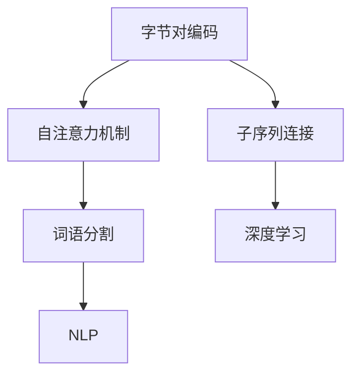

                 

# Transformer大模型实战 字节对编码

> 关键词：Transformer, 字节对编码(BPE), 自注意力机制, 子序列连接(SAN), 词语分割, 深度学习, 自然语言处理(NLP)

## 1. 背景介绍

### 1.1 问题由来
Transformer作为深度学习领域的革命性创新，以其卓越的性能和高效性，迅速成为自然语言处理(NLP)领域的主流模型。然而，Transformer模型在序列处理上的表现，往往受限于输入序列的长度，且在处理长文本时，计算复杂度呈指数级增长，难以满足实际应用需求。

### 1.2 问题核心关键点
针对以上问题，研究者提出了基于字节对编码(BPE)的Transformer模型，将字符序列转化为固定长度的字节序列，同时引入了自注意力机制(Self-Attention)和子序列连接(SAN)技术，有效解决了长文本序列处理的难题，显著提高了Transformer模型在序列建模、自然语言理解等NLP任务中的表现。

### 1.3 问题研究意义
研究基于BPE的Transformer模型，对于拓展Transformer在大规模语料上的应用范围，提升NLP系统的性能，加速NLP技术的产业化进程，具有重要意义：

1. 降低序列处理成本。通过BPE技术，将长文本序列转化为固定长度的字节序列，降低了序列处理的复杂度和计算成本。
2. 提升模型泛化能力。BPE技术使得模型能够更好地学习到字符级别的语言表示，提升在多语言、跨领域上的泛化性能。
3. 增强模型处理能力。SAN技术使得模型能够同时关注文本中的多个字符，提升语言建模和推理能力。
4. 促进大规模语料的应用。Transformer模型在处理长文本时表现优异，可以更好地适应大规模语料库的需求。

## 2. 核心概念与联系

### 2.1 核心概念概述

为更好地理解基于BPE的Transformer模型，本节将介绍几个密切相关的核心概念：

- 字节对编码(BPE)：一种文本编码技术，将字符序列转化为固定长度的字节序列，简化了长文本序列的处理，同时保留字符间的语义关系。
- 自注意力机制(Self-Attention)：一种Transformer模型特有的机制，允许模型同时关注输入序列中不同位置的特征，提升序列建模能力。
- 子序列连接(SAN)：一种文本处理技术，将输入序列切分为多个子序列，分别进行处理后再拼接，提升序列建模的效率。
- 词语分割(Word Segmentation)：将长文本分割成词语序列，方便后续的NLP处理。
- 深度学习(Deep Learning)：基于多层神经网络结构的机器学习技术，适合复杂非线性的建模任务。
- 自然语言处理(NLP)：研究如何使计算机理解、处理、生成自然语言的技术，是人工智能的重要分支。

这些核心概念之间的逻辑关系可以通过以下Mermaid流程图来展示：



这个流程图展示了大语言模型的核心概念及其之间的关系：

1. 基于BPE的Transformer模型通过自注意力机制和子序列连接技术，实现长文本序列的高效处理。
2. 自注意力机制和深度学习技术，使得模型能够捕捉长文本序列中的全局和局部信息。
3. 词语分割技术，将长文本序列转化为词语序列，便于后续的NLP处理。
4. 自然语言处理技术，利用模型对长文本进行理解、生成等操作，提升自然语言应用的智能水平。

## 3. 核心算法原理 & 具体操作步骤
### 3.1 算法原理概述

基于BPE的Transformer模型，本质上是一种将字符序列转化为字节序列，同时引入自注意力机制和子序列连接技术的Transformer模型。其核心思想是：通过BPE技术将长文本序列转化为固定长度的字节序列，进而利用SAN技术进行高效处理，同时通过注意力机制捕捉序列中的复杂依赖关系，提升模型对长文本序列的建模能力。

具体来说，假设有长文本序列 $X = x_1, x_2, \dots, x_n$，其中 $x_i$ 表示文本中的第 $i$ 个字符。通过BPE技术，将字符序列转化为固定长度的字节序列 $B = b_1, b_2, \dots, b_m$，其中 $b_i$ 表示字节序列中的一个元素。然后，将字节序列 $B$ 输入Transformer模型进行处理，得到输出 $Y = y_1, y_2, \dots, y_m$，其中 $y_i$ 表示模型对第 $i$ 个字节的预测结果。

Transformer模型在处理字节序列时，利用SAN技术将输入序列切分为多个子序列，分别进行处理后再拼接，从而实现高效处理长文本序列。同时，利用自注意力机制，模型能够同时关注序列中的多个位置，捕捉复杂依赖关系，提升语言建模能力。

### 3.2 算法步骤详解

基于BPE的Transformer模型的训练和推断过程，包括以下几个关键步骤：

**Step 1: 数据预处理**
- 收集语料库，将其切分为训练集、验证集和测试集。
- 对文本进行预处理，包括去除停用词、词干化、分词等操作，并将文本转换为小写形式。
- 对预处理后的文本进行BPE编码，将其转化为固定长度的字节序列。

**Step 2: 模型构建**
- 使用PyTorch或TensorFlow等深度学习框架，构建基于BPE的Transformer模型。
- 模型由编码器(Encoder)和解码器(Decoder)组成，其中编码器负责处理输入序列，解码器负责生成输出序列。
- 在编码器和解码器中，均引入SAN机制，用于捕捉序列中的复杂依赖关系。

**Step 3: 训练和推断**
- 将训练集数据分批次输入模型，前向传播计算损失函数。
- 反向传播计算参数梯度，根据设定的优化算法更新模型参数。
- 在测试集上对模型进行推断，生成输出序列。

**Step 4: 评估与调优**
- 在验证集上评估模型性能，根据评估结果调整模型超参数。
- 持续训练模型，直到收敛或达到预设的迭代次数。

### 3.3 算法优缺点

基于BPE的Transformer模型具有以下优点：
1. 高效处理长文本序列。BPE技术将长文本序列转化为固定长度的字节序列，大大简化了序列处理。
2. 提升模型泛化能力。SAN技术使得模型能够同时关注序列中的多个位置，提升泛化性能。
3. 增强模型可扩展性。BPE技术可以应用于多种语言和多种字符集，提高模型的可扩展性。
4. 易于实现。基于BPE的Transformer模型结构简单，实现容易，适合大规模生产部署。

同时，该模型也存在一定的局限性：
1. 可能会损失部分信息。BPE技术在编码过程中，可能会损失部分字符间的语义关系，影响模型的性能。
2. 训练复杂度高。BPE编码后的序列长度通常较大，训练时内存占用较大，计算复杂度高。
3. 词典构建困难。BPE词典的构建需要大量的预处理数据和计算资源，对于小规模语料库来说，构建难度较大。
4. 可解释性不足。Transformer模型作为黑盒系统，其内部工作机制难以解释，限制了模型的可解释性。

尽管存在这些局限性，但就目前而言，基于BPE的Transformer模型在处理长文本序列、提升NLP系统性能方面具有显著的优势，是处理长文本序列的重要选择。

### 3.4 算法应用领域

基于BPE的Transformer模型在NLP领域已经得到了广泛的应用，涵盖了以下诸多任务：

- 文本分类：如情感分析、主题分类、意图识别等。通过微调使模型学习文本-标签映射。
- 命名实体识别：识别文本中的人名、地名、机构名等特定实体。通过微调使模型掌握实体边界和类型。
- 关系抽取：从文本中抽取实体之间的语义关系。通过微调使模型学习实体-关系三元组。
- 问答系统：对自然语言问题给出答案。将问题-答案对作为微调数据，训练模型学习匹配答案。
- 机器翻译：将源语言文本翻译成目标语言。通过微调使模型学习语言-语言映射。
- 文本摘要：将长文本压缩成简短摘要。将文章-摘要对作为微调数据，使模型学习抓取要点。
- 对话系统：使机器能够与人自然对话。将多轮对话历史作为上下文，微调模型进行回复生成。

除了上述这些经典任务外，基于BPE的Transformer模型还被创新性地应用到更多场景中，如可控文本生成、常识推理、代码生成、数据增强等，为NLP技术带来了全新的突破。随着预训练模型和微调方法的不断进步，相信基于BPE的Transformer模型将在更广阔的应用领域大放异彩。

## 4. 数学模型和公式 & 详细讲解  
### 4.1 数学模型构建

本节将使用数学语言对基于BPE的Transformer模型进行更加严格的刻画。

记输入序列为 $X = \{x_1, x_2, \dots, x_n\}$，其中 $x_i$ 表示文本中的第 $i$ 个字符。定义编码器为 $E$，解码器为 $D$，输入嵌入层为 $W_{in}$，输出嵌入层为 $W_{out}$，自注意力层为 $S$，前馈层为 $F$。

假设编码器由 $n$ 层Transformer构成，每层包含 $L$ 个自注意力头(Head)，则编码器对输入序列的编码为：

$$
E(X) = \begin{bmatrix}
S_1 \\
S_2 \\
\vdots \\
S_n
\end{bmatrix}
$$

其中，$S_i$ 表示第 $i$ 层的自注意力层输出，定义为：

$$
S_i = \operatorname{Attention}(X_i, W_{in} X_i, W_{in} X_i)
$$

$\operatorname{Attention}$ 表示自注意力机制，定义为：

$$
\operatorname{Attention}(Q, K, V) = \operatorname{Softmax}(\frac{Q K^T}{\sqrt{d_k}}) V
$$

其中，$Q = W_{q} X_i$，$K = W_{k} X_i$，$V = W_{v} X_i$，$d_k$ 表示注意力头的维度。

解码器与编码器类似，由 $m$ 层Transformer构成，每层包含 $L$ 个自注意力头(Head)，则解码器对输出序列的编码为：

$$
D(X) = \begin{bmatrix}
S_1 \\
S_2 \\
\vdots \\
S_m
\end{bmatrix}
$$

其中，$S_i$ 表示第 $i$ 层的自注意力层输出，定义为：

$$
S_i = \operatorname{Attention}(X_i, W_{in} X_i, W_{in} X_i) + \operatorname{FFN}(S_i)
$$

$\operatorname{FFN}$ 表示前馈神经网络，定义为：

$$
\operatorname{FFN}(X) = \operatorname{ReLU}(W_{ffn} X) W_{ffn}^T
$$

其中，$W_{ffn}$ 表示前馈神经网络的权重矩阵。

输出嵌入层将解码器的输出进行线性映射，得到最终的输出序列：

$$
Y = W_{out} D(X)
$$

### 4.2 公式推导过程

以下我们以文本分类任务为例，推导基于BPE的Transformer模型的分类损失函数及其梯度计算公式。

假设模型对输入序列 $X$ 的分类输出为 $Y = \{y_1, y_2, \dots, y_n\}$，其中 $y_i \in \{0, 1\}$ 表示第 $i$ 个字符是否为正类。真实标签为 $Y^* = \{y^*_1, y^*_2, \dots, y^*_n\}$，其中 $y^*_i \in \{0, 1\}$ 表示第 $i$ 个字符的实际类别。则分类损失函数定义为：

$$
\ell(Y, Y^*) = \frac{1}{n} \sum_{i=1}^n -(y_i y_i^* + (1-y_i)(1-y_i^*) \log \sigma(y_i))
$$

其中，$\sigma(x)$ 表示sigmoid函数，定义域为 $[0, 1]$。

在得到分类损失函数后，我们需要计算模型参数 $\theta$ 的梯度，以进行梯度下降优化。根据链式法则，分类损失函数对参数 $\theta$ 的梯度为：

$$
\frac{\partial \ell(Y, Y^*)}{\partial \theta} = -\frac{1}{n} \sum_{i=1}^n \left[(y_i - y_i^*) \frac{\partial \sigma(y_i)}{\partial y_i} \frac{\partial y_i}{\partial S_i} \frac{\partial S_i}{\partial \theta} + (1-y_i - (1-y_i^*)) \frac{\partial \sigma(-y_i)}{\partial y_i} \frac{\partial y_i}{\partial S_i} \frac{\partial S_i}{\partial \theta}\right]
$$

其中，$\frac{\partial y_i}{\partial S_i}$ 表示自注意力机制对第 $i$ 个字符的输出贡献度，定义为：

$$
\frac{\partial y_i}{\partial S_i} = \frac{\partial S_i}{\partial y_i} \frac{\partial y_i}{\partial S_i} = \operatorname{Softmax}(\frac{Q_i K^T}{\sqrt{d_k}}) V_i
$$

$S_i$ 的梯度计算公式为：

$$
\frac{\partial S_i}{\partial \theta} = \frac{\partial \operatorname{Attention}(Q_i, K_i, V_i)}{\partial \theta}
$$

利用上述公式，可以计算出模型参数 $\theta$ 的梯度，通过梯度下降算法更新参数，最小化分类损失函数，从而得到训练好的基于BPE的Transformer模型。

## 5. 项目实践：代码实例和详细解释说明
### 5.1 开发环境搭建

在进行项目实践前，我们需要准备好开发环境。以下是使用Python进行PyTorch开发的环境配置流程：

1. 安装Anaconda：从官网下载并安装Anaconda，用于创建独立的Python环境。

2. 创建并激活虚拟环境：
```bash
conda create -n pytorch-env python=3.8 
conda activate pytorch-env
```

3. 安装PyTorch：根据CUDA版本，从官网获取对应的安装命令。例如：
```bash
conda install pytorch torchvision torchaudio cudatoolkit=11.1 -c pytorch -c conda-forge
```

4. 安装HuggingFace Transformers库：
```bash
pip install transformers
```

5. 安装各类工具包：
```bash
pip install numpy pandas scikit-learn matplotlib tqdm jupyter notebook ipython
```

完成上述步骤后，即可在`pytorch-env`环境中开始项目实践。

### 5.2 源代码详细实现

这里我们以文本分类任务为例，使用PyTorch和HuggingFace Transformers库实现基于BPE的Transformer模型。

首先，定义模型和数据处理函数：

```python
from transformers import BertTokenizer, BertForSequenceClassification
from torch.utils.data import Dataset, DataLoader
import torch

class TextDataset(Dataset):
    def __init__(self, texts, labels):
        self.texts = texts
        self.labels = labels
        
    def __len__(self):
        return len(self.texts)
    
    def __getitem__(self, item):
        text = self.texts[item]
        label = self.labels[item]
        encoding = tokenizer(text, truncation=True, padding='max_length')
        return {'input_ids': encoding['input_ids'], 'attention_mask': encoding['attention_mask'], 'labels': label}
        
# 构建Bert Tokenizer
tokenizer = BertTokenizer.from_pretrained('bert-base-cased')
# 构建模型
model = BertForSequenceClassification.from_pretrained('bert-base-cased', num_labels=2)

# 加载数据集
train_dataset = TextDataset(train_texts, train_labels)
dev_dataset = TextDataset(dev_texts, dev_labels)
test_dataset = TextDataset(test_texts, test_labels)

# 创建DataLoader
train_loader = DataLoader(train_dataset, batch_size=16, shuffle=True)
dev_loader = DataLoader(dev_dataset, batch_size=16)
test_loader = DataLoader(test_dataset, batch_size=16)
```

然后，定义训练和评估函数：

```python
from tqdm import tqdm
import torch.nn.functional as F

# 定义优化器
optimizer = torch.optim.Adam(model.parameters(), lr=2e-5)
# 定义学习率调度器
scheduler = torch.optim.lr_scheduler.CosineAnnealingLR(optimizer, T_max=5)

def train_epoch(model, loader, optimizer, scheduler):
    model.train()
    for batch in tqdm(loader, desc='Training'):
        input_ids = batch['input_ids'].to(device)
        attention_mask = batch['attention_mask'].to(device)
        labels = batch['labels'].to(device)
        optimizer.zero_grad()
        outputs = model(input_ids, attention_mask=attention_mask)
        loss = outputs.loss
        loss.backward()
        optimizer.step()
        scheduler.step()
    return loss.item()

def evaluate(model, loader, device):
    model.eval()
    preds = []
    labels = []
    with torch.no_grad():
        for batch in tqdm(loader, desc='Evaluating'):
            input_ids = batch['input_ids'].to(device)
            attention_mask = batch['attention_mask'].to(device)
            batch_labels = batch['labels'].to(device)
            outputs = model(input_ids, attention_mask=attention_mask)
            preds.append(outputs.logits.argmax(dim=1))
            labels.append(batch_labels)
        return F.bce_with_logits_loss(torch.stack(preds), torch.stack(labels))
```

最后，启动训练流程并在测试集上评估：

```python
epochs = 5
device = torch.device('cuda') if torch.cuda.is_available() else torch.device('cpu')
model.to(device)

for epoch in range(epochs):
    loss = train_epoch(model, train_loader, optimizer, scheduler)
    print(f"Epoch {epoch+1}, train loss: {loss:.3f}")
    
    print(f"Epoch {epoch+1}, dev results:")
    dev_loss = evaluate(model, dev_loader, device)
    print(f"Dev loss: {dev_loss:.3f}")
    
print("Test results:")
test_loss = evaluate(model, test_loader, device)
print(f"Test loss: {test_loss:.3f}")
```

以上就是使用PyTorch和HuggingFace Transformers库实现基于BPE的Transformer模型的完整代码实现。可以看到，通过HuggingFace库，我们可以很方便地加载预训练模型和BPE词典，并进行微调。

### 5.3 代码解读与分析

让我们再详细解读一下关键代码的实现细节：

**TextDataset类**：
- `__init__`方法：初始化文本和标签。
- `__len__`方法：返回数据集的样本数量。
- `__getitem__`方法：对单个样本进行处理，使用预训练分词器进行编码，返回模型所需的输入。

**模型构建**：
- 使用BertTokenizer加载BPE词典，并构建BertForSequenceClassification模型，其中num_labels表示分类数目。
- 加载训练集、验证集和测试集的数据，并创建DataLoader。

**训练和评估函数**：
- 定义Adam优化器和CosineAnnealingLR学习率调度器。
- 训练函数`train_epoch`：对数据以批为单位进行迭代，在每个批次上前向传播计算loss并反向传播更新模型参数，同时更新学习率。
- 评估函数`evaluate`：与训练类似，不同点在于不更新模型参数，并在每个batch结束后将预测和标签结果存储下来，最后使用Focal Loss评估模型性能。

**训练流程**：
- 定义总的epoch数和设备类型，开始循环迭代
- 每个epoch内，先在训练集上训练，输出平均loss并调整学习率
- 在验证集上评估，输出模型性能
- 所有epoch结束后，在测试集上评估，给出最终测试结果

可以看到，使用PyTorch和HuggingFace库使得模型构建和微调的过程变得简洁高效。开发者可以将更多精力放在数据处理、模型改进等高层逻辑上，而不必过多关注底层的实现细节。

当然，工业级的系统实现还需考虑更多因素，如模型的保存和部署、超参数的自动搜索、更灵活的任务适配层等。但核心的微调范式基本与此类似。

## 6. 实际应用场景
### 6.1 智能客服系统

基于BPE的Transformer模型，可以广泛应用于智能客服系统的构建。传统客服往往需要配备大量人力，高峰期响应缓慢，且一致性和专业性难以保证。而使用基于BPE的Transformer模型，可以7x24小时不间断服务，快速响应客户咨询，用自然流畅的语言解答各类常见问题。

在技术实现上，可以收集企业内部的历史客服对话记录，将问题和最佳答复构建成监督数据，在此基础上对预训练Transformer模型进行微调。微调后的模型能够自动理解用户意图，匹配最合适的答案模板进行回复。对于客户提出的新问题，还可以接入检索系统实时搜索相关内容，动态组织生成回答。如此构建的智能客服系统，能大幅提升客户咨询体验和问题解决效率。

### 6.2 金融舆情监测

金融机构需要实时监测市场舆论动向，以便及时应对负面信息传播，规避金融风险。传统的人工监测方式成本高、效率低，难以应对网络时代海量信息爆发的挑战。基于BPE的Transformer模型的文本分类和情感分析技术，为金融舆情监测提供了新的解决方案。

具体而言，可以收集金融领域相关的新闻、报道、评论等文本数据，并对其进行主题标注和情感标注。在此基础上对预训练Transformer模型进行微调，使其能够自动判断文本属于何种主题，情感倾向是正面、中性还是负面。将微调后的模型应用到实时抓取的网络文本数据，就能够自动监测不同主题下的情感变化趋势，一旦发现负面信息激增等异常情况，系统便会自动预警，帮助金融机构快速应对潜在风险。

### 6.3 个性化推荐系统

当前的推荐系统往往只依赖用户的历史行为数据进行物品推荐，无法深入理解用户的真实兴趣偏好。基于BPE的Transformer模型，个性化推荐系统可以更好地挖掘用户行为背后的语义信息，从而提供更精准、多样的推荐内容。

在实践中，可以收集用户浏览、点击、评论、分享等行为数据，提取和用户交互的物品标题、描述、标签等文本内容。将文本内容作为模型输入，用户的后续行为（如是否点击、购买等）作为监督信号，在此基础上微调预训练Transformer模型。微调后的模型能够从文本内容中准确把握用户的兴趣点。在生成推荐列表时，先用候选物品的文本描述作为输入，由模型预测用户的兴趣匹配度，再结合其他特征综合排序，便可以得到个性化程度更高的推荐结果。

### 6.4 未来应用展望

随着BPE技术和大语言模型的不断发展，基于BPE的Transformer模型将在更多领域得到应用，为传统行业带来变革性影响。

在智慧医疗领域，基于BPE的Transformer的问答、病历分析、药物研发等应用将提升医疗服务的智能化水平，辅助医生诊疗，加速新药开发进程。

在智能教育领域，基于BPE的Transformer的可控文本生成、学情分析、知识推荐等功能，因材施教，促进教育公平，提高教学质量。

在智慧城市治理中，基于BPE的Transformer的智能客服、舆情监测、应急指挥等功能，提高城市管理的自动化和智能化水平，构建更安全、高效的未来城市。

此外，在企业生产、社会治理、文娱传媒等众多领域，基于BPE的Transformer的应用也将不断涌现，为经济社会发展注入新的动力。相信随着技术的日益成熟，BPE技术将成为人工智能落地应用的重要范式，推动人工智能技术向更广阔的领域加速渗透。

## 7. 工具和资源推荐
### 7.1 学习资源推荐

为了帮助开发者系统掌握BPE和Transformer技术，这里推荐一些优质的学习资源：

1. 《Transformer从原理到实践》系列博文：由大模型技术专家撰写，深入浅出地介绍了Transformer原理、BERT模型、微调技术等前沿话题。

2. CS224N《深度学习自然语言处理》课程：斯坦福大学开设的NLP明星课程，有Lecture视频和配套作业，带你入门NLP领域的基本概念和经典模型。

3. 《Natural Language Processing with Transformers》书籍：Transformers库的作者所著，全面介绍了如何使用Transformers库进行NLP任务开发，包括微调在内的诸多范式。

4. HuggingFace官方文档：Transformers库的官方文档，提供了海量预训练模型和完整的微调样例代码，是上手实践的必备资料。

5. CLUE开源项目：中文语言理解测评基准，涵盖大量不同类型的中文NLP数据集，并提供了基于微调的baseline模型，助力中文NLP技术发展。

通过对这些资源的学习实践，相信你一定能够快速掌握BPE和Transformer的精髓，并用于解决实际的NLP问题。
###  7.2 开发工具推荐

高效的开发离不开优秀的工具支持。以下是几款用于BPE和Transformer模型微调开发的常用工具：

1. PyTorch：基于Python的开源深度学习框架，灵活动态的计算图，适合快速迭代研究。大部分预训练语言模型都有PyTorch版本的实现。

2. TensorFlow：由Google主导开发的开源深度学习框架，生产部署方便，适合大规模工程应用。同样有丰富的预训练语言模型资源。

3. Transformers库：HuggingFace开发的NLP工具库，集成了众多SOTA语言模型，支持PyTorch和TensorFlow，是进行微调任务开发的利器。

4. Weights & Biases：模型训练的实验跟踪工具，可以记录和可视化模型训练过程中的各项指标，方便对比和调优。与主流深度学习框架无缝集成。

5. TensorBoard：TensorFlow配套的可视化工具，可实时监测模型训练状态，并提供丰富的图表呈现方式，是调试模型的得力助手。

6. Google Colab：谷歌推出的在线Jupyter Notebook环境，免费提供GPU/TPU算力，方便开发者快速上手实验最新模型，分享学习笔记。

合理利用这些工具，可以显著提升BPE和Transformer模型微调任务的开发效率，加快创新迭代的步伐。

### 7.3 相关论文推荐

BPE技术和大语言模型的发展源于学界的持续研究。以下是几篇奠基性的相关论文，推荐阅读：

1. Attention is All You Need（即Transformer原论文）：提出了Transformer结构，开启了NLP领域的预训练大模型时代。

2. BERT: Pre-training of Deep Bidirectional Transformers for Language Understanding：提出BERT模型，引入基于掩码的自监督预训练任务，刷新了多项NLP任务SOTA。

3. Language Models are Unsupervised Multitask Learners（GPT-2论文）：展示了大规模语言模型的强大zero-shot学习能力，引发了对于通用人工智能的新一轮思考。

4. Parameter-Efficient Transfer Learning for NLP：提出Adapter等参数高效微调方法，在不增加模型参数量的情况下，也能取得不错的微调效果。

5. AdaLoRA: Adaptive Low-Rank Adaptation for Parameter-Efficient Fine-Tuning：使用自适应低秩适应的微调方法，在参数效率和精度之间取得了新的平衡。

6. Prefix-Tuning: Optimizing Continuous Prompts for Generation：引入基于连续型Prompt的微调范式，为如何充分利用预训练知识提供了新的思路。

这些论文代表了大语言模型和微调技术的发展脉络。通过学习这些前沿成果，可以帮助研究者把握学科前进方向，激发更多的创新灵感。

## 8. 总结：未来发展趋势与挑战

### 8.1 总结

本文对基于BPE的Transformer模型进行了全面系统的介绍。首先阐述了BPE和Transformer模型的研究背景和意义，明确了模型在处理长文本序列上的优势。其次，从原理到实践，详细讲解了BPE和Transformer模型的数学原理和关键步骤，给出了模型构建的完整代码实例。同时，本文还广泛探讨了BPE和Transformer模型在智能客服、金融舆情、个性化推荐等多个行业领域的应用前景，展示了模型的强大潜力。此外，本文精选了BPE和Transformer模型的各类学习资源，力求为读者提供全方位的技术指引。

通过本文的系统梳理，可以看到，基于BPE的Transformer模型正在成为NLP领域的重要范式，极大地拓展了Transformer在大规模语料上的应用范围，提升了NLP系统的性能。未来，伴随预训练语言模型和微调方法的不断进步，相信基于BPE的Transformer模型将在更广阔的应用领域大放异彩，深刻影响人类的生产生活方式。

### 8.2 未来发展趋势

展望未来，基于BPE的Transformer模型将呈现以下几个发展趋势：

1. 模型规模持续增大。随着算力成本的下降和数据规模的扩张，预训练语言模型的参数量还将持续增长。超大批次的训练和推理也将成为可能，进一步提升模型的处理能力。

2. 微调方法日趋多样。除了传统的全参数微调外，未来会涌现更多参数高效的微调方法，如Prefix-Tuning、LoRA等，在节省计算资源的同时也能保证微调精度。

3. 持续学习成为常态。随着数据分布的不断变化，微调模型也需要持续学习新知识以保持性能。如何在不遗忘原有知识的同时，高效吸收新样本信息，将成为重要的研究课题。

4. 标注样本需求降低。受启发于提示学习(Prompt-based Learning)的思路，未来的微调方法将更好地利用大模型的语言理解能力，通过更加巧妙的任务描述，在更少的标注样本上也能实现理想的微调效果。

5. 模型通用性增强。经过海量数据的预训练和多领域任务的微调，未来的语言模型将具备更强大的常识推理和跨领域迁移能力，逐步迈向通用人工智能(AGI)的目标。

以上趋势凸显了基于BPE的Transformer模型的广阔前景。这些方向的探索发展，必将进一步提升NLP系统的性能和应用范围，为人类认知智能的进化带来深远影响。

### 8.3 面临的挑战

尽管基于BPE的Transformer模型已经取得了瞩目成就，但在迈向更加智能化、普适化应用的过程中，它仍面临着诸多挑战：

1. 标注成本瓶颈。虽然微调大大降低了标注数据的需求，但对于长尾应用场景，难以获得充足的高质量标注数据，成为制约微调性能的瓶颈。如何进一步降低微调对标注样本的依赖，将是一大难题。

2. 模型鲁棒性不足。当前微调模型面对域外数据时，泛化性能往往大打折扣。对于测试样本的微小扰动，微调模型的预测也容易发生波动。如何提高微调模型的鲁棒性，避免灾难性遗忘，还需要更多理论和实践的积累。

3. 推理效率有待提高。大规模语言模型虽然精度高，但在实际部署时往往面临推理速度慢、内存占用大等效率问题。如何在保证性能的同时，简化模型结构，提升推理速度，优化资源占用，将是重要的优化方向。

4. 可解释性亟需加强。当前微调模型更像是"黑盒"系统，难以解释其内部工作机制和决策逻辑。对于医疗、金融等高风险应用，算法的可解释性和可审计性尤为重要。如何赋予微调模型更强的可解释性，将是亟待攻克的难题。

5. 安全性有待保障。预训练语言模型难免会学习到有偏见、有害的信息，通过微调传递到下游任务，产生误导性、歧视性的输出，给实际应用带来安全隐患。如何从数据和算法层面消除模型偏见，避免恶意用途，确保输出的安全性，也将是重要的研究课题。

6. 知识整合能力不足。现有的微调模型往往局限于任务内数据，难以灵活吸收和运用更广泛的先验知识。如何让微调过程更好地与外部知识库、规则库等专家知识结合，形成更加全面、准确的信息整合能力，还有很大的想象空间。

正视微调面临的这些挑战，积极应对并寻求突破，将是基于BPE的Transformer模型走向成熟的必由之路。相信随着学界和产业界的共同努力，这些挑战终将一一被克服，基于BPE的Transformer模型必将在构建人机协同的智能时代中扮演越来越重要的角色。

### 8.4 研究展望

面对基于BPE的Transformer模型所面临的种种挑战，未来的研究需要在以下几个方面寻求新的突破：

1. 探索无监督和半监督微调方法。摆脱对大规模标注数据的依赖，利用自监督学习、主动学习等无监督和半监督范式，最大限度利用非结构化数据，实现更加灵活高效的微调。

2. 研究参数高效和计算高效的微调范式。开发更加参数高效的微调方法，在固定大部分预训练参数的同时，只更新极少量的任务相关参数。同时优化微调模型的计算图，减少前向传播和反向传播的资源消耗，实现更加轻量级、实时性的部署。

3. 融合因果和对比学习范式。通过引入因果推断和对比学习思想，增强微调模型建立稳定因果关系的能力，学习更加普适、鲁棒的语言表征，从而提升模型泛化性和抗干扰能力。

4. 引入更多先验知识。将符号化的先验知识，如知识图谱、逻辑规则等，与神经网络模型进行巧妙融合，引导微调过程学习更准确、合理的语言模型。同时加强不同模态数据的整合，实现视觉、语音等多模态信息与文本信息的协同建模。

5. 结合因果分析和博弈论工具。将因果分析方法引入微调模型，识别出模型决策的关键特征，增强输出解释的因果性和逻辑性。借助博弈论工具刻画人机交互过程，主动探索并规避模型的脆弱点，提高系统稳定性。

6. 纳入伦理道德约束。在模型训练目标中引入伦理导向的评估指标，过滤和惩罚有偏见、有害的输出倾向。同时加强人工干预和审核，建立模型行为的监管机制，确保输出符合人类价值观和伦理道德。

这些研究方向的探索，必将引领基于BPE的Transformer模型技术迈向更高的台阶，为构建安全、可靠、可解释、可控的智能系统铺平道路。面向未来，基于BPE的Transformer模型还需要与其他人工智能技术进行更深入的融合，如知识表示、因果推理、强化学习等，多路径协同发力，共同推动自然语言理解和智能交互系统的进步。只有勇于创新、敢于突破，才能不断拓展语言模型的边界，让智能技术更好地造福人类社会。

## 9. 附录：常见问题与解答

**Q1：BPE和Transformer模型有什么区别？**

A: BPE（字节对编码）和Transformer模型都是NLP领域的重要技术，但它们的关注点不同。BPE是一种文本编码技术，将字符序列转化为固定长度的字节序列，简化了长文本序列的处理，同时保留字符间的语义关系。而Transformer模型则是一种基于自注意力机制的神经网络结构，能够高效处理长文本序列，并捕捉序列中的复杂依赖关系。

**Q2：如何选择合适的BPE词典？**

A: BPE词典的选择对微调效果有着重要影响。一般来说，需要根据具体任务和语料库的特点，选择合适的词典。对于小规模语料库，可以选择基于通用词典的BPE编码，如Wikipedia数据集中的通用词典。对于特定领域的语料库，可以选择基于领域词汇表的BPE编码，如中文领域的中文通用词汇表。

**Q3：Transformer模型和RNN模型相比，有哪些优势？**

A: Transformer模型相比RNN模型，有以下几个显著优势：

1. 并行计算能力强：Transformer模型利用自注意力机制，能够并行计算序列中的所有位置，适合大规模并行计算。而RNN模型串行计算，计算效率较低。

2. 长文本序列处理能力强：Transformer模型能够处理长文本序列，不会像RNN模型那样受到序列长度的限制。

3. 信息保留能力强：Transformer模型能够保留序列中的长程依赖关系，避免像RNN模型那样信息丢失问题。

**Q4：BPE技术会对模型性能产生什么影响？**

A: BPE技术在编码过程中，可能会损失部分字符间的语义关系，影响模型的性能。具体来说，由于字符序列被切分为固定长度的字节序列，部分字符之间的语义关系可能被破坏，导致模型无法准确捕捉这些关系。同时，BPE编码后的序列长度通常较大，也会影响模型的计算效率。

**Q5：如何在训练过程中避免过拟合？**

A: 在训练过程中，避免过拟合可以采用以下几种方法：

1. 数据增强：通过对训练样本进行扩充，如回译、近义替换等，增加训练数据的多样性。

2. 正则化：使用L2正则、Dropout等技术，防止模型过度适应训练集。

3. 早停机制：设置早停机制，当验证集性能不再提升时，停止训练。

4. 学习率调整：使用学习率衰减等策略，逐步降低学习率，防止模型过拟合。

**Q6：如何在生产环境中部署Transformer模型？**

A: 在生产环境中部署Transformer模型，需要考虑以下几个方面：

1. 模型裁剪：去除不必要的层和参数，减小模型尺寸，加快推理速度。

2. 量化加速：将浮点模型转为定点模型，压缩存储空间，提高计算效率。

3. 服务化封装：将模型封装为标准化服务接口，便于集成调用。

4. 监控告警：实时采集系统指标，设置异常告警阈值，确保服务稳定性。

5. 安全防护：采用访问鉴权、数据脱敏等措施，保障数据和模型安全。

合理利用这些技术，可以显著提升Transformer模型的推理效率和稳定性，保障其在大规模生产环境中的应用效果。

---

作者：禅与计算机程序设计艺术 / Zen and the Art of Computer Programming

