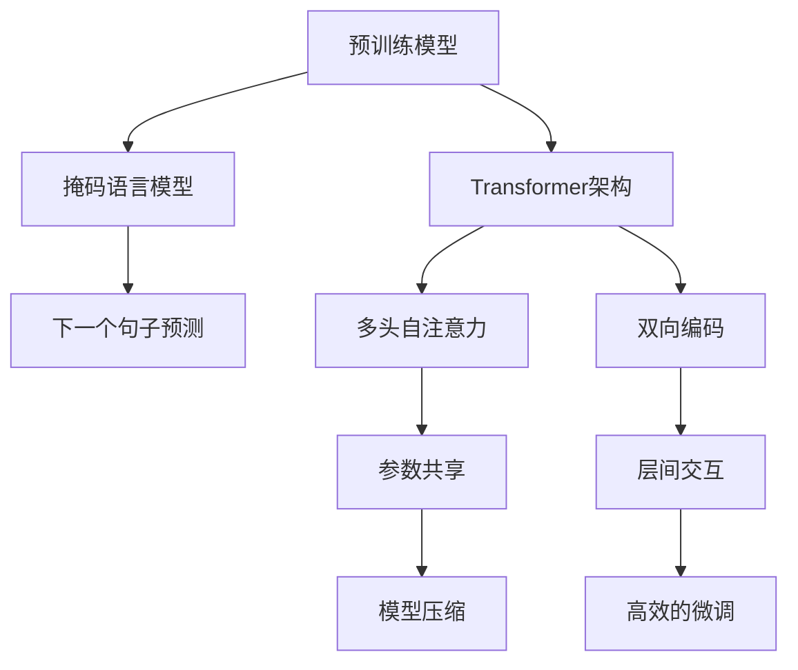

                 

# Transformer大模型实战 对比ALBERT与BERT

## 1. 背景介绍

Transformer大模型，如BERT和ALBERT，凭借其强大的语言表示能力，在自然语言处理(NLP)领域取得了突破性进展。它们不仅在多项任务上刷新了最先进的结果，还极大地推动了预训练语言模型(PLMs)的发展。本文将深入探讨Transformer大模型的核心原理和实践细节，通过对比ALBERT与BERT，帮助读者更好地理解它们的优势与差异。

## 2. 核心概念与联系

### 2.1 核心概念概述

Transformer大模型是基于注意力机制的自编码模型，主要用于学习语言表示。其中，BERT和ALBERT都是基于Transformer架构的预训练语言模型，具有以下共同点：

- **自监督预训练**：通过在大规模无标签文本数据上进行预训练，学习语言的基本规律和模式。
- **Transformer结构**：利用多头自注意力机制捕捉不同词之间的语义关系。
- **双向编码**：通过掩码语言模型等任务，学习词汇的上下文信息。
- **预训练-微调范式**：在预训练的基础上，使用少量标注数据进行微调，适应特定任务。

BERT（Bidirectional Encoder Representations from Transformers）和ALBERT（A Lite BERT）是Transformer大模型的代表，它们在架构和训练策略上有一些显著差异：

- **BERT**：使用掩码语言模型和下一句预测任务进行预训练，目标是学习词汇的上下文关系。
- **ALBERT**：采用更高效的参数共享和层间交互方式，减少计算资源消耗，提升模型训练速度。

这些差异在模型性能和应用场景中均有体现。

### 2.2 核心概念原理和架构的 Mermaid 流程图



这个流程图展示了Transformer大模型的核心组件和预训练过程：

- 预训练模型使用Transformer架构，包括多头自注意力和双向编码。
- 掩码语言模型和下一个句子预测任务用于捕捉词汇的上下文信息。
- 参数共享和层间交互使得ALBERT模型更加高效。
- 模型压缩和高效的微调优化了模型性能。

## 3. 核心算法原理 & 具体操作步骤

### 3.1 算法原理概述

Transformer大模型的核心算法原理包括以下几个方面：

- **自注意力机制**：通过多头自注意力，模型可以同时关注文本中的所有词，捕捉词汇之间的关系。
- **双向编码**：掩码语言模型和下一个句子预测任务使得模型可以同时理解前向和后向的上下文信息。
- **参数共享**：ALBERT模型采用参数共享策略，减少计算资源消耗。
- **高效的微调**：通过合理设计微调策略，使得模型能够快速适应特定任务。

### 3.2 算法步骤详解

1. **数据准备**：收集大规模无标签文本数据，划分为多个小批量。
2. **模型初始化**：使用随机初始化的Transformer大模型作为预训练模型。
3. **预训练过程**：
   - **掩码语言模型**：在输入序列中随机掩码某些词，训练模型预测这些词的正确位置。
   - **下一个句子预测**：随机选择两个句子，输入到模型中，预测它们是否是相邻的。
4. **参数更新**：使用随机梯度下降法更新模型参数，最小化预测误差。
5. **微调过程**：
   - **任务适配层**：在预训练模型的基础上，添加任务相关的输出层。
   - **损失函数**：根据特定任务设计损失函数，如交叉熵损失、均方误差等。
   - **优化器**：选择合适的优化器（如AdamW、SGD等），设置学习率。
   - **微调训练**：在标注数据上进行有监督训练，更新模型参数。

### 3.3 算法优缺点

Transformer大模型的优点：

- **强大的语言表示能力**：通过自注意力和双向编码，模型可以捕捉复杂的语义关系。
- **高效的微调**：通过参数共享和层间交互，模型能够快速适应特定任务。
- **广泛的适用性**：适用于各种NLP任务，包括分类、匹配、生成等。

Transformer大模型的缺点：

- **计算资源需求高**：模型参数量庞大，训练和推理过程需要高性能硬件支持。
- **易受数据分布影响**：模型效果依赖于预训练数据的质量和多样性。
- **过拟合风险**：在标注数据不足的情况下，模型容易过拟合。

### 3.4 算法应用领域

Transformer大模型在NLP领域有广泛的应用，如文本分类、命名实体识别、关系抽取、问答系统、机器翻译等。具体应用场景包括：

- **文本分类**：将文本分为不同的类别，如情感分析、主题分类等。
- **命名实体识别**：识别文本中的实体（如人名、地名、机构名等）。
- **关系抽取**：从文本中抽取实体之间的语义关系。
- **问答系统**：根据用户提问，生成准确的回答。
- **机器翻译**：将一种语言的文本翻译成另一种语言。
- **文本摘要**：将长文本压缩成简短的摘要。

## 4. 数学模型和公式 & 详细讲解 & 举例说明

### 4.1 数学模型构建

Transformer大模型包括自注意力机制和多层感知机（MLP）。以下是BERT和ALBERT的数学模型构建：

**BERT模型**：

$$
H^{[CLS]} = \text{Self-Attention}(Q^{[CLS]}, K, V)
$$

其中，$Q^{[CLS]}$ 是CLS token的嵌入向量，$K$ 和 $V$ 分别是查询和值向量。

**ALBERT模型**：

$$
H^{[CLS]} = \text{Self-Attention}(Q^{[CLS]}, K, V) + \text{Cross-Attention}(Q^{[CLS]}, K, V)
$$

ALBERT模型的交叉注意力机制用于捕捉不同层的特征，进一步提升模型性能。

### 4.2 公式推导过程

Transformer大模型的核心公式包括自注意力和MLP。以BERT为例：

- **自注意力机制**：

$$
Q = W_Q H^{[CLS]}
$$

$$
K = W_K H^{[CLS]}
$$

$$
V = W_V H^{[CLS]}
$$

其中，$W_Q$、$W_K$、$W_V$ 是线性变换矩阵。

- **MLP层**：

$$
H^{[CLS]}_{\text{MLP}} = \text{ReLU}(W_1 H^{[CLS]}) + b_1
$$

$$
H^{[CLS]} = W_2 H^{[CLS]}_{\text{MLP}} + b_2
$$

其中，$W_1$、$W_2$ 和 $b_1$、$b_2$ 分别是MLP层的权重和偏置。

### 4.3 案例分析与讲解

以ALBERT模型为例，我们分析其在处理下游任务时的性能：

- **参数共享**：ALBERT采用参数共享策略，减少了不必要的参数，提高了模型训练效率。
- **层间交互**：通过交叉注意力机制，ALBERT可以更好地捕捉不同层的信息，提升模型泛化能力。
- **高效微调**：通过合理设计微调策略，ALBERT可以更快地适应特定任务，减少标注样本的需求。

## 5. 项目实践：代码实例和详细解释说明

### 5.1 开发环境搭建

以下是使用PyTorch搭建Transformer大模型开发环境的步骤：

1. **安装Anaconda**：
```bash
conda create -n transformers python=3.8 
conda activate transformers
```

2. **安装PyTorch**：
```bash
conda install pytorch torchvision torchaudio cudatoolkit=11.1 -c pytorch -c conda-forge
```

3. **安装Transformers库**：
```bash
pip install transformers
```

4. **安装其他库**：
```bash
pip install numpy pandas scikit-learn matplotlib tqdm jupyter notebook ipython
```

### 5.2 源代码详细实现

以下是一个使用ALBERT模型进行命名实体识别任务的代码示例：

```python
from transformers import AutoTokenizer, AutoModelForTokenClassification
import torch

tokenizer = AutoTokenizer.from_pretrained('albert-base-v2')
model = AutoModelForTokenClassification.from_pretrained('albert-base-v2')

# 准备文本数据
text = 'Google was founded in 1998 by Larry Page and Sergey Brin.'
inputs = tokenizer(text, return_tensors='pt')

# 前向传播计算损失
outputs = model(**inputs)
loss = outputs.loss

# 后向传播更新参数
optimizer = torch.optim.AdamW(model.parameters(), lr=2e-5)
optimizer.zero_grad()
loss.backward()
optimizer.step()

# 输出结果
predictions = outputs.logits.argmax(dim=2)
```

### 5.3 代码解读与分析

- **AutoTokenizer和AutoModelForTokenClassification**：用于加载ALBERT模型的分词器和分类模型。
- **前向传播**：将文本数据输入模型，计算损失。
- **后向传播**：更新模型参数。
- **预测输出**：通过softmax函数计算预测标签。

## 6. 实际应用场景

### 6.1 智能客服系统

基于ALBERT的智能客服系统可以提供7x24小时不间断服务，快速响应客户咨询，并理解客户意图。该系统能够通过微调学习不同领域的知识，提高服务质量。

### 6.2 金融舆情监测

使用ALBERT模型进行金融舆情监测，可以实时监测市场舆论动向，快速响应负面信息传播。通过微调，模型可以学习金融领域特定的语言模式，提高舆情分析的准确性。

### 6.3 个性化推荐系统

ALBERT模型可以通过微调学习用户的兴趣和偏好，生成个性化的推荐内容。在推荐系统中，模型可以通过历史行为数据进行微调，提升推荐的准确性和多样性。

### 6.4 未来应用展望

随着ALBERT等Transformer大模型的不断发展，其应用领域将更加广泛。未来，它们可能将在医疗、教育、智慧城市等多个领域发挥重要作用，推动人工智能技术的普及和应用。

## 7. 工具和资源推荐

### 7.1 学习资源推荐

- **《Transformer从原理到实践》系列博文**：深入介绍Transformer大模型的原理和实践。
- **CS224N《深度学习自然语言处理》课程**：斯坦福大学开设的NLP明星课程，涵盖NLP的基本概念和经典模型。
- **《Natural Language Processing with Transformers》书籍**：介绍如何使用Transformers库进行NLP任务开发。
- **HuggingFace官方文档**：提供预训练模型的样例代码，帮助开发者快速上手。
- **CLUE开源项目**：提供中文NLP数据集和微调baseline模型，助力中文NLP技术发展。

### 7.2 开发工具推荐

- **PyTorch**：灵活的深度学习框架，支持分布式训练。
- **TensorFlow**：Google主导的开源框架，适合大规模工程应用。
- **Transformers库**：HuggingFace开发的NLP工具库，提供丰富的预训练模型。
- **Weights & Biases**：模型训练的实验跟踪工具，帮助调试模型。
- **TensorBoard**：TensorFlow配套的可视化工具，实时监测模型训练状态。

### 7.3 相关论文推荐

- **Attention is All You Need**：Transformer原论文，介绍Transformer架构。
- **BERT: Pre-training of Deep Bidirectional Transformers for Language Understanding**：BERT模型的论文，介绍预训练过程和微调方法。
- **Parameter-Efficient Transfer Learning for NLP**：介绍参数高效微调方法。
- **Prefix-Tuning: Optimizing Continuous Prompts for Generation**：介绍基于连续型Prompt的微调方法。
- **AdaLoRA: Adaptive Low-Rank Adaptation for Parameter-Efficient Fine-Tuning**：介绍自适应低秩适应的微调方法。

## 8. 总结：未来发展趋势与挑战

### 8.1 总结

本文详细探讨了Transformer大模型，特别是ALBERT与BERT的对比。通过分析它们的算法原理、具体操作步骤和实际应用，帮助读者更好地理解这些模型的优势与差异。Transformer大模型通过自注意力机制和双向编码，在NLP任务上取得了显著的性能提升，成为当前自然语言处理领域的主流范式。未来，随着技术的不断进步，这些模型将在更多领域得到应用，为人工智能技术的发展注入新的活力。

### 8.2 未来发展趋势

1. **模型规模持续增大**：随着算力成本的下降和数据规模的扩张，Transformer大模型的参数量还将持续增长，预训练和微调所需的时间和计算资源也将随之增加。
2. **微调方法日趋多样**：除了传统的全参数微调，未来将涌现更多参数高效的微调方法，如Adapter、LoRA等，以提高微调效率，降低计算成本。
3. **持续学习成为常态**：随着数据分布的不断变化，微调模型需要持续学习新知识以保持性能。
4. **少样本学习和零样本学习**：受启发于提示学习(Prompt-based Learning)的思路，未来的微调方法将更好地利用大模型的语言理解能力，在更少的标注样本上实现理想微调效果。
5. **多模态微调崛起**：未来将进一步拓展到图像、视频、语音等多模态数据微调，融合多种模态信息，提升语言模型的泛化能力。

### 8.3 面临的挑战

尽管Transformer大模型在NLP领域取得了显著成果，但在实际应用中仍面临以下挑战：

1. **计算资源瓶颈**：模型参数量庞大，训练和推理过程需要高性能硬件支持。
2. **数据依赖性高**：模型效果依赖于预训练数据的质量和多样性，获取高质量标注数据的成本较高。
3. **过拟合风险**：在标注数据不足的情况下，模型容易过拟合，泛化性能不足。
4. **可解释性不足**：Transformer大模型的决策过程缺乏可解释性，难以调试和理解。
5. **伦理安全性**：模型可能学习到有害的偏见和信息，影响应用的安全性和可靠性。

### 8.4 研究展望

未来，在解决这些挑战的同时，Transformer大模型将进一步拓展应用领域，提升性能和可解释性，推动人工智能技术的普及和应用。研究人员需要不断探索新的模型架构和训练策略，结合专家知识和多模态信息，提升模型的泛化能力和实用性。只有不断创新和突破，才能实现Transformer大模型在各个领域的广泛应用，推动人工智能技术的进步。

## 9. 附录：常见问题与解答

**Q1: ALBERT和BERT相比，哪个模型更适合特定任务？**

A: ALBERT和BERT在结构和微调策略上有所不同，具体选择取决于任务需求。ALBERT采用参数共享和高效的微调方法，适合资源受限的环境。而BERT具有更强大的双向编码能力，适合处理复杂的语言理解和生成任务。

**Q2: 微调过程中如何选择合适的学习率？**

A: 微调学习率一般要比预训练时小1-2个数量级。可以使用warmup策略，在开始阶段使用较小的学习率，再逐渐过渡到预设值。不同的优化器和学习率调度策略可能需要设置不同的学习率阈值。

**Q3: 微调模型在落地部署时需要注意哪些问题？**

A: 微调模型在落地部署时需要注意计算资源、模型裁剪、量化加速、服务化封装、弹性伸缩、监控告警和安全防护等问题。只有全面考虑这些因素，才能确保模型在实际应用中的稳定性和安全性。

**Q4: ALBERT模型相比BERT，有什么优势？**

A: ALBERT模型采用参数共享和高效的微调方法，减少了不必要的参数，提高了训练效率。同时，ALBERT的交叉注意力机制可以更好地捕捉不同层的信息，提升模型的泛化能力。

**Q5: 如何缓解微调过程中的过拟合问题？**

A: 缓解微调过程中的过拟合问题，可以通过数据增强、正则化、对抗训练、参数高效微调等方法。具体选择取决于数据规模和任务特点。

---

作者：禅与计算机程序设计艺术 / Zen and the Art of Computer Programming

