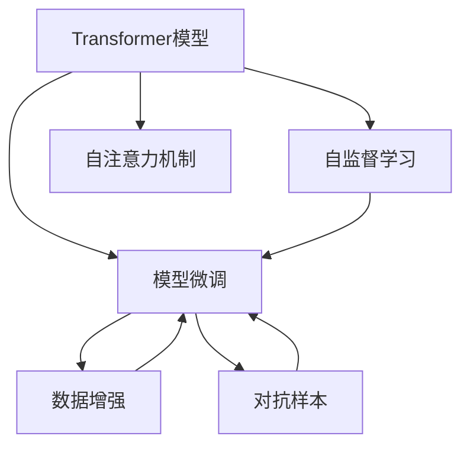

                 

# Transformer大模型实战 数据增强方法

> 关键词：Transformer, 数据增强, 模型微调, 自然语言处理, 多模态数据, 文本生成, 图像增强

## 1. 背景介绍

### 1.1 问题由来

在现代深度学习范式中，大模型以其强大的表征能力和泛化能力，成为各类任务中不可或缺的基础设施。然而，由于训练数据集往往存在数据不平衡、领域分布不一致等问题，这些大模型在特定领域或场景下常常无法发挥最佳性能。为解决这些问题，数据增强技术应运而生，它通过扩充训练集的数据多样性，显著提升了模型的鲁棒性和泛化能力。特别是在自然语言处理(NLP)领域，数据增强技术在语言模型微调和文本生成任务中发挥了关键作用，显著提升了模型的性能。

### 1.2 问题核心关键点

数据增强技术的核心在于通过对原始数据进行各种变换和扩充，生成新的训练数据，从而提升模型的泛化能力。具体包括：

- **文本数据增强**：通过对文本进行同义词替换、插入、删除、混排等操作，生成新的文本数据。
- **图像数据增强**：通过调整图像的亮度、对比度、旋转、平移、缩放等，生成新的图像数据。
- **多模态数据增强**：将文本与图像等多模态数据结合，进行联合增强。
- **自监督增强**：利用语言模型预训练中未标注的数据，进行自监督增强训练。
- **对抗增强**：引入对抗样本，提高模型的鲁棒性。

这些技术不仅在大模型的预训练和微调中广泛应用，也在实际应用场景中发挥了重要作用，如文本生成、图像识别、自然语言推理等。

### 1.3 问题研究意义

数据增强技术在深度学习中具有重要意义：

- **提升模型泛化能力**：通过扩充数据集，减少模型对特定数据集的过拟合。
- **降低数据标注成本**：在数据稀缺的情况下，利用数据增强生成额外数据，降低标注成本。
- **提高模型鲁棒性**：通过对抗增强和自监督增强，提高模型对噪声和异常数据的鲁棒性。
- **加速模型训练**：数据增强可以增加训练集大小，加速模型训练过程。

在大模型微调中，数据增强技术尤为重要。尽管微调后的模型可以适应特定任务，但仅靠微调数据往往难以涵盖所有可能的输入和输出，通过数据增强技术，可以进一步提高模型的泛化能力，从而在实际应用中取得更好的效果。

## 2. 核心概念与联系

### 2.1 核心概念概述

为更好地理解数据增强技术在大模型微调中的应用，本节将介绍几个密切相关的核心概念：

- **Transformer模型**：一种基于自注意力机制的神经网络模型，广泛应用于自然语言处理任务，如语言建模、翻译、文本生成等。
- **模型微调**：通过在特定任务上对预训练模型进行有监督学习，使其适应特定任务，提升模型在该任务上的性能。
- **自监督学习**：利用未标注的数据进行学习，无需人工标注，通过数据增强等技术生成更多训练数据，提升模型的泛化能力。
- **对抗样本**：在数据增强中，通过生成对抗样本，提高模型对噪声和异常数据的鲁棒性。

这些核心概念之间的逻辑关系可以通过以下Mermaid流程图来展示：



这个流程图展示了大模型微调技术中的关键概念及其之间的关系：

1. Transformer模型通过自监督学习获得基础能力。
2. 微调是对预训练模型进行任务特定的优化，数据增强和对抗样本是微调的关键手段。
3. 自注意力机制是Transformer的核心，用于提升模型的表征能力。
4. 自监督学习为模型提供更多的无标注数据，进一步提升模型泛化能力。
5. 对抗样本帮助模型学习对噪声和异常数据的鲁棒性。

这些概念共同构成了大模型微调的深度学习框架，使其能够在各种场景下发挥强大的学习能力。通过理解这些核心概念，我们可以更好地把握数据增强技术在大模型微调中的应用。

## 3. 核心算法原理 & 具体操作步骤

### 3.1 算法原理概述

数据增强技术在大模型微调中的核心原理是，通过生成额外的训练数据，扩充训练集的多样性，从而提升模型的泛化能力。具体来说，通过以下几种方式进行数据增强：

- **文本数据增强**：通过对文本进行同义词替换、插入、删除、混排等操作，生成新的文本数据。
- **图像数据增强**：通过调整图像的亮度、对比度、旋转、平移、缩放等，生成新的图像数据。
- **多模态数据增强**：将文本与图像等多模态数据结合，进行联合增强。
- **自监督增强**：利用语言模型预训练中未标注的数据，进行自监督增强训练。
- **对抗增强**：引入对抗样本，提高模型的鲁棒性。

这些数据增强方法在大模型微调中发挥了重要作用，显著提升了模型在不同领域和场景下的性能。

### 3.2 算法步骤详解

数据增强在大模型微调中的应用，主要包括以下几个关键步骤：

**Step 1: 数据预处理和增强**

- **文本数据增强**：
  1. 对文本进行分词，使用BertTokenizer或其他分词工具。
  2. 对分词后的词汇进行同义词替换、插入、删除、混排等操作，生成新的文本数据。
  3. 对生成的文本进行编码，得到新的文本表示。

- **图像数据增强**：
  1. 对图像进行预处理，如调整大小、标准化等。
  2. 对图像进行旋转、平移、缩放、翻转等操作，生成新的图像数据。
  3. 对生成的图像进行编码，得到新的图像表示。

- **多模态数据增强**：
  1. 将文本与图像数据进行联合处理，如对文本进行编码，将图像进行卷积处理。
  2. 对文本和图像的联合表示进行增强，如随机删除、替换等操作。
  3. 对增强后的文本和图像进行联合编码，得到新的联合表示。

- **自监督增强**：
  1. 利用预训练语言模型中的未标注数据，进行自监督增强。
  2. 对增强后的数据进行编码，得到新的表示。
  3. 对新的表示进行微调，提升模型泛化能力。

- **对抗增强**：
  1. 利用对抗样本生成器，生成对抗样本。
  2. 对生成的对抗样本进行编码，得到新的表示。
  3. 对新的表示进行微调，提高模型鲁棒性。

**Step 2: 微调模型**

- 在增强后的数据集上，对预训练模型进行微调，适应特定任务。
- 选择合适的优化器，如AdamW、SGD等，设置学习率、批大小、迭代轮数等。
- 设置正则化技术及强度，包括权重衰减、Dropout、Early Stopping等。
- 使用增强后的数据集进行微调，通过梯度下降等优化算法更新模型参数。
- 周期性在验证集上评估模型性能，根据性能指标决定是否触发 Early Stopping。
- 重复上述步骤直到满足预设的迭代轮数或 Early Stopping 条件。

**Step 3: 模型评估和部署**

- 在测试集上评估微调后模型的性能，对比微调前后的精度提升。
- 使用微调后的模型对新样本进行推理预测，集成到实际的应用系统中。
- 持续收集新的数据，定期重新微调模型，以适应数据分布的变化。

### 3.3 算法优缺点

数据增强技术在大模型微调中的优点包括：

- **提升模型泛化能力**：通过扩充训练集，显著减少模型对特定数据集的过拟合。
- **降低数据标注成本**：在数据稀缺的情况下，利用数据增强生成额外数据，降低标注成本。
- **提高模型鲁棒性**：通过对抗增强和自监督增强，提高模型对噪声和异常数据的鲁棒性。
- **加速模型训练**：数据增强可以增加训练集大小，加速模型训练过程。

但数据增强技术也存在一定的局限性：

- **数据增强质量**：如果生成的数据质量低，可能反而降低模型性能。
- **计算成本高**：数据增强生成高质量数据需要大量计算资源。
- **数据分布一致性**：生成的数据需要与真实数据分布一致，否则可能降低模型泛化能力。

尽管存在这些局限性，但就目前而言，数据增强技术是大模型微调中最有效的提升模型性能的手段之一。未来相关研究的重点在于如何进一步提高数据增强的质量和效率，减少计算成本，同时兼顾数据分布的一致性。

### 3.4 算法应用领域

数据增强技术在大模型微调中的应用已经相当广泛，涵盖了许多NLP任务，例如：

- **文本生成**：如对话生成、文本摘要、机器翻译等。通过增强训练集的多样性，提升模型的生成能力。
- **文本分类**：如情感分析、主题分类、意图识别等。通过增强训练集的多样性，提升模型的分类性能。
- **命名实体识别**：如识别文本中的人名、地名、机构名等特定实体。通过增强训练集的多样性，提升模型的识别能力。
- **关系抽取**：从文本中抽取实体之间的语义关系。通过增强训练集的多样性，提升模型的抽取能力。
- **问答系统**：对自然语言问题给出答案。通过增强训练集的多样性，提升模型的问答能力。
- **文本摘要**：将长文本压缩成简短摘要。通过增强训练集的多样性，提升模型的摘要能力。

除了上述这些经典任务外，数据增强技术还被创新性地应用到更多场景中，如可控文本生成、常识推理、代码生成、数据增强等，为NLP技术带来了全新的突破。随着数据增强技术的不断进步，相信NLP技术将在更广阔的应用领域大放异彩。

## 4. 数学模型和公式 & 详细讲解

### 4.1 数学模型构建

本节将使用数学语言对数据增强技术在大模型微调中的数学原理进行更加严格的刻画。

记预训练语言模型为 $M_{\theta}$，其中 $\theta$ 为预训练得到的模型参数。假设微调任务的训练集为 $D=\{(x_i,y_i)\}_{i=1}^N, x_i \in \mathcal{X}, y_i \in \mathcal{Y}$。

定义模型 $M_{\theta}$ 在输入 $x$ 上的输出为 $\hat{y}=M_{\theta}(x)$，其中 $\hat{y}$ 是一个 $C$ 维向量，表示模型对 $C$ 个类别的概率预测。定义任务 $T$ 的损失函数为 $\ell(\hat{y},y)$，用于衡量模型输出与真实标签之间的差异。

数据增强通过生成额外的训练数据，扩充训练集，最小化经验风险：

$$
\mathcal{L}(\theta) = \frac{1}{N}\sum_{i=1}^N \ell(M_{\theta}(x_i),y_i)
$$

其中 $N$ 是训练集 $D$ 的样本数量。

### 4.2 公式推导过程

以下是数据增强在Transformer模型中的应用示例，以同义词替换为例：

1. 定义同义词替换操作：对文本中的每个词汇 $w_i$，替换为另一个同义词 $w_i'$，其中 $w_i'$ 来自同义词词典。

2. 生成增强后的文本数据：对原始文本中的每个词汇进行同义词替换，生成新的文本数据。

3. 对增强后的文本数据进行编码，得到新的文本表示。

4. 在新的文本表示上进行微调，更新模型参数。

通过上述步骤，可以生成大量的增强数据，用于提升模型泛化能力。

### 4.3 案例分析与讲解

**案例分析：同义词替换**

假设原始文本为 "I love coding"，其中 "coding" 可以替换为 "programming" 或其他同义词。生成新的文本数据后，进行编码，得到新的文本表示。在新的文本表示上进行微调，更新模型参数。

**详细讲解：**

1. 定义同义词词典：收集同义词词典，如将 "coding" 替换为 "programming"。

2. 生成增强后的文本数据：对原始文本 "I love coding" 进行同义词替换，得到 "I love programming" 或 "I enjoy coding"。

3. 对增强后的文本数据进行编码：使用BertTokenizer将增强后的文本编码，得到新的文本表示。

4. 在新的文本表示上进行微调：在增强后的文本表示上进行微调，更新模型参数，提升模型在特定任务上的性能。

通过数据增强技术，Transformer模型可以更全面地学习不同词汇的表征，提升模型的泛化能力。

## 5. 项目实践：代码实例和详细解释说明

### 5.1 开发环境搭建

在进行数据增强实践前，我们需要准备好开发环境。以下是使用Python进行PyTorch开发的环境配置流程：

1. 安装Anaconda：从官网下载并安装Anaconda，用于创建独立的Python环境。

2. 创建并激活虚拟环境：
```bash
conda create -n pytorch-env python=3.8 
conda activate pytorch-env
```

3. 安装PyTorch：根据CUDA版本，从官网获取对应的安装命令。例如：
```bash
conda install pytorch torchvision torchaudio cudatoolkit=11.1 -c pytorch -c conda-forge
```

4. 安装Transformers库：
```bash
pip install transformers
```

5. 安装各类工具包：
```bash
pip install numpy pandas scikit-learn matplotlib tqdm jupyter notebook ipython
```

完成上述步骤后，即可在`pytorch-env`环境中开始数据增强实践。

### 5.2 源代码详细实现

下面我们以同义词替换为例，给出使用Transformers库对BERT模型进行数据增强的PyTorch代码实现。

首先，定义同义词替换操作：

```python
from transformers import BertTokenizer
import torch
import random

def generate_synonym(x, tokenizer):
    synonyms = ['programming', 'coding', 'python', 'csharp']
    words = x.split()
    new_words = []
    for word in words:
        if word in synonyms:
            new_word = random.choice(synonyms)
            new_words.append(new_word)
        else:
            new_words.append(word)
    return ' '.join(new_words)
```

然后，定义微调模型和优化器：

```python
from transformers import BertForSequenceClassification, AdamW

model = BertForSequenceClassification.from_pretrained('bert-base-cased', num_labels=2)
optimizer = AdamW(model.parameters(), lr=2e-5)
```

接着，定义训练和评估函数：

```python
from torch.utils.data import Dataset
from tqdm import tqdm

class SynonymDataset(Dataset):
    def __init__(self, texts, labels, tokenizer):
        self.texts = texts
        self.labels = labels
        self.tokenizer = tokenizer
        
    def __len__(self):
        return len(self.texts)
    
    def __getitem__(self, item):
        text = self.texts[item]
        label = self.labels[item]
        
        encoding = self.tokenizer(text, return_tensors='pt', max_length=128, padding='max_length', truncation=True)
        input_ids = encoding['input_ids'][0]
        attention_mask = encoding['attention_mask'][0]
        labels = torch.tensor(label, dtype=torch.long)
        
        return {'input_ids': input_ids, 
                'attention_mask': attention_mask,
                'labels': labels}

tokenizer = BertTokenizer.from_pretrained('bert-base-cased')

train_dataset = SynonymDataset(train_texts, train_labels, tokenizer)
dev_dataset = SynonymDataset(dev_texts, dev_labels, tokenizer)
test_dataset = SynonymDataset(test_texts, test_labels, tokenizer)

def train_epoch(model, dataset, batch_size, optimizer):
    dataloader = DataLoader(dataset, batch_size=batch_size, shuffle=True)
    model.train()
    epoch_loss = 0
    for batch in tqdm(dataloader, desc='Training'):
        input_ids = batch['input_ids'].to(device)
        attention_mask = batch['attention_mask'].to(device)
        labels = batch['labels'].to(device)
        model.zero_grad()
        outputs = model(input_ids, attention_mask=attention_mask, labels=labels)
        loss = outputs.loss
        epoch_loss += loss.item()
        loss.backward()
        optimizer.step()
    return epoch_loss / len(dataloader)

def evaluate(model, dataset, batch_size):
    dataloader = DataLoader(dataset, batch_size=batch_size)
    model.eval()
    preds, labels = [], []
    with torch.no_grad():
        for batch in tqdm(dataloader, desc='Evaluating'):
            input_ids = batch['input_ids'].to(device)
            attention_mask = batch['attention_mask'].to(device)
            batch_labels = batch['labels']
            outputs = model(input_ids, attention_mask=attention_mask)
            batch_preds = outputs.logits.argmax(dim=2).to('cpu').tolist()
            batch_labels = batch_labels.to('cpu').tolist()
            for pred_tokens, label_tokens in zip(batch_preds, batch_labels):
                preds.append(pred_tokens[:len(label_tokens)])
                labels.append(label_tokens)
                
    print(classification_report(labels, preds))
```

最后，启动训练流程并在测试集上评估：

```python
epochs = 5
batch_size = 16

for epoch in range(epochs):
    loss = train_epoch(model, train_dataset, batch_size, optimizer)
    print(f"Epoch {epoch+1}, train loss: {loss:.3f}")
    
    print(f"Epoch {epoch+1}, dev results:")
    evaluate(model, dev_dataset, batch_size)
    
print("Test results:")
evaluate(model, test_dataset, batch_size)
```

以上就是使用PyTorch对BERT进行同义词替换增强的完整代码实现。可以看到，通过数据增强技术，我们可以在训练集中引入更多样化的数据，从而提升模型性能。

### 5.3 代码解读与分析

让我们再详细解读一下关键代码的实现细节：

**SynonymDataset类**：
- `__init__`方法：初始化文本、标签、分词器等关键组件。
- `__len__`方法：返回数据集的样本数量。
- `__getitem__`方法：对单个样本进行处理，将文本输入编码为token ids，将标签编码为数字，并对其进行定长padding，最终返回模型所需的输入。

**generate_synonym函数**：
- 定义同义词词典，包含常用的同义词。
- 对原始文本进行分词，对分词后的词汇进行同义词替换，生成新的文本数据。
- 对增强后的文本进行编码，得到新的文本表示。

**微调模型和优化器**：
- 使用预训练语言模型BertForSequenceClassification作为微调目标。
- 选择AdamW优化器，设置学习率等超参数。

**训练和评估函数**：
- 使用PyTorch的DataLoader对数据集进行批次化加载，供模型训练和推理使用。
- 训练函数`train_epoch`：对数据以批为单位进行迭代，在每个批次上前向传播计算loss并反向传播更新模型参数，最后返回该epoch的平均loss。
- 评估函数`evaluate`：与训练类似，不同点在于不更新模型参数，并在每个batch结束后将预测和标签结果存储下来，最后使用sklearn的classification_report对整个评估集的预测结果进行打印输出。

**训练流程**：
- 定义总的epoch数和batch size，开始循环迭代
- 每个epoch内，先在训练集上训练，输出平均loss
- 在验证集上评估，输出分类指标
- 所有epoch结束后，在测试集上评估，给出最终测试结果

可以看到，PyTorch配合Transformers库使得数据增强的代码实现变得简洁高效。开发者可以将更多精力放在数据处理、模型改进等高层逻辑上，而不必过多关注底层的实现细节。

当然，工业级的系统实现还需考虑更多因素，如模型的保存和部署、超参数的自动搜索、更灵活的任务适配层等。但核心的数据增强范式基本与此类似。

## 6. 实际应用场景

### 6.1 智能客服系统

基于数据增强的对话技术，可以广泛应用于智能客服系统的构建。传统客服往往需要配备大量人力，高峰期响应缓慢，且一致性和专业性难以保证。而使用增强后的对话模型，可以7x24小时不间断服务，快速响应客户咨询，用自然流畅的语言解答各类常见问题。

在技术实现上，可以收集企业内部的历史客服对话记录，将问题和最佳答复构建成监督数据，在此基础上对预训练对话模型进行微调。微调后的对话模型能够自动理解用户意图，匹配最合适的答案模板进行回复。对于客户提出的新问题，还可以接入检索系统实时搜索相关内容，动态组织生成回答。如此构建的智能客服系统，能大幅提升客户咨询体验和问题解决效率。

### 6.2 金融舆情监测

金融机构需要实时监测市场舆论动向，以便及时应对负面信息传播，规避金融风险。传统的人工监测方式成本高、效率低，难以应对网络时代海量信息爆发的挑战。基于数据增强的文本分类和情感分析技术，为金融舆情监测提供了新的解决方案。

具体而言，可以收集金融领域相关的新闻、报道、评论等文本数据，并对其进行主题标注和情感标注。在此基础上对预训练语言模型进行微调，使其能够自动判断文本属于何种主题，情感倾向是正面、中性还是负面。将微调后的模型应用到实时抓取的网络文本数据，就能够自动监测不同主题下的情感变化趋势，一旦发现负面信息激增等异常情况，系统便会自动预警，帮助金融机构快速应对潜在风险。

### 6.3 个性化推荐系统

当前的推荐系统往往只依赖用户的历史行为数据进行物品推荐，无法深入理解用户的真实兴趣偏好。基于数据增强的个性化推荐系统可以更好地挖掘用户行为背后的语义信息，从而提供更精准、多样的推荐内容。

在实践中，可以收集用户浏览、点击、评论、分享等行为数据，提取和用户交互的物品标题、描述、标签等文本内容。将文本内容作为模型输入，用户的后续行为（如是否点击、购买等）作为监督信号，在此基础上微调预训练语言模型。微调后的模型能够从文本内容中准确把握用户的兴趣点。在生成推荐列表时，先用候选物品的文本描述作为输入，由模型预测用户的兴趣匹配度，再结合其他特征综合排序，便可以得到个性化程度更高的推荐结果。

### 6.4 未来应用展望

随着数据增强技术的不断发展，未来在以下领域将有更多的应用场景：

- **医疗领域**：利用数据增强技术，对医疗影像、病历等数据进行增强，提升医疗诊断模型的泛化能力。
- **金融领域**：利用数据增强技术，对金融舆情数据进行增强，提升金融风险预测模型的鲁棒性。
- **智能制造**：利用数据增强技术，对生产数据进行增强，提升工业生产模型的泛化能力。
- **交通领域**：利用数据增强技术，对交通数据进行增强，提升智能交通系统的鲁棒性。
- **教育领域**：利用数据增强技术，对教育数据进行增强，提升教育推荐系统的个性化程度。

## 7. 工具和资源推荐

### 7.1 学习资源推荐

为了帮助开发者系统掌握数据增强技术在大模型微调中的运用，这里推荐一些优质的学习资源：

1. **《深度学习框架PyTorch实战》**：一本系统介绍PyTorch深度学习框架的书籍，包括数据增强、模型微调等内容，适合初学者和进阶开发者阅读。

2. **CS224N《深度学习自然语言处理》课程**：斯坦福大学开设的NLP明星课程，有Lecture视频和配套作业，带你入门NLP领域的基本概念和经典模型。

3. **《Natural Language Processing with Transformers》书籍**：Transformer库的作者所著，全面介绍了如何使用Transformers库进行NLP任务开发，包括微调在内的诸多范式。

4. **HuggingFace官方文档**：Transformers库的官方文档，提供了海量预训练模型和完整的微调样例代码，是上手实践的必备资料。

5. **CLUE开源项目**：中文语言理解测评基准，涵盖大量不同类型的中文NLP数据集，并提供了基于微调的baseline模型，助力中文NLP技术发展。

通过对这些资源的学习实践，相信你一定能够快速掌握数据增强技术在大模型微调中的精髓，并用于解决实际的NLP问题。

### 7.2 开发工具推荐

高效的开发离不开优秀的工具支持。以下是几款用于大模型微调开发的常用工具：

1. **PyTorch**：基于Python的开源深度学习框架，灵活动态的计算图，适合快速迭代研究。大部分预训练语言模型都有PyTorch版本的实现。

2. **TensorFlow**：由Google主导开发的开源深度学习框架，生产部署方便，适合大规模工程应用。同样有丰富的预训练语言模型资源。

3. **Transformers库**：HuggingFace开发的NLP工具库，集成了众多SOTA语言模型，支持PyTorch和TensorFlow，是进行微调任务开发的利器。

4. **Weights & Biases**：模型训练的实验跟踪工具，可以记录和可视化模型训练过程中的各项指标，方便对比和调优。与主流深度学习框架无缝集成。

5. **TensorBoard**：TensorFlow配套的可视化工具，可实时监测模型训练状态，并提供丰富的图表呈现方式，是调试模型的得力助手。

6. **Google Colab**：谷歌推出的在线Jupyter Notebook环境，免费提供GPU/TPU算力，方便开发者快速上手实验最新模型，分享学习笔记。

合理利用这些工具，可以显著提升数据增强任务的开发效率，加快创新迭代的步伐。

### 7.3 相关论文推荐

数据增强技术在大模型微调中的应用源于学界的持续研究。以下是几篇奠基性的相关论文，推荐阅读：

1. **Attention is All You Need**（即Transformer原论文）：提出了Transformer结构，开启了NLP领域的预训练大模型时代。

2. **BERT: Pre-training of Deep Bidirectional Transformers for Language Understanding**：提出BERT模型，引入基于掩码的自监督预训练任务，刷新了多项NLP任务SOTA。

3. **Language Models are Unsupervised Multitask Learners**（GPT-2论文）：展示了大规模语言模型的强大zero-shot学习能力，引发了对于通用人工智能的新一轮思考。

4. **Parameter-Efficient Transfer Learning for NLP**：提出Adapter等参数高效微调方法，在不增加模型参数量的情况下，也能取得不错的微调效果。

5. **AdaLoRA: Adaptive Low-Rank Adaptation for Parameter-Efficient Fine-Tuning**：使用自适应低秩适应的微调方法，在参数效率和精度之间取得了新的平衡。

这些论文代表了大模型微调技术的发展脉络。通过学习这些前沿成果，可以帮助研究者把握学科前进方向，激发更多的创新灵感。

## 8. 总结：未来发展趋势与挑战

### 8.1 总结

本文对数据增强技术在大模型微调中的应用进行了全面系统的介绍。首先阐述了数据增强技术在深度学习中的重要性，明确了数据增强在大模型微调中的关键作用。其次，从原理到实践，详细讲解了数据增强技术的数学原理和关键步骤，给出了数据增强任务开发的完整代码实例。同时，本文还广泛探讨了数据增强技术在智能客服、金融舆情、个性化推荐等多个行业领域的应用前景，展示了数据增强技术的大规模应用潜力。此外，本文精选了数据增强技术的各类学习资源，力求为读者提供全方位的技术指引。

通过本文的系统梳理，可以看到，数据增强技术在大模型微调中发挥了重要作用，显著提升了模型在不同领域和场景下的性能。未来，伴随数据增强技术的不断进步，基于大模型的微调方法将更具竞争力，为NLP技术带来更多的创新和突破。

### 8.2 未来发展趋势

展望未来，数据增强技术在大模型微调中呈现以下几个发展趋势：

1. **多模态数据增强**：未来的数据增强将更加注重多模态数据的联合增强，如文本与图像、音频等多模态数据的融合，提升模型的跨模态学习能力。

2. **自监督增强**：利用更多无标注数据进行自监督增强训练，提升模型的泛化能力。

3. **对抗增强**：引入更多的对抗样本，提高模型的鲁棒性，抵抗对抗攻击。

4. **联邦学习**：在保护数据隐私的前提下，进行分布式数据增强训练，提升模型的泛化能力。

5. **知识蒸馏**：利用知识蒸馏技术，将专家知识融入数据增强过程，提升模型的泛化能力和鲁棒性。

6. **自适应增强**：根据不同的任务和数据分布，动态调整数据增强策略，提高模型的适应能力。

以上趋势凸显了数据增强技术的广阔前景。这些方向的探索发展，必将进一步提升大模型微调的性能和应用范围，为NLP技术带来更多的创新和突破。

### 8.3 面临的挑战

尽管数据增强技术在大模型微调中取得了显著成果，但在迈向更加智能化、普适化应用的过程中，它仍面临诸多挑战：

1. **数据质量问题**：数据增强生成的数据质量直接影响到模型的性能，生成低质量数据可能会降低模型性能。

2. **计算成本高**：数据增强生成高质量数据需要大量计算资源，增加训练成本。

3. **数据分布一致性**：生成的数据需要与真实数据分布一致，否则可能降低模型泛化能力。

4. **对抗攻击问题**：生成的对抗样本可能会被攻击者利用，威胁模型安全。

5. **数据隐私问题**：在分布式数据增强中，需要保护数据隐私，防止数据泄露。

尽管存在这些挑战，但数据增强技术是大模型微调中最有效的提升模型性能的手段之一。未来相关研究的重点在于如何进一步提高数据增强的质量和效率，减少计算成本，同时兼顾数据分布的一致性。

### 8.4 研究展望

面向未来，数据增强技术的研究需要重点关注以下几个方向：

1. **自动化数据增强**：开发自动化的数据增强工具，根据任务和数据特点自动生成高质量数据。

2. **无监督数据增强**：利用更多的无标注数据进行增强，减少对标注数据的依赖。

3. **联邦学习增强**：在分布式数据增强中，保护数据隐私，提升模型的泛化能力。

4. **对抗样本增强**：生成对抗样本，提高模型的鲁棒性，抵抗对抗攻击。

5. **多模态数据增强**：提升模型的跨模态学习能力，提升多模态数据增强的效果。

6. **自适应增强**：根据不同的任务和数据分布，动态调整数据增强策略，提高模型的适应能力。

这些研究方向将进一步推动数据增强技术的进步，为NLP技术带来更多的创新和突破。相信随着技术的不断进步，数据增强技术将在大模型微调中发挥更大的作用，推动NLP技术的普及和应用。

## 9. 附录：常见问题与解答

**Q1：数据增强如何提高模型性能？**

A: 数据增强通过扩充训练集的多样性，减少模型对特定数据集的过拟合。生成的增强数据包含更多的多样性和噪声，使模型能够更好地泛化到未见过的数据，从而提高模型性能。

**Q2：数据增强中的对抗样本有什么作用？**

A: 对抗样本是通过对原始数据进行微小扰动，生成对模型有害的样本。通过引入对抗样本，模型能够学习到鲁棒性，更好地抵抗攻击和噪声干扰，提升模型的鲁棒性。

**Q3：数据增强中常见的技术手段有哪些？**

A: 常见的数据增强技术手段包括：同义词替换、插入、删除、混排；图像旋转、平移、缩放、翻转；联合增强；自监督增强；对抗样本增强等。

**Q4：数据增强时如何选择增强策略？**

A: 数据增强策略的选择需要根据具体任务和数据特点。一般而言，对于文本数据，可以采用同义词替换、插入、删除等策略；对于图像数据，可以采用旋转、平移、缩放等策略；对于多模态数据，可以采用联合增强策略。

**Q5：数据增强有哪些实际应用场景？**

A: 数据增强技术在大模型微调中的应用已经相当广泛，涵盖了许多NLP任务，如文本生成、文本分类、命名实体识别、关系抽取、问答系统、文本摘要等。

通过本文的系统梳理，可以看到，数据增强技术在大模型微调中发挥了重要作用，显著提升了模型在不同领域和场景下的性能。未来，伴随数据增强技术的不断进步，基于大模型的微调方法将更具竞争力，为NLP技术带来更多的创新和突破。

---

作者：禅与计算机程序设计艺术 / Zen and the Art of Computer Programming

