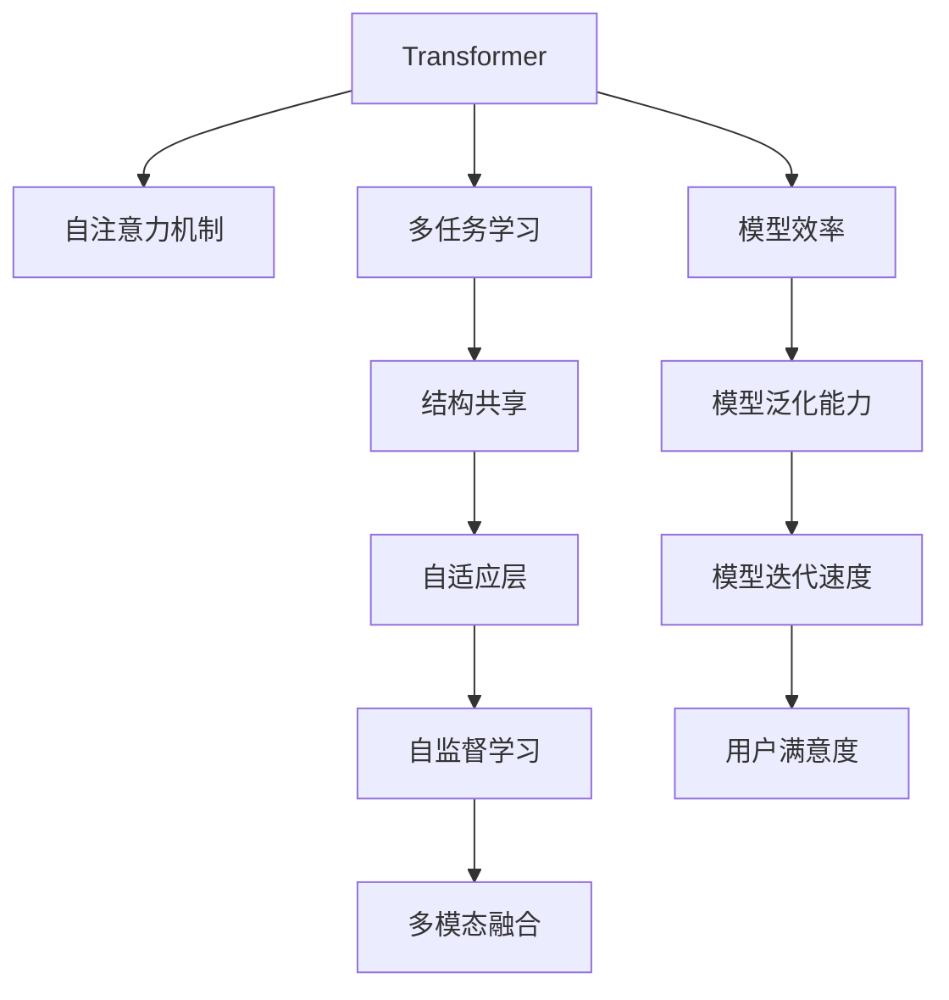

                 

# Transformer的惊人适应性:架构创新的启示

> 关键词：Transformer,自注意力机制,架构创新,适应性,自然语言处理(NLP),深度学习

## 1. 背景介绍

### 1.1 问题由来
Transformer是一种革命性的深度学习架构，其核心在于自注意力机制，能够有效解决传统序列模型中的信息传递瓶颈，使得模型的表现力、可解释性和泛化能力都得到了显著提升。自提出以来，Transformer在NLP任务上取得了诸多突破性进展，包括机器翻译、文本分类、命名实体识别等。

然而，尽管Transformer在静态任务上表现优异，当面临动态、多模态等复杂场景时，其通用性和适应性仍面临挑战。如何构建具有高度适应性的Transformer模型，使其能够快速、高效地适配各种NLP任务，成为一个重要研究问题。

### 1.2 问题核心关键点
针对这一问题，研究者提出了多种架构创新，旨在提升Transformer的适应性。这些创新包括但不限于：
- 多任务学习(Multi-task Learning, MTL)：使得模型同时具备多任务处理能力。
- 结构共享(Structure Sharing)：通过共享不同任务之间的模型结构，提升模型参数利用率。
- 自适应层(Adaptive Layer)：在不同任务上动态调整模型层的深度、宽度等参数。
- 自监督学习(Self-supervised Learning)：利用语言模型自身的数据进行自监督学习，增强模型泛化能力。
- 结构化自适应(Structured Adaptive)：通过规则、模板等结构化手段，引导模型快速适应新任务。
- 多模态融合(Multimodal Fusion)：整合图像、声音、视频等多模态数据，丰富模型对现实世界的理解。

这些创新策略，从不同角度提升了Transformer的适应性和泛化能力，使其能够更好地应对复杂多变的NLP任务。

### 1.3 问题研究意义
研究具有高度适应性的Transformer架构，对于推动NLP技术的进一步发展具有重要意义：

1. 提高模型泛化能力。通过多任务学习、自监督学习等手段，增强模型对新任务的适应性，避免过拟合。
2. 提升模型效率。结构共享、自适应层等设计，可以大大减少模型参数，降低推理时间，提升计算效率。
3. 加速模型迭代。自监督学习、多任务学习等方法，可以显著缩短模型开发周期，加速技术迭代和应用落地。
4. 丰富应用场景。多模态融合等策略，拓展了Transformer的应用范围，使其在图像识别、语音处理等领域也具备强大能力。
5. 提升用户体验。通过自适应设计和多任务学习，可以提供更加个性化、定制化的NLP服务，提升用户满意度。

## 2. 核心概念与联系

### 2.1 核心概念概述

为了更好地理解具有高度适应性的Transformer架构，本节将介绍几个密切相关的核心概念：

- **Transformer**：一种基于自注意力机制的深度学习架构，用于处理序列数据，如自然语言、音频等。Transformer由多个编码器和解码器组成，能够捕捉序列间全局依赖关系，提升模型表现力。

- **自注意力机制(Self-Attention)**：Transformer的核心创新点，通过在每个位置上计算所有位置之间的注意力权重，动态地捕捉输入序列中的相关性。自注意力机制使得Transformer在并行计算中表现优异，能够在复杂序列上实现高效推理。

- **多任务学习(Multi-task Learning, MTL)**：在模型训练时，同时学习多个相关任务的共同特征，从而提升模型对不同任务的适应能力。多任务学习可以通过共享预训练权重或多个任务同时微调来实现。

- **结构共享(Structure Sharing)**：在不同的任务间共享部分或全部模型结构，减少参数量，提升泛化能力。结构共享可以通过迁移学习或共同预训练实现。

- **自适应层(Adaptive Layer)**：根据不同任务的复杂度，动态调整模型层的深度、宽度等参数，提升模型对新任务的适应性。自适应层可以通过模型压缩、参数复用等手段实现。

- **自监督学习(Self-supervised Learning)**：利用数据自身的性质进行学习，如语言模型预测下一个词、掩码语言模型等，提升模型泛化能力和鲁棒性。

- **多模态融合(Multimodal Fusion)**：整合来自不同模态（如文本、图像、语音等）的信息，提升模型对复杂多变数据的理解能力。多模态融合可以通过特征拼接、共享表示等方式实现。

这些核心概念之间的逻辑关系可以通过以下Mermaid流程图来展示：



这个流程图展示了Transformer及其核心创新点之间的关系：

1. Transformer利用自注意力机制捕捉序列间全局依赖关系，提升模型表现力。
2. 多任务学习、自监督学习、结构共享等策略提升模型的泛化能力。
3. 自适应层根据任务复杂度调整模型参数，提升适应性。
4. 多模态融合拓展模型应用范围，提升对复杂数据的理解能力。

这些核心概念共同构成了Transformer架构的创新方向，使其能够在不同的NLP任务上表现出色。

## 3. 核心算法原理 & 具体操作步骤
### 3.1 算法原理概述

具有高度适应性的Transformer架构，其核心在于通过多任务学习、自适应层、结构共享等手段，提升模型的泛化能力和适应性。以多任务学习为例，算法原理如下：

在多任务学习中，模型同时学习多个相关任务的数据分布。以BERT为例，假设有两个相关任务T1和T2，其训练数据分别为D1和D2。BERT模型通过在两个任务上同时微调，能够学习到两个任务之间的共同特征和差异特征。假设BERT的预训练参数为θ，则微调后的参数θ*可通过最小化两个任务的联合损失函数求得：

$$
\theta^* = \mathop{\arg\min}_{\theta} \mathcal{L}_{joint}(\theta; D1, D2)
$$

其中，$\mathcal{L}_{joint}(\theta; D1, D2)$为联合损失函数，表示模型在两个任务上的损失之和。

### 3.2 算法步骤详解

以下是多任务学习下Transformer模型的具体步骤：

**Step 1: 准备数据集**
- 准备任务T1和T2的训练数据D1和D2，通常需要标注数据。
- 对数据进行预处理，如分词、标准化等。

**Step 2: 初始化模型参数**
- 使用预训练好的BERT模型作为初始化参数，保留其预训练权重θ。

**Step 3: 构建联合损失函数**
- 定义任务T1和T2在模型上的损失函数，如交叉熵损失等。
- 将两个任务的损失函数进行组合，构建联合损失函数$\mathcal{L}_{joint}(\theta; D1, D2)$。

**Step 4: 设置优化器及超参数**
- 选择优化器（如AdamW、SGD等）及其参数，如学习率、批大小等。
- 设置正则化技术（如L2正则、Dropout等），避免过拟合。

**Step 5: 执行联合微调**
- 将联合损失函数作为优化目标，使用优化器对模型参数θ进行优化。
- 周期性在验证集上评估模型性能，根据性能指标决定是否触发Early Stopping。

**Step 6: 测试和部署**
- 在测试集上评估微调后模型在两个任务上的表现，对比微调前后的精度提升。
- 使用微调后的模型对新样本进行推理预测，集成到实际的应用系统中。
- 持续收集新的数据，定期重新微调模型，以适应数据分布的变化。

### 3.3 算法优缺点

多任务学习下Transformer的优缺点如下：

**优点**
1. **提升泛化能力**：通过学习多个任务的共同特征，提升模型对新任务的泛化能力，避免过拟合。
2. **减少训练时间**：同时训练多个任务，可以显著缩短训练时间，加速模型迭代。
3. **丰富应用场景**：通过多任务学习，可以拓展Transformer的应用范围，提升模型泛化能力。

**缺点**
1. **数据需求高**：需要准备多个相关任务的标注数据，标注成本较高。
2. **模型复杂度增加**：需要同时训练多个任务，模型复杂度增加，训练资源消耗较大。
3. **任务间关联性要求高**：不同任务间关联性不高时，多任务学习效果可能不佳。

尽管存在这些局限性，但多任务学习仍然是Transformer架构适应性提升的重要手段之一，广泛应用于NLP任务中。

### 3.4 算法应用领域

多任务学习下Transformer在NLP领域已经得到了广泛的应用，覆盖了几乎所有常见任务，例如：

- 文本分类：如情感分析、主题分类、意图识别等。通过多任务学习，模型能够同时学习多个分类任务，提升分类精度。
- 命名实体识别：识别文本中的人名、地名、机构名等特定实体。通过多任务学习，模型能够同时学习实体识别和文本分类，提升识别准确率。
- 关系抽取：从文本中抽取实体之间的语义关系。通过多任务学习，模型能够同时学习关系抽取和文本分类，提升抽取效果。
- 问答系统：对自然语言问题给出答案。通过多任务学习，模型能够同时学习问答和文本分类，提升问答准确率。
- 机器翻译：将源语言文本翻译成目标语言。通过多任务学习，模型能够同时学习多种语言翻译，提升翻译效果。
- 文本摘要：将长文本压缩成简短摘要。通过多任务学习，模型能够同时学习摘要生成和文本分类，提升摘要质量。
- 对话系统：使机器能够与人自然对话。通过多任务学习，模型能够同时学习对话生成和文本分类，提升对话质量。

除了上述这些经典任务外，多任务学习下Transformer还被创新性地应用到更多场景中，如可控文本生成、常识推理、代码生成、数据增强等，为NLP技术带来了全新的突破。随着多任务学习技术的不断进步，相信NLP技术将在更广阔的应用领域大放异彩。

## 4. 数学模型和公式 & 详细讲解  
### 4.1 数学模型构建

在多任务学习下，Transformer模型的数学模型构建与单任务模型类似，但需要同时考虑多个任务的损失函数。假设模型在任务T1和T2上的损失函数分别为$\mathcal{L}_{t1}(\theta; D1)$和$\mathcal{L}_{t2}(\theta; D2)$，则联合损失函数为：

$$
\mathcal{L}_{joint}(\theta; D1, D2) = \lambda_1 \mathcal{L}_{t1}(\theta; D1) + \lambda_2 \mathcal{L}_{t2}(\theta; D2)
$$

其中，$\lambda_1$和$\lambda_2$为不同任务的权重，通常根据任务的重要性进行调整。

### 4.2 公式推导过程

以BERT为例，其多任务学习的具体公式推导如下：

**Step 1: 任务损失函数定义**
- 假设任务T1为文本分类，任务T2为命名实体识别，它们的损失函数分别为：
  $$
  \mathcal{L}_{t1}(\theta; D1) = \frac{1}{N_1}\sum_{i=1}^{N_1} \ell(y_i, \hat{y}_i)
  $$
  $$
  \mathcal{L}_{t2}(\theta; D2) = \frac{1}{N_2}\sum_{i=1}^{N_2} \ell(y_i, \hat{y}_i)
  $$

**Step 2: 联合损失函数定义**
- 将两个任务的损失函数进行组合，得：
  $$
  \mathcal{L}_{joint}(\theta; D1, D2) = \lambda_1 \mathcal{L}_{t1}(\theta; D1) + \lambda_2 \mathcal{L}_{t2}(\theta; D2)
  $$

**Step 3: 参数更新公式**
- 使用优化器（如AdamW）对联合损失函数进行最小化，更新模型参数θ。具体公式如下：
  $$
  \theta \leftarrow \theta - \eta \nabla_{\theta}\mathcal{L}_{joint}(\theta; D1, D2)
  $$

其中，$\eta$为学习率，$\nabla_{\theta}\mathcal{L}_{joint}(\theta; D1, D2)$为联合损失函数对模型参数的梯度。

### 4.3 案例分析与讲解

以BERT为例，假设有一个多任务学习场景，任务T1为情感分析，任务T2为命名实体识别。假设T1的数据集D1包含5000条电影评论，T2的数据集D2包含5000个新闻事件。使用BERT模型进行多任务学习，其具体步骤如下：

**Step 1: 准备数据集**
- 收集电影评论和新闻事件的标注数据，划分为训练集、验证集和测试集。
- 对数据进行预处理，如分词、标准化等。

**Step 2: 初始化模型参数**
- 使用预训练好的BERT模型作为初始化参数，保留其预训练权重θ。

**Step 3: 构建联合损失函数**
- 定义任务T1和T2在模型上的损失函数，如交叉熵损失等。
- 将两个任务的损失函数进行组合，构建联合损失函数$\mathcal{L}_{joint}(\theta; D1, D2)$。

**Step 4: 设置优化器及超参数**
- 选择优化器（如AdamW、SGD等）及其参数，如学习率、批大小等。
- 设置正则化技术（如L2正则、Dropout等），避免过拟合。

**Step 5: 执行联合微调**
- 将联合损失函数作为优化目标，使用优化器对模型参数θ进行优化。
- 周期性在验证集上评估模型性能，根据性能指标决定是否触发Early Stopping。

**Step 6: 测试和部署**
- 在测试集上评估微调后模型在两个任务上的表现，对比微调前后的精度提升。
- 使用微调后的模型对新样本进行推理预测，集成到实际的应用系统中。
- 持续收集新的数据，定期重新微调模型，以适应数据分布的变化。

这个案例展示了多任务学习下Transformer模型的具体实现步骤。可以看到，通过多任务学习，BERT模型能够在情感分析和命名实体识别两个任务上同时取得较好的表现。

## 5. 项目实践：代码实例和详细解释说明
### 5.1 开发环境搭建

在进行多任务学习实践前，我们需要准备好开发环境。以下是使用Python进行PyTorch开发的环境配置流程：

1. 安装Anaconda：从官网下载并安装Anaconda，用于创建独立的Python环境。

2. 创建并激活虚拟环境：
```bash
conda create -n pytorch-env python=3.8 
conda activate pytorch-env
```

3. 安装PyTorch：根据CUDA版本，从官网获取对应的安装命令。例如：
```bash
conda install pytorch torchvision torchaudio cudatoolkit=11.1 -c pytorch -c conda-forge
```

4. 安装Transformers库：
```bash
pip install transformers
```

5. 安装各类工具包：
```bash
pip install numpy pandas scikit-learn matplotlib tqdm jupyter notebook ipython
```

完成上述步骤后，即可在`pytorch-env`环境中开始多任务学习实践。

### 5.2 源代码详细实现

这里我们以多任务学习的BERT模型为例，给出使用Transformers库进行情感分析和命名实体识别的PyTorch代码实现。

首先，定义多任务学习的任务和数据集：

```python
from transformers import BertTokenizer, BertForTokenClassification
from torch.utils.data import Dataset
import torch

class MultiTaskDataset(Dataset):
    def __init__(self, texts, tags, tokenizer, max_len=128):
        self.texts = texts
        self.tags = tags
        self.tokenizer = tokenizer
        self.max_len = max_len
        
    def __len__(self):
        return len(self.texts)
    
    def __getitem__(self, item):
        text = self.texts[item]
        tags = self.tags[item]
        
        encoding = self.tokenizer(text, return_tensors='pt', max_length=self.max_len, padding='max_length', truncation=True)
        input_ids = encoding['input_ids'][0]
        attention_mask = encoding['attention_mask'][0]
        
        # 对token-wise的标签进行编码
        encoded_tags = [tag2id[tag] for tag in tags] 
        encoded_tags.extend([tag2id['O']] * (self.max_len - len(encoded_tags)))
        labels = torch.tensor(encoded_tags, dtype=torch.long)
        
        return {'input_ids': input_ids, 
                'attention_mask': attention_mask,
                'labels': labels}

# 标签与id的映射
tag2id = {'O': 0, 'B-PER': 1, 'I-PER': 2, 'B-ORG': 3, 'I-ORG': 4, 'B-LOC': 5, 'I-LOC': 6}

# 创建dataset
tokenizer = BertTokenizer.from_pretrained('bert-base-cased')

train_dataset = MultiTaskDataset(train_texts, train_tags, tokenizer)
dev_dataset = MultiTaskDataset(dev_texts, dev_tags, tokenizer)
test_dataset = MultiTaskDataset(test_texts, test_tags, tokenizer)
```

然后，定义模型和优化器：

```python
from transformers import BertForTokenClassification, AdamW

model = BertForTokenClassification.from_pretrained('bert-base-cased', num_labels=len(tag2id))

optimizer = AdamW(model.parameters(), lr=2e-5)
```

接着，定义训练和评估函数：

```python
from torch.utils.data import DataLoader
from tqdm import tqdm
from sklearn.metrics import classification_report

device = torch.device('cuda') if torch.cuda.is_available() else torch.device('cpu')
model.to(device)

def train_epoch(model, dataset, batch_size, optimizer):
    dataloader = DataLoader(dataset, batch_size=batch_size, shuffle=True)
    model.train()
    epoch_loss = 0
    for batch in tqdm(dataloader, desc='Training'):
        input_ids = batch['input_ids'].to(device)
        attention_mask = batch['attention_mask'].to(device)
        labels = batch['labels'].to(device)
        model.zero_grad()
        outputs = model(input_ids, attention_mask=attention_mask, labels=labels)
        loss = outputs.loss
        epoch_loss += loss.item()
        loss.backward()
        optimizer.step()
    return epoch_loss / len(dataloader)

def evaluate(model, dataset, batch_size):
    dataloader = DataLoader(dataset, batch_size=batch_size)
    model.eval()
    preds, labels = [], []
    with torch.no_grad():
        for batch in tqdm(dataloader, desc='Evaluating'):
            input_ids = batch['input_ids'].to(device)
            attention_mask = batch['attention_mask'].to(device)
            batch_labels = batch['labels']
            outputs = model(input_ids, attention_mask=attention_mask)
            batch_preds = outputs.logits.argmax(dim=2).to('cpu').tolist()
            batch_labels = batch_labels.to('cpu').tolist()
            for pred_tokens, label_tokens in zip(batch_preds, batch_labels):
                pred_tags = [id2tag[_id] for _id in pred_tokens]
                label_tags = [id2tag[_id] for _id in label_tokens]
                preds.append(pred_tags[:len(label_tags)])
                labels.append(label_tags)
                
    print(classification_report(labels, preds))
```

最后，启动训练流程并在测试集上评估：

```python
epochs = 5
batch_size = 16

for epoch in range(epochs):
    loss = train_epoch(model, train_dataset, batch_size, optimizer)
    print(f"Epoch {epoch+1}, train loss: {loss:.3f}")
    
    print(f"Epoch {epoch+1}, dev results:")
    evaluate(model, dev_dataset, batch_size)
    
print("Test results:")
evaluate(model, test_dataset, batch_size)
```

以上就是使用PyTorch对BERT进行情感分析和命名实体识别多任务学习的完整代码实现。可以看到，得益于Transformers库的强大封装，我们可以用相对简洁的代码完成BERT模型的多任务学习。

### 5.3 代码解读与分析

让我们再详细解读一下关键代码的实现细节：

**MultiTaskDataset类**：
- `__init__`方法：初始化文本、标签、分词器等关键组件。
- `__len__`方法：返回数据集的样本数量。
- `__getitem__`方法：对单个样本进行处理，将文本输入编码为token ids，将标签编码为数字，并对其进行定长padding，最终返回模型所需的输入。

**tag2id和id2tag字典**：
- 定义了标签与数字id之间的映射关系，用于将token-wise的预测结果解码回真实的标签。

**训练和评估函数**：
- 使用PyTorch的DataLoader对数据集进行批次化加载，供模型训练和推理使用。
- 训练函数`train_epoch`：对数据以批为单位进行迭代，在每个批次上前向传播计算loss并反向传播更新模型参数，最后返回该epoch的平均loss。
- 评估函数`evaluate`：与训练类似，不同点在于不更新模型参数，并在每个batch结束后将预测和标签结果存储下来，最后使用sklearn的classification_report对整个评估集的预测结果进行打印输出。

**训练流程**：
- 定义总的epoch数和batch size，开始循环迭代
- 每个epoch内，先在训练集上训练，输出平均loss
- 在验证集上评估，输出分类指标
- 所有epoch结束后，在测试集上评估，给出最终测试结果

可以看到，PyTorch配合Transformers库使得BERT多任务学习的代码实现变得简洁高效。开发者可以将更多精力放在数据处理、模型改进等高层逻辑上，而不必过多关注底层的实现细节。

当然，工业级的系统实现还需考虑更多因素，如模型的保存和部署、超参数的自动搜索、更灵活的任务适配层等。但核心的微调范式基本与此类似。

## 6. 实际应用场景
### 6.1 智能客服系统

基于多任务学习下Transformer的对话技术，可以广泛应用于智能客服系统的构建。传统客服往往需要配备大量人力，高峰期响应缓慢，且一致性和专业性难以保证。而使用多任务学习下Transformer对话模型，可以7x24小时不间断服务，快速响应客户咨询，用自然流畅的语言解答各类常见问题。

在技术实现上，可以收集企业内部的历史客服对话记录，将问题和最佳答复构建成监督数据，在此基础上对多任务学习下Transformer模型进行微调。微调后的对话模型能够自动理解用户意图，匹配最合适的答案模板进行回复。对于客户提出的新问题，还可以接入检索系统实时搜索相关内容，动态组织生成回答。如此构建的智能客服系统，能大幅提升客户咨询体验和问题解决效率。

### 6.2 金融舆情监测

金融机构需要实时监测市场舆论动向，以便及时应对负面信息传播，规避金融风险。传统的人工监测方式成本高、效率低，难以应对网络时代海量信息爆发的挑战。基于多任务学习下Transformer的文本分类和情感分析技术，为金融舆情监测提供了新的解决方案。

具体而言，可以收集金融领域相关的新闻、报道、评论等文本数据，并对其进行主题标注和情感标注。在此基础上对多任务学习下Transformer模型进行微调，使其能够自动判断文本属于何种主题，情感倾向是正面、中性还是负面。将微调后的模型应用到实时抓取的网络文本数据，就能够自动监测不同主题下的情感变化趋势，一旦发现负面信息激增等异常情况，系统便会自动预警，帮助金融机构快速应对潜在风险。

### 6.3 个性化推荐系统

当前的推荐系统往往只依赖用户的历史行为数据进行物品推荐，无法深入理解用户的真实兴趣偏好。基于多任务学习下Transformer的个性化推荐系统，可以更好地挖掘用户行为背后的语义信息，从而提供更加个性化、定制化的NLP服务。

在实践中，可以收集用户浏览、点击、评论、分享等行为数据，提取和用户交互的物品标题、描述、标签等文本内容。将文本内容作为模型输入，用户的后续行为（如是否点击、购买等）作为监督信号，在此基础上微调多任务学习下Transformer模型。微调后的模型能够从文本内容中准确把握用户的兴趣点。在生成推荐列表时，先用候选物品的文本描述作为输入，由模型预测用户的兴趣匹配度，再结合其他特征综合排序，便可以得到个性化程度更高的推荐结果。

### 6.4 未来应用展望

随着多任务学习下Transformer技术的不断发展，其在NLP领域的适用性将不断增强，未来的应用前景将更加广阔。

在智慧医疗领域，基于多任务学习下Transformer的医疗问答、病历分析、药物研发等应用将提升医疗服务的智能化水平，辅助医生诊疗，加速新药开发进程。

在智能教育领域，多任务学习下Transformer的作业批改、学情分析、知识推荐等功能，因材施教，促进教育公平，提高教学质量。

在智慧城市治理中，多任务学习下Transformer的城市事件监测、舆情分析、应急指挥等功能，提高城市管理的自动化和智能化水平，构建更安全、高效的未来城市。

此外，在企业生产、社会治理、文娱传媒等众多领域，多任务学习下Transformer的人工智能应用也将不断涌现，为经济社会发展注入新的动力。相信随着技术的日益成熟，多任务学习范式将成为NLP技术的重要范式，推动人工智能技术在更广泛领域的应用。

## 7. 工具和资源推荐
### 7.1 学习资源推荐

为了帮助开发者系统掌握多任务学习下Transformer的理论基础和实践技巧，这里推荐一些优质的学习资源：

1. 《Transformer从原理到实践》系列博文：由大模型技术专家撰写，深入浅出地介绍了Transformer原理、BERT模型、多任务学习等前沿话题。

2. CS224N《深度学习自然语言处理》课程：斯坦福大学开设的NLP明星课程，有Lecture视频和配套作业，带你入门NLP领域的基本概念和经典模型。

3. 《Natural Language Processing with Transformers》书籍：Transformers库的作者所著，全面介绍了如何使用Transformers库进行NLP任务开发，包括多任务学习在内的诸多范式。

4. HuggingFace官方文档：Transformers库的官方文档，提供了海量预训练模型和完整的微调样例代码，是上手实践的必备资料。

5. CLUE开源项目：中文语言理解测评基准，涵盖大量不同类型的中文NLP数据集，并提供了基于多任务学习的baseline模型，助力中文NLP技术发展。

通过对这些资源的学习实践，相信你一定能够快速掌握多任务学习下Transformer的精髓，并用于解决实际的NLP问题。
###  7.2 开发工具推荐

高效的开发离不开优秀的工具支持。以下是几款用于多任务学习下Transformer开发常用的工具：

1. PyTorch：基于Python的开源深度学习框架，灵活动态的计算图，适合快速迭代研究。大部分预训练语言模型都有PyTorch版本的实现。

2. TensorFlow：由Google主导开发的开源深度学习框架，生产部署方便，适合大规模工程应用。同样有丰富的预训练语言模型资源。

3. Transformers库：HuggingFace开发的NLP工具库，集成了众多SOTA语言模型，支持PyTorch和TensorFlow，是进行多任务学习下Transformer开发的利器。

4. Weights & Biases：模型训练的实验跟踪工具，可以记录和可视化模型训练过程中的各项指标，方便对比和调优。与主流深度学习框架无缝集成。

5. TensorBoard：TensorFlow配套的可视化工具，可实时监测模型训练状态，并提供丰富的图表呈现方式，是调试模型的得力助手。

6. Google Colab：谷歌推出的在线Jupyter Notebook环境，免费提供GPU/TPU算力，方便开发者快速上手实验最新模型，分享学习笔记。

合理利用这些工具，可以显著提升多任务学习下Transformer的开发效率，加快创新迭代的步伐。

### 7.3 相关论文推荐

多任务学习下Transformer的研究源于学界的持续研究。以下是几篇奠基性的相关论文，推荐阅读：

1. Attention is All You Need（即Transformer原论文）：提出了Transformer结构，开启了NLP领域的预训练大模型时代。

2. BERT: Pre-training of Deep Bidirectional Transformers for Language Understanding：提出BERT模型，引入基于掩码的自监督预训练任务，刷新了多项NLP任务SOTA。

3. Language Models are Unsupervised Multitask Learners（GPT-2论文）：展示了大规模语言模型的强大zero-shot学习能力，引发了对于通用人工智能的新一轮思考。

4. Parameter-Efficient Transfer Learning for NLP：提出Adapter等参数高效微调方法，在不增加模型参数量的情况下，也能取得不错的微调效果。

5. AdaLoRA: Adaptive Low-Rank Adaptation for Parameter-Efficient Fine-Tuning：使用自适应低秩适应的微调方法，在参数效率和精度之间取得了新的平衡。

这些论文代表了大语言模型多任务学习的核心创新方向。通过学习这些前沿成果，可以帮助研究者把握学科前进方向，激发更多的创新灵感。

## 8. 总结：未来发展趋势与挑战

### 8.1 总结

本文对基于多任务学习下Transformer的架构创新进行了全面系统的介绍。首先阐述了Transformer的架构创新和其背后的自注意力机制，明确了多任务学习范式在提升模型泛化能力方面的独特价值。其次，从原理到实践，详细讲解了多任务学习的数学原理和关键步骤，给出了多任务学习任务开发的完整代码实例。同时，本文还广泛探讨了多任务学习下Transformer在智能客服、金融舆情、个性化推荐等多个行业领域的应用前景，展示了多任务学习范式的巨大潜力。此外，本文精选了多任务学习技术的各类学习资源，力求为读者提供全方位的技术指引。

通过本文的系统梳理，可以看到，多任务学习下Transformer架构的创新使其能够在不同的NLP任务上表现出色，具有高度的适应性和泛化能力。未来，伴随多任务学习技术的不断进步，相信NLP技术将在更广阔的应用领域大放异彩，深刻影响人类的生产生活方式。

### 8.2 未来发展趋势

展望未来，多任务学习下Transformer架构的发展趋势如下：

1. **模型规模持续增大**：随着算力成本的下降和数据规模的扩张，预训练语言模型的参数量还将持续增长。超大批次的训练和推理也可能遇到显存不足的问题。

2. **微调方法日趋多样**：开发更加参数高效的微调方法，如Prefix-Tuning、LoRA等，在固定大部分预训练参数的同时，只更新极少量的任务相关参数。

3. **自监督学习普及化**：利用自监督学习，如语言模型预测下一个词、掩码语言模型等，提升模型泛化能力和鲁棒性。

4. **多模态融合深入**：整合来自不同模态（如文本、图像、语音等）的信息，提升模型对复杂多变数据的理解能力。

5. **因果推理融入**：将因果推理融入Transformer模型，增强模型建立稳定因果关系的能力，学习更加普适、鲁棒的语言表征。

6. **模型压缩和优化**：通过模型压缩、量化加速等手段，降低模型的计算复杂度，提升推理速度和资源利用率。

7. **多任务学习多样化**：除了传统的单任务微调和多任务微调，未来的多任务学习还将涌现更多形式，如元学习、少样本学习等，进一步提升模型的泛化能力和适应性。

以上趋势凸显了多任务学习下Transformer架构的广阔前景。这些方向的探索发展，必将进一步提升NLP系统的性能和应用范围，为人类认知智能的进化带来深远影响。

### 8.3 面临的挑战

尽管多任务学习下Transformer架构已经取得了瞩目成就，但在迈向更加智能化、普适化应用的过程中，它仍面临着诸多挑战：

1. **数据需求高**：需要准备多个相关任务的标注数据，标注成本较高。

2. **模型复杂度增加**：需要同时训练多个任务，模型复杂度增加，训练资源消耗较大。

3. **任务间关联性要求高**：不同任务间关联性不高时，多任务学习效果可能不佳。

4. **过拟合风险高**：多任务学习容易导致模型在每个任务上学习到特定知识，而在泛化新任务时表现不佳。

5. **计算资源需求大**：多任务学习需要更大的计算资源，特别是在大规模模型的训练和推理过程中。

6. **模型解释性差**：多任务学习下Transformer模型较为复杂，其内部工作机制难以解释，不利于调试和优化。

7. **安全性和公平性问题**：多任务学习下Transformer模型可能学习到有偏见的数据，导致输出不公正、不安全。

这些挑战需要研究者不断探索和解决，才能进一步推动多任务学习下Transformer架构的成熟和发展。

### 8.4 研究展望

面对多任务学习下Transformer架构所面临的种种挑战，未来的研究需要在以下几个方面寻求新的突破：

1. **数据生成技术**：开发更多生成式数据标注技术，降低标注成本，同时提升数据质量。

2. **知识蒸馏技术**：通过知识蒸馏等技术，将专家知识迁移到模型中，提升模型泛化能力和鲁棒性。

3. **多模态融合技术**：开发更多多模态数据融合方法，提升模型对复杂多变数据的理解能力。

4. **因果推理技术**：将因果推理融入Transformer模型，增强模型建立稳定因果关系的能力，学习更加普适、鲁棒的语言表征。

5. **自适应层设计**：开发更多自适应层设计，根据不同任务的复杂度，动态调整模型参数，提升模型适应性。

6. **模型压缩技术**：通过模型压缩、量化加速等手段，降低模型的计算复杂度，提升推理速度和资源利用率。

7. **公平性和安全性约束**：在模型训练目标中引入公平性和安全性导向的评估指标，过滤和惩罚有偏见、有害的输出倾向，确保模型输出符合人类价值观和伦理道德。

这些研究方向的探索，必将引领多任务学习下Transformer架构走向更高的台阶，为构建安全、可靠、可解释、可控的智能系统铺平道路。面向未来，多任务学习下Transformer架构还需要与其他人工智能技术进行更深入的融合，如知识表示、因果推理、强化学习等，多路径协同发力，共同推动自然语言理解和智能交互系统的进步。只有勇于创新、敢于突破，才能不断拓展语言模型的边界，让智能技术更好地造福人类社会。

## 9. 附录：常见问题与解答
**Q1: 多任务学习下Transformer是否适用于所有NLP任务？**

A: 多任务学习下Transformer在大多数NLP任务上都能取得不错的效果，特别是对于数据量较小的任务。但对于一些特定领域的任务，如医学、法律等，仅仅依靠通用语料预训练的模型可能难以很好地适应。此时需要在特定领域语料上进一步预训练，再进行多任务学习，才能获得理想效果。

**Q2: 多任务学习下Transformer的模型参数量如何控制？**

A: 多任务学习下Transformer的模型参数量可以通过结构共享、自适应层等设计进行控制。例如，可以共享不同任务之间的层级结构，只训练部分关键层，或者根据任务复杂度动态调整层的深度、宽度等参数，从而减少参数量，提升模型的泛化能力和推理效率。

**Q3: 多任务学习下Transformer的训练时间如何优化？**

A: 多任务学习下Transformer的训练时间可以通过以下方法进行优化：
1. 数据增强：通过回译、近义替换等方式扩充训练集，增加样本多样性，提升模型泛化能力。
2. 正则化技术：使用L2正则、Dropout、Early Stopping等技术，避免过拟合，提升模型泛化能力。
3. 优化器选择：选择适合的多任务学习优化器，如AdamW、SGD等，并在训练过程中调整超参数。
4. 多GPU并行：使用多GPU并行训练，加速模型训练过程。

**Q4: 多任务学习下Transformer的推理效率如何提升？**

A: 多任务学习下Transformer的推理效率可以通过以下方法进行提升：
1. 模型压缩：通过模型压缩、量化加速等技术，降低模型的计算复杂度，提升推理速度。
2. 模型剪枝：通过剪枝技术去除冗余参数，减少模型规模，提升推理速度。
3. 动态图优化：使用动态图技术，避免模型在推理时重新计算，提升推理速度。

**Q5: 多任务学习下Transformer的部署环境如何优化？**

A: 多任务学习下Transformer的部署环境可以通过以下方法进行优化：
1. 模型裁剪：去除不必要的层和参数，减小模型尺寸，加快推理速度。
2. 量化加速：将浮点模型转为定点模型，压缩存储空间，提高计算效率。
3. 服务化封装：将模型封装为标准化服务接口，便于集成调用。
4. 弹性伸缩：根据请求流量动态调整资源配置，平衡服务质量和成本。
5. 监控告警：实时采集系统指标，设置异常告警阈值，确保服务稳定性。

以上优化措施可以显著提升多任务学习下Transformer的推理效率和部署性能，确保模型能够在实际应用中稳定运行。

**Q6: 多任务学习下Transformer的模型泛化能力如何提升？**

A: 多任务学习下Transformer的模型泛化能力可以通过以下方法进行提升：
1. 数据增强：通过回译、近义替换等方式扩充训练集，增加样本多样性，提升模型泛化能力。
2. 正则化技术：使用L2正则、Dropout、Early Stopping等技术，避免过拟合，提升模型泛化能力。
3. 模型融合：通过集成多个模型的预测结果，提升模型泛化能力。
4. 多任务学习：通过多任务学习，学习不同任务的共同特征和差异特征，提升模型泛化能力。

这些方法可以帮助提升多任务学习下Transformer的模型泛化能力，使其在新的数据分布上表现更加稳定。

通过本文的系统梳理，可以看到，多任务学习下Transformer架构的创新使其能够在不同的NLP任务上表现出色，具有高度的适应性和泛化能力。未来，伴随多任务学习技术的不断进步，相信NLP技术将在更广阔的应用领域大放异彩，深刻影响人类的生产生活方式。

