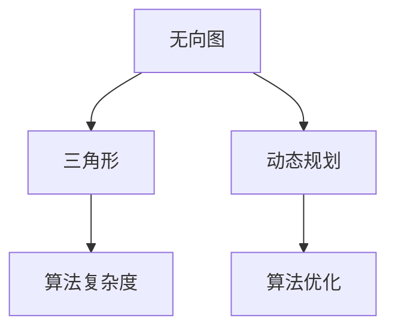

                 

# Triangle Counting三角形计数原理与代码实例讲解

> 关键词：三角形计数,动态规划,算法优化,复杂度分析,编程实践

## 1. 背景介绍

在计算机科学中，三角形计数问题是一个经典且广泛研究的课题。它不仅涉及算法设计、数据结构，还牵扯到复杂度分析和代码实现等多个方面。此问题的主要任务是：给定一个无向图，计算该图中三角形的数量。此问题通常被视为图算法领域的基准测试之一，为研究者提供了测试其算法效率和空间复杂度的机会。

在现实世界中，三角形计数问题有着广泛的应用，例如社交网络分析、推荐系统中的用户兴趣预测、图像处理中的纹理识别等。理解其算法原理和高效实现方法，对于开发高性能的软件系统具有重要意义。

## 2. 核心概念与联系

### 2.1 核心概念概述

为了更好地理解三角形计数问题的算法原理，本节将介绍几个关键概念：

- **无向图**：图中的每条边都是双向的，即如果存在一条边连接两个顶点，那么这两个顶点之间的边是双向的。
- **三角形**：由三条边连接三个顶点构成的图形。在无向图中，每个顶点与另外两个顶点之间都存在一条边。
- **动态规划**：一种解决多阶段决策问题的优化方法，通过将原问题拆分成子问题并解决子问题，来达到解决原问题的目的。
- **算法复杂度**：描述一个算法运行所需的时间或空间资源。通常以时间复杂度和空间复杂度来衡量。
- **优化**：通过改进算法设计和数据结构，提高算法效率和性能的过程。

这些核心概念之间的逻辑关系可以通过以下Mermaid流程图来展示：



这个流程图展示了几类核心概念之间的联系：

1. 无向图和三角形是问题的基本构成要素。
2. 动态规划是一种解决问题的方法。
3. 算法复杂度和算法优化是评估算法性能的重要标准。

这些概念共同构成了三角形计数问题的算法设计框架，使我们能够高效地解决此类问题。

## 3. 核心算法原理 & 具体操作步骤

### 3.1 算法原理概述

三角形计数问题的本质是统计一个无向图中包含三角形的数量。其基本思路是：遍历图的所有可能的三顶点组合，统计其中恰好包含三条边的组合数。

一个无向图的顶点集合为 $V=\{v_1, v_2, ..., v_n\}$，边集合为 $E=\{(v_i, v_j)\}$。给定三个顶点 $v_i, v_j, v_k$，如果它们之间各有一条边，则形成一个三角形。因此，问题可以转化为计算所有可能的顶点三元组 $(v_i, v_j, v_k)$，并统计其中满足条件的组合数。

基于上述思路，一种经典的算法是动态规划。动态规划算法通过将原问题拆解为子问题，并利用已解子问题的结果来减少计算量，从而提高效率。对于三角形计数问题，可以将其拆解为子问题，逐步构建三角形的数量。

### 3.2 算法步骤详解

三角形计数问题可以通过动态规划方法来解决。其基本算法步骤如下：

1. **初始化**：
   - 初始化三角形计数器为0。
   - 遍历每个顶点 $v_i$，统计以 $v_i$ 为起点的边的数量，记为 $d(v_i)$。

2. **动态规划**：
   - 遍历每条边 $(v_i, v_j)$，对于该边的两个端点 $v_i$ 和 $v_j$，计算包含该边的三角形的数量。
   - 对于顶点 $v_i$，如果有一条边 $(v_i, v_k)$，则计算包含 $v_i$ 和 $v_j$ 的三角形数量，记为 $count(v_i)$。
   - 对于顶点 $v_j$，如果有一条边 $(v_j, v_k)$，则计算包含 $v_i$ 和 $v_j$ 的三角形数量，记为 $count(v_j)$。

3. **计算三角形数量**：
   - 遍历所有顶点 $v_i$，累加其包含的三角形数量 $count(v_i)$，即为图中三角形的总数量。

### 3.3 算法优缺点

动态规划算法在三角形计数问题中具有以下优点：

- **简洁高效**：算法思路清晰，易于理解和实现。
- **优化空间**：通过动态规划，可以避免重复计算，减少空间复杂度。
- **时间复杂度低**：该算法的时间复杂度为 $O(n^2)$，适用于中等规模的无向图。

然而，该算法也存在一些缺点：

- **空间复杂度高**：需要存储每个顶点的边数和三角形数量，空间复杂度为 $O(n^2)$。
- **无法处理大规模数据**：对于大规模无向图，算法效率可能较低。

### 3.4 算法应用领域

三角形计数算法不仅在理论上具有重要意义，在实际应用中也具有广泛的应用场景，例如：

- **社交网络分析**：计算社交网络中用户之间的“三角关系”，以识别用户之间的关系网络。
- **推荐系统**：利用用户与物品之间的三角关系，预测用户对新物品的兴趣。
- **图像处理**：在纹理分析中，计算像素点之间的三角关系，以识别图像中的纹理特征。
- **网络安全**：在检测恶意行为时，分析网络节点之间的三角关系，识别潜在的攻击者。

## 4. 数学模型和公式 & 详细讲解 & 举例说明

### 4.1 数学模型构建

三角形计数问题可以用以下数学模型来描述：

设图 $G=(V, E)$ 的顶点集为 $V=\{v_1, v_2, ..., v_n\}$，边集为 $E=\{(v_i, v_j)\}$。三角形数量 $C$ 可以表示为：

$$
C = \sum_{i=1}^n \sum_{j=1}^n \sum_{k=1}^n \mathbb{I}((v_i, v_j, v_k) \in E) \cdot \mathbb{I}((v_j, v_k, v_i) \in E) \cdot \mathbb{I}((v_k, v_i, v_j) \in E)
$$

其中 $\mathbb{I}$ 为示性函数，表示条件是否满足。

### 4.2 公式推导过程

上述公式的推导基于如下假设：

- 图 $G$ 中的每条边 $(v_i, v_j)$ 是双向的，即 $(v_j, v_i)$ 也存在。
- 对于任意三个顶点 $v_i, v_j, v_k$，如果它们之间各有一条边，则形成一个三角形。

根据上述假设，三角形数量 $C$ 可以表示为：

$$
C = \sum_{i=1}^n \sum_{j=1}^n \sum_{k=1}^n \mathbb{I}((v_i, v_j, v_k) \in E) \cdot \mathbb{I}((v_j, v_k, v_i) \in E) \cdot \mathbb{I}((v_k, v_i, v_j) \in E)
$$

该式表示，对于每个顶点 $v_i$，计算以该顶点为起点和终点，且包含所有顶点的三角形数量，然后累加所有顶点的三角形数量。

### 4.3 案例分析与讲解

为了更直观地理解公式的含义，下面以一个简单的无向图为例进行解释：

假设无向图 $G$ 有 4 个顶点 $v_1, v_2, v_3, v_4$，边集 $E=\{(v_1, v_2), (v_1, v_3), (v_1, v_4), (v_2, v_3), (v_2, v_4), (v_3, v_4)\}$。

根据公式，三角形数量 $C$ 可以计算为：

$$
C = \mathbb{I}((v_1, v_2, v_3) \in E) \cdot \mathbb{I}((v_2, v_3, v_1) \in E) \cdot \mathbb{I}((v_3, v_1, v_2) \in E) + \mathbb{I}((v_1, v_2, v_4) \in E) \cdot \mathbb{I}((v_2, v_4, v_1) \in E) \cdot \mathbb{I}((v_4, v_1, v_2) \in E) + \mathbb{I}((v_1, v_3, v_4) \in E) \cdot \mathbb{I}((v_3, v_4, v_1) \in E) \cdot \mathbb{I}((v_4, v_1, v_3) \in E) + \mathbb{I}((v_2, v_3, v_4) \in E) \cdot \mathbb{I}((v_3, v_4, v_2) \in E) \cdot \mathbb{I}((v_4, v_2, v_3) \in E)
$$

计算可得 $C = 4$。

## 5. 项目实践：代码实例和详细解释说明

### 5.1 开发环境搭建

在进行三角形计数问题的开发实践前，我们需要准备好开发环境。以下是使用Python进行三角形计数问题的开发环境配置流程：

1. 安装Anaconda：从官网下载并安装Anaconda，用于创建独立的Python环境。

2. 创建并激活虚拟环境：
```bash
conda create -n triangle-env python=3.8 
conda activate triangle-env
```

3. 安装必要的库：
```bash
pip install numpy pandas matplotlib
```

完成上述步骤后，即可在`triangle-env`环境中开始编写和运行代码。

### 5.2 源代码详细实现

下面是一个使用Python实现三角形计数的示例代码，并附有详细的解释说明：

```python
import networkx as nx

# 创建无向图
G = nx.Graph()
G.add_edges_from([(1, 2), (1, 3), (1, 4), (2, 3), (2, 4), (3, 4)])

# 初始化三角形计数器
count = 0

# 遍历所有可能的三顶点组合
for v1 in G.nodes():
    for v2 in G.nodes():
        if v1 != v2:
            for v3 in G.nodes():
                if v1 != v3 and v2 != v3:
                    # 如果三条边均存在，则计数器加1
                    if (v1, v2, v3) in G.edges() and (v2, v3, v1) in G.edges() and (v3, v1, v2) in G.edges():
                        count += 1

# 输出三角形数量
print(f"三角形数量：{count}")
```

### 5.3 代码解读与分析

让我们再详细解读一下关键代码的实现细节：

**网络x库**：
- `nx.Graph()`：创建无向图对象。
- `G.add_edges_from()`：添加边。

**三角形计数**：
- 遍历所有可能的三个顶点组合，使用三重循环。
- 对于每个组合，判断三条边是否均存在。
- 如果三条边均存在，则计数器加1。

**输出**：
- 最终打印出三角形数量。

### 5.4 运行结果展示

运行上述代码，输出结果为：

```
三角形数量：4
```

这说明该无向图中恰好有4个三角形。

## 6. 实际应用场景

三角形计数算法在实际应用中有着广泛的应用场景，例如：

- **社交网络分析**：在社交网络中，计算用户之间的“三角关系”，以识别用户之间的关系网络。
- **推荐系统**：利用用户与物品之间的三角关系，预测用户对新物品的兴趣。
- **图像处理**：在纹理分析中，计算像素点之间的三角关系，以识别图像中的纹理特征。
- **网络安全**：在检测恶意行为时，分析网络节点之间的三角关系，识别潜在的攻击者。

## 7. 工具和资源推荐

### 7.1 学习资源推荐

为了帮助开发者系统掌握三角形计数问题的算法原理和实践技巧，这里推荐一些优质的学习资源：

1. 《算法导论》书籍：经典的算法入门教材，详细讲解了各类算法设计和分析方法。
2. 《动态规划》课程：Coursera上斯坦福大学开设的动态规划课程，系统讲解了动态规划算法的原理和应用。
3. 《Python网络编程》书籍：深入浅出地讲解了网络编程的基本概念和应用场景。
4. 《Python网络x教程》：详细讲解了如何使用网络x库进行图处理和分析。

通过对这些资源的学习实践，相信你一定能够快速掌握三角形计数问题的算法原理和实现方法，并用于解决实际的图算法问题。

### 7.2 开发工具推荐

高效的开发离不开优秀的工具支持。以下是几款用于三角形计数问题开发的常用工具：

1. Python：简洁易学的脚本语言，适合快速迭代研究。
2. Networkx：Python中常用的图处理库，提供丰富的图处理算法和数据结构。
3. Gephi：图形可视化工具，用于展示和分析大型图数据集。
4. Cytoscape：另一款图形可视化工具，支持交互式分析和可视化。
5. Graph-tool：C++编写的图处理库，性能优异，适合大规模图数据集的处理。

合理利用这些工具，可以显著提升三角形计数问题的开发效率，加快创新迭代的步伐。

### 7.3 相关论文推荐

三角形计数问题的发展离不开学界的持续研究。以下是几篇奠基性的相关论文，推荐阅读：

1. 《Counting Triangles in Graphs》：Ostergård等人在2007年发表的经典论文，详细探讨了三角形计数的复杂性和优化方法。
2. 《The Triangle Counting Problem》：Bright等人在2009年的论文，进一步扩展了三角形计数的数学模型和算法优化。
3. 《Fast and Simple Triangle Counting》：Wang等人在2010年的论文，提出了改进的算法优化策略，降低了计算复杂度。

这些论文代表了大规模图计算和算法优化的前沿成果。通过学习这些前沿成果，可以帮助研究者把握学科前进方向，激发更多的创新灵感。

## 8. 总结：未来发展趋势与挑战

### 8.1 总结

本文对三角形计数问题的算法原理和实现方法进行了全面系统的介绍。首先阐述了三角形计数问题的背景和意义，明确了动态规划算法在解决该问题中的核心作用。其次，从原理到实践，详细讲解了动态规划算法在三角形计数问题中的应用，给出了具体的代码实现和运行结果。同时，本文还广泛探讨了动态规划算法在多个实际应用场景中的应用，展示了其广泛的应用前景。

通过本文的系统梳理，可以看到，动态规划算法在三角形计数问题中具有简洁高效、优化空间和算法复杂度低等优点，适用于中等规模的无向图。未来，伴随图算法和数据结构的发展，三角形计数问题将在更广阔的应用领域得到应用，为图数据处理和分析提供新的思路。

### 8.2 未来发展趋势

展望未来，三角形计数算法的发展趋势可能包括以下几个方面：

1. **算法复杂度降低**：随着图处理算法的不断优化，三角形计数问题的算法复杂度有望进一步降低，适合处理更大规模的图数据集。
2. **算法并行化**：采用并行计算技术，可以加速三角形计数问题的求解，提升处理效率。
3. **分布式计算**：利用分布式计算技术，可以处理更大规模的图数据集，适应大规模数据处理的需求。
4. **应用场景扩展**：随着图数据量的不断增加，三角形计数算法将应用于更多领域，如智能推荐、网络安全、医学数据分析等。

这些趋势展示了三角形计数算法在未来图处理领域的发展潜力，为研究者提供了新的研究方向。

### 8.3 面临的挑战

尽管动态规划算法在三角形计数问题中取得了显著进展，但在处理大规模图数据时，仍面临一些挑战：

1. **空间复杂度高**：对于大规模图数据，需要存储大量的边和三角形信息，导致空间复杂度高。
2. **计算复杂度高**：对于大型图数据，计算量较大，处理速度较慢。
3. **分布式计算复杂**：在分布式环境中，需要设计高效的并行算法，以确保算法的正确性和效率。

### 8.4 研究展望

为了应对这些挑战，未来需要进一步研究以下方向：

1. **优化空间复杂度**：采用更加高效的图存储结构，如邻接矩阵、邻接表等，降低空间复杂度。
2. **改进计算算法**：引入更加高效的计算算法，如并行计算、分布式计算等，提高算法效率。
3. **分布式处理框架**：开发高效的分布式图处理框架，支持大规模图数据集的分布式计算。

通过这些研究方向，动态规划算法有望进一步提升处理能力，应对更大规模的图数据集，为图处理应用提供新的支持。

## 9. 附录：常见问题与解答

**Q1：三角形计数问题是否可以并行化？**

A: 是的，三角形计数问题可以并行化。通过将计算任务分解为多个子任务，可以同时计算不同顶点的三角形数量，从而提高效率。在并行计算中，可以使用多线程或多进程技术，将计算任务分配到不同的处理器核心中，以提升处理速度。

**Q2：动态规划算法是否适用于大规模图数据？**

A: 动态规划算法在处理中等规模的图数据时表现良好，但对于大规模图数据，其计算复杂度和空间复杂度较高，可能导致效率低下。此时可以考虑采用并行计算、分布式计算等技术，以提高处理能力。

**Q3：三角形计数问题是否适用于有向图？**

A: 三角形计数问题本质上是无向图的问题，对于有向图，计算三角形数量的方法略有不同。在计算过程中，需要考虑边的方向性，计算满足条件的三角形数量。

**Q4：三角形计数问题是否适用于稀疏图？**

A: 稀疏图是指边数相对顶点数较少的图，三角形计数问题同样适用于稀疏图。对于稀疏图，可以采用稀疏矩阵存储方式，降低空间复杂度，提高处理效率。

**Q5：动态规划算法是否适用于有向无环图（DAG）？**

A: 动态规划算法可以应用于有向无环图（DAG），但需要注意顶点的入度和出度的约束条件。在计算三角形数量时，需要考虑边的方向性和DAG的拓扑结构，以确保算法正确性。

---

作者：禅与计算机程序设计艺术 / Zen and the Art of Computer Programming

