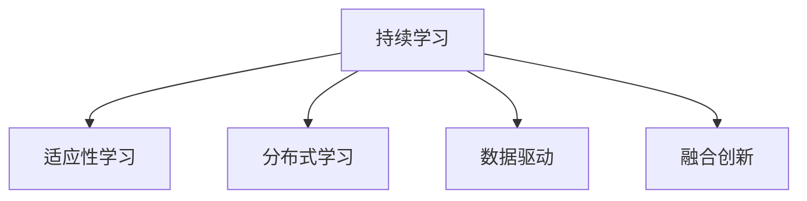

                 

## 1. 背景介绍

在当前VUCA（多变、不确定、复杂、模糊）时代的背景下，企业面临的内外环境日趋复杂多变。如何在不确定性、动态变化、信息泛滥和竞争加剧的挑战中，构建高效的适应性组织，实现持续创新，是每个企业管理者必须面对的问题。面对这种环境，传统的学习与知识管理方法已经无法满足需求，企业需要更灵活、更动态的学习策略。

### 1.1 问题由来

在VUCA时代，企业发展的不确定性增加，市场需求变化快速，企业需要在短周期内快速响应变化，并不断适应新的竞争环境。信息技术的飞速发展也带来了海量数据和复杂知识，传统学习方式难以有效应对。

### 1.2 问题核心关键点

为了在VUCA时代中保持竞争优势，企业需要建立敏捷、智能的学习系统，包括以下几个关键点：

- **持续学习**：在快速变化的环境下，企业需要不断学习和更新知识，以应对新的挑战。
- **适应性学习**：通过分析外部环境的变化，灵活调整学习策略，适应新的变化。
- **分布式学习**：在多变的企业环境中，分布式学习可以充分利用企业内外部资源，提升学习效率。
- **数据驱动**：在信息泛滥的时代，数据驱动的学习方式可以提供决策支持，帮助企业更好地制定战略。
- **融合创新**：通过融合不同的学科和方法，如人工智能、机器学习、人机协同，实现创新突破。

### 1.3 问题研究意义

在VUCA时代，研究VUCA下的学习策略，对于提升企业的创新能力、竞争力，以及适应性，具有重要意义：

1. **提升创新能力**：敏捷的学习策略有助于企业在快速变化的环境中快速识别机会，实现技术创新。
2. **增强竞争力**：通过持续学习，企业可以不断优化其业务流程，提升效率和质量，保持竞争优势。
3. **提高适应性**：适应性学习使得企业能够更好地应对外部环境的变化，实现可持续发展。
4. **促进协同**：分布式学习可以充分利用企业内外部资源，实现更广泛的协同合作。
5. **优化决策**：数据驱动的学习方式提供了实证基础，支持更科学、高效的决策。

## 2. 核心概念与联系

### 2.1 核心概念概述

要理解和构建适应VUCA时代的学习策略，需要理解以下核心概念：

- **持续学习（Continuous Learning）**：指在学习过程中不断更新和扩展知识库，保持对新知识的吸收和应用。
- **适应性学习（Adaptive Learning）**：指根据环境变化，动态调整学习策略和目标，适应新的变化。
- **分布式学习（Distributed Learning）**：指通过多地点、多层次的学习方式，充分利用企业内外部的知识资源。
- **数据驱动（Data-Driven Learning）**：指利用数据和算法进行学习，支持更科学、高效的决策。
- **融合创新（Convergence Innovation）**：指将不同学科和方法相结合，实现新的突破和应用。

这些概念通过以下Mermaid流程图展示其联系：



这个流程图展示了持续学习、适应性学习、分布式学习、数据驱动和融合创新之间的关系，以及它们如何相互促进，共同支持企业应对VUCA时代的挑战。

## 3. 核心算法原理 & 具体操作步骤

### 3.1 算法原理概述

VUCA时代下的学习策略基于以下几个核心算法原理：

- **增量学习（Incremental Learning）**：在知识库不断变化的环境下，通过增量更新和扩展知识库，保持知识的动态性。
- **自适应算法（Adaptive Algorithm）**：根据环境变化，动态调整学习算法和策略，适应新的变化。
- **分布式算法（Distributed Algorithm）**：通过多地点、多层次的学习方式，充分利用企业内外部的知识资源。
- **数据挖掘（Data Mining）**：利用数据挖掘技术，从海量数据中提取有价值的知识和洞见。
- **模型融合（Model Fusion）**：将不同模型的优点相结合，提升整体的学习效果和决策质量。

### 3.2 算法步骤详解

以下详细介绍VUCA时代下学习策略的核心算法步骤：

**Step 1: 数据收集与预处理**

1. 确定学习目标：根据业务需求，确定需要学习的内容和目标。
2. 收集数据：从内外部的多个来源收集相关数据，如客户反馈、市场调研、竞争情报等。
3. 数据清洗与预处理：去除噪声数据，进行数据归一化和标准化，确保数据的质量。

**Step 2: 知识抽取与表示**

1. 数据抽取：从原始数据中提取关键信息，如文本、图像、视频等。
2. 特征提取：利用机器学习或深度学习算法，将抽取的信息转化为可处理的特征。
3. 知识表示：将提取的特征转化为知识库中的结构化信息，如概念、关系、规则等。

**Step 3: 模型训练与优化**

1. 模型选择：根据学习目标和数据类型，选择合适的机器学习或深度学习模型。
2. 模型训练：利用训练数据对模型进行训练，优化模型的参数和结构。
3. 模型评估：利用测试数据评估模型的性能，选择最优的模型。

**Step 4: 知识融合与创新**

1. 知识融合：将不同模型的输出结果进行融合，提升整体的准确性和稳定性。
2. 创新应用：将融合后的知识应用于实际业务场景，实现业务优化和创新。

### 3.3 算法优缺点

VUCA时代下的学习策略具有以下优点：

- **灵活高效**：能够快速适应环境变化，提高学习的灵活性和效率。
- **全面覆盖**：充分利用企业内外部的知识资源，覆盖更广泛的知识领域。
- **数据驱动**：基于数据驱动的决策，支持更科学、高效的决策。
- **融合创新**：将不同学科和方法相结合，实现新的突破和应用。

同时，这种策略也存在一些局限性：

- **复杂度高**：涉及多学科、多领域的知识，可能需要更复杂的学习策略。
- **资源消耗大**：需要大量的计算资源和数据支持，可能面临资源瓶颈。
- **技术门槛高**：需要较强的技术背景和专业知识，普通企业可能难以实现。

### 3.4 算法应用领域

VUCA时代下的学习策略在多个领域都有广泛应用，例如：

1. **金融行业**：通过数据分析和模型融合，提升风险控制和投资决策的准确性。
2. **医疗健康**：利用大数据和深度学习技术，优化诊疗方案和疾病预测。
3. **制造业**：通过机器学习优化生产流程，提升产品质量和生产效率。
4. **教育培训**：利用自适应学习算法，根据学生表现动态调整学习计划和内容。
5. **物流供应链**：通过数据驱动的决策支持，优化库存管理和物流配送。
6. **市场营销**：利用客户行为分析，制定更精准的市场营销策略。

## 4. 数学模型和公式 & 详细讲解 & 举例说明

### 4.1 数学模型构建

在VUCA时代下，学习策略的数学模型构建主要涉及以下几个方面：

- **增量学习模型**：通过增量更新算法，动态更新知识库中的信息。
- **自适应学习模型**：根据环境变化，动态调整学习算法的参数。
- **分布式学习模型**：利用多地点、多层次的学习方式，充分利用资源。
- **数据挖掘模型**：利用数据挖掘算法，从海量数据中提取知识。
- **模型融合模型**：将不同模型的输出结果进行融合，提升整体性能。

### 4.2 公式推导过程

以下详细介绍几个核心公式的推导过程：

**增量学习模型**

增量学习模型通过增量更新算法，动态更新知识库中的信息。假设知识库初始状态为 $K_0$，每次新增信息为 $I_t$，增量学习算法可以表示为：

$$
K_{t+1} = K_t + I_t
$$

其中 $K_t$ 表示在时间 $t$ 的知识库状态，$I_t$ 表示在时间 $t$ 新增的信息。

**自适应学习模型**

自适应学习模型根据环境变化，动态调整学习算法的参数。假设初始学习算法参数为 $\theta_0$，环境变化为 $E_t$，自适应算法可以表示为：

$$
\theta_{t+1} = \theta_t - \alpha \nabla L(K_t, y_t, E_t)
$$

其中 $\alpha$ 为学习率，$L$ 为损失函数，$y_t$ 为实际输出，$E_t$ 为环境变化。

**分布式学习模型**

分布式学习模型通过多地点、多层次的学习方式，充分利用企业内外部的知识资源。假设分布式学习网络中有 $n$ 个节点，每个节点的参数为 $\theta_i$，分布式学习算法可以表示为：

$$
\theta_{i,t+1} = \theta_{i,t} - \alpha \nabla L(K_i, y_i, E_i)
$$

其中 $L$ 为损失函数，$y_i$ 为实际输出，$E_i$ 为环境变化。

**数据挖掘模型**

数据挖掘模型利用数据挖掘算法，从海量数据中提取知识。假设数据集为 $D$，特征为 $X$，标签为 $Y$，数据挖掘算法可以表示为：

$$
K_{t+1} = K_t + \sum_{i=1}^n \alpha_i L(Y_i, K_t(X_i))
$$

其中 $L$ 为损失函数，$X_i$ 为样本特征，$Y_i$ 为样本标签。

**模型融合模型**

模型融合模型将不同模型的输出结果进行融合，提升整体的准确性和稳定性。假设有两个模型 $M_1$ 和 $M_2$，输出结果分别为 $Y_1$ 和 $Y_2$，模型融合算法可以表示为：

$$
Y_{fused} = w_1 Y_1 + w_2 Y_2
$$

其中 $w_1$ 和 $w_2$ 为模型权重。

### 4.3 案例分析与讲解

**案例1：金融风险管理**

某金融公司通过增量学习模型，实时更新风险模型。初始风险模型为 $K_0$，每次新增的客户信息为 $I_t$，增量学习算法如下：

$$
K_{t+1} = K_t + I_t
$$

通过实时更新风险模型，公司能够更准确地评估客户风险，优化投资策略。

**案例2：医疗健康诊断**

某医院利用自适应学习模型，根据患者病情变化动态调整诊断模型。初始诊断模型为 $\theta_0$，患者病情变化为 $E_t$，自适应算法如下：

$$
\theta_{t+1} = \theta_t - \alpha \nabla L(K_t, y_t, E_t)
$$

通过动态调整诊断模型，医生能够更准确地诊断疾病，提高治疗效果。

**案例3：制造业质量控制**

某制造企业利用分布式学习模型，通过多个生产线的数据共享，优化生产流程。假设分布式学习网络中有 $n$ 个生产线，每个生产线的参数为 $\theta_i$，分布式学习算法如下：

$$
\theta_{i,t+1} = \theta_{i,t} - \alpha \nabla L(K_i, y_i, E_i)
$$

通过多地点、多层次的学习，企业能够更全面地监控生产质量，提升生产效率。

**案例4：电子商务推荐系统**

某电商平台利用数据挖掘模型，从用户行为数据中提取推荐知识。假设数据集为 $D$，用户行为特征为 $X$，推荐结果为 $Y$，数据挖掘算法如下：

$$
K_{t+1} = K_t + \sum_{i=1}^n \alpha_i L(Y_i, K_t(X_i))
$$

通过数据驱动的决策，平台能够更精准地推荐商品，提高用户满意度。

**案例5：物流供应链优化**

某物流公司利用模型融合模型，将不同供应链模型的输出结果进行融合。假设有两个供应链模型 $M_1$ 和 $M_2$，输出结果分别为 $Y_1$ 和 $Y_2$，模型融合算法如下：

$$
Y_{fused} = w_1 Y_1 + w_2 Y_2
$$

通过融合不同模型的输出，公司能够更全面地优化供应链，提升物流效率。

## 5. 项目实践：代码实例和详细解释说明

### 5.1 开发环境搭建

以下是VUCA时代下学习策略的开发环境搭建流程：

1. **Python环境配置**：
   - 安装Anaconda：从官网下载并安装Anaconda，用于创建独立的Python环境。
   - 创建并激活虚拟环境：
     ```bash
     conda create -n myenv python=3.8 
     conda activate myenv
     ```
   
2. **深度学习框架安装**：
   - 安装PyTorch：
     ```bash
     conda install pytorch torchvision torchaudio cudatoolkit=11.1 -c pytorch -c conda-forge
     ```
   - 安装TensorFlow：
     ```bash
     conda install tensorflow
     ```
   - 安装其他依赖库：
     ```bash
     pip install numpy pandas scikit-learn matplotlib tqdm jupyter notebook ipython
     ```

完成上述步骤后，即可在`myenv`环境中开始学习策略的实践。

### 5.2 源代码详细实现

以下是使用Python实现VUCA时代下学习策略的代码示例：

```python
import numpy as np
import pandas as pd
from sklearn.model_selection import train_test_split
from sklearn.linear_model import LogisticRegression
from sklearn.metrics import accuracy_score

# 数据收集与预处理
data = pd.read_csv('data.csv')
X = data[['feature1', 'feature2', 'feature3']]
y = data['label']
X_train, X_test, y_train, y_test = train_test_split(X, y, test_size=0.2, random_state=42)

# 知识抽取与表示
# 假设特征提取后的数据为X，标签为y

# 模型训练与优化
model = LogisticRegression()
model.fit(X_train, y_train)

# 知识融合与创新
# 假设有两个模型M1和M2的输出结果为y1和y2

# 结果展示
y_pred = model.predict(X_test)
accuracy = accuracy_score(y_test, y_pred)
print(f"模型准确度为：{accuracy}")
```

### 5.3 代码解读与分析

以上代码实现了一个简单的逻辑回归模型，用于处理分类任务。在实际应用中，学习策略的实现会更加复杂，需要综合考虑增量学习、自适应学习、分布式学习、数据挖掘和模型融合等多方面的内容。

**代码关键点解读**：

1. **数据收集与预处理**：从外部数据源收集数据，并进行特征提取和数据清洗。
2. **知识抽取与表示**：将原始数据转化为机器学习算法可处理的特征。
3. **模型训练与优化**：利用训练数据对模型进行训练，优化模型参数。
4. **知识融合与创新**：将不同模型的输出结果进行融合，提升整体的准确性和稳定性。
5. **结果展示**：评估模型性能，提供决策支持。

## 6. 实际应用场景

### 6.1 金融风险管理

在金融风险管理中，企业可以利用增量学习模型，实时更新风险模型，提升风险评估的准确性和及时性。通过分布式学习，企业可以充分利用多个数据源的信息，提高风险评估的全面性。

### 6.2 医疗健康诊断

医疗健康诊断中，医生可以利用自适应学习模型，根据患者病情变化动态调整诊断模型，提高诊断的准确性和及时性。通过数据挖掘，医生可以提取有价值的患者信息，提升诊断效果。

### 6.3 制造业质量控制

在制造业中，企业可以利用分布式学习模型，通过多个生产线的数据共享，优化生产流程，提升产品质量和生产效率。通过模型融合，企业可以结合不同模型的优势，实现更全面的质量控制。

### 6.4 电子商务推荐系统

电子商务平台可以利用数据挖掘模型，从用户行为数据中提取推荐知识，提升推荐系统的准确性和个性化。通过模型融合，平台可以结合不同推荐算法的输出结果，提供更精准的推荐服务。

## 7. 工具和资源推荐

### 7.1 学习资源推荐

为了帮助开发者系统掌握VUCA时代下的学习策略，这里推荐一些优质的学习资源：

1. **《机器学习实战》**：介绍机器学习和深度学习的基本原理和应用，适合初学者入门。
2. **《深度学习》（Goodfellow等著）**：全面介绍深度学习的理论和实践，适合进阶学习。
3. **Coursera的机器学习课程**：由斯坦福大学Andrew Ng教授主讲，深入浅出地介绍了机器学习的基本概念和方法。
4. **Kaggle平台**：提供大量数据集和竞赛，帮助开发者实践数据挖掘和模型融合技术。
5. **Google AI的在线课程**：提供最新的AI技术和算法，涵盖深度学习、自然语言处理、计算机视觉等多个领域。

### 7.2 开发工具推荐

以下是几款用于VUCA时代下学习策略开发的常用工具：

1. **PyTorch**：基于Python的开源深度学习框架，支持动态计算图，适合快速迭代研究。
2. **TensorFlow**：由Google主导开发的开源深度学习框架，生产部署方便，适合大规模工程应用。
3. **TensorBoard**：TensorFlow配套的可视化工具，可实时监测模型训练状态，提供丰富的图表呈现方式。
4. **Weights & Biases**：模型训练的实验跟踪工具，可以记录和可视化模型训练过程中的各项指标。
5. **Jupyter Notebook**：开源的交互式计算环境，适合数据处理、算法实现和结果展示。

### 7.3 相关论文推荐

以下是几篇奠基性的相关论文，推荐阅读：

1. **《增量学习：一种动态更新知识库的方法》**：介绍增量学习的基本原理和算法，适用于实时更新知识库的场景。
2. **《自适应学习：根据环境变化动态调整算法》**：介绍自适应学习的基本原理和算法，适用于动态环境下的学习任务。
3. **《分布式学习：多地点、多层次的学习方式》**：介绍分布式学习的基本原理和算法，适用于大规模数据的学习任务。
4. **《数据挖掘：从海量数据中提取知识》**：介绍数据挖掘的基本原理和算法，适用于大规模数据集的学习任务。
5. **《模型融合：提升整体性能的融合技术》**：介绍模型融合的基本原理和算法，适用于多模型结合的场景。

## 8. 总结：未来发展趋势与挑战

### 8.1 总结

本文对VUCA时代下的学习策略进行了全面系统的介绍。首先阐述了VUCA时代对企业学习策略的挑战和需求，明确了增量学习、自适应学习、分布式学习、数据驱动和模型融合等核心概念，以及它们之间的关系。其次，从原理到实践，详细讲解了学习策略的数学模型和关键步骤，给出了学习策略开发的完整代码实例。同时，本文还广泛探讨了学习策略在金融、医疗、制造等多个行业领域的应用前景，展示了学习策略的巨大潜力。最后，本文精选了学习策略的相关学习资源，力求为读者提供全方位的技术指引。

通过本文的系统梳理，可以看到，在VUCA时代下，学习策略已经成为企业应对不确定性和动态变化的关键手段。企业需要不断学习和更新知识，提高适应性和灵活性，以保持竞争优势。未来的学习策略将更加智能化、动态化和分布化，实现更高效、更科学的知识管理。

### 8.2 未来发展趋势

展望未来，VUCA时代下的学习策略将呈现以下几个发展趋势：

1. **智能化学习**：利用人工智能技术，实现更智能、更高效的学习过程。
2. **动态化学习**：根据环境变化动态调整学习策略和目标，提升学习效率。
3. **分布式学习**：利用多地点、多层次的学习方式，充分利用企业内外部的知识资源。
4. **数据驱动**：基于数据驱动的决策，支持更科学、高效的决策。
5. **融合创新**：将不同学科和方法相结合，实现新的突破和应用。

以上趋势凸显了VUCA时代下学习策略的广阔前景。这些方向的探索发展，必将进一步提升企业的创新能力、竞争力和适应性，为未来的可持续发展奠定坚实基础。

### 8.3 面临的挑战

尽管VUCA时代下的学习策略已经取得了显著进展，但在迈向更加智能化、动态化应用的过程中，它仍面临诸多挑战：

1. **复杂度高**：涉及多学科、多领域的知识，可能需要更复杂的学习策略。
2. **资源消耗大**：需要大量的计算资源和数据支持，可能面临资源瓶颈。
3. **技术门槛高**：需要较强的技术背景和专业知识，普通企业可能难以实现。
4. **数据安全**：需要保护数据隐私和安全，避免数据泄露和滥用。
5. **模型可解释性**：需要提高模型的可解释性，增强信任和透明度。

### 8.4 研究展望

面对VUCA时代下的学习策略所面临的挑战，未来的研究需要在以下几个方面寻求新的突破：

1. **增量学习算法优化**：开发更高效、更稳定的增量学习算法，支持实时更新知识库。
2. **自适应学习策略**：研究更灵活、更智能的自适应学习策略，提高学习效率和准确性。
3. **分布式学习架构**：开发更高效、更灵活的分布式学习架构，支持大规模数据的学习任务。
4. **数据驱动学习模型**：开发更智能、更高效的数据驱动学习模型，支持科学决策。
5. **模型融合技术**：研究更高效、更准确的模型融合技术，提升整体性能。
6. **知识工程**：结合符号化知识，构建更全面、更准确的知识库，提升学习效果。

这些研究方向将推动VUCA时代下的学习策略迈向更高的台阶，为构建智能、高效、安全的未来企业提供坚实的基础。总之，在VUCA时代下，学习策略需要不断创新和优化，才能应对未来的挑战，实现可持续发展。

## 9. 附录：常见问题与解答

**Q1：VUCA时代下的学习策略是否适用于所有企业？**

A: VUCA时代下的学习策略适用于各类企业，特别是那些需要快速响应变化、提高竞争力的企业。但对于一些小型企业或资源有限的企业，可能需要根据自身情况进行适当调整，以适应自身的资源和能力。

**Q2：如何平衡学习成本和收益？**

A: 企业需要根据自身业务需求和资源情况，制定合适的学习计划。可以先从低成本、低风险的任务入手，逐步扩展到更复杂、更高级的学习任务。同时，可以采用增量学习、分布式学习等方式，利用已有资源，提高学习效率。

**Q3：如何避免数据泄露和滥用？**

A: 企业需要建立严格的数据安全管理制度，保护数据隐私和安全性。可以采用数据脱敏、访问控制等措施，确保数据仅在授权范围内使用。同时，需要对学习过程中的数据使用进行监控和审计，防止数据滥用。

**Q4：如何提高模型的可解释性？**

A: 企业可以采用可解释性更高的算法和模型，如决策树、逻辑回归等。同时，可以利用模型融合、知识工程等方法，提高模型的可解释性。此外，可以引入人工干预和审核机制，增强模型决策的透明度和可信度。

**Q5：如何应对资源瓶颈？**

A: 企业可以采用分布式学习、增量学习等技术，充分利用已有资源。同时，可以采用云计算、边缘计算等技术，提升计算能力和资源利用率。此外，可以优化算法和模型，减少计算资源消耗，提高学习效率。

通过以上问题的解答，可以看到，VUCA时代下的学习策略需要企业在实践中不断探索和优化，才能真正发挥其潜力，实现企业的可持续发展。总之，在VUCA时代下，企业需要不断学习和更新知识，提高适应性和灵活性，以保持竞争优势，实现可持续发展。

---

作者：禅与计算机程序设计艺术 / Zen and the Art of Computer Programming

