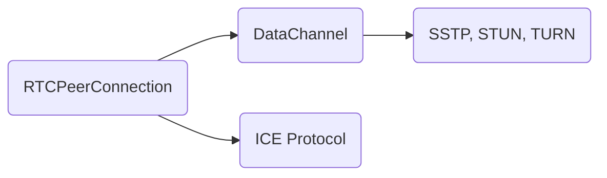
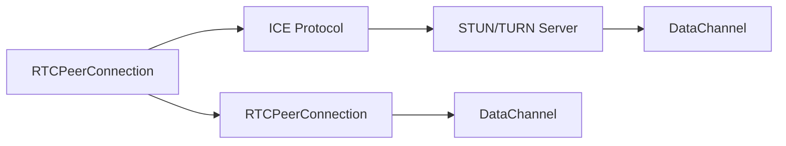

                 

# WebRTC 实时通信协议应用：在浏览器中实现互动功能

在数字化时代，实时通信成为不可或缺的基础设施。无论是企业会议、在线教育，还是社交娱乐，用户都期望能够实现低延迟、高可靠的互动体验。WebRTC（Web Real-Time Communications）是一种开源的实时通信技术标准，允许在浏览器和移动应用中实现点对点的音频和视频通话。本文将详细探讨WebRTC的核心概念、原理及其在浏览器中的应用，帮助开发者理解和实现互动功能。

## 1. 背景介绍

### 1.1 问题由来

在传统的Web应用中，音频和视频通话通常依赖于第三方服务提供商，如Skype、Zoom等。但这些服务存在成本高、控制权受限等问题。而WebRTC则提供了一种无需第三方服务，直接在浏览器中实现P2P音频、视频通话的解决方案，显著降低了部署和运营成本。

### 1.2 问题核心关键点

WebRTC的核心在于通过浏览器内置的音视频编解码和传输协议栈，实现P2P通信。其主要组成部分包括：

- **DataChannel**：用于传输非文本数据，如音视频流。
- **ICE协议**：通过STUN/TURN等技术，找到网络路径，实现P2P连接。
- **RTCPeerConnection**：用于建立、管理和维护P2P连接。
- **WebRTC API**：提供了一组标准化的API，便于开发者使用。

本文将深入探讨WebRTC的核心概念，通过逐步解析其实现原理，帮助读者理解并实现基于WebRTC的实时通信功能。

## 2. 核心概念与联系

### 2.1 核心概念概述

- **RTCPeerConnection**：负责建立、管理P2P连接，进行音频和视频流的编解码和传输。
- **DataChannel**：提供P2P通信的通道，传输非文本数据，如音视频流。
- **ICE协议**：用于寻找网络路径，建立P2P连接。
- **WebRTC API**：提供了标准化的API，方便开发者实现WebRTC功能。

以下是一个简化的WebRTC通信示意图，展示了RTCPeerConnection、DataChannel和ICE协议之间的关系：



- **RTCPeerConnection**：负责连接建立和管理。
- **DataChannel**：负责数据传输。
- **ICE协议**：负责路径发现和连接建立。

### 2.2 核心概念原理和架构的 Mermaid 流程图

以下是一个简化版的WebRTC通信流程图，展示了RTCPeerConnection、DataChannel和ICE协议的交互过程：



该图展示了RTCPeerConnection如何通过ICE协议与STUN/TURN服务器进行交互，从而找到最佳的P2P通信路径，并通过DataChannel进行数据传输。

## 3. 核心算法原理 & 具体操作步骤

### 3.1 算法原理概述

WebRTC的核心算法原理可以概括为以下几个步骤：

1. **建立RTCPeerConnection**：创建一个RTCPeerConnection对象，设置音频和视频编解码器，并开启DataChannel。
2. **收集本地信息**：通过ICE协议与STUN/TURN服务器进行交互，获取本地网络的公共地址。
3. **寻找对端地址**：通过ICE协议与对端进行交互，获取对端网络的公共地址。
4. **建立连接**：将本地地址和对端地址作为配置，建立RTCPeerConnection之间的P2P连接。
5. **传输数据**：通过DataChannel进行音频和视频流的传输。

### 3.2 算法步骤详解

以下是WebRTC通信的核心步骤，及其详细说明：

**Step 1: 建立RTCPeerConnection**

```javascript
let peerConnection = new RTCPeerConnection();
```

创建RTCPeerConnection对象，设置音频和视频编解码器，并开启DataChannel：

```javascript
peerConnection.addTrack(new MediaStreamTrack('audio'), new MediaStream());
peerConnection.addTrack(new MediaStreamTrack('video'), new MediaStream());
peerConnection.createDataChannel('dataChannel');
```

**Step 2: 收集本地信息**

通过ICE协议与STUN/TURN服务器进行交互，获取本地网络的公共地址：

```javascript
let iceCandidate = await peerConnection.gatherCandidates();
let ICE_SRV = new ICE_SRV();
let candidates = ICE_SRV.setUpCandidates(iceCandidate.candidate);
```

**Step 3: 寻找对端地址**

通过ICE协议与对端进行交互，获取对端网络的公共地址：

```javascript
let iceCandidate = await peerConnection.gatherCandidates();
let ICE_SRV = new ICE_SRV();
let candidates = ICE_SRV.setUpCandidates(iceCandidate.candidate);
```

**Step 4: 建立连接**

将本地地址和对端地址作为配置，建立RTCPeerConnection之间的P2P连接：

```javascript
let pcConfig = {
    iceServers: [
        { urls: 'stun:stun.l.google.com:19302' },
        { urls: 'turn:turn:server:19302' },
        { urls: 'turn:turn:server:19302:5349' }
    ]
};
let pc = new RTCPeerConnection(pcConfig);
pc.setRemoteCandidate(candidate.candidate);
```

**Step 5: 传输数据**

通过DataChannel进行音频和视频流的传输：

```javascript
let dataChannel = peerConnection.dataChannel;
dataChannel.onopen = function(e) {
    dataChannel.send('data');
};
```

### 3.3 算法优缺点

WebRTC的优势在于其开源、免费、无需第三方服务的特点，具有较高的灵活性和可控性。但同时，其也有以下缺点：

- **复杂度高**：实现WebRTC需要开发者具备较强的网络编程能力。
- **浏览器兼容性**：某些浏览器（如IE）对WebRTC的支持不完整，需要额外处理。
- **安全风险**：WebRTC依赖于浏览器的安全机制，可能存在安全漏洞。

### 3.4 算法应用领域

WebRTC广泛应用于企业会议、在线教育、社交娱乐等领域。例如，企业可以通过WebRTC实现跨地域的视频会议，在线教育平台可以利用WebRTC进行实时互动教学，社交应用则可以利用WebRTC进行语音、视频通话。

## 4. 数学模型和公式 & 详细讲解 & 举例说明

### 4.1 数学模型构建

WebRTC的数学模型主要涉及以下几个方面：

- **音频编解码**：使用G.711、G.729等标准算法进行音频编码。
- **视频编解码**：使用H.264、VP8等标准算法进行视频编码。
- **传输协议**：使用UDP、TCP等协议进行数据传输。

### 4.2 公式推导过程

以下是音频编解码的基本公式：

$$
\text{Audio Codec} = \text{Encoder}(\text{Audio Input}) + \text{Packetizer}(\text{Audio Codec}) + \text{Channelizer}(\text{Packetizer Output}) + \text{Modulator}(\text{Channelizer Output}) + \text{Transmitter}(\text{Modulator Output})
$$

其中，Encoder表示音频编码器，Packetizer表示数据包化器，Channelizer表示信道化器，Modulator表示调制器，Transmitter表示发射器。

### 4.3 案例分析与讲解

以一个简单的WebRTC通话为例，展示其基本流程：

1. **创建RTCPeerConnection**：

```javascript
let peerConnection = new RTCPeerConnection();
```

2. **设置编解码器**：

```javascript
peerConnection.addTrack(new MediaStreamTrack('audio'), new MediaStream());
peerConnection.addTrack(new MediaStreamTrack('video'), new MediaStream());
peerConnection.createDataChannel('dataChannel');
```

3. **获取本地地址**：

```javascript
let iceCandidate = await peerConnection.gatherCandidates();
let ICE_SRV = new ICE_SRV();
let candidates = ICE_SRV.setUpCandidates(iceCandidate.candidate);
```

4. **建立连接**：

```javascript
let pcConfig = {
    iceServers: [
        { urls: 'stun:stun.l.google.com:19302' },
        { urls: 'turn:turn:server:19302' },
        { urls: 'turn:turn:server:19302:5349' }
    ]
};
let pc = new RTCPeerConnection(pcConfig);
pc.setRemoteCandidate(candidate.candidate);
```

5. **传输数据**：

```javascript
let dataChannel = peerConnection.dataChannel;
dataChannel.onopen = function(e) {
    dataChannel.send('data');
};
```

## 5. 项目实践：代码实例和详细解释说明

### 5.1 开发环境搭建

WebRTC项目开发通常需要以下工具和环境：

- **开发环境**：安装Node.js、npm等开发工具。
- **WebRTC库**：安装WebRTC库（如SimplePeer），简化开发过程。
- **浏览器测试**：使用Chrome浏览器进行测试，检查兼容性。

### 5.2 源代码详细实现

以下是一个简单的WebRTC通话示例代码，展示了其核心实现：

```javascript
let peerConnection = new RTCPeerConnection();
let dataChannel = peerConnection.dataChannel;

dataChannel.onopen = function(e) {
    dataChannel.send('data');
};

let iceCandidate = await peerConnection.gatherCandidates();
let ICE_SRV = new ICE_SRV();
let candidates = ICE_SRV.setUpCandidates(iceCandidate.candidate);

let pcConfig = {
    iceServers: [
        { urls: 'stun:stun.l.google.com:19302' },
        { urls: 'turn:turn:server:19302' },
        { urls: 'turn:turn:server:19302:5349' }
    ]
};
let pc = new RTCPeerConnection(pcConfig);
pc.setRemoteCandidate(candidate.candidate);
```

### 5.3 代码解读与分析

**RTCPeerConnection**：

```javascript
let peerConnection = new RTCPeerConnection();
```

创建一个RTCPeerConnection对象，设置音频和视频编解码器，并开启DataChannel：

```javascript
peerConnection.addTrack(new MediaStreamTrack('audio'), new MediaStream());
peerConnection.addTrack(new MediaStreamTrack('video'), new MediaStream());
peerConnection.createDataChannel('dataChannel');
```

**ICE协议**：

```javascript
let iceCandidate = await peerConnection.gatherCandidates();
let ICE_SRV = new ICE_SRV();
let candidates = ICE_SRV.setUpCandidates(iceCandidate.candidate);
```

通过ICE协议与STUN/TURN服务器进行交互，获取本地网络的公共地址。

**DataChannel**：

```javascript
let dataChannel = peerConnection.dataChannel;
dataChannel.onopen = function(e) {
    dataChannel.send('data');
};
```

通过DataChannel进行音频和视频流的传输。

### 5.4 运行结果展示

WebRTC项目运行后，用户可以通过调用RTCPeerConnection的`addTrack`方法，设置音频和视频编解码器，并通过`createDataChannel`方法创建DataChannel。然后通过`setRemoteCandidate`方法设置远程地址，即可建立P2P连接。通过DataChannel的`send`方法，发送音视频流数据，实现实时通信。

## 6. 实际应用场景

WebRTC在企业会议、在线教育、社交娱乐等领域具有广泛的应用场景。例如，企业可以通过WebRTC实现跨地域的视频会议，在线教育平台可以利用WebRTC进行实时互动教学，社交应用则可以利用WebRTC进行语音、视频通话。

### 6.4 未来应用展望

WebRTC的未来发展前景广阔，将进一步拓展其在企业会议、在线教育、社交娱乐等领域的深入应用。未来的发展方向可能包括：

- **跨平台支持**：提升WebRTC在不同平台（如Web、Android、iOS等）上的兼容性。
- **高质量音视频**：优化音视频编解码器，提升音视频质量，降低延迟。
- **多设备支持**：支持多个设备同时进行音视频通话。
- **安全性保障**：增强WebRTC的安全性，防止数据泄露和攻击。

## 7. 工具和资源推荐

### 7.1 学习资源推荐

- **《WebRTC原理与实践》**：详细介绍了WebRTC的核心原理和实现方法，适合深入学习WebRTC技术。
- **《WebRTC深入浅出》**：通过实例讲解WebRTC的基本用法，适合初学者快速上手。
- **《WebRTC高级开发指南》**：介绍了WebRTC的高级功能和优化技巧，适合进阶学习。

### 7.2 开发工具推荐

- **Node.js**：适用于WebRTC项目的开发，具有强大的模块化和异步编程能力。
- **SimplePeer**：一个轻量级的WebRTC库，简化了WebRTC的实现过程，适合快速开发。
- **Chrome浏览器**：WebRTC项目的测试工具，支持实时音视频通话。

### 7.3 相关论文推荐

- **《WebRTC的实时音视频通信原理与实现》**：详细介绍了WebRTC的实现原理和优化方法，适合深入研究。
- **《WebRTC在企业会议中的应用》**：探讨了WebRTC在企业会议中的实际应用，适合了解实际案例。
- **《WebRTC的未来发展趋势》**：讨论了WebRTC的未来发展方向和应用前景，适合了解未来发展。

## 8. 总结：未来发展趋势与挑战

### 8.1 研究成果总结

本文详细介绍了WebRTC的核心概念和实现原理，通过代码示例展示了基于WebRTC的实时通信功能。通过学习本文，读者可以理解WebRTC的工作原理和应用场景，掌握其实现技巧。

### 8.2 未来发展趋势

WebRTC的未来发展方向包括：

- **跨平台支持**：提升WebRTC在不同平台上的兼容性，支持多个设备和多种场景。
- **高质量音视频**：优化音视频编解码器，提升音视频质量，降低延迟。
- **安全性保障**：增强WebRTC的安全性，防止数据泄露和攻击。

### 8.3 面临的挑战

WebRTC在实现过程中面临以下挑战：

- **复杂度高**：需要开发者具备较强的网络编程能力。
- **浏览器兼容性**：某些浏览器对WebRTC的支持不完整，需要额外处理。
- **安全风险**：依赖浏览器的安全机制，可能存在安全漏洞。

### 8.4 研究展望

未来的研究可能集中在以下几个方向：

- **跨平台支持**：提升WebRTC在不同平台上的兼容性，支持多个设备和多种场景。
- **高质量音视频**：优化音视频编解码器，提升音视频质量，降低延迟。
- **安全性保障**：增强WebRTC的安全性，防止数据泄露和攻击。

## 9. 附录：常见问题与解答

**Q1：WebRTC的原理是什么？**

A: WebRTC的原理是通过浏览器内置的音视频编解码和传输协议栈，实现P2P通信。主要组成部分包括RTCPeerConnection、DataChannel和ICE协议。

**Q2：如何使用WebRTC实现音频和视频通话？**

A: 创建RTCPeerConnection对象，设置音频和视频编解码器，并开启DataChannel。通过ICE协议与STUN/TURN服务器进行交互，获取本地网络和对端网络的公共地址。将本地地址和对端地址作为配置，建立RTCPeerConnection之间的P2P连接。通过DataChannel进行音频和视频流的传输。

**Q3：WebRTC的优缺点是什么？**

A: 优点是开源、免费、无需第三方服务，具有较高的灵活性和可控性。缺点是复杂度高，浏览器兼容性差，存在安全风险。

**Q4：WebRTC的应用场景有哪些？**

A: WebRTC广泛应用于企业会议、在线教育、社交娱乐等领域。例如，企业可以通过WebRTC实现跨地域的视频会议，在线教育平台可以利用WebRTC进行实时互动教学，社交应用则可以利用WebRTC进行语音、视频通话。

---

作者：禅与计算机程序设计艺术 / Zen and the Art of Computer Programming

