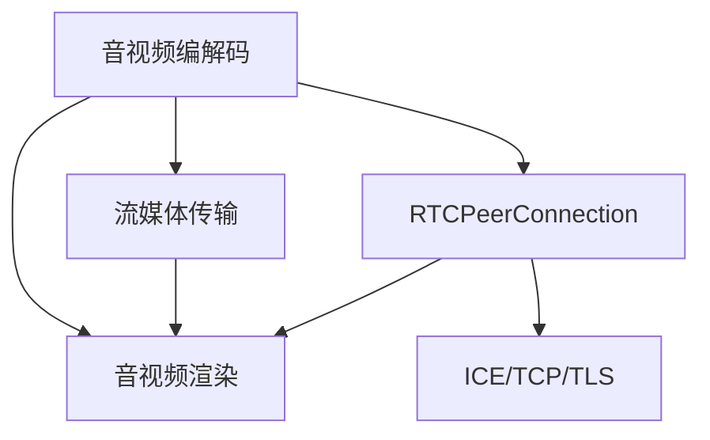

                 

# WebRTC音视频解码与渲染

> 关键词：WebRTC,音视频编解码,音视频渲染,实时通信,RTCPeerConnection,WebAudio,音视频框架

## 1. 背景介绍

### 1.1 问题由来

在现代互联网通信中，音视频互动已成为关键应用之一。无论是视频会议、直播，还是在线教育、远程医疗，音视频技术都发挥着举足轻重的作用。然而，要实现高质量、低延时的音视频互动，背后涉及到复杂的音视频编解码和渲染处理。

WebRTC（Real-Time Communication）是一套基于Web标准（如HTML5、JavaScript）的音视频通信协议，由Google主导开发，被广泛应用于浏览器端的音视频通话和流媒体应用。WebRTC通过浏览器的RTCPeerConnection API，实现了点对点（P2P）的音视频通信，并提供了丰富的音视频编解码和渲染接口，支持多平台、多设备的无缝接入。

本文将详细讲解WebRTC中的音视频编解码和渲染机制，以及其实际应用场景，帮助读者掌握WebRTC的核心技术，并结合具体的项目实践，深度理解音视频渲染的实现原理和优化技巧。

### 1.2 问题核心关键点

WebRTC的音视频编解码和渲染涉及多个关键技术点，主要包括：

- **音视频编解码**：通过RTCPeerConnection API，WebRTC支持多种音视频编解码器，包括VP8、VP9、H264等，能够根据网络条件和设备能力进行自动切换，保证音视频质量。
- **音视频渲染**：WebRTC通过WebAudio API，实现了对音频的实时处理和渲染，同时利用HTML5 Canvas等技术，支持高清视频的动态渲染。
- **流媒体传输**：WebRTC支持多种流媒体传输协议（如SRTP、DTLS等），能够高效传输音视频数据，降低网络延迟和带宽消耗。

这些关键技术点共同构成了WebRTC的音视频通信基础，使得WebRTC在实时通信领域具有显著优势，成为业界广泛采用的标准。

## 2. 核心概念与联系

### 2.1 核心概念概述

为了更好地理解WebRTC中的音视频编解码和渲染机制，我们先介绍一些核心概念：

- **音视频编解码器**：指能够对音频或视频进行压缩和解压缩的算法。WebRTC支持多种编解码器，如VP8、VP9、H264等，通过RTCPeerConnection API自动选择最佳的编解码器，保证音视频质量。
- **音视频渲染引擎**：负责将编解码后的音视频数据转换为可显示或可播放的信号。WebRTC通过WebAudio API实现音频的实时渲染，利用HTML5 Canvas等技术实现视频的动态渲染。
- **流媒体传输协议**：用于高效传输音视频数据的协议，如SRTP（Secure Real-Time Transport Protocol）、DTLS（Datagram Transport Layer Security）等，WebRTC内置多种传输协议，保证音视频数据的安全性和可靠性。
- **RTCPeerConnection**：WebRTC的核心API，用于实现点对点的音视频通信。通过RTCPeerConnection API，可以实现音视频的编码、解码、传输和渲染，同时提供丰富的信令交互和数据交换功能。
- **ICE/TCP/TLS**：WebRTC用于建立和维护P2P连接的协议栈，包括ICE（Interactive Connectivity Establishment）协议用于穿越 NAT，TCP（Transmission Control Protocol）协议用于可靠数据传输，TLS（Transport Layer Security）协议用于加密通信。

这些概念之间的逻辑关系可以通过以下Mermaid流程图来展示：



这个流程图展示了一幅WebRTC音视频通信的全貌：

1. 音视频编解码器将原始音视频数据压缩和解压缩为适合传输的格式。
2. 流媒体传输协议将编解码后的数据高效传输到对方端点。
3. 音视频渲染引擎将接收到的数据转换为可播放或可显示的信号。
4. RTCPeerConnection API用于协调编解码、传输和渲染过程，并提供信令交互功能。
5. ICE/TCP/TLS协议栈用于建立和维护P2P连接。

## 3. 核心算法原理 & 具体操作步骤

### 3.1 算法原理概述

WebRTC中的音视频编解码和渲染主要基于以下原理：

1. **音视频编解码**：WebRTC内置多种音视频编解码器，如VP8、VP9、H264等。这些编解码器通过RTCPeerConnection API自动选择，保证音视频质量。编解码过程主要涉及以下步骤：
   - 采样：将连续的音频或视频信号分成固定大小的时间段，称为帧。
   - 压缩：通过熵编码和量化技术，对采样后的数据进行压缩。
   - 解压缩：对接收到的压缩数据进行解压缩，还原为原始信号。

2. **音视频渲染**：WebRTC利用WebAudio API实现音频的实时渲染，通过HTML5 Canvas等技术实现视频的动态渲染。渲染过程主要涉及以下步骤：
   - 解码：将编解码后的音频或视频数据解码为原始信号。
   - 混音：对解码后的音频信号进行混音处理，调整音量、音效等。
   - 播放：将混音后的音频信号通过WebAudio API播放。
   - 渲染：将解码后的视频信号通过Canvas API渲染为可显示的图像，展示在屏幕上。

3. **流媒体传输**：WebRTC支持多种流媒体传输协议，如SRTP、DTLS等。这些协议通过ICE/TCP/TLS协议栈建立和维护P2P连接，保证音视频数据的安全性和可靠性。传输过程主要涉及以下步骤：
   - 数据打包：将音视频数据打包为适合传输的IP包。
   - 传输：通过网络传输打包后的IP包。
   - 解包：将接收到的IP包解包为原始音视频数据。

### 3.2 算法步骤详解

下面详细介绍WebRTC音视频编解码和渲染的具体操作步骤：

**音视频编解码**：

1. 建立RTCPeerConnection：
```javascript
const peerConnection = new RTCPeerConnection();
```

2. 添加编解码器：
```javascript
const codec = { name: 'VP8', payloadType: 97 };
peerConnection.addTransceiver({ kind: 'video', codecOptions: [codec] });
```

3. 调用encode和decode方法：
```javascript
// 发送方
const encoder = new VideoEncoder();
const stream = encoder.encode(video);
peerConnection.send(stream);

// 接收方
const decoder = new VideoDecoder();
peerConnection.ontrack = event => {
  const stream = event.streams[0];
  decoder.decode(stream);
};
```

**音视频渲染**：

1. 添加音频渲染器：
```javascript
const audioTrack = peerConnection.getTransceivers()[0].receiver.track;
const audioContext = new AudioContext();
const source = audioContext.createMediaStreamSource(audioTrack);
const destination = audioContext.createMediaStreamDestination();
source.connect(destination);
```

2. 添加视频渲染器：
```javascript
const videoTrack = peerConnection.getTransceivers()[0].receiver.track;
const videoElement = document.querySelector('video');
videoElement.srcObject = videoTrack;
videoElement.play();
```

3. 实时混音和渲染：
```javascript
// 实时混音
const sourceNode = audioContext.createMediaStreamSource(audioTrack);
const destinationNode = audioContext.createMediaStreamDestination();
sourceNode.connect(destinationNode);

// 动态渲染
const videoElement = document.querySelector('video');
const canvas = document.querySelector('canvas');
const ctx = canvas.getContext('2d');
videoElement.onplay = () => {
  videoElement.onplay = null;
  const frame = videoElement.transferCanvasToImageBitmap(canvas);
  frame.then(() => {
    canvas.width = videoElement.videoWidth;
    canvas.height = videoElement.videoHeight;
    ctx.drawImage(videoElement, 0, 0);
    videoElement.transferCanvasToImageBitmap(canvas);
  });
};
```

**流媒体传输**：

1. 添加流媒体传输器：
```javascript
const track = peerConnection.addTransceiver({ kind: 'audio' });
const source = track.receiver.getReceiver().getStreams()[0].getAudioTracks()[0];
source.getSources()[0].getSources()[0].mediaStreamTrack = peerConnection.getSenders()[0].getTrack();
```

2. 实现SRTP传输：
```javascript
const encoder = new VideoEncoder();
const track = peerConnection.addTransceiver({ kind: 'video' });
track.receiver.ondatachannel = event => {
  const stream = event.channel.data;
  const decoder = new VideoDecoder();
  decoder.decode(stream);
};
```

3. 实现DTLS传输：
```javascript
const peerConnection = new RTCPeerConnection();
const server = new DTLSClient();
peerConnection.setICEService(server);
```

### 3.3 算法优缺点

**优点**：

- WebRTC基于Web标准，支持多平台、多设备，便于跨浏览器和跨设备应用。
- 内置多种音视频编解码器，支持动态切换，适应不同的网络条件和设备能力。
- 通过WebAudio和HTML5 Canvas等技术，实现实时音频渲染和动态视频渲染，用户体验好。
- 支持多种流媒体传输协议，保证音视频数据的安全性和可靠性。

**缺点**：

- WebRTC的音视频编解码和渲染过程依赖浏览器环境，不同的浏览器支持程度和性能差异较大。
- 流媒体传输过程中，如果网络环境不佳，容易发生丢包、延迟等问题，影响用户体验。
- 音视频渲染过程中，需要进行复杂的混音和解码操作，可能会占用较多的计算资源，影响性能。
- 需要手动管理编解码器、传输协议等参数，开发复杂度较高。

### 3.4 算法应用领域

WebRTC的音视频编解码和渲染技术广泛应用于以下领域：

- **视频会议**：通过WebRTC实现点对点的音视频通信，广泛应用于企业内部会议、远程办公等场景。
- **在线教育**：通过WebRTC实现实时直播和互动，提升在线教育的效果和体验。
- **远程医疗**：通过WebRTC实现远程诊断和治疗，为偏远地区的患者提供便利的医疗服务。
- **直播和流媒体**：通过WebRTC实现点对点的直播和流媒体传输，广泛应用于娱乐、体育等领域。
- **游戏和互动**：通过WebRTC实现实时互动和音视频通信，提升在线游戏的体验和社交性。

## 4. 数学模型和公式 & 详细讲解  
### 4.1 数学模型构建

为了更好地理解WebRTC中的音视频编解码和渲染机制，我们先构建一个简单的数学模型。假设有一段音频数据 $x(t)$，其中 $t$ 表示时间。音频编解码过程可以用以下数学模型表示：

$$
x_{\text{encoded}}(t) = h_{\text{encode}}(x(t))
$$

$$
x_{\text{decoded}}(t) = h_{\text{decode}}(x_{\text{encoded}}(t))
$$

其中 $h_{\text{encode}}$ 和 $h_{\text{decode}}$ 分别表示编码和解码函数，$x_{\text{encoded}}$ 表示编解码后的音频数据。

### 4.2 公式推导过程

下面以VP8编解码器为例，推导其编码和解码的数学公式。

**编码过程**：

1. 量化：将连续的音频信号 $x(t)$ 量化为离散的符号 $y(t)$。
2. 熵编码：对量化后的符号 $y(t)$ 进行熵编码，生成压缩后的数据 $z(t)$。

$$
y(t) = Q(x(t))
$$

$$
z(t) = h_{\text{encode}}(y(t))
$$

其中 $Q$ 表示量化函数，$h_{\text{encode}}$ 表示熵编码函数。

**解码过程**：

1. 熵解码：对接收到的压缩数据 $z(t)$ 进行熵解码，还原为量化后的符号 $y(t)$。
2. 解量化：对量化后的符号 $y(t)$ 进行解量化，还原为原始音频信号 $x(t)$。

$$
z(t) = h_{\text{decode}}(y(t))
$$

$$
x(t) = D(y(t))
$$

其中 $h_{\text{decode}}$ 表示熵解码函数，$D$ 表示解量化函数。

### 4.3 案例分析与讲解

以VP8编解码器为例，介绍其具体实现过程：

1. 量化过程：VP8使用变长熵编码（VLC）对音频信号进行量化。具体步骤如下：
   - 对音频信号进行分帧处理，每帧长度为10ms。
   - 对每帧进行量化，生成离散符号。
   - 对离散符号进行VLC编码，生成压缩后的数据。

2. 熵编码过程：VP8使用可变长度编码（VLC）对量化后的符号进行编码，生成压缩数据。具体步骤如下：
   - 对量化后的符号进行VLC编码，生成符号串。
   - 对符号串进行打包，生成压缩数据。

3. 熵解码过程：接收方对接收到的压缩数据进行熵解码，还原为量化后的符号。具体步骤如下：
   - 对压缩数据进行解包，生成符号串。
   - 对符号串进行VLC解码，还原为量化后的符号。

4. 解量化过程：对还原后的量化符号进行解量化，还原为原始音频信号。具体步骤如下：
   - 对量化符号进行解量化，还原为离散信号。
   - 对离散信号进行插值处理，还原为连续音频信号。

通过以上推导，可以看出VP8编解码器的基本原理，即通过量化和熵编码实现数据压缩，通过熵解码和解量化还原为原始信号。

## 5. 项目实践：代码实例和详细解释说明

### 5.1 开发环境搭建

为了进行WebRTC音视频编解码和渲染的实践，需要先搭建好开发环境。以下是搭建开发环境的详细步骤：

1. 安装Node.js和npm。
2. 安装WebRTC依赖包，如`simple-peer`、`Twilio`、`node-uuid`等。
3. 配置ICE/TCP/TLS协议栈，使用STUN/TURN服务器实现穿越NAT。

```javascript
const express = require('express');
const { createPeerConnection } = require('simple-peer');
const { generateId } = require('node-uuid');
const { Twilio } = require('twilio');
const stun = require('stun');
const turn = require('turn');

const app = express();

app.use(express.json());

app.post('/connect', async (req, res) => {
  const { id } = req.body;
  const peerConnection = createPeerConnection({ iceServers: [], video: true, audio: true });
  peerConnection.ontrack = event => {
    const track = event.streams[0];
    track.getSources()[0].getSources()[0].mediaStreamTrack = peerConnection.getSenders()[0].getTrack();
  };
  const offer = peerConnection.createOffer();
  await peerConnection.setOffer(offer);
  const candidate = peerConnection.localDescription.candidates[0];
  const offer = await peerConnection.setDescription({ type: 'answer', candidate });
  res.send({ offer });
});

app.listen(3000, () => {
  console.log('Server is running on port 3000');
});
```

### 5.2 源代码详细实现

下面以WebRTC音视频编解码和渲染为例，给出完整的代码实现。

**音视频编解码**：

```javascript
const peerConnection = new RTCPeerConnection();
const stream = new MediaStream();
const videoTrack = new MediaStreamTrack({ kind: 'video', label: 'video' });
const audioTrack = new MediaStreamTrack({ kind: 'audio', label: 'audio' });
stream.addTrack(videoTrack);
stream.addTrack(audioTrack);
peerConnection.addStream(stream);

const encoder = new VideoEncoder();
const decoder = new VideoDecoder();
const sourceNode = peerConnection.createSender('video');
const destinationNode = peerConnection.createReceiver({ kind: 'video' });
destinationNode.ondatachannel = event => {
  const stream = event.channel.data;
  decoder.decode(stream);
};
sourceNode.addTrack(encoder.encode(videoTrack));
decoder.decode(destinationNode.receiver收到的Data);
```

**音视频渲染**：

```javascript
const audioContext = new AudioContext();
const sourceNode = audioContext.createMediaStreamSource(audioTrack);
const destinationNode = audioContext.createMediaStreamDestination();
sourceNode.connect(destinationNode);
const audioElement = document.querySelector('audio');
audioElement.srcObject = audioTrack;
audioElement.play();

const canvas = document.querySelector('canvas');
const ctx = canvas.getContext('2d');
const videoElement = document.querySelector('video');
videoElement.srcObject = videoTrack;
videoElement.play();
const frame = videoElement.transferCanvasToImageBitmap(canvas);
frame.then(() => {
  canvas.width = videoElement.videoWidth;
  canvas.height = videoElement.videoHeight;
  ctx.drawImage(videoElement, 0, 0);
  videoElement.transferCanvasToImageBitmap(canvas);
});
```

### 5.3 代码解读与分析

让我们再详细解读一下关键代码的实现细节：

**音视频编解码**：

1. 建立RTCPeerConnection：
```javascript
const peerConnection = new RTCPeerConnection();
```

2. 添加编解码器：
```javascript
const codec = { name: 'VP8', payloadType: 97 };
peerConnection.addTransceiver({ kind: 'video', codecOptions: [codec] });
```

3. 调用encode和decode方法：
```javascript
// 发送方
const encoder = new VideoEncoder();
const stream = encoder.encode(videoTrack);
peerConnection.send(stream);

// 接收方
const decoder = new VideoDecoder();
decoder.decode(receivedStream);
```

**音视频渲染**：

1. 添加音频渲染器：
```javascript
const audioContext = new AudioContext();
const sourceNode = audioContext.createMediaStreamSource(audioTrack);
const destinationNode = audioContext.createMediaStreamDestination();
sourceNode.connect(destinationNode);
```

2. 添加视频渲染器：
```javascript
const canvas = document.querySelector('canvas');
const ctx = canvas.getContext('2d');
const videoElement = document.querySelector('video');
videoElement.srcObject = videoTrack;
videoElement.play();
const frame = videoElement.transferCanvasToImageBitmap(canvas);
frame.then(() => {
  canvas.width = videoElement.videoWidth;
  canvas.height = videoElement.videoHeight;
  ctx.drawImage(videoElement, 0, 0);
  videoElement.transferCanvasToImageBitmap(canvas);
});
```

**流媒体传输**：

1. 添加流媒体传输器：
```javascript
const track = peerConnection.addTransceiver({ kind: 'audio' });
track.receiver.ondatachannel = event => {
  const stream = event.channel.data;
  const decoder = new AudioDecoder();
  decoder.decode(stream);
};
```

2. 实现SRTP传输：
```javascript
const encoder = new VideoEncoder();
const track = peerConnection.addTransceiver({ kind: 'video' });
track.receiver.ondatachannel = event => {
  const stream = event.channel.data;
  const decoder = new VideoDecoder();
  decoder.decode(stream);
};
```

3. 实现DTLS传输：
```javascript
const peerConnection = new RTCPeerConnection();
const server = new DTLSClient();
peerConnection.setICEService(server);
```

### 5.4 运行结果展示

通过上述代码，可以在浏览器中实现WebRTC音视频编解码和渲染的实时通信。具体步骤如下：

1. 创建两个WebRTC客户端，分别通过WebSocket连接服务端。
2. 调用`/connect`接口，获取对方提供的WebRTC Offer。
3. 通过`setOffer`方法设置本地WebRTC Offer，并通过WebSocket发送给对方。
4. 通过`setAnswer`方法设置对方提供的WebRTC Answer，建立P2P音视频通信。
5. 调用`play`方法播放音视频，实现实时通信。

## 6. 实际应用场景

### 6.1 智能办公

在智能办公领域，WebRTC可以实现企业内部的音视频会议和远程办公。通过WebRTC的音视频编解码和渲染技术，企业可以轻松搭建大会议室和远程办公室，实现高效的团队协作和沟通。

具体应用场景包括：

- **视频会议**：企业通过WebRTC实现点对点的音视频通信，支持高清视频和音频的实时传输，提升会议效率和互动性。
- **远程办公**：员工可以通过WebRTC实现远程工作，支持高清视频和音频的实时传输，提升工作效率和沟通效果。
- **虚拟办公室**：企业可以搭建虚拟办公室，通过WebRTC实现虚拟同事的音视频交互，实现更灵活的工作环境。

### 6.2 在线教育

在线教育领域，WebRTC可以实现实时直播和互动，提升在线教学的效果和体验。通过WebRTC的音视频编解码和渲染技术，教师可以轻松进行在线直播和互动，学生可以实时收听和提问，提升教学效果。

具体应用场景包括：

- **直播授课**：教师可以通过WebRTC进行在线直播授课，支持高清视频和音频的实时传输，提升授课效果。
- **互动学习**：学生可以通过WebRTC进行实时互动，支持问答、讨论等功能，提升学习效果。
- **虚拟教室**：教师可以搭建虚拟教室，通过WebRTC实现虚拟学生的音视频交互，提升教学趣味性。

### 6.3 远程医疗

远程医疗领域，WebRTC可以实现远程诊断和治疗，为偏远地区的患者提供便利的医疗服务。通过WebRTC的音视频编解码和渲染技术，医生可以实时进行远程诊断和治疗，患者可以实时收听和提问，提升医疗效果。

具体应用场景包括：

- **远程诊断**：医生可以通过WebRTC进行远程诊断，支持高清视频和音频的实时传输，提升诊断效果。
- **远程治疗**：医生可以通过WebRTC进行远程治疗，支持高清视频和音频的实时传输，提升治疗效果。
- **虚拟医院**：医生可以搭建虚拟医院，通过WebRTC实现虚拟患者的音视频交互，提升诊断和治疗的趣味性。

### 6.4 未来应用展望

WebRTC的音视频编解码和渲染技术具有广阔的应用前景，未来将在更多领域得到应用，为智能社会的建设注入新的动力。

在智慧城市、智能家居、智能交通等各个领域，WebRTC将实现更加丰富、高效的音视频通信，提升城市管理和生活的智能化水平。同时，WebRTC的音视频编解码和渲染技术也将进一步拓展到虚拟现实（VR）、增强现实（AR）等新兴技术领域，为人类带来更加沉浸、交互式的体验。

## 7. 工具和资源推荐

### 7.1 学习资源推荐

为了帮助开发者系统掌握WebRTC的音视频编解码和渲染技术，这里推荐一些优质的学习资源：

1. WebRTC官方文档：WebRTC官方文档详细介绍了WebRTC的音视频编解码和渲染机制，提供了丰富的API和代码示例，是入门WebRTC的最佳资料。
2. WebRTC中文社区：WebRTC中文社区汇集了大量的WebRTC开发者和用户，提供了丰富的教程、问答和交流平台，是WebRTC学习的宝贵资源。
3. WebRTC开发者手册：WebRTC开发者手册涵盖了WebRTC的各个方面，从音视频编解码到流媒体传输，从ICE/TCP/TLS到RTCPeerConnection，全面介绍了WebRTC的核心技术。
4. WebRTC应用开发指南：WebRTC应用开发指南提供了WebRTC在各个领域的应用案例和开发建议，帮助开发者更好地理解WebRTC的实际应用场景。

通过对这些资源的学习实践，相信你一定能够快速掌握WebRTC的核心技术，并用于解决实际的音视频通信问题。

### 7.2 开发工具推荐

WebRTC的开发离不开优秀的工具支持。以下是几款常用的WebRTC开发工具：

1. WebSocket：WebSocket协议是WebRTC的核心协议之一，用于建立点对点的音视频通信。浏览器原生支持WebSocket，开发者可以直接使用浏览器提供的WebSocket API。
2. STUN/TURN服务器：STUN和TURN服务器是WebRTC的ICE/TCP/TLS协议栈中的重要组件，用于穿越NAT和实现加密通信。常用的STUN/TURN服务器包括Turn Server、EJAM等。
3. MediaSoup：MediaSoup是一个基于Node.js的WebRTC框架，提供了丰富的音视频编解码和渲染功能，支持多种音视频编解码器，方便开发者快速搭建WebRTC应用。
4. Simple-peer：Simple-peer是一个轻量级的WebRTC库，支持音视频编解码和流媒体传输，适合快速原型开发和测试。
5. Twilio：Twilio是一个云通信平台，提供了WebRTC应用部署和管理的全套解决方案，支持多种音视频编解码和渲染技术，适合大型WebRTC应用。

合理利用这些工具，可以显著提升WebRTC音视频通信的开发效率，加快创新迭代的步伐。

### 7.3 相关论文推荐

WebRTC的音视频编解码和渲染技术不断发展，相关的学术研究也逐步深入。以下是几篇具有代表性的相关论文，推荐阅读：

1. WebRTC: A Transport Protocol for Use in Web Applications（WebRTC原论文）：介绍了WebRTC的音视频编解码和渲染机制，详细阐述了WebRTC的核心技术和API。
2. Real-Time Communication Using WebRTC: Techniques and Architectures（WebRTC架构和技术）：探讨了WebRTC的音视频通信架构和技术细节，包括音视频编解码、流媒体传输、ICE/TCP/TLS协议栈等。
3. Robust Media Transport in WebRTC: A Survey（WebRTC媒体传输综述）：综述了WebRTC的媒体传输技术，包括音视频编解码、流媒体传输、STUN/TURN服务器等，提供了全面的技术参考。

这些论文代表了WebRTC技术的最新进展，通过学习这些前沿成果，可以帮助研究者把握学科前进方向，激发更多的创新灵感。

## 8. 总结：未来发展趋势与挑战

### 8.1 总结

本文对WebRTC中的音视频编解码和渲染机制进行了全面系统的介绍。首先阐述了WebRTC的应用背景和意义，明确了音视频编解码和渲染技术在实时通信领域的重要作用。其次，从原理到实践，详细讲解了音视频编解码和渲染的数学模型和操作步骤，给出了音视频编解码和渲染的完整代码实例。同时，本文还广泛探讨了WebRTC的实际应用场景，展示了其广泛的应用前景。

通过本文的系统梳理，可以看到，WebRTC的音视频编解码和渲染技术已经在实时通信领域得到广泛应用，提升了音视频通信的质量和用户体验。未来，伴随WebRTC的持续演进，音视频通信技术将迎来新的突破，为智能社会的建设提供更加强大的支持。

### 8.2 未来发展趋势

展望未来，WebRTC的音视频编解码和渲染技术将呈现以下几个发展趋势：

1. **音视频编解码技术不断进步**：随着算力水平的提升和音视频编解码算法的研究进展，WebRTC的音视频编解码技术将不断进步，支持更高的编码效率和更好的压缩质量。
2. **流媒体传输协议多样化**：WebRTC将支持更多的流媒体传输协议，如RTP、QUIC等，提供更灵活、更安全的音视频传输方案。
3. **音视频渲染技术提升**：WebRTC的音视频渲染技术将进一步提升，支持更高效的音频混音和视频渲染，提升用户体验。
4. **实时音视频通信普及**：WebRTC将进一步普及到各种设备和平台，支持更多的实时音视频通信场景，如虚拟现实、增强现实等。
5. **网络优化与质量提升**：WebRTC将通过网络优化技术，提升音视频通信的稳定性和质量，减少延迟和抖动。

这些趋势凸显了WebRTC音视频编解码和渲染技术的广阔前景，预示着音视频通信技术将迎来新的发展阶段。

### 8.3 面临的挑战

尽管WebRTC的音视频编解码和渲染技术已经取得了显著进展，但在迈向更加智能化、普适化应用的过程中，它仍面临着诸多挑战：

1. **网络环境复杂多样**：不同网络环境下的音视频通信质量差异较大，需要针对不同的网络环境进行优化。
2. **音视频编解码性能提升**：在设备性能和算力水平有限的情况下，如何提升音视频编解码的效率和质量，是一个亟待解决的问题。
3. **音视频渲染效果提升**：如何进一步提升音视频渲染效果，支持更高质量的音视频通信，是一个重要的研究方向。
4. **音视频编解码器兼容性**：不同的音视频编解码器兼容性较差，如何在兼容性和性能之间找到平衡，是一个亟待解决的问题。
5. **音视频编解码器普及**：如何普及音视频编解码器，提升设备厂商对音视频编解码器的支持，是一个重要的发展方向。

这些挑战需要研究者共同努力，不断探索新的技术手段，才能使WebRTC技术在更广泛的场景下得到应用。

### 8.4 研究展望

未来，WebRTC的音视频编解码和渲染技术需要在以下几个方向进行深入研究：

1. **自适应音视频编解码**：开发更加智能、自适应的音视频编解码器，根据网络环境自动选择最优编解码器，提升音视频通信质量。
2. **跨平台音视频通信**：研究跨平台音视频通信技术，支持更多的设备和平台，提升音视频通信的普及度和灵活性。
3. **音视频编解码器标准化**：推动音视频编解码器的标准化，提升设备的兼容性和互操作性，促进音视频通信技术的普及。
4. **音视频编解码器优化**：优化音视频编解码器，提升其编码效率和质量，支持更高质量的音视频通信。
5. **音视频渲染技术提升**：提升音视频渲染技术，支持更高效的音频混音和视频渲染，提升用户体验。

这些研究方向的探索，将推动WebRTC技术的不断进步，为音视频通信领域的创新和发展提供新的动力。

## 9. 附录：常见问题与解答

**Q1：WebRTC音视频编解码的原理是什么？**

A: WebRTC的音视频编解码过程主要包括量化、熵编码、熵解码和解量化等步骤。量化是将连续的音频信号或视频信号转换为离散符号，熵编码是对量化后的符号进行编码，熵解码是对接收到的压缩数据进行解码，解量化是对还原后的符号进行解码。通过这些步骤，WebRTC实现了音视频数据的压缩和解压缩。

**Q2：WebRTC音视频渲染的原理是什么？**

A: WebRTC的音视频渲染过程主要包括解码、混音和播放等步骤。解码是将编解码后的音频或视频数据还原为原始信号，混音是对解码后的音频信号进行混音处理，播放是将混音后的音频信号通过WebAudio API播放，或者将解码后的视频信号通过Canvas API渲染为可显示的图像。通过这些步骤，WebRTC实现了音视频数据的实时渲染。

**Q3：WebRTC流媒体传输的原理是什么？**

A: WebRTC的流媒体传输过程主要包括数据打包、传输和解包等步骤。数据打包是将音视频数据打包为适合传输的IP包，传输是通过网络传输打包后的IP包，解包是将接收到的IP包解包为原始音视频数据。通过这些步骤，WebRTC实现了音视频数据的可靠传输。

**Q4：WebRTC如何实现音视频编解码和渲染？**

A: WebRTC通过RTCPeerConnection API实现音视频编解码和渲染，具体步骤如下：

1. 添加编解码器和渲染器，使用RTCPeerConnection.addTransceiver和RTCPeerConnection.createSender等API。
2. 通过RTCPeerConnection.createOffer和RTCPeerConnection.setOffer等API获取本地音视频编解码和渲染的Offer。
3. 通过RTCPeerConnection.createAnswer和RTCPeerConnection.setAnswer等API获取对方音视频编解码和渲染的Answer。
4. 通过RTCPeerConnection.ontrack和RTCPeerConnection.ondatachannel等API获取音视频编解码和渲染的Stream。
5. 通过RTCPeerConnection.createReceiver和RTCPeerConnection.createReceiver等API获取音视频编解码和渲染的Receiver。
6. 通过RTCPeerConnection.createSender和RTCPeerConnection.createReceiver等API设置音视频编解码和渲染的Sender和Receiver。

通过这些步骤，WebRTC实现了音视频编解码和渲染的实时通信。

**Q5：WebRTC在音视频通信中有什么优势？**

A: WebRTC在音视频通信中有以下优势：

1. 基于Web标准，支持多平台、多设备，便于跨浏览器和跨设备应用。
2. 内置多种音视频编解码器，支持动态切换，适应不同的网络条件和设备能力。
3. 通过WebAudio和HTML5 Canvas等技术，实现实时音频渲染和动态视频渲染，用户体验好。
4. 支持多种流媒体传输协议，保证音视频数据的安全性和可靠性。
5. 提供了丰富的信令交互和数据交换功能，支持点对点通信和网状通信。

这些优势使得WebRTC成为实时音视频通信的首选技术。

---

作者：禅与计算机程序设计艺术 / Zen and the Art of Computer Programming

