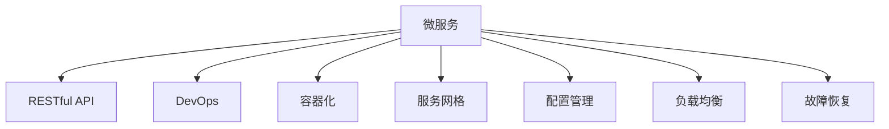

                 

# Web架构设计：从单体到微服务

> 关键词：微服务架构,Web应用,软件架构,云计算,分布式系统,DevOps,敏捷开发,自动化

## 1. 背景介绍

### 1.1 问题由来
随着互联网业务的迅猛发展，Web应用的规模和复杂度日益增加，单一的单体架构（Monolithic Architecture）已经难以满足不断变化的需求。传统的单体架构将应用的所有组件都部署在单个进程中，其高度耦合和难以扩展的特性导致了系统维护和升级的困难。微服务架构（Microservices Architecture）的提出，有效地解决了这些挑战，成为当下Web架构设计的主流范式。

### 1.2 问题核心关键点
微服务架构的核心思想是将应用拆分成一系列小型、自治的服务，每个服务独立运行，并通过轻量级的通信机制（如HTTP RESTful API）进行交互。每个服务围绕业务功能进行设计，具有独立的生命周期，可以独立部署、扩展和运维。

微服务架构的提出，是为了应对以下关键问题：
- **可扩展性**：单体架构难以水平扩展，微服务架构可以通过水平扩展单个服务来实现应用的横向扩展。
- **弹性**：单体架构难以动态调整服务资源，微服务架构可以独立管理服务资源，实现弹性伸缩。
- **故障隔离**：单体架构中一个组件的故障可能导致整个系统瘫痪，微服务架构可以隔离服务之间的故障，保证系统整体的稳定性。
- **技术多样性**：不同服务的开发可以采用不同的技术栈，提升开发效率和系统灵活性。
- **持续交付**：通过DevOps实践，微服务架构可以实现快速、频繁的发布和回滚，提升交付速度和质量。

### 1.3 问题研究意义
微服务架构的提出，显著提升了Web应用的开发、维护和扩展能力，推动了云计算和大数据技术的应用，促进了DevOps文化和自动化工具的发展。通过系统性地分解应用，微服务架构能够更好地适应复杂多变的业务需求，满足高并发、高可用、高可靠的系统要求。

## 2. 核心概念与联系

### 2.1 核心概念概述

为更好地理解微服务架构的设计思路，本节将介绍几个密切相关的核心概念：

- **微服务（Microservices）**：将应用拆分为独立、自治的小型服务，每个服务围绕特定业务功能进行设计。
- **RESTful API**：微服务之间通过HTTP RESTful API进行通信，以资源为中心，遵循统一的接口规范。
- **DevOps**：结合软件开发和运维的实践，提升软件交付和运维的效率和质量，实现快速迭代和持续交付。
- **容器化（Containerization）**：将应用和依赖打包在容器（如Docker）中，实现应用的无状态化和平台无关性，方便部署和运维。
- **服务网格（Service Mesh）**：在微服务架构中，引入服务网格（如Istio），实现服务发现、流量控制、监控统计等功能，提升微服务系统的可管理和可维护性。
- **配置管理**：通过自动化配置管理工具（如Consul、Eureka），动态管理微服务的配置信息，保证配置的准确性和一致性。
- **负载均衡**：在微服务架构中，引入负载均衡机制，合理分配服务请求，提升系统的并发处理能力。
- **故障恢复**：通过容错机制和服务降级，保障微服务系统在故障发生时的稳定性和可用性。

这些核心概念之间的逻辑关系可以通过以下Mermaid流程图来展示：



这个流程图展示了一个典型的微服务架构中的核心组件及其关联关系。

## 3. 核心算法原理 & 具体操作步骤
### 3.1 算法原理概述

微服务架构的设计原则和设计模式是微服务架构的核心内容，其核心思想是将应用拆分为独立、自治的服务，每个服务围绕特定业务功能进行设计，并通过轻量级的通信机制进行交互。微服务架构的设计原则主要包括：

- **独立部署**：每个微服务可以独立部署、更新和扩展。
- **自治团队**：每个微服务由独立的团队负责，团队专注于业务领域，而不是系统架构。
- **通信机制**：微服务之间通过RESTful API进行通信，遵循统一的接口规范。
- **自治数据管理**：每个微服务独立管理自己的数据存储，避免数据耦合。
- **服务治理**：通过服务发现、负载均衡、故障恢复等机制，实现微服务系统的稳定性和可用性。

### 3.2 算法步骤详解

微服务架构的构建通常包括以下几个关键步骤：

**Step 1: 需求分析与领域划分**
- 对业务需求进行详细分析，识别出核心业务功能和辅助功能。
- 根据业务功能和数据关系，将应用划分为多个独立的微服务。

**Step 2: 服务设计**
- 设计每个微服务的接口规范，定义API端点和调用方式。
- 确定服务之间的依赖关系，避免环路依赖。
- 引入服务网格，设计服务发现、负载均衡、故障恢复等机制。

**Step 3: 服务开发**
- 采用敏捷开发和DevOps实践，快速迭代开发服务。
- 选择合适的编程语言和框架，提升开发效率。
- 实现服务的单元测试、集成测试和性能测试。

**Step 4: 服务部署**
- 使用容器化技术（如Docker）封装服务，实现平台无关性。
- 通过自动化部署工具（如Kubernetes）管理服务的生命周期。
- 配置监控、日志和告警系统，实时监控服务状态。

**Step 5: 服务治理**
- 引入服务网格，实现服务发现、负载均衡、流量控制等功能。
- 使用配置管理工具（如Consul、Eureka）动态管理服务配置。
- 通过自动化部署和DevOps实践，实现快速迭代和持续交付。

### 3.3 算法优缺点

微服务架构的设计原则和实施步骤带来了以下优点：
1. **独立部署与扩展**：每个微服务独立部署，可以灵活扩展和更新，提升系统的灵活性和可维护性。
2. **自治团队与专业化**：每个微服务由独立的团队负责，专注于业务功能，提升开发效率和系统质量。
3. **通信机制统一**：微服务之间通过统一的RESTful API进行通信，简化系统设计和实现。
4. **服务治理完善**：通过服务网格和服务治理机制，提升系统的稳定性和可用性。

同时，微服务架构也存在一些局限性：
1. **管理复杂度增加**：微服务架构增加了系统的复杂度，需要更多人力和工具来管理。
2. **通信开销增加**：微服务之间的通信开销可能比单体架构更高，影响系统性能。
3. **数据一致性挑战**：微服务架构需要考虑跨服务的数据一致性，处理复杂。
4. **故障隔离与恢复**：微服务架构需要有效的故障恢复和隔离机制，以应对服务间依赖关系导致的连锁故障。

尽管存在这些局限性，但微服务架构的优点仍然明显，成为了当前Web架构设计的主流范式。

### 3.4 算法应用领域

微服务架构已经被广泛应用于各种Web应用场景，例如：

- **电商平台**：将商品管理、订单处理、用户管理等核心功能拆分为独立的微服务，提升系统的扩展性和稳定性。
- **金融系统**：通过微服务架构实现业务逻辑的独立部署和扩展，提高系统的灵活性和安全性。
- **医疗系统**：通过微服务架构实现不同功能模块的独立管理和扩展，提升系统的可靠性和可用性。
- **社交媒体**：将用户管理、内容发布、数据存储等模块独立拆分为微服务，提升系统的可扩展性和维护性。
- **智能家居**：通过微服务架构实现智能设备间的互联互通和协同工作，提升系统的智能性和用户体验。

除了以上行业，微服务架构在更多领域也得到了广泛应用，如智能制造、智慧城市、智慧物流等，为各行各业数字化转型提供了新的技术支持。

## 4. 数学模型和公式 & 详细讲解  
### 4.1 数学模型构建

本节将使用数学语言对微服务架构的设计原则和实施步骤进行更加严格的刻画。

假设应用被划分为 $N$ 个微服务 $S_1, S_2, ..., S_N$，每个服务的服务端口为 $p_1, p_2, ..., p_N$。定义微服务 $S_i$ 在服务端口 $p_i$ 上的请求和响应模型为 $R_i$。

服务间通信遵循统一的RESTful API规范，定义请求和响应的格式和接口。服务间通信的模型可以表示为：

$$
R_{ij} = \{R^i_{ij}, R^j_{ij}\}
$$

其中 $R^i_{ij}$ 表示微服务 $S_i$ 向 $S_j$ 发送的请求，$R^j_{ij}$ 表示 $S_j$ 返回的响应。

微服务架构的设计原则包括：
- **独立部署**：每个微服务可以独立部署、更新和扩展。
- **自治团队**：每个微服务由独立的团队负责，团队专注于业务领域，而不是系统架构。
- **通信机制统一**：微服务之间通过统一的RESTful API进行通信，遵循统一的接口规范。
- **自治数据管理**：每个微服务独立管理自己的数据存储，避免数据耦合。
- **服务治理**：通过服务发现、负载均衡、故障恢复等机制，实现微服务系统的稳定性和可用性。

这些设计原则可以通过以下数学公式来描述：

- **独立部署**：每个微服务 $S_i$ 的部署独立，表示为：
$$
D_i = D_j \quad \text{for} \quad i \neq j
$$

- **自治团队**：每个微服务 $S_i$ 由独立的团队 $T_i$ 负责，表示为：
$$
T_i \cap T_j = \emptyset \quad \text{for} \quad i \neq j
$$

- **通信机制统一**：微服务之间通过统一的RESTful API进行通信，表示为：
$$
R_{ij} = R_{ji} \quad \text{for} \quad i \neq j
$$

- **自治数据管理**：每个微服务 $S_i$ 独立管理自己的数据存储 $D_i$，表示为：
$$
D_i \cap D_j = \emptyset \quad \text{for} \quad i \neq j
$$

- **服务治理**：通过服务发现、负载均衡、故障恢复等机制，实现微服务系统的稳定性和可用性，表示为：
$$
G_i = G_j \quad \text{for} \quad i \neq j
$$

其中 $G_i$ 表示服务治理的机制。

### 4.2 公式推导过程

以下我们以一个简单的电商平台为例，推导微服务架构的设计模型。

假设电商平台包括以下微服务：
- **商品管理服务** $S_1$：负责商品信息的管理和展示。
- **订单处理服务** $S_2$：负责订单的生成、支付和物流管理。
- **用户管理服务** $S_3$：负责用户信息的管理和认证。

每个微服务通过RESTful API进行通信，定义统一的接口规范。

服务间通信的模型可以表示为：
- $S_1$ 向 $S_2$ 发送请求，$S_2$ 返回响应。
- $S_2$ 向 $S_3$ 发送请求，$S_3$ 返回响应。

具体地，$S_1$ 向 $S_2$ 发送请求的模型为：
$$
R^1_{12} = \{R^1_{1,2}, R^2_{1,2}\}
$$

其中 $R^1_{1,2}$ 表示 $S_1$ 向 $S_2$ 发送的请求，$R^2_{1,2}$ 表示 $S_2$ 返回的响应。

类似地，$S_2$ 向 $S_3$ 发送请求的模型为：
$$
R^2_{23} = \{R^2_{2,3}, R^3_{2,3}\}
$$

其中 $R^2_{2,3}$ 表示 $S_2$ 向 $S_3$ 发送的请求，$R^3_{2,3}$ 表示 $S_3$ 返回的响应。

通过以上模型，可以清晰地描述微服务架构的设计原则和实施步骤，为实际构建微服务架构提供理论基础。

## 5. 项目实践：代码实例和详细解释说明
### 5.1 开发环境搭建

在进行微服务架构实践前，我们需要准备好开发环境。以下是使用Spring Boot和Spring Cloud进行微服务开发的 environment配置流程：

1. 安装Java Development Kit（JDK）：从官网下载并安装JDK 11以上版本，确保Spring Boot和Spring Cloud的正常运行。

2. 安装Maven：从官网下载并安装Maven 3.5以上版本，作为项目构建工具。

3. 安装Spring Boot和Spring Cloud：使用Maven依赖管理，添加Spring Boot和Spring Cloud的依赖。

4. 配置Docker环境：安装Docker CE，并配置Docker Compose，用于容器编排和部署。

5. 配置Kubernetes环境：安装Minikube，配置Kubernetes集群，用于自动化部署和扩展。

完成上述步骤后，即可在本地环境中开始微服务架构的实践。

### 5.2 源代码详细实现

这里我们以一个简单的电商微服务架构为例，展示微服务架构的实现。

假设电商平台包括以下微服务：
- **商品管理服务**：负责商品信息的管理和展示。
- **订单处理服务**：负责订单的生成、支付和物流管理。
- **用户管理服务**：负责用户信息的管理和认证。

**商品管理服务**：

```java
@RestController
@RequestMapping("/products")
public class ProductController {

    @Autowired
    private ProductService productService;

    @GetMapping("/{id}")
    public Product getProductById(@PathVariable Long id) {
        return productService.findById(id);
    }

    @PostMapping
    public Product saveProduct(@RequestBody Product product) {
        return productService.save(product);
    }

    @DeleteMapping("/{id}")
    public void deleteProduct(@PathVariable Long id) {
        productService.deleteById(id);
    }
}
```

**订单处理服务**：

```java
@RestController
@RequestMapping("/orders")
public class OrderController {

    @Autowired
    private OrderService orderService;

    @PostMapping
    public Order saveOrder(@RequestBody Order order) {
        return orderService.save(order);
    }

    @GetMapping("/{id}")
    public Order getOrderById(@PathVariable Long id) {
        return orderService.findById(id);
    }

    @DeleteMapping("/{id}")
    public void deleteOrder(@PathVariable Long id) {
        orderService.deleteById(id);
    }
}
```

**用户管理服务**：

```java
@RestController
@RequestMapping("/users")
public class UserController {

    @Autowired
    private UserService userService;

    @PostMapping("/login")
    public User login(@RequestBody LoginRequest loginRequest) {
        return userService.login(loginRequest);
    }

    @PostMapping
    public User register(@RequestBody User user) {
        return userService.register(user);
    }

    @DeleteMapping("/{id}")
    public void deleteUser(@PathVariable Long id) {
        userService.deleteById(id);
    }
}
```

通过以上代码，可以看到微服务架构的实现相对简单，只需要将应用拆分为独立的微服务，并通过RESTful API进行通信即可。

### 5.3 代码解读与分析

让我们再详细解读一下关键代码的实现细节：

**Controller类**：
- `@RestController`：标记为RESTful API的控制器。
- `@RequestMapping`：定义API的路径。
- `@GetMapping`、`@PostMapping`、`@DeleteMapping`：定义API的请求方法和路径。
- `@Autowired`：自动装配依赖。

**Service类**：
- `@Service`：标记为Spring IOC容器中的Bean。
- `@Autowired`：自动装配依赖。
- `public`：定义公共的接口方法。

**数据访问层**：
- **商品管理服务**：通过`@Autowired`注入`ProductRepository`，进行商品信息的读写操作。
- **订单处理服务**：通过`@Autowired`注入`OrderRepository`，进行订单信息的读写操作。
- **用户管理服务**：通过`@Autowired`注入`UserRepository`，进行用户信息的读写操作。

**数据模型**：
- **商品管理服务**：定义`Product`实体类，包含商品ID、名称、描述等属性。
- **订单处理服务**：定义`Order`实体类，包含订单ID、用户ID、商品ID等属性。
- **用户管理服务**：定义`User`实体类，包含用户ID、用户名、密码等属性。

**API接口**：
- **商品管理服务**：定义了获取、添加、删除商品信息的API接口。
- **订单处理服务**：定义了生成、支付、物流管理的API接口。
- **用户管理服务**：定义了用户认证、注册、删除的API接口。

通过以上代码，可以看出微服务架构的实现相对简单，只需要将应用拆分为独立的微服务，并通过RESTful API进行通信即可。

当然，工业级的系统实现还需考虑更多因素，如服务监控、负载均衡、故障恢复等，但核心的微服务架构范式基本与此类似。

## 6. 实际应用场景
### 6.1 智能客服系统

基于微服务架构的智能客服系统，可以更好地处理海量客户咨询，提升客户服务质量。

智能客服系统包括：
- **语音识别服务**：将语音转换为文本，供后续处理。
- **文本处理服务**：对文本进行意图识别、实体识别等处理，提取关键信息。
- **对话生成服务**：根据用户意图和历史对话记录，生成自然流畅的回复。

每个服务独立部署、更新和扩展，通过RESTful API进行通信，实现了高效的客户服务。

### 6.2 电商平台

电商平台通过微服务架构，实现了商品管理、订单处理、用户管理等核心功能的独立部署和扩展。

电商平台的微服务架构包括：
- **商品管理服务**：负责商品信息的管理和展示。
- **订单处理服务**：负责订单的生成、支付和物流管理。
- **用户管理服务**：负责用户信息的管理和认证。
- **支付服务**：负责支付信息的处理和校验。
- **物流服务**：负责物流信息的记录和更新。

每个服务独立部署、更新和扩展，通过RESTful API进行通信，实现了高效、灵活的电商运营。

### 6.3 金融系统

金融系统通过微服务架构，实现了核心业务功能的独立部署和扩展。

金融系统的微服务架构包括：
- **账户管理服务**：负责用户账户信息的记录和管理。
- **交易处理服务**：负责交易的生成、审核和结算。
- **风险管理服务**：负责风险评估和控制。
- **审计服务**：负责系统审计和日志管理。
- **用户认证服务**：负责用户身份的认证和授权。

每个服务独立部署、更新和扩展，通过RESTful API进行通信，实现了高可用、高可扩展的金融服务。

### 6.4 未来应用展望

随着微服务架构的不断演进，未来在更多领域将得到应用，为各行各业带来变革性影响。

在智慧医疗领域，微服务架构可以实现医疗信息的高效管理和共享，提升医疗服务的智能化水平，辅助医生诊疗，加速新药开发进程。

在智能教育领域，微服务架构可以实现个性化推荐、智能评估、知识图谱等功能的独立部署和扩展，提升教育公平，提高教学质量。

在智慧城市治理中，微服务架构可以实现城市事件监测、舆情分析、应急指挥等环节的独立管理和扩展，提高城市管理的自动化和智能化水平，构建更安全、高效的未来城市。

此外，在企业生产、社会治理、文娱传媒等众多领域，微服务架构也将在数字化的进程中发挥重要作用。相信随着技术的不断发展，微服务架构必将在更广阔的应用领域大放异彩，为各行各业提供强大的技术支持。

## 7. 工具和资源推荐
### 7.1 学习资源推荐

为了帮助开发者系统掌握微服务架构的理论基础和实践技巧，这里推荐一些优质的学习资源：

1. **《Spring Cloud 微服务教程》**：通过实例演示，详细讲解了微服务架构的设计和实践。
2. **《微服务设计》**：讲述了微服务架构的设计原则、实施步骤和常见问题，适合有一定开发基础的读者。
3. **《微服务架构实战》**：通过多个实战项目，系统介绍了微服务架构的构建和部署。
4. **《Spring Boot 实战》**：介绍了Spring Boot框架的使用，适合初学者。
5. **《Spring Cloud 实战》**：介绍了Spring Cloud的各个组件和功能，适合有一定开发基础的读者。

通过对这些资源的学习实践，相信你一定能够快速掌握微服务架构的精髓，并用于解决实际的系统问题。

### 7.2 开发工具推荐

高效的开发离不开优秀的工具支持。以下是几款用于微服务架构开发的常用工具：

1. **Spring Boot**：基于Spring框架的开源框架，支持快速构建微服务应用。
2. **Spring Cloud**：基于Spring Boot的开源框架，支持微服务架构的各个组件，如服务发现、负载均衡、配置管理等。
3. **Docker**：轻量级容器引擎，支持应用的无状态化和平台无关性，方便部署和运维。
4. **Kubernetes**：开源容器编排平台，支持微服务应用的自动化部署和扩展。
5. **Prometheus**：监控系统，支持实时监控微服务应用的性能和健康状态。
6. **Grafana**：监控仪表盘，支持数据可视化，方便监控微服务应用。
7. **Jaeger**：分布式追踪系统，支持微服务应用的调用链追踪和性能分析。

合理利用这些工具，可以显著提升微服务架构的开发效率，加快创新迭代的步伐。

### 7.3 相关论文推荐

微服务架构的发展源于学界的持续研究。以下是几篇奠基性的相关论文，推荐阅读：

1. **《Decoupling Service Architecture》**：提出了微服务架构的设计原则和实施步骤，奠定了微服务架构的理论基础。
2. **《Building Microservices》**：详细介绍了微服务架构的设计模式、开发实践和挑战，适合有一定开发基础的读者。
3. **《Spring Cloud: Microservices Architecture Made Easy》**：介绍了Spring Cloud的各个组件和功能，适合有一定开发基础的读者。
4. **《The Twelve-Factor App: Cloud Native Application Architecture》**：介绍了12个微服务架构的构建原则，适合有一定开发基础的读者。

这些论文代表了大规模微服务架构的研究方向，通过学习这些前沿成果，可以帮助研究者把握学科前进方向，激发更多的创新灵感。

## 8. 总结：未来发展趋势与挑战
### 8.1 总结

本文对微服务架构的设计原则和实施步骤进行了全面系统的介绍。首先阐述了微服务架构的背景和核心关键点，明确了微服务架构对Web应用开发的深刻影响。其次，从原理到实践，详细讲解了微服务架构的数学模型和实现步骤，给出了微服务架构的完整代码实例。同时，本文还探讨了微服务架构在智能客服、电商平台、金融系统等实际应用场景中的应用，展示了微服务架构的巨大潜力。此外，本文还推荐了相关的学习资源和开发工具，力求为开发者提供全方位的技术指引。

通过本文的系统梳理，可以看到，微服务架构的设计原则和实现步骤，已经成为了Web架构设计的主流范式，显著提升了Web应用的开发、维护和扩展能力，推动了云计算和大数据技术的应用，促进了DevOps文化和自动化工具的发展。

### 8.2 未来发展趋势

展望未来，微服务架构将呈现以下几个发展趋势：

1. **自动化工具和平台**：微服务架构的自动化工具和平台将更加丰富和完善，如服务网格、配置管理、DevOps工具等，提升开发和运维效率。
2. **智能运维**：通过机器学习和大数据分析，提升微服务应用的性能监控和故障恢复能力，实现智能运维。
3. **跨云迁移**：微服务架构的跨云迁移和平台互操作性将更加便捷，支持多云环境下的应用部署和扩展。
4. **边缘计算**：微服务架构将与边缘计算技术相结合，实现本地化计算和数据处理，提升应用响应速度和用户体验。
5. **微服务编排**：通过编排工具（如Kubernetes），实现微服务应用的灵活部署和扩展，提升系统的可管理性。
6. **服务治理增强**：通过服务治理工具（如Istio），提升微服务应用的稳定性和可靠性，保障系统的高可用性和高一致性。
7. **API治理和标准化**：通过API治理工具（如Swagger），实现API的规范化和标准化，提升服务间通信的可靠性和安全性。

以上趋势凸显了微服务架构的广阔前景。这些方向的探索发展，必将进一步提升微服务应用的开发效率和系统性能，为数字化转型提供坚实的技术支持。

### 8.3 面临的挑战

尽管微服务架构已经取得了显著成就，但在迈向更加智能化、普适化应用的过程中，它仍面临着诸多挑战：

1. **管理复杂度**：微服务架构增加了系统的复杂度，需要更多人力和工具来管理。如何降低管理复杂度，提升系统稳定性，仍然是一大难题。
2. **通信开销**：微服务之间的通信开销可能比单体架构更高，影响系统性能。如何优化通信机制，提升系统性能，仍需深入研究。
3. **数据一致性**：微服务架构需要考虑跨服务的数据一致性，处理复杂。如何实现数据一致性，保证系统可靠性，仍然是一个难题。
4. **故障恢复**：微服务架构需要有效的故障恢复和隔离机制，以应对服务间依赖关系导致的连锁故障。如何实现故障恢复，保障系统稳定性，仍需深入研究。
5. **监控和日志**：微服务架构需要实时监控和日志记录，实现系统调度和故障排查。如何实现高效的监控和日志管理，提升系统运维能力，仍需深入研究。

尽管存在这些挑战，但微服务架构的优点仍然明显，成为了当前Web架构设计的主流范式。

### 8.4 研究展望

面对微服务架构所面临的挑战，未来的研究需要在以下几个方面寻求新的突破：

1. **微服务编排优化**：通过编排工具（如Kubernetes），实现微服务应用的灵活部署和扩展，提升系统的可管理性。
2. **服务网格优化**：通过服务网格（如Istio），实现服务发现、负载均衡、流量控制等功能，提升微服务系统的可管理和可维护性。
3. **智能运维提升**：通过机器学习和大数据分析，提升微服务应用的性能监控和故障恢复能力，实现智能运维。
4. **跨云迁移优化**：实现微服务应用的跨云迁移和平台互操作性，支持多云环境下的应用部署和扩展。
5. **API治理和标准化**：通过API治理工具（如Swagger），实现API的规范化和标准化，提升服务间通信的可靠性和安全性。

这些研究方向的探索，必将引领微服务架构技术迈向更高的台阶，为构建高可用、高可扩展的智能系统铺平道路。面向未来，微服务架构还需要与其他人工智能技术进行更深入的融合，如知识表示、因果推理、强化学习等，多路径协同发力，共同推动智能系统的进步。只有勇于创新、敢于突破，才能不断拓展微服务架构的边界，让智能技术更好地造福人类社会。

## 9. 附录：常见问题与解答

**Q1：微服务架构是否适用于所有Web应用？**

A: 微服务架构适用于大多数Web应用，特别是数据量大、业务复杂、需求变化频繁的Web应用。但对于一些实时性要求极高的应用，如高并发交易系统，单体架构可能更适合。

**Q2：如何选择合适的微服务拆分粒度？**

A: 微服务拆分粒度需要根据具体业务需求和团队规模来确定。一般建议按照业务领域、数据关系、服务调用关系等维度进行拆分，避免拆分过细或过粗。

**Q3：微服务架构是否需要引入数据库事务？**

A: 微服务架构一般需要引入数据库事务，保证跨服务的数据一致性。不同服务的数据库可以通过分布式事务（如TCC、SAGA）进行协调，保证整体事务的可靠性。

**Q4：微服务架构是否需要引入API网关？**

A: 微服务架构可以通过API网关实现服务间的统一调用和管理，提升系统的可管理和可维护性。API网关可以代理服务请求，统一处理跨服务请求，实现负载均衡和缓存功能。

**Q5：微服务架构如何实现服务间的异步通信？**

A: 微服务架构可以通过消息队列（如RabbitMQ、Kafka）实现服务间的异步通信，提升系统的并发处理能力。消息队列可以缓冲请求，异步处理服务间的通信，提高系统的吞吐量和响应速度。

通过本文的系统梳理，可以看到，微服务架构的设计原则和实现步骤，已经成为了Web架构设计的主流范式，显著提升了Web应用的开发、维护和扩展能力，推动了云计算和大数据技术的应用，促进了DevOps文化和自动化工具的发展。

希望本文能为你提供全面的技术指引，助力你在微服务架构的开发和实践中取得成功。

