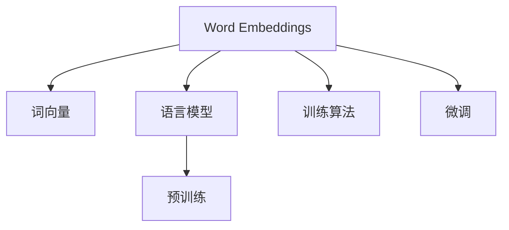

                 

# Word Embeddings原理与代码实例讲解

> 关键词：Word Embeddings, 自然语言处理(NLP), 词向量, 语言模型, 预训练, 向量空间, 编码, 训练算法, 微调, 应用实例

## 1. 背景介绍

### 1.1 问题由来
在现代自然语言处理(Natural Language Processing, NLP)领域，文本数据是最常见的数据形式之一。然而，传统的基于一维字符和单词的方法难以捕捉到文本数据的深层语义信息，也无法支持复杂的自然语言任务。为解决这一问题，Word Embeddings应运而生，它通过将文本数据转化为高维向量空间，使得模型可以更好地理解文本的语义和结构。

### 1.2 问题核心关键点
Word Embeddings是自然语言处理中的一项重要技术，它通过将单词或短语映射到一个高维向量空间中，使得单词之间的关系可以通过向量之间的距离和角度来表示。Word Embeddings的核心在于如何用有限的维度捕捉丰富的语义信息，以及如何高效地训练和应用这些向量。

目前，Word Embeddings已经被广泛应用于各种NLP任务，包括词义相似性计算、文本分类、命名实体识别、情感分析、机器翻译等。然而，由于其训练和应用涉及大量的数学计算和算法优化，使得其变得复杂且不易理解。

## 2. 核心概念与联系

### 2.1 核心概念概述

为更好地理解Word Embeddings的工作原理和算法设计，本节将介绍几个密切相关的核心概念：

- **Word Embeddings**：通过将单词映射到高维向量空间，捕捉单词的语义和上下文关系的技术。常见的Word Embeddings方法包括Word2Vec、GloVe、FastText等。

- **词向量**：Word Embeddings通过计算每个单词的向量表示，将其嵌入到高维向量空间中。在向量空间中，向量之间的距离和角度代表了单词之间的语义相似性。

- **语言模型**：用于描述单词序列的概率分布的数学模型，常见于文本生成、文本分类等任务。Word Embeddings通常是通过对语言模型的训练得到。

- **预训练**：在无标签文本数据上训练Word Embeddings模型，使其捕捉到广泛的语义和语法信息。常见的预训练方法包括跳字预测(Continuous Bag-of-Words, CBOW)、跳词预测(Skip-Gram)等。

- **向量空间**：Word Embeddings将单词映射到高维向量空间中，使单词之间的关系可以通过向量之间的距离和角度来表示。常见的向量空间模型包括TF-IDF、Word2Vec等。

- **训练算法**：用于优化Word Embeddings模型参数的算法，常见包括随机梯度下降(Stochastic Gradient Descent, SGD)、Adagrad、Adam等。

- **微调**：在预训练的基础上，通过有标签数据对Word Embeddings进行进一步优化，提升其在特定任务上的性能。

这些核心概念之间的逻辑关系可以通过以下Mermaid流程图来展示：



这个流程图展示了大语言模型的核心概念及其之间的关系：

1. Word Embeddings通过词向量将单词映射到高维向量空间。
2. 在预训练阶段，Word Embeddings通过语言模型进行训练，捕捉单词的语义和语法信息。
3. 微调阶段，通过有标签数据对预训练的Word Embeddings进行优化，提升其在特定任务上的性能。

## 3. 核心算法原理 & 具体操作步骤
### 3.1 算法原理概述

Word Embeddings的训练过程可以看作是一个在向量空间中学习单词映射的过程。其核心思想是将单词映射到一个高维向量空间中，使得向量之间的距离和角度能够反映单词之间的语义相似性。

形式化地，设一个单词集合为 $\mathcal{V}$，其对应的向量表示为 $v_i \in \mathbb{R}^d$，其中 $d$ 为向量空间的维度。Word Embeddings的训练目标为最小化以下损失函数：

$$
\min_{v \in \mathbb{R}^d} \sum_{(x,y) \in D} \ell(v_x, v_y)
$$

其中 $D$ 为训练集，包含单词对 $(x,y)$ 及其对应的标签。$\ell$ 为损失函数，用于衡量单词对 $(x,y)$ 的预测与真实标签之间的差异。

在实践中，我们通常使用SGD等优化算法来近似求解上述最优化问题。通过反向传播算法，将损失函数对每个单词的向量表示求导，并根据导数方向调整向量，最小化损失函数。

### 3.2 算法步骤详解

Word Embeddings的训练过程通常包括以下几个关键步骤：

**Step 1: 准备数据集**
- 收集大量无标签文本数据，作为预训练的输入。
- 对文本进行分词、清洗、标准化等预处理，构建词汇表，统计单词出现次数。

**Step 2: 设计损失函数**
- 选择合适的损失函数 $\ell$，如均方误差、交叉熵等。
- 定义训练集 $D$，包含单词对及其标签。

**Step 3: 设置训练参数**
- 确定向量空间维度 $d$、学习率 $\eta$、迭代轮数 $T$ 等关键参数。

**Step 4: 执行梯度训练**
- 通过随机梯度下降等优化算法，对每个单词的向量表示进行梯度更新，最小化损失函数。
- 对每个单词的向量表示求导，计算梯度。
- 根据梯度更新每个单词的向量表示。

**Step 5: 训练结果评估**
- 在验证集上评估模型性能，选择最优的模型参数。

**Step 6: 应用与微调**
- 将训练好的Word Embeddings应用于特定任务，如文本分类、命名实体识别等。
- 在特定任务上进行微调，优化模型性能。

### 3.3 算法优缺点

Word Embeddings具有以下优点：

- **捕捉语义信息**：通过将单词映射到高维向量空间，可以捕捉到单词之间的语义相似性。
- **支持复杂的NLP任务**：Word Embeddings可以应用于各种NLP任务，如文本分类、机器翻译、情感分析等。
- **泛化能力强**：Word Embeddings在预训练阶段通过大量的无标签数据进行训练，可以泛化到新的文本数据。

同时，该方法也存在一定的局限性：

- **维度高**：高维向量空间会增加计算复杂度，导致训练和应用效率低下。
- **语义漂移**：由于单词之间的语义关系可能随时间、领域等因素变化，Word Embeddings可能出现语义漂移现象，导致性能下降。
- **数据依赖**：Word Embeddings的性能很大程度上依赖于预训练数据的质量和数量，预训练数据的选择和处理需要大量时间和计算资源。

尽管存在这些局限性，但Word Embeddings仍是大语言模型和自然语言处理领域不可或缺的核心技术之一。

### 3.4 算法应用领域

Word Embeddings在NLP领域得到了广泛的应用，覆盖了几乎所有常见任务，例如：

- 文本分类：如情感分析、主题分类、意图识别等。通过Word Embeddings将文本转换为向量，进行向量空间中的分类。
- 命名实体识别：识别文本中的人名、地名、机构名等特定实体。通过Word Embeddings捕捉单词之间的上下文关系。
- 关系抽取：从文本中抽取实体之间的语义关系。通过Word Embeddings对实体-关系三元组进行编码和表示。
- 机器翻译：将源语言文本翻译成目标语言。通过Word Embeddings对源语言和目标语言的单词进行映射和表示。
- 文本摘要：将长文本压缩成简短摘要。通过Word Embeddings捕捉文本的关键信息。
- 对话系统：使机器能够与人自然对话。通过Word Embeddings对对话历史进行编码和表示。

除了上述这些经典任务外，Word Embeddings也被创新性地应用到更多场景中，如可控文本生成、常识推理、代码生成、数据增强等，为NLP技术带来了全新的突破。

## 4. 数学模型和公式 & 详细讲解 & 举例说明
### 4.1 数学模型构建

本节将使用数学语言对Word Embeddings的训练过程进行更加严格的刻画。

设训练数据为 $D=\{(x_i,y_i)\}_{i=1}^N, x_i \in \mathcal{X}, y_i \in \mathcal{Y}$，其中 $\mathcal{X}$ 为输入空间，$\mathcal{Y}$ 为输出空间。假设Word Embeddings模型为 $v \in \mathbb{R}^d$，其中 $d$ 为向量空间的维度。

定义模型 $v$ 在单词 $x$ 上的预测向量为 $v_x$，真实标签为 $y$。训练集上的损失函数为：

$$
\mathcal{L}(v) = \frac{1}{N} \sum_{i=1}^N \ell(v_{x_i}, y_i)
$$

其中 $\ell$ 为损失函数，用于衡量单词对 $(x,y)$ 的预测与真实标签之间的差异。常见的损失函数包括均方误差、交叉熵等。

### 4.2 公式推导过程

以均方误差损失函数为例，推导Word Embeddings模型的训练过程。

假设模型 $v$ 在单词 $x$ 上的预测向量为 $v_x$，真实标签为 $y$。则均方误差损失函数为：

$$
\ell(v_x, y) = \frac{1}{2}(v_x - y)^2
$$

将其代入损失函数，得：

$$
\mathcal{L}(v) = \frac{1}{N} \sum_{i=1}^N \frac{1}{2}(v_{x_i} - y_i)^2
$$

根据链式法则，损失函数对模型参数 $v_k$ 的梯度为：

$$
\frac{\partial \mathcal{L}(v)}{\partial v_k} = -\frac{1}{N} \sum_{i=1}^N (v_{x_i} - y_i) \frac{\partial v_x}{\partial v_k}
$$

其中 $\frac{\partial v_x}{\partial v_k}$ 为向量 $v_x$ 对参数 $v_k$ 的偏导数。

在得到损失函数的梯度后，即可带入梯度下降等优化算法，完成模型的迭代优化。重复上述过程直至收敛，最终得到最优的模型参数 $v^*$。

### 4.3 案例分析与讲解

以Word2Vec为例，介绍其基本训练过程。Word2Vec包括CBOW和Skip-Gram两种模型，本文以Skip-Gram模型为例进行讲解。

假设训练数据为 $D=\{(x_i,y_i)\}_{i=1}^N, x_i \in \mathcal{X}, y_i \in \mathcal{Y}$。设当前单词为 $x_i$，上下文单词为 $x_{i-2}, x_{i-1}, x_{i+1}, x_{i+2}$。则Skip-Gram模型的训练过程如下：

1. 随机初始化单词向量 $v_x, v_{x_{i-2}}, v_{x_{i-1}}, v_{x_{i+1}}, v_{x_{i+2}}$。

2. 对于每个单词对 $(x_i,y_i)$，计算目标单词 $y_i$ 的向量表示 $v_{y_i}$。

3. 计算目标单词 $y_i$ 与上下文单词的向量表示之间的余弦相似度 $s$：

$$
s = \sum_{k=1}^d v_{y_i}^k v_{x_k}^k
$$

4. 计算预测误差 $e$：

$$
e = \log(1 + e^{s}) - y_i
$$

5. 根据预测误差 $e$ 更新上下文单词 $v_x$ 的向量表示：

$$
v_x \leftarrow v_x - \eta \frac{\partial \mathcal{L}(v)}{\partial v_x}
$$

其中 $\eta$ 为学习率。

重复上述过程，直到模型收敛。训练好的Word Embeddings模型 $v$ 可以在新的文本数据上进行应用和微调。

## 5. 项目实践：代码实例和详细解释说明
### 5.1 开发环境搭建

在进行Word Embeddings训练和应用实践前，我们需要准备好开发环境。以下是使用Python进行Gensim库开发的环境配置流程：

1. 安装Anaconda：从官网下载并安装Anaconda，用于创建独立的Python环境。

2. 创建并激活虚拟环境：
```bash
conda create -n gensim-env python=3.8 
conda activate gensim-env
```

3. 安装Gensim：
```bash
pip install gensim
```

4. 安装各类工具包：
```bash
pip install numpy pandas scikit-learn matplotlib tqdm jupyter notebook ipython
```

完成上述步骤后，即可在`gensim-env`环境中开始Word Embeddings的训练和应用实践。

### 5.2 源代码详细实现

下面我们以Word2Vec模型为例，给出使用Gensim库进行Word Embeddings训练的PyTorch代码实现。

首先，导入Gensim库并准备训练数据：

```python
from gensim.models import Word2Vec
from gensim.models.word2vec import skip_gram

# 准备训练数据
sentences = [['I', 'love', 'Python'], ['I', 'love', 'coding'], ['Python', 'is', 'awesome']]
```

然后，训练Word2Vec模型并获取其向量表示：

```python
# 训练Word2Vec模型
model = Word2Vec(sentences, size=5, window=2, min_count=1, sg=1, iter=10)

# 获取模型中的单词向量表示
vector = model.wv['I']
print(vector)
```

最后，在新的文本数据上应用模型并输出结果：

```python
# 在新的文本数据上应用Word2Vec模型
new_sentences = [['Python', 'is', 'beautiful']]
new_vectors = model.wv[new_sentences]

# 输出新的单词向量表示
print(new_vectors)
```

以上就是使用Gensim库对Word2Vec模型进行训练和应用的完整代码实现。可以看到，Gensim库的使用非常简单，适合快速上手。

### 5.3 代码解读与分析

让我们再详细解读一下关键代码的实现细节：

**Word2Vec模型训练**：
- `Word2Vec(sentences, size=5, window=2, min_count=1, sg=1, iter=10)`：创建Word2Vec模型，`sentences`为训练数据，`size`为向量空间维度，`window`为上下文窗口大小，`min_count`为忽略次数小于该值的单词，`sg`为模型类型(0表示CBOW，1表示Skip-Gram)，`iter`为迭代次数。

**获取单词向量表示**：
- `model.wv['I']`：从模型中获取单词'I'的向量表示。

**应用Word2Vec模型**：
- `new_vectors = model.wv[new_sentences]`：在新的文本数据`new_sentences`上应用Word2Vec模型，获取新的单词向量表示。

可以看到，Gensim库提供了简单易用的API，使得训练和应用Word Embeddings模型变得非常容易。

当然，工业级的系统实现还需考虑更多因素，如训练样本的选择和处理、超参数的自动搜索、模型的保存和部署等。但核心的Word Embeddings训练过程基本与此类似。

## 6. 实际应用场景
### 6.1 智能客服系统

Word Embeddings可以广泛应用于智能客服系统的构建。传统客服往往需要配备大量人力，高峰期响应缓慢，且一致性和专业性难以保证。而使用Word Embeddings的问答系统，可以7x24小时不间断服务，快速响应客户咨询，用自然流畅的语言解答各类常见问题。

在技术实现上，可以收集企业内部的历史客服对话记录，将问题和最佳答复构建成监督数据，在此基础上对Word Embeddings模型进行微调。微调后的模型能够自动理解用户意图，匹配最合适的答案模板进行回复。对于客户提出的新问题，还可以接入检索系统实时搜索相关内容，动态组织生成回答。如此构建的智能客服系统，能大幅提升客户咨询体验和问题解决效率。

### 6.2 金融舆情监测

金融机构需要实时监测市场舆论动向，以便及时应对负面信息传播，规避金融风险。传统的人工监测方式成本高、效率低，难以应对网络时代海量信息爆发的挑战。基于Word Embeddings的文本分类和情感分析技术，为金融舆情监测提供了新的解决方案。

具体而言，可以收集金融领域相关的新闻、报道、评论等文本数据，并对其进行主题标注和情感标注。在此基础上对Word Embeddings模型进行微调，使其能够自动判断文本属于何种主题，情感倾向是正面、中性还是负面。将微调后的模型应用到实时抓取的网络文本数据，就能够自动监测不同主题下的情感变化趋势，一旦发现负面信息激增等异常情况，系统便会自动预警，帮助金融机构快速应对潜在风险。

### 6.3 个性化推荐系统

当前的推荐系统往往只依赖用户的历史行为数据进行物品推荐，无法深入理解用户的真实兴趣偏好。基于Word Embeddings的个性化推荐系统可以更好地挖掘用户行为背后的语义信息，从而提供更精准、多样的推荐内容。

在实践中，可以收集用户浏览、点击、评论、分享等行为数据，提取和用户交互的物品标题、描述、标签等文本内容。将文本内容作为模型输入，用户的后续行为（如是否点击、购买等）作为监督信号，在此基础上微调Word Embeddings模型。微调后的模型能够从文本内容中准确把握用户的兴趣点。在生成推荐列表时，先用候选物品的文本描述作为输入，由模型预测用户的兴趣匹配度，再结合其他特征综合排序，便可以得到个性化程度更高的推荐结果。

### 6.4 未来应用展望

随着Word Embeddings和微调方法的不断发展，其在NLP领域的应用前景将更加广阔：

- **智能医疗**：基于Word Embeddings的医疗问答、病历分析、药物研发等应用将提升医疗服务的智能化水平，辅助医生诊疗，加速新药开发进程。
- **智能教育**：Word Embeddings可应用于作业批改、学情分析、知识推荐等方面，因材施教，促进教育公平，提高教学质量。
- **智慧城市治理**：Word Embeddings可用于城市事件监测、舆情分析、应急指挥等环节，提高城市管理的自动化和智能化水平，构建更安全、高效的未来城市。
- **企业生产**：Word Embeddings可以用于文档分类、情感分析、质量监控等任务，提升企业运营效率和产品质量。
- **社会治理**：Word Embeddings可用于舆情监测、社区互动、应急管理等领域，促进社会治理智能化。

此外，在企业生产、社会治理、文娱传媒等众多领域，Word Embeddings的应用也将不断涌现，为NLP技术带来了全新的突破。

## 7. 工具和资源推荐
### 7.1 学习资源推荐

为了帮助开发者系统掌握Word Embeddings的理论基础和实践技巧，这里推荐一些优质的学习资源：

1. 《自然语言处理入门》系列博文：由大模型技术专家撰写，深入浅出地介绍了自然语言处理的基本概念和经典模型。

2. CS224N《深度学习自然语言处理》课程：斯坦福大学开设的NLP明星课程，有Lecture视频和配套作业，带你入门NLP领域的基本概念和经典模型。

3. 《自然语言处理与深度学习》书籍：深度学习领域的权威书籍，全面介绍了NLP领域的基本模型和算法，包括Word Embeddings等。

4. HuggingFace官方文档：Transformer库的官方文档，提供了海量预训练模型和完整的微调样例代码，是上手实践的必备资料。

5. CLUE开源项目：中文语言理解测评基准，涵盖大量不同类型的中文NLP数据集，并提供了基于Word Embeddings的baseline模型，助力中文NLP技术发展。

通过对这些资源的学习实践，相信你一定能够快速掌握Word Embeddings的精髓，并用于解决实际的NLP问题。

### 7.2 开发工具推荐

高效的开发离不开优秀的工具支持。以下是几款用于Word Embeddings训练和应用开发的常用工具：

1. Gensim：用于训练和应用Word Embeddings模型，支持多种训练算法和模型类型，易于上手。

2. TensorFlow：由Google主导开发的开源深度学习框架，生产部署方便，适合大规模工程应用。

3. PyTorch：基于Python的开源深度学习框架，灵活动态的计算图，适合快速迭代研究。

4. Weights & Biases：模型训练的实验跟踪工具，可以记录和可视化模型训练过程中的各项指标，方便对比和调优。

5. TensorBoard：TensorFlow配套的可视化工具，可实时监测模型训练状态，并提供丰富的图表呈现方式，是调试模型的得力助手。

6. Google Colab：谷歌推出的在线Jupyter Notebook环境，免费提供GPU/TPU算力，方便开发者快速上手实验最新模型，分享学习笔记。

合理利用这些工具，可以显著提升Word Embeddings训练和应用任务的开发效率，加快创新迭代的步伐。

### 7.3 相关论文推荐

Word Embeddings和微调技术的发展源于学界的持续研究。以下是几篇奠基性的相关论文，推荐阅读：

1. Word2Vec: Exploring the Hierarchical Structure of Word Embeddings（Word2Vec原论文）：提出了Word2Vec模型，引入了跳字预测的预训练方法，使得Word Embeddings可以捕捉单词的语义信息。

2. GloVe: Global Vectors for Word Representation（GloVe论文）：提出GloVe模型，引入全局词频共现关系，使得Word Embeddings能够更好捕捉单词之间的语义关系。

3. FastText: Library for Large-Scale Text Classification (fastText)：提出FastText模型，通过子词切分和字符n-gram统计，增强了Word Embeddings对多义词和罕见词的建模能力。

4. Pre-Training of Deep Bidirectional Transformers for Language Understanding（BERT论文）：提出BERT模型，通过预训练语言模型，学习了广泛的语义和语法信息，为下游任务提供了强大的语言表示。

5. Embeddings from Language Models（ELMo论文）：提出ELMo模型，通过多层语言模型，捕获单词在上下文中的不同语义表示，提高了Word Embeddings的多义性建模能力。

6. BERT: Pre-training of Deep Bidirectional Transformers for Language Understanding（BERT论文）：提出BERT模型，通过预训练语言模型，学习了广泛的语义和语法信息，为下游任务提供了强大的语言表示。

这些论文代表了大语言模型和Word Embeddings的发展脉络。通过学习这些前沿成果，可以帮助研究者把握学科前进方向，激发更多的创新灵感。

## 8. 总结：未来发展趋势与挑战

### 8.1 总结

本文对Word Embeddings的训练和应用过程进行了全面系统的介绍。首先阐述了Word Embeddings在自然语言处理中的重要地位，明确了其在文本表示和语义建模方面的独特优势。其次，从原理到实践，详细讲解了Word Embeddings的训练过程和关键算法，给出了Word2Vec等模型的代码实现和运行结果展示。同时，本文还探讨了Word Embeddings在多个行业领域的应用场景，展示了其在智能客服、金融舆情、个性化推荐等场景中的广泛应用。

通过本文的系统梳理，可以看到，Word Embeddings作为自然语言处理中的重要技术，能够将文本数据转化为高维向量空间，捕捉单词之间的语义关系，为各种NLP任务提供了强大的语言表示。

### 8.2 未来发展趋势

展望未来，Word Embeddings和微调技术的发展将呈现以下几个趋势：

1. **模型规模持续增大**：随着算力成本的下降和数据规模的扩张，预训练语言模型的参数量还将持续增长。超大规模语言模型蕴含的丰富语义信息，有望支撑更加复杂多变的下游任务微调。

2. **参数高效微调范式**：开发更加参数高效的微调方法，如Adapter、Prefix等，在固定大部分预训练参数的同时，只更新极少量的任务相关参数，以提高微调效率，避免过拟合。

3. **多模态融合**：Word Embeddings将逐步拓展到图像、视频、语音等多模态数据微调。多模态信息的融合，将显著提升语言模型对现实世界的理解和建模能力。

4. **因果学习和深度学习结合**：引入因果推断和深度学习思想，增强Word Embeddings建立稳定因果关系的能力，学习更加普适、鲁棒的语言表征。

5. **知识图谱与语言模型结合**：将符号化的先验知识，如知识图谱、逻辑规则等，与神经网络模型进行巧妙融合，引导微调过程学习更准确、合理的语言模型。

6. **自动预训练和微调**：利用自动化学习算法，通过监督学习、无监督学习、半监督学习等不同范式，自动进行预训练和微调，以提高模型训练的效率和效果。

以上趋势凸显了Word Embeddings和微调技术的广阔前景。这些方向的探索发展，必将进一步提升NLP系统的性能和应用范围，为人类认知智能的进化带来深远影响。

### 8.3 面临的挑战

尽管Word Embeddings和微调技术已经取得了瞩目成就，但在迈向更加智能化、普适化应用的过程中，它仍面临诸多挑战：

1. **数据依赖**：Word Embeddings的性能很大程度上依赖于预训练数据的质量和数量，预训练数据的选择和处理需要大量时间和计算资源。

2. **计算资源瓶颈**：大规模Word Embeddings的训练和应用需要大量的计算资源和存储空间，可能导致硬件瓶颈。

3. **鲁棒性和泛化能力**：Word Embeddings在预训练和微调过程中，可能学习到偏见和有害信息，需要在模型训练和应用过程中进行过滤和修正。

4. **多义词和罕见词的建模**：Word Embeddings在处理多义词和罕见词时，可能会失去信息，需要引入子词切分等技术进行改进。

5. **实时性和效率**：在实际应用中，Word Embeddings模型需要进行高效的向量计算和查询，以支持实时性和高效的推理。

6. **可解释性和公平性**：Word Embeddings模型的决策过程通常缺乏可解释性，且容易学习到偏见，需要进行改进以增强其公平性和可解释性。

7. **模型压缩和优化**：大规模Word Embeddings的训练和推理过程中，可能存在参数过大、计算复杂度高的问题，需要进行模型压缩和优化以提高效率。

### 8.4 研究展望

面对Word Embeddings和微调技术面临的挑战，未来的研究需要在以下几个方面寻求新的突破：

1. **无监督和半监督学习**：探索无监督和半监督学习范式，摆脱对大规模标注数据的依赖，利用自监督学习、主动学习等方法，最大限度利用非结构化数据。

2. **参数高效和计算高效的微调范式**：开发更加参数高效和计算高效的微调方法，如Adapter、Prefix等，在固定大部分预训练参数的同时，只更新极少量的任务相关参数。

3. **多模态融合**：研究将视觉、语音等多模态信息与文本信息协同建模的方法，提升多模态数据的融合能力。

4. **因果学习和深度学习结合**：引入因果推断和深度学习思想，增强Word Embeddings建立稳定因果关系的能力，学习更加普适、鲁棒的语言表征。

5. **知识图谱与语言模型结合**：将符号化的先验知识，如知识图谱、逻辑规则等，与神经网络模型进行巧妙融合，引导微调过程学习更准确、合理的语言模型。

6. **自动化预训练和微调**：利用自动化学习算法，通过监督学习、无监督学习、半监督学习等不同范式，自动进行预训练和微调，以提高模型训练的效率和效果。

7. **模型压缩和优化**：研究模型压缩和优化技术，如剪枝、量化、蒸馏等，减小模型参数量和计算复杂度，提高训练和推理效率。

8. **可解释性和公平性增强**：研究增强Word Embeddings模型的可解释性和公平性，通过可解释性、公平性指标的引入和优化，提升模型的应用价值。

这些研究方向的探索，必将引领Word Embeddings和微调技术迈向更高的台阶，为构建安全、可靠、可解释、可控的智能系统铺平道路。面向未来，Word Embeddings和微调技术还需要与其他人工智能技术进行更深入的融合，如知识表示、因果推理、强化学习等，多路径协同发力，共同推动自然语言理解和智能交互系统的进步。只有勇于创新、敢于突破，才能不断拓展语言模型的边界，让智能技术更好地造福人类社会。

## 9. 附录：常见问题与解答

**Q1：Word Embeddings是否适用于所有NLP任务？**

A: Word Embeddings在大多数NLP任务上都能取得不错的效果，特别是对于数据量较小的任务。但对于一些特定领域的任务，如医学、法律等，仅仅依靠通用语料预训练的模型可能难以很好地适应。此时需要在特定领域语料上进一步预训练，再进行微调，才能获得理想效果。此外，对于一些需要时效性、个性化很强的任务，如对话、推荐等，Word Embeddings方法也需要针对性的改进优化。

**Q2：微调过程中如何选择合适的学习率？**

A: Word Embeddings的微调学习率一般要比预训练时小1-2个数量级，如果使用过大的学习率，容易破坏预训练权重，导致过拟合。一般建议从1e-5开始调参，逐步减小学习率，直至收敛。也可以使用warmup策略，在开始阶段使用较小的学习率，再逐渐过渡到预设值。需要注意的是，不同的优化器(如Adam、SGD等)以及不同的学习率调度策略，可能需要设置不同的学习率阈值。

**Q3：采用Word Embeddings时会面临哪些资源瓶颈？**

A: 大规模Word Embeddings的训练和应用需要大量的计算资源和存储空间，可能导致硬件瓶颈。GPU/TPU等高性能设备是必不可少的，但即便如此，超大批次的训练和推理也可能遇到显存不足的问题。因此需要采用一些资源优化技术，如梯度积累、混合精度训练、模型并行等，来突破硬件瓶颈。同时，模型的存储和读取也可能占用大量时间和空间，需要采用模型压缩、稀疏化存储等方法进行优化。

**Q4：如何缓解Word Embeddings训练过程中的过拟合问题？**

A: 过拟合是Word Embeddings训练过程中面临的主要挑战，尤其是在标注数据不足的情况下。常见的缓解策略包括：

1. 数据增强：通过回译、近义替换等方式扩充训练集。
2. 正则化：使用L2正则、Dropout等避免过拟合。
3. 对抗训练：引入对抗样本，提高模型鲁棒性。
4. 参数高效微调：只调整少量参数(如Adapter、Prefix等)，减小过拟合风险。
5. 多模型集成：训练多个Word Embeddings模型，取平均输出，抑制过拟合。

这些策略往往需要根据具体任务和数据特点进行灵活组合。只有在数据、模型、训练、推理等各环节进行全面优化，才能最大限度地发挥Word Embeddings的潜力。

**Q5：Word Embeddings模型在落地部署时需要注意哪些问题？**

A: 将Word Embeddings模型转化为实际应用，还需要考虑以下因素：

1. 模型裁剪：去除不必要的层和参数，减小模型尺寸，加快推理速度。
2. 量化加速：将浮点模型转为定点模型，压缩存储空间，提高计算效率。
3. 服务化封装：将模型封装为标准化服务接口，便于集成调用。
4. 弹性伸缩：根据请求流量动态调整资源配置，平衡服务质量和成本。
5. 监控告警：实时采集系统指标，设置异常告警阈值，确保服务稳定性。
6. 安全防护：采用访问鉴权、数据脱敏等措施，保障数据和模型安全。

Word Embeddings模型的应用需要考虑模型效率、服务质量、安全性等多个维度，确保其在实际部署中的可靠性。

---

作者：禅与计算机程序设计艺术 / Zen and the Art of Computer Programming

