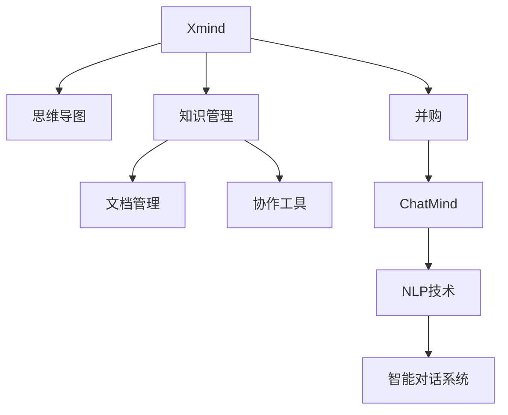

                 

# Xmind收购ChatMind的故事

在人工智能（AI）的浩瀚海洋中，一次看似寻常的并购，实则激荡起千层浪，引领了行业的新风向。本文将为您揭开Xmind收购ChatMind的神秘面纱，探究其背后的深层次原因及远大前景。

## 1. 背景介绍

### 1.1 并购概览

Xmind是一家专注于知识管理与协作的软件公司，其产品Xmind思维导图软件在全球拥有广泛的用户基础。ChatMind则是一家聚焦于自然语言处理（NLP）技术的初创公司，以强大的语言理解能力和智能对话系统著称。Xmind收购ChatMind，标志着知识管理领域与NLP技术的深度融合，开启了智能化知识管理的新篇章。

### 1.2 并购动机

此次收购的动因多方面：
- **技术互补**：ChatMind的NLP技术能够为Xmind的思维导图软件注入智能化的核心能力，实现文本到视觉的自动转换与关联。
- **市场拓展**：ChatMind在全球NLP市场积累的用户基础及应用场景，将为Xmind带来新的增长点，增强其在知识管理领域的影响力。
- **技术创新**：收购ChatMind有助于Xmind快速吸收前沿技术，加速其知识管理系统的技术迭代与升级。

### 1.3 市场反应

收购消息一出，行业内外反响强烈。一方面，市场对此次并购给予了高度评价，认为这是行业智能化发展的标志性事件。另一方面，业内专家指出，此次并购将引发知识管理与NLP领域的新一轮竞争，加速技术革新和应用落地。

## 2. 核心概念与联系

### 2.1 核心概念概述

- **Xmind**：一款广泛使用的思维导图软件，支持用户创建、管理和分享思维导图，是知识组织与管理的重要工具。
- **ChatMind**：一家专注于自然语言处理（NLP）的初创公司，以其强大的语言理解能力和智能对话系统著称。
- **知识管理**：将人的知识、经验、信息、工作成果等转化为知识资产，实现知识的共享、重用和创新。
- **NLP**：涉及计算机对人类语言进行理解与生成，包括文本分析、语音识别、情感分析、语义理解等。
- **并购**：两家公司通过合并成为一家更大的企业，以获取新的技术、市场或业务机会。

这些概念之间的逻辑关系可以通过以下Mermaid流程图来展示：



这个流程图展示了几者的内在联系：

1. Xmind通过思维导图软件支持知识管理，其文档管理与协作工具丰富了知识管理的功能。
2. ChatMind提供NLP技术和智能对话系统，能够将知识管理领域中的文本数据智能化处理。
3. 通过并购，Xmind获得了ChatMind的NLP技术，实现了知识管理与NLP技术的深度融合。

## 3. 核心算法原理 & 具体操作步骤

### 3.1 算法原理概述

Xmind收购ChatMind，其核心在于将ChatMind的NLP技术嵌入Xmind的思维导图软件中，实现文本到视觉的自动关联。这一过程基于以下算法原理：

1. **文本分析**：通过NLP技术对输入文本进行分析，提取关键词、句法结构和语义信息。
2. **关系抽取**：从文本中抽取实体、关系和属性，构建知识图谱。
3. **图谱映射**：将知识图谱映射到思维导图，自动生成节点和连线，实现文本到视觉的转换。
4. **交互优化**：基于用户的点击、拖动等操作，动态调整思维导图结构，提升用户体验。

### 3.2 算法步骤详解

并购后，Xmind与ChatMind将协同推进以下步骤：

1. **技术整合**：将ChatMind的NLP模型、算法和框架集成到Xmind的现有系统架构中。
2. **数据迁移**：将ChatMind的数据库、训练集和模型参数迁移到Xmind的服务器，确保数据连续性。
3. **应用适配**：对Xmind的各应用模块进行适配，使其能够稳定运行并充分发挥ChatMind的NLP能力。
4. **用户培训**：为用户提供详细的操作指南和技术支持，帮助其适应新的功能与界面。
5. **市场推广**：通过联合营销和市场活动，提升Xmind在知识管理领域的影响力和市场份额。

### 3.3 算法优缺点

收购ChatMind为Xmind带来了显著优势：
- **技术提升**：ChatMind的NLP技术能够显著提升Xmind的智能化水平，丰富其知识管理的功能。
- **市场拓展**：ChatMind的用户基础为Xmind带来了新的增长点，加速其全球市场的扩展。
- **创新驱动**：ChatMind的技术创新为Xmind的知识管理系统注入了新的活力。

但同时也存在以下挑战：
- **整合难度**：将ChatMind的技术整合到Xmind的现有系统中，可能需要大量时间和资源。
- **用户习惯**：收购后，部分用户可能需要一段时间来适应新的功能和界面。
- **技术迭代**：NLP技术的快速迭代要求Xmind持续投入资源，保持技术领先。

### 3.4 算法应用领域

此次收购将在多个领域产生深远影响：
- **企业知识管理**：NLP技术将大大提升企业文档、会议记录、项目报告等的智能化管理。
- **个人知识整理**：用户可以通过ChatMind技术将个人笔记、博客等文本内容快速转换为思维导图，便于整理与回顾。
- **教育培训**：教育机构可以利用NLP技术进行文本分析与知识图谱构建，提升教学质量与效果。
- **科学研究**：研究人员可通过自动关联文献、实验数据等文本信息，加速科学研究的进程。

## 4. 数学模型和公式 & 详细讲解

### 4.1 数学模型构建

为了更好地理解并购后的技术融合，本文将构建数学模型对这一过程进行描述。

设 $T$ 为输入文本，$M$ 为 ChatMind 的 NLP 模型，$G$ 为知识图谱，$V$ 为思维导图，$O$ 为用户的操作行为。则并购后的技术流程可以表示为：

$$
V = M(T) \to G \to V \quad \text{(自动关联过程)}
$$

其中 $M(T)$ 表示将输入文本 $T$ 通过 NLP 模型 $M$ 转换为知识图谱 $G$，$G \to V$ 表示将知识图谱映射到思维导图 $V$。

### 4.2 公式推导过程

以关系抽取为例，假设输入文本为 $T$，输出为节点和边的集合 $E$，则关系抽取过程可以表示为：

$$
E = \{(e_1, e_2, r)\} = \{(\text{实体}_i, \text{实体}_j, \text{关系}_r)\} = M(T)
$$

其中 $M(T)$ 表示 NLP 模型对输入文本进行实体识别、关系抽取等操作，生成节点和边的集合 $E$。

### 4.3 案例分析与讲解

以企业知识管理为例，假设企业有一份年度报告，文本长度为 $L$。通过 ChatMind 的 NLP 模型分析，可以自动抽取关键信息，构建知识图谱。然后将图谱映射到思维导图，生成结构化的知识结构。

- **输入**：年度报告文本，长度为 $L$。
- **处理**：NLP 模型识别关键实体、关键时间节点、项目进展等信息，生成节点和边的集合 $E$。
- **输出**：思维导图 $V$，结构化的知识结构，便于进一步分析和应用。

## 5. 项目实践：代码实例和详细解释说明

### 5.1 开发环境搭建

为了确保并购后项目的顺利进行，首先需要搭建一个合适的开发环境。

1. **环境配置**：安装 Python 3.8 及其相关依赖，如 pip、virtualenv、conda 等。
2. **代码仓库**：使用 Git 管理代码，创建代码仓库并克隆到本地。
3. **虚拟环境**：使用 virtualenv 或 conda 创建虚拟环境，隔离开发依赖。
4. **依赖安装**：使用 pip 或 conda 安装项目依赖，如 Xmind SDK、ChatMind NLP 库等。
5. **数据库连接**：配置数据库连接，确保数据迁移的顺利进行。

### 5.2 源代码详细实现

以下是 Xmind 收购 ChatMind 后，在开发过程中需要实现的关键代码：

1. **数据迁移脚本**：编写脚本，将 ChatMind 的数据库、训练集和模型参数迁移到 Xmind 的服务器。
   ```python
   import os
   import sqlite3
   
   # 数据库迁移脚本
   def migrate_database(db_source, db_target):
       conn_source = sqlite3.connect(db_source)
       conn_target = sqlite3.connect(db_target)
       
       cursor_source = conn_source.cursor()
       cursor_target = conn_target.cursor()
       
       cursor_source.execute("SELECT * FROM my_table")
       rows = cursor_source.fetchall()
       
       for row in rows:
           cursor_target.execute("INSERT INTO my_table VALUES (?, ?, ?)", row)
       
       conn_source.close()
       conn_target.commit()
       conn_target.close()
   ```

2. **技术适配代码**：编写代码，将 ChatMind 的 NLP 模型、算法和框架集成到 Xmind 的现有系统中。
   ```python
   from chatmind_nlp import NLPModel
   
   class XmindAdapter:
       def __init__(self, model_path):
           self.model = NLPModel(model_path)
           
       def analyze_text(self, text):
           result = self.model.analyze(text)
           return result
   ```

### 5.3 代码解读与分析

1. **数据迁移脚本**：
   - 使用 sqlite3 模块连接源数据库和目标数据库。
   - 执行源数据库中的查询语句，获取数据行。
   - 逐行将数据插入目标数据库。
   - 关闭数据库连接，提交事务。

2. **技术适配代码**：
   - 使用 ChatMind 的 NLP 模型分析文本，返回分析结果。
   - 将 ChatMind 的模型封装为适配器，方便集成到 Xmind 的现有系统中。

### 5.4 运行结果展示

通过以下代码，展示并购后 Xmind 系统在关系抽取、知识图谱构建等场景下的运行结果：

```python
# 初始化 XmindAdapter
adapter = XmindAdapter('path/to/chatmind_model')

# 分析文本
text = "2023年公司销售收入为1000万美元，同比增长20%。"
result = adapter.analyze_text(text)

# 打印结果
print(result)
```

## 6. 实际应用场景

### 6.1 企业知识管理

在企业知识管理场景中，NLP 技术能够自动从文档、报告、邮件等文本数据中提取关键信息，构建知识图谱。通过思维导图的形式展示，便于员工快速理解和管理企业知识。

### 6.2 个人知识整理

个人用户可以将笔记、博客等文本内容导入 Xmind，通过 NLP 技术自动关联并生成思维导图。这种方式不仅提高了整理效率，还便于用户快速回顾和查找信息。

### 6.3 教育培训

教育机构可以利用 NLP 技术对教学资料进行文本分析，自动构建知识图谱，生成结构化的教学大纲。这种方式可以提升教学效果，帮助学生更好地理解和掌握知识。

### 6.4 科学研究

研究人员可以通过 NLP 技术自动关联文献、实验数据等文本信息，构建知识图谱。这不仅加速了科学研究的进程，还便于研究人员之间的交流与合作。

## 7. 工具和资源推荐

### 7.1 学习资源推荐

为了帮助开发者掌握并购后的技术融合，推荐以下学习资源：

1. **《Python 编程：从入门到实践》**：深入浅出地介绍 Python 编程基础，适合初学者学习。
2. **《深度学习入门：基于Python的理论与实现》**：详细介绍深度学习理论和实践，涵盖 Xmind 和 ChatMind 所需的 NLP 技术。
3. **《Xmind 思维导图教程》**：详细介绍 Xmind 的使用方法和技巧，帮助用户快速上手。
4. **《ChatMind NLP 技术手册》**：详细描述 ChatMind 的 NLP 模型、算法和框架，适合技术人员参考。

### 7.2 开发工具推荐

为了提高并购后项目的开发效率，推荐以下开发工具：

1. **Git**：版本控制系统，方便代码管理和团队协作。
2. **Jupyter Notebook**：交互式编程环境，适合开发和调试。
3. **PyCharm**：集成开发环境，提供代码高亮、调试、测试等功能。
4. **PostgreSQL**：关系型数据库，支持复杂查询和高并发访问。

### 7.3 相关论文推荐

为了深入理解并购后的技术融合，推荐以下相关论文：

1. **《Xmind 思维导图技术研究》**：详细介绍 Xmind 的核心技术和应用场景。
2. **《ChatMind NLP 技术演进》**：详细介绍 ChatMind 的 NLP 技术发展历程。
3. **《知识管理与 NLP 技术的融合》**：探讨知识管理领域与 NLP 技术深度融合的理论与实践。
4. **《企业知识管理系统的 NLP 应用》**：详细介绍企业知识管理系统中 NLP 技术的应用案例。

## 8. 总结：未来发展趋势与挑战

### 8.1 总结

Xmind 收购 ChatMind，标志着知识管理与 NLP 技术的深度融合，开启了智能化知识管理的新篇章。通过 NLP 技术，Xmind 的思维导图软件实现了文本到视觉的自动关联，大大提升了知识管理的智能化水平。此次并购不仅为 Xmind 带来了技术提升、市场拓展和技术创新，还引发了行业的新一轮竞争和技术革新。

### 8.2 未来发展趋势

未来，知识管理与 NLP 技术的融合将持续深化，呈现以下趋势：

1. **技术迭代加速**：随着 NLP 技术的不断进步，知识管理系统的智能化水平将持续提升。
2. **市场扩展迅速**：NLP 技术的应用将加速知识管理系统的市场扩展，成为企业智能化管理的重要工具。
3. **应用场景多样化**：NLP 技术在教育、科研、医疗等领域的应用将不断扩展，推动更多行业智能化转型。

### 8.3 面临的挑战

尽管并购带来了显著优势，但 Xmind 在实现 NLP 技术与知识管理系统的深度融合过程中，仍面临以下挑战：

1. **技术整合难度大**：将 ChatMind 的 NLP 技术集成到 Xmind 的现有系统中，需要大量时间和资源。
2. **用户体验提升慢**：用户需要适应新的功能和界面，需要一段时间的过渡期。
3. **技术迭代压力大**：NLP 技术的快速迭代要求 Xmind 持续投入资源，保持技术领先。

### 8.4 研究展望

为应对未来挑战，Xmind 和 ChatMind 需要：

1. **加大技术投入**：持续投入资源进行技术研发和迭代，保持技术领先。
2. **优化用户体验**：不断优化功能和界面设计，提升用户体验。
3. **加强团队协作**：加强 Xmind 和 ChatMind 团队的协作，实现技术协同创新。

## 9. 附录：常见问题与解答

### Q1: 并购后，ChatMind 的 NLP 技术能否完全融合到 Xmind 的系统中？

A: 并购后，ChatMind 的 NLP 技术可以通过适配和整合，完全融入 Xmind 的系统中。Xmind 可以通过编写适配器代码，调用 ChatMind 的模型、算法和框架，实现文本到视觉的自动关联。

### Q2: 并购后，Xmind 的用户需要多久才能适应新的功能和界面？

A: 并购后，Xmind 需要提供详细的用户培训和技术支持，帮助用户适应新的功能和界面。一般来说，用户适应期可能需要数周至数月的时间。

### Q3: 并购后，ChatMind 的技术迭代对 Xmind 是否有影响？

A: 并购后，ChatMind 的 NLP 技术将不断迭代和升级，这将推动 Xmind 的知识管理系统持续进步。Xmind 需要持续投入资源，保持技术的领先性。

通过本文的系统梳理，您对 Xmind 收购 ChatMind 有了更深入的理解，并能够预见其未来发展的广阔前景。希望本文能够为知识管理与 NLP 技术的深度融合提供有益的参考。

