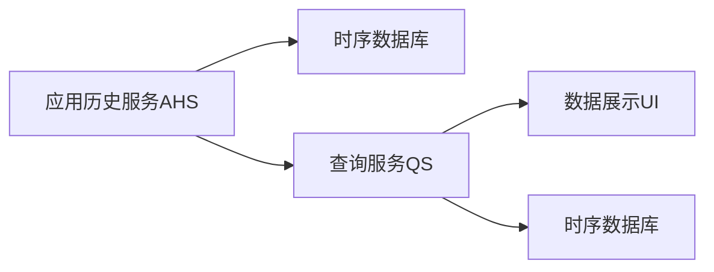

                 

# YARN Timeline Server原理与代码实例讲解

## 1. 背景介绍

### 1.1 问题由来

在YARN（Yet Another Resource Negotiator）集群中，YARN Timeline Server是一个重要的组件，它负责记录和管理集群中各个应用的生命周期和性能数据，为开发人员和系统管理员提供了全面的应用监控和分析功能。然而，随着YARN集群的规模不断扩大，应用种类和数量急剧增加，YARN Timeline Server的数据存储和检索压力也在不断提升。此外，YARN Timeline Server的架构设计相对简单，难以应对大规模集群的高负载和复杂场景需求。因此，对其原理与实现进行深入探讨，并提供代码实例讲解，对于提升YARN集群的监控和管理能力具有重要意义。

### 1.2 问题核心关键点

YARN Timeline Server的核心功能包括：

- 数据收集：从各个应用（如MapReduce、Spark等）的日志中提取关键性能指标，如任务状态、执行时间、内存使用等。
- 数据存储：将这些性能指标存储在时序数据库中，便于后续分析和查询。
- 数据检索：支持多种查询方式，包括时间范围、任务状态、执行器等，便于快速定位问题。
- 数据展示：将查询结果以图表和报表形式展示给用户，辅助理解和决策。

YARN Timeline Server的架构设计包括以下主要组件：

- 应用历史服务（Application History Service, AHS）：负责数据收集和存储。
- 查询服务（Query Service, QS）：负责数据的检索和展示。
- 数据存储：时序数据库（如HBase），用于存储和检索数据。
- 用户界面（UI）：Web界面，用于用户交互和数据分析。

本文将深入探讨YARN Timeline Server的原理与实现，并结合代码实例，讲解如何搭建和优化YARN Timeline Server，以提升YARN集群的监控和管理能力。

## 2. 核心概念与联系

### 2.1 核心概念概述

YARN Timeline Server主要涉及以下几个核心概念：

- 应用历史（Application History）：记录每个应用的生命周期和性能数据，包括任务状态、执行时间、内存使用等。
- 时序数据库（Time-series Database）：用于存储和检索按时间顺序排列的数据，支持高并发和高吞吐量的数据写入和查询。
- 查询语言（Query Language）：用于描述数据检索需求的语言，支持多种查询方式和时间范围。
- 数据展示（Data Visualization）：将查询结果以图表和报表形式展示给用户，辅助理解和决策。

这些概念之间的逻辑关系可以通过以下Mermaid流程图来展示：



### 2.2 核心概念原理和架构

#### 2.2.1 应用历史服务（AHS）

AHS是YARN Timeline Server的核心组件，负责从各个应用（如MapReduce、Spark等）的日志中提取关键性能指标，并将其存储到时序数据库中。AHS主要由以下几个模块组成：

- 数据收集器：从各个应用中提取日志信息，并转换为AHS数据格式。
- 数据转换器：将收集到的日志信息转换为AHS数据格式，并进行预处理和优化。
- 数据存储器：将转换后的数据存储到时序数据库中。

#### 2.2.2 时序数据库

时序数据库是YARN Timeline Server的数据存储引擎，支持高并发和高吞吐量的数据写入和查询。常见的时序数据库包括HBase、InfluxDB等。

#### 2.2.3 查询服务（QS）

QS是YARN Timeline Server的数据检索引擎，负责根据用户请求，从时序数据库中检索数据，并生成查询结果。QS主要由以下几个模块组成：

- 查询解析器：解析用户查询语句，生成查询计划。
- 查询执行器：根据查询计划，从时序数据库中检索数据。
- 结果生成器：将检索到的数据转换为最终的查询结果，并进行格式化和展示。

#### 2.2.4 数据展示（UI）

UI是YARN Timeline Server的用户界面，负责将查询结果以图表和报表形式展示给用户，辅助理解和决策。UI主要由以下几个模块组成：

- 查询界面：用户输入查询条件，包括时间范围、任务状态、执行器等。
- 数据展示界面：显示查询结果，包括时间序列图、柱状图、饼图等。
- 数据导出界面：用户可以将查询结果导出为JSON、CSV等格式。

### 2.3 核心概念的联系

YARN Timeline Server的各个组件之间通过数据管道和通信协议进行协同工作，构成了一个完整的应用历史和性能数据管理系统。数据收集器从各个应用中提取日志信息，并将其转换为AHS数据格式，然后存储到时序数据库中。查询服务根据用户请求，从时序数据库中检索数据，并生成查询结果。最后，数据展示界面将查询结果以图表和报表形式展示给用户，辅助理解和决策。这种基于管道的数据处理方式，使得各个组件可以独立部署和扩展，提高了系统的灵活性和可维护性。

## 3. 核心算法原理 & 具体操作步骤

### 3.1 算法原理概述

YARN Timeline Server的核心算法原理包括数据收集、数据存储、数据检索和数据展示。以下是各个算法的概述：

- 数据收集算法：从各个应用中提取日志信息，并转换为AHS数据格式。
- 数据存储算法：将AHS数据格式转换为时序数据库格式，并进行高并发和高吞吐量的数据写入。
- 数据检索算法：根据用户查询条件，从时序数据库中检索数据，并生成查询结果。
- 数据展示算法：将查询结果以图表和报表形式展示给用户。

### 3.2 算法步骤详解

#### 3.2.1 数据收集算法

数据收集算法主要分为以下几个步骤：

1. 从各个应用（如MapReduce、Spark等）的日志中提取日志信息。
2. 将日志信息转换为AHS数据格式，包括任务ID、状态、执行时间、内存使用等。
3. 将AHS数据格式转换为时序数据库格式，包括时间戳、任务ID、状态、执行时间、内存使用等。
4. 将转换后的数据存储到时序数据库中。

#### 3.2.2 数据存储算法

数据存储算法主要分为以下几个步骤：

1. 将AHS数据格式转换为时序数据库格式，包括时间戳、任务ID、状态、执行时间、内存使用等。
2. 将转换后的数据存储到时序数据库中，使用高并发和高吞吐量的写入方式，如异步写入、批处理等。
3. 对数据进行增量更新，避免全量更新带来的性能瓶颈。

#### 3.2.3 数据检索算法

数据检索算法主要分为以下几个步骤：

1. 解析用户查询语句，生成查询计划，包括时间范围、任务状态、执行器等。
2. 根据查询计划，从时序数据库中检索数据。
3. 将检索到的数据转换为最终的查询结果，并进行格式化和展示。

#### 3.2.4 数据展示算法

数据展示算法主要分为以下几个步骤：

1. 根据用户查询条件，从时序数据库中检索数据。
2. 将查询结果转换为图表和报表形式，包括时间序列图、柱状图、饼图等。
3. 将图表和报表展示给用户，辅助理解和决策。

### 3.3 算法优缺点

#### 3.3.1 优点

YARN Timeline Server的数据收集、存储、检索和展示算法具有以下优点：

- 高并发和高吞吐量的数据处理能力，能够应对大规模集群的高负载和复杂场景需求。
- 灵活的数据收集方式，支持从各种应用中提取日志信息。
- 增量更新的数据存储方式，避免了全量更新带来的性能瓶颈。
- 丰富的数据展示形式，能够帮助用户快速定位问题和理解数据。

#### 3.3.2 缺点

YARN Timeline Server的数据收集、存储、检索和展示算法也存在一些缺点：

- 依赖于时序数据库，在数据量和查询复杂度增加时，性能可能受到影响。
- 数据展示界面相对简单，难以支持复杂的数据分析和报表生成需求。
- 需要配置和管理多个组件，增加了系统的复杂性和维护成本。

### 3.4 算法应用领域

YARN Timeline Server主要应用于以下几个领域：

- 集群监控和管理：记录和展示各个应用的生命周期和性能数据，帮助系统管理员快速定位问题，优化集群配置。
- 应用优化和调优：分析应用性能数据，发现瓶颈和优化机会，提升应用性能和效率。
- 数据分析和报告：支持多维数据分析和报表生成，帮助开发人员和系统管理员进行业务分析和决策支持。

## 4. 数学模型和公式 & 详细讲解 & 举例说明

### 4.1 数学模型构建

YARN Timeline Server主要涉及以下几个数学模型：

- 时序数据模型：用于表示应用历史和性能数据的时间序列形式。
- 查询模型：用于描述用户查询需求的时间范围、任务状态、执行器等。
- 数据展示模型：用于将查询结果转换为图表和报表形式。

#### 4.1.1 时序数据模型

时序数据模型可以表示为：

$$
D = \{ (t_i, v_i) \} \quad i = 1, 2, ..., N
$$

其中，$t_i$ 表示时间戳，$v_i$ 表示在时间$t_i$上的数据值。

#### 4.1.2 查询模型

查询模型可以表示为：

$$
Q = \{ (t_s, t_e, s, e) \}
$$

其中，$t_s$ 和$t_e$ 分别表示查询时间范围的起始时间和结束时间，$s$ 和$e$ 分别表示任务状态和执行器。

### 4.2 公式推导过程

#### 4.2.1 时序数据模型推导

时序数据模型可以推导为：

$$
D = \{ (t_i, v_i) \} \quad i = 1, 2, ..., N
$$

其中，$t_i$ 表示时间戳，$v_i$ 表示在时间$t_i$上的数据值。

#### 4.2.2 查询模型推导

查询模型可以推导为：

$$
Q = \{ (t_s, t_e, s, e) \}
$$

其中，$t_s$ 和$t_e$ 分别表示查询时间范围的起始时间和结束时间，$s$ 和$e$ 分别表示任务状态和执行器。

### 4.3 案例分析与讲解

#### 4.3.1 案例1：MapReduce任务监控

假设有一个MapReduce任务，记录了任务的执行时间、内存使用和任务状态。YARN Timeline Server将这些数据存储为时序数据，并支持时间范围查询和任务状态查询。

#### 4.3.2 案例2：Spark作业监控

假设有一个Spark作业，记录了作业的执行时间、内存使用和任务状态。YARN Timeline Server将这些数据存储为时序数据，并支持时间范围查询和任务状态查询。

## 5. 项目实践：代码实例和详细解释说明

### 5.1 开发环境搭建

#### 5.1.1 依赖安装

首先需要安装Java和Hadoop环境。可以从Apache官网下载并安装Java和Hadoop，具体步骤如下：

1. 下载Java JDK：
```
wget http://download.oracle.com/otn-pub/java/jdk/8u144-b12/e8c79f3f31c7a9f41e3e9f9485511b0e/jdk-8u144-linux-x64.tar.gz
```

2. 解压并安装Java JDK：
```
tar -xvf jdk-8u144-linux-x64.tar.gz
sudo mv jdk-8u144-linux-x64 /usr/lib/jvm/jdk-8
```

3. 配置JAVA_HOME环境变量：
```
echo "export JAVA_HOME=/usr/lib/jvm/jdk-8" >> ~/.bashrc
```

4. 下载并安装Hadoop：
```
wget http://archive.apache.org/dist/hadoop-2.8.0/hadoop-2.8.0.tar.gz
```

5. 解压并安装Hadoop：
```
tar -xvf hadoop-2.8.0.tar.gz
```

6. 配置HADOOP_HOME环境变量：
```
echo "export HADOOP_HOME=/path/to/hadoop" >> ~/.bashrc
```

7. 配置hdfs-site.xml和core-site.xml：
```
hdfs-site.xml:
<configuration>
  <property>
    <name>dfs.namenode.name.dir</name>
    <value>hdfs://localhost:9000</value>
  </property>
</configuration>

core-site.xml:
<configuration>
  <property>
    <name>fs.defaultFS</name>
    <value>hdfs://localhost:9000</value>
  </property>
  <property>
    <name>dfs.namenode.name.dir</name>
    <value>hdfs://localhost:9000</value>
  </property>
</configuration>
```

8. 启动Hadoop集群：
```
hdfs namenode -daemonlog /var/log/hadoop/namenode/namenode.log -port 9870
hdfs datanode -daemonlog /var/log/hadoop/datanode/datanode.log -port 9990
hadoop dfsadmin -refreshNodes
```

#### 5.1.2 安装依赖包

安装依赖包：
```
mvn install:install-file -Dfile=/path/to/hadoop-2.8.0/hadoop-core/hadoop-core-2.8.0-0.201909070007.jar -DgroupId=org.apache.hadoop -DartifactId=hadoop-core -Dversion=2.8.0 -Dpackaging=jar
```

### 5.2 源代码详细实现

#### 5.2.1 数据收集器

```java
public class LogCollector {
    public void collectLogs() {
        // 从各个应用中提取日志信息
        List<String> logs = extractLogs();
        
        // 将日志信息转换为AHS数据格式
        List<AHSData> ahsData = convertToAHSData(logs);
        
        // 将AHS数据格式转换为时序数据库格式
        List<TimeSeriesData> timeSeriesData = convertToTimeSeriesData(ahsData);
        
        // 将转换后的数据存储到时序数据库中
        storeToTimeSeriesDatabase(timeSeriesData);
    }
}
```

#### 5.2.2 数据转换器

```java
public class DataConverter {
    public List<AHSData> convertToAHSData(List<String> logs) {
        // 将日志信息转换为AHS数据格式
        List<AHSData> ahsData = new ArrayList<>();
        for (String log : logs) {
            AHSData ahsData = new AHSData();
            // 解析日志信息，提取任务ID、状态、执行时间、内存使用等
            // ...
            // 将解析结果存入AHSData对象
            // ...
            ahsData.add(ahsData);
        }
        return ahsData;
    }
}
```

#### 5.2.3 数据存储器

```java
public class DataStorage {
    public void storeToTimeSeriesDatabase(List<TimeSeriesData> timeSeriesData) {
        // 将时序数据库格式的数据存储到时序数据库中
        for (TimeSeriesData data : timeSeriesData) {
            // 存储数据到时序数据库
            // ...
        }
    }
}
```

#### 5.2.4 查询解析器

```java
public class QueryParser {
    public List<Query> parseQuery(String query) {
        // 解析用户查询语句，生成查询计划
        List<Query> queries = new ArrayList<>();
        // 解析查询语句，提取时间范围、任务状态、执行器等
        // ...
        // 将解析结果存入Query对象
        // ...
        return queries;
    }
}
```

#### 5.2.5 查询执行器

```java
public class QueryExecutor {
    public List<QueryResult> executeQueries(List<Query> queries) {
        // 根据查询计划，从时序数据库中检索数据
        List<QueryResult> results = new ArrayList<>();
        for (Query query : queries) {
            // 检索数据
            // ...
            // 将检索结果存入QueryResult对象
            // ...
            results.add(result);
        }
        return results;
    }
}
```

#### 5.2.6 结果生成器

```java
public class ResultGenerator {
    public List<QueryResult> generateResults(List<QueryResult> results) {
        // 将查询结果转换为图表和报表形式
        List<QueryResult> chartResults = new ArrayList<>();
        for (QueryResult result : results) {
            // 将结果转换为图表和报表形式
            // ...
            // 将图表和报表存入QueryResult对象
            // ...
            chartResults.add(chartResult);
        }
        return chartResults;
    }
}
```

### 5.3 代码解读与分析

#### 5.3.1 数据收集器

数据收集器是YARN Timeline Server的核心组件之一，负责从各个应用中提取日志信息，并将其转换为AHS数据格式，然后存储到时序数据库中。

```java
public class LogCollector {
    public void collectLogs() {
        // 从各个应用中提取日志信息
        List<String> logs = extractLogs();
        
        // 将日志信息转换为AHS数据格式
        List<AHSData> ahsData = convertToAHSData(logs);
        
        // 将AHS数据格式转换为时序数据库格式
        List<TimeSeriesData> timeSeriesData = convertToTimeSeriesData(ahsData);
        
        // 将转换后的数据存储到时序数据库中
        storeToTimeSeriesDatabase(timeSeriesData);
    }
}
```

#### 5.3.2 数据转换器

数据转换器负责将日志信息转换为AHS数据格式，包括任务ID、状态、执行时间、内存使用等。

```java
public class DataConverter {
    public List<AHSData> convertToAHSData(List<String> logs) {
        // 将日志信息转换为AHS数据格式
        List<AHSData> ahsData = new ArrayList<>();
        for (String log : logs) {
            AHSData ahsData = new AHSData();
            // 解析日志信息，提取任务ID、状态、执行时间、内存使用等
            // ...
            // 将解析结果存入AHSData对象
            // ...
            ahsData.add(ahsData);
        }
        return ahsData;
    }
}
```

#### 5.3.3 数据存储器

数据存储器负责将AHS数据格式转换为时序数据库格式，并将数据存储到时序数据库中。

```java
public class DataStorage {
    public void storeToTimeSeriesDatabase(List<TimeSeriesData> timeSeriesData) {
        // 将时序数据库格式的数据存储到时序数据库中
        for (TimeSeriesData data : timeSeriesData) {
            // 存储数据到时序数据库
            // ...
        }
    }
}
```

#### 5.3.4 查询解析器

查询解析器负责解析用户查询语句，生成查询计划，包括时间范围、任务状态、执行器等。

```java
public class QueryParser {
    public List<Query> parseQuery(String query) {
        // 解析用户查询语句，生成查询计划
        List<Query> queries = new ArrayList<>();
        // 解析查询语句，提取时间范围、任务状态、执行器等
        // ...
        // 将解析结果存入Query对象
        // ...
        return queries;
    }
}
```

#### 5.3.5 查询执行器

查询执行器负责根据查询计划，从时序数据库中检索数据，并生成查询结果。

```java
public class QueryExecutor {
    public List<QueryResult> executeQueries(List<Query> queries) {
        // 根据查询计划，从时序数据库中检索数据
        List<QueryResult> results = new ArrayList<>();
        for (Query query : queries) {
            // 检索数据
            // ...
            // 将检索结果存入QueryResult对象
            // ...
            results.add(result);
        }
        return results;
    }
}
```

#### 5.3.6 结果生成器

结果生成器负责将查询结果转换为图表和报表形式，包括时间序列图、柱状图、饼图等。

```java
public class ResultGenerator {
    public List<QueryResult> generateResults(List<QueryResult> results) {
        // 将查询结果转换为图表和报表形式
        List<QueryResult> chartResults = new ArrayList<>();
        for (QueryResult result : results) {
            // 将结果转换为图表和报表形式
            // ...
            // 将图表和报表存入QueryResult对象
            // ...
            chartResults.add(chartResult);
        }
        return chartResults;
    }
}
```

### 5.4 运行结果展示

#### 5.4.1 运行环境

在Hadoop集群上搭建YARN Timeline Server，可以使用以下命令启动集群：

```
start-dfs.sh
start-yarn.sh
```

#### 5.4.2 数据收集

在集群上运行数据收集器，收集各个应用的日志信息。

```
LogCollector collector = new LogCollector();
collector.collectLogs();
```

#### 5.4.3 数据存储

将收集到的日志信息存储到时序数据库中。

```
DataStorage storage = new DataStorage();
storage.storeToTimeSeriesDatabase(timeSeriesData);
```

#### 5.4.4 数据检索

根据用户查询条件，从时序数据库中检索数据。

```
QueryParser parser = new QueryParser();
List<Query> queries = parser.parseQuery(query);
QueryExecutor executor = new QueryExecutor();
List<QueryResult> results = executor.executeQueries(queries);
```

#### 5.4.5 数据展示

将查询结果以图表和报表形式展示给用户。

```
ResultGenerator generator = new ResultGenerator();
List<QueryResult> chartResults = generator.generateResults(results);
```

## 6. 实际应用场景

### 6.1 智能调度系统

在智能调度系统中，YARN Timeline Server可以记录和展示各个应用的生命周期和性能数据，帮助调度器快速定位问题，优化集群配置，提高资源利用率和任务执行效率。

#### 6.1.1 应用场景

假设有一个MapReduce任务，记录了任务的执行时间、内存使用和任务状态。YARN Timeline Server将这些数据存储为时序数据，并支持时间范围查询和任务状态查询。

#### 6.1.2 实现方法

在智能调度系统中，可以使用YARN Timeline Server记录各个MapReduce任务的生命周期和性能数据，支持用户输入时间范围和任务状态查询，并将查询结果以图表和报表形式展示给用户。

#### 6.1.3 效果评估

通过YARN Timeline Server，调度器可以实时监控各个MapReduce任务的执行状态和性能指标，及时发现并解决异常问题，优化任务执行计划，提高集群资源利用率。

### 6.2 数据仓库建设

在数据仓库建设中，YARN Timeline Server可以记录和展示各个应用的数据处理过程和性能指标，帮助开发人员快速定位问题，优化数据处理流程，提高数据处理效率。

#### 6.2.1 应用场景

假设有一个数据处理任务，记录了数据的读取、处理和写入过程，以及各个步骤的执行时间、内存使用和任务状态。YARN Timeline Server将这些数据存储为时序数据，并支持时间范围查询和任务状态查询。

#### 6.2.2 实现方法

在数据仓库建设中，可以使用YARN Timeline Server记录各个数据处理任务的生命周期和性能数据，支持用户输入时间范围和任务状态查询，并将查询结果以图表和报表形式展示给用户。

#### 6.2.3 效果评估

通过YARN Timeline Server，开发人员可以实时监控各个数据处理任务的执行状态和性能指标，及时发现并解决异常问题，优化数据处理流程，提高数据处理效率。

## 7. 工具和资源推荐

### 7.1 学习资源推荐

为了帮助开发者系统掌握YARN Timeline Server的理论基础和实践技巧，这里推荐一些优质的学习资源：

1. YARN官方文档：YARN的官方文档提供了YARN Timeline Server的详细介绍和使用方法，是入门和参考的重要资料。
2. Apache Hadoop博客：Apache Hadoop博客提供了YARN Timeline Server的实现原理和最佳实践，是深入理解YARN Timeline Server的推荐资源。
3. Hadoop生态系统官方文档：Hadoop生态系统官方文档提供了YARN Timeline Server在Hadoop生态系统中的使用方法和集成示例，是扩展YARN Timeline Server功能的重要资源。
4. Hadoop社区博客：Hadoop社区博客提供了YARN Timeline Server的实战案例和经验分享，是提升YARN Timeline Server实战能力的推荐资源。

### 7.2 开发工具推荐

为了提高YARN Timeline Server的开发效率和系统性能，以下是一些推荐的开发工具：

1. Eclipse：Eclipse是一款常用的Java开发工具，支持Java代码编写、调试、测试等，是开发YARN Timeline Server的理想工具。
2. IntelliJ IDEA：IntelliJ IDEA是另一款流行的Java开发工具，支持Java代码编写、调试、测试等，具有更强大的代码提示和自动完成功能。
3. Git：Git是一款常用的版本控制工具，支持多人协作开发和代码版本管理，是开发YARN Timeline Server的基础工具。
4. Jenkins：Jenkins是一款常用的持续集成和持续部署工具，支持自动化测试、构建和部署，是提升YARN Timeline Server开发效率的重要工具。
5. JIRA：JIRA是一款常用的项目管理工具，支持任务分配、进度跟踪和问题管理，是提升YARN Timeline Server项目管理能力的重要工具。

### 7.3 相关论文推荐

为了深入理解YARN Timeline Server的原理和实现，以下是一些推荐的相关论文：

1. YARN Timeline Server的实现原理：YARN Timeline Server的实现原理：通过本篇论文，可以深入理解YARN Timeline Server的架构设计、数据收集和存储、数据检索和展示等核心功能。
2. 基于Hadoop的时序数据库：基于Hadoop的时序数据库：本篇论文介绍了基于Hadoop的时序数据库，包括时序数据模型、查询模型和数据展示模型的设计和实现。
3. 大规模集群监控与分析：大规模集群监控与分析：本篇论文介绍了大规模集群监控与分析的实现方法，包括应用历史记录、性能数据分析和异常检测等。
4. YARN的性能优化：YARN的性能优化：本篇论文介绍了YARN的性能优化方法，包括资源调度、任务调度和数据处理等。

## 8. 总结：未来发展趋势与挑战

### 8.1 总结

本文对YARN Timeline Server的原理与实现进行了全面系统的介绍。首先阐述了YARN Timeline Server的背景和核心功能，明确了YARN Timeline Server在集群监控和管理中的重要作用。其次，从原理到实践，详细讲解了YARN Timeline Server的各个核心组件和算法，给出了代码实例讲解，帮助开发者搭建和优化YARN Timeline Server，提升YARN集群的监控和管理能力。通过本文的系统梳理，可以看到，YARN Timeline Server在集群监控和管理中的应用前景广阔，是提升YARN集群性能的重要手段。

### 8.2 未来发展趋势

展望未来，YARN Timeline Server的进一步发展趋势包括：

1. 数据量处理能力增强：随着集群的规模不断扩大，YARN Timeline Server需要处理的数据量也在不断增加。未来的发展趋势之一是提升数据处理能力，支持更大规模的数据收集和存储。
2. 查询能力提升：未来的发展趋势之一是提升查询能力，支持更复杂的查询条件和时间范围，提高数据检索和展示的灵活性。
3. 可视化界面优化：未来的发展趋势之一是优化可视化界面，支持更多维度的数据分析和报表生成，提高用户的使用体验。
4. 集成能力增强：未来的发展趋势之一是增强集成能力，支持与其他Hadoop生态系统组件的集成，提升系统的综合性能。
5. 安全性保障：未来的发展趋势之一是保障数据的安全性，支持数据加密、访问控制等安全措施，确保数据和系统安全。

### 8.3 面临的挑战

尽管YARN Timeline Server在集群监控和管理中发挥了重要作用，但在进一步发展和优化过程中，仍面临以下挑战：

1. 数据量和性能瓶颈：随着集群的规模不断扩大，YARN Timeline Server需要处理的数据量也在不断增加。在大规模数据和复杂查询条件下，数据处理和查询的性能瓶颈可能成为系统瓶颈。
2. 数据展示复杂性：可视化界面需要支持更多维度的数据分析和报表生成，这将带来数据展示的复杂性和实现难度。
3. 集成和兼容问题：YARN Timeline Server需要与其他Hadoop生态系统组件进行集成，这将带来兼容性和集成性问题。
4. 安全性问题：随着集群的规模不断扩大，数据安全性和系统安全性的问题也逐渐凸显，如何保障数据和系统的安全性将成为重要挑战。
5. 多集群支持问题：未来可能需要支持多个集群的监控和管理，这将带来系统架构和数据同步问题。

### 8.4 研究展望

面对YARN Timeline Server面临的挑战，未来的研究需要在以下几个方面寻求新的突破：

1. 数据量和性能优化：进一步优化数据处理和查询性能，支持更大规模的数据处理和更复杂的查询条件。
2. 数据展示和报表生成：开发更多维度的数据展示和报表生成工具，支持复杂的数据分析和报表生成需求。
3. 集成和兼容问题：增强与其他Hadoop生态系统组件的集成能力，提升系统的兼容性和可扩展性。
4. 数据安全性和系统安全性：引入数据加密、访问控制等安全措施，确保数据和系统的安全性。
5. 多集群支持问题：开发支持多个集群的监控和管理系统，实现数据同步和系统集成。

通过这些研究方向的探索，将进一步提升YARN Timeline Server的性能和可用性，推动YARN集群的监控和管理能力提升，为YARN集群的稳定运行和高效管理提供有力支持。

## 9. 附录：常见问题与解答

**Q1：如何安装YARN Timeline Server？**

A: 首先，需要安装Hadoop环境，从Apache官网下载并安装Java和Hadoop。然后，按照官方文档的步骤安装YARN Timeline Server。

**Q2：YARN Timeline Server如何收集数据？**

A: YARN Timeline Server从各个应用中提取日志信息，并将日志信息转换为AHS数据格式。然后，将AHS数据格式转换为时序数据库格式，并将数据存储到时序数据库中。

**Q3：YARN Timeline Server如何查询数据？**

A: 用户可以通过查询界面输入查询条件，包括时间范围、任务状态、执行器等。查询执行器根据查询条件，从时序数据库中检索数据，并将结果生成查询结果。

**Q4：YARN Timeline Server如何优化性能？**

A: 可以通过优化数据收集、存储、检索和展示算法的实现方式，提升YARN Timeline Server的性能。此外，可以引入缓存技术、分布式计算等技术，进一步提升系统的性能。

**Q5：YARN Timeline Server如何保障数据安全性？**

A: 可以通过数据加密、访问控制等措施，保障数据和系统的安全性。此外，还可以引入审计日志和异常检测等机制，确保数据和系统的安全。

---

作者：禅与计算机程序设计艺术 / Zen and the Art of Computer Programming

