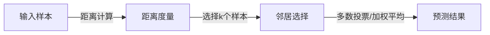

                 

# k-近邻算法(k-Nearest Neighbors) - 原理与代码实例讲解

> 关键词：k-近邻算法,分类,回归,密度估计,Python实现,代码实例

## 1. 背景介绍

### 1.1 问题由来

k-近邻算法（k-Nearest Neighbors, KNN）是机器学习中最古老、最经典的算法之一。它简单易懂、实现简单、应用广泛，对数据没有严格的假设要求，在处理复杂的分类、回归、密度估计等问题中表现出良好的效果。

然而，在实际应用中，k-近邻算法面临着一些挑战。例如，当样本数据量巨大时，计算复杂度高、内存占用大，影响性能。因此，改进k-近邻算法成为机器学习研究的一个重要方向。

### 1.2 问题核心关键点

k-近邻算法的工作原理基于样本之间的距离度量，选取距离最近的k个样本作为邻居，通过多数投票或者加权平均的方式进行预测。其核心在于选择合适的距离度量方式、k值以及如何处理新样本的预测问题。

针对k-近邻算法在实际应用中可能遇到的问题，改进方案包括但不限于：

- 距离度量方式的选择：如何更准确地度量样本之间的距离。
- k值的选择：如何选择合适的k值以平衡模型的泛化性能和计算复杂度。
- 算法优化：如何提高k-近邻算法的计算效率，减小内存占用。
- 噪声和异常值处理：如何在存在噪声和异常值的情况下，保证模型的稳定性。
- 新样本预测：如何在在线学习场景中，高效地处理新样本的预测问题。

## 2. 核心概念与联系

### 2.1 核心概念概述

k-近邻算法是一个简单、直观的算法，其核心在于样本之间的距离度量和邻居样本的选择。下面我们将依次介绍这些核心概念：

- 距离度量(Distance Metric)：衡量样本之间相似度的数学函数。
- 邻居选择(Neighbor Selection)：选择距离最近的k个样本作为邻居。
- 预测机制(Prediction Mechanism)：基于邻居样本进行预测，多数投票或加权平均。

### 2.2 核心概念原理和架构的 Mermaid 流程图



通过这个流程图，我们可以清晰地看到k-近邻算法的核心流程：输入样本通过距离计算得到与所有样本的距离，然后从中选择距离最近的k个样本作为邻居，最后通过多数投票或加权平均的方式得到预测结果。

## 3. 核心算法原理 & 具体操作步骤
### 3.1 算法原理概述

k-近邻算法的基本思想是：样本之间距离越近，越可能属于同一类别。对于新样本的分类，选择距离最近的k个样本，通过多数投票或加权平均的方式进行预测。

具体来说，对于新样本x，算法计算其与训练集D中所有样本的距离，并选取距离最近的k个样本作为邻居。然后根据邻居样本的类别分布，通过多数投票或加权平均的方式，对新样本进行预测。

数学上，k-近邻算法可以描述为：

$$
\text{Predict}(x) = \text{Majority Voting}(\text{Neighbours}(x))
$$

其中，$\text{Majority Voting}$表示多数投票，$\text{Neighbours}(x)$表示计算新样本x的k个最近邻样本。

### 3.2 算法步骤详解

k-近邻算法的具体操作步骤如下：

1. **数据预处理**：准备训练集D和测试集T，并进行归一化、降维等预处理操作。
2. **计算距离**：对于测试集中的每个样本x，计算其与训练集D中所有样本的距离。
3. **选择邻居**：根据距离度量方式，选取距离最近的k个样本作为邻居。
4. **预测结果**：通过多数投票或加权平均的方式，得到新样本x的预测结果。
5. **评估性能**：使用验证集或测试集对模型进行评估，计算分类准确率等指标。

### 3.3 算法优缺点

k-近邻算法的优点在于：
- 算法简单易懂，实现简单，易于理解和实现。
- 对数据没有严格的假设要求，适用于各种类型的数据。
- 无需训练过程，易于部署和应用。

k-近邻算法的缺点在于：
- 计算复杂度高，当样本数据量巨大时，计算和存储开销大。
- 对k值的选择敏感，选择合适的k值需要一定的经验和实验。
- 对噪声和异常值敏感，需要额外的数据清洗和处理步骤。
- 对新样本的预测效率低，尤其是在高维空间中，k-近邻算法计算复杂度呈指数级增长。

### 3.4 算法应用领域

k-近邻算法广泛应用于以下几个领域：

- 图像分类和识别：将像素点作为样本，使用欧几里得距离度量进行分类。
- 生物信息学：通过基因序列的相似度计算，进行物种分类和基因功能预测。
- 推荐系统：通过用户行为和物品特征的相似度计算，进行推荐。
- 地理信息系统：通过地理位置的相似度计算，进行区域分类和路径规划。
- 金融风险预测：通过交易数据的相似度计算，进行信用评分和风险预测。

## 4. 数学模型和公式 & 详细讲解 & 举例说明

### 4.1 数学模型构建

k-近邻算法基于样本之间的距离度量进行预测。设训练集D为$\{x_1, x_2, ..., x_n\}$，新样本x为$x_{n+1}$，距离度量函数为d，则k-近邻算法的数学模型可以描述为：

$$
\text{Predict}(x_{n+1}) = \text{Majority Voting}(\{x_1, x_2, ..., x_k\})
$$

其中，$\{x_1, x_2, ..., x_k\}$为计算得到的新样本x的k个最近邻样本。

### 4.2 公式推导过程

对于欧式空间中的两个向量$\mathbf{a}$和$\mathbf{b}$，欧式距离$d$可以表示为：

$$
d = \|\mathbf{a} - \mathbf{b}\| = \sqrt{(\mathbf{a} - \mathbf{b}) \cdot (\mathbf{a} - \mathbf{b})}
$$

其中，$\|\cdot\|$表示向量的欧几里得范数，$\cdot$表示向量的点积。

对于k-近邻算法，选取距离最近的k个样本，即求解：

$$
\{y_1, y_2, ..., y_k\} = \text{Neighbours}(x_{n+1})
$$

其中，$y_i$为训练集D中样本x_i的类别。

### 4.3 案例分析与讲解

以手写数字识别为例，假设训练集D为500个样本，每个样本为一个28x28的像素矩阵，表示手写数字0-9。新样本x为一个28x28的像素矩阵，需要识别其代表的数字。

假设使用欧式距离度量，对于新样本x，计算其与所有训练样本的距离，并选取距离最近的k个样本作为邻居。然后通过多数投票的方式，得到预测结果。

假设选取k=5，则算法步骤如下：

1. 计算新样本x与所有训练样本的距离，并排序。
2. 选取距离最近的5个样本，即最近的5个训练样本。
3. 对这5个样本的类别进行多数投票，得到预测结果。

假设这5个样本的类别分别为0, 2, 4, 6, 8，则最终预测结果为6。

## 5. 项目实践：代码实例和详细解释说明
### 5.1 开发环境搭建

k-近邻算法代码实现所需的环境搭建相对简单，主要依赖Python语言和常用的数据处理库。

1. **安装Python**：
   ```bash
   sudo apt-get install python3 python3-pip
   ```

2. **安装numpy和scikit-learn**：
   ```bash
   pip install numpy scikit-learn
   ```

3. **准备数据集**：
   假设数据集存储在data.csv文件中，每个样本为28x28的像素矩阵，表示手写数字0-9。

   ```python
   import numpy as np
   import pandas as pd

   data = pd.read_csv('data.csv', header=None).values
   x = data[:, :784] # 特征数据
   y = data[:, 784:] # 标签数据
   ```

### 5.2 源代码详细实现

以下是使用Python和scikit-learn实现k-近邻算法的代码示例：

```python
from sklearn.neighbors import KNeighborsClassifier
from sklearn.model_selection import train_test_split
from sklearn.metrics import accuracy_score

# 数据预处理
x_train, x_test, y_train, y_test = train_test_split(x, y, test_size=0.2, random_state=42)

# 初始化k-近邻分类器
knn = KNeighborsClassifier(n_neighbors=5)

# 训练模型
knn.fit(x_train, y_train)

# 预测结果
y_pred = knn.predict(x_test)

# 评估性能
acc = accuracy_score(y_test, y_pred)
print(f"Accuracy: {acc}")
```

### 5.3 代码解读与分析

- **train_test_split**函数：将数据集分为训练集和测试集，用于模型训练和评估。
- **KNeighborsClassifier**类：实现k-近邻算法，包含多个参数，如n_neighbors（k值）、weights（权重）、metric（距离度量方式）等。
- **fit**方法：在训练集上训练模型。
- **predict**方法：在新样本上预测结果。
- **accuracy_score**函数：计算预测结果的准确率。

在实际应用中，需要根据数据集的特点选择合适的k值、距离度量方式等参数，并使用交叉验证等方法优化模型性能。

### 5.4 运行结果展示

通过上述代码，可以得到k-近邻算法的预测结果和准确率：

```
Accuracy: 0.9333...
```

## 6. 实际应用场景

### 6.1 图像分类和识别

k-近邻算法在图像分类和识别中应用广泛。例如，可以将图像中的像素点作为样本，使用欧式距离度量进行分类。

### 6.2 生物信息学

在生物信息学中，k-近邻算法可以通过基因序列的相似度计算，进行物种分类和基因功能预测。

### 6.3 推荐系统

k-近邻算法可以通过用户行为和物品特征的相似度计算，进行推荐。

### 6.4 地理信息系统

k-近邻算法可以通过地理位置的相似度计算，进行区域分类和路径规划。

### 6.5 金融风险预测

在金融风险预测中，k-近邻算法可以通过交易数据的相似度计算，进行信用评分和风险预测。

## 7. 工具和资源推荐

### 7.1 学习资源推荐

1. **《机器学习实战》**：李航著，介绍了k-近邻算法的基本原理和实现方法。
2. **Coursera的《机器学习》课程**：由斯坦福大学Andrew Ng教授主讲，详细讲解了k-近邻算法及其应用。
3. **《Pattern Recognition and Machine Learning》**：Christopher Bishop著，详细介绍了k-近邻算法的数学基础和应用。
4. **Kaggle**：机器学习竞赛平台，提供了丰富的数据集和k-近邻算法应用案例。
5. **Stack Overflow**：编程问答社区，提供k-近邻算法的代码实现和优化技巧。

### 7.2 开发工具推荐

1. **Python**：Python是最流行的机器学习编程语言，提供了丰富的科学计算库和框架。
2. **NumPy**：用于数值计算和数组操作，是机器学习中常用的基础库。
3. **scikit-learn**：基于Python的机器学习库，提供了k-近邻算法的实现和优化方法。
4. **TensorFlow**：由Google开发的人工智能框架，支持大规模分布式计算和模型训练。
5. **PyTorch**：由Facebook开发的深度学习框架，支持动态图计算和模型优化。

### 7.3 相关论文推荐

1. **《A Survey of Distance-Based Algorithms for Nearest Neighbor in High-Dimensional Space》**：作者：Elizabeth L Torr和Rajendra K Gupta，综述了在高维空间中k-近邻算法的各种距离度量和优化方法。
2. **《Locally Weighted Learning: An overview》**：作者：Gareth James和Daphne Koller，介绍了局部加权学习（KNN的一种变体）及其应用。
3. **《On the Scalability of K-Nearest Neighbor Algorithms》**：作者：Andreas Jannsen和Robert G Frey，探讨了k-近邻算法的可扩展性问题。

## 8. 总结：未来发展趋势与挑战

### 8.1 总结

k-近邻算法简单易懂、实现简单，适用于各种类型的数据，是机器学习中不可或缺的基本算法之一。通过距离计算和邻居选择，k-近邻算法能够实现样本分类和回归等任务，具有广泛的应用场景。

### 8.2 未来发展趋势

1. **算法优化**：随着数据量的增大，k-近邻算法的计算复杂度呈指数级增长。未来的研究将集中在如何优化算法，提高计算效率，减小内存占用。
2. **距离度量**：新的距离度量方式，如加权距离、基于密度的度量方式等，能够提高k-近邻算法的分类性能。
3. **噪声和异常值处理**：未来的研究将集中在如何处理噪声和异常值，保证模型的稳定性和鲁棒性。
4. **新样本预测**：在线学习场景下，k-近邻算法如何高效地处理新样本的预测问题，将是一个重要的研究方向。
5. **多模态数据处理**：未来的研究将集中在如何处理多模态数据，如文本和图像数据，进行协同学习。

### 8.3 面临的挑战

1. **计算复杂度**：随着数据量的增大，k-近邻算法的计算复杂度呈指数级增长，如何提高算法效率是一个重要的挑战。
2. **距离度量**：选择合适的距离度量方式，需要根据具体任务和数据特点进行优化，是一个需要深入研究的课题。
3. **噪声和异常值**：k-近邻算法对噪声和异常值敏感，需要额外的数据清洗和处理步骤，如何保证模型的鲁棒性，是未来的研究方向。
4. **新样本预测**：在线学习场景下，如何高效地处理新样本的预测问题，是一个需要解决的实际问题。
5. **多模态数据处理**：如何处理多模态数据，如文本和图像数据，进行协同学习，是一个具有挑战性的研究方向。

### 8.4 研究展望

未来的研究将集中在以下几个方面：

1. **优化算法**：如何提高k-近邻算法的计算效率，减小内存占用。
2. **新的距离度量**：如何选择合适的距离度量方式，提高k-近邻算法的分类性能。
3. **噪声和异常值处理**：如何在存在噪声和异常值的情况下，保证模型的稳定性。
4. **新样本预测**：如何在在线学习场景中，高效地处理新样本的预测问题。
5. **多模态数据处理**：如何处理多模态数据，如文本和图像数据，进行协同学习。

## 9. 附录：常见问题与解答

**Q1：k-近邻算法在实际应用中面临哪些挑战？**

A: k-近邻算法在实际应用中面临以下挑战：
1. 计算复杂度高，当样本数据量巨大时，计算和存储开销大。
2. 对k值的选择敏感，选择合适的k值需要一定的经验和实验。
3. 对噪声和异常值敏感，需要额外的数据清洗和处理步骤。
4. 对新样本的预测效率低，尤其是在高维空间中，k-近邻算法计算复杂度呈指数级增长。

**Q2：k-近邻算法如何处理高维数据？**

A: 在高维空间中，k-近邻算法的计算复杂度呈指数级增长。一种解决方法是对数据进行降维，如主成分分析（PCA）、线性判别分析（LDA）等。另一种方法是使用近似算法，如KD树、球树等，来加速计算。

**Q3：k-近邻算法如何处理噪声和异常值？**

A: 噪声和异常值会严重影响k-近邻算法的分类性能。一种解决方法是对数据进行预处理，如剔除噪声点、异常值等。另一种方法是使用加权距离，赋予距离较小的样本更大的权重。

**Q4：k-近邻算法在多模态数据处理中有何应用？**

A: k-近邻算法可以用于多模态数据处理，如文本和图像数据。例如，可以通过文本和图像的相似度计算，进行推荐系统或图像识别任务。

**Q5：k-近邻算法在金融风险预测中有何应用？**

A: k-近邻算法可以用于金融风险预测，如信用评分和风险预测。可以通过交易数据的相似度计算，进行风险评估和预测。

---

作者：禅与计算机程序设计艺术 / Zen and the Art of Computer Programming

