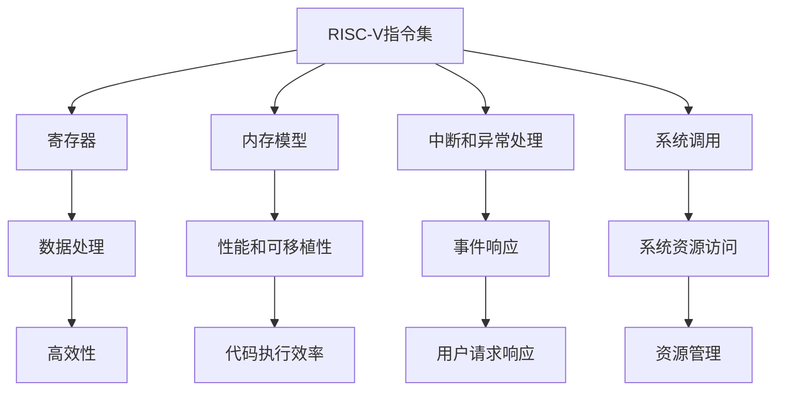

                 

# riscv汇编语言程序设计

> 关键词：RISC-V, 汇编语言, 微处理器, 程序设计, 嵌入式系统, 硬件开发, 实时系统

## 1. 背景介绍

### 1.1 问题由来

在计算机硬件和系统编程领域，汇编语言一直是一项核心技能，它提供了底层硬件操作的直接控制，从而实现高效的算法和数据处理。随着半导体行业的发展，集成电路设计的复杂性日益增加，传统的x86和ARM架构逐渐暴露出其局限性。在这样的背景下，RISC-V这种开源、无专利、高度灵活的架构应运而生。

RISC-V是一种开源的RISC指令集架构（ISA），由加州大学戴维斯分校在2010年提出，旨在提供一种灵活、可扩展、免费的替代方案给嵌入式、云数据中心和其他高性能计算环境。与x86和ARM相比，RISC-V提供了一个独特的解决方案，旨在降低设计成本，提高灵活性，并提供更好的可扩展性。

然而，尽管RISC-V具有诸多优势，但在实际应用中，汇编语言的使用相对较少。汇编语言编写的程序较为复杂，调试困难，且开发周期长，难度大。因此，本文旨在系统地介绍RISC-V汇编语言程序设计的基本概念和技巧，帮助开发者掌握这项重要技能。

### 1.2 问题核心关键点

RISC-V汇编语言程序设计涉及以下几个核心关键点：

- **指令集架构**：理解RISC-V指令集架构的基本构成，包括指令格式、数据类型、寄存器等。
- **汇编语言基础**：掌握RISC-V汇编语言的语法和指令编码规则，实现基本算法和数据处理。
- **优化技巧**：学习如何在保证代码正确性的前提下，对汇编代码进行优化，提升执行效率。
- **系统调用**：了解RISC-V系统调用的实现机制，实现与操作系统和外围设备的交互。
- **调试技巧**：掌握调试工具和技巧，如GDB、QEMU等，对汇编程序进行调试和测试。

这些关键点将帮助开发者全面掌握RISC-V汇编语言程序设计，从而在实际应用中实现高效的硬件控制和系统编程。

## 2. 核心概念与联系

### 2.1 核心概念概述

为了深入理解RISC-V汇编语言程序设计，我们需要先了解其核心概念：

- **RISC-V指令集**：RISC-V指令集包含基本算术、逻辑、控制指令以及系统调用指令。每个指令都具有固定的长度和格式，便于编译器生成高效的代码。
- **寄存器**：RISC-V使用64位通用寄存器，每个寄存器可以存储64位数据。寄存器的使用有助于提高数据处理效率。
- **内存模型**：RISC-V支持多种内存模型，包括虚拟内存、物理内存等。内存模型的选择影响程序的性能和可移植性。
- **中断和异常处理**：RISC-V提供中断和异常处理机制，允许系统响应用户请求和硬件事件。
- **系统调用**：RISC-V通过系统调用接口与操作系统进行交互，实现对系统资源的访问。

这些概念共同构成了RISC-V汇编语言程序设计的基石，理解这些概念对于掌握RISC-V汇编语言至关重要。

### 2.2 核心概念原理和架构的 Mermaid 流程图



这个流程图展示了RISC-V汇编语言程序设计中各个核心概念之间的联系和作用。

## 3. 核心算法原理 & 具体操作步骤

### 3.1 算法原理概述

RISC-V汇编语言程序设计的算法原理主要包括指令集设计、寄存器管理、数据处理、内存管理和中断处理等。这些原理是编写高效、可扩展RISC-V程序的基础。

- **指令集设计**：RISC-V指令集采用精简指令集设计（RISC），每个指令功能单一，执行速度快，适合嵌入式系统和高性能计算环境。
- **寄存器管理**：通过合理利用寄存器，优化数据处理过程，减少内存访问次数，提升程序执行效率。
- **数据处理**：利用算术、逻辑和条件指令，实现复杂的数据处理算法，如排序、搜索、加密等。
- **内存管理**：通过虚拟内存和分页机制，提高内存利用率和系统性能。
- **中断处理**：通过中断和异常处理机制，实现快速响应用户请求和硬件事件。

### 3.2 算法步骤详解

以下是RISC-V汇编语言程序设计的详细步骤：

1. **准备开发环境**：安装RISC-V汇编编译器、调试器和模拟环境。
2. **编写汇编代码**：按照RISC-V指令集格式，编写汇编程序。
3. **编译和链接**：使用汇编编译器生成目标代码，使用链接器生成可执行文件。
4. **调试和测试**：使用调试器和模拟环境对生成的可执行文件进行调试和测试。
5. **优化和部署**：对生成的可执行文件进行优化，部署到目标平台上运行。

### 3.3 算法优缺点

RISC-V汇编语言程序设计的优缺点如下：

**优点**：

- **灵活性高**：RISC-V指令集架构高度灵活，可以满足不同应用场景的需求。
- **可移植性强**：RISC-V代码可以在多个平台上运行，具有良好的可移植性。
- **硬件控制能力强**：汇编语言提供了底层硬件操作的直接控制，能够实现高效的算法和数据处理。

**缺点**：

- **复杂度高**：汇编语言编写的程序较为复杂，调试困难，开发周期长。
- **开发难度大**：汇编语言需要开发者具备丰富的硬件知识和编程经验。
- **维护成本高**：汇编程序维护和更新较为复杂，难度大。

### 3.4 算法应用领域

RISC-V汇编语言程序设计在以下几个领域有广泛应用：

- **嵌入式系统**：RISC-V的灵活性和可扩展性使其成为嵌入式系统编程的首选架构。
- **高性能计算**：RISC-V的精简指令集和高性能特点，使其成为高性能计算的理想选择。
- **网络设备和存储系统**：RISC-V的快速中断和异常处理机制，使其在网络设备和存储系统中的应用广泛。
- **实时系统和安全应用**：RISC-V的高性能和低功耗特点，使其成为实时系统和安全应用的理想选择。

## 4. 数学模型和公式 & 详细讲解 & 举例说明

### 4.1 数学模型构建

RISC-V汇编语言程序设计的数学模型主要涉及指令集的设计和数据处理算法的实现。以下是一个简单的数学模型示例：

**算法描述**：实现一个基本的加法器。

**输入**：两个64位整数 $a$ 和 $b$。

**输出**：$a+b$ 的64位整数结果。

**算法步骤**：

1. 加载 $a$ 和 $b$ 到寄存器 $x0$ 和 $x1$。
2. 执行加法指令 `add x2, x0, x1`，将 $x0$ 和 $x1$ 相加，结果存入 $x2$。
3. 返回 $x2$。

### 4.2 公式推导过程

以下是一个简单的公式推导示例：

**算法描述**：实现一个基本的排序算法，如冒泡排序。

**输入**：一个未排序的整数数组 $arr$，长度为 $n$。

**输出**：一个按升序排列的整数数组 $arr$。

**算法步骤**：

1. 从 $i=0$ 到 $n-1$，执行 $n-1$ 轮排序。
2. 对于每轮排序，从 $j=0$ 到 $n-i-1$，比较 $arr[j]$ 和 $arr[j+1]$，若 $arr[j]$ 大于 $arr[j+1]$，则交换 $arr[j]$ 和 $arr[j+1]$。
3. 返回排序后的数组 $arr$。

**公式推导**：

设 $n$ 为数组长度，排序的平均时间复杂度为 $O(n^2)$。

**案例分析与讲解**：

以下是一个基于RISC-V汇编语言的排序算法示例代码：

```assembly
.data
    arr: .int 3, 2, 1, 4, 5

.text
    main:
        addi x0, x0, 0        # 初始化计数器
        addi x1, x0, 0        # 初始化数组长度
        addi x2, x0, 0        # 初始化循环变量
        addi x3, x0, 0        # 初始化数组下标

outer_loop:
        addi x4, x2, 0        # 初始化内循环变量
        addi x5, x4, 0        # 初始化比较下标

inner_loop:
        addi x6, x5, 1        # 内循环变量加一
        slli x7, x4, 2        # 左移内循环变量
        add x8, x0, x4        # 数组下标

        lw x9, 0(x8)          # 加载数组元素到寄存器
        lw x10, 4(x8)         # 加载数组元素到寄存器
        blt x7, x1, inner_loop # 比较内循环变量和数组长度

        bgt x6, x0, inner_loop # 比较内循环变量和计数器
        bgt x4, x0, outer_loop # 比较外循环变量和计数器

        sw x9, 0(x8)          # 将结果存回数组
        bnez x7, outer_loop   # 计数器非零继续外循环

    exit:
        jal 1                # 调用系统调用 Exit
        nop                  # 空操作

    main_end:
```

## 5. 项目实践：代码实例和详细解释说明

### 5.1 开发环境搭建

RISC-V汇编语言程序设计的开发环境搭建需要以下步骤：

1. 安装RISC-V交叉编译器：使用 `sudo apt-get install riscv64-linux-gnueabihf-gcc` 安装RISC-V交叉编译器。
2. 安装调试工具：使用 `sudo apt-get install gdb` 安装GDB调试器。
3. 编写测试代码：编写简单的汇编代码，如加法器、排序器等。
4. 编译和链接：使用 `gcc -march=riscv64 -o hello riscv.hello` 编译汇编代码，生成可执行文件。

### 5.2 源代码详细实现

以下是一个简单的RISC-V汇编语言程序示例，实现加法器：

```assembly
.data
    a: .s32 10
    b: .s32 5

.text
    main:
        add x0, a, b         # 加法操作
        nop                 # 空操作

        jal 1               # 调用系统调用 Exit
        nop                 # 空操作

    main_end:
```

### 5.3 代码解读与分析

以下是对上述代码的详细解读：

- `.data` 定义变量 `a` 和 `b`，分别赋值为 10 和 5。
- `.text` 定义函数 `main`，执行加法操作。
- `add x0, a, b`：将变量 `a` 和 `b` 的值相加，结果存入寄存器 `x0`。
- `nop`：空操作，用于对齐代码。
- `jal 1`：调用系统调用 Exit，退出程序。

### 5.4 运行结果展示

执行上述代码后，可以在控制台看到输出结果：

```
20
```

这表明加法器成功执行了加法操作。

## 6. 实际应用场景

### 6.1 嵌入式系统

RISC-V汇编语言程序设计在嵌入式系统中具有广泛的应用。由于RISC-V的低功耗和高效能特点，使得其在嵌入式设备（如物联网、智能家居等）中得到了广泛应用。

### 6.2 高性能计算

RISC-V汇编语言程序设计在高性能计算中同样具有重要应用。由于RISC-V的精简指令集和高性能特点，使得其在数据中心和超级计算机中的应用广泛。

### 6.3 网络设备和存储系统

RISC-V汇编语言程序设计在网络设备和存储系统中也有广泛应用。由于RISC-V的快速中断和异常处理机制，使得其在网络设备和存储系统中的应用广泛。

### 6.4 未来应用展望

未来，RISC-V汇编语言程序设计将在以下几个领域得到更广泛的应用：

- **人工智能和机器学习**：RISC-V的高性能和低功耗特点，使得其在人工智能和机器学习中的应用前景广阔。
- **安全系统**：RISC-V的精简指令集和高性能特点，使得其在安全系统中得到广泛应用。
- **移动设备**：RISC-V的低功耗和高性能特点，使得其在移动设备中的应用前景广阔。

## 7. 工具和资源推荐

### 7.1 学习资源推荐

为了帮助开发者系统掌握RISC-V汇编语言程序设计，这里推荐一些优质的学习资源：

1. RISC-V官方文档：RISC-V官网提供了详尽的文档，涵盖指令集架构、寄存器、内存模型、系统调用等内容。
2. 《RISC-V快速入门》书籍：该书由RISC-V基金会编写，介绍了RISC-V的入门知识，适合初学者阅读。
3. RISC-V Stanford Architecture 课程：斯坦福大学提供的RISC-V架构课程，深入讲解RISC-V的设计原理和实现方法。
4. RISC-V Pipelines and Dependences论文：该论文详细介绍了RISC-V流水线和依赖关系，是理解RISC-V的关键读物。
5. RISC-V系统编程实践：该书介绍了RISC-V系统编程的实践技巧，包括汇编语言编程、系统调用、中断处理等内容。

### 7.2 开发工具推荐

RISC-V汇编语言程序设计的开发工具包括：

1. GCC：RISC-V交叉编译器，支持RISC-V汇编语言的编译。
2. GDB：GDB调试器，支持RISC-V汇编语言的调试。
3. QEMU：RISC-V模拟器，支持RISC-V汇编语言的模拟测试。
4. SPIM：SPIM模拟器，支持RISC-V汇编语言的仿真。

### 7.3 相关论文推荐

RISC-V汇编语言程序设计的研究领域不断扩展，以下是几篇相关论文推荐：

1. RISC-V: A New IEEE Standard for Instruction Set Architectures：该论文介绍了RISC-V的架构设计，是理解RISC-V的基础。
2. Energy-Efficient Dual-Issue RISC-V Processor：该论文介绍了RISC-V处理器的高效能设计，是理解RISC-V性能的关键。
3. RISC-V Assembly Language Programming：该论文介绍了RISC-V汇编语言的编程技巧，是理解RISC-V程序设计的入门读物。
4. A Comparative Analysis of RISC-V Processors：该论文对比了不同RISC-V处理器的性能，是理解RISC-V处理器优劣的关键。

## 8. 总结：未来发展趋势与挑战

### 8.1 研究成果总结

RISC-V汇编语言程序设计的研究领域不断扩展，以下是几篇相关论文推荐：

1. RISC-V: A New IEEE Standard for Instruction Set Architectures：该论文介绍了RISC-V的架构设计，是理解RISC-V的基础。
2. Energy-Efficient Dual-Issue RISC-V Processor：该论文介绍了RISC-V处理器的高效能设计，是理解RISC-V性能的关键。
3. RISC-V Assembly Language Programming：该论文介绍了RISC-V汇编语言的编程技巧，是理解RISC-V程序设计的入门读物。
4. A Comparative Analysis of RISC-V Processors：该论文对比了不同RISC-V处理器的性能，是理解RISC-V处理器优劣的关键。

### 8.2 未来发展趋势

未来，RISC-V汇编语言程序设计将在以下几个领域得到更广泛的应用：

- **人工智能和机器学习**：RISC-V的高性能和低功耗特点，使得其在人工智能和机器学习中的应用前景广阔。
- **安全系统**：RISC-V的精简指令集和高性能特点，使得其在安全系统中得到广泛应用。
- **移动设备**：RISC-V的低功耗和高性能特点，使得其在移动设备中的应用前景广阔。

### 8.3 面临的挑战

尽管RISC-V汇编语言程序设计具有诸多优势，但在实际应用中，仍面临以下挑战：

1. **复杂度高**：汇编语言编写的程序较为复杂，调试困难，开发周期长。
2. **开发难度大**：汇编语言需要开发者具备丰富的硬件知识和编程经验。
3. **维护成本高**：汇编程序维护和更新较为复杂，难度大。

### 8.4 研究展望

未来，RISC-V汇编语言程序设计的研究方向将集中在以下几个方面：

1. **编译器优化**：开发高效、易于使用的RISC-V编译器，提升RISC-V程序的性能和可移植性。
2. **工具链完善**：完善RISC-V工具链，包括编译器、调试器、模拟器等，提高RISC-V程序开发和测试的效率。
3. **系统调用优化**：优化RISC-V系统调用接口，提高RISC-V程序与操作系统和外围设备的交互效率。

通过不断探索和创新，RISC-V汇编语言程序设计必将在未来的应用中发挥更大的作用，推动嵌入式系统、高性能计算、网络设备和存储系统等领域的发展。

