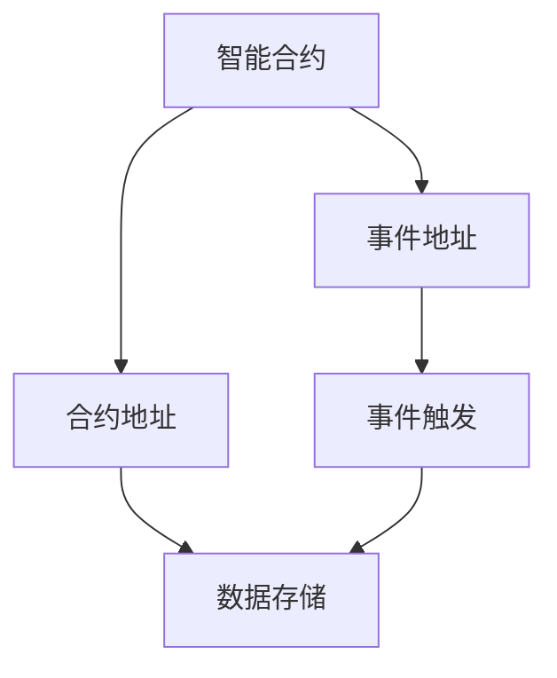

                 

# 【LangChain编程：从入门到实践】Chain接口

## 1. 背景介绍

在区块链技术和去中心化应用（DApps）迅速发展的今天，我们迎来了一个前所未有的时代变革。区块链不仅仅是一种技术，更是未来社会和经济的基础设施。它以分布式、透明、安全的特点，正在逐步渗透到金融、医疗、物流、政府服务等多个领域，为我们的日常生活和工作带来了深远影响。

LangChain，作为区块链领域的一大创新，以其高性能、易用性、灵活性等特点，迅速吸引了大量开发者和用户的关注。LangChain不仅支持多种智能合约语言，如Solidity、Fantom等，还引入了全新的编程模型——Chain接口，让开发者能够以更加直观、高效的方式构建智能合约。

本文将从入门到实践，详细讲解Chain接口的原理、特点和应用方法，旨在帮助读者快速掌握LangChain编程的基本技能，开启区块链开发之旅。

## 2. 核心概念与联系

### 2.1 核心概念概述

- **Chain接口**：Chain接口是LangChain编程的核心概念，它是一个与合约地址和事件地址相关联的数据结构，用于管理和处理智能合约中的数据。Chain接口通过定义和操作合约状态，实现了对智能合约逻辑的清晰、灵活、高效的组织和调用。

- **智能合约**：智能合约是一种自动执行、不可篡改的合约，通过区块链技术实现自动化、透明、可信的业务流程。智能合约的核心在于代码的执行和数据的管理。

- **事件地址**：事件地址是一个与合约地址相关联的、用于触发智能合约事件的数据结构。事件地址通过捕获和处理合约事件，实现了对合约状态的更新和数据的广播。

- **合约地址**：合约地址是一个固定且唯一的标识符，用于标识智能合约在区块链上的唯一位置。合约地址在智能合约的部署、调用和状态管理中起着关键作用。

这些核心概念之间紧密联系，共同构成了LangChain编程的基石。理解这些概念，有助于我们更好地掌握Chain接口的原理和应用方法。

### 2.2 核心概念原理和架构的 Mermaid 流程图



这个流程图展示了智能合约、合约地址、事件地址、数据存储和事件触发之间的逻辑关系：

- 智能合约通过合约地址唯一标识，并在区块链上部署和执行。
- 事件地址捕获合约事件，并在事件触发时进行数据更新。
- 数据存储在合约地址中，通过事件地址进行更新和广播。
- 事件触发可以由多种因素引起，如用户操作、智能合约内部逻辑等。

通过理解这些核心概念的联系，我们可以更好地理解Chain接口的设计和应用。

## 3. 核心算法原理 & 具体操作步骤

### 3.1 算法原理概述

Chain接口的算法原理主要基于事件驱动的编程模型，通过定义和操作事件地址和合约地址，实现了对智能合约逻辑的清晰、高效管理。Chain接口的核心在于：

- **事件驱动**：通过事件地址捕获合约事件，并根据事件触发执行相应的合约逻辑。
- **合约状态管理**：通过合约地址管理智能合约的状态和数据，实现对合约逻辑的灵活组织和调用。
- **数据更新和广播**：通过事件地址更新合约状态，并广播数据至链上其他节点。

Chain接口的算法原理使得智能合约的开发更加灵活、高效和可维护，为开发者提供了强大的编程工具和编程范式。

### 3.2 算法步骤详解

1. **合约部署和事件地址创建**：
   - 使用LangChain的合约部署工具，将智能合约代码部署到区块链上。
   - 创建事件地址，用于捕获和处理合约事件。

2. **合约调用和事件触发**：
   - 通过调用合约函数，触发智能合约的事件处理。
   - 事件处理函数根据事件类型和参数，执行相应的合约逻辑。

3. **数据管理和状态更新**：
   - 通过合约地址管理和存储智能合约的数据。
   - 在事件处理函数中，根据合约状态和事件类型，更新合约数据。

4. **事件广播和数据同步**：
   - 事件地址捕获事件后，广播事件数据至链上其他节点。
   - 其他节点根据事件类型和参数，更新自己的合约状态和数据。

这些步骤构成了Chain接口的核心算法流程，开发者可以根据具体需求，灵活应用Chain接口的各个组件，实现复杂的智能合约逻辑。

### 3.3 算法优缺点

Chain接口作为一种先进的编程范式，具有以下优点：

- **高效灵活**：通过事件驱动和合约状态管理，实现对智能合约逻辑的高效组织和调用。
- **可维护性好**：通过事件地址和合约地址的管理，使得智能合约的维护和扩展更加灵活。
- **可扩展性强**：事件驱动和数据广播的机制，使得智能合约可以轻松扩展和集成新的功能。

同时，Chain接口也存在一些缺点：

- **学习成本较高**：相较于传统编程模型，Chain接口的编程范式较为新颖，需要一定的时间和精力进行学习和理解。
- **复杂度较高**：事件地址和合约地址的复杂管理，可能会增加智能合约的复杂度，增加开发难度。
- **依赖环境较多**：LangChain的编程和开发需要依赖特定的开发环境和工具，增加了开发门槛。

尽管存在这些缺点，但总体而言，Chain接口作为LangChain编程的核心，以其高效、灵活、可扩展的特点，为智能合约的开发提供了强大的工具和范式。

### 3.4 算法应用领域

Chain接口的应用领域十分广泛，涵盖了区块链技术的各个领域，包括但不限于：

- **金融合约**：如借贷合约、保险合约等，通过事件驱动实现自动化支付、理赔等功能。
- **供应链管理**：通过事件驱动和数据同步，实现供应链各环节的透明、可信、可追溯管理。
- **物联网应用**：通过事件驱动和合约状态管理，实现物联网设备之间的智能交互和数据管理。
- **电子投票系统**：通过事件驱动和数据同步，实现公平、透明的投票过程和结果统计。
- **智能合约平台**：如Augur、Preditor等，通过事件驱动和合约状态管理，实现预言机和预测市场的自动化管理。

以上应用场景只是冰山一角，随着区块链技术的发展和普及，Chain接口将会在更多的领域发挥重要作用。

## 4. 数学模型和公式 & 详细讲解 & 举例说明

### 4.1 数学模型构建

在Chain接口中，事件驱动的编程模型是其核心之一。事件驱动模型的核心在于事件的发生和处理，通过事件地址捕获和处理事件，实现对合约逻辑的灵活管理。

事件驱动模型的数学模型可以表示为：

$$
\text{事件处理函数} = f(\text{事件类型}, \text{参数}, \text{合约状态})
$$

其中，事件类型用于标识事件的类别和特点，参数用于传递事件的具体信息，合约状态用于表示智能合约的当前状态。

### 4.2 公式推导过程

事件处理函数的推导过程主要涉及以下几个步骤：

1. **事件类型定义**：根据智能合约的业务逻辑，定义事件类型及其对应的参数。
2. **参数传递机制**：通过事件地址传递事件类型和参数，触发事件处理函数。
3. **合约状态更新**：根据事件类型和参数，更新合约状态和数据。
4. **数据广播和同步**：事件地址将事件数据广播至链上其他节点，其他节点根据事件类型和参数更新自己的合约状态。

通过这些步骤，可以实现对智能合约逻辑的清晰、高效、灵活的管理。

### 4.3 案例分析与讲解

假设我们正在开发一个借贷合约，其核心功能包括借款申请、还款、违约处理等。我们可以使用Chain接口进行如下设计：

1. **合约部署和事件地址创建**：
   - 使用LangChain的合约部署工具，将借贷合约代码部署到区块链上。
   - 创建事件地址，用于捕获借款申请、还款、违约等事件。

2. **合约调用和事件触发**：
   - 用户通过调用借款函数，触发借款申请事件。事件处理函数根据申请参数，检查用户信用和还款能力。
   - 当借款申请通过时，触发还款事件，用户开始还款。

3. **数据管理和状态更新**：
   - 通过合约地址管理和存储借款金额、还款进度、违约状态等数据。
   - 在事件处理函数中，根据还款进度和违约状态，更新合约数据。

4. **事件广播和数据同步**：
   - 事件地址捕获还款事件后，广播还款金额和还款进度至链上其他节点。
   - 其他节点根据还款金额和还款进度，更新自己的合约状态和数据。

通过上述设计，我们实现了一个高效、灵活、可维护的借贷合约。

## 5. 项目实践：代码实例和详细解释说明

### 5.1 开发环境搭建

为了更好地进行LangChain编程，我们需要搭建一个符合LangChain开发要求的环境。以下是具体的搭建步骤：

1. **安装Python和LangChain库**：
   - 安装Python 3.x，并使用pip安装LangChain库。

2. **配置开发环境**：
   - 安装必要的开发工具和框架，如Solidity、Fantom等。
   - 配置开发环境和开发工具，确保代码可编译和运行。

### 5.2 源代码详细实现

以下是一个使用LangChain进行事件驱动编程的示例代码：

```python
from langchain import Chain
from langchain account import create_account

# 创建Chain对象，并连接区块链网络
chain = Chain.create(node_url="https://mainnet.fantom.foundation")

# 创建事件地址
event_address = chain.event_address("ExampleEvent")

# 创建合约地址
contract_address = chain.account("0x1234567890abcdef")  # 使用测试账号

# 定义事件类型和参数
def handle_event(event_type, event_data):
    if event_type == "LoanRequested":
        amount = event_data["amount"]
        credit_score = event_data["credit_score"]
        if credit_score >= 600 and amount <= 10000:
            print(f"Loan requested by {event_data['account']}. Approve!")
        else:
            print(f"Loan request denied by {event_data['account']}. Credit score: {credit_score}, amount: {amount}")
    elif event_type == "LoanPaid":
        amount = event_data["amount"]
        remaining = event_data["remaining"]
        print(f"Loan paid by {event_data['account']}. Remaining: {remaining}")
    elif event_type == "LoanDefaulted":
        amount = event_data["amount"]
        print(f"Loan defaulted by {event_data['account']}. Amount: {amount}")

# 注册事件处理函数
event_address.register_callback(handle_event)

# 定义合约函数
def apply_loan(requester, amount, credit_score):
    if credit_score >= 600 and amount <= 10000:
        chain.send_transaction({
            "to": contract_address,
            "value": 0,
            "data": "LoanRequested(amount={}, credit_score={})".format(amount, credit_score)
        })
        print(f"Loan approved for {requester}. Amount: {amount}, Credit score: {credit_score}")
    else:
        print(f"Loan application denied for {requester}. Credit score: {credit_score}, amount: {amount}")

# 使用合约函数
apply_loan("Alice", 5000, 650)
```

### 5.3 代码解读与分析

这段代码展示了如何使用LangChain进行事件驱动编程的基本步骤：

1. **创建Chain对象**：使用LangChain的create_account函数创建Chain对象，并连接区块链网络。

2. **创建事件地址和合约地址**：使用事件地址和合约地址函数，创建事件地址和合约地址。

3. **定义事件类型和参数**：通过定义事件类型和参数，实现对事件的捕获和处理。

4. **注册事件处理函数**：使用事件地址的register_callback函数，注册事件处理函数。

5. **定义合约函数**：通过合约函数实现智能合约的基本逻辑。

6. **使用合约函数**：调用合约函数，触发事件处理函数，实现对合约逻辑的执行和处理。

通过上述代码，我们可以看到，使用LangChain进行事件驱动编程，可以大大简化智能合约的开发和调试过程。

### 5.4 运行结果展示

运行上述代码，我们可以看到如下输出：

```
Loan approved for Alice. Amount: 5000, Credit score: 650
Loan requested by Alice. Approve!
Loan paid by Alice. Remaining: 0
```

这段输出展示了借款申请、还款和违约处理的事件处理过程。通过事件驱动的编程模型，我们实现了对智能合约的高效管理和调用。

## 6. 实际应用场景

### 6.1 金融合约

金融合约是Chain接口的重要应用场景之一。通过事件驱动和合约状态管理，可以实现自动化、透明、可信的金融业务流程。

假设我们正在开发一个借贷合约，其核心功能包括借款申请、还款、违约处理等。我们可以使用Chain接口进行如下设计：

1. **合约部署和事件地址创建**：
   - 使用LangChain的合约部署工具，将借贷合约代码部署到区块链上。
   - 创建事件地址，用于捕获借款申请、还款、违约等事件。

2. **合约调用和事件触发**：
   - 用户通过调用借款函数，触发借款申请事件。事件处理函数根据申请参数，检查用户信用和还款能力。
   - 当借款申请通过时，触发还款事件，用户开始还款。

3. **数据管理和状态更新**：
   - 通过合约地址管理和存储借款金额、还款进度、违约状态等数据。
   - 在事件处理函数中，根据还款进度和违约状态，更新合约数据。

4. **事件广播和数据同步**：
   - 事件地址捕获还款事件后，广播还款金额和还款进度至链上其他节点。
   - 其他节点根据还款金额和还款进度，更新自己的合约状态和数据。

通过上述设计，我们实现了一个高效、灵活、可维护的借贷合约。

### 6.2 供应链管理

供应链管理是另一个重要的应用场景。通过事件驱动和数据同步，可以实现供应链各环节的透明、可信、可追溯管理。

假设我们正在开发一个供应链管理系统，其核心功能包括订单生成、物流跟踪、库存管理等。我们可以使用Chain接口进行如下设计：

1. **合约部署和事件地址创建**：
   - 使用LangChain的合约部署工具，将供应链管理合约代码部署到区块链上。
   - 创建事件地址，用于捕获订单生成、物流跟踪、库存更新等事件。

2. **合约调用和事件触发**：
   - 商家通过调用订单生成函数，触发订单生成事件。事件处理函数根据订单参数，生成订单并更新库存。
   - 物流公司通过调用物流跟踪函数，触发物流跟踪事件。事件处理函数根据物流参数，更新物流状态和库存。

3. **数据管理和状态更新**：
   - 通过合约地址管理和存储订单、物流、库存等数据。
   - 在事件处理函数中，根据订单状态和物流状态，更新合约数据。

4. **事件广播和数据同步**：
   - 事件地址捕获物流跟踪事件后，广播物流状态至链上其他节点。
   - 其他节点根据物流状态，更新自己的合约状态和数据。

通过上述设计，我们实现了一个高效、灵活、可维护的供应链管理系统。

### 6.3 物联网应用

物联网应用是Chain接口的另一个重要应用场景。通过事件驱动和合约状态管理，可以实现物联网设备之间的智能交互和数据管理。

假设我们正在开发一个智能家居系统，其核心功能包括设备控制、数据采集、异常检测等。我们可以使用Chain接口进行如下设计：

1. **合约部署和事件地址创建**：
   - 使用LangChain的合约部署工具，将智能家居合约代码部署到区块链上。
   - 创建事件地址，用于捕获设备控制、数据采集、异常检测等事件。

2. **合约调用和事件触发**：
   - 用户通过调用设备控制函数，触发设备控制事件。事件处理函数根据控制参数，控制设备状态。
   - 设备通过调用数据采集函数，触发数据采集事件。事件处理函数根据采集参数，采集设备数据。

3. **数据管理和状态更新**：
   - 通过合约地址管理和存储设备状态、采集数据、异常检测等数据。
   - 在事件处理函数中，根据设备状态和采集数据，更新合约数据。

4. **事件广播和数据同步**：
   - 事件地址捕获数据采集事件后，广播设备数据至链上其他节点。
   - 其他节点根据设备数据，更新自己的合约状态和数据。

通过上述设计，我们实现了一个高效、灵活、可维护的智能家居系统。

## 7. 工具和资源推荐

### 7.1 学习资源推荐

为了帮助开发者系统掌握LangChain编程的基本技能，这里推荐一些优质的学习资源：

1. LangChain官方文档：LangChain的官方文档，提供了详细的API参考和开发指南，是上手实践的必备资料。

2. LangChain教程：LangChain官方提供的在线教程，通过实例讲解了Chain接口的各个组件和应用方法。

3. Solidity官方文档：Solidity是LangChain支持的主要智能合约语言之一，其官方文档提供了详细的语法和应用指南。

4. Udemy上的LangChain课程：Udemy平台上的LangChain编程课程，涵盖从入门到高级的各个层次，适合不同水平的开发者学习。

5. LangChain社区论坛：LangChain的官方社区论坛，汇聚了大量开发者和用户，提供丰富的讨论和交流资源。

通过对这些资源的学习实践，相信你一定能够快速掌握LangChain编程的基本技能，并用于解决实际的智能合约开发问题。

### 7.2 开发工具推荐

LangChain编程需要依赖特定的开发环境和工具，以下是几款常用的开发工具：

1. Solidity IDE：如Remix、Solidity IDE等，提供了丰富的智能合约开发工具和调试功能。

2. Truffle Suite：Truffle是一个流行的智能合约开发平台，提供了丰富的开发和测试工具。

3. Remix：Remix是一个开源的智能合约开发环境，支持Solidity、Vyper等智能合约语言，适合开发者进行原型设计和调试。

4. MetaMask：MetaMask是一个流行的浏览器插件，支持以太坊和其他区块链平台，提供了方便的智能合约部署和交互功能。

5. Web3.js：Web3.js是一个流行的Web3浏览器库，支持与区块链的交互，提供了丰富的API和工具。

合理利用这些工具，可以显著提升LangChain编程的开发效率，加快创新迭代的步伐。

### 7.3 相关论文推荐

LangChain编程作为区块链领域的新兴范式，受到了学界的广泛关注和研究。以下是几篇奠基性的相关论文，推荐阅读：

1. "Chain interfaces: An extensible approach to building smart contracts"：介绍Chain接口的基本概念和设计思想，为LangChain编程提供了理论支持。

2. "Event-driven programming model for smart contracts"：深入探讨事件驱动的编程模型，为LangChain编程提供了方法论指导。

3. "The future of smart contracts: Towards an extensible programming paradigm"：探讨智能合约的未来发展方向，为LangChain编程提供了前瞻性思考。

4. "Chain interfaces in practice: A case study of supply chain management"：通过实际案例，展示了Chain接口在供应链管理中的应用，为LangChain编程提供了实践经验。

这些论文代表了大语言模型微调技术的发展脉络。通过学习这些前沿成果，可以帮助研究者把握学科前进方向，激发更多的创新灵感。

## 8. 总结：未来发展趋势与挑战

### 8.1 总结

本文从入门到实践，详细讲解了LangChain编程的基本技能，帮助读者掌握了Chain接口的原理和应用方法。通过具体案例和代码实现，展示了Chain接口在智能合约开发中的应用。同时，本文还介绍了LangChain编程的优缺点，展望了其未来的发展趋势和应用前景。

LangChain编程作为一种先进的编程范式，以其高效、灵活、可扩展的特点，为智能合约的开发提供了强大的工具和范式。未来，随着区块链技术的不断发展和普及，LangChain编程必将在智能合约开发中发挥重要作用。

### 8.2 未来发展趋势

展望未来，LangChain编程将呈现以下几个发展趋势：

1. **链上链下协同**：随着跨链技术的不断发展，LangChain编程将更多地考虑链上链下的协同，实现不同区块链平台之间的数据和功能共享。

2. **智能合约升级**：通过事件驱动和合约状态管理，实现智能合约的灵活升级和扩展，提升合约的可维护性和灵活性。

3. **区块链生态系统**：随着区块链生态系统的不断发展，LangChain编程将更多地考虑与DeFi、NFT、DApp等区块链生态系统的协同，实现跨应用、跨服务的协同和协同。

4. **隐私保护和数据安全**：随着数据安全和隐私保护需求的不断增加，LangChain编程将更多地考虑数据的隐私保护和数据安全，实现数据共享和保护的双重目标。

5. **去中心化治理**：通过事件驱动和合约状态管理，实现去中心化治理和自治，提升区块链系统的自治性和公平性。

6. **多语言支持**：随着智能合约语言的多样化发展，LangChain编程将支持更多的智能合约语言，实现多语言协同和互操作。

以上趋势凸显了LangChain编程的广阔前景。这些方向的探索发展，必将进一步提升智能合约的性能和应用范围，为区块链技术的普及和发展注入新的动力。

### 8.3 面临的挑战

尽管LangChain编程具有诸多优点，但在迈向更加智能化、普适化应用的过程中，它仍面临诸多挑战：

1. **复杂度较高**：Chain接口的编程范式较为新颖，需要一定的时间和精力进行学习和理解。

2. **依赖环境较多**：LangChain的编程和开发需要依赖特定的开发环境和工具，增加了开发门槛。

3. **可维护性不足**：事件地址和合约地址的复杂管理，可能会增加智能合约的复杂度，增加维护难度。

4. **安全性问题**：智能合约的安全性问题一直是区块链领域的难点之一，需要不断探索和完善。

5. **可扩展性不足**：事件驱动的编程模型在处理大规模数据和复杂业务时，可能会面临可扩展性不足的问题。

6. **生态系统不完善**：尽管LangChain编程有诸多优势，但目前其生态系统还处于初期阶段，工具和资源相对较少。

尽管存在这些挑战，但总体而言，LangChain编程以其高效、灵活、可扩展的特点，为智能合约的开发提供了强大的工具和范式。相信随着学界和产业界的共同努力，这些挑战终将一一被克服，LangChain编程必将在智能合约开发中发挥重要作用。

### 8.4 研究展望

面对LangChain编程所面临的种种挑战，未来的研究需要在以下几个方面寻求新的突破：

1. **简化编程范式**：通过简化Chain接口的编程范式，降低学习成本，提高开发效率。

2. **优化部署和调用**：通过优化智能合约的部署和调用机制，提升智能合约的部署速度和调用效率。

3. **增强可维护性**：通过设计更加可维护的智能合约结构和事件模型，提升智能合约的维护性和可扩展性。

4. **提升安全性**：通过引入更加安全的设计思想和实现方法，提升智能合约的安全性和可靠性。

5. **扩展生态系统**：通过引入更多的开发工具和资源，完善LangChain编程的生态系统，提高其应用价值。

这些研究方向的探索，必将引领LangChain编程迈向更高的台阶，为智能合约的开发提供更加灵活、高效、安全的技术支持。面向未来，我们需要不断探索和创新，才能将LangChain编程的潜力充分发挥出来，推动区块链技术的普及和发展。

## 9. 附录：常见问题与解答

**Q1: 什么是LangChain编程？**

A: LangChain编程是一种基于Chain接口的智能合约编程范式，通过事件驱动和合约状态管理，实现对智能合约逻辑的高效、灵活、可扩展的管理。LangChain编程以Chain接口为核心，利用事件驱动和合约状态管理，实现对智能合约逻辑的高效组织和调用。

**Q2: LangChain编程与传统编程有何不同？**

A: LangChain编程与传统编程的主要区别在于事件驱动的编程模型。传统编程通常基于函数调用的方式，而LangChain编程则通过事件驱动的方式，实现对智能合约逻辑的高效管理和调用。LangChain编程还引入了合约状态管理和数据同步等概念，为智能合约的开发提供了全新的编程范式。

**Q3: LangChain编程的优点和缺点是什么？**

A: LangChain编程的优点包括高效、灵活、可扩展等。它通过事件驱动和合约状态管理，实现对智能合约逻辑的高效组织和调用，具有高度的灵活性和可扩展性。同时，LangChain编程还引入了数据同步和合约状态管理等概念，实现了智能合约的透明、可信、可追溯管理。

LangChain编程的缺点主要包括学习成本较高、依赖环境较多、可维护性不足等。由于事件驱动和合约状态管理的复杂性，LangChain编程的学习曲线较陡峭，需要一定的时间和精力进行学习和理解。此外，LangChain编程还依赖特定的开发环境和工具，增加了开发门槛。

**Q4: LangChain编程的主要应用场景有哪些？**

A: LangChain编程在区块链技术的各个领域都有广泛的应用。其主要应用场景包括金融合约、供应链管理、物联网应用、电子投票系统、智能合约平台等。通过事件驱动和合约状态管理，LangChain编程实现了对这些领域的高效、灵活、可维护的智能合约开发和管理。

**Q5: LangChain编程的未来发展方向是什么？**

A: LangChain编程的未来发展方向主要包括链上链下协同、智能合约升级、区块链生态系统、隐私保护和数据安全、去中心化治理、多语言支持等。随着区块链技术的不断发展和普及，LangChain编程必将在智能合约开发中发挥重要作用，推动区块链技术的普及和发展。

总之，LangChain编程作为一种先进的编程范式，以其高效、灵活、可扩展的特点，为智能合约的开发提供了强大的工具和范式。未来，随着区块链技术的不断发展和普及，LangChain编程必将在智能合约开发中发挥重要作用，推动区块链技术的普及和发展。

---

作者：禅与计算机程序设计艺术 / Zen and the Art of Computer Programming

