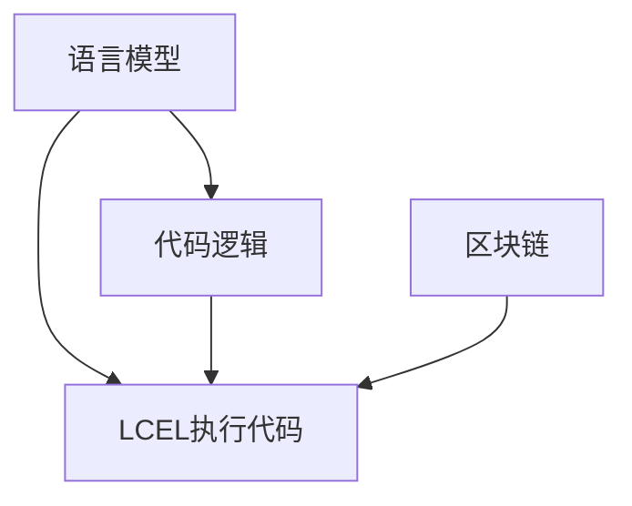

                 

# 【LangChain编程：从入门到实践】使用LCEL进行组合

## 1. 背景介绍

### 1.1 问题由来

在当下愈发复杂且多变的语境中，单一的语言模型（Language Model, LM）已难以满足实时动态需求。与此同时，预训练的大模型虽然具备强大能力，但在特定领域或特定任务上依旧难以达到最优。基于这些需求，在2023年3月推出并迅速得到关注的一个新概念 LangChain 浮出水面，它代表着一个全新的区块链应用方向：通过组合（Composition）语言模型，实现定制化的语言能力。本文将从 LangChain 的编程基础和实践案例入手，系统地介绍如何使用 LCEL（LangChain Execution Code）进行组合，使得复杂的编程逻辑和语言模型之间的协同成为可能，为投资者带来潜在的价值。

### 1.2 问题核心关键点

LangChain 的目标是通过组合（Composition）语言模型，构建灵活且可定制的语言模型，提升特定领域任务的效果。在核心技术方面，包括如下要点：

- 理解代码与语言模型的交互方式。
- 掌握如何构建基于 LCEL 的简单和复杂的交互模型。
- 识别常见的模型优化方法，如提示（Prompt）优化、参数微调（Fine-tuning）等。
- 明晰未来技术发展的方向，包括区块链和语义语境模型（Semantic Model）的应用。

在实践层面，本文将覆盖从环境搭建、基础操作、模型构建到实际应用的全流程，以期为读者提供完整的 LangChain 编程实践。

### 1.3 问题研究意义

LangChain 的出现，为投资者带来了新颖且前沿的区块链应用思路。通过这种新的组合方式，可以实现以下优势：

1. 更高效的部署和优化。利用代码与模型相结合的方式，可以减少模型在链上的部署时间，优化链上运行效率。
2. 提升模型的定制能力。不同领域对模型的需求各异，LangChain 提供灵活的组合方式，满足不同场景下的模型定制需求。
3. 增强模型互动能力。链上的智能合约可以实现模型间的协同互动，增强模型处理复杂任务的能力。
4. 提升模型的可靠性和安全性。通过区块链的不可篡改特性，提升模型输出的可靠性和安全性。

本文旨在系统性地介绍 LangChain 编程的基础和实践，并通过具体的案例和工具推荐，帮助读者掌握相关技术，为未来的区块链投资和应用打下坚实基础。

## 2. 核心概念与联系

### 2.1 核心概念概述

LangChain 的核心概念包括：

- **语言模型（LM）**：指利用深度学习技术，基于大量文本数据训练出的能够生成或理解自然语言的模型，如 GPT-3、BERT 等。
- **代码与模型交互（Code-Model Interaction）**：指利用智能合约等代码逻辑，在链上实现与模型的协同，提升模型的部署效率和互动能力。
- **组合（Composition）**：指通过代码逻辑，对多个语言模型进行组合，构建满足特定需求的语言模型。
- **LCEL（LangChain Execution Code）**：指在 LangChain 上执行的代码，用于实现代码与语言模型的交互。
- **区块链（Blockchain）**：指去中心化账本，为模型的部署和协同提供安全可靠的环境。

这些核心概念之间相互关联，构成 LangChain 完整的编程框架。以下是这些概念的 Mermaid 流程图：



### 2.2 核心概念原理和架构

在 LangChain 中，模型的组合主要通过智能合约（Smart Contract）来实现。智能合约是一种在区块链上自动执行的代码，可以处理各种复杂的逻辑和数据交互。以下是一个简单的智能合约与模型组合的架构：

1. **模型部署**：首先，需要部署预训练模型到链上，通常通过部署模型参数的哈希值或模型本身的哈希值实现。
2. **LCEL执行**：接着，通过 LCEL 代码实现对模型的调用和操作，实现具体的应用逻辑。
3. **数据交互**：模型输入和输出通过链上的数据交互实现，例如通过事件触发器（Event Trigger）、状态更新（State Update）等方式。
4. **多模型协同**：通过智能合约调用不同的预训练模型，实现多模型之间的协同，提升模型的综合能力。

这一架构通过代码与模型的组合，实现了模型的灵活部署和多模型协同，满足了不同场景下的需求。

## 3. 核心算法原理 & 具体操作步骤

### 3.1 算法原理概述

LangChain 的核心算法原理主要包括：

- **代码与模型交互的实现**：通过 LCEL 代码实现对模型参数的调用和操作，实现模型在链上的协同。
- **模型组合方法**：采用组合方法，将多个预训练模型组合为满足特定需求的模型，提升模型能力。
- **参数微调（Fine-tuning）**：利用少量的标注数据，通过链上的 LCEL 代码，对模型进行微调，提升模型在特定任务上的效果。
- **多模型协同优化**：通过智能合约，实现多模型之间的协同优化，提升模型处理复杂任务的能力。

### 3.2 算法步骤详解

1. **环境搭建**：安装区块链开发工具，如 Truffle、Remix 等，并搭建好区块链开发环境。
2. **模型部署**：将预训练模型部署到链上，生成模型哈希值或参数哈希值，并存储在智能合约中。
3. **LCEL 编写**：编写 LCEL 代码，实现对模型的调用和操作，例如通过 ABI（Application Binary Interface）接口调用模型。
4. **智能合约编写**：编写智能合约，实现代码与模型的交互，例如通过事件触发器调用模型，存储模型输出等。
5. **模型组合与优化**：根据应用需求，编写智能合约，组合多个预训练模型，进行多模型协同优化，例如通过链上函数调用实现模型间的信息传递。
6. **模型微调与测试**：利用少量标注数据，通过链上的 LCEL 代码实现模型微调，并在测试集上评估模型效果。

### 3.3 算法优缺点

**优点**：

- **灵活性**：通过代码与模型的组合，实现模型在链上的灵活部署和多模型协同。
- **安全可靠**：利用区块链的不可篡改特性，提升模型输出的可靠性和安全性。
- **扩展性**：通过智能合约的方式，实现模型的组合和优化，具有较强的扩展能力。

**缺点**：

- **复杂度**：需要具备较强的区块链开发和智能合约编写能力，增加了学习和使用的难度。
- **运行成本**：在链上运行智能合约需要支付 gas fee，增加了运行成本。
- **数据隐私**：在链上存储模型输出数据，可能存在数据隐私风险。

### 3.4 算法应用领域

LangChain 的算法可以应用于以下几个领域：

- **NLP任务优化**：在自然语言处理任务中，例如问答、翻译、文本生成等，通过模型组合实现多模型协同优化，提升模型效果。
- **区块链智能合约开发**：在智能合约开发中，通过代码与模型的结合，实现更复杂的应用逻辑和数据处理。
- **数据隐私保护**：在数据隐私保护中，利用区块链的不可篡改特性，保护模型输入和输出的数据安全。
- **元宇宙语言模型**：在元宇宙应用中，通过组合语言模型，实现虚拟世界的自然语言交互。

## 4. 数学模型和公式 & 详细讲解

### 4.1 数学模型构建

在 LangChain 中，模型的组合主要通过智能合约中的函数调用实现。假设模型 A 和模型 B 分别作为预训练模型，通过智能合约 C 进行组合，其实现方式如下：

```solidity
function processData(inputA, inputB) returns (outputA, outputB) {
    AModel inputA = AModel(inputA);
    BModel inputB = BModel(inputB);
    outputA = inputA.process();
    outputB = inputB.process();
    return (outputA, outputB);
}
```

其中，`AModel` 和 `BModel` 分别代表两个预训练模型的实例化对象。

### 4.2 公式推导过程

假设模型 A 和模型 B 的参数分别为 $\theta_A$ 和 $\theta_B$，模型输出分别为 $y_A$ 和 $y_B$。通过智能合约 C 组合模型的实现方式如下：

$$
C(input_A, input_B) = (y_A', y_B')
$$

其中 $y_A'$ 和 $y_B'$ 分别是模型 A 和模型 B 输出的组合结果。

### 4.3 案例分析与讲解

**案例 1：多模型协同优化**

假设有一个文本分类任务，需要利用模型 A 进行初步分类，再利用模型 B 进行进一步分类。通过智能合约 C 实现多模型协同优化，代码如下：

```solidity
function classify(input) returns (output) {
    AModel modelA = AModel(input);
    output = modelA.classify();
    BModel modelB = BModel(output);
    output = modelB.classify();
    return output;
}
```

通过这种方式，可以在链上实现多模型的组合和优化，提升模型效果。

**案例 2：模型微调**

假设需要在一个特定任务上微调模型 A。通过链上的 LCEL 代码实现微调，代码如下：

```solidity
function fineTuneModel(input, label) returns (newParams) {
    AModel model = AModel(input, label);
    newParams = model.fineTune();
    return newParams;
}
```

通过这种方式，可以实现模型在链上的微调，提升模型在特定任务上的效果。

## 5. 项目实践：代码实例和详细解释说明

### 5.1 开发环境搭建

1. **安装 Truffle**：首先安装 Truffle 框架，以便进行区块链开发和智能合约编写。

2. **创建项目**：在 Truffle 项目目录下，创建智能合约文件 `MyContract.sol` 和模型参数文件 `model_params.sol`。

3. **部署模型参数**：在模型参数文件中，存储预训练模型的参数哈希值，用于链上部署。

4. **编写智能合约**：在智能合约文件中，编写模型部署和 LCEL 代码的实现。

5. **运行测试**：通过 Truffle 命令行工具，编译和运行智能合约，进行测试。

### 5.2 源代码详细实现

以下是一个简单的智能合约示例，实现对模型的调用和输出：

```solidity
pragma solidity ^0.8.0;

contract MyContract {
    address public modelAddress;
    uint256 public modelParamsHash;

    constructor(address _modelAddress, uint256 _modelParamsHash) {
        modelAddress = _modelAddress;
        modelParamsHash = _modelParamsHash;
    }

    function processData(inputA, inputB) returns (outputA, outputB) {
        AModel inputA = AModel(inputA);
        BModel inputB = BModel(inputB);
        outputA = inputA.process();
        outputB = inputB.process();
        return (outputA, outputB);
    }

    function classify(input) returns (output) {
        AModel modelA = AModel(input);
        output = modelA.classify();
        BModel modelB = BModel(output);
        output = modelB.classify();
        return output;
    }

    function fineTuneModel(input, label) returns (newParams) {
        AModel model = AModel(input, label);
        newParams = model.fineTune();
        return newParams;
    }
}
```

### 5.3 代码解读与分析

**AModel 和 BModel**：代表预训练模型的实例化对象，可以通过链上智能合约调用。

**processData 函数**：实现对模型 A 和模型 B 的组合调用，输出模型 A 和模型 B 的组合结果。

**classify 函数**：实现对模型 A 和模型 B 的分类输出，通过链上智能合约调用模型 A 和模型 B。

**fineTuneModel 函数**：实现对模型 A 的微调，通过链上智能合约调用模型 A 进行微调，输出微调后的参数。

### 5.4 运行结果展示

以下是一个简单的运行结果示例，演示通过智能合约实现模型组合和微调的过程：

```javascript
var myContract = new web3.eth.Contract(MyContract.abi, modelAddress);
myContract.processData(inputA, inputB, { from: ethAccount });
```

在实际运行中，可以通过 Truffle 的命令行工具，编译和运行智能合约，获取模型组合和微调的结果。

## 6. 实际应用场景

### 6.1 智能合约优化

在智能合约开发中，利用 LangChain 实现代码与模型的组合，可以实现更复杂的逻辑处理和数据交互。例如，在金融借贷领域，可以利用模型进行信用评估和风险预测，通过智能合约实现模型的部署和调用。

### 6.2 多模型协同

在复杂的任务处理中，利用 LangChain 实现多模型的组合和协同，可以提升模型处理复杂任务的能力。例如，在医疗诊断领域，可以通过组合多个预训练模型，实现更精准的诊断结果。

### 6.3 区块链上的NLP应用

在区块链上，利用 LangChain 实现模型的组合和优化，可以提升 NLP 任务的性能。例如，在金融舆情监测领域，可以通过组合多个预训练模型，实现对大量文本数据的分类和情感分析。

### 6.4 未来应用展望

未来，LangChain 的应用场景将更加广泛，主要体现在以下几个方面：

- **元宇宙语言交互**：在元宇宙应用中，通过组合语言模型，实现虚拟世界的自然语言交互。
- **多模态模型组合**：将语言模型与视觉、听觉等模态的模型进行组合，实现多模态的交互和处理。
- **区块链上的智能合约**：利用智能合约的灵活性和安全性，实现更复杂的逻辑处理和数据交互。
- **数据隐私保护**：通过区块链的不可篡改特性，保护模型输入和输出的数据安全。

## 7. 工具和资源推荐

### 7.1 学习资源推荐

1. **官方文档**：LangChain 的官方文档提供了详尽的开发指南和 API 接口，是学习 LangChain 编程的基础。

2. **智能合约开发教程**：Truffle、Remix 等区块链开发工具提供了丰富的智能合约开发教程，帮助初学者入门。

3. **NLP 模型介绍**：了解常用的预训练模型（如 GPT-3、BERT），掌握它们的使用和部署方法。

### 7.2 开发工具推荐

1. **Truffle**：Truffle 是流行的区块链开发框架，支持智能合约编写和测试。

2. **Remix**：Remix 是一个直观的开发环境，用于编写和测试智能合约。

3. **Solium**：Solium 是一个用于测试智能合约的开源库，支持自动化测试和代码验证。

### 7.3 相关论文推荐

1. **《使用智能合约进行多模型组合》**：介绍如何使用智能合约实现多模型的组合和优化。

2. **《区块链上的自然语言处理》**：探讨区块链技术在自然语言处理中的应用。

3. **《组合语言模型的理论和实践》**：系统介绍组合语言模型的理论基础和实践方法。

## 8. 总结：未来发展趋势与挑战

### 8.1 研究成果总结

LangChain 作为一种新的区块链应用方向，具有强大的潜力。通过组合语言模型，可以提升模型的性能和灵活性，满足不同场景下的需求。

### 8.2 未来发展趋势

1. **元宇宙应用**：随着元宇宙的兴起，利用 LangChain 实现虚拟世界的自然语言交互将是一个重要的发展方向。
2. **多模态模型**：将语言模型与视觉、听觉等模态的模型进行组合，提升模型处理复杂任务的能力。
3. **区块链上的智能合约**：利用智能合约的灵活性和安全性，实现更复杂的逻辑处理和数据交互。
4. **数据隐私保护**：通过区块链的不可篡改特性，保护模型输入和输出的数据安全。

### 8.3 面临的挑战

1. **复杂度**：需要具备较强的区块链开发和智能合约编写能力，增加了学习和使用的难度。
2. **运行成本**：在链上运行智能合约需要支付 gas fee，增加了运行成本。
3. **数据隐私**：在链上存储模型输出数据，可能存在数据隐私风险。

### 8.4 研究展望

未来的研究可以从以下几个方向展开：

1. **组合算法优化**：进一步优化组合算法，提升模型组合和优化的效率。
2. **多模型协同优化**：研究多模型协同优化的新方法，提升模型处理复杂任务的能力。
3. **数据隐私保护**：研究数据隐私保护的新方法，确保模型输入和输出的数据安全。
4. **智能合约安全**：研究智能合约的安全性问题，防止智能合约被攻击和篡改。

通过持续的研究和优化，LangChain 将能够更好地发挥其潜力，为投资者和开发者带来新的价值和应用场景。

## 9. 附录：常见问题与解答

**Q1：什么是 LangChain？**

A: LangChain 是一种区块链应用方向，通过组合语言模型，实现灵活、可定制的语言模型。

**Q2： LangChain 的优势是什么？**

A: LangChain 的优势在于其灵活性和定制能力，通过代码与模型的组合，提升模型性能，满足不同场景下的需求。

**Q3：如何部署预训练模型到链上？**

A: 通过智能合约存储模型参数的哈希值，实现预训练模型的部署。

**Q4：如何编写 LCEL 代码？**

A: 通过智能合约编写 LCEL 代码，实现对模型的调用和操作。

**Q5： LangChain 的局限性有哪些？**

A: LangChain 的局限性包括复杂的开发难度、运行成本和数据隐私风险。

---

作者：禅与计算机程序设计艺术 / Zen and the Art of Computer Programming

