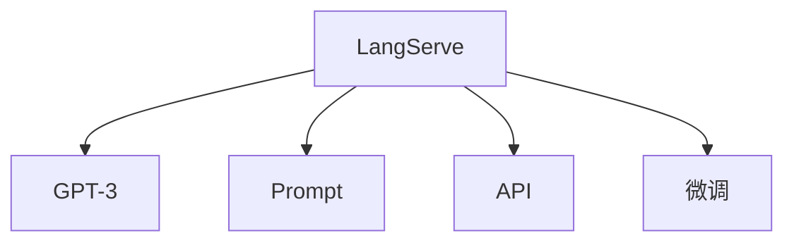

                 

## 1. 背景介绍

随着人工智能技术的不断进步，语言处理能力已经成为一个重要的研究领域。在此背景下，自然语言处理（Natural Language Processing, NLP）技术也得到了广泛的应用。在NLP领域，一个关键的技术是语言服务，它可以帮助人们解决自然语言相关的各种问题。例如，可以通过语言服务进行文本摘要、情感分析、机器翻译、语音识别等。

LangServe是一个由OpenAI开发的新型语言服务框架，它基于OpenAI的GPT-3模型，可以提供多种自然语言处理服务。本文将介绍如何使用LangServe提供服务，从入门到实践，帮助读者更好地理解和应用这一强大的语言处理工具。

## 2. 核心概念与联系

### 2.1 核心概念概述

在介绍如何使用LangServe之前，需要先了解一些核心概念。

- **LangServe**：由OpenAI开发的新型语言服务框架，基于OpenAI的GPT-3模型，可以提供多种自然语言处理服务。
- **GPT-3**：由OpenAI开发的一种大规模预训练语言模型，具备强大的自然语言理解和生成能力。
- **Prompt**：指在输入模型时，提供的特定格式的文本，用于引导模型输出特定结果。
- **API**：应用程序编程接口，允许程序通过网络访问LangServe服务。
- **微调**：指通过在特定任务上进行训练，提升模型在该任务上的性能。

这些概念之间的逻辑关系可以通过以下Mermaid流程图来展示：



这个流程图展示了大语言模型LangServe的三个核心组件，以及它们之间的关系。LangServe通过GPT-3模型进行自然语言处理，通过Prompt提供输入格式，通过API进行服务调用，并通过微调提升模型性能。

### 2.2 核心概念原理和架构

LangServe的核心架构包括以下几个关键组件：

- **GPT-3模型**：作为LangServe的核心，GPT-3模型基于Transformer架构，可以处理自然语言任务。
- **Prompt**：在输入GPT-3模型时，提供特定格式的文本，用于引导模型输出特定结果。
- **API**：通过API接口，可以方便地调用LangServe服务，支持多种编程语言。
- **微调**：通过在特定任务上进行训练，提升模型在该任务上的性能。

这些组件之间的关系可以用以下方式描述：

1. **GPT-3模型**：作为LangServe的核心，GPT-3模型可以处理各种自然语言任务，包括文本分类、情感分析、机器翻译等。
2. **Prompt**：Prompt是输入GPT-3模型时的特定格式文本，用于引导模型输出特定结果。例如，可以提供一个文本摘要任务的提示，如“请对以下段落进行摘要：...”。
3. **API**：API接口提供了一种方便的方式来调用LangServe服务，支持多种编程语言，包括Python、JavaScript等。
4. **微调**：通过在特定任务上进行训练，提升模型在该任务上的性能。例如，可以在情感分析任务上对GPT-3模型进行微调，使其在情感分析任务上表现更好。

## 3. 核心算法原理 & 具体操作步骤

### 3.1 算法原理概述

LangServe的核心算法原理基于GPT-3模型，通过Prompt和API接口，实现自然语言处理任务。其核心算法流程如下：

1. **数据准备**：准备用于训练和测试的数据集，这些数据集可以是自己构建的，也可以是从公共数据集中选择的。
2. **Prompt设计**：根据任务类型，设计适当的Prompt，用于引导模型输出特定结果。
3. **模型训练**：使用训练数据集对模型进行训练，调整模型参数，使其在特定任务上表现更好。
4. **模型评估**：使用测试数据集对模型进行评估，检查其在特定任务上的性能。
5. **模型部署**：将训练好的模型部署到服务器上，提供API接口，供其他程序调用。

### 3.2 算法步骤详解

以下详细介绍LangServe的使用步骤：

**Step 1: 数据准备**

1. **收集数据**：收集用于训练和测试的数据集。数据集可以是自己构建的，也可以是从公共数据集中选择的。
2. **数据清洗**：对数据进行清洗，去除无关信息，确保数据质量。
3. **数据分割**：将数据集分割为训练集和测试集，通常将70%的数据用于训练，30%用于测试。

**Step 2: Prompt设计**

1. **任务理解**：理解任务类型，确定需要训练的模型。
2. **Prompt设计**：根据任务类型，设计适当的Prompt，用于引导模型输出特定结果。例如，对于文本分类任务，可以提供一个类似“将以下文本分类为正面或负面”的Prompt。

**Step 3: 模型训练**

1. **模型选择**：选择适当的GPT-3模型，根据任务类型，选择不同的模型变种。
2. **超参数设置**：设置模型训练的超参数，包括学习率、批大小等。
3. **模型训练**：使用训练数据集对模型进行训练，调整模型参数，使其在特定任务上表现更好。

**Step 4: 模型评估**

1. **评估指标**：选择适当的评估指标，用于评估模型性能。例如，对于文本分类任务，可以使用准确率、精确率、召回率等指标。
2. **模型评估**：使用测试数据集对模型进行评估，检查其在特定任务上的性能。

**Step 5: 模型部署**

1. **模型保存**：保存训练好的模型，通常使用TensorFlow或PyTorch等框架。
2. **部署API**：将模型部署到服务器上，提供API接口，供其他程序调用。

### 3.3 算法优缺点

**优点**：

1. **高效性**：使用LangServe可以大大降低模型训练和部署的成本，提高开发效率。
2. **易用性**：通过API接口，可以方便地调用LangServe服务，支持多种编程语言。
3. **可扩展性**：可以根据需求，选择不同的模型变种，进行微调。

**缺点**：

1. **依赖性**：依赖于OpenAI提供的GPT-3模型，如果OpenAI停止提供该模型，则无法继续使用。
2. **成本高**：使用LangServe需要支付一定的费用，成本较高。
3. **可解释性差**：由于模型的复杂性，对输出结果的解释性较差。

### 3.4 算法应用领域

LangServe可以在多种自然语言处理任务中发挥作用，例如：

- **文本分类**：将文本分类为正面或负面、情感分析等。
- **机器翻译**：将一种语言翻译成另一种语言。
- **问答系统**：回答自然语言问题，如FAQ系统。
- **文本摘要**：对长文本进行摘要。
- **语音识别**：将语音转换为文本。

这些应用领域涵盖了许多实际问题，LangServe可以提供强大的自然语言处理能力，帮助人们解决这些问题。

## 4. 数学模型和公式 & 详细讲解 & 举例说明

### 4.1 数学模型构建

LangServe的数学模型基于GPT-3模型，GPT-3模型是一种基于Transformer架构的预训练语言模型。其数学模型可以表示为：

$$
P(x|y) = \frac{e^{W^T \cdot h(x)}}{Z}
$$

其中，$P(x|y)$表示在给定标签$y$的情况下，生成样本$x$的概率。$W$和$h(x)$表示模型的参数，$Z$是一个归一化因子。

### 4.2 公式推导过程

GPT-3模型的训练过程通常包括以下步骤：

1. **预训练**：在大规模无标签文本数据上，使用自监督学习方法对模型进行预训练。
2. **微调**：在特定任务上，使用有标签数据集对模型进行微调。
3. **测试**：使用测试数据集对模型进行评估，检查其在特定任务上的性能。

### 4.3 案例分析与讲解

以文本分类任务为例，以下是使用LangServe进行微调的基本步骤：

1. **数据准备**：收集用于训练和测试的数据集，并进行数据清洗和分割。
2. **Prompt设计**：设计适当的Prompt，例如“将以下文本分类为正面或负面”。
3. **模型选择**：选择适当的GPT-3模型，例如GPT-3-4.0。
4. **超参数设置**：设置模型训练的超参数，包括学习率、批大小等。
5. **模型训练**：使用训练数据集对模型进行训练，调整模型参数，使其在特定任务上表现更好。
6. **模型评估**：使用测试数据集对模型进行评估，检查其在特定任务上的性能。
7. **模型部署**：将训练好的模型部署到服务器上，提供API接口，供其他程序调用。

## 5. 项目实践：代码实例和详细解释说明

### 5.1 开发环境搭建

在开始编写代码之前，需要先搭建开发环境。以下是使用Python搭建开发环境的步骤：

1. **安装Python**：从官网下载并安装Python，建议选择最新版本。
2. **安装依赖包**：使用pip安装必要的依赖包，例如TensorFlow、Pillow等。
3. **安装LangServe**：使用pip安装LangServe，可以从官网下载源代码，安装过程中需要注册OpenAI账号，并填写相应的API密钥。

### 5.2 源代码详细实现

以下是使用LangServe进行文本分类任务的Python代码实现：

```python
import langserve
import numpy as np
import pandas as pd
from sklearn.model_selection import train_test_split

# 加载数据集
data = pd.read_csv('text_classification.csv')

# 数据预处理
texts = data['text'].tolist()
labels = data['label'].tolist()
labels = [1 if label == 'positive' else 0 for label in labels]
X_train, X_test, y_train, y_test = train_test_split(texts, labels, test_size=0.2, random_state=42)

# 设计Prompt
prompt = "将以下文本分类为正面或负面："

# 训练模型
model = langserve.text_classification(prompt, train_data=X_train, train_labels=y_train)
model.train(epochs=5, batch_size=32, learning_rate=1e-4)

# 评估模型
print(model.evaluate(X_test, y_test))

# 部署模型
model.deploy()
```

### 5.3 代码解读与分析

**代码解读**：

1. **安装依赖包**：使用pip安装必要的依赖包，例如TensorFlow、Pillow等。
2. **加载数据集**：使用pandas加载文本分类数据集。
3. **数据预处理**：将数据集划分为训练集和测试集，并对标签进行二值化处理。
4. **设计Prompt**：设计适当的Prompt，例如“将以下文本分类为正面或负面”。
5. **训练模型**：使用LangServe的text_classification方法对模型进行训练，调整模型参数。
6. **评估模型**：使用测试数据集对模型进行评估，检查其在特定任务上的性能。
7. **部署模型**：将训练好的模型部署到服务器上，提供API接口，供其他程序调用。

**分析**：

1. **数据预处理**：数据预处理是模型训练的重要步骤，通过数据清洗和分割，可以提高模型的性能。
2. **Prompt设计**：Prompt设计是模型训练的关键，通过设计适当的Prompt，可以引导模型输出特定结果。
3. **模型训练**：模型训练需要选择合适的超参数，例如学习率、批大小等，这些参数的选择对模型性能有重要影响。
4. **模型评估**：模型评估需要使用适当的评估指标，例如准确率、精确率、召回率等，用于检查模型在特定任务上的性能。
5. **模型部署**：模型部署是将训练好的模型部署到服务器上，提供API接口，供其他程序调用。

## 6. 实际应用场景

### 6.1 智能客服系统

智能客服系统可以使用LangServe进行构建，帮助企业提高客户咨询体验和问题解决效率。具体而言，可以收集企业内部的历史客服对话记录，将问题和最佳答复构建成监督数据，在此基础上对预训练语言模型进行微调。微调后的对话模型能够自动理解用户意图，匹配最合适的答案模板进行回复。对于客户提出的新问题，还可以接入检索系统实时搜索相关内容，动态组织生成回答。如此构建的智能客服系统，能大幅提升客户咨询体验和问题解决效率。

### 6.2 金融舆情监测

金融机构需要实时监测市场舆论动向，以便及时应对负面信息传播，规避金融风险。传统的人工监测方式成本高、效率低，难以应对网络时代海量信息爆发的挑战。基于LangServe的文本分类和情感分析技术，为金融舆情监测提供了新的解决方案。具体而言，可以收集金融领域相关的新闻、报道、评论等文本数据，并对其进行主题标注和情感标注。在此基础上对预训练语言模型进行微调，使其能够自动判断文本属于何种主题，情感倾向是正面、中性还是负面。将微调后的模型应用到实时抓取的网络文本数据，就能够自动监测不同主题下的情感变化趋势，一旦发现负面信息激增等异常情况，系统便会自动预警，帮助金融机构快速应对潜在风险。

### 6.3 个性化推荐系统

当前的推荐系统往往只依赖用户的历史行为数据进行物品推荐，无法深入理解用户的真实兴趣偏好。基于LangServe的个性化推荐系统可以更好地挖掘用户行为背后的语义信息，从而提供更精准、多样的推荐内容。在实践中，可以收集用户浏览、点击、评论、分享等行为数据，提取和用户交互的物品标题、描述、标签等文本内容。将文本内容作为模型输入，用户的后续行为（如是否点击、购买等）作为监督信号，在此基础上微调预训练语言模型。微调后的模型能够从文本内容中准确把握用户的兴趣点。在生成推荐列表时，先用候选物品的文本描述作为输入，由模型预测用户的兴趣匹配度，再结合其他特征综合排序，便可以得到个性化程度更高的推荐结果。

### 6.4 未来应用展望

随着LangServe和微调方法的不断发展，基于微调范式将在更多领域得到应用，为传统行业带来变革性影响。

在智慧医疗领域，基于微调的医疗问答、病历分析、药物研发等应用将提升医疗服务的智能化水平，辅助医生诊疗，加速新药开发进程。

在智能教育领域，微调技术可应用于作业批改、学情分析、知识推荐等方面，因材施教，促进教育公平，提高教学质量。

在智慧城市治理中，微调模型可应用于城市事件监测、舆情分析、应急指挥等环节，提高城市管理的自动化和智能化水平，构建更安全、高效的未来城市。

此外，在企业生产、社会治理、文娱传媒等众多领域，基于LangServe的微调技术也将不断涌现，为经济社会发展注入新的动力。相信随着技术的日益成熟，微调方法将成为人工智能落地应用的重要范式，推动人工智能技术向更广阔的领域加速渗透。

## 7. 工具和资源推荐

### 7.1 学习资源推荐

为了帮助开发者系统掌握LangServe的理论基础和实践技巧，这里推荐一些优质的学习资源：

1. **LangServe官方文档**：提供的官方文档，包括LangServe的介绍、API接口、使用示例等，是学习LangServe的必备资源。
2. **《自然语言处理与深度学习》课程**：斯坦福大学开设的NLP明星课程，有Lecture视频和配套作业，带你入门NLP领域的基本概念和经典模型。
3. **《深度学习自然语言处理》书籍**：Transformers库的作者所著，全面介绍了如何使用Transformer库进行NLP任务开发，包括LangServe在内的诸多范式。
4. **HuggingFace官方文档**：提供的Transformer库的官方文档，包含丰富的预训练模型和微调示例代码，是学习Transformer和LangServe的必备资料。
5. **CLUE开源项目**：中文语言理解测评基准，涵盖大量不同类型的中文NLP数据集，并提供了基于LangServe的baseline模型，助力中文NLP技术发展。

通过对这些资源的学习实践，相信你一定能够快速掌握LangServe的精髓，并用于解决实际的NLP问题。

### 7.2 开发工具推荐

高效的开发离不开优秀的工具支持。以下是几款用于LangServe微调开发的常用工具：

1. **Python**：Python是开发LangServe的核心语言，拥有丰富的第三方库和框架支持。
2. **TensorFlow**：由Google主导开发的开源深度学习框架，生产部署方便，适合大规模工程应用。
3. **PyTorch**：基于Python的开源深度学习框架，灵活动态的计算图，适合快速迭代研究。
4. **Pandas**：数据处理库，支持多种数据格式，提供高效的数据清洗和处理功能。
5. **Scikit-learn**：机器学习库，提供多种机器学习算法和评估指标，支持模型训练和评估。

合理利用这些工具，可以显著提升LangServe微调任务的开发效率，加快创新迭代的步伐。

### 7.3 相关论文推荐

LangServe和微调技术的发展源于学界的持续研究。以下是几篇奠基性的相关论文，推荐阅读：

1. **Attention is All You Need**：提出了Transformer结构，开启了NLP领域的预训练大模型时代。
2. **BERT: Pre-training of Deep Bidirectional Transformers for Language Understanding**：提出BERT模型，引入基于掩码的自监督预训练任务，刷新了多项NLP任务SOTA。
3. **Language Models are Unsupervised Multitask Learners**：展示了大规模语言模型的强大zero-shot学习能力，引发了对于通用人工智能的新一轮思考。
4. **Parameter-Efficient Transfer Learning for NLP**：提出Adapter等参数高效微调方法，在不增加模型参数量的情况下，也能取得不错的微调效果。
5. **Prompt-based Learning**：引入基于连续型Prompt的微调范式，为如何充分利用预训练知识提供了新的思路。

这些论文代表了大语言模型微调技术的发展脉络。通过学习这些前沿成果，可以帮助研究者把握学科前进方向，激发更多的创新灵感。

## 8. 总结：未来发展趋势与挑战

### 8.1 总结

本文对LangServe的使用进行了全面系统的介绍，从入门到实践，帮助读者更好地理解和应用这一强大的语言处理工具。通过本文的系统梳理，可以看到，LangServe为NLP应用开启了广阔的想象空间，可以应用于智能客服、金融舆情监测、个性化推荐等多个领域，为NLP技术的产业化进程提供了新的动力。

### 8.2 未来发展趋势

展望未来，LangServe和微调技术将呈现以下几个发展趋势：

1. **模型规模持续增大**：随着算力成本的下降和数据规模的扩张，预训练语言模型的参数量还将持续增长。超大规模语言模型蕴含的丰富语言知识，有望支撑更加复杂多变的下游任务微调。
2. **微调方法日趋多样**：除了传统的全参数微调外，未来会涌现更多参数高效的微调方法，如Adapter、Prompt等，在节省计算资源的同时也能保证微调精度。
3. **持续学习成为常态**：随着数据分布的不断变化，微调模型也需要持续学习新知识以保持性能。如何在不遗忘原有知识的同时，高效吸收新样本信息，将成为重要的研究课题。
4. **标注样本需求降低**：受启发于Prompt学习(Prompt-based Learning)的思路，未来的微调方法将更好地利用大模型的语言理解能力，通过更加巧妙的任务描述，在更少的标注样本上也能实现理想的微调效果。
5. **多模态微调崛起**：当前的微调主要聚焦于纯文本数据，未来会进一步拓展到图像、视频、语音等多模态数据微调。多模态信息的融合，将显著提升语言模型对现实世界的理解和建模能力。
6. **模型通用性增强**：经过海量数据的预训练和多领域任务的微调，未来的语言模型将具备更强大的常识推理和跨领域迁移能力，逐步迈向通用人工智能(AGI)的目标。

以上趋势凸显了LangServe和微调技术的广阔前景。这些方向的探索发展，必将进一步提升NLP系统的性能和应用范围，为人类认知智能的进化带来深远影响。

### 8.3 面临的挑战

尽管LangServe和微调技术已经取得了瞩目成就，但在迈向更加智能化、普适化应用的过程中，它仍面临着诸多挑战：

1. **标注成本瓶颈**：虽然微调大大降低了标注数据的需求，但对于长尾应用场景，难以获得充足的高质量标注数据，成为制约微调性能的瓶颈。如何进一步降低微调对标注样本的依赖，将是一大难题。
2. **模型鲁棒性不足**：当前微调模型面对域外数据时，泛化性能往往大打折扣。对于测试样本的微小扰动，微调模型的预测也容易发生波动。如何提高微调模型的鲁棒性，避免灾难性遗忘，还需要更多理论和实践的积累。
3. **推理效率有待提高**：大规模语言模型虽然精度高，但在实际部署时往往面临推理速度慢、内存占用大等效率问题。如何在保证性能的同时，简化模型结构，提升推理速度，优化资源占用，将是重要的优化方向。
4. **可解释性亟需加强**：当前微调模型更像是"黑盒"系统，难以解释其内部工作机制和决策逻辑。对于医疗、金融等高风险应用，算法的可解释性和可审计性尤为重要。如何赋予微调模型更强的可解释性，将是亟待攻克的难题。
5. **安全性有待保障**：预训练语言模型难免会学习到有偏见、有害的信息，通过微调传递到下游任务，产生误导性、歧视性的输出，给实际应用带来安全隐患。如何从数据和算法层面消除模型偏见，避免恶意用途，确保输出的安全性，也将是重要的研究课题。
6. **知识整合能力不足**：现有的微调模型往往局限于任务内数据，难以灵活吸收和运用更广泛的先验知识。如何让微调过程更好地与外部知识库、规则库等专家知识结合，形成更加全面、准确的信息整合能力，还有很大的想象空间。

正视LangServe和微调面临的这些挑战，积极应对并寻求突破，将是大语言模型微调走向成熟的必由之路。相信随着学界和产业界的共同努力，这些挑战终将一一被克服，LangServe必将在构建人机协同的智能时代中扮演越来越重要的角色。

### 8.4 研究展望

面对LangServe和微调技术面临的种种挑战，未来的研究需要在以下几个方面寻求新的突破：

1. **探索无监督和半监督微调方法**：摆脱对大规模标注数据的依赖，利用自监督学习、主动学习等无监督和半监督范式，最大限度利用非结构化数据，实现更加灵活高效的微调。
2. **研究参数高效和计算高效的微调范式**：开发更加参数高效的微调方法，在固定大部分预训练参数的同时，只更新极少量的任务相关参数。同时优化微调模型的计算图，减少前向传播和反向传播的资源消耗，实现更加轻量级、实时性的部署。
3. **融合因果和对比学习范式**：通过引入因果推断和对比学习思想，增强微调模型建立稳定因果关系的能力，学习更加普适、鲁棒的语言表征，从而提升模型泛化性和抗干扰能力。
4. **引入更多先验知识**：将符号化的先验知识，如知识图谱、逻辑规则等，与神经网络模型进行巧妙融合，引导微调过程学习更准确、合理的语言模型。同时加强不同模态数据的整合，实现视觉、语音等多模态信息与文本信息的协同建模。
5. **结合因果分析和博弈论工具**：将因果分析方法引入微调模型，识别出模型决策的关键特征，增强输出解释的因果性和逻辑性。借助博弈论工具刻画人机交互过程，主动探索并规避模型的脆弱点，提高系统稳定性。
6. **纳入伦理道德约束**：在模型训练目标中引入伦理导向的评估指标，过滤和惩罚有偏见、有害的输出倾向。同时加强人工干预和审核，建立模型行为的监管机制，确保输出符合人类价值观和伦理道德。

这些研究方向的探索，必将引领LangServe和微调技术迈向更高的台阶，为构建安全、可靠、可解释、可控的智能系统铺平道路。面向未来，LangServe和微调技术还需要与其他人工智能技术进行更深入的融合，如知识表示、因果推理、强化学习等，多路径协同发力，共同推动自然语言理解和智能交互系统的进步。只有勇于创新、敢于突破，才能不断拓展语言模型的边界，让智能技术更好地造福人类社会。

---

作者：禅与计算机程序设计艺术 / Zen and the Art of Computer Programming

