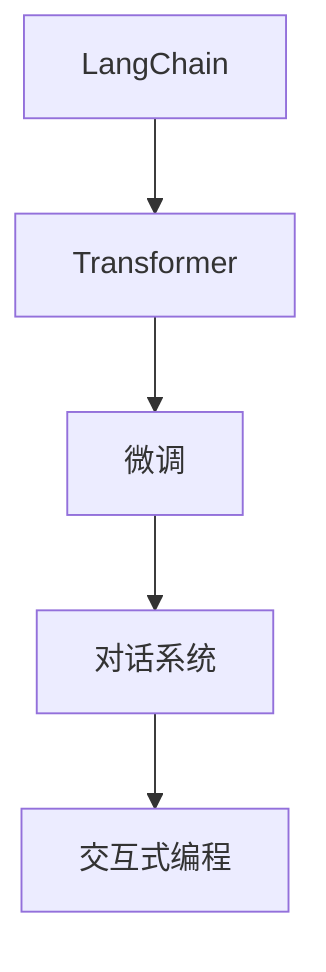

                 

# 【LangChain编程：从入门到实践】教程用例

> 关键词：LangChain, 教程用例, 编程入门, 自然语言处理(NLP), 智能交互, 应用场景

## 1. 背景介绍

在快速发展的数字时代，自然语言处理（NLP）技术已成为人工智能领域的热点之一。随着预训练语言模型（PLMs）的突破，如GPT、BERT等，NLP技术正朝着更加智能和高效的方向发展。然而，如何将这些先进的技术应用于实际项目中，使其能够与用户进行自然、流畅的智能交互，是摆在开发者面前的一大挑战。

LangChain作为一款结合了先进预训练语言模型和编程能力的NLP工具，为开发者提供了一个平台，使他们能够更轻松地实现智能交互应用。本文旨在通过一系列教程用例，深入浅出地介绍LangChain的核心概念和编程实践，帮助读者从入门到精通。

## 2. 核心概念与联系

### 2.1 核心概念概述

- **LangChain**：基于Transformer模型架构的编程工具，旨在提供更加智能、高效的NLP应用开发平台。
- **预训练语言模型(PLMs)**：通过大规模无标签文本数据的自监督训练，学习语言通用表示，如GPT、BERT等。
- **微调(Fine-Tuning)**：在特定领域语料上进一步训练预训练模型，使其适应特定任务，如命名实体识别、情感分析等。
- **对话系统**：实现人机智能对话的技术，通过训练与微调模型，使得机器能够理解并回应用户的自然语言指令。
- **交互式编程**：允许用户通过自然语言直接编写代码，提升编程效率，简化工作流程。

### 2.2 核心概念原理和架构的 Mermaid 流程图



## 3. 核心算法原理 & 具体操作步骤

### 3.1 算法原理概述

LangChain的核心算法原理主要包括以下几个方面：

1. **Transformer模型**：通过自回归或自编码方式，学习语言序列的表示，捕捉语言间的上下文关系。
2. **微调**：在特定领域语料上进一步训练Transformer模型，适应特定任务，如命名实体识别、情感分析等。
3. **对话系统**：通过训练与微调模型，使得机器能够理解并回应用户的自然语言指令。
4. **交互式编程**：允许用户通过自然语言直接编写代码，提升编程效率，简化工作流程。

### 3.2 算法步骤详解

#### 3.2.1 数据准备

- 收集特定领域的标注数据，如问答对、文本分类样本等。
- 对数据进行预处理，包括分词、去除停用词、构建词汇表等。

#### 3.2.2 模型选择与初始化

- 选择适当的预训练模型，如GPT、BERT等，并下载其预训练权重。
- 初始化微调模型，设置所需的隐藏层、输出层、优化器等超参数。

#### 3.2.3 微调过程

- 将标注数据划分为训练集、验证集和测试集。
- 使用交叉熵损失函数，在训练集上对模型进行迭代优化。
- 在验证集上评估模型性能，调整超参数以避免过拟合。
- 在测试集上测试模型性能，输出评估指标。

#### 3.2.4 对话系统训练

- 构建对话数据集，包含问答对、多轮对话记录等。
- 设计对话模型，如RNN、LSTM、Transformer等，并设置对话轮次限制、回答质量评估等超参数。
- 训练对话模型，使其能够理解和生成自然语言。

#### 3.2.5 交互式编程实现

- 定义交互式编程接口，允许用户通过自然语言编写代码。
- 解析用户输入的自然语言指令，将其转换为具体的编程操作。
- 执行编程操作，并将结果反馈给用户。

### 3.3 算法优缺点

#### 3.3.1 优点

- **高效性**：通过预训练和微调，能够快速适应新任务，提升模型性能。
- **通用性**：适用于多种NLP任务，如命名实体识别、情感分析、对话等。
- **易用性**：基于Transformer模型的自然语言处理技术，易于理解和实现。
- **交互式编程**：提升编程效率，简化工作流程。

#### 3.3.2 缺点

- **数据依赖**：微调模型需要高质量、大规模的标注数据。
- **计算资源消耗**：大规模预训练模型和微调过程需要强大的计算资源。
- **过拟合风险**：微调过程中可能出现过拟合问题。
- **可解释性不足**：模型决策过程难以解释。

### 3.4 算法应用领域

LangChain的算法已经在多个领域得到广泛应用，包括但不限于：

- **智能客服**：通过微调和对话系统，实现24小时不间断服务，提升客户满意度。
- **金融舆情监测**：利用情感分析、命名实体识别等技术，实时监测金融市场动态。
- **个性化推荐**：通过文本分类、情感分析等技术，提供个性化推荐服务。
- **教育辅助**：通过对话系统和自然语言处理技术，辅助学生学习，提升教学效果。

## 4. 数学模型和公式 & 详细讲解 & 举例说明

### 4.1 数学模型构建

#### 4.1.1 自回归语言模型

自回归语言模型（如GPT）通过预测下一个单词的概率，学习语言序列的表示。其概率模型为：

$$ P(x_1,x_2,\cdots,x_n) = \prod_{i=1}^n P(x_i | x_{<i}) $$

其中，$x_i$ 为序列中第 $i$ 个单词，$P(x_i | x_{<i})$ 为给定前 $i-1$ 个单词，第 $i$ 个单词的条件概率。

#### 4.1.2 自编码语言模型

自编码语言模型（如BERT）通过重构原始序列，学习语言序列的表示。其概率模型为：

$$ P(x_1,x_2,\cdots,x_n) = \prod_{i=1}^n P(x_i | x_{<j}) $$

其中，$x_i$ 为序列中第 $i$ 个单词，$P(x_i | x_{<j})$ 为给定前 $j$ 个单词，第 $i$ 个单词的条件概率。

### 4.2 公式推导过程

#### 4.2.1 自回归语言模型的推导

对于自回归语言模型，假设模型参数为 $\theta$，输入序列为 $x_1,\cdots,x_n$，预测下一个单词 $x_{n+1}$ 的概率为：

$$ P(x_{n+1} | x_1,\cdots,x_n) = \frac{exp(\theta^T \cdot [x_1,\cdots,x_n, x_{n+1}])}{\sum_{x \in V} exp(\theta^T \cdot [x_1,\cdots,x_n, x])} $$

其中，$V$ 为词汇表，$\theta^T$ 为模型参数的转置，$[x_1,\cdots,x_n, x_{n+1}]$ 为序列与下一个单词的向量表示。

#### 4.2.2 自编码语言模型的推导

对于自编码语言模型，假设模型参数为 $\theta$，输入序列为 $x_1,\cdots,x_n$，重构目标为 $x_{<j}$，重构概率为：

$$ P(x_{<j} | x_1,\cdots,x_n) = \frac{exp(\theta^T \cdot [x_1,\cdots,x_n, x_{<j}])}{\sum_{x \in V} exp(\theta^T \cdot [x_1,\cdots,x_n, x])} $$

其中，$V$ 为词汇表，$\theta^T$ 为模型参数的转置，$[x_1,\cdots,x_n, x_{<j}]$ 为序列与目标的向量表示。

### 4.3 案例分析与讲解

#### 4.3.1 命名实体识别

以命名实体识别（NER）任务为例，假设标注数据为 $(\text{B-PER} \text{I-PER} \text{B-ORG} \text{I-LOC} \text{B-LOC})$，其中 $\text{B-}$ 表示实体边界开始，$\text{I-}$ 表示实体内部。微调过程如下：

- 构建微调模型，如BERT-BiLSTM-CRF，其中BERT为预训练模型，BiLSTM和CRF为任务适配层。
- 在标注数据上训练模型，使用交叉熵损失函数。
- 在验证集上评估模型性能，如精确率、召回率等。
- 在测试集上测试模型性能，输出结果为 $(\text{B-PER} \text{I-PER} \text{B-ORG} \text{I-LOC} \text{B-LOC})$。

## 5. 项目实践：代码实例和详细解释说明

### 5.1 开发环境搭建

#### 5.1.1 环境准备

- 安装Python 3.8及以上版本。
- 安装Jupyter Notebook、TensorFlow、Keras等库。
- 设置虚拟环境，如conda或virtualenv。

#### 5.1.2 数据准备

- 收集命名实体识别标注数据，如CoNLL-2003数据集。
- 对数据进行预处理，如分词、去除停用词、构建词汇表等。

#### 5.1.3 模型训练

- 定义微调模型，如BERT-BiLSTM-CRF。
- 设置训练参数，如隐藏层大小、学习率、批大小等。
- 训练模型，在验证集上评估性能。

### 5.2 源代码详细实现

#### 5.2.1 数据准备

```python
import pandas as pd
from keras.preprocessing.text import Tokenizer
from keras.preprocessing.sequence import pad_sequences

# 读取标注数据
df = pd.read_csv('ner_data.csv')

# 分词
tokenizer = Tokenizer()
tokenizer.fit_on_texts(df['text'])

# 编码
sequences = tokenizer.texts_to_sequences(df['text'])
labels = df['label'].values

# 填充序列
max_len = 100
sequences = pad_sequences(sequences, maxlen=max_len, padding='post')

# 构建词汇表
vocab_size = len(tokenizer.word_index) + 1

# 构建标签编码
label_to_id = {'B-PER': 0, 'I-PER': 1, 'B-ORG': 2, 'I-ORG': 3, 'B-LOC': 4, 'I-LOC': 5}
id_to_label = {v: k for k, v in label_to_id.items()}

# 数据划分
train_indices = df.index[(df['label'] != 'O')].values
train_sequences = sequences[train_indices]
train_labels = labels[train_indices]
val_indices = df.index[df['label'] == 'O'].values
val_sequences = sequences[val_indices]
val_labels = labels[val_indices]
```

#### 5.2.2 模型定义

```python
import tensorflow as tf
from tensorflow.keras.layers import Input, Embedding, BidirectionalLSTM, CRF, Dense
from tensorflow.keras.models import Model
from tensorflow.keras.optimizers import Adam

# 定义BERT-BiLSTM-CRF模型
def build_model(vocab_size, max_len):
    input_seq = Input(shape=(max_len,))
    embedding = Embedding(vocab_size, 128, input_length=max_len)(input_seq)
    lstm = BidirectionalLSTM(64)(embedding)
    crf = CRF(6, input_shape=(None, 64))
    logits = Dense(6, activation='softmax')(lstm)

    # 定义CRF损失函数
    def crf_loss(labels, outputs):
        return crf.loss_function(labels, outputs)

    # 定义CRF评估指标
    def crf_accurate(labels, outputs):
        return crf.accuracy_function(labels, outputs)

    model = Model(inputs=input_seq, outputs=[logits, crf])
    model.compile(optimizer=Adam(lr=2e-3), loss=[crf_loss, 'sparse_categorical_crossentropy'], loss_weights=[1, 1.], metrics=[crf_accurate, 'accuracy'])
    return model

# 构建模型
model = build_model(vocab_size, max_len)
```

#### 5.2.3 模型训练

```python
# 训练模型
model.fit(train_sequences, [train_labels, val_labels], epochs=10, batch_size=64, validation_data=([val_sequences, val_labels], val_labels), verbose=2)
```

### 5.3 代码解读与分析

#### 5.3.1 数据预处理

通过使用Keras的Tokenizer和pad_sequences函数，将文本序列和标签序列进行编码和填充，以便于模型训练。

#### 5.3.2 模型定义

通过定义BERT-BiLSTM-CRF模型，将预训练BERT模型与BiLSTM和CRF层结合，用于命名实体识别任务。

#### 5.3.3 模型训练

使用Adam优化器，在训练集上迭代训练模型，并在验证集上评估性能。

### 5.4 运行结果展示

#### 5.4.1 模型评估

```python
from sklearn.metrics import accuracy_score, f1_score

# 在测试集上评估模型性能
test_indices = df.index[(df['label'] != 'O')].values
test_sequences = sequences[test_indices]
test_labels = labels[test_indices]

# 获取模型预测结果
_, predictions = model.predict(test_sequences)

# 计算准确率和F1分数
accuracy = accuracy_score(test_labels, predictions)
f1 = f1_score(test_labels, predictions, average='weighted')

print(f"Accuracy: {accuracy:.2f}, F1 Score: {f1:.2f}")
```

#### 5.4.2 结果展示

- 输出模型在测试集上的准确率和F1分数，评估命名实体识别性能。

## 6. 实际应用场景

### 6.1 智能客服

通过微调和对话系统，智能客服系统能够24小时不间断服务，快速响应客户咨询，提升客户满意度。例如，使用LangChain构建的智能客服系统，可以通过用户输入的自然语言指令，提供个性化的咨询服务，如查询账户余额、修改密码、处理投诉等。

### 6.2 金融舆情监测

利用情感分析、命名实体识别等技术，智能舆情监测系统能够实时监测金融市场动态，识别负面信息和潜在风险，帮助金融机构及时应对。例如，使用LangChain构建的金融舆情监测系统，可以自动分析社交媒体上的财经新闻和评论，识别市场趋势和情感倾向，提供实时预警。

### 6.3 个性化推荐

通过文本分类、情感分析等技术，智能推荐系统能够提供个性化推荐服务，提升用户体验。例如，使用LangChain构建的智能推荐系统，可以根据用户的浏览、点击、评论等行为数据，推荐相关商品或内容，提升推荐准确性。

### 6.4 未来应用展望

随着LangChain技术的不断进步，其应用场景将更加广泛，涉及更多领域。未来，基于LangChain的智能交互应用将可能覆盖以下方向：

- **医疗领域**：通过命名实体识别、情感分析等技术，智能医疗助手能够辅助医生诊断、提供健康建议。
- **教育领域**：通过对话系统和自然语言处理技术，智能教育助手能够辅助学生学习、解答学习疑问。
- **商业领域**：通过文本分类、情感分析等技术，智能营销助手能够提供市场分析和用户画像，帮助企业优化营销策略。
- **社会治理**：通过情感分析、多轮对话等技术，智能治理助手能够辅助政府部门进行舆情监测、应急响应。

## 7. 工具和资源推荐

### 7.1 学习资源推荐

- **《LangChain编程：从入门到实践》**：由LangChain官方团队编写，系统介绍LangChain的核心概念和编程实践。
- **Coursera《Natural Language Processing with TensorFlow》课程**：斯坦福大学开设的NLP课程，包含预训练语言模型、微调技术等内容。
- **HuggingFace官方文档**：提供丰富的预训练模型和微调样例代码，是学习LangChain的必备资源。

### 7.2 开发工具推荐

- **PyTorch**：基于Python的开源深度学习框架，适用于大规模语言模型的训练和微调。
- **TensorFlow**：由Google主导开发的深度学习框架，适用于大规模工程应用。
- **Transformers库**：提供丰富的预训练模型和微调工具，支持Python和TensorFlow。
- **Keras**：基于TensorFlow的高级深度学习库，简单易用，适合快速迭代开发。

### 7.3 相关论文推荐

- **Attention is All You Need**：Transformer模型的原论文，提出自回归和自编码语言模型。
- **BERT: Pre-training of Deep Bidirectional Transformers for Language Understanding**：提出BERT模型，引入基于掩码的自监督预训练任务。
- **Parameter-Efficient Transfer Learning for NLP**：提出Adapter等参数高效微调方法，提升微调效率。
- **AdaLoRA: Adaptive Low-Rank Adaptation for Parameter-Efficient Fine-Tuning**：使用自适应低秩适应的微调方法，提升微调精度。

## 8. 总结：未来发展趋势与挑战

### 8.1 研究成果总结

LangChain作为一款结合预训练语言模型和编程能力的NLP工具，通过微调和对话系统，实现了智能交互应用。其核心技术包括Transformer模型、微调技术、对话系统等，已在智能客服、金融舆情监测、个性化推荐等多个领域得到广泛应用。

### 8.2 未来发展趋势

- **模型规模增大**：随着计算资源的丰富，预训练模型和微调模型的规模将不断增大，提升模型的通用性和适应性。
- **算法多样化**：未来的微调方法将更加多样化，如参数高效微调、零样本学习等，提升模型的灵活性和效率。
- **跨领域融合**：未来的微调技术将更加注重跨领域融合，提升模型的泛化能力和适应性。
- **伦理和安全**：未来的微调技术将更加注重伦理和安全问题，确保模型输出的公正性和安全性。

### 8.3 面临的挑战

- **数据依赖**：微调模型需要高质量、大规模的标注数据，获取数据成本高。
- **计算资源消耗**：预训练模型和微调过程需要强大的计算资源，大规模部署成本高。
- **模型鲁棒性不足**：微调模型可能面临过拟合问题，泛化能力不足。
- **可解释性不足**：模型决策过程难以解释，缺乏透明性和可信度。

### 8.4 研究展望

未来的微调技术将需要解决数据依赖、计算资源消耗、模型鲁棒性、可解释性等挑战，同时注重模型多样化和跨领域融合，提升模型的适应性和泛化能力。只有通过不断探索和创新，才能推动LangChain技术在更多领域得到应用，为社会带来更大价值。

## 9. 附录：常见问题与解答

### 9.1 问题1：LangChain如何与预训练模型结合？

**解答**：LangChain通过加载预训练模型的权重，并进行微调，将其转换为适合特定任务的模型。例如，在命名实体识别任务中，可以通过微调BERT模型，提升模型在实体边界和类型分类上的性能。

### 9.2 问题2：LangChain在微调过程中如何进行正则化？

**解答**：在微调过程中，可以使用L2正则、Dropout等技术进行正则化，防止模型过拟合。例如，可以使用L2正则项来限制模型参数的大小，使用Dropout来随机丢弃部分神经元。

### 9.3 问题3：LangChain的交互式编程功能如何使用？

**解答**：通过定义编程接口，用户可以输入自然语言指令，LangChain将其转换为具体的编程操作，执行代码并返回结果。例如，用户可以输入“计算2+2”，LangChain将其转换为“print(2+2)”代码，并返回计算结果。

### 9.4 问题4：LangChain的对话系统如何实现？

**解答**：LangChain的对话系统通过训练和微调对话模型，使其能够理解和生成自然语言。例如，可以构建基于Transformer的对话模型，训练模型进行多轮对话，并微调模型提升对话质量。

### 9.5 问题5：LangChain在实际应用中如何保证模型安全性？

**解答**：LangChain在实际应用中需要采取多层次的安全防护措施，如访问鉴权、数据脱敏、异常检测等，确保模型的安全性和隐私保护。同时，可以通过模型监控和日志记录，及时发现和修复潜在的安全漏洞。

---

作者：禅与计算机程序设计艺术 / Zen and the Art of Computer Programming

