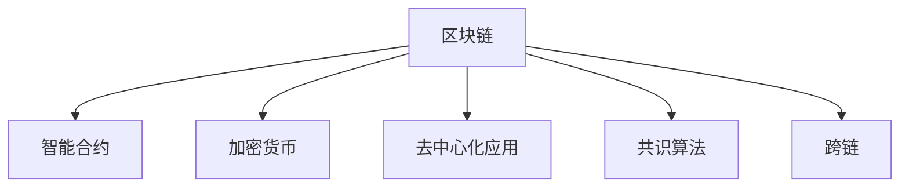

                 

# 【LangChain编程：从入门到实践】链的构建

> 关键词：LangChain,区块链,编程,区块链应用,加密货币,智能合约

## 1. 背景介绍

### 1.1 问题由来

近年来，随着区块链技术的不断发展和成熟，越来越多的行业开始探索其应用潜力。在金融、供应链、医疗、版权保护等领域，区块链以其去中心化、不可篡改的特点，展现出广阔的应用前景。

区块链不仅是一个技术平台，更是一个不断发展的生态系统，涵盖了多种技术、理论和商业模式。然而，当前区块链系统的编程语言、开发框架和工具库并不统一，给开发者带来了巨大的挑战。

为了更好地促进区块链技术的普及和应用，急需一种统一的区块链编程框架，让开发者能够更加便捷、高效地开发区块链应用。LangChain正是这样一种框架，它提供了完整的区块链编程解决方案，涵盖了从区块链基本原理到具体应用的各个方面。

### 1.2 问题核心关键点

LangChain框架旨在提供一个全面的区块链编程平台，其核心关键点包括：

- **统一编程语言**：提供统一的区块链编程语言，方便开发者在多个区块链平台上进行开发。
- **模块化架构**：采用模块化设计，允许开发者灵活组合多种功能模块，构建定制化的区块链应用。
- **跨链支持**：支持跨链操作，实现不同区块链平台之间的互联互通。
- **智能合约支持**：提供智能合约模板和开发工具，降低智能合约的开发难度。
- **数据加密和安全**：支持多种数据加密方式，确保区块链应用的数据安全。

这些关键点使得LangChain成为区块链开发者和应用开发者不可多得的开发工具。

## 2. 核心概念与联系

### 2.1 核心概念概述

为了更好地理解LangChain框架，本节将介绍几个关键概念：

- **区块链(Blockchain)**：一种去中心化的分布式数据库，通过加密技术和共识算法保证数据的安全性和不可篡改性。
- **智能合约(Smart Contract)**：一种自动执行的合约，通过代码实现合约条款，无需第三方中介。
- **加密货币(Cryptocurrency)**：一种基于区块链技术的新型货币，具有去中心化、透明等特点。
- **去中心化应用(Decentralized Application, DApp)**：一种基于区块链的应用，运行在区块链网络上，不依赖于任何中央服务器。
- **共识算法(Consensus Algorithm)**：一种用于保证区块链网络一致性的算法，常见的有PoW、PoS、DPoS等。
- **跨链(Interchain)**：实现不同区块链平台之间的互操作性，允许信息、资产在多个区块链之间自由流动。

这些核心概念之间的逻辑关系可以通过以下Mermaid流程图来展示：



这个流程图展示了几大核心概念及其之间的关系：

1. 区块链是整个框架的基础，智能合约、加密货币、去中心化应用都是基于区块链技术构建的。
2. 智能合约利用区块链不可篡改的特性，自动执行合约条款，实现自动化和智能化。
3. 加密货币是区块链网络中的一种应用，利用区块链技术保证货币的安全性和去中心化。
4. 去中心化应用不依赖于任何中央服务器，运行在区块链网络上，具有高度的去中心化和安全性。
5. 共识算法用于保证区块链网络的一致性，防止数据篡改和攻击。
6. 跨链技术实现不同区块链平台之间的互操作性，提升区块链网络的互联互通性。

这些概念共同构成了LangChain框架的基本框架，使其能够支持多种区块链应用场景。

## 3. 核心算法原理 & 具体操作步骤
### 3.1 算法原理概述

LangChain框架基于区块链技术，提供了一套完整的编程框架，涵盖从区块链基本原理到具体应用的各个方面。其核心算法原理包括以下几个方面：

- **共识算法**：LangChain支持多种共识算法，如PoW、PoS、DPoS等，实现区块链网络的共识和安全。
- **智能合约语言**：提供统一的智能合约编程语言，支持多种语言编写智能合约。
- **加密技术**：支持多种加密方式，如对称加密、非对称加密、哈希函数等，确保区块链数据的安全性。
- **跨链技术**：支持不同区块链平台之间的互操作性，实现区块链网络之间的信息、资产交换。
- **分布式存储**：提供分布式存储解决方案，实现数据的分布式存储和管理。

这些核心算法原理构成了LangChain框架的技术基础，使得开发者能够基于统一的编程模型，构建高效、安全的区块链应用。

### 3.2 算法步骤详解

LangChain框架的开发和应用过程主要包括以下几个关键步骤：

**Step 1: 选择区块链平台和开发语言**

- 选择目标区块链平台（如以太坊、Hyperledger Fabric等）。
- 确定编程语言（如Solidity、Go、JavaScript等）。

**Step 2: 设计智能合约逻辑**

- 设计智能合约的功能和逻辑。
- 编写智能合约代码。

**Step 3: 部署智能合约**

- 将智能合约代码上传到区块链平台。
- 进行智能合约的测试和部署。

**Step 4: 实现区块链应用**

- 集成智能合约到区块链应用中。
- 实现区块链应用的功能和业务逻辑。

**Step 5: 进行跨链操作**

- 实现不同区块链平台之间的互操作性。
- 实现区块链应用之间的信息、资产交换。

**Step 6: 进行数据加密和保护**

- 实现区块链应用的数据加密。
- 设计区块链应用的安全策略和机制。

**Step 7: 进行测试和优化**

- 对区块链应用进行全面测试。
- 优化区块链应用的性能和安全性。

**Step 8: 上线和维护**

- 将区块链应用上线到生产环境。
- 持续监控和维护区块链应用。

这些步骤构成了LangChain框架开发和应用的基本流程，开发者可根据具体需求进行调整和优化。

### 3.3 算法优缺点

LangChain框架具有以下优点：

1. **统一编程语言**：提供统一的编程语言，降低开发者在不同区块链平台之间的切换成本。
2. **模块化架构**：采用模块化设计，允许开发者灵活组合多种功能模块，构建定制化的区块链应用。
3. **跨链支持**：支持跨链操作，实现不同区块链平台之间的互联互通。
4. **智能合约支持**：提供智能合约模板和开发工具，降低智能合约的开发难度。
5. **数据加密和安全**：支持多种数据加密方式，确保区块链应用的数据安全。

同时，LangChain框架也存在一些缺点：

1. **开发成本较高**：需要掌握多种区块链平台和编程语言，开发成本较高。
2. **生态系统尚不完善**：目前LangChain的生态系统相对较弱，开发工具和资源相对较少。
3. **技术难度较大**：区块链技术本身较为复杂，需要一定的技术储备和理解。

尽管存在这些缺点，但LangChain框架在简化区块链编程、提升区块链应用开发效率方面具有重要意义。

### 3.4 算法应用领域

LangChain框架在多个领域具有广泛的应用前景：

- **金融应用**：如智能合约、数字身份认证、供应链金融等。
- **供应链管理**：如货物追踪、溯源、质检等。
- **医疗应用**：如电子病历、医疗数据共享、患者身份认证等。
- **版权保护**：如版权登记、版权授权、版权交易等。
- **身份认证**：如数字身份认证、数据隐私保护等。
- **数字资产**：如数字货币、智能合约等。

这些应用领域展示了LangChain框架的强大适用性和广泛应用前景。

## 4. 数学模型和公式 & 详细讲解 & 举例说明

### 4.1 数学模型构建

LangChain框架的数学模型主要基于区块链的基本原理和共识算法。以下是几个关键模型的简要介绍：

1. **共识算法模型**：共识算法是区块链网络的核心，保证网络的共识和安全。常见的共识算法包括PoW、PoS、DPoS等。
2. **智能合约模型**：智能合约是区块链应用的执行者，通过代码实现合约条款。
3. **加密模型**：加密技术是保证区块链数据安全的关键，包括对称加密、非对称加密、哈希函数等。
4. **跨链模型**：跨链技术实现不同区块链平台之间的互操作性，涉及信息、资产的交换。

### 4.2 公式推导过程

以下是几个关键模型的公式推导过程：

1. **共识算法**：
   - PoW共识算法公式：
     $$
     \text{Proof of Work} = \min\limits_{p} H(p) \text{ s.t. } H(p) < \text{Target}
     $$
   - 其中 $H(p)$ 为工作量证明哈希函数，$\text{Target}$ 为难度参数，$p$ 为区块证明。
2. **智能合约**：
   - 智能合约语言Solidity的示例代码：
     ```solidity
     contract Token {
       uint256 public balance;
       event Transfer(uint256 indexed from, uint256 indexed to, uint256 value);
       function transfer(address payable receiver, uint256 amount) public {
         require(amount > 0);
         if(balance >= amount) {
           balance -= amount;
           receiver.balance += amount;
           emit Transfer(msg.sender, receiver, amount);
         }
       }
     }
     ```
3. **加密技术**：
   - 非对称加密的公钥私钥生成公式：
     ```
     \text{公钥} = E(\text{私钥})
     ```
   - 对称加密的加密解密公式：
     ```
     \text{密文} = E(\text{明文}, \text{密钥})
     \text{明文} = D(\text{密文}, \text{密钥})
     ```

### 4.3 案例分析与讲解

以下以智能合约为例，展示LangChain框架的实际应用：

假设有一个去中心化的拍卖平台，需要实现以下功能：

1. 用户可以注册并创建一个拍卖品。
2. 用户可以发布拍卖信息，设置起拍价、结束时间等参数。
3. 用户可以参与竞拍，竞拍结束后自动分配拍卖品。

以下是该智能合约的Solidity代码实现：

```solidity
contract Auction {
  uint256 public auction_id;
  uint256 public start_price;
  uint256 public end_time;
  address payable public winner;
  uint256 public price;
  uint256 public balance;
  uint256 public bidding;
  uint256 public max_price;
  address payable public owner;
  
  event Bid(uint256 _bidder, uint256 _bid);
  event Bought(uint256 _id);
  
  constructor() public {
    auction_id = 0;
    start_price = 0;
    end_time = 0;
    winner = address(0);
    price = 0;
    balance = 0;
    bidding = 0;
    max_price = 0;
    owner = msg.sender;
  }
  
  function createAuction(uint256 _price, uint256 _end_time) public payable {
    require(msg.value == _price);
    auction_id++;
    start_price = _price;
    end_time = _end_time;
    balance = msg.value;
    bidding = 0;
    max_price = _price;
  }
  
  function bid(uint256 _bid) public payable {
    require(msg.value == _bid);
    require(block.timestamp >= end_time);
    require(_bid > bidding);
    bidding = _bid;
    emit Bid(msg.sender, _bid);
  }
  
  function finishAuction() public {
    if(winner != address(0)) return;
    winner = msg.sender;
    price = bidding;
    emit Bought(auction_id);
  }
}
```

这个智能合约实现了拍卖平台的基本功能，包括创建拍卖、参与竞拍和分配拍卖品。通过编写和部署该智能合约，可以实现去中心化的拍卖应用，用户无需信任第三方平台，即可完成竞拍过程。

## 5. 项目实践：代码实例和详细解释说明

### 5.1 开发环境搭建

在进行LangChain框架的开发和应用前，需要搭建好开发环境。以下是使用Python进行区块链开发的环境配置流程：

1. 安装Anaconda：从官网下载并安装Anaconda，用于创建独立的Python环境。

2. 创建并激活虚拟环境：
   ```bash
   conda create -n blockchain-env python=3.8 
   conda activate blockchain-env
   ```

3. 安装相关依赖：
   ```bash
   pip install flask web3 pyethereum solidity-crypto protobuf
   ```

4. 搭建开发环境：
   ```bash
   git clone https://github.com/ethereum/ethereum-go.git
   cd ethereum-go
   go install -v github.com/ethereum/go-ethereum/cmd/...
   ```

完成上述步骤后，即可在`blockchain-env`环境中开始区块链开发实践。

### 5.2 源代码详细实现

这里我们以以太坊智能合约开发为例，展示使用Solidity语言编写智能合约的完整代码实现。

首先，创建并编译智能合约代码：

```solidity
pragma solidity ^0.8.0;

contract MyContract {
  uint256 public variable;
  
  constructor(uint256 _variable) public {
    variable = _variable;
  }
  
  function updateVariable(uint256 _newVariable) public {
    variable = _newVariable;
  }
  
  function getVariable() public view returns (uint256) {
    return variable;
  }
}
```

在合约代码中，定义了一个名为`MyContract`的智能合约，包含一个`variable`状态变量和一个`updateVariable`方法，用于更新变量值。

接着，使用`truffle`框架将合约部署到以太坊测试网络：

1. 安装`truffle`和`ganache-cli`：
   ```bash
   npm install -g truffle ganache-cli
   ```

2. 创建`MyContract`合约文件：
   ```bash
   truffle init MyContract
   ```

3. 在`contracts`目录下编写`MyContract.sol`文件，并将上面编写的智能合约代码复制到该文件中。

4. 运行`truffle`命令进行合约部署：
   ```bash
   truffle compile
   truffle migrate --network ganache-cli
   ```

运行`truffle migrate`命令后，`MyContract`合约将被部署到以太坊测试网络上，可以通过`ganache-cli`启动测试网络进行合约的测试和调试。

### 5.3 代码解读与分析

以下是智能合约代码的详细解读：

- `pragma solidity ^0.8.0;`：指定Solidity版本。
- `contract MyContract { ... }`：定义一个名为`MyContract`的智能合约。
- `uint256 public variable;`：定义一个`variable`状态变量，公开发布。
- `constructor(uint256 _variable) public { ... }`：构造函数，初始化变量值。
- `function updateVariable(uint256 _newVariable) public { ... }`：更新变量值的函数。
- `function getVariable() public view returns (uint256) { ... }`：获取变量值的函数。

`MyContract`合约通过`updateVariable`函数可以修改状态变量`variable`的值，通过`getVariable`函数可以获取状态变量的值。开发者可以在该合约的基础上扩展其他功能，如授权控制、事件触发等。

## 6. 实际应用场景

### 6.1 智能合约应用

智能合约在区块链应用中具有广泛的应用场景。以下是几个典型的应用案例：

1. **数字身份认证**：用户可以使用智能合约创建和管理数字身份，记录个人信息、交易记录等。
2. **供应链管理**：智能合约可以记录货物追踪信息、溯源信息、质检结果等，保证供应链的透明度和可信度。
3. **版权保护**：智能合约可以记录版权信息、授权信息等，保护版权所有者的权益。
4. **数字资产**：智能合约可以记录和管理数字资产的创建、交易、转让等，实现去中心化的资产管理。
5. **去中心化金融(DeFi)**：智能合约可以实现去中心化金融应用，如借贷、交易、清算等，降低传统金融的信任成本和中介费用。

### 6.2 区块链应用

LangChain框架可以应用于多种区块链应用，以下是几个典型的应用案例：

1. **去中心化应用(DApp)**：LangChain框架可以支持开发去中心化应用，如去中心化社交网络、去中心化交易平台等。
2. **去中心化市场**：LangChain框架可以支持开发去中心化市场，如去中心化交易所、去中心化竞拍平台等。
3. **去中心化金融(DeFi)**：LangChain框架可以支持开发去中心化金融应用，如去中心化借贷、去中心化交易所等。
4. **去中心化身份认证(ID)**：LangChain框架可以支持开发去中心化身份认证系统，如区块链数字身份认证、去中心化认证等。

这些应用场景展示了LangChain框架的强大适用性和广泛应用前景。

### 6.3 未来应用展望

随着区块链技术的不断发展和成熟，LangChain框架的应用前景将更加广阔。以下是几个未来的应用展望：

1. **跨链互操作**：LangChain框架将支持跨链互操作，实现不同区块链平台之间的互联互通。
2. **去中心化治理**：LangChain框架将支持去中心化治理，实现社区决策和治理机制。
3. **智能合约平台**：LangChain框架将支持开发智能合约平台，方便开发者构建和部署智能合约。
4. **去中心化应用平台**：LangChain框架将支持开发去中心化应用平台，提供通用的开发接口和工具库。
5. **区块链基础设施**：LangChain框架将支持开发区块链基础设施，如去中心化交易所、去中心化钱包等。

## 7. 工具和资源推荐

### 7.1 学习资源推荐

为了帮助开发者系统掌握LangChain框架的理论基础和实践技巧，这里推荐一些优质的学习资源：

1. **《区块链原理与实践》**：一本系统介绍区块链技术的书籍，涵盖区块链的基本原理、共识算法、智能合约等。
2. **《Solidity编程指南》**：一本系统介绍Solidity语言的书籍，涵盖Solidity的基本语法、智能合约开发技巧等。
3. **Truffle官网**：Truffle官方文档，提供丰富的智能合约开发和测试工具。
4. **Etherscan官网**：Etherscan官方文档，提供以太坊区块链的查询和分析工具。
5. **Blockchain.com官网**：Blockchain.com官方文档，提供区块链技术的文档、教程和工具。

通过对这些资源的学习实践，相信你一定能够快速掌握LangChain框架的精髓，并用于解决实际的区块链问题。

### 7.2 开发工具推荐

高效的开发离不开优秀的工具支持。以下是几款用于区块链开发的工具：

1. **Truffle**：一款基于Solidity语言的区块链开发框架，提供智能合约的编译、部署、测试等工具。
2. **Remix IDE**：一款基于Web的区块链开发工具，提供智能合约的编译、调试、部署等功能。
3. **Ganache CLI**：一款以太坊测试网络工具，提供快速启动以太坊测试网络和智能合约测试环境。
4. **MetaMask**：一款浏览器插件，支持以太坊钱包和智能合约的交互。
5. **Web3.js**：一款基于Web3标准的区块链开发库，提供以太坊和其他区块链平台的API接口。

合理利用这些工具，可以显著提升区块链开发的速度和效率，加快创新迭代的步伐。

### 7.3 相关论文推荐

区块链技术的发展得益于学界的持续研究。以下是几篇奠基性的相关论文，推荐阅读：

1. **《区块链技术及其应用》**：阐述了区块链技术的基本原理和应用场景。
2. **《去中心化金融技术》**：探讨了去中心化金融的应用和实现技术。
3. **《智能合约技术》**：介绍了智能合约的基本概念和开发技术。
4. **《区块链安全性研究》**：研究了区块链系统的安全性和防护措施。
5. **《区块链跨链技术》**：探讨了区块链跨链技术的研究进展和应用前景。

这些论文代表了大区块链技术的发展脉络。通过学习这些前沿成果，可以帮助研究者把握学科前进方向，激发更多的创新灵感。

## 8. 总结：未来发展趋势与挑战

### 8.1 总结

本文对LangChain框架进行了全面系统的介绍，涵盖从区块链基本原理到具体应用的各个方面。首先阐述了LangChain框架的研究背景和意义，明确了框架在区块链编程和开发中的应用价值。其次，从原理到实践，详细讲解了LangChain框架的数学模型和核心算法，提供了完整的智能合约开发实例。同时，本文还广泛探讨了LangChain框架在多个领域的应用前景，展示了框架的强大适用性和广泛应用前景。

通过本文的系统梳理，可以看到，LangChain框架在区块链编程和开发中具有重要的作用，为开发者提供了一套完整的区块链编程解决方案。通过学习LangChain框架，开发者可以更加便捷、高效地开发区块链应用，提升区块链应用开发的效率和质量。

### 8.2 未来发展趋势

展望未来，LangChain框架将呈现以下几个发展趋势：

1. **跨链互操作**：LangChain框架将支持跨链互操作，实现不同区块链平台之间的互联互通。
2. **去中心化治理**：LangChain框架将支持去中心化治理，实现社区决策和治理机制。
3. **智能合约平台**：LangChain框架将支持开发智能合约平台，方便开发者构建和部署智能合约。
4. **去中心化应用平台**：LangChain框架将支持开发去中心化应用平台，提供通用的开发接口和工具库。
5. **区块链基础设施**：LangChain框架将支持开发区块链基础设施，如去中心化交易所、去中心化钱包等。

这些趋势展示了LangChain框架的广阔前景，将进一步提升区块链应用开发的效率和质量。

### 8.3 面临的挑战

尽管LangChain框架在区块链编程和开发中具有重要作用，但在应用过程中也面临诸多挑战：

1. **开发难度较大**：区块链技术本身较为复杂，需要一定的技术储备和理解。
2. **生态系统不完善**：目前LangChain框架的生态系统相对较弱，开发工具和资源相对较少。
3. **安全性问题**：区块链系统存在安全性问题，需要开发人员具备良好的安全意识和技术储备。
4. **扩展性问题**：区块链系统需要处理大量交易数据，如何提升系统的扩展性和性能是一个重要问题。
5. **监管问题**：区块链应用需要符合各国的法律法规和监管要求，开发人员需要具备相关的法律知识。

这些挑战需要开发者在实践中不断探索和解决，以提升LangChain框架的实用性和稳定性。

### 8.4 研究展望

面对LangChain框架所面临的挑战，未来的研究需要在以下几个方面寻求新的突破：

1. **提升开发效率**：开发工具和资源的不足是制约LangChain框架发展的重要因素，需要开发更加便捷、高效的工具和框架。
2. **增强安全性**：区块链系统的安全性问题需要进一步提升，需要开发更加健壮、安全的技术方案。
3. **提升扩展性**：如何提升区块链系统的扩展性和性能，是当前区块链技术研究的重点。
4. **引入法律监管**：区块链应用需要符合各国的法律法规和监管要求，需要开发人员具备相关的法律知识。
5. **跨链互操作**：如何实现不同区块链平台之间的互联互通，是当前区块链技术的重要研究方向。

这些研究方向的探索，必将引领LangChain框架迈向更高的台阶，为区块链技术的普及和应用提供新的动力。面向未来，LangChain框架需要在技术、应用、法律等多个方面进行全面的创新和突破，才能真正实现区块链技术的广泛应用和落地。

## 9. 附录：常见问题与解答

**Q1：LangChain框架适用于哪些区块链平台？**

A: LangChain框架支持多种区块链平台，包括以太坊、Hyperledger Fabric、EOS等。开发者可以根据实际需求选择适合的区块链平台。

**Q2：智能合约开发过程中需要注意哪些问题？**

A: 智能合约开发过程中需要注意以下问题：
1. 安全性问题：避免智能合约的漏洞和攻击，保护资产安全。
2. 可扩展性问题：优化智能合约的性能，确保系统可扩展。
3. 代码审查：进行代码审查，确保智能合约的正确性和健壮性。
4. 测试和部署：进行充分的测试和部署，确保智能合约的稳定性和可靠性。

**Q3：区块链系统的安全性问题如何应对？**

A: 区块链系统的安全性问题需要从多个方面进行应对：
1. 代码审查：进行代码审查，避免漏洞和攻击。
2. 安全测试：进行安全测试，模拟攻击行为，发现潜在的安全问题。
3. 加密技术：采用多种加密方式，保护数据的机密性和完整性。
4. 共识算法：选择合理的共识算法，保证系统的稳定性和一致性。

这些措施可以显著提升区块链系统的安全性，降低安全风险。

**Q4：区块链系统如何进行扩展和优化？**

A: 区块链系统需要进行以下扩展和优化：
1. 共识算法：选择适合共识算法，提高系统的扩展性和性能。
2. 数据分片：采用数据分片技术，提高系统的处理能力和扩展性。
3. 智能合约优化：优化智能合约的性能，减少资源消耗。
4. 链下处理：将一些计算密集型操作放到链下处理，减少链上负载。

这些措施可以提升区块链系统的扩展性和性能，满足大规模应用的需求。

**Q5：区块链系统的法律和监管问题如何应对？**

A: 区块链系统的法律和监管问题需要从多个方面进行应对：
1. 合规性审查：进行合规性审查，确保区块链应用符合法律法规和监管要求。
2. 法律咨询：寻求法律咨询，确保区块链应用在法律和监管框架内的合法性。
3. 透明度建设：提高区块链系统的透明度，增强监管机构的信任。
4. 社区协作：与监管机构和社区合作，共同推动区块链技术的合规应用。

这些措施可以确保区块链系统的法律合规性和监管合法性，避免法律风险。

---

作者：禅与计算机程序设计艺术 / Zen and the Art of Computer Programming

