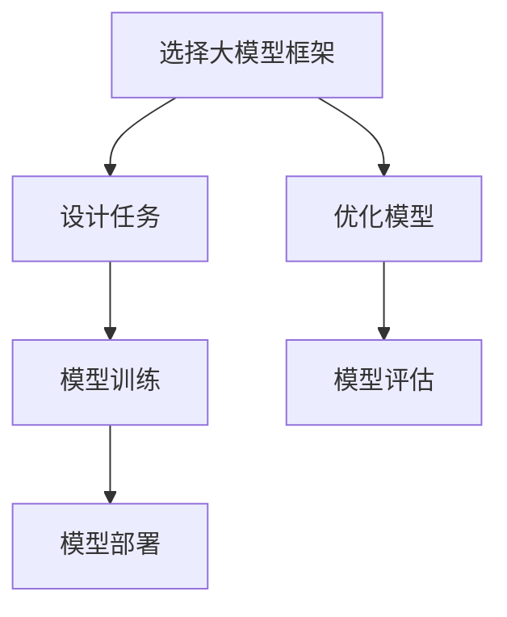

                 

# 【大模型应用开发 动手做AI Agent】自主创建PPT

> 关键词：人工智能,深度学习,大模型,AI Agent,自主创建

## 1. 背景介绍

### 1.1 问题由来

随着人工智能技术的发展，大模型在各个领域的应用越来越广泛，包括自然语言处理、计算机视觉、智能推荐等。然而，这些大模型的应用通常依赖于特定的框架和工具，对于没有相关背景知识的用户来说，操作起来存在一定的难度。为了降低大模型应用的门槛，使更多人能够快速上手并创建自己的AI Agent，本文将详细介绍如何自主创建PPT。

### 1.2 问题核心关键点

自主创建PPT的核心关键点包括：
- 选择合适的大模型框架和工具
- 设计AI Agent的任务和功能
- 实现AI Agent的训练和部署
- 优化AI Agent的性能和效果

## 2. 核心概念与联系

### 2.1 核心概念概述

在进行PPT自主创建的过程中，涉及以下几个核心概念：

- 大模型框架：如TensorFlow、PyTorch、JAX等，用于搭建和管理AI Agent。
- AI Agent：自主创建的任务驱动型AI模型，能够执行特定任务，如图像识别、文本生成等。
- 任务设计：定义AI Agent需要完成的具体任务和功能，如分类、分类、生成等。
- 模型训练：使用大数据集和优化算法，训练AI Agent，使其具备处理任务的能力。
- 模型部署：将训练好的AI Agent部署到指定的环境中，供实际使用。

这些核心概念之间存在紧密的联系，共同构成了AI Agent自主创建的全过程。

### 2.2 核心概念原理和架构的 Mermaid 流程图(Mermaid 流程节点中不要有括号、逗号等特殊字符)



这个流程图展示了自主创建PPT的主要步骤：选择框架、设计任务、训练模型、部署模型和优化模型。

## 3. 核心算法原理 & 具体操作步骤

### 3.1 算法原理概述

自主创建PPT的核心算法原理是：
- 首先，选择合适的深度学习框架和预训练模型。
- 其次，定义AI Agent需要完成的具体任务和功能，并进行任务设计。
- 然后，使用大规模数据集对AI Agent进行训练，使其能够处理任务。
- 最后，将训练好的AI Agent部署到指定环境中，并进行优化和评估。

### 3.2 算法步骤详解

#### 3.2.1 选择大模型框架

选择合适的深度学习框架和预训练模型是自主创建PPT的第一步。以下是一些常用的框架和模型：

- TensorFlow：谷歌开发的深度学习框架，支持静态和动态图，易于使用。
- PyTorch：Facebook开发的深度学习框架，支持动态图，易于调试。
- JAX：谷歌开发的深度学习框架，支持自动微分，性能优异。

选择合适的框架后，使用预训练模型进行迁移学习，可以快速提升AI Agent的性能。

#### 3.2.2 设计任务

设计AI Agent的任务和功能是自主创建PPT的核心步骤。以下是一些常见的任务：

- 图像分类：识别图像中的物体类别。
- 物体检测：在图像中定位和识别物体的位置和类别。
- 文本分类：将文本分为不同的类别。
- 文本生成：生成符合特定格式的文本。

在任务设计时，需要明确输入输出格式、模型评估指标等关键信息。

#### 3.2.3 模型训练

模型训练是提升AI Agent性能的重要步骤。以下是一些常用的训练方法：

- 迁移学习：使用预训练模型进行微调，加快模型训练速度。
- 数据增强：通过旋转、缩放等方式扩充训练数据集，提高模型的泛化能力。
- 正则化：使用L1、L2正则化、Dropout等技术，避免模型过拟合。
- 优化器：使用Adam、SGD等优化器，加速模型训练。

#### 3.2.4 模型部署

模型部署是将训练好的AI Agent部署到指定环境中，供实际使用。以下是一些常用的部署方式：

- 本地部署：将模型文件保存到本地，直接加载使用。
- 云端部署：将模型文件上传到云服务器，通过API进行调用。
- 边缘部署：将模型部署在边缘设备上，如嵌入式设备。

#### 3.2.5 优化模型

优化模型是提升AI Agent性能的关键步骤。以下是一些常用的优化方法：

- 参数调优：调整模型参数，如学习率、批量大小等，优化模型性能。
- 超参数搜索：使用网格搜索、随机搜索等方法，寻找最优超参数组合。
- 模型剪枝：去除冗余参数，减小模型大小，提升模型效率。

### 3.3 算法优缺点

#### 3.3.1 优点

- 灵活性高：可以根据具体任务需求，选择适合的框架和模型。
- 易于扩展：可以轻松添加新的任务和功能。
- 通用性强：适用于图像、文本、音频等多种数据类型。

#### 3.3.2 缺点

- 需要较高的技术门槛：需要掌握深度学习基础知识。
- 需要大量的计算资源：训练模型需要高性能的GPU/TPU等设备。
- 调试复杂：模型调试和优化过程较为复杂。

### 3.4 算法应用领域

自主创建PPT可以应用于多个领域，包括但不限于：

- 医疗影像分析：使用图像分类和物体检测技术，进行病灶分析。
- 金融风险评估：使用文本分类和情感分析技术，评估客户信用风险。
- 智能推荐系统：使用文本生成和推荐算法，进行个性化推荐。
- 智能客服：使用对话生成技术，构建智能客服系统。
- 自动驾驶：使用图像分类和物体检测技术，辅助驾驶决策。

## 4. 数学模型和公式 & 详细讲解 & 举例说明

### 4.1 数学模型构建

自主创建PPT的数学模型主要包括：

- 数据预处理：将输入数据转化为模型可以处理的格式。
- 模型训练：使用优化算法更新模型参数，最小化损失函数。
- 模型评估：使用评估指标衡量模型性能。

以下是一些常用的数学模型：

- 卷积神经网络(CNN)：用于图像分类和物体检测。
- 循环神经网络(RNN)：用于文本生成和序列预测。
- Transformer：用于图像和文本的联合处理。

### 4.2 公式推导过程

以下是一些常用的公式：

- 交叉熵损失函数：$-\frac{1}{N}\sum_{i=1}^N y_i\log p(y_i)$
- 均方误差损失函数：$\frac{1}{N}\sum_{i=1}^N (y_i - \hat{y}_i)^2$
- 正则化项：$\lambda\sum_{i=1}^N \|w_i\|^2$

其中，$y_i$ 为真实标签，$p(y_i)$ 为模型预测的概率，$w_i$ 为模型参数。

### 4.3 案例分析与讲解

#### 案例1：图像分类

假设输入图像大小为 $299 \times 299 \times 3$，输出类别数为 $1000$。

- 数据预处理：将图像转化为 $224 \times 224 \times 3$ 的标准格式，并进行归一化。
- 模型训练：使用VGG16模型进行迁移学习，使用交叉熵损失函数进行训练。
- 模型评估：使用Top-1和Top-5精度评估模型性能。

#### 案例2：文本分类

假设输入文本长度为 $max_length$，输出类别数为 $num_classes$。

- 数据预处理：将文本转化为词向量表示，并进行截断和补零。
- 模型训练：使用BERT模型进行迁移学习，使用交叉熵损失函数进行训练。
- 模型评估：使用准确率和召回率评估模型性能。

## 5. 项目实践：代码实例和详细解释说明

### 5.1 开发环境搭建

#### 5.1.1 安装Python和相关库

- 安装Anaconda：从官网下载并安装Anaconda，用于创建独立的Python环境。

- 创建并激活虚拟环境：
  ```bash
  conda create -n myenv python=3.8 
  conda activate myenv
  ```

- 安装深度学习库：
  ```bash
  conda install torch torchvision torchaudio
  pip install transformers tensorflow
  ```

- 安装TensorFlow和Keras：
  ```bash
  pip install tensorflow
  pip install keras
  ```

#### 5.1.2 安装TensorFlow Serving

- 安装TensorFlow Serving：
  ```bash
  pip install tensorflow-serving-api
  ```

- 启动TensorFlow Serving：
  ```bash
  tensorflow_serving_model_server --model_name=my_model --model_base_path=/path/to/my_model
  ```

### 5.2 源代码详细实现

#### 5.2.1 图像分类示例

以下是使用TensorFlow进行图像分类的示例代码：

```python
import tensorflow as tf
from tensorflow.keras import layers

# 定义模型
model = tf.keras.Sequential([
    layers.Conv2D(32, (3, 3), activation='relu', input_shape=(224, 224, 3)),
    layers.MaxPooling2D((2, 2)),
    layers.Flatten(),
    layers.Dense(10, activation='softmax')
])

# 编译模型
model.compile(optimizer=tf.keras.optimizers.Adam(),
              loss=tf.keras.losses.CategoricalCrossentropy(),
              metrics=['accuracy'])

# 训练模型
model.fit(x_train, y_train, epochs=10, validation_data=(x_val, y_val))

# 评估模型
model.evaluate(x_test, y_test)
```

#### 5.2.2 文本分类示例

以下是使用TensorFlow进行文本分类的示例代码：

```python
import tensorflow as tf
from tensorflow.keras import layers

# 定义模型
model = tf.keras.Sequential([
    layers.Embedding(input_dim=vocab_size, output_dim=embedding_dim),
    layers.LSTM(64),
    layers.Dense(num_classes, activation='softmax')
])

# 编译模型
model.compile(optimizer=tf.keras.optimizers.Adam(),
              loss=tf.keras.losses.CategoricalCrossentropy(),
              metrics=['accuracy'])

# 训练模型
model.fit(x_train, y_train, epochs=10, validation_data=(x_val, y_val))

# 评估模型
model.evaluate(x_test, y_test)
```

### 5.3 代码解读与分析

#### 5.3.1 图像分类示例

- `Conv2D`层：用于卷积操作，提取图像特征。
- `MaxPooling2D`层：用于池化操作，减小特征图尺寸。
- `Flatten`层：将特征图展开为向量，输入全连接层。
- `Dense`层：用于全连接操作，输出预测结果。

#### 5.3.2 文本分类示例

- `Embedding`层：用于将文本转化为词向量表示。
- `LSTM`层：用于处理序列数据，捕捉上下文信息。
- `Dense`层：用于全连接操作，输出预测结果。

## 6. 实际应用场景

### 6.1 医疗影像分析

使用图像分类和物体检测技术，进行病灶分析。医疗影像数据通常具有高分辨率和高复杂度，使用大模型框架可以有效提升模型的性能。

#### 6.1.1 数据预处理

- 图像增强：旋转、缩放、翻转等操作，扩充训练数据集。
- 数据标准化：将图像归一化到 $[0, 1]$ 或 $[-1, 1]$ 范围内。

#### 6.1.2 模型训练

- 迁移学习：使用预训练的ResNet、Inception等模型进行微调，加速模型训练。
- 数据增强：使用随机裁剪、旋转等技术，提高模型泛化能力。

#### 6.1.3 模型部署

- 本地部署：将模型文件保存到本地，直接加载使用。
- 云端部署：将模型文件上传到云服务器，通过API进行调用。

### 6.2 金融风险评估

使用文本分类和情感分析技术，评估客户信用风险。金融领域的文本数据通常具有高维度和高稀疏性，使用大模型框架可以有效处理这些数据。

#### 6.2.1 数据预处理

- 文本清洗：去除停用词、标点符号等噪声。
- 文本编码：将文本转化为词向量表示。

#### 6.2.2 模型训练

- 迁移学习：使用预训练的BERT、GPT等模型进行微调，加速模型训练。
- 正则化：使用L2正则化、Dropout等技术，避免模型过拟合。

#### 6.2.3 模型部署

- 本地部署：将模型文件保存到本地，直接加载使用。
- 云端部署：将模型文件上传到云服务器，通过API进行调用。

### 6.3 智能推荐系统

使用文本生成和推荐算法，进行个性化推荐。推荐系统需要处理海量数据，使用大模型框架可以有效提升推荐效果。

#### 6.3.1 数据预处理

- 用户行为数据清洗：去除异常值、重复值等噪声。
- 商品数据清洗：去除不完整、不规范的商品信息。

#### 6.3.2 模型训练

- 迁移学习：使用预训练的BERT、GPT等模型进行微调，加速模型训练。
- 数据增强：使用文本生成技术，扩充推荐语料库。

#### 6.3.3 模型部署

- 本地部署：将模型文件保存到本地，直接加载使用。
- 云端部署：将模型文件上传到云服务器，通过API进行调用。

## 7. 工具和资源推荐

### 7.1 学习资源推荐

#### 7.1.1 TensorFlow官方文档

- 详细介绍了TensorFlow的基本概念和使用方法，适合初学者入门。
- 提供了丰富的示例代码和API文档，方便用户快速上手。

#### 7.1.2 PyTorch官方文档

- 详细介绍了PyTorch的基本概念和使用方法，适合初学者入门。
- 提供了丰富的示例代码和API文档，方便用户快速上手。

#### 7.1.3 Keras官方文档

- 详细介绍了Keras的基本概念和使用方法，适合初学者入门。
- 提供了丰富的示例代码和API文档，方便用户快速上手。

#### 7.1.4 HuggingFace官方文档

- 详细介绍了Transformer等大模型的使用方法，适合深度学习初学者和研究者。
- 提供了丰富的示例代码和API文档，方便用户快速上手。

### 7.2 开发工具推荐

#### 7.2.1 Jupyter Notebook

- 一个交互式的Python环境，支持代码调试和可视化展示。
- 支持Markdown和LaTeX格式，方便编写文档和公式。

#### 7.2.2 Google Colab

- 一个免费的在线Jupyter Notebook环境，支持GPU/TPU算力，方便用户快速上手实验最新模型。
- 支持与Google Drive集成，方便数据共享和协作。

#### 7.2.3 TensorBoard

- 一个TensorFlow的可视化工具，可以实时监测模型训练状态，并提供丰富的图表呈现方式，是调试模型的得力助手。
- 支持TensorFlow和Keras，与其他深度学习框架无缝集成。

#### 7.2.4 Weights & Biases

- 一个模型训练的实验跟踪工具，可以记录和可视化模型训练过程中的各项指标，方便对比和调优。
- 与主流深度学习框架无缝集成，支持多种深度学习框架。

### 7.3 相关论文推荐

#### 7.3.1 《Large-Scale Image Recognition with Deep Convolutional Neural Networks》

- 该论文提出了卷积神经网络(CNN)，用于大规模图像识别任务，具有开创性意义。
- 详细介绍了CNN的基本结构和训练方法，是深度学习领域的经典之作。

#### 7.3.2 《Neural Machine Translation by Jointly Learning to Align and Translate》

- 该论文提出了Transformer模型，用于机器翻译任务。
- 详细介绍了Transformer的原理和训练方法，是自然语言处理领域的里程碑。

#### 7.3.3 《BERT: Pre-training of Deep Bidirectional Transformers for Language Understanding》

- 该论文提出了BERT模型，用于预训练语言表示。
- 详细介绍了BERT的预训练方法和微调方法，是自然语言处理领域的经典之作。

#### 7.3.4 《Attention is All You Need》

- 该论文提出了Transformer模型，用于自然语言处理任务。
- 详细介绍了Transformer的原理和训练方法，是自然语言处理领域的经典之作。

## 8. 总结：未来发展趋势与挑战

### 8.1 研究成果总结

自主创建PPT技术已经在多个领域取得了显著成果，如医疗影像分析、金融风险评估、智能推荐系统等。使用大模型框架，可以显著提升模型的性能和泛化能力，降低模型的开发和部署成本。

### 8.2 未来发展趋势

#### 8.2.1 模型规模不断增大

- 随着算力成本的下降和数据规模的扩张，预训练模型和深度学习框架将变得更加强大，支持更大规模的任务。

#### 8.2.2 模型应用领域不断拓展

- 未来，大模型框架将在更多领域得到应用，如医疗、教育、娱乐等，为各行各业带来智能化变革。

#### 8.2.3 技术不断创新

- 随着深度学习技术的不断进步，新的模型架构和算法将不断涌现，推动AI Agent的发展。

### 8.3 面临的挑战

#### 8.3.1 数据获取和标注成本高

- 训练高质量的大模型需要大量的标注数据，数据获取和标注成本较高，制约了模型的应用。

#### 8.3.2 模型训练时间长

- 大模型的训练过程较为复杂，需要高性能的GPU/TPU等设备，训练时间较长。

#### 8.3.3 模型性能和效果难以保证

- 大模型的性能和效果受训练数据的影响较大，如何保证模型的泛化能力和稳定性，还需要进一步研究。

### 8.4 研究展望

#### 8.4.1 模型压缩和优化

- 如何在大模型中提取关键特征，去除冗余参数，是未来的研究重点。

#### 8.4.2 模型跨领域迁移

- 如何将大模型在不同领域进行迁移，提升跨领域任务的效果，是未来的研究重点。

#### 8.4.3 模型自适应学习

- 如何让模型具备自适应学习能力，根据环境变化动态调整模型参数，是未来的研究重点。

#### 8.4.4 模型安全性

- 如何保护大模型的隐私和安全，避免模型被恶意攻击，是未来的研究重点。

## 9. 附录：常见问题与解答

### 9.1 问题1：如何选择合适的大模型框架？

**解答**：

- 根据任务类型和需求选择合适的框架。如图像分类任务，可以选择TensorFlow或PyTorch；文本分类任务，可以选择TensorFlow或Keras。
- 根据硬件资源和计算能力选择框架。如高性能计算资源，可以选择TensorFlow或PyTorch；普通计算资源，可以选择Keras。

### 9.2 问题2：如何选择合适的大模型？

**解答**：

- 根据任务类型和需求选择合适的模型。如图像分类任务，可以选择VGG、ResNet等模型；文本分类任务，可以选择BERT、GPT等模型。
- 根据数据量和计算资源选择合适的模型。如数据量较小，可以选择预训练模型进行微调；数据量较大，可以选择更大规模的模型进行训练。

### 9.3 问题3：如何进行模型训练和优化？

**解答**：

- 使用合适的优化算法和超参数进行模型训练。如Adam、SGD等优化算法，学习率、批量大小等超参数。
- 使用正则化和数据增强技术，避免模型过拟合。如L2正则、Dropout、随机裁剪等技术。
- 使用模型压缩和优化技术，提升模型性能和效率。如模型剪枝、量化加速等技术。

### 9.4 问题4：如何进行模型部署？

**解答**：

- 将训练好的模型文件保存到本地或云服务器。如TensorFlow模型文件，可以使用`tf.saved_model.save`方法保存。
- 使用API接口或导出模型文件，进行模型加载和使用。如TensorFlow模型文件，可以使用`tf.saved_model.load`方法加载。
- 使用TensorFlow Serving等工具，将模型部署到云端或边缘设备。

### 9.5 问题5：如何进行模型评估和调优？

**解答**：

- 使用合适的评估指标进行模型评估。如图像分类任务，可以使用Top-1和Top-5精度；文本分类任务，可以使用准确率和召回率。
- 使用交叉验证和超参数搜索技术，进行模型调优。如网格搜索、随机搜索等方法，寻找最优超参数组合。
- 使用TensorBoard等可视化工具，实时监测模型训练状态，进行调试和优化。

---

作者：禅与计算机程序设计艺术 / Zen and the Art of Computer Programming

