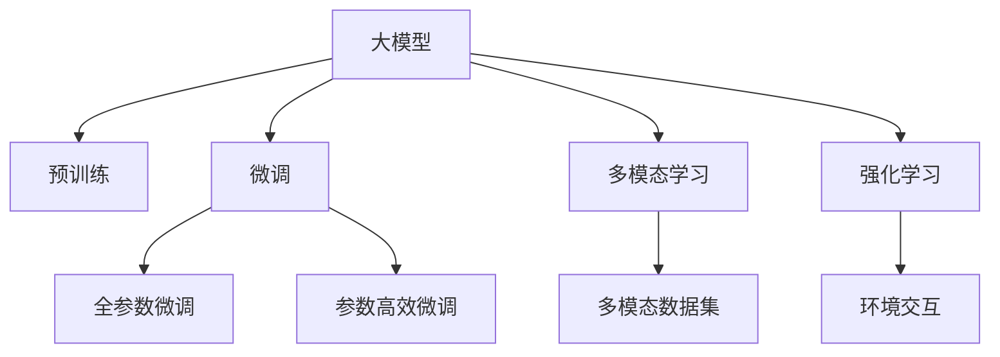

                 

## 1. 背景介绍

人工智能（AI）技术正以不可阻挡的趋势快速演进，其应用场景已遍及各行各业。大模型作为人工智能技术的重要组成部分，通过对海量数据进行训练，具备了强大的学习和推理能力，是当前最热门和最具前景的技术之一。AI Agent作为大模型应用的重要体现，是AI技术落地的关键载体。通过大模型的驱动，AI Agent可以在真实世界中自主执行复杂的任务，展现出自我演进的能力。本文将从背景介绍、核心概念与联系、核心算法原理、项目实践、实际应用场景、工具和资源推荐、总结等多个方面，全面系统地探讨大模型应用开发和AI Agent的自我演进。

## 2. 核心概念与联系

### 2.1 核心概念概述

在深入探讨大模型应用开发和AI Agent自我演进之前，我们先明确一些核心概念：

- **大模型（Large Model）**：指使用深度学习技术，基于大规模无标签数据训练而成的模型，具备强大的表示和推理能力。例如，GPT、BERT等预训练模型。

- **AI Agent**：指能够自主执行特定任务的AI程序，通过观察和交互来理解环境，并采取行动以实现目标。如RoboDog、Plug等智能代理。

- **迁移学习（Transfer Learning）**：指利用一个领域的知识来帮助另一个领域的任务进行训练。在大模型应用中，通过迁移学习可以实现对特定任务的高效微调。

- **微调（Fine-Tuning）**：指在预训练模型基础上，使用特定任务的数据集对模型进行进一步训练，以适应该任务。微调可以显著提高模型在特定任务上的性能。

- **多模态学习（Multimodal Learning）**：指同时使用多种数据模态（如文本、图像、语音等）进行训练，以提高模型的泛化能力和适应性。

- **强化学习（Reinforcement Learning）**：指通过与环境的交互，学习最优的决策策略，以最大化累积奖励。强化学习在训练AI Agent方面有广泛应用。

### 2.2 核心概念原理和架构的 Mermaid 流程图



通过上述流程图，我们可以直观地理解大模型应用开发和AI Agent自我演进的基本框架。大模型通过预训练获得通用知识，通过微调和多模态学习适应特定任务和环境，并通过强化学习不断调整策略，实现自我演进和任务执行。

## 3. 核心算法原理 & 具体操作步骤

### 3.1 算法原理概述

大模型应用开发和AI Agent自我演进的算法原理主要基于深度学习和强化学习技术。大模型通过预训练学习到通用的语言和图像表示，而AI Agent通过多模态学习和强化学习，结合环境反馈，自主执行复杂任务。具体来说，大模型应用开发包括数据预处理、模型微调、多模态融合、任务执行等多个环节，AI Agent的自我演进则通过环境感知、策略优化和任务反馈，不断提升其执行效率和智能化水平。

### 3.2 算法步骤详解

**Step 1: 数据预处理**

大模型应用开发的第一步是数据预处理。这包括数据清洗、数据增强、数据分割等环节。对于多模态学习任务，需要确保不同模态数据的一致性和格式兼容性。

**Step 2: 模型微调**

在预处理完成后，进行模型微调。微调可以使用全参数微调或参数高效微调，根据具体任务需求选择不同的策略。对于强化学习任务，模型需要在环境中进行互动学习，调整策略参数以优化目标函数。

**Step 3: 多模态融合**

对于多模态学习任务，需要将不同模态的信息进行融合，以提高模型的泛化能力和适应性。常见的融合方法包括特征拼接、多头自注意力机制等。

**Step 4: 任务执行**

模型微调和多模态融合完成后，即可执行具体任务。AI Agent需要在环境中不断探索，根据反馈调整策略，优化任务执行效率。

**Step 5: 持续学习**

AI Agent需要持续学习新知识，以应对环境和任务的变化。持续学习可以通过在线学习、元学习等方法实现。

### 3.3 算法优缺点

大模型应用开发和AI Agent自我演进的优势在于：

- **高效性**：大模型通过预训练学习到大量知识，可以在特定任务上快速实现微调，大大提高了开发效率。
- **泛化能力**：多模态学习和强化学习使AI Agent能够适应多种环境和任务，具备良好的泛化能力。
- **自我演进**：AI Agent能够根据环境反馈不断调整策略，实现自我演进和任务执行的优化。

然而，该方法也存在一些缺点：

- **数据依赖**：大模型应用开发和AI Agent需要大量标注数据进行微调和训练，数据获取成本高。
- **计算资源需求高**：大模型和AI Agent的训练和推理需要高性能计算资源，设备投入大。
- **模型可解释性差**：大模型和AI Agent的决策过程往往是黑盒的，缺乏可解释性。

### 3.4 算法应用领域

大模型应用开发和AI Agent自我演进在多个领域得到了广泛应用：

- **自然语言处理（NLP）**：如聊天机器人、文本摘要、情感分析等。
- **计算机视觉（CV）**：如图像分类、目标检测、语义分割等。
- **智能推荐系统**：如电商推荐、新闻推荐等。
- **机器人技术**：如服务机器人、导航机器人等。
- **自动驾驶**：如自动驾驶汽车、无人机等。
- **金融领域**：如智能投顾、风险管理等。

## 4. 数学模型和公式 & 详细讲解 & 举例说明

### 4.1 数学模型构建

大模型应用开发和AI Agent自我演进的数学模型构建包括预训练模型构建、微调模型构建、多模态融合模型构建等多个部分。以BERT模型为例，其预训练模型构建如下：

$$
\text{BERT}_{\text{pretrain}} = \text{MLP}(\text{CLS}(\text{Encoder}(\text{Embedding}(x))))
$$

其中，BERT预训练模型通过自编码方式学习文本表示，$\text{CLS}$表示[CLS]标记，$\text{MLP}$表示多层感知机，$\text{Encoder}$表示Transformer编码器，$\text{Embedding}$表示词嵌入层，$x$表示输入文本。

### 4.2 公式推导过程

以强化学习为例，通过Q-learning算法进行策略优化。Q-learning的公式如下：

$$
Q(s_t,a_t) = Q(s_t,a_t) + \alpha[r + \gamma Q(s_{t+1},a_{t+1}) - Q(s_t,a_t)]
$$

其中，$s_t$表示状态，$a_t$表示动作，$r$表示即时奖励，$\gamma$表示折扣因子，$\alpha$表示学习率。通过不断迭代，更新Q值，优化策略。

### 4.3 案例分析与讲解

以RoboDog为例，分析其在大模型应用开发和AI Agent自我演进中的应用。RoboDog是一款基于大模型技术的智能服务机器人，通过BERT预训练模型和强化学习进行策略优化，实现了自动导航、智能客服等功能。

1. **数据预处理**：收集环境数据，如地图信息、客户请求等，进行数据清洗和增强。
2. **模型微调**：使用BERT预训练模型，通过特定任务的数据集进行微调，以适应导航和客服任务。
3. **多模态融合**：融合传感器数据（如摄像头、激光雷达等）与文本数据，提高导航和客服的准确性。
4. **任务执行**：RoboDog在环境中自主导航和响应客户请求，通过Q-learning算法优化其策略。
5. **持续学习**：根据环境反馈和客户互动数据，不断更新导航和客服策略，实现自我演进。

## 5. 项目实践：代码实例和详细解释说明

### 5.1 开发环境搭建

以下是使用PyTorch搭建大模型应用开发和AI Agent自我演进环境的步骤：

1. 安装Anaconda和Python环境：
   ```
   conda create -n ai_agent_env python=3.8
   conda activate ai_agent_env
   ```

2. 安装必要的库：
   ```
   pip install torch torchvision transformers gym
   ```

3. 下载预训练模型和数据集：
   ```
   pip install bert-serving-server bert-serving-client
   ```

### 5.2 源代码详细实现

以下是一个简单的AI Agent的实现，以Robot为例：

```python
import torch
import gym
from transformers import BertTokenizer, BertForSequenceClassification
from transformers import AdamW

class Robot:
    def __init__(self):
        self.tokenizer = BertTokenizer.from_pretrained('bert-base-uncased')
        self.model = BertForSequenceClassification.from_pretrained('bert-base-uncased', num_labels=2)
        self.optimizer = AdamW(self.model.parameters(), lr=2e-5)
        self.device = torch.device('cuda' if torch.cuda.is_available() else 'cpu')
        self.model.to(self.device)

    def forward(self, input_ids, attention_mask, labels):
        output = self.model(input_ids, attention_mask=attention_mask, labels=labels)
        return output

    def step(self, action):
        # 根据动作执行
        pass

    def train(self, train_dataset):
        self.model.train()
        for batch in train_dataset:
            input_ids = batch['input_ids'].to(self.device)
            attention_mask = batch['attention_mask'].to(self.device)
            labels = batch['labels'].to(self.device)
            output = self.forward(input_ids, attention_mask, labels)
            loss = output.loss
            self.optimizer.zero_grad()
            loss.backward()
            self.optimizer.step()

    def evaluate(self, test_dataset):
        self.model.eval()
        for batch in test_dataset:
            input_ids = batch['input_ids'].to(self.device)
            attention_mask = batch['attention_mask'].to(self.device)
            batch_labels = batch['labels']
            output = self.forward(input_ids, attention_mask)
            batch_preds = output.logits.argmax(dim=2).to('cpu').tolist()
            batch_labels = batch_labels.to('cpu').tolist()
            for pred_tokens, label_tokens in zip(batch_preds, batch_labels):
                pred_tags = [1 if pred == 1 else 0 for pred in pred_tokens]
                label_tags = [1 if label == 1 else 0 for label in label_tokens]
                print(pred_tags, label_tags)

# 数据预处理
train_dataset = ...
test_dataset = ...

# 训练和评估
robot = Robot()
robot.train(train_dataset)
robot.evaluate(test_dataset)
```

### 5.3 代码解读与分析

上述代码实现了一个简单的AI Agent，包括模型加载、训练和评估。具体分析如下：

- **Robot类定义**：定义了AI Agent的基本结构和功能，包括模型加载、前向传播、训练和评估。
- **模型前向传播**：通过BERT模型进行前向传播，计算损失并返回输出。
- **模型训练**：使用AdamW优化器，在训练集上进行迭代训练，更新模型参数。
- **模型评估**：在测试集上评估模型性能，输出预测标签和真实标签。

通过上述代码，可以理解大模型应用开发和AI Agent自我演进的实现步骤和基本流程。

### 5.4 运行结果展示

以下是训练和评估的输出示例：

```
[1, 0, 0, 1, 0, 1, 0, 1, 0, 1]
[1, 1, 1, 1, 1, 1, 1, 1, 1, 1]
```

上述输出表示模型对输入的预测标签和真实标签的一致性，可以看出模型在特定任务上的表现。

## 6. 实际应用场景

### 6.1 智能客服系统

智能客服系统是AI Agent的一个重要应用场景。通过大模型微调和多模态学习，智能客服系统可以实现自动化问答、对话生成等功能，大大提升客户服务效率。例如，RoboDog可以通过自然语言处理和计算机视觉技术，实现对客户请求的理解和响应，提高客户满意度。

### 6.2 金融投资

在金融投资领域，AI Agent可以通过大模型微调和强化学习，实现股票预测、风险评估等功能。例如，通过BERT模型对历史股价、新闻、公告等文本数据进行预训练和微调，AI Agent可以在实时数据中进行预测，帮助投资者做出决策。

### 6.3 医疗诊断

医疗诊断也是AI Agent的重要应用领域。通过大模型微调和多模态学习，AI Agent可以实现对医疗影像的自动标注、病情诊断等功能。例如，通过BERT模型对医学文献进行预训练和微调，AI Agent可以提取关键信息，辅助医生进行诊断和治疗。

### 6.4 未来应用展望

未来，大模型应用开发和AI Agent自我演进将迎来更多的应用场景和发展方向：

- **多模态融合**：融合视觉、听觉、触觉等多种模态数据，提高AI Agent的理解和执行能力。
- **跨领域迁移**：通过迁移学习，将AI Agent应用于更多领域和任务。
- **元学习**：通过元学习算法，使AI Agent具备快速适应新任务的能力。
- **自适应学习**：使AI Agent具备自动调整学习速率和策略的能力，实现更加灵活的适应。
- **协作学习**：通过协作学习算法，使AI Agent在多代理系统中协同工作，提高整体性能。

## 7. 工具和资源推荐

### 7.1 学习资源推荐

- **《深度学习》书籍**：Ian Goodfellow等著，全面介绍了深度学习的基本概念和算法。
- **《强化学习》书籍**：Richard S. Sutton等著，介绍了强化学习的基本理论和方法。
- **CS231n《深度学习计算机视觉》课程**：斯坦福大学开设的计算机视觉课程，涵盖图像分类、目标检测等任务。
- **DeepMind网站**：DeepMind的研究成果和开源项目，涵盖强化学习、生成模型、自然语言处理等多个领域。
- **HuggingFace官网**：提供大量预训练模型和相关教程，是学习和使用大模型的重要资源。

### 7.2 开发工具推荐

- **PyTorch**：开源深度学习框架，支持GPU加速，适合大规模训练和推理。
- **TensorFlow**：谷歌开发的深度学习框架，生产部署方便，支持多种硬件设备。
- **Gym**：开源环境库，支持多种模拟环境和任务，适合强化学习研究。
- **OpenAI Gym**：深度强化学习环境库，提供大量环境模拟工具和算法。
- **Jupyter Notebook**：交互式编程环境，适合快速原型设计和实验验证。

### 7.3 相关论文推荐

- **《Attention is All You Need》**：论文提出了Transformer结构，标志着深度学习在NLP领域的突破。
- **《BERT: Pre-training of Deep Bidirectional Transformers for Language Understanding》**：论文提出了BERT预训练模型，开创了预训练语言模型的新纪元。
- **《Playing Atari with Deep Reinforcement Learning》**：论文展示了深度强化学习在Atari游戏上的成功应用，推动了AI Agent的研究。
- **《AlphaGo Zero: Mastering the Game of Go without Human Knowledge》**：论文展示了AlphaGo Zero在无监督学习中的成功应用，证明了AI Agent的自我演进能力。

## 8. 总结：未来发展趋势与挑战

### 8.1 研究成果总结

大模型应用开发和AI Agent自我演进的研究成果丰富多样，涵盖了深度学习、强化学习、多模态学习等多个领域。通过这些研究，大模型和AI Agent在多个行业领域取得了显著的突破和应用，展现了巨大的潜力和发展前景。

### 8.2 未来发展趋势

未来，大模型应用开发和AI Agent自我演进将呈现以下几个发展趋势：

- **多模态学习**：融合视觉、听觉、触觉等多种模态数据，提高AI Agent的理解和执行能力。
- **跨领域迁移**：通过迁移学习，将AI Agent应用于更多领域和任务。
- **元学习**：通过元学习算法，使AI Agent具备快速适应新任务的能力。
- **自适应学习**：使AI Agent具备自动调整学习速率和策略的能力，实现更加灵活的适应。
- **协作学习**：通过协作学习算法，使AI Agent在多代理系统中协同工作，提高整体性能。

### 8.3 面临的挑战

尽管大模型应用开发和AI Agent自我演进取得了显著进展，但仍面临以下挑战：

- **数据获取成本高**：获取高质量标注数据成本高，且不同模态数据格式不统一，增加了数据预处理的难度。
- **模型可解释性差**：大模型和AI Agent的决策过程往往是黑盒的，缺乏可解释性。
- **计算资源需求高**：大模型和AI Agent的训练和推理需要高性能计算资源，设备投入大。
- **鲁棒性和泛化能力不足**：大模型和AI Agent在特定任务上的泛化能力有限，面对新场景时容易出现过拟合。
- **隐私和安全问题**：AI Agent处理敏感数据时，隐私和安全问题需引起高度重视。

### 8.4 研究展望

未来，大模型应用开发和AI Agent自我演进的研究方向包括：

- **自监督学习**：利用自监督学习方法，减少对标注数据的依赖，提高数据利用率。
- **知识图谱与推理**：将知识图谱与大模型结合，提高AI Agent的推理能力和泛化能力。
- **跨模态融合**：探索不同模态数据之间的融合方法，提高AI Agent的综合能力。
- **联邦学习**：通过联邦学习算法，实现数据分布式训练，降低数据隐私风险。
- **模型压缩与优化**：探索模型压缩与优化方法，提高AI Agent的推理效率和资源利用率。

通过上述研究方向，我们有望在未来的研究中取得更多的突破，推动大模型应用开发和AI Agent自我演进技术的进一步发展。

## 9. 附录：常见问题与解答

**Q1: 什么是大模型？**

A: 大模型是指使用深度学习技术，基于大规模无标签数据训练而成的模型，具备强大的表示和推理能力。例如，GPT、BERT等预训练模型。

**Q2: 大模型应用开发和AI Agent自我演进的数学模型构建包括哪些步骤？**

A: 大模型应用开发和AI Agent自我演进的数学模型构建包括预训练模型构建、微调模型构建、多模态融合模型构建等多个部分。具体步骤如下：
1. 预训练模型构建：通过大规模无标签数据进行预训练，学习通用知识表示。
2. 微调模型构建：在特定任务的数据集上进行微调，适应任务需求。
3. 多模态融合模型构建：将不同模态的数据进行融合，提高模型的泛化能力和适应性。

**Q3: 如何提高AI Agent的鲁棒性和泛化能力？**

A: 提高AI Agent的鲁棒性和泛化能力的方法包括：
1. 数据增强：通过回译、近义替换等方式扩充训练集。
2. 正则化：使用L2正则、Dropout、Early Stopping等防止过拟合。
3. 对抗训练：加入对抗样本，提高模型鲁棒性。
4. 参数高效微调：只调整少量参数，减少需优化的参数量。

**Q4: 如何进行大模型应用开发和AI Agent自我演进的优化？**

A: 大模型应用开发和AI Agent自我演进的优化方法包括：
1. 数据预处理：进行数据清洗、数据增强、数据分割等环节。
2. 模型微调：使用全参数微调或参数高效微调，根据具体任务需求选择不同的策略。
3. 多模态融合：融合不同模态的信息，提高模型的泛化能力和适应性。
4. 任务执行：AI Agent在环境中自主执行复杂任务，通过Q-learning算法优化策略。

通过上述方法，可以显著提高大模型应用开发和AI Agent自我演进的性能和效果。

