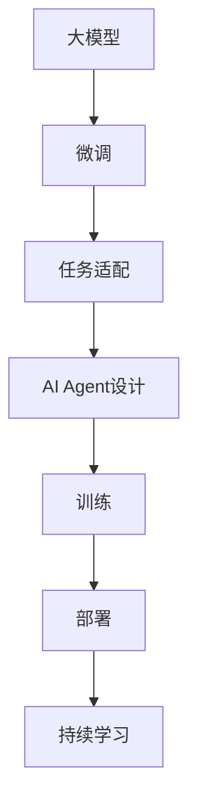

                 

# 【大模型应用开发 动手做AI Agent】计划与执行

## 1. 背景介绍

### 1.1 问题由来

近年来，随着人工智能(AI)技术的发展，大模型在自然语言处理(NLP)、计算机视觉、语音识别等领域的应用越来越广泛。大模型的预训练方法使得模型在处理大规模数据时表现出色，但直接应用于实际问题时，还需要根据具体场景进行微调和优化。

AI Agent（智能代理）作为大模型应用的典型代表，能够通过自主学习与环境互动，完成各种复杂任务。然而，开发一个高效、可控、可靠的AI Agent并非易事。本文将介绍一种针对大模型应用的开发计划，帮助开发者系统地构建、训练和部署AI Agent。

### 1.2 问题核心关键点

- **大模型应用开发**：涵盖从模型选择、数据准备、训练、评估到部署的全流程。
- **AI Agent设计与训练**：如何在特定场景中设计合适的Agent，并结合大模型进行训练。
- **跨领域应用**：如何将AI Agent应用于多个领域，如NLP、计算机视觉、语音识别等。
- **系统集成与优化**：如何将AI Agent集成到现有的业务系统中，并进行性能优化。
- **持续学习与适应**：如何让AI Agent在实际环境中持续学习并适应新情况。

### 1.3 问题研究意义

- **提升工作效率**：AI Agent能够自动化处理大量重复性工作，大幅提高工作效率。
- **降低开发成本**：预训练模型可以降低数据标注和模型训练成本。
- **增强决策支持**：AI Agent通过分析大量数据，提供更科学的决策建议。
- **提高用户体验**：AI Agent能够根据用户行为和偏好，提供个性化服务。
- **促进技术创新**：AI Agent的开发与应用，推动了AI技术在实际场景中的应用和普及。

## 2. 核心概念与联系

### 2.1 核心概念概述

- **大模型**：指在预训练过程中使用大规模数据训练得到的深度学习模型，如BERT、GPT-3等。
- **微调**：指在大模型基础上，针对特定任务进行进一步训练，以优化模型在该任务上的表现。
- **AI Agent**：指能够自主学习并执行特定任务的智能代理，如聊天机器人、推荐系统等。
- **任务适配**：指根据具体任务需求，调整模型结构和训练过程，使其能够更好地完成任务。
- **迁移学习**：指将一个领域学习到的知识，应用到另一个领域的学习范式。
- **持续学习**：指AI Agent在实际应用中不断学习新知识，以适应环境和任务的变化。

这些概念之间的联系可以通过以下Mermaid流程图来展示：



这个流程图展示了大模型应用的开发流程：从选择大模型开始，经过微调和任务适配，设计并训练AI Agent，最终部署到实际应用中，并在运行过程中不断学习。

## 3. 核心算法原理 & 具体操作步骤

### 3.1 算法原理概述

AI Agent的开发基于大模型应用的微调技术，旨在通过有监督的学习，提升模型在特定任务上的表现。以下是主要步骤：

1. **选择模型**：根据任务需求选择合适的预训练模型，如BERT、GPT-3等。
2. **数据准备**：收集并准备包含任务数据的数据集。
3. **微调**：在大模型基础上，使用任务数据进行微调，优化模型在该任务上的表现。
4. **任务适配**：调整模型结构和训练过程，使其能够更好地完成任务。
5. **集成与部署**：将训练好的AI Agent集成到实际应用中，并进行性能优化。
6. **持续学习**：在实际应用中，AI Agent不断学习新知识，以适应环境和任务的变化。

### 3.2 算法步骤详解

#### 3.2.1 选择模型

根据任务类型和数据量选择合适的预训练模型。例如，NLP任务可以选择BERT、GPT等，视觉任务可以选择ResNet、Inception等，语音任务可以选择Tacotron2、WaveNet等。

#### 3.2.2 数据准备

数据准备是AI Agent开发的关键步骤。具体步骤如下：

1. **数据收集**：根据任务需求收集相关数据，如文本、图像、音频等。
2. **数据清洗**：去除无关、噪声数据，确保数据质量。
3. **数据标注**：对数据进行标注，生成监督学习所需的训练集、验证集和测试集。
4. **数据增强**：通过旋转、缩放、裁剪等方式，扩充训练集数据，提高模型的鲁棒性。

#### 3.2.3 微调

微调过程包括模型初始化、模型训练和模型评估三个阶段。具体步骤如下：

1. **模型初始化**：将预训练模型加载到内存中，准备进行微调。
2. **模型训练**：使用任务数据对模型进行有监督训练，优化模型在该任务上的表现。
3. **模型评估**：在验证集和测试集上评估模型的性能，调整模型参数，直到达到最优性能。

#### 3.2.4 任务适配

任务适配主要通过调整模型结构和训练过程来实现。具体步骤如下：

1. **模型结构调整**：根据任务需求，调整模型结构，如增加或减少层数、修改激活函数等。
2. **损失函数设计**：根据任务类型设计合适的损失函数，如交叉熵损失、均方误差损失等。
3. **正则化技术**：引入正则化技术，如L2正则、Dropout等，防止过拟合。

#### 3.2.5 集成与部署

集成与部署是将训练好的AI Agent部署到实际应用中的过程。具体步骤如下：

1. **模型封装**：将训练好的模型封装为API接口，方便调用。
2. **系统集成**：将AI Agent集成到业务系统中，进行数据处理、推理等操作。
3. **性能优化**：根据业务需求，进行模型压缩、量化等优化操作，提升性能。

#### 3.2.6 持续学习

持续学习使AI Agent能够不断学习新知识，以适应环境和任务的变化。具体步骤如下：

1. **新数据收集**：定期收集新数据，用于更新模型。
2. **模型更新**：使用新数据对模型进行微调，更新模型参数。
3. **性能评估**：在新数据上评估模型性能，确保模型性能不下降。

### 3.3 算法优缺点

#### 3.3.1 优点

- **高效性**：利用预训练模型，能够快速训练AI Agent，减少数据标注和模型训练成本。
- **泛化能力强**：大模型已经在大规模数据上预训练，具有较强的泛化能力，能够在多种任务上表现出色。
- **可扩展性强**：AI Agent的设计和训练过程相对灵活，可以根据需求进行调整和优化。

#### 3.3.2 缺点

- **资源消耗大**：大模型通常需要大量的计算资源和存储资源，开发成本较高。
- **模型复杂**：大模型结构复杂，训练和推理过程需要较高的技术要求。
- **泛化能力有限**：当任务与预训练数据分布差异较大时，模型的泛化能力可能受限。

### 3.4 算法应用领域

AI Agent的应用领域非常广泛，包括但不限于以下几个方面：

- **NLP**：聊天机器人、智能客服、文本摘要、情感分析等。
- **计算机视觉**：图像分类、目标检测、图像生成、视频分析等。
- **语音识别**：语音转文本、语音合成、语音翻译等。
- **推荐系统**：个性化推荐、广告推荐等。
- **游戏AI**：自动游戏玩家、游戏策略生成等。
- **智能家居**：智能助手、设备控制等。

## 4. 数学模型和公式 & 详细讲解 & 举例说明

### 4.1 数学模型构建

以NLP任务为例，假设模型为$M_\theta$，其中$\theta$为模型参数。训练集为$D=\{(x_i, y_i)\}_{i=1}^N$，其中$x_i$为输入，$y_i$为标签。微调的优化目标为：

$$
\theta^* = \mathop{\arg\min}_{\theta} \mathcal{L}(\theta, D)
$$

其中$\mathcal{L}(\theta, D)$为损失函数，通常使用交叉熵损失：

$$
\mathcal{L}(\theta, D) = -\frac{1}{N} \sum_{i=1}^N \sum_{j=1}^C y_{ij} \log P_{\theta}(y_i|x_i)
$$

其中$y_{ij}$为标签的一热编码形式，$C$为类别数。

### 4.2 公式推导过程

以NLP任务的分类为例，假设模型输出为$M_\theta(x_i)$，其概率分布为$P_{\theta}(y_i|x_i)$。交叉熵损失函数可以表示为：

$$
\mathcal{L}(\theta, D) = -\frac{1}{N} \sum_{i=1}^N \sum_{j=1}^C y_{ij} \log P_{\theta}(y_i|x_i)
$$

其中$y_{ij}$为标签的一热编码形式，$C$为类别数。

### 4.3 案例分析与讲解

以情感分析为例，假设模型输出为$M_\theta(x_i)$，其中$x_i$为输入文本。模型的输出为一个概率分布，表示文本属于正面情感、负面情感和中性情感的概率。交叉熵损失函数可以表示为：

$$
\mathcal{L}(\theta, D) = -\frac{1}{N} \sum_{i=1}^N \log P_{\theta}(y_i|x_i)
$$

其中$y_i$为文本的情感标签，$P_{\theta}(y_i|x_i)$为模型输出的概率分布。

## 5. 项目实践：代码实例和详细解释说明

### 5.1 开发环境搭建

开发环境搭建主要包括以下步骤：

1. **安装Python**：选择并安装Python 3.x版本。
2. **安装PyTorch**：使用pip安装PyTorch，并配置好GPU加速。
3. **安装TensorFlow**：使用pip安装TensorFlow，并配置好GPU加速。
4. **安装Transformers库**：使用pip安装Transformers库。
5. **安装其他工具包**：安装numpy、pandas、scikit-learn、matplotlib、tqdm、jupyter notebook、ipython等工具包。

### 5.2 源代码详细实现

以下是一个使用PyTorch实现AI Agent的示例代码：

```python
import torch
import torch.nn as nn
import torch.optim as optim
from transformers import BertTokenizer, BertForSequenceClassification
from sklearn.metrics import accuracy_score

# 定义模型
class BertClassifier(nn.Module):
    def __init__(self, num_labels=2):
        super(BertClassifier, self).__init__()
        self.bert = BertForSequenceClassification.from_pretrained('bert-base-uncased', num_labels=num_labels)
        self.dropout = nn.Dropout(0.1)
        self.fc = nn.Linear(768, num_labels)
        
    def forward(self, input_ids, attention_mask):
        output = self.bert(input_ids, attention_mask=attention_mask)
        output = self.dropout(output)
        output = self.fc(output[0])
        return output

# 定义数据处理函数
def prepare_data():
    tokenizer = BertTokenizer.from_pretrained('bert-base-uncased')
    train_data = load_train_data()
    train_input_ids = tokenizer.encode(train_data['text'], add_special_tokens=True, return_tensors='pt')
    train_labels = torch.tensor(train_data['label'], dtype=torch.long)
    return train_input_ids, train_labels

# 定义训练函数
def train(model, train_input_ids, train_labels, num_epochs=3, batch_size=16):
    optimizer = optim.Adam(model.parameters(), lr=1e-5)
    for epoch in range(num_epochs):
        model.train()
        for i in range(0, len(train_input_ids), batch_size):
            input_ids = train_input_ids[i:i+batch_size]
            attention_mask = input_ids.new_ones(input_ids.shape)
            labels = train_labels[i:i+batch_size]
            output = model(input_ids, attention_mask=attention_mask)
            loss = nn.CrossEntropyLoss()(output, labels)
            optimizer.zero_grad()
            loss.backward()
            optimizer.step()
        
    model.eval()
    test_data = load_test_data()
    test_input_ids = tokenizer.encode(test_data['text'], add_special_tokens=True, return_tensors='pt')
    test_labels = torch.tensor(test_data['label'], dtype=torch.long)
    output = model(test_input_ids, attention_mask=test_input_ids.new_ones(test_input_ids.shape))
    predictions = torch.argmax(output, dim=1)
    accuracy = accuracy_score(test_labels, predictions)
    print(f'Test Accuracy: {accuracy:.2f}')

# 加载数据集
def load_train_data():
    # 读取训练集数据
    # 返回字典{'text': list of text, 'label': list of labels}
    pass

def load_test_data():
    # 读取测试集数据
    # 返回字典{'text': list of text, 'label': list of labels}
    pass

# 主函数
if __name__ == '__main__':
    train_input_ids, train_labels = prepare_data()
    model = BertClassifier()
    train(model, train_input_ids, train_labels)
```

### 5.3 代码解读与分析

以上代码实现了基于BERT模型的情感分析AI Agent。具体步骤如下：

1. **模型定义**：使用`BertForSequenceClassification`从预训练的BERT模型加载模型权重。
2. **数据处理**：使用`BertTokenizer`对文本进行分词，转换为模型的输入格式。
3. **训练函数**：定义模型优化器，在训练过程中使用交叉熵损失函数进行训练。
4. **模型评估**：在测试集上计算模型准确率，输出结果。

## 6. 实际应用场景

### 6.1 智能客服系统

智能客服系统可以通过AI Agent实现自动回复用户咨询。系统收集用户历史咨询记录和常见问题，构建监督数据集，对预训练模型进行微调，使其能够理解用户意图，并从知识库中提取相关信息，自动生成回复。

### 6.2 金融舆情监测

金融舆情监测系统可以通过AI Agent实时分析社交媒体和新闻媒体的舆情变化。系统收集相关文本数据，构建情感分析任务，对预训练模型进行微调，实时监测舆情变化，一旦发现异常，及时预警，帮助金融机构应对风险。

### 6.3 个性化推荐系统

个性化推荐系统可以通过AI Agent实现基于用户行为和偏好的个性化推荐。系统收集用户浏览、点击、评论等行为数据，构建推荐任务，对预训练模型进行微调，学习用户兴趣点，提供更精准、多样化的推荐内容。

### 6.4 未来应用展望

未来，AI Agent将在更多领域得到应用，为各行各业带来变革性影响：

1. **智慧医疗**：通过AI Agent辅助医生进行疾病诊断和治疗方案推荐，提升医疗服务的智能化水平。
2. **智能教育**：通过AI Agent进行作业批改、学情分析、知识推荐等，因材施教，促进教育公平。
3. **智慧城市**：通过AI Agent进行城市事件监测、舆情分析、应急指挥等，提高城市管理的自动化和智能化水平。
4. **工业制造**：通过AI Agent进行设备故障预测、生产流程优化、质量控制等，提升生产效率和质量。
5. **金融风控**：通过AI Agent进行风险评估、反欺诈、信用评分等，保障金融安全。

## 7. 工具和资源推荐

### 7.1 学习资源推荐

1. **《Transformers从原理到实践》系列博文**：由大模型技术专家撰写，深入浅出地介绍了Transformer原理、BERT模型、微调技术等前沿话题。
2. **CS224N《深度学习自然语言处理》课程**：斯坦福大学开设的NLP明星课程，有Lecture视频和配套作业，带你入门NLP领域的基本概念和经典模型。
3. **《Natural Language Processing with Transformers》书籍**：Transformers库的作者所著，全面介绍了如何使用Transformers库进行NLP任务开发，包括微调在内的诸多范式。
4. **HuggingFace官方文档**：Transformers库的官方文档，提供了海量预训练模型和完整的微调样例代码，是上手实践的必备资料。
5. **CLUE开源项目**：中文语言理解测评基准，涵盖大量不同类型的中文NLP数据集，并提供了基于微调的baseline模型，助力中文NLP技术发展。

### 7.2 开发工具推荐

1. **PyTorch**：基于Python的开源深度学习框架，灵活动态的计算图，适合快速迭代研究。大部分预训练语言模型都有PyTorch版本的实现。
2. **TensorFlow**：由Google主导开发的开源深度学习框架，生产部署方便，适合大规模工程应用。同样有丰富的预训练语言模型资源。
3. **Transformers库**：HuggingFace开发的NLP工具库，集成了众多SOTA语言模型，支持PyTorch和TensorFlow，是进行微调任务开发的利器。
4. **Weights & Biases**：模型训练的实验跟踪工具，可以记录和可视化模型训练过程中的各项指标，方便对比和调优。与主流深度学习框架无缝集成。
5. **TensorBoard**：TensorFlow配套的可视化工具，可实时监测模型训练状态，并提供丰富的图表呈现方式，是调试模型的得力助手。
6. **Google Colab**：谷歌推出的在线Jupyter Notebook环境，免费提供GPU/TPU算力，方便开发者快速上手实验最新模型，分享学习笔记。

### 7.3 相关论文推荐

1. **Attention is All You Need**：提出了Transformer结构，开启了NLP领域的预训练大模型时代。
2. **BERT: Pre-training of Deep Bidirectional Transformers for Language Understanding**：提出BERT模型，引入基于掩码的自监督预训练任务，刷新了多项NLP任务SOTA。
3. **Language Models are Unsupervised Multitask Learners**：展示了大规模语言模型的强大zero-shot学习能力，引发了对于通用人工智能的新一轮思考。
4. **Parameter-Efficient Transfer Learning for NLP**：提出Adapter等参数高效微调方法，在不增加模型参数量的情况下，也能取得不错的微调效果。
5. **Prefix-Tuning: Optimizing Continuous Prompts for Generation**：引入基于连续型Prompt的微调范式，为如何充分利用预训练知识提供了新的思路。
6. **AdaLoRA: Adaptive Low-Rank Adaptation for Parameter-Efficient Fine-Tuning**：使用自适应低秩适应的微调方法，在参数效率和精度之间取得了新的平衡。

这些论文代表了大模型微调技术的发展脉络。通过学习这些前沿成果，可以帮助研究者把握学科前进方向，激发更多的创新灵感。

## 8. 总结：未来发展趋势与挑战

### 8.1 总结

本文对基于大模型的AI Agent开发计划与执行进行了全面系统的介绍。首先阐述了AI Agent开发的背景和意义，明确了微调在拓展预训练模型应用、提升下游任务性能方面的独特价值。其次，从原理到实践，详细讲解了AI Agent开发的数学原理和关键步骤，给出了完整的代码实例。同时，本文还广泛探讨了AI Agent在多个领域的应用前景，展示了AI Agent范式的巨大潜力。最后，本文精选了AI Agent开发的各类学习资源，力求为读者提供全方位的技术指引。

通过本文的系统梳理，可以看到，基于大模型的AI Agent开发方法正在成为AI技术应用的重要范式，极大地拓展了预训练语言模型的应用边界，催生了更多的落地场景。受益于大规模语料的预训练，AI Agent在大规模数据上取得了优异的表现，为各行各业带来了巨大的变革。未来，伴随大模型和微调方法的持续演进，相信AI Agent将在更多领域得到应用，为人类认知智能的进化带来深远影响。

### 8.2 未来发展趋势

展望未来，AI Agent开发将呈现以下几个发展趋势：

1. **模型规模持续增大**：随着算力成本的下降和数据规模的扩张，预训练语言模型的参数量还将持续增长。超大规模语言模型蕴含的丰富语言知识，有望支撑更加复杂多变的AI Agent开发。
2. **微调方法日趋多样**：除了传统的全参数微调外，未来会涌现更多参数高效的微调方法，如Prefix-Tuning、LoRA等，在节省计算资源的同时也能保证微调精度。
3. **持续学习成为常态**：随着数据分布的不断变化，AI Agent也需要持续学习新知识以保持性能。如何在不遗忘原有知识的同时，高效吸收新样本信息，将成为重要的研究课题。
4. **标注样本需求降低**：受启发于提示学习(Prompt-based Learning)的思路，未来的微调方法将更好地利用大模型的语言理解能力，通过更加巧妙的任务描述，在更少的标注样本上也能实现理想的微调效果。
5. **跨领域应用拓展**：AI Agent不仅限于文本处理，未来将拓展到图像、视频、语音等多模态数据微调，形成视觉、语音、文本协同的智能系统。
6. **多模型集成**：通过多个模型集成，提升AI Agent的鲁棒性和泛化能力，实现更可靠、更稳定的智能决策。

### 8.3 面临的挑战

尽管AI Agent开发已经取得了显著成果，但在迈向更加智能化、普适化应用的过程中，它仍面临诸多挑战：

1. **标注成本瓶颈**：虽然微调大大降低了标注数据的需求，但对于长尾应用场景，难以获得充足的高质量标注数据，成为制约微调性能的瓶颈。如何进一步降低微调对标注样本的依赖，将是一大难题。
2. **模型鲁棒性不足**：当前AI Agent面对域外数据时，泛化性能往往大打折扣。对于测试样本的微小扰动，AI Agent的预测也容易发生波动。如何提高AI Agent的鲁棒性，避免灾难性遗忘，还需要更多理论和实践的积累。
3. **推理效率有待提高**：大规模语言模型虽然精度高，但在实际部署时往往面临推理速度慢、内存占用大等效率问题。如何在保证性能的同时，简化模型结构，提升推理速度，优化资源占用，将是重要的优化方向。
4. **可解释性亟需加强**：当前AI Agent更像是"黑盒"系统，难以解释其内部工作机制和决策逻辑。对于医疗、金融等高风险应用，算法的可解释性和可审计性尤为重要。如何赋予AI Agent更强的可解释性，将是亟待攻克的难题。
5. **安全性有待保障**：预训练语言模型难免会学习到有偏见、有害的信息，通过AI Agent传递到下游任务，产生误导性、歧视性的输出，给实际应用带来安全隐患。如何从数据和算法层面消除模型偏见，避免恶意用途，确保输出的安全性，也将是重要的研究课题。
6. **知识整合能力不足**：现有的AI Agent往往局限于任务内数据，难以灵活吸收和运用更广泛的先验知识。如何让AI Agent在实际应用中更好地与外部知识库、规则库等专家知识结合，形成更加全面、准确的信息整合能力，还有很大的想象空间。

### 8.4 研究展望

面对AI Agent开发所面临的种种挑战，未来的研究需要在以下几个方面寻求新的突破：

1. **探索无监督和半监督微调方法**：摆脱对大规模标注数据的依赖，利用自监督学习、主动学习等无监督和半监督范式，最大限度利用非结构化数据，实现更加灵活高效的AI Agent开发。
2. **研究参数高效和计算高效的微调范式**：开发更加参数高效的微调方法，在固定大部分预训练参数的同时，只更新极少量的任务相关参数。同时优化AI Agent的计算图，减少前向传播和反向传播的资源消耗，实现更加轻量级、实时性的部署。
3. **融合因果和对比学习范式**：通过引入因果推断和对比学习思想，增强AI Agent建立稳定因果关系的能力，学习更加普适、鲁棒的语言表征，从而提升模型泛化性和抗干扰能力。
4. **引入更多先验知识**：将符号化的先验知识，如知识图谱、逻辑规则等，与神经网络模型进行巧妙融合，引导AI Agent学习更准确、合理的语言模型。同时加强不同模态数据的整合，实现视觉、语音等多模态信息与文本信息的协同建模。
5. **结合因果分析和博弈论工具**：将因果分析方法引入AI Agent，识别出模型决策的关键特征，增强输出解释的因果性和逻辑性。借助博弈论工具刻画人机交互过程，主动探索并规避模型的脆弱点，提高系统稳定性。
6. **纳入伦理道德约束**：在AI Agent开发目标中引入伦理导向的评估指标，过滤和惩罚有偏见、有害的输出倾向。同时加强人工干预和审核，建立模型行为的监管机制，确保输出符合人类价值观和伦理道德。

这些研究方向的探索，必将引领AI Agent开发技术迈向更高的台阶，为构建安全、可靠、可解释、可控的智能系统铺平道路。面向未来，AI Agent开发需要与其他人工智能技术进行更深入的融合，如知识表示、因果推理、强化学习等，多路径协同发力，共同推动智能系统的进步。只有勇于创新、敢于突破，才能不断拓展AI Agent的边界，让智能技术更好地造福人类社会。

## 9. 附录：常见问题与解答

**Q1：大模型应用开发是否适用于所有AI Agent场景？**

A: 大模型应用开发适用于大多数AI Agent场景，特别是需要处理大量数据的任务。但对于一些需要复杂逻辑推理、实时决策等场景，可能需要结合规则、专家知识等进行补充。

**Q2：如何选择适合的预训练模型？**

A: 选择适合的预训练模型需要考虑任务类型、数据规模、资源限制等因素。例如，对于NLP任务，可以选择BERT、GPT等；对于计算机视觉任务，可以选择ResNet、Inception等。

**Q3：如何处理不平衡数据？**

A: 不平衡数据可以通过重新采样、过采样、欠采样等方法进行处理。重新采样是简单有效的方法，可以将少数类样本进行重复采样。过采样和欠采样则需要根据具体情况选择。

**Q4：如何提高AI Agent的鲁棒性？**

A: 提高AI Agent的鲁棒性可以通过数据增强、正则化、对抗训练等方法。数据增强可以扩充训练集，正则化可以防止过拟合，对抗训练可以提高模型的鲁棒性。

**Q5：如何评估AI Agent的性能？**

A: AI Agent的性能评估通常包括准确率、召回率、F1分数等指标。对于分类任务，可以使用混淆矩阵、ROC曲线等方法进行评估。对于回归任务，可以使用均方误差、均方根误差等指标进行评估。

以上是对基于大模型应用开发AI Agent的详细解析，希望能为开发者提供全面的技术指引。未来，随着大模型和AI Agent技术的不断发展，相信智能代理将会在更多领域得到应用，为人类认知智能的进化带来深远影响。

