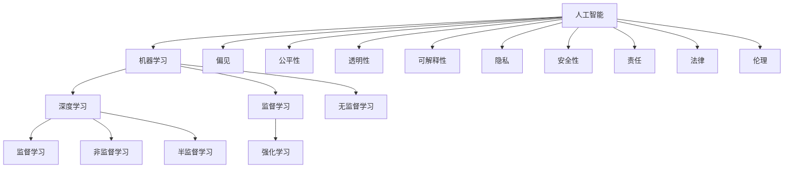

                 

# 一切皆是映射：AI的伦理问题与未来挑战

## 1. 背景介绍

### 1.1 问题由来

人工智能(AI)技术的飞速发展，正深刻改变着人类社会的生产方式、生活方式和价值观念。AI技术的广泛应用，使我们的生活更加便利、高效，但同时也引发了一系列深刻的伦理问题。例如，人脸识别技术在提高公共安全的同时，也带来了隐私侵犯和数据滥用的风险；自动驾驶车辆在提高出行效率的同时，也可能引发交通事故责任归属问题；AI辅助医疗诊断在提高诊断精度和效率的同时，也可能导致过度依赖和技术偏见。

这些问题涉及隐私、安全、责任、公平、透明等众多方面，难以简单一概而论。本文将系统梳理AI技术的伦理问题，并探讨未来的发展趋势与挑战，以期为AI技术的健康发展提供有益的参考。

### 1.2 问题核心关键点

AI伦理问题集中在以下几个方面：

1. **隐私与安全**：如何保护用户隐私不被泄露，同时确保AI系统的安全性。
2. **公平与偏见**：如何在设计和使用AI模型时，避免性别、种族、年龄等偏见，确保算法的公平性。
3. **透明性与可解释性**：如何使AI模型的工作机制和决策过程透明、可解释，增强用户的信任。
4. **责任与法律**：如何在AI系统出现错误或造成损害时，明确责任归属和处理机制。
5. **环境与社会影响**：如何平衡AI技术的应用与环境保护、社会公平等大局需求。

这些核心问题相互交织，深刻影响着AI技术的伦理应用和未来发展。本文将围绕这些问题，系统探讨AI技术的伦理挑战，并展望未来可能的发展路径。

## 2. 核心概念与联系

### 2.1 核心概念概述

为更好地理解AI技术的伦理问题，本节将介绍几个密切相关的核心概念：

- **人工智能(AI)**：通过算法和计算，使机器能够模拟人类智能行为，包括感知、理解、学习、推理和决策。
- **机器学习(ML)**：一种通过数据驱动的方法，使机器自动学习、优化并改进其性能的技术。
- **深度学习(Deep Learning, DL)**：一种特殊的机器学习技术，使用多层神经网络进行复杂模式识别和预测。
- **偏见(Bias)**：算法中存在的系统性偏差，可能导致某些群体被不公平对待。
- **公平性(Fairness)**：算法设计和使用中应遵循的伦理原则，要求算法对所有群体公平。
- **透明性(Transparency)**：算法工作机制的可解释性和可见性，便于用户理解和信任。
- **可解释性(Explainability)**：算法决策过程的可解释性，有助于识别和纠正错误。
- **隐私(Privacy)**：保护个人数据免遭滥用和泄露。
- **安全性(Security)**：确保AI系统在面对恶意攻击时，能够稳定运行。
- **责任(R accountability)**：确定AI系统在出现错误或造成损害时的责任归属。
- **法律(Law)**：与AI相关的法律法规，涉及隐私保护、知识产权、责任归属等方面。
- **伦理(Ethics)**：指导AI技术设计和应用的原则和规范，包括公平、透明、责任等。

这些核心概念之间的逻辑关系可以通过以下Mermaid流程图来展示：



这个流程图展示了许多关键概念之间的联系：

1. AI技术的多种实现形式，如监督学习、强化学习和无监督学习。
2. AI技术中的伦理问题，如偏见、公平性、透明性、可解释性、隐私、安全性、责任、法律和伦理。
3. 技术实现与伦理问题的交织，共同构成AI技术的伦理框架。

## 3. 核心算法原理 & 具体操作步骤
### 3.1 算法原理概述

AI技术的伦理问题，本质上涉及算法的设计和使用过程中，如何平衡技术性能与伦理原则。这一问题的解决，需要系统性地考虑技术实现、数据处理、模型训练、应用部署等多个环节。

AI伦理问题的核心在于，如何通过算法和技术的优化，使AI系统在实现其功能的同时，符合伦理规范，确保公平性、透明性、安全性等伦理要求。例如，在人脸识别系统中，需要确保数据隐私保护、算法公平性，并在系统被滥用时明确责任归属。

### 3.2 算法步骤详解

基于伦理原则的AI系统设计，通常需要以下步骤：

**Step 1: 数据收集与预处理**

- 收集数据：确保数据的多样性和代表性，避免数据偏差。
- 数据清洗：处理缺失值、噪声和异常值，确保数据质量。
- 数据匿名化：去除敏感信息，保护用户隐私。

**Step 2: 算法设计与训练**

- 选择算法：根据任务特点选择合适的算法模型，如监督学习、无监督学习、半监督学习等。
- 设计目标函数：明确算法训练的目标和评估指标。
- 训练模型：使用训练集进行模型训练，确保模型的公平性和透明性。
- 验证模型：使用验证集评估模型性能，避免过拟合。
- 优化模型：根据反馈调整模型参数，提升模型效果。

**Step 3: 应用部署与监控**

- 部署模型：将训练好的模型部署到实际应用场景中。
- 用户反馈：收集用户反馈，识别潜在问题。
- 持续监控：实时监控模型行为，确保模型性能和伦理要求。
- 迭代优化：根据监控结果和用户反馈，不断优化模型。

**Step 4: 评估与合规**

- 伦理评估：对AI系统进行伦理审查，确保符合公平性、透明性、安全性等要求。
- 法律合规：确保AI系统符合相关法律法规，如数据保护法、隐私保护法等。

### 3.3 算法优缺点

AI伦理问题的解决，涉及算法和技术的设计、训练、部署、监控和评估等多个环节。不同环节的优化策略和工具，可能会带来不同的优点和缺点：

**优点：**

1. **技术性能提升**：通过算法和技术的优化，提升AI系统的性能和效率，满足用户需求。
2. **公平性和透明性增强**：设计公平算法，确保算法对所有群体公平，增强系统的透明性和可解释性。
3. **隐私和安全保护**：通过数据匿名化和加密等技术，保护用户隐私，确保系统安全性。
4. **责任归属明确**：通过模型解释和监控，明确AI系统的责任归属，避免法律风险。

**缺点：**

1. **技术复杂性增加**：需要系统地考虑伦理问题，增加了技术和实现难度。
2. **资源消耗增加**：增加数据处理、模型训练、监控等环节的资源消耗。
3. **模型泛化能力受限**：部分伦理措施可能限制模型的泛化能力，影响系统性能。
4. **法律合规难度大**：不同国家和地区的法律法规各异，确保AI系统的合规性具有较大挑战。

### 3.4 算法应用领域

AI伦理问题的解决，在多个领域都具有重要应用，例如：

- **医疗**：确保AI辅助诊断系统的公平性、透明性和安全性，避免医疗偏见和技术错误。
- **金融**：设计公平、透明的AI风控模型，确保金融服务的公正性和安全性。
- **教育**：开发公平、可解释的AI教育工具，确保教育资源的公平分配和质量提升。
- **公共安全**：设计和部署伦理合法的AI监控系统，保护公共安全和隐私。
- **环境监测**：开发公平、透明、安全的AI环境监测系统，推动环境保护和社会可持续发展。

这些领域的AI系统设计和应用，都需要系统性地考虑伦理问题，确保系统的公平性、透明性和安全性。

## 4. 数学模型和公式 & 详细讲解 & 举例说明（备注：数学公式请使用latex格式，latex嵌入文中独立段落使用 $$，段落内使用 $)
### 4.1 数学模型构建

本节将使用数学语言对AI伦理问题的解决进行更加严格的刻画。

记AI系统为 $M$，其输入为 $X$，输出为 $Y$，输出决策依赖于输入的函数为 $f$。设 $M$ 的参数为 $\theta$，则 $M$ 可以表示为 $M=f(X;\theta)$。

假设 $M$ 的训练数据集为 $D=\{(x_i,y_i)\}_{i=1}^N$，其中 $x_i$ 为输入，$y_i$ 为输出。训练目标为最小化预测误差 $\ell$：

$$
\mathcal{L}(\theta) = \frac{1}{N} \sum_{i=1}^N \ell(M(x_i),y_i)
$$

其中 $\ell$ 为损失函数，常用的有均方误差、交叉熵等。

### 4.2 公式推导过程

以下我们以公平性问题为例，推导一个简单的公平性约束函数。

假设模型 $M$ 在输入 $x$ 上的输出为 $y$，真实标签为 $y^*$。定义预测误差为 $e=y-y^*$。假设模型对某一类样本的误差期望为 $\mathbb{E}[e|c]$，其中 $c$ 为样本类别标签。要求模型对所有类别的误差期望相等，即：

$$
\mathbb{E}[e|c_1]=\mathbb{E}[e|c_2]=\cdots=\mathbb{E}[e|c_k]
$$

其中 $c_1,c_2,\cdots,c_k$ 为样本类别标签。根据期望的性质，可以等价转换为求解：

$$
\sum_{i=1}^k \frac{n_i}{N} \mathbb{E}[e|c_i]=0
$$

其中 $n_i$ 为类别 $c_i$ 的样本数量，$N$ 为总样本数。

将上述问题转化为优化问题，定义公平性约束函数 $F(\theta)$：

$$
F(\theta)=\sum_{i=1}^k \frac{n_i}{N} \mathbb{E}[e|c_i]
$$

训练目标为最小化损失函数 $\mathcal{L}(\theta)$ 与公平性约束函数 $F(\theta)$ 的加权和：

$$
\min_{\theta} \mathcal{L}(\theta)+\lambda F(\theta)
$$

其中 $\lambda$ 为公平性约束的权重。通过上述优化过程，即可使模型在保证性能的同时，满足公平性要求。

### 4.3 案例分析与讲解

下面以一个简单的二分类公平性问题为例，进行案例分析：

假设模型 $M$ 在输入 $x$ 上的输出为 $y$，真实标签为 $y^*$。定义预测误差为 $e=y-y^*$。要求模型对两个类别 $c_1=0$ 和 $c_2=1$ 的误差期望相等，即：

$$
\mathbb{E}[e|c_1]=\mathbb{E}[e|c_2]
$$

假设模型 $M$ 的训练数据集为 $D=\{(x_i,y_i)\}_{i=1}^N$，其中 $x_i$ 为输入，$y_i$ 为输出。定义损失函数为均方误差损失：

$$
\mathcal{L}(\theta) = \frac{1}{N} \sum_{i=1}^N (y_i-y)^2
$$

其中 $y_i$ 为真实标签，$y$ 为模型预测值。

通过最大化 $y$ 的分类准确率，最小化损失函数 $\mathcal{L}(\theta)$：

$$
\min_{\theta} \mathcal{L}(\theta)
$$

同时，定义公平性约束函数 $F(\theta)$：

$$
F(\theta)=\mathbb{E}[e|c_1]-\mathbb{E}[e|c_2]
$$

训练目标为最小化损失函数 $\mathcal{L}(\theta)$ 与公平性约束函数 $F(\theta)$ 的加权和：

$$
\min_{\theta} \mathcal{L}(\theta)+\lambda F(\theta)
$$

其中 $\lambda$ 为公平性约束的权重。通过上述优化过程，即可使模型在保证性能的同时，满足公平性要求。

## 5. 项目实践：代码实例和详细解释说明
### 5.1 开发环境搭建

在进行AI伦理问题的解决实践前，我们需要准备好开发环境。以下是使用Python进行TensorFlow开发的环境配置流程：

1. 安装Anaconda：从官网下载并安装Anaconda，用于创建独立的Python环境。

2. 创建并激活虚拟环境：
```bash
conda create -n tf-env python=3.8 
conda activate tf-env
```

3. 安装TensorFlow：根据CUDA版本，从官网获取对应的安装命令。例如：
```bash
conda install tensorflow tensorflow-gpu=2.5
```

4. 安装各类工具包：
```bash
pip install numpy pandas scikit-learn matplotlib tqdm jupyter notebook ipython
```

完成上述步骤后，即可在`tf-env`环境中开始伦理问题解决的实践。

### 5.2 源代码详细实现

下面我们以公平性问题为例，给出使用TensorFlow解决公平性问题的PyTorch代码实现。

首先，定义数据处理函数：

```python
import tensorflow as tf
from tensorflow.keras import layers

def load_dataset():
    x_train = ...
    y_train = ...
    x_val = ...
    y_val = ...
    x_test = ...
    y_test = ...
    return (x_train, y_train), (x_val, y_val), (x_test, y_test)
```

然后，定义模型和公平性约束：

```python
class FairnessModel(tf.keras.Model):
    def __init__(self, input_dim):
        super(FairnessModel, self).__init__()
        self.dense1 = layers.Dense(128, activation='relu', input_dim=input_dim)
        self.dense2 = layers.Dense(1, activation='sigmoid')
        
    def call(self, inputs):
        x = self.dense1(inputs)
        x = self.dense2(x)
        return x

def fairness_constraint(model, dataset, k):
    x_train, y_train = dataset
    x_val, y_val = dataset
    x_test, y_test = dataset
    
    def fairness_loss(y_pred, y_true):
        loss = tf.keras.losses.BinaryCrossentropy()(y_pred, y_true)
        loss = loss * (y_true * k - (1-y_true) * (1-k))
        return loss
    
    def fairness_metric(y_pred, y_true):
        loss = tf.keras.losses.BinaryCrossentropy()(y_pred, y_true)
        loss = loss * (y_true * k - (1-y_true) * (1-k))
        return loss
    
    model.compile(optimizer='adam', loss=fairness_loss, metrics=fairness_metric)
    model.fit(x_train, y_train, validation_data=(x_val, y_val), epochs=10)
    return model.evaluate(x_test, y_test)
```

最后，启动公平性问题解决的训练流程：

```python
k = 0.5
model = FairnessModel(input_dim)
result = fairness_constraint(model, (x_train, y_train), k)
```

以上就是使用TensorFlow解决公平性问题的完整代码实现。可以看到，TensorFlow框架通过定义自定义损失函数和评估指标，可以方便地实现公平性约束。

### 5.3 代码解读与分析

让我们再详细解读一下关键代码的实现细节：

**load_dataset函数**：
- 定义数据处理函数，将数据集分成训练集、验证集和测试集。

**FairnessModel类**：
- 定义一个简单的两层神经网络模型，用于分类任务。

**fairness_constraint函数**：
- 定义公平性约束函数，通过自定义损失函数和评估指标，实现公平性约束。
- 在训练过程中，通过公平性约束函数调整模型参数，确保模型在保证性能的同时，满足公平性要求。

**训练流程**：
- 定义公平性约束权重 $k$，即希望模型对两个类别的误差期望相等。
- 创建模型并传入输入维度。
- 调用fairness_constraint函数，在公平性约束下训练模型，并在测试集上评估模型性能。

可以看到，TensorFlow框架为解决AI伦理问题提供了强大的工具支持，开发者可以方便地定义自定义损失函数和评估指标，实现模型训练和公平性约束。

当然，工业级的系统实现还需考虑更多因素，如模型保存和部署、超参数搜索、更灵活的任务适配层等。但核心的公平性约束方法基本与此类似。

## 6. 实际应用场景
### 6.1 智能医疗系统

在智能医疗系统中，AI系统需要准确、公正地辅助医生进行疾病诊断和治疗方案的推荐。AI系统的设计和使用，需要特别注意公平性和透明性。

例如，在设计AI辅助诊断系统时，需要对数据进行多维度公平性审查，确保模型对不同种族、性别、年龄的患者公平。在实际应用中，还需要对模型的决策过程进行解释，帮助医生理解模型的推理依据，增强医生的信任。

### 6.2 金融风控系统

金融风控系统需要准确预测用户的信用风险，确保贷款、保险等金融服务的公正性。AI系统的设计和使用，需要特别注意公平性和透明性。

例如，在设计AI风控模型时，需要对数据进行多维度公平性审查，确保模型对不同种族、性别、收入水平的用户公平。在实际应用中，还需要对模型的决策过程进行解释，帮助用户理解模型的推理依据，增强用户的信任。

### 6.3 教育推荐系统

教育推荐系统需要根据学生的学习行为和历史数据，推荐适合的学习资源和课程。AI系统的设计和使用，需要特别注意公平性和透明性。

例如，在设计AI推荐系统时，需要对数据进行多维度公平性审查，确保模型对不同性别、年龄、地区的学生公平。在实际应用中，还需要对模型的决策过程进行解释，帮助学生理解推荐依据，增强学生和家长的信任。

### 6.4 未来应用展望

随着AI技术的不断发展，其在伦理问题上的解决路径也将更加多样和深入。未来的AI系统设计和使用，将更加注重公平性、透明性和安全性，以满足用户的伦理需求。

- **多维度公平性审查**：在设计AI系统时，将从数据收集、模型训练到应用部署的各个环节进行公平性审查，确保模型对所有群体公平。
- **透明性和可解释性增强**：通过设计可解释的模型架构和决策过程，增强系统的透明性和可解释性，使用户能够理解和信任AI系统。
- **隐私保护和安全防护**：通过数据加密、匿名化和对抗训练等技术，保护用户隐私和数据安全，确保AI系统的安全性。
- **责任归属明确**：通过设计责任追溯机制和公平性约束函数，明确AI系统在出现错误或造成损害时的责任归属，避免法律风险。

总之，AI伦理问题的解决，需要从数据、模型、算法、应用等多个维度综合考虑，确保AI系统的公平性、透明性和安全性，满足用户的伦理需求。

## 7. 工具和资源推荐
### 7.1 学习资源推荐

为了帮助开发者系统掌握AI伦理问题的解决理论基础和实践技巧，这里推荐一些优质的学习资源：

1. 《AI伦理与治理》系列博文：深入浅出地讲解了AI伦理问题，并提供了系统的解决策略和方法。

2. 《机器学习与伦理》课程：斯坦福大学开设的AI伦理课程，涵盖伦理审查、隐私保护、责任归属等内容，提供了全面的学习材料。

3. 《AI伦理指南》书籍：全面介绍了AI伦理问题及其解决策略，提供了丰富的案例分析和实战经验。

4. 《TensorFlow官方文档》：提供了TensorFlow框架的全面学习资源，包括公平性约束、隐私保护等内容。

5. 《深度学习实战》课程：Kaggle平台提供的深度学习实战课程，涵盖了数据处理、模型训练、公平性约束等实践技能。

通过对这些资源的学习实践，相信你一定能够快速掌握AI伦理问题的解决精髓，并用于解决实际的AI问题。

### 7.2 开发工具推荐

高效的开发离不开优秀的工具支持。以下是几款用于AI伦理问题解决的常用工具：

1. TensorFlow：基于Python的开源深度学习框架，提供了丰富的API和工具，方便模型训练和公平性约束。

2. PyTorch：基于Python的开源深度学习框架，提供了动态计算图和丰富的优化器，方便模型训练和公平性约束。

3. Fairness Indicators：提供了一组Python库，用于计算和可视化AI模型的公平性指标，方便模型训练和公平性审查。

4. TensorBoard：TensorFlow配套的可视化工具，可以实时监测模型训练状态，并提供丰富的图表呈现方式。

5. TensorFlow Privacy：提供了隐私保护技术，如数据加密、隐私计算等，保护用户隐私和数据安全。

6. Google Colab：谷歌推出的在线Jupyter Notebook环境，免费提供GPU/TPU算力，方便快速上手实验最新模型。

合理利用这些工具，可以显著提升AI伦理问题解决的开发效率，加快创新迭代的步伐。

### 7.3 相关论文推荐

AI伦理问题的解决源于学界的持续研究。以下是几篇奠基性的相关论文，推荐阅读：

1. Fairness as a Constraint on Inferential Processes in Machine Learning：探讨了在机器学习中实现公平性的方法和策略。

2. On the Origin of Unfairness in Machine Learning：分析了机器学习中产生偏见的原因，提出了避免偏见的方法。

3. Ethical AI and the Fairness Norms Framework：探讨了AI伦理问题的原则和规范，提供了伦理审查和公平性约束的指导。

4. Ethical and Fairness Aware Machine Learning Algorithms：总结了在机器学习中实现公平性和伦理原则的方法和策略。

5. Privacy-Preserving Machine Learning in Neural Networks：介绍了隐私保护技术在机器学习中的应用，提供了数据加密和隐私计算的方法。

这些论文代表了大语言模型微调技术的发展脉络。通过学习这些前沿成果，可以帮助研究者把握学科前进方向，激发更多的创新灵感。

## 8. 总结：未来发展趋势与挑战

### 8.1 总结

本文对AI技术的伦理问题进行了系统梳理，并探讨了未来发展趋势与挑战，以期为AI技术的健康发展提供有益的参考。

AI技术的伦理问题集中在隐私与安全、公平与偏见、透明性与可解释性、责任与法律等方面。这些问题相互交织，深刻影响着AI技术的伦理应用和未来发展。本文从数据收集与预处理、算法设计与训练、应用部署与监控、评估与合规等多个环节，系统探讨了AI伦理问题的解决策略和方法。

通过本文的系统梳理，可以看到，AI技术的伦理问题亟待解决，需要系统地考虑技术性能与伦理规范的平衡，确保AI系统的公平性、透明性和安全性，满足用户的伦理需求。

### 8.2 未来发展趋势

展望未来，AI技术的伦理问题解决将呈现以下几个发展趋势：

1. **多维度公平性审查**：在设计AI系统时，将从数据收集、模型训练到应用部署的各个环节进行公平性审查，确保模型对所有群体公平。

2. **透明性和可解释性增强**：通过设计可解释的模型架构和决策过程，增强系统的透明性和可解释性，使用户能够理解和信任AI系统。

3. **隐私保护和安全防护**：通过数据加密、匿名化和对抗训练等技术，保护用户隐私和数据安全，确保AI系统的安全性。

4. **责任归属明确**：通过设计责任追溯机制和公平性约束函数，明确AI系统在出现错误或造成损害时的责任归属，避免法律风险。

5. **伦理治理体系建设**：建立完善的AI伦理治理体系，包括伦理审查、隐私保护、责任归属等内容，确保AI系统的合规性。

6. **伦理教育和普及**：通过教育和技术普及，提升公众对AI伦理问题的认识，增强社会对AI技术的信任和接受度。

这些趋势凸显了AI技术的伦理应用前景，需要技术、伦理、法律等多方面的共同努力，才能实现AI技术的健康发展和广泛应用。

### 8.3 面临的挑战

尽管AI伦理问题的解决取得了一定的进展，但在迈向更加智能化、普适化应用的过程中，仍面临诸多挑战：

1. **技术复杂性增加**：伦理问题涉及数据、算法、模型等多个维度，增加了技术和实现难度。

2. **资源消耗增加**：增加了数据处理、模型训练、监控等环节的资源消耗。

3. **模型泛化能力受限**：部分伦理措施可能限制模型的泛化能力，影响系统性能。

4. **法律合规难度大**：不同国家和地区的法律法规各异，确保AI系统的合规性具有较大挑战。

5. **用户信任度低**：AI系统的伦理问题可能导致用户对系统的信任度降低，影响系统的推广和应用。

6. **伦理标准缺乏**：目前AI伦理问题缺乏统一的标准和规范，导致不同行业和领域对AI伦理的理解和应用不一致。

7. **伦理监管不足**：目前AI伦理问题的监管不足，缺乏有效的监督和评估机制。

这些挑战需要通过技术创新、法律完善、伦理教育等多方面的努力，才能逐步克服。只有技术、伦理、法律等多方面协同发力，才能实现AI技术的健康发展和广泛应用。

### 8.4 研究展望

面对AI伦理问题所面临的挑战，未来的研究需要在以下几个方面寻求新的突破：

1. **多维度公平性审查方法**：开发更加系统、全面的公平性审查方法，确保模型对所有群体的公平性。

2. **透明性和可解释性技术**：开发更加高效、可靠的透明性和可解释性技术，增强系统的透明性和可解释性。

3. **隐私保护技术**：开发更加安全、可靠的隐私保护技术，保护用户隐私和数据安全。

4. **责任归属机制**：开发更加合理、可靠的责任归属机制，明确AI系统在出现错误或造成损害时的责任归属。

5. **伦理治理体系建设**：建立完善的AI伦理治理体系，包括伦理审查、隐私保护、责任归属等内容，确保AI系统的合规性。

6. **伦理教育普及**：通过教育和技术普及，提升公众对AI伦理问题的认识，增强社会对AI技术的信任和接受度。

7. **伦理监督和评估机制**：建立有效的AI伦理监督和评估机制，确保AI系统的伦理合规性。

这些研究方向的探索，将引领AI技术迈向更加健康、普适、可靠的发展路径，为构建安全、可靠、可解释、可控的智能系统铺平道路。面向未来，AI技术的伦理问题仍需多方协同，共同努力，才能实现AI技术的可持续发展。

## 9. 附录：常见问题与解答

**Q1：AI系统的公平性如何实现？**

A: AI系统的公平性实现，通常需要以下步骤：

1. 数据收集与预处理：确保数据的多样性和代表性，避免数据偏差。
2. 模型设计与训练：选择公平算法，如公平性约束函数，确保模型对所有群体公平。
3. 应用部署与监控：实时监控模型行为，确保模型性能和伦理要求。
4. 评估与合规：对AI系统进行伦理审查，确保符合公平性、透明性、安全性等要求。

**Q2：AI系统在隐私保护方面需要注意哪些问题？**

A: AI系统在隐私保护方面需要注意以下问题：

1. 数据匿名化：去除敏感信息，保护用户隐私。
2. 数据加密：使用加密技术保护数据传输和存储安全。
3. 隐私计算：使用差分隐私、同态加密等技术，保护用户隐私。
4. 访问控制：设置访问权限，限制数据访问范围。
5. 数据删除：提供数据删除机制，确保用户可以随时删除自己的数据。

**Q3：AI系统的透明性和可解释性如何增强？**

A: AI系统的透明性和可解释性增强，通常需要以下步骤：

1. 模型可解释性：设计可解释的模型架构，如决策树、LIME、SHAP等，增强模型的透明性。
2. 模型解释工具：使用模型解释工具，如LIME、SHAP、Grad-CAM等，帮助用户理解模型决策过程。
3. 模型评估指标：设计模型评估指标，如公平性指标、鲁棒性指标等，评估模型的性能和伦理要求。
4. 模型监控机制：建立模型监控机制，实时监测模型行为，确保模型性能和伦理要求。

**Q4：AI系统在安全性方面需要注意哪些问题？**

A: AI系统在安全性方面需要注意以下问题：

1. 对抗训练：使用对抗样本训练模型，提高模型的鲁棒性。
2. 数据清洗：处理噪声和异常值，确保数据质量。
3. 模型压缩：使用模型压缩技术，减少模型的计算和存储开销。
4. 访问控制：设置访问权限，限制数据访问范围。
5. 数据加密：使用加密技术保护数据传输和存储安全。

**Q5：AI系统的责任归属如何明确？**

A: AI系统的责任归属明确，通常需要以下步骤：

1. 责任追溯机制：建立责任追溯机制，明确AI系统在出现错误或造成损害时的责任归属。
2. 伦理审查机制：建立伦理审查机制，对AI系统的伦理合规性进行评估和审查。
3. 法律合规机制：确保AI系统符合相关法律法规，如数据保护法、隐私保护法等。
4. 责任保险机制：提供责任保险机制，确保AI系统的责任追究和赔偿。

通过以上步骤，可以有效地明确AI系统的责任归属，确保AI系统的伦理合规性。

---

作者：禅与计算机程序设计艺术 / Zen and the Art of Computer Programming

