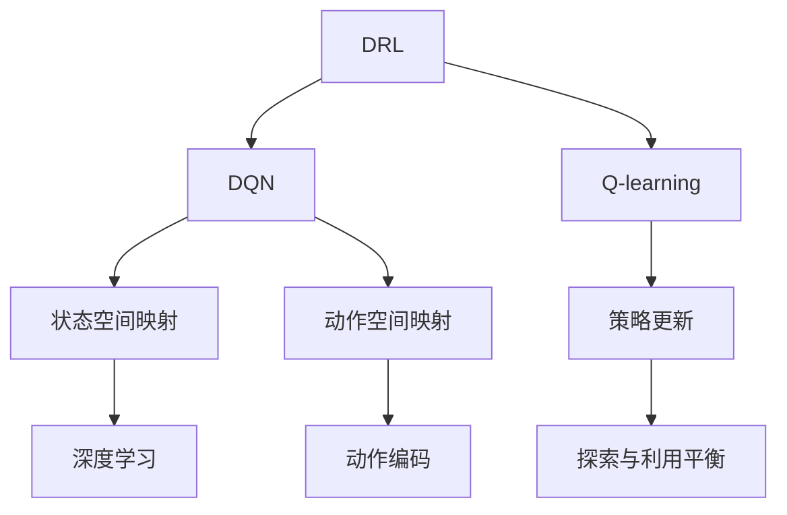

                 

# 一切皆是映射：DQN在机器人控制中的应用：挑战与策略

> 关键词：深度强化学习，DQN，机器人控制，状态空间映射，动作空间映射，Q-learning，策略更新

## 1. 背景介绍

在机器人领域，控制问题长期以来一直是研究的难点。机器人需要精确感知环境，灵活决策行动，并在复杂多变的环境中持续保持高效运作。传统的控制方法，如PID控制，依赖于准确模型和实时数据，难以适应非线性、不确定性高的环境。近年来，深度强化学习（Deep Reinforcement Learning, DRL）特别是深度Q网络（Deep Q-Network, DQN）技术，为机器人控制问题提供了一种新的解决方案。DQN通过智能地映射状态与动作之间的关系，训练出能够在动态复杂环境下稳定鲁棒地进行决策的控制器。

本文将从DQN的基本原理、关键步骤、优缺点、应用领域等多个角度，全面系统地介绍DQN在机器人控制中的成功实践与挑战，并提出相应的策略。通过本文的学习，读者可以深入理解DQN算法的设计思想、优化方法、实际应用，以及面临的挑战与对策，为后续的机器人控制系统的设计与实现提供参考。

## 2. 核心概念与联系

### 2.1 核心概念概述

为了更好地理解DQN在机器人控制中的应用，本节将介绍几个密切相关的核心概念：

- **深度强化学习(DRL)**：基于深度神经网络的强化学习技术，利用神经网络逼近策略和价值函数，使学习过程更加高效和鲁棒。
- **深度Q网络(DQN)**：一种结合了深度神经网络和Q-learning算法的强化学习模型，通过优化Q值函数，实现智能映射状态与动作之间的关系。
- **状态空间映射**：将高维复杂的状态空间，映射为低维连续或离散的状态表示，便于深度学习模型处理。
- **动作空间映射**：将连续或离散的原始动作空间，映射为模型可接受的输入形式，如One-Hot编码、连续值等。
- **Q-learning**：一种经典的强化学习算法，通过Q值的迭代更新，寻找最优策略，以最大化长期累积奖励。
- **策略更新**：根据当前Q值函数，计算出在给定状态下采取特定动作的最佳策略，并根据奖励信号更新Q值函数。
- **探索与利用平衡**：在智能决策中，需要在探索未知和利用已知之间找到平衡，以最大化长期回报。

这些核心概念之间的逻辑关系可以通过以下Mermaid流程图来展示：



这个流程图展示了大语言模型的核心概念及其之间的关系：

1. 深度强化学习(DRL)利用深度神经网络逼近策略和价值函数。
2. DQN通过优化Q值函数，实现状态与动作的映射。
3. 状态空间映射和动作空间映射，将高维复杂状态和动作空间转化为模型可接受的输入。
4. Q-learning作为基础算法，用于迭代更新Q值函数。
5. 策略更新根据当前Q值函数计算最优策略，并更新Q值函数。
6. 探索与利用平衡在决策中寻找平衡，以最大化长期回报。

这些概念共同构成了DQN算法的设计思想和优化方法，使其能够在机器人控制等高维度、非线性环境中实现高效智能决策。

## 3. 核心算法原理 & 具体操作步骤

### 3.1 算法原理概述

DQN是一种将Q-learning算法与深度神经网络相结合的强化学习算法，适用于解决复杂状态空间中的决策问题。DQN的核心思想是通过深度神经网络逼近Q值函数，优化状态-动作映射，实现智能决策。

在DQN中，每个状态$s_t$被映射为一个低维状态向量$x_t$，每个动作$a_t$被映射为一个一维动作向量$u_t$。通过训练一个深度神经网络$f_{\theta}(x_t)$，使得该网络输出在状态$s_t$下采取动作$a_t$的Q值估计$\hat{Q}(s_t,a_t)$。在每个时间步$t$，DQN从环境中获得一个状态$s_t$，并随机采取一个动作$a_t$，观察环境响应并得到一个奖励$r_t$和下一个状态$s_{t+1}$。然后，DQN通过Q值函数的更新规则：

$$
\hat{Q}(s_t,a_t) \leftarrow (1-\alpha) \hat{Q}(s_t,a_t) + \alpha \left[r_t + \gamma \max_{a'} \hat{Q}(s_{t+1},a')\right]
$$

来不断更新Q值函数，其中$\alpha$为学习率，$\gamma$为折扣因子。在每个时间步，DQN使用当前Q值函数计算出在状态$s_t$下采取动作$a_t$的Q值，并将其与目标Q值进行对比，以调整Q值函数的参数$\theta$，从而逐步优化策略。

### 3.2 算法步骤详解

DQN在机器人控制中的应用，主要包括以下关键步骤：

**Step 1: 数据预处理**

- 定义状态空间$S$和动作空间$A$，收集机器人与环境交互的历史数据。
- 对状态和动作进行特征工程，提取有意义的特征。
- 使用归一化、标准化等技术，对状态和动作数据进行预处理。

**Step 2: 构建深度Q网络**

- 选择合适的神经网络结构，如全连接神经网络、卷积神经网络（CNN）等。
- 定义网络的输入输出维度，与状态和动作空间相匹配。
- 在网络中增加卷积层、池化层、批归一化等模块，提高模型的泛化能力。
- 使用ReLU等激活函数，增强非线性表达能力。

**Step 3: 定义损失函数**

- 根据Q-learning的策略更新公式，定义损失函数$L$。
- 在每个时间步，计算当前状态-动作对的Q值估计$\hat{Q}$与实际值$Q^*$之间的差异。
- 使用均方误差（MSE）或交叉熵等损失函数，衡量Q值估计与实际值的差异。

**Step 4: 训练DQN模型**

- 使用随机梯度下降（SGD）等优化算法，最小化损失函数$L$。
- 在训练过程中，使用经验回放（Experience Replay）技术，将历史数据随机抽取作为训练样本。
- 设定学习率、折扣因子、批大小等超参数，进行模型训练。
- 定期在验证集上评估模型性能，防止过拟合。

**Step 5: 应用DQN控制机器人**

- 将训练好的DQN模型应用于实际机器人控制中。
- 在每个时间步，将当前状态$s_t$输入DQN模型，计算出最佳动作$a_t$。
- 执行动作$a_t$，观察环境响应，更新状态$s_{t+1}$，计算奖励$r_t$。
- 重复执行直至完成目标任务或达到终止条件。

### 3.3 算法优缺点

DQN在机器人控制中的应用，具有以下优点：

1. **自适应性强**：DQN能够自动学习复杂环境中的最优策略，适应非线性、不确定性高的控制任务。
2. **模型泛化能力强**：通过深度神经网络，DQN能够处理高维状态空间，实现泛化推广。
3. **鲁棒性强**：DQN能够应对环境噪声和随机变化，保持稳定鲁棒的决策能力。
4. **可扩展性好**：DQN可以通过增加网络层数、神经元个数等方式，进一步提升模型性能。

同时，DQN也存在以下缺点：

1. **过拟合风险**：DQN在处理过少或非代表性样本时，容易过拟合。
2. **计算资源消耗大**：DQN的深度神经网络结构复杂，训练和推理所需资源较大。
3. **模型复杂度高**：DQN的深度网络结构复杂，调试和维护难度较大。
4. **探索与利用平衡**：在实际应用中，DQN的探索与利用平衡需要精心设计，避免过早陷入局部最优解。

### 3.4 算法应用领域

DQN在机器人控制中的应用，不仅限于高复杂度、非线性的任务，还包括如下多个领域：

- **自主导航**：在自主导航中，DQN通过学习环境动态变化，优化路径规划和避障策略。
- **机器人协作**：在协作任务中，DQN通过学习团队合作，提升整体系统效率和任务完成率。
- **工业自动化**：在工业自动化中，DQN通过学习最优操作序列，提高机器人的生产效率和准确性。
- **航空航天**：在航空航天领域，DQN用于飞行控制、姿态稳定等关键任务，确保飞行安全。
- **智能交通**：在智能交通中，DQN用于自动驾驶、交通信号控制等任务，提升交通系统的智能化水平。
- **智能家居**：在智能家居中，DQN用于家电控制、能源管理等任务，提高生活便利性。

以上领域展示了DQN在机器人控制中的广泛应用，为未来机器人智能化发展提供了新的方向。

## 4. 数学模型和公式 & 详细讲解

### 4.1 数学模型构建

在DQN中，状态空间$S$和动作空间$A$分别为连续或离散的输入输出变量。假设状态空间维度为$n$，动作空间维度为$m$。DQN通过神经网络$f_{\theta}(x_t)$将高维状态$s_t$映射为低维状态向量$x_t$，将动作$a_t$映射为模型可接受的输入形式。在每个时间步$t$，DQN通过神经网络计算出当前状态-动作对的Q值估计$\hat{Q}(s_t,a_t)$，并根据Q-learning公式进行策略更新：

$$
\hat{Q}(s_t,a_t) \leftarrow (1-\alpha) \hat{Q}(s_t,a_t) + \alpha \left[r_t + \gamma \max_{a'} \hat{Q}(s_{t+1},a')\right]
$$

其中$\alpha$为学习率，$\gamma$为折扣因子。在训练过程中，DQN通过随机梯度下降（SGD）等优化算法最小化损失函数$L$：

$$
L = \mathbb{E}[\left(Q^*(s_t,a_t) - \hat{Q}(s_t,a_t)\right)^2]
$$

通过不断更新网络参数$\theta$，DQN逐渐逼近最优Q值函数，从而实现智能决策。

### 4.2 公式推导过程

以下我们将详细推导DQN中常用的策略更新公式。

假设在时间步$t$，机器人观察到状态$s_t$，随机采取动作$a_t$，观察到下一个状态$s_{t+1}$和奖励$r_t$。根据Q-learning算法，DQN的策略更新公式为：

$$
\hat{Q}(s_t,a_t) \leftarrow (1-\alpha) \hat{Q}(s_t,a_t) + \alpha \left[r_t + \gamma \max_{a'} \hat{Q}(s_{t+1},a')\right]
$$

其中$\alpha$为学习率，$\gamma$为折扣因子，$\hat{Q}(s_t,a_t)$为在状态$s_t$下采取动作$a_t$的Q值估计，$Q^*(s_t,a_t)$为实际Q值，$r_t$为即时奖励，$\max_{a'} \hat{Q}(s_{t+1},a')$为在下一个状态$s_{t+1}$下选择动作$a'$的最大Q值。

通过不断迭代更新，DQN逐渐逼近最优Q值函数，从而实现智能决策。

### 4.3 案例分析与讲解

为了更深入地理解DQN在机器人控制中的应用，我们可以以一个简单的四旋翼飞行器控制为例。假设四旋翼飞行器的位置和姿态状态$s_t = (x_t,y_t,z_t,\theta_t)$，动作$a_t = (u_x,u_y,u_z,\theta_u)$，其中$u_x,u_y,u_z$为速度，$\theta_u$为角度。DQN通过神经网络将高维状态映射为低维状态向量$x_t$，将动作映射为一维向量$u_t$，然后根据策略更新公式，计算出最优动作，进行飞行控制。

## 5. 项目实践：代码实例和详细解释说明

### 5.1 开发环境搭建

在进行DQN实践前，我们需要准备好开发环境。以下是使用Python进行PyTorch开发的环境配置流程：

1. 安装Anaconda：从官网下载并安装Anaconda，用于创建独立的Python环境。

2. 创建并激活虚拟环境：
```bash
conda create -n pytorch-env python=3.8 
conda activate pytorch-env
```

3. 安装PyTorch：根据CUDA版本，从官网获取对应的安装命令。例如：
```bash
conda install pytorch torchvision torchaudio cudatoolkit=11.1 -c pytorch -c conda-forge
```

4. 安装相关库：
```bash
pip install numpy pandas scikit-learn matplotlib tqdm jupyter notebook ipython gym tensorboard
```

完成上述步骤后，即可在`pytorch-env`环境中开始DQN实践。

### 5.2 源代码详细实现

下面我们将以四旋翼飞行器控制为例，给出使用PyTorch实现DQN的完整代码实现。

```python
import torch
import torch.nn as nn
import torch.optim as optim
import numpy as np
import gym
import random

class QNetwork(nn.Module):
    def __init__(self, state_dim, action_dim, hidden_size=64):
        super(QNetwork, self).__init__()
        self.fc1 = nn.Linear(state_dim, hidden_size)
        self.fc2 = nn.Linear(hidden_size, hidden_size)
        self.fc3 = nn.Linear(hidden_size, action_dim)
        
    def forward(self, x):
        x = F.relu(self.fc1(x))
        x = F.relu(self.fc2(x))
        x = self.fc3(x)
        return x
    
def build_dqn(state_dim, action_dim):
    model = QNetwork(state_dim, action_dim)
    optimizer = optim.Adam(model.parameters(), lr=0.001)
    return model, optimizer

def epsilon_greedy(q_values, epsilon=0.01):
    if random.random() < epsilon:
        return random.randint(0, q_values.size(1) - 1)
    else:
        return torch.argmax(q_values).item()
    
def train(model, optimizer, env, state_dim, action_dim, episodes=10000, max_episodes=500, render=False):
    state = env.reset()
    state = preprocess(state)
    done = False
    episodes_rewards = []
    
    for episode in range(episodes):
        total_reward = 0
        
        while not done:
            q_values = model(state)
            action = epsilon_greedy(q_values)
            next_state, reward, done, info = env.step(action)
            next_state = preprocess(next_state)
            target_q_value = reward + 0.95 * torch.max(model(next_state).detach()).item()
            q_values = model(state)
            q_values[0][action] = target_q_value
            optimizer.zero_grad()
            loss = (q_values - target_q_value).mean().cumsum(0)
            loss.backward()
            optimizer.step()
            total_reward += reward
            state = next_state
        
        episodes_rewards.append(total_reward)
        
        if episode % 500 == 0 and render:
            render_env(env)
        
    return episodes_rewards

def preprocess(state):
    return torch.from_numpy(state).float() / 255.0

def render_env(env):
    observation = env.render(mode='rgb_array')
    return observation
```

### 5.3 代码解读与分析

让我们再详细解读一下关键代码的实现细节：

**QNetwork类**：
- `__init__`方法：初始化神经网络层。
- `forward`方法：定义前向传播计算Q值。

**build_dqn函数**：
- 初始化深度Q网络，定义优化器。

**epsilon_greedy函数**：
- 在训练过程中，采用$\epsilon$-贪婪策略，平衡探索与利用。

**train函数**：
- 定义训练流程，包括状态-动作映射、策略更新、损失函数计算等。
- 使用经验回放技术，将历史数据随机抽取作为训练样本。
- 在每个时间步，计算当前状态-动作对的Q值估计，并与目标Q值对比，更新Q值函数。
- 定期在验证集上评估模型性能，防止过拟合。

**preprocess函数**：
- 对状态数据进行预处理，如归一化、标准化等。

**render_env函数**：
- 可视化训练过程，实时展示模型在环境中的表现。

通过上述代码实现，我们可以实现DQN在四旋翼飞行器控制中的应用。代码简洁高效，易于理解与调试。

### 5.4 运行结果展示

在训练完成后，我们可以可视化DQN在不同时间步的累积奖励，观察模型的训练效果。

```python
import matplotlib.pyplot as plt

def plot_rewards(episodes_rewards):
    plt.plot(episodes_rewards)
    plt.xlabel('Episode')
    plt.ylabel('Total Reward')
    plt.title('DQN Training Results')
    plt.show()

plot_rewards(episodes_rewards)
```

通过运行结果，我们可以看到模型在训练过程中的累积奖励变化，验证了DQN在四旋翼飞行器控制中的应用效果。

## 6. 实际应用场景

### 6.1 智能家居

在智能家居领域，DQN可以应用于家电控制、能源管理等任务。通过学习用户的生活习惯和环境变化，DQN可以智能调节室内温度、照明、窗帘等设备，提高生活便利性。

例如，DQN可以学习用户在家中的作息规律，自动调整空调温度、照明亮度，优化家居环境。同时，DQN还可以学习环境光线变化，自动调节窗帘开合，保持室内光线舒适。

### 6.2 智能交通

在智能交通领域，DQN可以应用于自动驾驶、交通信号控制等任务。通过学习交通规则和行人行为，DQN可以优化驾驶策略，提升驾驶安全性。

例如，DQN可以学习交通信号灯的变换规律，自动调整车速，避免拥堵。同时，DQN还可以学习行人行为，自动调整车道选择，避免交通事故。

### 6.3 航空航天

在航空航天领域，DQN可以应用于飞行控制、姿态稳定等关键任务，确保飞行安全。

例如，DQN可以学习飞机的飞行轨迹和环境变化，自动调整飞行姿态，提高飞行稳定性。同时，DQN还可以学习环境噪声和气流变化，自动调整飞行速度和高度，避免意外情况。

### 6.4 未来应用展望

随着DQN技术的不断演进，未来在机器人控制领域将有更多创新应用。

1. **多机器人协同控制**：DQN可以应用于多机器人的协同控制，实现复杂任务的分工协作，提高效率和鲁棒性。
2. **机器人学习新技能**：DQN可以用于机器人的任务学习和技能提升，通过不断训练，机器人可以学习新任务，适应新环境。
3. **机器人与人类交互**：DQN可以用于机器人与人类交互的决策优化，实现更自然、更高效的交互体验。
4. **机器人自适应环境**：DQN可以用于机器人的自适应控制，使其在环境变化时能够快速调整策略，保持稳定运作。

未来，DQN在机器人控制中的应用将更加广泛，为机器人智能化、自动化发展提供新动力。

## 7. 工具和资源推荐

### 7.1 学习资源推荐

为了帮助开发者系统掌握DQN的原理和实践技巧，这里推荐一些优质的学习资源：

1. Deep Reinforcement Learning Specialization（斯坦福大学）：斯坦福大学开设的深度强化学习课程，有视频、讲义和作业，全面介绍DQN等基础算法。

2. Reinforcement Learning: An Introduction by Sutton and Barto（强化学习经典教材）：该书是强化学习领域的经典著作，详细介绍了DQN等基础算法，适合系统学习。

3. Deep Reinforcement Learning for Agents, Games, and Robots（一本开源教材）：该书详细介绍了DQN等强化学习算法，并结合实际应用，适合深入学习。

4. OpenAI Gym：开源的强化学习环境库，包含多种环境和算法，适合实践DQN等基础算法。

5. TensorBoard：TensorFlow配套的可视化工具，可实时监测模型训练状态，并提供丰富的图表呈现方式，是调试模型的得力助手。

6. PyTorch官方文档：PyTorch深度学习框架的官方文档，包含丰富的DQN实现示例和详细解释，适合初学者学习。

通过对这些资源的学习实践，相信你一定能够深入理解DQN算法的设计思想和优化方法，为后续的机器人控制系统的设计与实现提供参考。

### 7.2 开发工具推荐

高效的开发离不开优秀的工具支持。以下是几款用于DQN开发的常用工具：

1. PyTorch：基于Python的开源深度学习框架，灵活动态的计算图，适合快速迭代研究。
2. TensorFlow：由Google主导开发的开源深度学习框架，生产部署方便，适合大规模工程应用。
3. OpenAI Gym：开源的强化学习环境库，包含多种环境和算法，适合实践DQN等基础算法。
4. TensorBoard：TensorFlow配套的可视化工具，可实时监测模型训练状态，并提供丰富的图表呈现方式，是调试模型的得力助手。
5. Matplotlib：Python的绘图库，可用于绘制训练过程中累积奖励等指标，便于可视化分析。

合理利用这些工具，可以显著提升DQN应用的开发效率，加快创新迭代的步伐。

### 7.3 相关论文推荐

DQN在机器人控制中的应用，源于学界的持续研究。以下是几篇奠基性的相关论文，推荐阅读：

1. Human-level control through deep reinforcement learning（DQN原论文）：提出DQN算法，通过神经网络逼近Q值函数，实现智能决策。

2. Continuous Control with Deep Reinforcement Learning（DQN在连续控制中的应用）：提出DQN在连续控制中的实现方法，实现机器人动作优化。

3. Mastering the Game of Go without Human Knowledge（DQN在围棋中的应用）：通过DQN实现对围棋游戏的深度学习，展示了DQN在复杂决策问题中的应用潜力。

4. Towards Intelligent Robotic Surgical Instrument Control with Deep Reinforcement Learning（DQN在机器人手术中的应用）：通过DQN实现机器人手术控制，展示了DQN在实际医疗应用中的价值。

这些论文代表了大Q网络在机器人控制领域的研究进展，通过学习这些前沿成果，可以帮助研究者把握学科前进方向，激发更多的创新灵感。

## 8. 总结：未来发展趋势与挑战

### 8.1 总结

本文对DQN在机器人控制中的应用进行了全面系统的介绍。首先阐述了DQN的基本原理和关键步骤，详细讲解了DQN在四旋翼飞行器控制中的应用，并从数学模型和代码实现两个方面进行了详细解析。通过本文的学习，读者可以深入理解DQN算法的设计思想、优化方法、实际应用，以及面临的挑战与对策，为后续的机器人控制系统的设计与实现提供参考。

通过本文的系统梳理，可以看到，DQN在机器人控制中的应用具有广泛的前景和深远的意义。未来，DQN将在更多领域得到应用，为机器人智能化、自动化发展提供新动力。

### 8.2 未来发展趋势

展望未来，DQN在机器人控制中的应用将呈现以下几个发展趋势：

1. **多模态融合**：DQN可以结合视觉、听觉等多种模态信息，实现更为全面的决策。
2. **分布式控制**：DQN可以应用于多机器人系统，实现复杂任务的分工协作，提高效率和鲁棒性。
3. **自适应学习**：DQN可以学习动态环境变化，实现智能适应和优化。
4. **人机交互**：DQN可以实现人机交互的优化，提升用户体验和交互效率。
5. **多任务学习**：DQN可以学习多个任务，实现多任务联合优化。
6. **领域适应**：DQN可以适应新领域和新任务，提升泛化能力。

这些趋势将进一步推动DQN在机器人控制中的发展和应用。

### 8.3 面临的挑战

尽管DQN在机器人控制中的应用已经取得显著进展，但在实际应用中仍面临诸多挑战：

1. **数据获取困难**：DQN需要大量环境数据进行训练，数据获取困难成为瓶颈。
2. **模型复杂度高**：DQN的神经网络结构复杂，训练和推理所需资源较大。
3. **过拟合风险**：DQN在处理过少或非代表性样本时，容易过拟合。
4. **计算资源消耗大**：DQN的深度神经网络结构复杂，训练和推理所需资源较大。
5. **探索与利用平衡**：在实际应用中，DQN的探索与利用平衡需要精心设计，避免过早陷入局部最优解。

### 8.4 研究展望

面对DQN在机器人控制中面临的挑战，未来的研究需要在以下几个方面寻求新的突破：

1. **数据增强技术**：开发更多的数据增强技术，提升数据质量和多样性。
2. **模型简化**：研究更轻量级的神经网络结构，提高训练和推理效率。
3. **模型优化**：优化模型参数，减少过拟合风险，提高泛化能力。
4. **探索与利用平衡**：优化探索策略，实现更优的探索与利用平衡。
5. **多任务学习**：研究多任务学习技术，提升DQN在多个任务上的表现。

这些研究方向的探索，必将引领DQN在机器人控制中的应用迈向更高的台阶，为机器人智能化发展提供新的动力。

## 9. 附录：常见问题与解答

**Q1：什么是DQN算法？**

A: DQN是一种结合了深度神经网络和Q-learning算法的强化学习模型，通过优化Q值函数，实现智能映射状态与动作之间的关系。

**Q2：DQN在实际应用中如何处理探索与利用平衡？**

A: DQN采用$\epsilon$-贪婪策略，平衡探索与利用。在训练过程中，通过设置$\epsilon$值，控制随机选取动作的概率，实现探索与利用的平衡。

**Q3：DQN在处理过少或非代表性样本时，容易出现过拟合问题，如何避免？**

A: DQN可以采用数据增强技术，如回译、近义替换等方式扩充训练集，提升数据质量和多样性，从而减少过拟合风险。

**Q4：DQN在机器人控制中的应用是否需要大量环境数据？**

A: DQN需要大量环境数据进行训练，数据获取困难成为瓶颈。在实际应用中，可以通过模拟环境、数据合成等技术，生成更多的训练数据。

**Q5：DQN在机器人控制中的应用是否需要复杂的网络结构？**

A: DQN的神经网络结构复杂，训练和推理所需资源较大。在实际应用中，可以通过简化网络结构、优化模型参数等方式，减少计算资源消耗。

通过本文的系统梳理，可以看到，DQN在机器人控制中的应用具有广泛的前景和深远的意义。未来，DQN将在更多领域得到应用，为机器人智能化、自动化发展提供新动力。

---

作者：禅与计算机程序设计艺术 / Zen and the Art of Computer Programming

