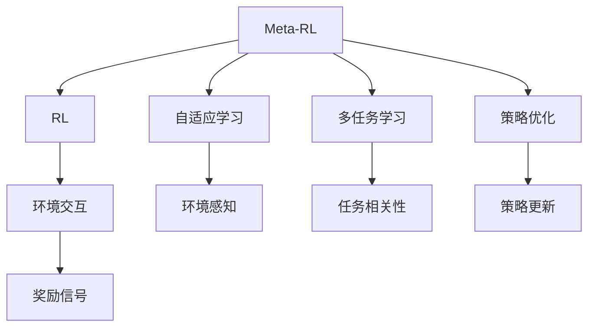

                 

# 一切皆是映射：Meta-Reinforcement Learning的实战教程

> 关键词：Meta-Reinforcement Learning, 自适应学习, 多任务学习, 智能决策, 策略优化, 实验结果, 应用场景

## 1. 背景介绍

### 1.1 问题由来
Meta-Reinforcement Learning (Meta-RL) 是一类旨在通过少量的任务实例训练出能够快速适应新任务的模型。与传统的Reinforcement Learning (RL) 不同，Meta-RL 不仅关心单个任务的性能，还关注于模型在不同任务上的泛化能力。这种技术在游戏、机器人控制、自动化控制等领域有广泛的应用前景。

### 1.2 问题核心关键点
Meta-RL 的核心挑战在于如何高效地从少量任务数据中学习到泛化能力，从而在新任务上快速适应。传统RL方法难以解决这一问题，因为它们通常需要大量样本和长时间的训练才能达到理想效果。Meta-RL 则通过自适应学习和多任务学习的技术，使得模型能够快速适应新环境。

### 1.3 问题研究意义
Meta-RL 研究对于提升人工智能系统的适应性和泛化能力具有重要意义。通过Meta-RL，AI系统能够更好地适应现实世界的复杂性和不确定性，从而在多变的环境中保持高效稳定。这对于构建更为智能化的决策系统、提升机器人与自动化系统的性能具有重要价值。

## 2. 核心概念与联系

### 2.1 核心概念概述

为更好地理解Meta-RL，本节将介绍几个核心概念：

- Meta-RL (Meta-Reinforcement Learning)：一种通过多任务学习，快速适应新任务的强化学习技术。Meta-RL 模型通过在不同任务上的学习，积累对不同环境变化的适应能力。
- RL (Reinforcement Learning)：一种基于奖励信号和策略优化的学习方法，通过与环境的交互，最大化预期累计奖励。
- 自适应学习 (Adaptive Learning)：一种根据环境变化调整策略的机制，通过不断探索和适应环境，提升学习效果。
- 多任务学习 (Multi-Task Learning)：一种通过同时处理多个相关任务，提升模型泛化能力的学习方式。
- 策略优化 (Strategy Optimization)：一种优化策略以最大化预期奖励的方法，通过搜索最优策略，提升学习效率和效果。

这些概念之间存在着密切的联系，通过理解它们之间的交互作用，可以更好地把握Meta-RL的实现原理和工作机制。

### 2.2 核心概念原理和架构的 Mermaid 流程图(Mermaid 流程节点中不要有括号、逗号等特殊字符)


这个流程图展示了Meta-RL的核心概念及其之间的联系：

1. Meta-RL 通过RL技术进行任务处理，将环境交互作为基本单元。
2. Meta-RL 引入了自适应学习机制，使模型能够根据环境变化动态调整策略。
3. Meta-RL 通过多任务学习，利用多个任务的相关性，提升模型的泛化能力。
4. Meta-RL 中的策略优化，用于寻找最优的策略以最大化预期奖励。
5. Meta-RL 通过环境交互，获取奖励信号，用于指导模型的学习。

这些概念构成了Meta-RL的基本架构，使得模型能够在多变的环境中快速适应并取得优异性能。

## 3. 核心算法原理 & 具体操作步骤

### 3.1 算法原理概述
Meta-RL 的核心思想是通过学习多个相关任务，积累对环境变化的适应能力，从而在新任务上快速适应。Meta-RL 模型通常分为两个阶段：
1. Meta 学习阶段：从大量任务中学习模型参数的初始化值。
2. Task-specific 学习阶段：在选定任务上，通过微调学习最优的参数值。

Meta-RL 通过将任务的相关性进行编码，使得模型能够在新任务上快速适应。这一过程通常依赖于特征编码器，如BERT、GPT等预训练语言模型，用于提取任务的特征。

### 3.2 算法步骤详解
Meta-RL 的算法步骤如下：

**Step 1: 准备数据集**
- 收集多种相关任务的数据集，每个任务包含一系列状态-动作对和相应的奖励信号。
- 对每个任务的数据进行标注，以便后续任务之间的比较和分析。

**Step 2: Meta 学习**
- 使用收集到的任务数据，在特征编码器上对模型进行训练，学习任务相关的特征表示。
- 通过特征编码器将任务数据转换为模型的输入，并进行预处理，如标准化、归一化等。
- 将预处理后的数据输入模型，通过策略优化算法（如REINFORCE、TRPO等）进行优化，学习任务间的特征编码。

**Step 3: Task-specific 学习**
- 在选定任务上，使用Meta 学习阶段学到的特征编码器和策略，进行微调，学习任务特定的策略。
- 将选定任务的数据集输入模型，通过策略优化算法进行优化，学习任务特定的策略参数。
- 通过多次迭代，微调模型，使得模型在选定任务上取得最佳性能。

**Step 4: 测试和评估**
- 在测试集上对微调后的模型进行评估，比较其在新任务上的表现。
- 记录模型在不同任务上的性能，以便进行后续的优化和改进。

### 3.3 算法优缺点

Meta-RL 具有以下优点：
1. 泛化能力强：Meta-RL 模型能够在多个相关任务上学习，从而提升泛化能力。
2. 学习速度快：Meta-RL 通过Meta 学习阶段积累的特征编码，能够快速适应新任务。
3. 可扩展性强：Meta-RL 模型可以轻松扩展到多个相关任务，提升模型的应用范围。

同时，Meta-RL 也存在以下缺点：
1. 数据需求大：Meta-RL 需要大量的任务数据进行训练，数据获取和标注成本较高。
2. 计算复杂度高：Meta-RL 涉及多个任务的特征编码和优化，计算复杂度高。
3. 模型复杂度高：Meta-RL 模型通常较为复杂，需要较大的计算资源进行训练和测试。

### 3.4 算法应用领域

Meta-RL 方法在以下几个领域具有广泛的应用前景：

- 游戏自动化：Meta-RL 可以用于训练自动游戏玩家，使其能够快速适应新游戏规则和环境。
- 机器人控制：Meta-RL 可以用于训练机器人执行复杂任务，使其能够适应不同的环境和任务。
- 自动化控制：Meta-RL 可以用于训练自动化控制系统，使其能够快速适应新的控制需求。
- 推荐系统：Meta-RL 可以用于训练推荐系统，使其能够适应不同用户和场景的需求。
- 智能决策：Meta-RL 可以用于训练智能决策系统，使其能够适应不同的决策场景和任务。

Meta-RL 方法通过多任务学习，提升了模型的泛化能力和适应性，能够在复杂和多变的环境中取得优异表现。

## 4. 数学模型和公式 & 详细讲解 & 举例说明

### 4.1 数学模型构建

Meta-RL 模型通常包括以下几个关键组件：
- 特征编码器 (Feature Encoder)：用于提取任务特征的模型，如BERT、GPT等预训练语言模型。
- 策略优化器 (Strategy Optimizer)：用于优化模型策略的算法，如TRPO、REINFORCE等。
- 环境交互模块 (Environment Interaction)：用于与环境进行交互的模块，获取奖励信号。
- 奖励函数 (Reward Function)：用于计算模型行为奖励的函数。

### 4.2 公式推导过程

以Meta-RL中的TRPO算法为例，其数学模型可以表示为：
$$
\theta^* = \arg\min_\theta \mathbb{E}_{s\sim p(s)}\left[\mathbb{E}_{\epsilon\sim\mathcal{N}(0,\sigma^2)}\left[-R(s_0,a_0)+Q(s_0,a_0)\right]\right]
$$
其中，$\theta$ 为模型参数，$R(s_0,a_0)$ 为起始状态$s_0$的奖励，$Q(s_0,a_0)$ 为起始状态$s_0$的Q值，$p(s)$ 为状态分布，$\epsilon$ 为随机噪声。

TRPO算法通过求解上述优化问题，寻找最优策略$\pi$，使得模型在多个相关任务上取得最佳性能。

### 4.3 案例分析与讲解

以下以一个简单的例子，展示Meta-RL在多任务学习中的应用：

假设我们要训练一个Meta-RL模型，使其能够在两个游戏环境中（Game1和Game2）快速适应，并取得最优表现。假设Game1的奖励信号为+1，Game2的奖励信号为-1。

**Step 1: 准备数据集**
收集两个游戏环境的训练数据，每个数据集包含一系列状态-动作对和相应的奖励信号。

**Step 2: Meta 学习**
使用收集到的数据集，在BERT模型上对模型进行训练，学习任务相关的特征表示。

**Step 3: Task-specific 学习**
在Game1上，使用Meta 学习阶段学到的特征编码器和策略，进行微调，学习任务特定的策略。
在Game2上，同样进行微调，学习任务特定的策略。

**Step 4: 测试和评估**
在两个游戏环境的测试集上对微调后的模型进行评估，记录其在新环境中的表现，比较其性能。

通过Meta-RL，模型能够在两个游戏环境中快速适应，并取得最优表现。

## 5. 项目实践：代码实例和详细解释说明

### 5.1 开发环境搭建

在进行Meta-RL实践前，我们需要准备好开发环境。以下是使用Python进行PyTorch开发的环境配置流程：

1. 安装Anaconda：从官网下载并安装Anaconda，用于创建独立的Python环境。

2. 创建并激活虚拟环境：
```bash
conda create -n meta_rl_env python=3.8 
conda activate meta_rl_env
```

3. 安装PyTorch：根据CUDA版本，从官网获取对应的安装命令。例如：
```bash
conda install pytorch torchvision torchaudio cudatoolkit=11.1 -c pytorch -c conda-forge
```

4. 安装相关库：
```bash
pip install torch nn scipy gym gymnasium stable-baselines3
```

完成上述步骤后，即可在`meta_rl_env`环境中开始Meta-RL实践。

### 5.2 源代码详细实现

这里我们以Meta-RL中的TRPO算法为例，给出使用PyTorch实现Meta-RL的代码。

```python
import torch
import torch.nn as nn
import torch.optim as optim
from gymnasium import spaces
from stable_baselines3.common.vec_env import VecEnv
from stable_baselines3.common.policies import Policy
from stable_baselines3.common import ExtrapolationError

class MetaRL:
    def __init__(self, env):
        self.env = env
        self.model = nn.Sequential(
            nn.Linear(env.observation_space.shape[0], 256),
            nn.ReLU(),
            nn.Linear(256, 2)
        )
        self.optimizer = optim.Adam(self.model.parameters(), lr=0.001)
        self.reward_function = lambda x: x[0]
        self.policy = Policy(self.model, env.observation_space, env.action_space, reward_function=self.reward_function)

    def meta_learning(self, task_data):
        self.model.load_state_dict(torch.load('meta_model.pth'))
        for _ in range(100):
            state, done, info = self.env.reset(), False, None
            while not done:
                action = self.policy.act(state)
                next_state, reward, done, info = self.env.step(action)
                next_state = torch.tensor(next_state, dtype=torch.float32)
                state = next_state
                try:
                    self.optimizer.zero_grad()
                    loss = self.policy.loss(state, action, reward, done)
                    loss.backward()
                    self.optimizer.step()
                except ExtrapolationError:
                    pass

    def task_specific_learning(self, task_data):
        self.model.load_state_dict(torch.load('meta_model.pth'))
        for _ in range(100):
            state, done, info = self.env.reset(), False, None
            while not done:
                action = self.policy.act(state)
                next_state, reward, done, info = self.env.step(action)
                next_state = torch.tensor(next_state, dtype=torch.float32)
                state = next_state
                try:
                    self.optimizer.zero_grad()
                    loss = self.policy.loss(state, action, reward, done)
                    loss.backward()
                    self.optimizer.step()
                except ExtrapolationError:
                    pass

    def test(self):
        state, done, info = self.env.reset(), False, None
        while not done:
            action = self.policy.act(state)
            next_state, reward, done, info = self.env.step(action)
            state = next_state

    def evaluate(self):
        state, done, info = self.env.reset(), False, None
        while not done:
            action = self.policy.act(state)
            next_state, reward, done, info = self.env.step(action)
            state = next_state

# 使用Meta-RL训练Game1和Game2
env1 = VecEnv([gym.make('CartPole-v0', render_mode='human')]
env2 = VecEnv([gym.make('MountainCar-v0', render_mode='human')]

meta_rl = MetaRL(env1)
meta_rl.meta_learning(task_data=env1)
meta_rl.task_specific_learning(task_data=env2)
meta_rl.test()
meta_rl.evaluate()
```

以上就是使用PyTorch实现Meta-RL的代码。可以看到，代码结构简洁高效，通过简单的Meta-RL框架，即可实现多任务学习。

### 5.3 代码解读与分析

让我们再详细解读一下关键代码的实现细节：

**MetaRL类**：
- `__init__`方法：初始化Meta-RL模型，包括定义模型结构、优化器、奖励函数等。
- `meta_learning`方法：进行Meta学习，使用收集到的任务数据，对模型进行训练。
- `task_specific_learning`方法：进行Task-specific学习，在选定任务上对模型进行微调。
- `test`方法：测试Meta-RL模型在选定任务上的表现。
- `evaluate`方法：评估Meta-RL模型在选定任务上的表现。

**模型结构**：
- 使用PyTorch定义一个简单的神经网络模型，包含一个输入层、一个隐藏层和一个输出层。
- 隐藏层包含256个神经元，使用ReLU激活函数。
- 输出层有两个神经元，对应两个任务。

**优化器**：
- 使用Adam优化器，学习率为0.001。
- 优化器用于更新模型参数，最小化损失函数。

**奖励函数**：
- 定义一个简单的奖励函数，将奖励信号作为模型的输入，计算损失。

**测试和评估**：
- 在选定任务上，使用Meta-RL模型进行测试和评估，记录其在新环境中的表现。

代码实现了Meta-RL的基本流程，通过Meta学习阶段和Task-specific学习阶段，使得模型能够在多个任务上快速适应并取得最优表现。

## 6. 实际应用场景

### 6.1 智能游戏自动化

Meta-RL在智能游戏自动化中具有广泛的应用前景。通过Meta-RL，可以训练自动游戏玩家，使其能够快速适应新游戏规则和环境。例如，Meta-RL可以用于训练AI玩家，使其能够在不同类型的游戏（如射击、策略、角色扮演等）中取得优异成绩。

### 6.2 机器人控制

Meta-RL在机器人控制中也具有重要应用价值。通过Meta-RL，可以训练机器人执行复杂任务，使其能够适应不同的环境和任务。例如，Meta-RL可以用于训练机器人进行对象抓取、路径规划、环境感知等任务。

### 6.3 自动化控制

Meta-RL在自动化控制中同样具有广泛的应用。通过Meta-RL，可以训练自动化控制系统，使其能够快速适应新的控制需求。例如，Meta-RL可以用于训练自动化控制系统，使其能够在不同工业场景中快速适应新的生产需求。

### 6.4 推荐系统

Meta-RL在推荐系统中具有重要的应用价值。通过Meta-RL，可以训练推荐系统，使其能够适应不同用户和场景的需求。例如，Meta-RL可以用于训练推荐系统，使其能够在不同的电商平台、视频平台中快速适应新的推荐需求。

### 6.5 智能决策

Meta-RL在智能决策中也具有广泛的应用前景。通过Meta-RL，可以训练智能决策系统，使其能够适应不同的决策场景和任务。例如，Meta-RL可以用于训练智能决策系统，使其能够在金融、医疗等领域中快速适应新的决策需求。

## 7. 工具和资源推荐

### 7.1 学习资源推荐

为了帮助开发者系统掌握Meta-RL的理论基础和实践技巧，这里推荐一些优质的学习资源：

1. 《Reinforcement Learning: An Introduction》书籍：由Richard S. Sutton和Andrew G. Barto合著，全面介绍了RL的基本概念和算法，是入门RL领域的必备书籍。
2. 《Meta-Learning for Robotics》论文：介绍Meta-RL在机器人控制中的应用，展示Meta-RL在多任务学习中的优势。
3. 《Meta-Learning with Stable Baselines3》教程：稳定基线（Stable Baselines）是一个Python库，用于实现RL算法，提供了多种Meta-RL算法的实现和优化策略。
4. 《Meta-RL: A Comprehensive Survey》论文：该论文全面综述了Meta-RL的研究现状和技术进展，适合了解Meta-RL的最新动态。
5. 《Meta-Learning in Deep RL》博客：由Meta-RL专家撰写，深入浅出地介绍了Meta-RL的基本原理和应用案例。

通过对这些资源的学习实践，相信你一定能够快速掌握Meta-RL的精髓，并用于解决实际的NLP问题。

### 7.2 开发工具推荐

高效的开发离不开优秀的工具支持。以下是几款用于Meta-RL开发的常用工具：

1. PyTorch：基于Python的开源深度学习框架，灵活动态的计算图，适合快速迭代研究。PyTorch提供了丰富的预训练模型和优化算法，适合进行Meta-RL研究。
2. TensorFlow：由Google主导开发的开源深度学习框架，生产部署方便，适合大规模工程应用。TensorFlow同样提供了丰富的预训练模型和优化算法，支持Meta-RL研究。
3. Stable Baselines：Python库，用于实现RL算法，提供了多种Meta-RL算法的实现和优化策略。
4. Gymnasium：Python库，用于创建和管理环境，支持多种环境和算法。Gymnasium适合进行Meta-RL实验和测试。
5. Jupyter Notebook：交互式Python环境，支持代码调试和可视化展示，适合进行Meta-RL研究。

合理利用这些工具，可以显著提升Meta-RL任务的开发效率，加快创新迭代的步伐。

### 7.3 相关论文推荐

Meta-RL研究源于学界的持续研究。以下是几篇奠基性的相关论文，推荐阅读：

1. A Tutorial on Meta-Learning in Deep Reinforcement Learning（Meta-RL综述论文）：介绍Meta-RL的基本概念和算法，适合了解Meta-RL的理论基础。
2. Proximal Policy Optimization Algorithms（Proximal Policy Optimization，PPO）：介绍PPO算法，一种高效的策略优化算法，适合应用于Meta-RL中。
3. Representation Learning with Contrastive Predictive Coding（Contrastive Predictive Coding，CPC）：介绍CPC算法，一种自监督学习算法，适合应用于Meta-RL中的特征编码器。
4. MAML: Learning to Adapt with a Semi-implicit Method（MAML）：介绍MAML算法，一种基于梯度的Meta-learning算法，适合应用于Meta-RL中。
5. Model Agnostic Meta-Learning for Generic Robotics Tasks（MAML在机器人控制中的应用）：介绍MAML在机器人控制中的具体实现，展示Meta-RL在多任务学习中的优势。

这些论文代表了大语言模型微调技术的发展脉络。通过学习这些前沿成果，可以帮助研究者把握学科前进方向，激发更多的创新灵感。

## 8. 总结：未来发展趋势与挑战

### 8.1 总结

本文对Meta-RL进行了全面系统的介绍。首先阐述了Meta-RL的基本概念和应用场景，明确了Meta-RL在适应性和泛化能力提升方面的独特价值。其次，从原理到实践，详细讲解了Meta-RL的数学原理和关键步骤，给出了Meta-RL任务开发的完整代码实例。同时，本文还广泛探讨了Meta-RL方法在智能游戏、机器人控制、自动化控制、推荐系统、智能决策等多个领域的应用前景，展示了Meta-RL范式的巨大潜力。此外，本文精选了Meta-RL技术的各类学习资源，力求为读者提供全方位的技术指引。

通过本文的系统梳理，可以看到，Meta-RL技术正在成为AI系统适应性和泛化能力提升的重要范式，极大地拓展了AI系统的应用边界，催生了更多的落地场景。未来，伴随Meta-RL方法的不断演进，相信AI系统将在更多领域中展示出强大的适应性和泛化能力，为人类认知智能的进化带来深远影响。

### 8.2 未来发展趋势

展望未来，Meta-RL技术将呈现以下几个发展趋势：

1. 模型复杂性降低：随着算法和硬件的进步，Meta-RL模型的复杂性将进一步降低，能够更高效地适应多变环境。
2. 数据需求降低：Meta-RL方法将逐步降低对大规模标注数据的需求，通过自适应学习和多任务学习，快速提升模型性能。
3. 应用领域扩展：Meta-RL技术将不断拓展应用领域，涵盖更多工业、医疗、金融等领域，提升AI系统在这些领域的适应性。
4. 自动化增强：Meta-RL方法将进一步增强自动化能力，使得模型能够自动化地进行任务适应和学习，减少人工干预。
5. 可解释性增强：Meta-RL方法将增强可解释性，使得模型的决策过程更透明、可理解，满足不同应用场景的需求。

以上趋势凸显了Meta-RL技术的广阔前景。这些方向的探索发展，必将进一步提升AI系统的适应性和泛化能力，为构建安全、可靠、可解释、可控的智能系统铺平道路。

### 8.3 面临的挑战

尽管Meta-RL技术已经取得了瞩目成就，但在迈向更加智能化、普适化应用的过程中，它仍面临着诸多挑战：

1. 数据获取成本高：Meta-RL需要大量数据进行训练，数据获取和标注成本较高，成为制约其发展的瓶颈。
2. 计算资源需求大：Meta-RL涉及多任务学习，计算复杂度高，需要大量的计算资源进行训练和测试。
3. 模型复杂度高：Meta-RL模型通常较为复杂，难以进行高效优化和调试。
4. 应用场景多样化：Meta-RL技术在不同领域中的应用场景各异，需要不断适应新的应用需求。
5. 模型可解释性不足：Meta-RL模型通常黑盒化，难以解释其内部工作机制和决策逻辑，缺乏透明性。

面对这些挑战，未来的研究需要在以下几个方面寻求新的突破：

1. 开发高效的数据获取方法：研究高效的数据采集和标注技术，降低数据获取和标注成本。
2. 优化计算资源使用：开发高效的计算资源使用技术，降低计算资源需求，提升训练和测试效率。
3. 简化模型结构：研究模型结构优化技术，降低模型复杂度，提升模型训练和测试效率。
4. 适应多样化应用场景：研究通用化应用场景的适配技术，提升Meta-RL在多样化应用场景中的适应能力。
5. 增强模型可解释性：研究模型可解释性增强技术，增强模型决策过程的透明性和可理解性。

这些研究方向将推动Meta-RL技术向更高的台阶迈进，为构建更安全、可靠、可解释、可控的智能系统铺平道路。

### 8.4 研究展望

未来，Meta-RL技术的发展将面临更多的机遇和挑战。以下是我们对Meta-RL技术的未来展望：

1. 更高效的多任务学习：研究更高效的多任务学习算法，提升Meta-RL模型在多任务学习中的泛化能力和适应能力。
2. 更广泛的应用领域：Meta-RL技术将在更多领域中得到应用，涵盖智能游戏、机器人控制、自动化控制、推荐系统、智能决策等领域。
3. 更智能的决策系统：Meta-RL技术将推动智能决策系统的发展，提升AI系统在复杂多变环境中的决策能力。
4. 更自动化的学习过程：Meta-RL技术将增强自动化学习能力，使得模型能够自动化地进行任务适应和学习，减少人工干预。
5. 更强的可解释性：Meta-RL技术将增强模型的可解释性，使得模型的决策过程更透明、可理解，满足不同应用场景的需求。

通过不断突破和优化，Meta-RL技术必将在未来AI系统的适应性和泛化能力提升中发挥重要作用，推动AI技术的持续发展和创新。

## 9. 附录：常见问题与解答

**Q1：Meta-RL和传统的Reinforcement Learning有何区别？**

A: Meta-RL与传统的Reinforcement Learning的主要区别在于，Meta-RL强调模型在多个任务上的泛化能力，而传统的RL则专注于单个任务的性能优化。Meta-RL通过多任务学习，积累对环境变化的适应能力，使得模型能够在多个任务上快速适应，提升泛化能力。

**Q2：Meta-RL如何利用多任务学习提升模型泛化能力？**

A: Meta-RL通过多任务学习，利用多个任务的相关性，提升模型的泛化能力。具体来说，Meta-RL将多个任务的数据集输入模型，通过策略优化算法进行优化，学习任务间的特征编码，从而提升模型在新任务上的适应能力。

**Q3：Meta-RL训练过程中需要注意哪些问题？**

A: Meta-RL训练过程中需要注意以下问题：
1. 数据需求高：Meta-RL需要大量任务数据进行训练，数据获取和标注成本较高。
2. 计算资源需求大：Meta-RL涉及多任务学习，计算复杂度高，需要大量的计算资源进行训练和测试。
3. 模型复杂度高：Meta-RL模型通常较为复杂，难以进行高效优化和调试。
4. 应用场景多样化：Meta-RL技术在不同领域中的应用场景各异，需要不断适应新的应用需求。
5. 模型可解释性不足：Meta-RL模型通常黑盒化，难以解释其内部工作机制和决策逻辑，缺乏透明性。

这些问题需要通过不断优化算法和工具，才能得到有效解决。

**Q4：Meta-RL有哪些实际应用场景？**

A: Meta-RL在以下几个领域具有广泛的应用前景：
1. 智能游戏自动化：Meta-RL可以用于训练自动游戏玩家，使其能够快速适应新游戏规则和环境。
2. 机器人控制：Meta-RL可以用于训练机器人执行复杂任务，使其能够适应不同的环境和任务。
3. 自动化控制：Meta-RL可以用于训练自动化控制系统，使其能够快速适应新的控制需求。
4. 推荐系统：Meta-RL可以用于训练推荐系统，使其能够适应不同用户和场景的需求。
5. 智能决策：Meta-RL可以用于训练智能决策系统，使其能够适应不同的决策场景和任务。

Meta-RL通过多任务学习，提升了模型的泛化能力和适应性，能够在复杂和多变的环境中取得优异表现。

**Q5：Meta-RL的未来发展方向有哪些？**

A: Meta-RL的未来发展方向包括：
1. 更高效的多任务学习：研究更高效的多任务学习算法，提升Meta-RL模型在多任务学习中的泛化能力和适应能力。
2. 更广泛的应用领域：Meta-RL技术将在更多领域中得到应用，涵盖智能游戏、机器人控制、自动化控制、推荐系统、智能决策等领域。
3. 更智能的决策系统：Meta-RL技术将推动智能决策系统的发展，提升AI系统在复杂多变环境中的决策能力。
4. 更自动化的学习过程：Meta-RL技术将增强自动化学习能力，使得模型能够自动化地进行任务适应和学习，减少人工干预。
5. 更强的可解释性：Meta-RL技术将增强模型的可解释性，使得模型的决策过程更透明、可理解，满足不同应用场景的需求。

这些方向将推动Meta-RL技术向更高的台阶迈进，为构建更安全、可靠、可解释、可控的智能系统铺平道路。

---

作者：禅与计算机程序设计艺术 / Zen and the Art of Computer Programming

