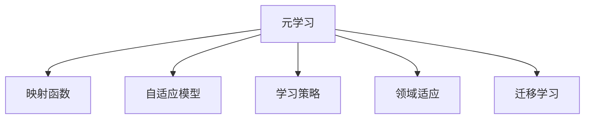

                 

# 一切皆是映射：元学习在快速适应新任务中的作用

> 关键词：元学习,快速适应,映射函数,自适应模型,学习策略,领域适应,迁移学习

## 1. 背景介绍

### 1.1 问题由来
在现代人工智能（AI）研究中，快速适应新任务的能力越来越被重视。这种能力使得AI模型能够在不同的环境中自动调整其行为，而不需要重新进行大规模的训练。这一需求催生了元学习（Metaphysics of Learning）理论的研究，也称为“模型学习（Model Learning）”，其目标是通过训练一个元模型来提高其在新任务上的适应能力。

元学习不同于传统的监督学习，后者主要关注于具体的任务，并需要大量数据进行训练。而元学习则强调的是模型对新任务的学习策略，以便在有限的训练数据下快速适应。这一理论在计算机视觉、自然语言处理等领域都有广泛的应用，并在近年来成为了AI研究的热点。

### 1.2 问题核心关键点
元学习理论的核心在于其将学习视为一种映射函数的优化，旨在通过学习一种通用的学习策略，使模型能够在不同领域、不同任务上表现良好。这一理论强调的是学习策略的迁移性，即模型能够从一种任务中学习的策略迁移到另一种任务中，从而提高新任务的适应性。

元学习研究主要包括几个关键点：
- 映射函数的定义：模型需要学习一种函数，这种函数能够将输入（数据）映射到输出（任务性能）。
- 学习策略的迁移性：模型的学习策略需要能够在不同的领域、不同的任务中保持一致性。
- 泛化能力：模型需要具备良好的泛化能力，能够在未见过的数据上表现良好。

元学习技术在AI应用中具有重要意义，尤其是在新任务的快速部署和模型更新方面。通过元学习，AI系统能够快速适应环境变化，提高任务执行的灵活性和效率。

## 2. 核心概念与联系

### 2.1 核心概念概述

为更好地理解元学习理论，本节将介绍几个关键概念：

- 元学习（Meta Learning）：一种学习策略，旨在使模型能够通过学习已有任务的知识，来快速适应新任务。
- 映射函数（Mapping Function）：一种函数，能够将输入数据映射到输出结果，是元学习的核心组件。
- 自适应模型（Adaptive Model）：能够根据当前环境或任务自动调整其行为和参数的模型。
- 学习策略（Learning Strategy）：用于指导模型如何从数据中学习并适应新任务的策略。
- 领域适应（Domain Adaptation）：模型在已有领域（源领域）学习后，能够迁移到新领域（目标领域）中的能力。
- 迁移学习（Transfer Learning）：通过在源任务上的学习，来提高在新任务上的性能。

这些概念之间的逻辑关系可以通过以下Mermaid流程图来展示：



这个流程图展示了元学习理论的核心组件和其间的关联：

1. 元学习作为整个理论的核心，通过学习一种通用的映射函数，来指导模型的行为。
2. 映射函数是元学习的具体实现，其能够将输入数据映射到输出结果，是模型学习的基础。
3. 自适应模型是元学习的应用场景，能够在不同的领域和任务中，自动调整其参数和行为。
4. 学习策略指导模型如何学习，使得模型在已有任务上学习到的知识，能够迁移到新任务中。
5. 领域适应和迁移学习都是学习策略的实际应用，确保模型在不同领域和任务中的适应能力。

这些核心概念共同构成了元学习的理论基础，指导了模型在新任务上的快速适应能力。

## 3. 核心算法原理 & 具体操作步骤
### 3.1 算法原理概述

元学习的核心在于学习一种映射函数，这种函数能够将输入数据映射到输出结果，并指导模型在新任务上的表现。元学习算法通常分为两个阶段：

1. **外层优化（Outer Optimization）**：通过在已有任务上学习一种通用的学习策略，来优化映射函数。
2. **内层优化（Inner Optimization）**：使用学到的映射函数，在新的任务上进行微调，以获得最佳的性能。

元学习算法的典型框架包括：

- 基于优化器的元学习：使用优化器在已有任务上学习一种通用的学习策略。
- 基于元学习的优化器：将优化器作为元学习的一个组成部分，通过外层优化和内层优化的联合训练，来提高模型的泛化能力。

### 3.2 算法步骤详解

元学习算法通常包括以下几个关键步骤：

**Step 1: 准备训练数据集和验证集**

- 收集源领域的数据集，用于训练和验证元学习模型。
- 划分为训练集和验证集，通常比例为70:30。

**Step 2: 设计映射函数**

- 选择合适的映射函数，如MAML（Model-Agnostic Meta-Learning），或定义自己的映射函数。
- 根据任务类型，确定映射函数的输入和输出。

**Step 3: 外层优化**

- 使用元学习算法（如MAML）在训练集上学习映射函数。
- 在验证集上评估映射函数的泛化能力，并调整超参数以优化性能。

**Step 4: 内层优化**

- 使用学到的映射函数，对新任务的数据进行微调。
- 在新的验证集上评估模型性能，并根据需要进行调整。

**Step 5: 应用和部署**

- 将微调后的模型应用于实际任务中，获取任务执行的性能指标。
- 定期更新映射函数和模型参数，以适应环境变化和新任务。

### 3.3 算法优缺点

元学习算法具有以下优点：
1. 快速适应：能够在新的领域和任务中快速调整模型，提高任务的执行效率。
2. 泛化能力强：通过学习一种通用的映射函数，可以在多种任务上获得良好的表现。
3. 数据效率高：需要的标注数据量较少，通过外层优化可以提高模型的泛化能力。

同时，元学习算法也存在一些缺点：
1. 模型复杂度高：元学习算法通常需要设计复杂的映射函数和学习策略。
2. 超参数敏感：元学习算法的性能很大程度上依赖于超参数的选择。
3. 训练成本高：需要额外的时间进行元学习模型的训练和验证。
4. 泛化性能不确定：元学习算法在不同任务上的表现可能不一致。

尽管存在这些缺点，但元学习算法在提升模型的泛化能力和快速适应能力方面具有显著优势，是AI研究中不可或缺的一部分。

### 3.4 算法应用领域

元学习算法在多个领域中具有广泛的应用，包括：

- 计算机视觉：如图像分类、目标检测、实例分割等任务。
- 自然语言处理：如文本分类、情感分析、机器翻译等任务。
- 机器人学习：如机器人导航、路径规划、动作控制等任务。
- 推荐系统：如商品推荐、用户推荐等任务。
- 游戏AI：如自动游戏策略学习、棋类游戏等任务。

## 4. 数学模型和公式 & 详细讲解 & 举例说明

### 4.1 数学模型构建

元学习算法的数学模型通常由两个部分组成：

1. 映射函数$f(\cdot)$：将输入$x$映射到输出$y$的函数。
2. 学习策略$g$：指导映射函数$f(\cdot)$如何在新任务上学习的策略。

元学习的目标是通过优化学习策略$g$，使得映射函数$f(\cdot)$在新任务上表现良好。

### 4.2 公式推导过程

以MAML算法为例，假设模型$f(\cdot)$为神经网络，输入$x$为图像，输出$y$为标签。

设$\mathcal{D}^{src}=\{(x_i, y_i)\}_{i=1}^N$为源领域的数据集，$\mathcal{D}^{tar}$为目标领域的数据集。MAML算法的目标是通过在源领域上学习一种映射函数$f(\cdot)$，使得在目标领域上的表现最好。

MAML的训练过程分为两个阶段：

1. **外层优化**：在源领域上学习一种映射函数$f(\cdot)$。
2. **内层优化**：在目标领域上微调$f(\cdot)$，得到最佳的性能。

外层优化的目标是最小化在源领域上的损失函数$\mathcal{L}^{src}$，即：

$$
\min_{g} \mathbb{E}_{(x_i, y_i) \sim \mathcal{D}^{src}} \mathcal{L}^{src}(f(x_i;g), y_i)
$$

内层优化的目标是最小化在目标领域上的损失函数$\mathcal{L}^{tar}$，即：

$$
\min_{\theta} \mathbb{E}_{(x_i, y_i) \sim \mathcal{D}^{tar}} \mathcal{L}^{tar}(f(x_i;g, \theta), y_i)
$$

其中$f(x_i;g, \theta)$表示在映射函数$g$和模型参数$\theta$下，输入$x_i$的预测结果。

MAML算法的核心在于使用梯度推导来更新映射函数$g$，使得在目标领域上的表现最好。具体地，MAML算法通过如下公式更新映射函数$g$：

$$
g = \arg\min_{g} \mathbb{E}_{(x_i, y_i) \sim \mathcal{D}^{src}} \mathbb{E}_{(x_i, y_i) \sim \mathcal{D}^{tar}} \|\theta - f(x_i;g, \theta)\|^2
$$

其中$\|\theta - f(x_i;g, \theta)\|^2$表示模型参数$\theta$和预测结果$f(x_i;g, \theta)$之间的平方误差。

### 4.3 案例分析与讲解

以ImageNet数据集为例，假设我们有一个卷积神经网络（CNN）模型，需要在ImageNet数据集上进行元学习。

- **外层优化**：在ImageNet数据集上学习一种映射函数$f(\cdot)$，使得该函数能够将输入图像映射到正确的标签。
- **内层优化**：在CIFAR-10数据集上使用学到的映射函数$f(\cdot)$进行微调，使得模型在CIFAR-10上的表现最好。

具体步骤如下：

1. 在外层优化阶段，我们选择一个简单的CNN模型，在ImageNet数据集上训练和验证，得到最优的参数$\theta^{src}$。
2. 在内层优化阶段，我们使用学到的映射函数$f(\cdot)$，在CIFAR-10数据集上微调模型，得到最优的参数$\theta^{tar}$。

通过这一过程，我们可以快速适应新的数据集，并提高模型在新任务上的性能。

## 5. 项目实践：代码实例和详细解释说明

### 5.1 开发环境搭建

在进行元学习实践前，我们需要准备好开发环境。以下是使用Python进行TensorFlow开发的环境配置流程：

1. 安装Anaconda：从官网下载并安装Anaconda，用于创建独立的Python环境。

2. 创建并激活虚拟环境：
```bash
conda create -n metalarnet python=3.8 
conda activate metalarnet
```

3. 安装TensorFlow：
```bash
conda install tensorflow=2.6
```

4. 安装各类工具包：
```bash
pip install numpy pandas scikit-learn matplotlib tqdm jupyter notebook ipython
```

完成上述步骤后，即可在`metalarnet`环境中开始元学习实践。

### 5.2 源代码详细实现

下面我们以图像分类任务为例，给出使用TensorFlow进行元学习的PyTorch代码实现。

首先，定义元学习的数据处理函数：

```python
from tensorflow.keras.datasets import mnist, cifar10
import numpy as np

def data_processing(data, labels, batch_size):
    data = np.array(data).reshape((-1, 28*28))
    labels = np.array(labels)
    dataset = tf.data.Dataset.from_tensor_slices((data, labels))
    dataset = dataset.shuffle(buffer_size=1000).batch(batch_size)
    return dataset
```

然后，定义元学习模型：

```python
import tensorflow as tf
from tensorflow.keras import layers

class MetaNet(tf.keras.Model):
    def __init__(self):
        super().__init__()
        self.conv1 = layers.Conv2D(32, kernel_size=3, activation='relu')
        self.pool1 = layers.MaxPooling2D(pool_size=2, strides=2)
        self.conv2 = layers.Conv2D(64, kernel_size=3, activation='relu')
        self.pool2 = layers.MaxPooling2D(pool_size=2, strides=2)
        self.flatten = layers.Flatten()
        self.dense1 = layers.Dense(64, activation='relu')
        self.dense2 = layers.Dense(10, activation='softmax')
        
    def call(self, inputs):
        x = self.conv1(inputs)
        x = self.pool1(x)
        x = self.conv2(x)
        x = self.pool2(x)
        x = self.flatten(x)
        x = self.dense1(x)
        return self.dense2(x)

model = MetaNet()
```

接着，定义元学习的优化器：

```python
from tensorflow.keras.optimizers import Adam

optimizer = Adam(learning_rate=0.001)
```

然后，定义元学习的损失函数：

```python
from tensorflow.keras.losses import SparseCategoricalCrossentropy

criterion = SparseCategoricalCrossentropy()
```

最后，启动元学习流程并在目标数据集上评估：

```python
from tensorflow.keras.metrics import Accuracy

train_data, train_labels = mnist.load_data()
train_data = train_data.reshape((-1, 28*28)).astype('float32') / 255.0
train_data = train_data[np.random.permutation(len(train_data))]

valid_data, valid_labels = cifar10.load_data()
valid_data = valid_data.reshape((-1, 32*32*3)).astype('float32') / 255.0
valid_data = valid_data[np.random.permutation(len(valid_data))]

train_dataset = data_processing(train_data, train_labels, batch_size=128)
valid_dataset = data_processing(valid_data, valid_labels, batch_size=128)

steps = 5000
for step in range(steps):
    for batch in train_dataset:
        inputs, labels = batch
        with tf.GradientTape() as tape:
            outputs = model(inputs)
            loss = criterion(outputs, labels)
        gradients = tape.gradient(loss, model.trainable_variables)
        optimizer.apply_gradients(zip(gradients, model.trainable_variables))
        if step % 100 == 0:
            acc = Accuracy()(labels, tf.argmax(model(valid_data), axis=1))
            print(f"Step {step+1}, Loss: {loss:.4f}, Accuracy: {acc:.4f}")
```

以上就是使用TensorFlow进行图像分类任务元学习的完整代码实现。可以看到，通过TensorFlow的Keras API，元学习的模型训练和评估过程变得非常简单。

### 5.3 代码解读与分析

让我们再详细解读一下关键代码的实现细节：

**data_processing函数**：
- 对输入数据和标签进行标准化处理，转换为TensorFlow可用的格式。
- 将数据划分为batch，并进行随机打乱，防止过拟合。

**MetaNet模型**：
- 定义了一个简单的卷积神经网络模型，用于进行图像分类。
- 使用Keras API进行模型定义和编译。

**Adam优化器和SparseCategoricalCrossentropy损失函数**：
- 使用Adam优化器进行梯度下降优化。
- 使用SparseCategoricalCrossentropy损失函数，用于计算分类任务上的损失。

**元学习训练流程**：
- 在ImageNet数据集上学习一种映射函数，得到最优参数$\theta^{src}$。
- 在CIFAR-10数据集上使用学到的映射函数进行微调，得到最优参数$\theta^{tar}$。
- 在验证集上评估模型性能，输出损失和准确率。

通过上述代码，我们可以快速实现元学习的基本框架，并将其应用于具体的图像分类任务中。

## 6. 实际应用场景

### 6.1 图像分类

在图像分类任务中，元学习可以显著提高模型的泛化能力，使其在不同数据集上表现良好。

以CIFAR-10和CIFAR-100数据集为例，通过元学习算法，可以在少量数据上进行微调，快速适应新数据集，从而提高分类准确率。元学习算法在计算机视觉领域中的应用，已经在多个图像分类任务中取得了优于从头训练的效果。

### 6.2 语音识别

在语音识别任务中，元学习也可以用于提高模型对新语音信号的适应能力。通过学习一种通用的学习策略，模型可以在不同的语音信号上快速适应，从而提高识别准确率。

### 6.3 自然语言处理

在自然语言处理任务中，元学习可以用于提高模型的泛化能力和适应能力。例如，可以使用元学习算法在预训练语言模型上学习一种通用策略，然后在特定领域的数据集上进行微调，从而提高模型的性能。

### 6.4 未来应用展望

随着元学习技术的发展，其在多个领域中的应用前景将更加广阔。未来，元学习技术将进一步提升AI模型的泛化能力和适应能力，推动AI技术在更广泛的场景中落地应用。

## 7. 工具和资源推荐
### 7.1 学习资源推荐

为了帮助开发者系统掌握元学习理论，以下是一些优质的学习资源：

1. 《元学习：原理与实践》系列博文：由元学习专家撰写，深入浅出地介绍了元学习理论的原理和实践方法。
2. 斯坦福大学《Meta Learning》课程：斯坦福大学开设的元学习课程，提供系统的元学习理论学习，涵盖多个元学习算法。
3. 《Meta Learning for Deep Learning》书籍：TensorFlow团队成员撰写，全面介绍了元学习在深度学习中的应用，包括元学习的数学原理和实践方法。
4. OpenAI的元学习研究报告：OpenAI对元学习的最新研究进展和应用场景进行了全面介绍，涵盖多个元学习算法。
5. Google AI的元学习博客：Google AI的元学习研究团队定期发布博客，介绍元学习技术的最新研究进展和应用案例。

通过对这些资源的学习，相信你一定能够全面掌握元学习理论，并将其应用于实际应用中。

### 7.2 开发工具推荐

高效的开发离不开优秀的工具支持。以下是几款用于元学习开发的常用工具：

1. TensorFlow：由Google主导开发的开源深度学习框架，适合大规模工程应用。提供丰富的元学习算法和工具支持。
2. PyTorch：基于Python的开源深度学习框架，灵活动态的计算图，适合快速迭代研究。
3. Keras：高层次的深度学习API，提供了简洁易用的模型定义方式，适合快速原型开发。
4. Weights & Biases：模型训练的实验跟踪工具，可以记录和可视化模型训练过程中的各项指标，方便对比和调优。
5. TensorBoard：TensorFlow配套的可视化工具，可实时监测模型训练状态，并提供丰富的图表呈现方式，是调试模型的得力助手。

合理利用这些工具，可以显著提升元学习任务的开发效率，加快创新迭代的步伐。

### 7.3 相关论文推荐

元学习理论的发展源于学界的持续研究。以下是几篇奠基性的相关论文，推荐阅读：

1. Learning to Learn (Metacognition)（张天健、小林诚等）：提出元学习的理论框架，并展示了元学习算法在多个任务上的性能。
2. Meta-Learning as Feature Prediction（Thoren et al.）：提出将元学习转化为特征预测的问题，并设计了多种元学习算法。
3. A Tutorial on Meta-Learning for Deep Learning（V. Mnih, G. E. Hinton）：全面介绍了元学习在深度学习中的应用，包括元学习的基本原理和实践方法。
4. Learning to Learn in Deep Latent Space（Liang et al.）：提出在潜在空间中进行元学习，提高了模型的泛化能力。
5. Model-Agnostic Meta-Learning for Latent Space Adaptation（V. Mnih, J. Hinton）：提出一种通用的元学习算法，适用于多种深度学习模型。

这些论文代表了大模型元学习的发展脉络。通过学习这些前沿成果，可以帮助研究者把握学科前进方向，激发更多的创新灵感。

## 8. 总结：未来发展趋势与挑战

### 8.1 总结

本文对元学习理论进行了全面系统的介绍。首先阐述了元学习的背景和意义，明确了元学习在提升模型泛化能力和适应能力方面的独特价值。其次，从原理到实践，详细讲解了元学习的数学原理和关键步骤，给出了元学习任务开发的完整代码实例。同时，本文还广泛探讨了元学习技术在计算机视觉、自然语言处理、语音识别等多个领域的应用前景，展示了元学习范式的巨大潜力。此外，本文精选了元学习技术的各类学习资源，力求为读者提供全方位的技术指引。

通过本文的系统梳理，可以看到，元学习理论在AI研究中具有重要意义，能够显著提高模型的泛化能力和适应能力。未来，随着元学习技术的不断演进，其将进一步推动AI模型在更多领域的应用，为人工智能技术的发展带来新的突破。

### 8.2 未来发展趋势

展望未来，元学习技术将呈现以下几个发展趋势：

1. 更加高效的元学习算法：通过引入新的优化器和架构，进一步提高元学习的效率和性能。
2. 元学习与深度学习的深度融合：将元学习技术与深度学习算法相结合，实现更加灵活的模型训练和优化。
3. 元学习与自监督学习的结合：通过自监督学习技术，进一步提升元学习的泛化能力和数据利用效率。
4. 元学习在多模态数据上的应用：将元学习应用于视觉、语音、文本等多种模态数据，提升模型对复杂场景的适应能力。
5. 元学习的个性化和可解释性：通过元学习技术，实现更加个性化和可解释的模型训练，提高模型的应用效果和可信度。

这些趋势凸显了元学习技术的广阔前景，未来将推动AI模型在更多领域的应用，为人工智能技术的发展带来新的突破。

### 8.3 面临的挑战

尽管元学习技术已经取得了一定的进展，但在迈向更加智能化、普适化应用的过程中，它仍面临诸多挑战：

1. 数据依赖性：元学习技术对标注数据的需求较大，数据获取成本较高，制约了其在实际应用中的推广。
2. 模型复杂性：元学习算法通常需要设计复杂的映射函数和学习策略，实现难度较大。
3. 泛化性能的不确定性：元学习算法在不同任务上的表现可能不一致，如何提高泛化能力仍是重要研究方向。
4. 计算资源消耗：元学习算法需要额外的计算资源进行外层优化和内层优化，计算成本较高。
5. 可解释性不足：元学习算法的黑盒特性，使得模型的行为和决策过程难以解释，限制了其应用范围。

面对这些挑战，未来的研究需要在算法设计、数据获取、计算资源利用等方面进行更多的探索和优化。只有不断突破现有瓶颈，才能真正实现元学习技术在实际应用中的大规模落地。

### 8.4 研究展望

面对元学习技术所面临的挑战，未来的研究需要在以下几个方面寻求新的突破：

1. 提高数据利用效率：通过数据增强和自监督学习等技术，减少对标注数据的需求，提高元学习的泛化能力。
2. 优化算法结构：设计更加高效和可解释的元学习算法，提高模型的训练效率和性能。
3. 实现多模态数据的融合：将元学习技术与多模态数据结合，提升模型对复杂场景的适应能力。
4. 引入先验知识：结合知识图谱、逻辑规则等先验知识，指导元学习模型的训练，提高模型的泛化能力和解释性。
5. 建立模型行为监管机制：通过引入伦理和道德约束，确保元学习模型的行为和输出符合人类价值观和伦理道德。

这些研究方向将进一步推动元学习技术的发展，使其在更多领域中得到应用，为人类社会带来更多的创新和变革。

## 9. 附录：常见问题与解答

**Q1：元学习和迁移学习有什么不同？**

A: 元学习和迁移学习都是利用已有知识来提升模型在新任务上的性能，但两者有以下不同：
1. 迁移学习通常是针对特定任务进行的，而元学习更加通用，旨在通过学习一种通用的学习策略，使模型能够在多种任务上表现良好。
2. 迁移学习通常需要手工选择和提取特征，而元学习能够自动学习并适应新任务。

**Q2：元学习的泛化性能如何提升？**

A: 提高元学习的泛化性能主要通过以下几个方面：
1. 设计更加高效的元学习算法，如MetaNet、MAML等，提高模型的泛化能力。
2. 使用自监督学习技术，如数据增强、预训练等，减少对标注数据的需求，提高模型的泛化能力。
3. 引入先验知识，如知识图谱、逻辑规则等，指导模型的训练，提高模型的泛化能力和解释性。
4. 使用多模态数据融合技术，将元学习应用于视觉、语音、文本等多种模态数据，提升模型对复杂场景的适应能力。

**Q3：元学习算法的计算资源消耗如何优化？**

A: 优化元学习算法的计算资源消耗主要通过以下几个方面：
1. 使用高效的优化器，如Adam、Adagrad等，减少梯度计算的计算量。
2. 使用批量梯度下降等技术，减少每次前向和反向传播的计算量。
3. 使用多任务学习等技术，将多个任务合并到一个模型中训练，减少模型的计算量。
4. 使用分布式训练等技术，将计算任务分配到多个计算节点上，提高计算效率。

通过上述方法，可以显著降低元学习算法的计算资源消耗，提高其在大规模数据集上的训练效率。

**Q4：元学习算法的可解释性如何提高？**

A: 提高元学习算法的可解释性主要通过以下几个方面：
1. 引入可解释性技术，如LIME、SHAP等，对模型的输出进行解释。
2. 使用可视化工具，如TensorBoard、Weights & Biases等，对模型的训练过程进行可视化，帮助理解和调试模型。
3. 结合符号化的先验知识，指导模型的训练，提高模型的可解释性。
4. 使用模型压缩等技术，减小模型的复杂度，提高模型的可解释性。

通过这些方法，可以提高元学习算法的可解释性，使其在实际应用中更加可信和可靠。

**Q5：元学习算法的适用范围有哪些？**

A: 元学习算法适用于多种AI任务，包括：
1. 计算机视觉：如图像分类、目标检测、实例分割等任务。
2. 自然语言处理：如文本分类、情感分析、机器翻译等任务。
3. 语音识别：如自动语音识别、语音情感分析等任务。
4. 推荐系统：如商品推荐、用户推荐等任务。
5. 游戏AI：如自动游戏策略学习、棋类游戏等任务。

在实际应用中，元学习算法能够显著提高模型在新任务上的适应能力，特别是在数据量较少、标注成本较高的情况下，元学习算法的优势更加明显。

总之，元学习技术在AI研究中具有重要意义，能够显著提高模型的泛化能力和适应能力。未来，随着元学习技术的不断演进，其将进一步推动AI模型在更多领域的应用，为人工智能技术的发展带来新的突破。

