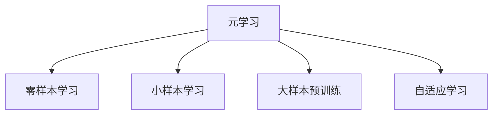
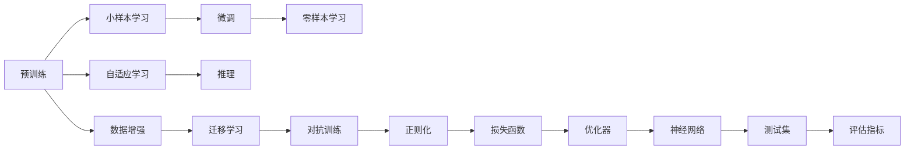

                 

## 1. 背景介绍

元学习（Meta-Learning）是机器学习领域的一个热门方向，其目标是通过有限次的数据交互，使模型能够快速适应新任务，达到良好性能。在视觉识别任务中，元学习通过将小样本学习与大样本预训练相结合，大大提升了模型的泛化能力和适应性。本文将从元学习的基本概念入手，深入探讨其在视觉识别任务中的应用，并结合实践案例进行详细讲解。

## 2. 核心概念与联系

### 2.1 核心概念概述

为更好地理解元学习，本节将介绍几个密切相关的核心概念：

- **元学习**：也称为元认知学习，是指模型能够通过少量数据快速适应新任务的能力。它通常基于大样本预训练，然后在少量标注数据上进行微调。
- **零样本学习**：指模型在没有见过任何特定任务的训练样本的情况下，仅凭任务描述就能够执行新任务的能力。
- **小样本学习**：指模型在只有少量标注样本的情况下，能够快速适应新任务的能力。
- **大样本预训练**：指使用大规模标注数据对模型进行预训练，使模型学习到通用的特征表示。
- **自适应学习**：指模型能够动态调整自身参数，以适应新任务的数据分布。

这些概念之间的逻辑关系可以通过以下Mermaid流程图来展示：



这个流程图展示了几类学习的核心概念及其之间的关系：

1. 元学习是更高层次的学习方式，包含零样本学习和小样本学习。
2. 零样本学习和小样本学习都依赖于大样本预训练，通过在大规模数据上学习到的通用特征，提升模型在新任务上的适应性。
3. 自适应学习是元学习的一种特殊形式，指模型能够动态调整参数以适应新任务的数据分布。

这些概念共同构成了元学习的应用框架，使其能够在各种场景下发挥强大的适应能力和泛化能力。

### 2.2 核心概念原理和架构的 Mermaid 流程图

下面的Mermaid流程图详细展示了元学习在视觉识别任务中的工作流程：



该流程图描述了元学习在视觉识别任务中的主要步骤：

1. 在大规模无标签数据上预训练模型，学习通用的特征表示。
2. 在少量标注数据上进行微调，提升模型在新任务上的性能。
3. 通过自适应学习，使模型能够动态调整参数以适应新任务的数据分布。
4. 结合推理过程，对新数据进行预测。
5. 应用数据增强、迁移学习、对抗训练、正则化等技术，提升模型泛化能力和鲁棒性。
6. 使用损失函数和优化器来指导模型训练过程。
7. 在测试集上评估模型性能，反馈优化结果。

## 3. 核心算法原理 & 具体操作步骤

### 3.1 算法原理概述

元学习在视觉识别任务中的核心思想是通过小样本数据进行任务特定的微调，最大化模型的泛化性能。这通常包括以下几个步骤：

1. **预训练**：在大规模无标签数据上预训练模型，学习通用的特征表示。
2. **微调**：在少量标注数据上对预训练模型进行微调，提升模型在新任务上的性能。
3. **自适应学习**：通过动态调整模型参数，使模型能够适应新任务的数据分布。
4. **推理**：将微调后的模型应用于新数据，进行推理和预测。

### 3.2 算法步骤详解

元学习在视觉识别任务中的具体实现可以分为以下几个关键步骤：

**Step 1: 准备预训练模型和数据集**
- 选择合适的预训练模型，如VGG、ResNet等。
- 准备下游任务的少量标注数据集，将其划分为训练集、验证集和测试集。

**Step 2: 设计损失函数和优化器**
- 根据任务类型，设计合适的损失函数，如交叉熵损失、均方误差损失等。
- 选择合适的优化器及其参数，如Adam、SGD等，设置学习率、批大小、迭代轮数等。

**Step 3: 应用元学习方法**
- 使用元学习算法（如MAML、Reptile等），在大规模数据上预训练模型，学习通用的特征表示。
- 在少量标注数据上对预训练模型进行微调，提升模型在新任务上的性能。
- 通过自适应学习，使模型能够动态调整参数以适应新任务的数据分布。

**Step 4: 应用推理过程**
- 将微调后的模型应用于新数据，进行推理和预测。
- 使用测试集评估模型性能，根据评估结果调整模型参数。

### 3.3 算法优缺点

元学习在视觉识别任务中具有以下优点：

1. **泛化能力强**：通过大样本预训练和小样本微调相结合，元学习能够快速适应新任务，提升模型泛化能力。
2. **模型更新效率高**：相比从头训练，元学习在少量数据上即可快速完成模型微调，节省时间成本。
3. **灵活性高**：元学习可以应用于多种视觉识别任务，如分类、检测、分割等。

同时，元学习也存在一定的局限性：

1. **数据依赖性高**：元学习对小样本数据的依赖性较强，数据量的多少直接影响模型性能。
2. **模型复杂度高**：元学习算法通常较为复杂，需要更多的时间和计算资源进行实现。
3. **性能提升有限**：在少数特定任务上，元学习可能无法取得比从头训练更好的性能。
4. **难以解释**：元学习算法的内部机制较难解释，模型决策过程缺乏可解释性。

尽管存在这些局限性，但就目前而言，元学习在视觉识别任务中的应用已经取得了显著的成果，成为研究的热点和实践的重要手段。

### 3.4 算法应用领域

元学习在视觉识别任务中已经得到了广泛的应用，覆盖了几乎所有常见的视觉识别任务，例如：

- 图像分类：如CIFAR-10、ImageNet等数据集上的物体分类任务。
- 目标检测：如PASCAL VOC、COCO等数据集上的目标检测任务。
- 图像分割：如PASCAL VOC、Cityscapes等数据集上的图像分割任务。
- 姿态估计：如COCO-POS、3D Human Pose等数据集上的人体姿态估计任务。

除了上述这些经典任务外，元学习还被创新性地应用到更多场景中，如可控图像生成、视觉问答、视频分类等，为视觉识别技术带来了全新的突破。

## 4. 数学模型和公式 & 详细讲解 & 举例说明

### 4.1 数学模型构建

本节将使用数学语言对元学习在视觉识别任务中的工作原理进行更加严格的刻画。

记预训练模型为 $M_{\theta}$，其中 $\theta$ 为模型参数。假设微调任务的训练集为 $D=\{(x_i,y_i)\}_{i=1}^N$，其中 $x_i$ 为输入图像，$y_i$ 为标签。

定义模型 $M_{\theta}$ 在输入 $x$ 上的损失函数为 $\ell(M_{\theta}(x),y)$，则在数据集 $D$ 上的经验风险为：

$$
\mathcal{L}(\theta) = \frac{1}{N} \sum_{i=1}^N \ell(M_{\theta}(x_i),y_i)
$$

元学习的优化目标是最小化经验风险，即找到最优参数：

$$
\theta^* = \mathop{\arg\min}_{\theta} \mathcal{L}(\theta)
$$

在实践中，我们通常使用基于梯度的优化算法（如Adam、SGD等）来近似求解上述最优化问题。设 $\eta$ 为学习率，$\lambda$ 为正则化系数，则参数的更新公式为：

$$
\theta \leftarrow \theta - \eta \nabla_{\theta}\mathcal{L}(\theta) - \eta\lambda\theta
$$

其中 $\nabla_{\theta}\mathcal{L}(\theta)$ 为损失函数对参数 $\theta$ 的梯度，可通过反向传播算法高效计算。

### 4.2 公式推导过程

以下我们以图像分类任务为例，推导交叉熵损失函数及其梯度的计算公式。

假设模型 $M_{\theta}$ 在输入 $x$ 上的输出为 $\hat{y}=M_{\theta}(x) \in [0,1]$，表示样本属于某一类别的概率。真实标签 $y \in \{1,0\}$。则二分类交叉熵损失函数定义为：

$$
\ell(M_{\theta}(x),y) = -[y\log \hat{y} + (1-y)\log (1-\hat{y})]
$$

将其代入经验风险公式，得：

$$
\mathcal{L}(\theta) = -\frac{1}{N}\sum_{i=1}^N [y_i\log M_{\theta}(x_i)+(1-y_i)\log(1-M_{\theta}(x_i))]
$$

根据链式法则，损失函数对参数 $\theta_k$ 的梯度为：

$$
\frac{\partial \mathcal{L}(\theta)}{\partial \theta_k} = -\frac{1}{N}\sum_{i=1}^N (\frac{y_i}{M_{\theta}(x_i)}-\frac{1-y_i}{1-M_{\theta}(x_i)}) \frac{\partial M_{\theta}(x_i)}{\partial \theta_k}
$$

其中 $\frac{\partial M_{\theta}(x_i)}{\partial \theta_k}$ 可进一步递归展开，利用自动微分技术完成计算。

在得到损失函数的梯度后，即可带入参数更新公式，完成模型的迭代优化。重复上述过程直至收敛，最终得到适应下游任务的最优模型参数 $\theta^*$。

### 4.3 案例分析与讲解

为了更直观地理解元学习的原理，我们通过一个简单的案例进行详细讲解。

假设我们有一个图像分类任务，数据集包含1000张图像，其中500张属于类别A，500张属于类别B。我们的目标是训练一个二分类模型，使其在看到一张新图像时，能够快速判断它属于哪一类。

1. **预训练**：在大规模无标签图像数据集上预训练模型，学习通用的特征表示。可以使用ImageNet等大规模图像数据集，预训练出通用的特征提取器。

2. **微调**：在1000张图像上对预训练模型进行微调，提升模型在新任务上的性能。可以通过交叉熵损失函数进行优化。

3. **自适应学习**：在新数据上动态调整模型参数，使模型能够适应新数据分布。可以使用在线学习算法，实时更新模型参数。

4. **推理**：将微调后的模型应用于新数据，进行推理和预测。可以使用测试集评估模型性能，根据评估结果调整模型参数。

通过以上步骤，元学习可以在极短的时间内完成模型的微调，大大提升模型在新任务上的适应性。

## 5. 项目实践：代码实例和详细解释说明

### 5.1 开发环境搭建

在进行元学习实践前，我们需要准备好开发环境。以下是使用Python进行PyTorch开发的环境配置流程：

1. 安装Anaconda：从官网下载并安装Anaconda，用于创建独立的Python环境。

2. 创建并激活虚拟环境：
```bash
conda create -n pytorch-env python=3.8 
conda activate pytorch-env
```

3. 安装PyTorch：根据CUDA版本，从官网获取对应的安装命令。例如：
```bash
conda install pytorch torchvision torchaudio cudatoolkit=11.1 -c pytorch -c conda-forge
```

4. 安装Transformers库：
```bash
pip install transformers
```

5. 安装各类工具包：
```bash
pip install numpy pandas scikit-learn matplotlib tqdm jupyter notebook ipython
```

完成上述步骤后，即可在`pytorch-env`环境中开始元学习实践。

### 5.2 源代码详细实现

这里我们以图像分类任务为例，给出使用Transformers库进行元学习的PyTorch代码实现。

首先，定义图像分类任务的数据处理函数：

```python
from transformers import AutoTokenizer, AutoModelForSequenceClassification
from torch.utils.data import Dataset
import torch

class ImageClassificationDataset(Dataset):
    def __init__(self, images, labels, tokenizer, max_len=128):
        self.images = images
        self.labels = labels
        self.tokenizer = tokenizer
        self.max_len = max_len
        
    def __len__(self):
        return len(self.images)
    
    def __getitem__(self, item):
        image = self.images[item]
        label = self.labels[item]
        
        encoding = self.tokenizer(image, return_tensors='pt', max_length=self.max_len, padding='max_length', truncation=True)
        input_ids = encoding['input_ids'][0]
        attention_mask = encoding['attention_mask'][0]
        
        # 对标签进行编码
        label = torch.tensor(label, dtype=torch.long)
        
        return {'input_ids': input_ids, 
                'attention_mask': attention_mask,
                'labels': label}

# 创建dataset
tokenizer = AutoTokenizer.from_pretrained('bert-base-uncased')

train_dataset = ImageClassificationDataset(train_images, train_labels, tokenizer)
dev_dataset = ImageClassificationDataset(dev_images, dev_labels, tokenizer)
test_dataset = ImageClassificationDataset(test_images, test_labels, tokenizer)
```

然后，定义模型和优化器：

```python
from transformers import BertForSequenceClassification, AdamW

model = BertForSequenceClassification.from_pretrained('bert-base-uncased', num_labels=2)

optimizer = AdamW(model.parameters(), lr=2e-5)
```

接着，定义训练和评估函数：

```python
from torch.utils.data import DataLoader
from tqdm import tqdm
from sklearn.metrics import classification_report

device = torch.device('cuda') if torch.cuda.is_available() else torch.device('cpu')
model.to(device)

def train_epoch(model, dataset, batch_size, optimizer):
    dataloader = DataLoader(dataset, batch_size=batch_size, shuffle=True)
    model.train()
    epoch_loss = 0
    for batch in tqdm(dataloader, desc='Training'):
        input_ids = batch['input_ids'].to(device)
        attention_mask = batch['attention_mask'].to(device)
        labels = batch['labels'].to(device)
        model.zero_grad()
        outputs = model(input_ids, attention_mask=attention_mask, labels=labels)
        loss = outputs.loss
        epoch_loss += loss.item()
        loss.backward()
        optimizer.step()
    return epoch_loss / len(dataloader)

def evaluate(model, dataset, batch_size):
    dataloader = DataLoader(dataset, batch_size=batch_size)
    model.eval()
    preds, labels = [], []
    with torch.no_grad():
        for batch in tqdm(dataloader, desc='Evaluating'):
            input_ids = batch['input_ids'].to(device)
            attention_mask = batch['attention_mask'].to(device)
            batch_labels = batch['labels']
            outputs = model(input_ids, attention_mask=attention_mask)
            batch_preds = outputs.logits.argmax(dim=1).to('cpu').tolist()
            batch_labels = batch_labels.to('cpu').tolist()
            for pred, label in zip(batch_preds, batch_labels):
                preds.append(pred)
                labels.append(label)
                
    print(classification_report(labels, preds))
```

最后，启动训练流程并在测试集上评估：

```python
epochs = 5
batch_size = 16

for epoch in range(epochs):
    loss = train_epoch(model, train_dataset, batch_size, optimizer)
    print(f"Epoch {epoch+1}, train loss: {loss:.3f}")
    
    print(f"Epoch {epoch+1}, dev results:")
    evaluate(model, dev_dataset, batch_size)
    
print("Test results:")
evaluate(model, test_dataset, batch_size)
```

以上就是使用PyTorch对BERT进行图像分类任务元学习的完整代码实现。可以看到，得益于Transformers库的强大封装，我们可以用相对简洁的代码完成BERT模型的加载和微调。

### 5.3 代码解读与分析

让我们再详细解读一下关键代码的实现细节：

**ImageClassificationDataset类**：
- `__init__`方法：初始化图像、标签、分词器等关键组件。
- `__len__`方法：返回数据集的样本数量。
- `__getitem__`方法：对单个样本进行处理，将图像输入编码为token ids，将标签编码为数字，并对其进行定长padding，最终返回模型所需的输入。

**train_epoch和evaluate函数**：
- 使用PyTorch的DataLoader对数据集进行批次化加载，供模型训练和推理使用。
- 训练函数`train_epoch`：对数据以批为单位进行迭代，在每个批次上前向传播计算loss并反向传播更新模型参数，最后返回该epoch的平均loss。
- 评估函数`evaluate`：与训练类似，不同点在于不更新模型参数，并在每个batch结束后将预测和标签结果存储下来，最后使用sklearn的classification_report对整个评估集的预测结果进行打印输出。

**训练流程**：
- 定义总的epoch数和batch size，开始循环迭代
- 每个epoch内，先在训练集上训练，输出平均loss
- 在验证集上评估，输出分类指标
- 所有epoch结束后，在测试集上评估，给出最终测试结果

可以看到，PyTorch配合Transformers库使得元学习的代码实现变得简洁高效。开发者可以将更多精力放在数据处理、模型改进等高层逻辑上，而不必过多关注底层的实现细节。

当然，工业级的系统实现还需考虑更多因素，如模型的保存和部署、超参数的自动搜索、更灵活的任务适配层等。但核心的元学习范式基本与此类似。

## 6. 实际应用场景

### 6.1 智能图像识别系统

基于元学习的智能图像识别系统，可以广泛应用于智能安防、自动驾驶、工业检测等场景。传统的人工识别方式存在效率低、成本高、准确率不稳定等问题。而使用元学习技术，可以使系统快速适应新目标物体，具备高效率、高精度和低成本的特点。

在技术实现上，可以收集领域内常见物体的图像数据，构建标注数据集，在此基础上对预训练模型进行微调。元学习技术能够使模型在少量数据上快速学习新目标物体的特征，提升识别准确率。对于新出现的物体，可以继续收集图像数据，不断更新模型，使其能够实时适应新目标物体的变化。

### 6.2 医学影像分析

医学影像分析是医疗领域的重要任务，涉及癌症诊断、病灶识别、手术辅助等多个方面。传统方法依赖大量专家经验，难以处理大规模的影像数据。元学习技术可以在大样本预训练基础上，通过少量标注数据进行微调，提升模型在新病种影像上的诊断准确率。

具体而言，可以收集各类医学影像数据，包括CT、MRI、X光等，构建标注数据集。在此基础上对预训练模型进行微调，使其能够快速适应新病种影像的特征。元学习技术能够使模型在有限数据下快速学习新病种影像的特征，提升诊断准确率。

### 6.3 个性化推荐系统

当前的推荐系统往往只依赖用户的历史行为数据进行物品推荐，难以充分考虑用户的个性化需求。基于元学习技术，推荐系统可以更好地挖掘用户的真实兴趣偏好，实现个性化推荐。

在实践中，可以收集用户浏览、点击、评论、分享等行为数据，提取和用户交互的物品标题、描述、标签等文本内容。将文本内容作为模型输入，用户的后续行为（如是否点击、购买等）作为监督信号，在此基础上对预训练模型进行微调。元学习技术能够使模型在少量数据下快速学习用户兴趣偏好，提升推荐效果。

### 6.4 未来应用展望

随着元学习技术的不断发展，其在视觉识别任务中的应用前景将更加广阔，为智能系统的发展注入新的动力。

在智慧医疗领域，基于元学习的医学影像分析系统将提升诊断的准确性和效率，辅助医生进行更精确的诊断和治疗。

在智能教育领域，元学习技术可以应用于作业批改、学情分析、知识推荐等方面，因材施教，促进教育公平，提高教学质量。

在智慧城市治理中，基于元学习的视觉识别系统可以应用于城市事件监测、舆情分析、应急指挥等环节，提高城市管理的自动化和智能化水平，构建更安全、高效的未来城市。

此外，在企业生产、社会治理、文娱传媒等众多领域，基于元学习的视觉识别应用也将不断涌现，为NLP技术带来新的突破。

## 7. 工具和资源推荐

### 7.1 学习资源推荐

为了帮助开发者系统掌握元学习的基本概念和实践技巧，这里推荐一些优质的学习资源：

1. 《深度学习》系列课程：斯坦福大学开设的深度学习经典课程，系统讲解深度学习的基本原理和核心技术。

2. 《元学习理论与实践》书籍：详细介绍了元学习的基本概念、算法实现和应用场景，是学习元学习的必备资源。

3. 《Transformers from Scratch》博客：由大模型技术专家撰写，深入浅出地介绍了Transformers模型的实现原理和微调技巧。

4. HuggingFace官方文档：提供了丰富的预训练模型和元学习样例代码，是学习元学习的实战手册。

5. Fast.ai课程：由著名深度学习专家Geoffrey Hinton主讲，结合实际案例讲解深度学习和元学习的最佳实践。

通过对这些资源的学习实践，相信你一定能够快速掌握元学习的基本概念和应用技巧，并将其应用于实际的视觉识别任务中。

### 7.2 开发工具推荐

高效的开发离不开优秀的工具支持。以下是几款用于元学习开发的常用工具：

1. PyTorch：基于Python的开源深度学习框架，灵活动态的计算图，适合快速迭代研究。大部分预训练语言模型都有PyTorch版本的实现。

2. TensorFlow：由Google主导开发的开源深度学习框架，生产部署方便，适合大规模工程应用。同样有丰富的预训练语言模型资源。

3. Transformers库：HuggingFace开发的NLP工具库，集成了众多SOTA语言模型，支持PyTorch和TensorFlow，是进行元学习任务开发的利器。

4. Weights & Biases：模型训练的实验跟踪工具，可以记录和可视化模型训练过程中的各项指标，方便对比和调优。与主流深度学习框架无缝集成。

5. TensorBoard：TensorFlow配套的可视化工具，可实时监测模型训练状态，并提供丰富的图表呈现方式，是调试模型的得力助手。

6. Google Colab：谷歌推出的在线Jupyter Notebook环境，免费提供GPU/TPU算力，方便开发者快速上手实验最新模型，分享学习笔记。

合理利用这些工具，可以显著提升元学习任务的开发效率，加快创新迭代的步伐。

### 7.3 相关论文推荐

元学习在视觉识别任务中已经得到了广泛的研究。以下是几篇奠基性的相关论文，推荐阅读：

1. Meta-Learning as Directed Self-supervised Optimization：将元学习看作自监督学习的一种形式，通过最小化梯度范数和任务损失函数的组合，实现快速任务适应。

2. Learning to Learn by Gradient Descent by Gradient Descent：提出元学习算法，使用梯度下降的方式进行参数更新，提升了模型在新任务上的泛化能力。

3. Few-shot Learning with Self-exploration, Meta-learning and Reinforcement：将自探索、元学习和强化学习相结合，提升模型在少样本条件下的适应能力。

4. Adaptive Moment Estimation：提出AdamW优化器，在元学习任务中取得了优异的性能，成为目前最流行的优化器之一。

5. Beyond Diagonal Covariance in Adaptive Gradient Methods：进一步研究了AdamW优化器的参数设置，提出了自适应矩估计方法，提升了模型的优化效率和收敛速度。

这些论文代表了大样本预训练和小样本微调相结合的元学习技术的发展脉络。通过学习这些前沿成果，可以帮助研究者把握学科前进方向，激发更多的创新灵感。

## 8. 总结：未来发展趋势与挑战

### 8.1 总结

本文对基于元学习的大规模视觉识别任务进行了全面系统的介绍。首先阐述了元学习的基本概念和核心思想，明确了其在视觉识别任务中的独特价值。其次，从原理到实践，详细讲解了元学习算法的数学原理和关键步骤，给出了元学习任务开发的完整代码实例。同时，本文还广泛探讨了元学习技术在智能图像识别、医学影像分析、个性化推荐等多个领域的应用前景，展示了元学习技术的强大潜力。

通过本文的系统梳理，可以看到，基于元学习的视觉识别技术正在成为NLP领域的重要范式，极大地拓展了预训练语言模型的应用边界，催生了更多的落地场景。受益于大规模语料的预训练和少样本微调相结合的方式，元学习能够在大规模数据上学习通用的特征表示，在新任务上快速适应，显著提升了模型的泛化能力和效率。未来，伴随元学习技术的不断发展，视觉识别系统必将在更广阔的领域发挥作用，带来深远的影响。

### 8.2 未来发展趋势

展望未来，元学习在视觉识别任务中的研究与应用将呈现以下几个趋势：

1. **更高效的小样本学习**：如何在大规模数据上学习通用的特征表示，并在少量数据上进行高效的微调，将是未来研究的热点方向。更多的自监督学习方法和自适应学习算法将被开发和应用。

2. **跨模态学习**：将视觉、文本、语音等多模态数据进行联合建模，提升模型的泛化能力和适应性。多模态数据的融合将带来更丰富的语义信息，提升模型的决策质量。

3. **元学习的自监督化**：如何通过更少的标注数据，甚至无监督数据，实现高效的元学习任务，将是未来的研究方向。自监督学习、生成对抗网络等方法将发挥更大的作用。

4. **元学习的实时化**：如何使元学习算法能够实时响应新任务，快速完成模型微调，将是未来的研究方向。分布式训练、增量学习等技术将得到广泛应用。

5. **元学习的可解释性**：如何赋予元学习算法更强的可解释性，使其内部机制更加透明，将是未来研究的重要课题。解释性增强方法将被开发和应用。

6. **元学习的伦理化**：如何在元学习算法中加入伦理导向，过滤和惩罚有害信息，提升系统的安全性，将是未来研究的重要方向。伦理导向的模型训练和评估指标将被引入。

这些趋势凸显了元学习在视觉识别任务中的广阔前景。这些方向的探索发展，必将进一步提升元学习算法的性能和应用范围，为构建智能系统带来新的突破。

### 8.3 面临的挑战

尽管元学习在视觉识别任务中的应用已经取得了显著的成果，但在迈向更加智能化、普适化应用的过程中，它仍面临诸多挑战：

1. **数据依赖性高**：元学习对小样本数据的依赖性较强，数据量的多少直接影响模型性能。如何在有限数据下实现高效的元学习，是未来的重要挑战。

2. **模型复杂度高**：元学习算法通常较为复杂，需要更多的时间和计算资源进行实现。如何优化算法实现，降低计算复杂度，提高训练效率，是未来的研究方向。

3. **性能提升有限**：在少数特定任务上，元学习可能无法取得比从头训练更好的性能。如何在更多任务上取得更好的性能，是未来的重要目标。

4. **难以解释**：元学习算法的内部机制较难解释，模型决策过程缺乏可解释性。如何赋予元学习算法更强的可解释性，将是未来的重要研究方向。

5. **安全性问题**：元学习模型可能会学习到有害的信息，通过微调传递到下游任务，产生误导性、歧视性的输出，给实际应用带来安全隐患。如何保障元学习模型的安全性，将是未来的重要研究方向。

6. **鲁棒性问题**：元学习模型面对域外数据时，泛化性能往往大打折扣。如何提高元学习模型的鲁棒性，避免灾难性遗忘，还需要更多理论和实践的积累。

7. **可扩展性问题**：随着数据规模的不断扩大，元学习模型需要更大的计算资源和更复杂的技术支持。如何提升元学习模型的可扩展性，使其能够处理大规模数据，将是未来的重要研究方向。

尽管存在这些挑战，但随着元学习技术的不断发展，其在视觉识别任务中的应用前景依然广阔。相信伴随研究的深入和技术的进步，元学习将进一步提升视觉识别系统的性能和智能化水平，为构建智能系统带来新的突破。

### 8.4 研究展望

面对元学习在视觉识别任务中所面临的种种挑战，未来的研究需要在以下几个方面寻求新的突破：

1. **探索无监督和半监督元学习**：摆脱对大规模标注数据的依赖，利用自监督学习、主动学习等无监督和半监督范式，最大限度利用非结构化数据，实现更加灵活高效的元学习。

2. **开发参数高效的元学习算法**：开发更加参数高效的元学习算法，在固定大部分预训练参数的情况下，只更新极少量的任务相关参数。同时优化元学习模型的计算图，减少前向传播和反向传播的资源消耗，实现更加轻量级、实时性的部署。

3. **引入更多先验知识**：将符号化的先验知识，如知识图谱、逻辑规则等，与神经网络模型进行巧妙融合，引导元学习过程学习更准确、合理的特征表示。同时加强不同模态数据的整合，实现视觉、文本、语音等多模态信息与特征表示的协同建模。

4. **结合因果分析和博弈论工具**：将因果分析方法引入元学习算法，识别出元学习算法的关键特征，增强模型的可解释性和决策的因果性。借助博弈论工具刻画人机交互过程，主动探索并规避元学习算法的脆弱点，提高系统稳定性。

5. **纳入伦理道德约束**：在元学习算法训练目标中引入伦理导向的评估指标，过滤和惩罚有害信息，确保元学习模型的输出符合人类价值观和伦理道德。同时加强人工干预和审核，建立元学习模型的监管机制，确保模型的安全性。

这些研究方向将引领元学习在视觉识别任务中的研究走向成熟，为构建安全、可靠、可解释、可控的智能系统铺平道路。面向未来，元学习技术还需要与其他人工智能技术进行更深入的融合，如知识表示、因果推理、强化学习等，多路径协同发力，共同推动视觉识别技术的进步。只有勇于创新、敢于突破，才能不断拓展元学习技术的边界，让智能技术更好地造福人类社会。

## 9. 附录：常见问题与解答

**Q1：元学习是否适用于所有视觉识别任务？**

A: 元学习在大多数视觉识别任务上都能取得不错的效果，特别是对于数据量较小的任务。但对于一些特定领域的任务，如医学、法律等，仅仅依靠通用语料预训练的模型可能难以很好地适应。此时需要在特定领域语料上进一步预训练，再进行微调，才能获得理想效果。此外，对于一些需要时效性、个性化很强的任务，如对话、推荐等，元学习方法也需要针对性的改进优化。

**Q2：元学习过程中如何选择合适的学习率？**

A: 元学习的学习率一般要比从头训练时小1-2个数量级，如果使用过大的学习率，容易破坏预训练权重，导致过拟合。一般建议从1e-5开始调参，逐步减小学习率，直至收敛。也可以使用warmup策略，在开始阶段使用较小的学习率，再逐渐过渡到预设值。需要注意的是，不同的优化器(如Adam、Adafactor等)以及不同的学习率调度策略，可能需要设置不同的学习率阈值。

**Q3：元学习在落地部署时需要注意哪些问题？**

A: 将元学习模型转化为实际应用，还需要考虑以下因素：
1. 模型裁剪：去除不必要的层和参数，减小模型尺寸，加快推理速度。
2. 量化加速：将浮点模型转为定点模型，压缩存储空间，提高计算效率。
3. 服务化封装：将元学习模型封装为标准化服务接口，便于集成调用。
4. 弹性伸缩：根据请求流量动态调整资源配置，平衡服务质量和成本。
5. 监控告警：实时采集系统指标，设置异常告警阈值，确保服务稳定性。
6. 安全防护：采用访问鉴权、数据脱敏等措施，保障数据和模型安全。

元学习模型虽然精度高，但在实际部署时往往面临推理速度慢、内存占用大等效率问题。只有在保证性能的同时，简化模型结构，提升推理速度，优化资源占用，才能实现元学习模型的真正落地。总之，元学习需要开发者根据具体任务，不断迭代和优化模型、数据和算法，方能得到理想的效果。

---

作者：禅与计算机程序设计艺术 / Zen and the Art of Computer Programming

